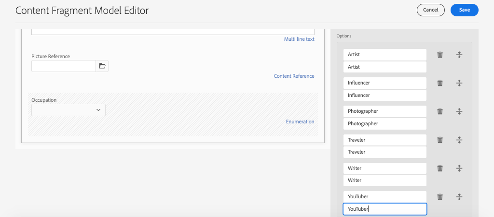

# 컨텐츠 조각 모델 정의 {#content-fragment-models}

이 장에서는 **컨텐츠 조각 모델**&#x200B;을 사용하여 컨텐츠를 모델링하고 스키마를 구축하는 방법을 알아봅니다. 기존 모델을 검토하고 새 모델을 만듭니다. 또한 모델의 일부로 스키마를 정의하는 데 사용할 수 있는 다양한 데이터 유형에 대해서도 학습합니다.

이 장에서는 **기여자**&#x200B;에 대한 새 모델을 만듭니다. 이 모델은 WKND 브랜드의 일부로 매거진과 모험 컨텐츠를 작성하는 사용자를 위한 데이터 모델입니다.

## 전제 조건 {#prerequisites}

이 작업은 여러 부분으로 구성된 자습서이며 [빠른 설정](./setup.md)에 설명된 단계가 완료되었다고 가정합니다.

## 목표 {#objectives}

* 새 컨텐츠 조각 모델을 만듭니다.
* 모델 작성을 위해 사용 가능한 데이터 유형과 유효성 검사 옵션을 식별합니다.
* 컨텐츠 조각 모델이 **모두**&#x200B;데이터 스키마와 컨텐츠 조각에 대한 작성 템플릿을 정의하는 방법을 이해합니다.

## 컨텐츠 조각 모델 개요 {#overview}

>[!VIDEO](https://video.tv.adobe.com/v/22452/?quality=12&learn=on)

위의 비디오에서는 컨텐츠 조각 모델 작업에 대한 높은 수준의 개요를 제공합니다.

>[!CAUTION]
>
> 위의 비디오에서는 **Contributor** 모델을 만드는 방법을 `Contributors` 이름으로 보여줍니다. 자체 환경에서 단계를 수행할 때 제목에 단일 양식이 사용되는지 확인하십시오.**s** 없이 `Contributor`. 컨텐츠 조각 모델 이름을 지정하면 자습서에서 나중에 수행될 GraphQL API 호출을 구동합니다.

## Inspect the Adventure Content Fragment Model

이전 장에서는 여러 모험 컨텐츠 조각이 편집되어 외부 애플리케이션에 표시되었습니다. Adventure 컨텐츠 조각 모델 을 검사하여 이러한 조각의 기본 데이터 스키마를 이해하겠습니다.

1. **AEM 시작** 메뉴에서 **도구** > **자산** > **컨텐츠 조각 모델**&#x200B;으로 이동합니다.

   

1. **WKND 사이트** 폴더로 이동하고 **Adventure** 컨텐츠 조각 모델 위로 마우스를 가져간 다음 **편집** 아이콘(연필)을 클릭하여 모델을 엽니다.

   

1. 그러면 **컨텐츠 조각 모델 편집기**&#x200B;가 열립니다. 필드에 **단일 행 텍스트**, **다중 행 텍스트**, **열거형** 및 **컨텐츠 참조**&#x200B;와 같은 다른 **데이터 유형**&#x200B;이 포함되어 있음을 관찰합니다.

1. 편집기의 오른쪽 열에는 컨텐츠 조각 작성에 사용되는 양식 필드를 정의하는 사용 가능한 **데이터 유형**&#x200B;이 나열됩니다.

1. 주 패널에서 **제목** 필드를 선택합니다. 오른쪽 열에서 **속성** 탭을 클릭합니다.

   

   **속성 이름** 필드가 `adventureTitle`로 설정되어 있는지 확인합니다. AEM에 지속되는 속성의 이름을 정의합니다. **속성 이름**&#x200B;도 이 속성의 **키** 이름을 데이터 스키마의 일부로 정의합니다. 이 **키**&#x200B;는 GraphQL API를 통해 컨텐츠 조각 데이터가 노출될 때 사용됩니다.

   >[!CAUTION]
   >
   > **after** 컨텐츠 조각이 모델에서 파생된 필드의 **속성 이름**&#x200B;을 수정하면 다운스트림 효과가 있습니다. 기존 조각의 필드 값은 더 이상 참조되지 않으며 GraphQL에 의해 노출된 데이터 스키마가 변경되어 기존 애플리케이션에 영향을 줍니다.

1. **속성** 탭에서 아래로 스크롤하여 **유효성 검사 유형** 드롭다운을 봅니다.

   

   **전자 메일** 및 **URL**&#x200B;에 대한 기본 양식 유효성 검사를 사용할 수 있습니다. 정규 표현식을 사용하여 **사용자 지정** 유효성 검사를 정의할 수도 있습니다.

1. **취소**&#x200B;를 클릭하여 컨텐츠 조각 모델 편집기를 닫습니다.

## 기여자 모델 만들기

다음으로, **기여자**&#x200B;에 대한 새 모델을 만듭니다. 이 모델은 WKND 브랜드의 일부로 매거진과 모험 컨텐츠를 작성하는 사용자를 위한 데이터 모델입니다.

1. 오른쪽 위 모서리에서 **만들기**&#x200B;를 클릭하여 **모델 만들기** 마법사를 표시합니다.
1. **모델 제목**&#x200B;에 대해 다음을 입력합니다.**기여자**&#x200B;를 클릭하고 **만들기**&#x200B;를 클릭합니다.

   

   **열기**&#x200B;를 클릭하여 새로 만든 모델을 엽니다.

1. **단일 행 텍스트** 요소를 주 패널에 드래그하여 놓습니다. **속성** 탭에 다음 속성을 입력합니다.

   * **필드 레이블**: **전체 이름**
   * **속성 이름**: `fullName`
   * **필수** 확인

   

1. **데이터 유형** 탭을 클릭하고 **전체 이름** 필드 아래에 있는 **여러 줄 텍스트** 필드를 드래그하여 놓습니다. 다음 속성을 입력합니다.

   * **필드 레이블**: **전기**
   * **속성 이름**: `biographyText`
   * **기본 유형**: **리치 텍스트**

1. **데이터 유형** 탭을 클릭하고 **컨텐츠 참조** 필드를 드래그하여 놓습니다. 다음 속성을 입력합니다.

   * **필드 레이블**: **그림 참조**
   * **속성 이름**: `pictureReference`
   * **루트 경로**: `/content/dam/wknd`

   **루트 경로**&#x200B;를 구성할 때 **폴더** 아이콘을 클릭하여 경로를 선택하는 모달을 표시할 수 있습니다. 이렇게 하면 작성자가 경로를 채우는 데 사용할 수 있는 폴더가 제한됩니다.

   

1. **그림 참조**&#x200B;에 유효성 검사를 추가하여 **이미지**&#x200B;의 컨텐츠 유형만 사용하여 필드를 채울 수 있습니다.

   

1. **데이터 유형** 탭을 클릭하고 **그림 참조** 필드 아래에 있는 **열거형** 데이터 유형을 끌어다 놓습니다. 다음 속성을 입력합니다.

   * **필드 레이블**: **직업**
   * **속성 이름**: `occupation`

1. **옵션** 단추를 사용하여 여러 **옵션**&#x200B;을 추가합니다. **옵션 레이블** 및 **옵션 값**&#x200B;에 동일한 값을 사용합니다.

   **아티스트**,  **영향력 있는 사용자**,  **사진사**,  **트래블러**,  **작성기**,  **YouTube**

   

1. 최종 **기여자** 모델은 다음과 같아야 합니다.

   

1. **저장**&#x200B;을 클릭하여 변경 내용을 저장합니다.

## 기여자 모델 활성화

컨텐츠 작성자가 컨텐츠 조각 모델을 사용하려면 컨텐츠 조각 모델이 **활성화됨**&#x200B;이어야 합니다. 컨텐츠 조각 모델을 **비활성화**&#x200B;할 수 있으므로 작성자가 사용할 수 없습니다. 모델의 필드 **속성 이름**&#x200B;을 수정하면 기본 데이터 스키마가 변경되며 기존 조각 및 외부 응용 프로그램에 상당한 다운스트림 효과가 있을 수 있습니다. 사용자에 대해 컨텐츠 조각 모델을 활성화하기 전에 필드의 **속성 이름**&#x200B;에 사용되는 이름 지정 규칙을 신중하게 계획하는 것이 좋습니다.

1. **Contributor** 모델이 현재 **Enabled** 상태에 있는지 확인합니다.

   

   카드 위로 마우스를 이동하고 **비활성화** / **활성화** 아이콘을 클릭하여 컨텐츠 조각 모델의 상태를 전환할 수 있습니다.

## 축하합니다! {#congratulations}

축하합니다. 첫 번째 컨텐츠 조각 모델을 만들었습니다!

## 다음 단계 {#next-steps}

다음 장, [컨텐츠 조각 모델 작성](author-content-fragments.md)에서 컨텐츠 조각 모델을 기반으로 새 컨텐츠 조각을 만들고 편집합니다. 컨텐츠 조각의 변형을 만드는 방법도 알아봅니다.