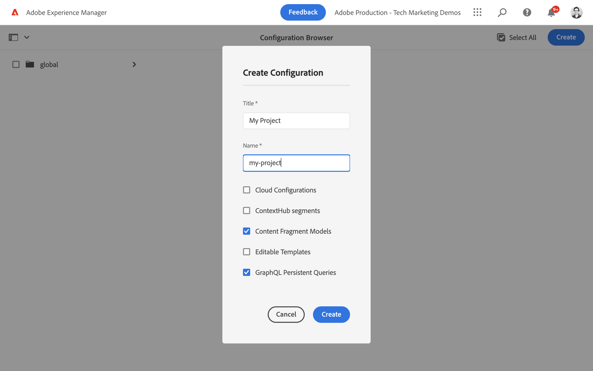
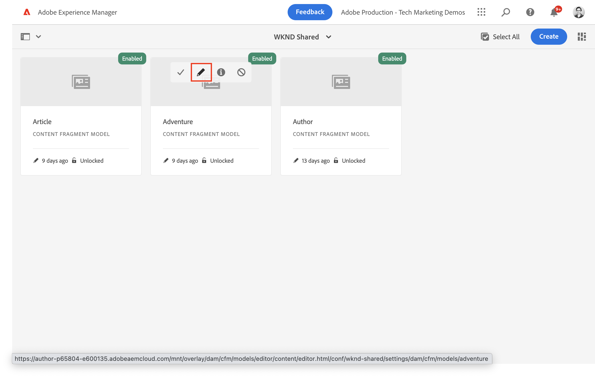

# 컨텐츠 조각 모델 정의 {#content-fragment-models}

이 장에서는 컨텐츠를 모델링하고 스키마를 구축하는 방법을 알아봅니다 **컨텐츠 조각 모델**. 스키마를 모델의 일부로 정의하는 데 사용할 수 있는 다양한 데이터 유형에 대해 알아봅니다.

이 장에서 두 가지 간단한 모델들이 만들어져서 **팀** 및 **개인**. 다음 **팀** 데이터 모델에는 이름, 짧은 이름 및 설명 및 참조가 있습니다 **개인** 전체 이름, 생체 정보, 프로필 사진 및 직업 목록이 있는 데이터 모델.

기본 단계에 따라 모델을 직접 만들고 GraphQL 쿼리 및 React 앱 코드와 같은 각 단계를 조정하거나 이러한 장에 설명된 단계를 따를 수도 있습니다.

## 사전 요구 사항 {#prerequisites}

이 튜토리얼은 여러 부분으로 구성된 튜토리얼이며 [AEM 작성자 환경을 사용할 수 있습니다.](./overview.md#prerequisites) 원할 경우 [WKND 공유 샘플 콘텐츠가 설치되었습니다](./overview.md#install-sample-content).

## 목표 {#objectives}

* 새 컨텐츠 조각 모델을 만듭니다.
* 모델 작성을 위해 사용 가능한 데이터 유형과 유효성 검사 옵션을 식별합니다.
* 컨텐츠 조각 모델이 정의하는 방법을 이해합니다 **둘 다** 컨텐츠 조각에 대한 데이터 스키마 및 작성 템플릿입니다.

## 새 프로젝트 구성 만들기

프로젝트 구성에는 특정 프로젝트와 연관된 모든 컨텐츠 조각 모델이 포함되어 있으며 모델을 구성하는 방법을 제공합니다. 하나 이상의 프로젝트를 만들어야 합니다 **이전** 새 컨텐츠 조각 모델 생성.

1. AEM에 로그인합니다. **작성자** 환경.
1. AEM 시작 화면에서 로 이동합니다. **도구** > **일반** > **구성 브라우저**.

   
1. **만들기**&#x200B;를 클릭합니다.
1. 결과 대화 상자에서 다음을 입력합니다.

   * 제목*: **내 프로젝트**
   * 이름*: **내 프로젝트** (단어를 구분하기 위해 하이픈을 사용하여 모두 소문자로 사용하는 것이 좋습니다. 이 문자열은 클라이언트 응용 프로그램이 요청을 수행하는 고유한 GraphQL 끝점에 영향을 줍니다.)
   * 확인 **컨텐츠 조각 모델**
   * 확인 **GraphQL 영구 쿼리**

   

## 컨텐츠 조각 모델 만들기

다음으로, **팀** 그리고 **개인**.

### 개인 모델 생성

에 대한 새 모델 만들기 **개인**: 팀의 일부인 사람을 나타내는 데이터 모델입니다.

1. AEM 시작 화면에서 로 이동합니다. **도구** > **일반** > **컨텐츠 조각 모델**.

   

   를 설치한 경우 [샘플 컨텐츠](overview.md#install-sample-content) 그러면 두 개의 폴더가 표시됩니다. **내 프로젝트** 및 **WKND 공유**.
1. 로 이동합니다. **내 프로젝트** 폴더를 입력합니다.
1. 탭 **만들기** 오른쪽 상단 모서리에서 **모델 만들기** 마법사
1. 대상 **모델 제목** 다음을 입력합니다. **개인** 탭 **만들기**.

   탭 **열기** 결과 대화상자에서 새로 생성된 모델을 엽니다.

1. 끌어다 놓기 **한 줄 텍스트** 요소를 기본 패널에 추가합니다. 에 다음 속성을 입력합니다. **속성** 탭:

   * **필드 레이블**: **전체 이름**
   * **속성 이름**: `fullName`
   * 확인 **필수 여부**

   

   다음 **속성 이름** AEM에 지속되는 속성의 이름을 정의합니다. 다음 **속성 이름** 또한 은 **key** 데이터 스키마의 일부로 이 속성의 이름입니다. 이 **key** GraphQL API를 통해 컨텐츠 조각 데이터가 노출될 때 사용됩니다.

1. 탭하기 **데이터 유형** 탭 및 드래그하여 놓기 **여러 줄 텍스트** 아래 필드 **전체 이름** 필드. 다음 속성을 입력합니다.

   * **필드 레이블**: **전기**
   * **속성 이름**: `biographyText`
   * **기본 유형**: **리치 텍스트**

1. 을(를) 클릭합니다. **데이터 유형** 탭 및 드래그하여 놓기 **컨텐츠 참조** 필드. 다음 속성을 입력합니다.

   * **필드 레이블**: **프로필 사진**
   * **속성 이름**: `profilePicture`
   * **루트 경로**: `/content/dam`

   구성 시 **루트 경로** 을 클릭하여 **폴더** 아이콘을 클릭하여 경로를 선택하는 모달을 표시합니다. 이렇게 하면 작성자가 경로를 채우는 데 사용할 수 있는 폴더가 제한됩니다. `/content/dam` 모든 AEM 자산(이미지, 비디오, 기타 컨텐츠 조각)이 저장되는 루트입니다.

1. 에 유효성 검사 추가 **그림 참조** 따라서 **이미지** 를 사용하여 필드를 채울 수 있습니다.

   

1. 을(를) 클릭합니다. **데이터 유형** 탭 및 드래그하여 놓기 **열거형**  아래의 데이터 유형 **그림 참조** 필드. 다음 속성을 입력합니다.

   * **다음으로 렌더링**: **확인란**
   * **필드 레이블**: **직업**
   * **속성 이름**: `occupation`

1. 몇 개 추가 **옵션** 사용 **옵션 추가** 버튼을 클릭합니다. 에 동일한 값 사용 **옵션 레이블** 및 **옵션 값**:

   **아티스트**, **영향력 있는 사용자**, **사진사**, **여행자**, **작성기**, **YouTuber**

1. 마지막 **개인** 모델은 다음과 같습니다.

   

1. 클릭 **저장** 변경 사항을 저장하려면 을 클릭합니다.

### 팀 모델 만들기

에 대한 새 모델 만들기 **팀**: 사람 팀의 데이터 모델입니다. 팀 모델은 개인 모델을 참조하여 팀의 멤버를 나타냅니다.

1. 에서 **내 프로젝트** 폴더, 탭 **만들기** 오른쪽 상단 모서리에서 **모델 만들기** 마법사
1. 대상 **모델 제목** 다음을 입력합니다. **팀** 탭 **만들기**.

   탭 **열기** 결과 대화상자에서 새로 생성된 모델을 엽니다.

1. 끌어다 놓기 **한 줄 텍스트** 요소를 기본 패널에 추가합니다. 에 다음 속성을 입력합니다. **속성** 탭:

   * **필드 레이블**: **제목**
   * **속성 이름**: `title`
   * 확인 **필수 여부**

1. 탭하기 **데이터 유형** 탭 및 끌어 놓기 **한 줄 텍스트** 요소를 기본 패널에 추가합니다. 에 다음 속성을 입력합니다. **속성** 탭:

   * **필드 레이블**: **짧은 이름**
   * **속성 이름**: `shortName`
   * 확인 **필수 여부**
   * 확인 **고유**
   * 아래 **유효성 검사 유형** > 선택 **사용자 지정**
   * 아래 **사용자 지정 유효성 검사 RegEx** > enter `^[a-z0-9\-_]{5,40}$` - 5자에서 40자 사이의 소문자 영숫자 값과 대시만 입력할 수 있습니다.

   다음 `shortName` 속성은 단축 경로를 기반으로 개별 팀을 쿼리하는 방법을 제공합니다. 다음 **고유** 을 설정하면 값이 항상 이 모델의 컨텐츠 조각마다 고유해집니다.

1. 탭하기 **데이터 유형** 탭 및 드래그하여 놓기 **여러 줄 텍스트** 아래 필드 **짧은 이름** 필드. 다음 속성을 입력합니다.

   * **필드 레이블**: **설명**
   * **속성 이름**: `description`
   * **기본 유형**: **리치 텍스트**

1. 을(를) 클릭합니다. **데이터 유형** 탭 및 드래그하여 놓기 **조각 참조** 필드. 다음 속성을 입력합니다.

   * **다음으로 렌더링**: **여러 필드**
   * **필드 레이블**: **팀 구성원**
   * **속성 이름**: `teamMembers`
   * **허용된 컨텐츠 조각 모델**: 폴더 아이콘을 사용하여 **개인** 모델.

1. 마지막 **팀** 모델은 다음과 같습니다.

   

1. 클릭 **저장** 변경 사항을 저장하려면 을 클릭합니다.

1. 이제 다음 두 가지 모델을 사용할 수 있습니다.

   

## WKND 컨텐츠 조각 모델을 Inspect 합니다(선택 사항)

만약 [WKND 공유 샘플 컨텐츠 설치](./overview.md#install-sample-content) 모험, 문서 및 작성 모델을 검사하여 데이터 모델링 기술에 대한 더 많은 아이디어를 얻을 수 있습니다.

1. 에서 **AEM 시작** 메뉴 탐색 **도구** > **일반** > **컨텐츠 조각 모델**.

1. 로 이동합니다. **WKND 공유** 폴더 아래에 세 가지 모델이 표시됩니다. 기사, 모험 및 작가.

1. 카드 위로 마우스를 이동하고 편집 아이콘(연필)을 탭하여 모델을 Inspect 할 수 있습니다

   

1. 이렇게 하면 **컨텐츠 조각 모델 편집기** 모델의 경우 사용되는 다양한 데이터 유형을 검사할 수 있습니다.

   >[!CAUTION]
   >
   > 모델 수정 **after** 컨텐츠 조각이 생성되었으며 다운스트림 효과가 있습니다. 기존 조각의 필드 값은 더 이상 참조되지 않으며 GraphQL에 의해 노출된 데이터 스키마가 변경되어 기존 애플리케이션에 영향을 줍니다.

## 축하합니다! {#congratulations}

축하합니다. 첫 번째 컨텐츠 조각 모델을 만들었습니다!

## 다음 단계 {#next-steps}

다음 장에서 [컨텐츠 조각 모델 작성](author-content-fragments.md)를 지정하는 경우 컨텐츠 조각 모델을 기반으로 새 컨텐츠 조각을 만들고 편집합니다. 컨텐츠 조각의 변형을 만드는 방법도 알아봅니다.

## 관련 설명서

* [콘텐츠 조각 모델](https://experienceleague.adobe.com/docs/experience-manager-cloud-service/content/assets/content-fragments/content-fragments-models.html)

