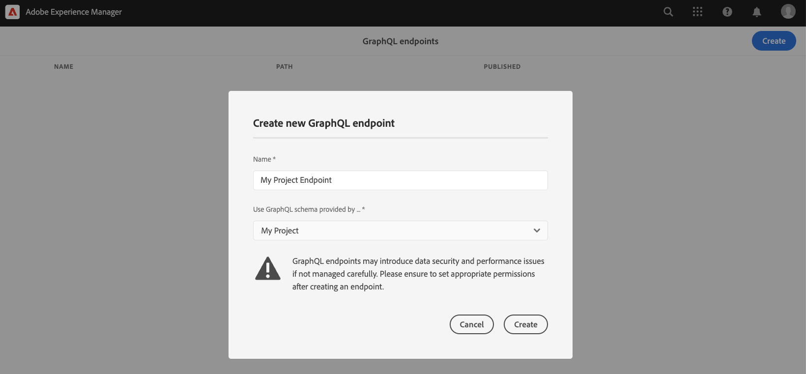
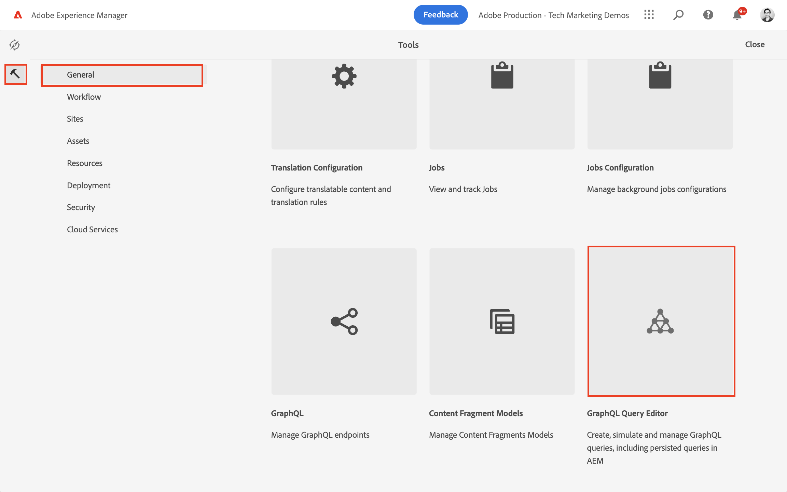
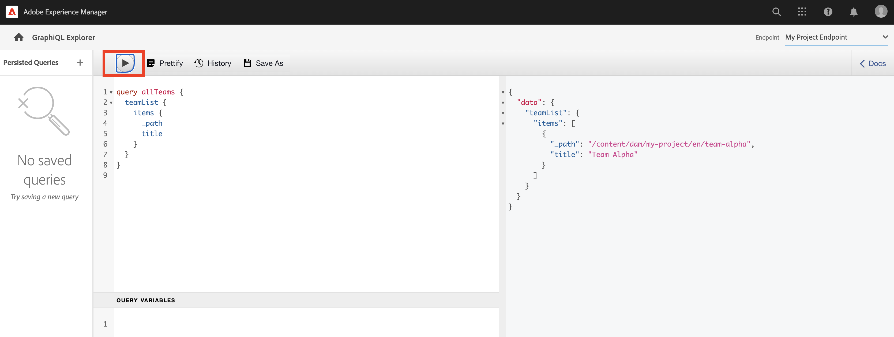
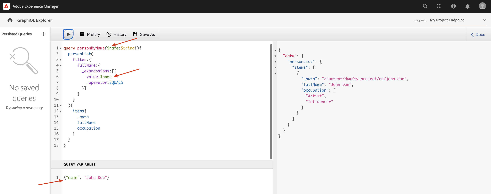
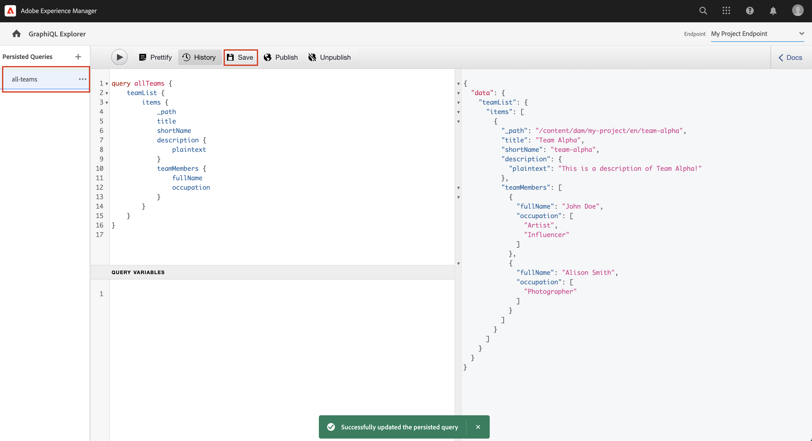
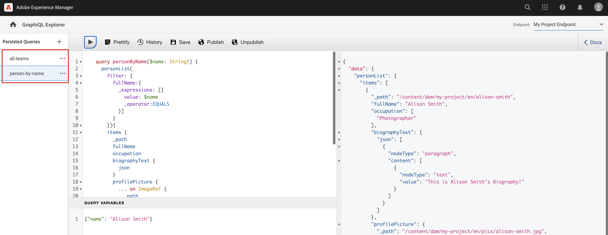

# GraphQL API 탐색 {#explore-graphql-apis}

AEM의 GraphQL API는 컨텐츠 조각의 데이터를 다운스트림 애플리케이션에 노출하는 강력한 쿼리 언어를 제공합니다. 컨텐츠 조각 모델은 컨텐츠 조각에서 사용하는 데이터 스키마를 정의합니다. 컨텐츠 조각 모델을 만들거나 업데이트할 때마다 스키마가 변환되어 GraphQL API를 구성하는 &quot;그래프&quot;에 추가됩니다.

이 장에서는 다음과 같은 IDE를 사용하여 컨텐츠를 수집하는 몇 가지 일반적인 GraphQL 쿼리를 살펴봅니다 [GraphiQL](https://github.com/graphql/graphiql). GraphiQL IDE를 사용하면 반환된 쿼리 및 데이터를 빠르게 테스트하고 세분화할 수 있습니다. 또한 설명서에 쉽게 액세스할 수 있으므로 사용 가능한 방법을 쉽게 배우고 이해할 수 있습니다.

## 사전 요구 사항 {#prerequisites}

이 내용은 여러 부분으로 구성된 자습서이며 [컨텐츠 조각 작성](./author-content-fragments.md) 을(를) 완료했습니다.

## 목표 {#objectives}

* GraphQL 구문을 사용하여 쿼리를 구성하는 방법을 알아봅니다.
* 컨텐츠 조각 목록 및 단일 컨텐츠 조각을 쿼리하는 방법을 알아봅니다.
* 특정 데이터 특성을 필터링하고 요청하는 방법을 알아봅니다.
* 여러 컨텐츠 조각 모델 쿼리를 조인하는 방법을 알아봅니다
* GraphQL 쿼리를 유지하는 방법을 알아봅니다.

## GraphQL 끝점 활성화 {#enable-graphql-endpoint}

GraphQL 종단점은 컨텐츠 조각에 대한 GraphQL API 쿼리를 사용하도록 구성해야 합니다.

1. AEM 시작 화면에서 로 이동합니다. **도구** > **일반** > **GraphQL**.

   

1. 탭 **만들기** 오른쪽 상단 모서리의 결과 대화 상자에서 다음 값을 입력합니다.

   * 이름*: **내 프로젝트 끝점**.
   * GraphQL 스키마를 사용하여 다음 방법으로 제공됩니다.. *: **내 프로젝트**

   

   탭 **만들기** 엔드포인트를 저장하려면 을 클릭합니다.

   프로젝트 구성을 기반으로 만들어진 GraphQL 끝점은 해당 프로젝트에 속하는 모델에 대해서만 쿼리를 사용할 수 있습니다. 이 경우 **개인** 및 **팀** 모델을 사용할 수 있습니다.

   >[!NOTE]
   >
   > 여러 구성의 모델에 대한 쿼리를 활성화하도록 전역 끝점을 만들 수도 있습니다. 이 기능은 추가 보안 취약점으로 환경을 개방할 수 있으므로 주의해서 사용해야 하며, AEM 관리의 복잡도를 크게 향상시킬 수 있습니다.

1. 이제 환경에 GraphQL 엔드포인트가 하나 활성화되어 있어야 합니다.

   

## GraphiQL IDE 사용

다음 [GraphiQL](https://experienceleague.adobe.com/docs/experience-manager-cloud-service/content/headless/graphql-api/graphiql-ide.html) 도구를 사용하여 개발자가 현재 AEM 환경의 컨텐츠에 대한 쿼리를 만들고 테스트할 수 있습니다. GraphiQL 도구를 사용하여 다음을 수행할 수도 있습니다 **유지 또는 저장** 프로덕션 설정에서 클라이언트 응용 프로그램에서 사용할 쿼리입니다.

이제 내장된 GraphiQL IDE를 사용하여 AEM GraphQL API의 강력한 기능을 탐색합니다.

1. AEM 시작 화면에서 로 이동합니다. **도구** > **일반** > **GraphQL 쿼리 편집기**.

   

   >[!NOTE]
   >
   > 에서 이전 버전의 AEM에서는 GraphiQL IDE를 내장하지 않을 수 있습니다. 다음 지침에 따라 수동으로 설치할 수 있습니다 [지침](#install-graphiql).

1. 오른쪽 상단 모서리에서 끝점이 **내 프로젝트 끝점**.

   

이렇게 하면 모든 쿼리가 **내 프로젝트** 프로젝트.

### 컨텐츠 조각 목록 쿼리 {#query-list-cf}

일반적인 요구 사항은 여러 컨텐츠 조각을 쿼리하는 것입니다.

1. 기본 패널에 다음 쿼리를 붙여넣습니다(주석 목록 바꾸기).

   ```graphql
   query allTeams {
     teamList {
       items {
         _path
         title
       }
     }
   } 
   ```

1. 누르기 **재생** 단추를 클릭하여 쿼리를 실행합니다. 이전 장의 컨텐츠 조각 결과가 표시됩니다.

   

1. 커서를 `title` 텍스트 및 입력 **CTRL+공백** 코드 힌트를 트리거하려면 다음을 수행하십시오. 추가 `shortname` 및 `description` 을 클릭합니다.

   

1. 쿼리를 다시 실행하려면 **재생** 버튼을 누르면 그 결과에 `shortname` 및 `description`.

   

   다음 `shortname` 는 간단한 자산이며 `description` 는 여러 줄 텍스트 필드이며 GraphQL API에서는 다음과 같은 결과에 대한 다양한 형식을 선택할 수 있습니다 `html`, `markdown`, `json`, 또는 `plaintext`.

### 중첩된 조각에 대한 쿼리

다음으로, 쿼리를 사용하여 테스트하는 것은 중첩된 조각을 검색하는 것입니다. **팀** 모델 참조 **개인** 모델.

1. 쿼리를 업데이트하여 `teamMembers` 속성을 사용합니다. 이건 **조각 참조** 필드를 개인 모델에 추가합니다. 개인 모델의 속성을 반환할 수 있습니다.

   ```graphql
   query allTeams {
       teamList {
           items {
               _path
               title
               shortName
               description {
                   plaintext
               }
               teamMembers {
                   fullName
                   occupation
               }
           }
       }
   }
   ```

   JSON 응답:

   ```json
   {
       "data": {
           "teamList": {
           "items": [
               {
               "_path": "/content/dam/my-project/en/team-alpha",
               "title": "Team Alpha",
               "shortName": "team-alpha",
               "description": {
                   "plaintext": "This is a description of Team Alpha!"
               },
               "teamMembers": [
                   {
                   "fullName": "John Doe",
                   "occupation": [
                       "Artist",
                       "Influencer"
                   ]
                   },
                   {
                   "fullName": "Alison Smith",
                   "occupation": [
                       "Photographer"
                   ]
                   }
                 ]
           }
           ]
           }
       }
   }
   ```

   중첩된 조각에 대해 쿼리하는 기능은 AEM GraphQL API의 강력한 기능입니다. 이 간단한 예에서 중첩은 두 수준 깊이입니다. 그러나 조각들을 훨씬 더 멀리 중첩할 수 있습니다. 예를 들어 **주소** 와 연관된 모델 **개인** 단일 쿼리에서 세 모델 모두의 데이터를 반환할 수 있습니다.

### 컨텐츠 조각 목록 필터링 {#filter-list-cf}

이제 속성 값을 기반으로 컨텐츠 조각의 하위 집합으로 결과를 필터링할 수 있는 방법을 살펴보겠습니다.

1. GraphiQL UI에 다음 쿼리를 입력합니다.

   ```graphql
   query personByName($name:String!){
     personList(
       filter:{
         fullName:{
           _expressions:[{
             value:$name
             _operator:EQUALS
           }]
         }
       }
     ){
       items{
         _path
         fullName
         occupation
       }
     }
   }  
   ```

   위의 쿼리는 시스템의 모든 개인 조각에 대해 검색을 수행합니다. 쿼리 시작 부분에 추가된 필터는 `name` 필드 및 변수 문자열 `$name`.

1. 에서 **쿼리 변수** 패널에 다음을 입력합니다.

   ```json
   {"name": "John Doe"}
   ```

1. 쿼리를 실행하면 **사람** 컨텐츠 조각 은 값과 함께 반환됩니다 `John Doe`.

   

   복잡한 쿼리를 필터링하고 만드는 다른 여러 옵션이 있습니다. [AEM에서 GraphQL을 사용하는 방법 학습 - 샘플 컨텐츠 및 쿼리](https://experienceleague.adobe.com/docs/experience-manager-cloud-service/content/headless/graphql-api/sample-queries.html).

1. 프로필 사진을 가져오도록 위의 쿼리 개선

   ```graphql
   query personByName($name:String!){
     personList(
       filter:{
         fullName:{
           _expressions:[{
             value:$name
             _operator:EQUALS
           }]
         }
       }
     ){
       items{  
         _path
         fullName
         occupation
         profilePicture{
           ... on ImageRef{
             _path
             _authorUrl
             _publishUrl
             height
             width
   
           }
         }
       }
     }
   } 
   ```

   다음 `profilePicture` 는 컨텐츠 참조이며, 따라서 내장 이미지여야 합니다 `ImageRef` 개체가 사용됩니다. 이를 통해 다음과 같이 참조할 이미지에 대한 추가 데이터를 요청할 수 있습니다. `width` 및 `height`.

### 단일 컨텐츠 조각 쿼리 {#query-single-cf}

단일 컨텐츠 조각을 직접 쿼리할 수도 있습니다. AEM의 컨텐츠는 계층적 방식으로 저장되며 조각의 고유 식별자는 조각의 경로를 기반으로 합니다.

1. GraphiQL 편집기에서 다음 쿼리를 입력합니다.

   ```graphql
   query personByPath($path: String!) {
       personByPath(_path: $path) {
           item {
           fullName
           occupation
           }
       }
   }
   ```

1. 에 대해 다음을 입력합니다. **쿼리 변수**:

   ```json
   {"path": "/content/dam/my-project/en/alison-smith"}
   ```

1. 쿼리를 실행하고 단일 결과가 반환되는지 확인합니다.

## 쿼리 유지 {#persist-queries}

개발자가 쿼리에서 반환된 쿼리 및 결과 데이터에 만족하면 다음 단계는 쿼리를 AEM에 저장하거나 유지하는 것입니다. 다음 [지속되는 쿼리](https://experienceleague.adobe.com/docs/experience-manager-cloud-service/content/headless/graphql-api/persisted-queries.html) 는 GraphQL API를 클라이언트 애플리케이션에 노출하기 위한 기본 메커니즘입니다. 쿼리가 유지되면 GET 요청을 사용하여 요청하고 Dispatcher 및 CDN 레이어에 캐시할 수 있습니다. 지속되는 쿼리의 성능이 훨씬 향상되었습니다. 성능 이점 외에도 지속적인 쿼리는 추가 데이터가 클라이언트 애플리케이션에 실수로 노출되지 않도록 합니다. 에 대한 자세한 내용 [지속되는 쿼리는 여기에서 찾을 수 있습니다](https://experienceleague.adobe.com/docs/experience-manager-cloud-service/content/headless/graphql-api/persisted-queries.html).

그런 다음 두 개의 간단한 쿼리를 유지합니다. 다음 장에서 사용됩니다.

1. GraphiQL IDE에 다음 쿼리를 입력합니다.

   ```graphql
   query allTeams {
       teamList {
           items {
               _path
               title
               shortName
               description {
                   plaintext
               }
               teamMembers {
                   fullName
                   occupation
               }
           }
       }
   }
   ```

   쿼리가 작동하는지 확인합니다.

1. 다음 탭 **다른 이름으로 저장** 을 입력합니다. `all-teams` 로서의 **쿼리 이름**.

   쿼리는 아래에 표시됩니다 **지속되는 쿼리** 왼쪽 레일에 있습니다.

   
1. 다음 줄임표를 탭합니다 **...** 영구적 쿼리 옆에 있는 를 탭하고 **URL 복사** 을 눌러 클립보드에 경로를 복사합니다.

   

1. 새 탭을 열고 복사한 경로를 브라우저에 붙여넣습니다.

   ```plain
   https://$YOUR-AEMasCS-INSTANCEID$.adobeaemcloud.com/graphql/execute.json/my-project/all-teams
   ```

   위의 경로와 유사해야 합니다. 쿼리에서 JSON 결과가 반환되는지 확인해야 합니다.

   위의 URL 분류:

   | 이름 | 설명 |
   | ---------|---------- |
   | `/graphql/execute.json` | 지속 쿼리 끝점 |
   | `/my-project` | 프로젝트 구성 대상 `/conf/my-project` |
   | `/all-teams` | 지속된 쿼리의 이름입니다 |

1. GraphiQL IDE로 돌아가서 더하기 단추를 사용합니다 **+** 새 쿼리를 유지하려면

   ```graphql
   query personByName($name: String!) {
     personList(
       filter: {
         fullName:{
           _expressions: [{
             value: $name
             _operator:EQUALS
           }]
         }
       }){
       items {
         _path
         fullName
         occupation
         biographyText {
           json
         }
         profilePicture {
           ... on ImageRef {
             _path
             _authorUrl
             _publishUrl
             width
             height
           }
         }
       }
     }
   }
   ```

1. 쿼리를 다른 이름으로 저장: `person-by-name`.
1. 다음 두 개의 지속적인 쿼리가 저장되어 있어야 합니다.

   


## GraphQL 끝점 및 지속된 쿼리 게시

검토 및 확인 시 를 게시합니다. `GraphQL Endpoint` &amp; `Persisted Queries`

1. AEM 시작 화면에서 로 이동합니다. **도구** > **일반** > **GraphQL**.

1. 옆에 있는 확인란을 누릅니다 **내 프로젝트 끝점** 탭 **게시**

   

1. AEM 시작 화면에서 로 이동합니다. **도구** > **일반** > **GraphQL 쿼리 편집기**

1. 탭하기 **모든 팀** 지속형 쿼리 패널에서 쿼리 및 탭 **게시**

   

1. 에 대해 위의 단계를 반복합니다. `person-by-name` 쿼리

## 솔루션 파일 {#solution-files}

마지막 세 장에서 만든 컨텐츠, 모델 및 지속적인 쿼리를 다운로드합니다. [tutorial-solution-content.zip](assets/explore-graphql-api/tutorial-solution-content.zip)

## 추가 리소스

GraphQL 쿼리에 대해 자세히 알아보기 [AEM에서 GraphQL을 사용하는 방법 학습 - 샘플 컨텐츠 및 쿼리](https://experienceleague.adobe.com/docs/experience-manager-cloud-service/content/headless/graphql-api/sample-queries.html).

## 축하합니다! {#congratulations}

축하합니다. 여러 GraphQL 쿼리를 만들고 실행했습니다.

## 다음 단계 {#next-steps}

다음 장에서 [React 앱 빌드](./graphql-and-react-app.md)외부 애플리케이션이 AEM GraphQL 끝점을 쿼리하고 이러한 두 개의 지속적인 쿼리를 사용하는 방법을 살펴봅니다. GraphQL 쿼리 실행 중에 몇 가지 기본적인 오류 처리가 도입되었습니다.

## GraphiQL 도구 설치(선택 사항) {#install-graphiql}

GraphiQL IDE 도구의 일부 버전의 AEM(6.X.X)에서는 다음 지침을 사용하여 수동으로 설치해야 합니다.

1. **[소프트웨어 배포 포털](https://experience.adobe.com/#/downloads/content/software-distribution/en/aemcloud.html)** > **AEM as a Cloud Service**&#x200B;로 이동합니다.
1. “GraphiQL”을 검색합니다(**GraphiQL**&#x200B;에 **i**&#x200B;를 반드시 포함하십시오).
1. 최신 **GraphiQL 콘텐츠 패키지 v.x.x.x** 다운로드

   

   zip 파일은 직접 설치할 수 있는 AEM 패키지입니다.

1. AEM 시작 메뉴에서 **도구** > **배포** > **패키지**.
1. **패키지 업로드**&#x200B;를 클릭하고 이전 단계에서 다운로드한 패키지를 선택합니다. **설치**&#x200B;를 클릭하여 패키지를 설치합니다.

   
