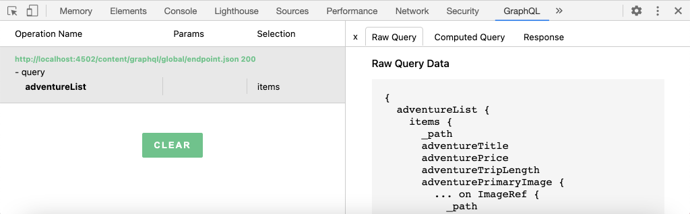

# 외부 앱에서 GraphQL을 사용하여 AEM 쿼리

이 장에서는 AEM GraphQL API를 사용하여 외부 애플리케이션에서 경험을 유도하는 방법을 살펴봅니다.

이 자습서에서는 간단한 React 앱을 사용하여 AEM GraphQL API에 의해 노출된 Adventure 컨텐츠를 쿼리하고 표시합니다. React의 사용은 크게 중요하지 않으며, 사용되는 외부 응용 프로그램은 모든 플랫폼의 프레임워크에 쓸 수 있습니다.

## 전제 조건

이 내용은 여러 부분으로 구성된 자습서이며 이전 부품에 설명된 단계가 완료된 것으로 가정합니다.

_이 장의 IDE 스크린샷은 [Visual Studio 코드](https://code.visualstudio.com/)_

원할 경우 다음과 같은 브라우저 확장을 설치합니다. [GraphQL 네트워크 관리자](https://chrome.google.com/webstore/detail/graphql-network-inspector/ndlbedplllcgconngcnfmkadhokfaaln) GraphQL 쿼리에 대한 세부 사항을 볼 수 있습니다.

## 목표

이 장에서는 다음 방법을 알아봅니다.

* 샘플 React 앱의 기능을 시작하고 이해합니다
* 외부 앱에서 AEM GraphQL 엔드포인트로 호출을 수행하는 방법을 알아봅니다
* GraphQL 쿼리를 정의하여 활동별로 모험 컨텐츠 조각 목록을 필터링합니다
* React 앱을 업데이트하여 활동별 모험 목록인 GraphQL을 통해 필터링할 컨트롤을 제공합니다

## React 앱 시작

이 장에서는 GraphQL에서 컨텐츠 조각을 사용할 클라이언트 개발에 중점을 두므로 샘플이 [WKND GraphQL React 앱 소스 코드를 다운로드하여 설정해야 합니다](../quick-setup/local-sdk.md) 로컬 시스템에 있을 때 사용됩니다.

React 앱을 시작하는 방법은 [빠른 설정](../quick-setup/local-sdk.md) 그러나, 요약된 명령들은 따를 수 있다:

1. 샘플 WKND GraphQL React 앱을 아직 복제하지 않은 경우 [Github.com](https://github.com/adobe/aem-guides-wknd-graphql)

   ```shell
   $ git clone --branch tutorial/react git@github.com:adobe/aem-guides-wknd-graphql.git
   ```

1. IDE에서 WKND GraphQL React 앱을 엽니다.

   

1. 명령줄에서 `react-app` 폴더
1. 프로젝트 루트(프로젝트 루트)에서 다음 명령을 실행하여 WKND GraphQL React 앱을 시작합니다 `react-app` 폴더)

   ```shell
   $ cd aem-guides-wknd-graphql/react-app
   $ npm start
   ```

1. 에서 앱을 검토합니다. [http://localhost:3000/](http://localhost:3000/). 샘플 React 앱에는 두 가지 주요 부분이 있습니다.

   * 홈 경험은 쿼리를 통해 WKND Adventure의 색인 역할을 합니다 __모험__ GraphQL을 사용하는 AEM의 컨텐츠 조각입니다. 이 장에서는 활동별 모험 필터링을 지원하도록 이 보기를 수정합니다.

      

   * 모험 세부 사항 경험에서는 GraphQL을 사용하여 특정 항목을 쿼리합니다 __모험__ 컨텐츠 조각 및 더 많은 데이터 포인트를 표시합니다.

      

1. 브라우저의 개발 도구 및 다음과 같은 브라우저 확장 사용 [GraphQL 네트워크 관리자](https://chrome.google.com/webstore/detail/graphql-network-inspector/ndlbedplllcgconngcnfmkadhokfaaln) AEM에 전송된 GraphQL 쿼리 및 JSON 응답을 검사합니다. 이 접근 방식을 사용하여 GraphQL 요청 및 응답을 모니터링하여 이러한 요청이 올바로 작성되고 응답이 예상대로 수행되는지 확인할 수 있습니다.

   

   *React 앱에서 AEM으로 전송된 GraphQL 쿼리*

   

   *AEM에서 React 앱에 대한 JSON 응답*

   쿼리 및 응답은 GraphiQL IDE에 표시된 것과 일치해야 합니다.

   >[!NOTE]
   >
   > 개발 중에 React 앱은 웹 팩 개발 서버를 통해 AEM에 HTTP 요청을 프록시하도록 구성됩니다. React 앱에서  `http://localhost:3000` 에서 실행되는 AEM 작성자 서비스로 프록시합니다. `http://localhost:4502`. 파일 검토 `src/setupProxy.js` 및 `env.development` 자세한 내용
   >
   > 비개발 시나리오에서 React 앱은 AEM에 직접 요청을 하도록 구성됩니다.

## 앱의 GraphQL 코드 탐색

1. IDE에서 파일을 엽니다 `src/api/useGraphQL.js`.

   이것은 [반응 효과 후크](https://reactjs.org/docs/hooks-overview.html#effect-hook) 앱의 변경 사항을 수신합니다. `query`및 가 변경되면 AEM GraphQL 종단점에 HTTP POST 요청을 수행하고 앱에 JSON 응답을 반환합니다.

   React 앱이 GraphQL 쿼리를 만들어야 할 때마다 이 사용자 지정을 호출합니다 `useGraphQL(query)` GraphQL에서 전달하여 AEM에 전송하며 후크됩니다.

   이 후크에서는 `fetch` HTTP POST GraphQL 요청을 만드는 모듈이지만 [Apollo GraphQL 클라이언트](https://www.apollographql.com/docs/react/) 유사하게 사용할 수 있습니다.

1. 열기 `src/components/Adventures.js` IDE에서 홈 뷰의 모험 목록을 관리하고 해당 페이지의 호출을 검토합니다 `useGraphQL` 후크.

   이 코드는 기본값을 설정합니다 `query` 다음과 같음 `allAdventuresQuery` 이 파일에서 아래에 정의된 대로

   ```javascript
   const [query, setQuery] = useState(allAdventuresQuery);
   ```

   ... 그리고 언제든지 `query` 변수 변경, `useGraphQL` 후크가 호출됩니다. 이 호출은 돌아가며 AEM에 대해 GraphQL 쿼리를 실행하며 JSON을 `data` 변수를 채우는 것이 좋습니다.

   ```javascript
   const { data, errorMessage } = useGraphQL(query);
   ```

   다음 `allAdventuresQuery` 는 파일에 정의된 상수 GraphQL 쿼리로서, 필터링 없이 모든 Adventure 컨텐츠 조각을 쿼리하고 홈 보기를 렌더링하는 데 필요한 데이터 포인트만 반환합니다.

   ```javascript
   const allAdventuresQuery = `
   {
       adventureList {
         items {
           _path
           adventureTitle
           adventurePrice
           adventureTripLength
           adventurePrimaryImage {
           ... on ImageRef {
               _path
               mimeType
               width
               height
             }
           }
         }
     }
   }
   `;
   ```

1. 열기 `src/components/AdventureDetail.js`, 모험 세부 사항 경험을 표시하는 React 구성 요소입니다. 이 보기는 특정 컨텐츠 조각을 고유한 ID로 사용하여 요청하고 제공된 세부 정보를 렌더링합니다.

   와 유사함 `Adventures.js`, 사용자 지정 `useGraphQL` React Hook는 AEM에 대해 해당 GraphQL 쿼리를 수행하는 데 다시 사용됩니다.

   컨텐츠 조각의 경로는 구성 요소의 `props` 을 사용하여 쿼리할 컨텐츠 조각을 지정합니다.

   ```javascript
   const contentFragmentPath = props.location.pathname.substring(props.match.url.length);
   ```

   ... 및 GraphQL 매개 변수화된 쿼리는 `adventureDetailQuery(..)` 함수에 전달되고 `useGraphQL(query)` AEM에 대해 GraphQL 쿼리를 실행하고 결과를 `data` 변수를 채우는 방법을 설명합니다.

   ```javascript
   const { data, errorMessage } = useGraphQL(adventureDetailQuery(contentFragmentPath));
   ```

   다음 `adventureDetailQuery(..)` 함수는 AEM을 사용하는 필터링 GraphQL 쿼리를 래핑합니다 `<modelName>ByPath` JCR 경로로 식별되는 단일 컨텐츠 조각을 쿼리하고 어드벤처 세부 사항을 렌더링하는 데 필요한 지정된 모든 데이터 포인트를 반환합니다.

   ```javascript
   function adventureDetailQuery(_path) {
   return `{
       adventureByPath (_path: "${_path}") {
         item {
           _path
           adventureTitle
           adventureActivity
           adventureType
           adventurePrice
           adventureTripLength
           adventureGroupSize
           adventureDifficulty
           adventurePrice
           adventurePrimaryImage {
               ... on ImageRef {
               _path
               mimeType
               width
               height
               }
           }
           adventureDescription {
               html
           }
           adventureItinerary {
               html
           }
         }
       }
   }
   `;
   }
   ```

## 매개 변수가 있는 GraphQL 쿼리 만들기

다음으로, React 앱을 수정하여 매개 변수화된 GraphQL 쿼리를 수행하여 모험의 활동으로 홈 보기를 제한합니다.

1. IDE에서 파일을 엽니다. `src/components/Adventures.js`. 이 파일은 어드벤처 카드를 쿼리하고 표시하는 홈 경험의 어드벤처 구성 요소를 나타냅니다.
1. Inspect 기능 `filterQuery(activity)`- 사용하지 않지만, 모험을 필터링하는 GraphQL 쿼리를 만들 준비가 되었습니다. `activity`.

   매개 변수에 주목하십시오 `activity` GraphQL 쿼리에 `filter` on `adventureActivity` 필드. 매개 변수의 값과 일치하도록 해당 필드의 값이 필요합니다.

   ```javascript
   function filterQuery(activity) {
       return `
           {
           adventures (filter: {
               adventureActivity: {
               _expressions: [
                   {
                   value: "${activity}"
                   }
                 ]
               }
           }){
               items {
               _path
               adventureTitle
               adventurePrice
               adventureTripLength
               adventurePrimaryImage {
               ... on ImageRef {
                   _path
                   mimeType
                   width
                   height
               }
               }
             }
         }
       }
       `;
   }
   ```

1. React Adventure 구성 요소의 `return` 새 매개 변수화된 단추를 추가하는 문 `filterQuery(activity)` .

   ```javascript
   function Adventures() {
       ...
       return (
           <div className="adventures">
   
           {/* Add these three new buttons that set the GraphQL query accordingly */}
   
           {/* The first button uses the default `allAdventuresQuery` */}
           <button onClick={() => setQuery(allAdventuresQuery)}>All</button>
   
           {/* The 2nd and 3rd button use the `filterQuery(..)` to filter by activity */}
           <button onClick={() => setQuery(filterQuery('Camping'))}>Camping</button>
           <button onClick={() => setQuery(filterQuery('Surfing'))}>Surfing</button>
   
           <ul className="adventure-items">
           ...
       )
   }
   ```

1. 변경 사항을 저장하고 웹 브라우저에서 React 앱을 다시 로드합니다. 세 개의 새 단추가 맨 위에 표시되고, 이 단추를 클릭하면 AEM에서 일치하는 활동과 함께 Adventure Content Fragments를 자동으로 다시 쿼리합니다.

   

1. 활동에 대한 필터링 단추를 더 추가해 보십시오. `Rock Climbing`, `Cycling` 및 `Skiing`

## GraphQL 오류 처리

GraphQL은 강력한 형식이므로 쿼리가 잘못된 경우 유용한 오류 메시지를 반환할 수 있습니다. 다음으로 반환된 오류 메시지를 보기 위해 잘못된 쿼리를 시뮬레이션하겠습니다.

1. 파일을 다시 엽니다. `src/api/useGraphQL.js`. Inspect 다음 코드 조각을 사용하여 오류 처리를 확인합니다.

   ```javascript
   //useGraphQL.js
   .then(({data, errors}) => {
           //If there are errors in the response set the error message
           if(errors) {
               setErrors(mapErrors(errors));
           }
           //Otherwise if data in the response set the data as the results
           if(data) {
               setData(data);
           }
       })
       .catch((error) => {
           setErrors(error);
       });
   ```

   응답에 가 포함되어 있는지 확인하기 위해 응답이 검사됩니다 `errors` 개체. 다음 `errors` 스키마를 기반으로 정의되지 않은 필드와 같이 GraphQL 쿼리에 문제가 있으면 AEM에서 개체를 전송합니다. 없는 경우 `errors` 개체 `data` 가 설정되어 반환됩니다.

   다음 `window.fetch` 포함 `.catch` 다음으로 *catch* 잘못된 HTTP 요청이나 서버에 연결할 수 없는 경우와 같은 일반적인 오류가 있습니다.

1. 파일을 엽니다. `src/components/Adventures.js`.
1. 수정 `allAdventuresQuery` 잘못된 속성을 포함하려면 `adventurePetPolicy`:

   ```javascript
   /**
    * Query for all Adventures
    * adventurePetPolicy has been added beneath items
   */
   const allAdventuresQuery = `
   {
       adventureList {
         items {
           adventurePetPolicy
           _path
           adventureTitle
           adventurePrice
           adventureTripLength
           adventurePrimaryImage {
           ... on ImageRef {
               _path
               mimeType
               width
               height
           }
           }
         }
       }
   }
   `;
   ```

   우리는 그것을 압니다 `adventurePetPolicy` 은 Adventure 모델의 일부가 아니므로 오류가 트리거됩니다.

1. 변경 사항을 저장하고 브라우저로 돌아갑니다. 다음과 같은 오류 메시지가 표시됩니다.

   

   GraphQL API에서 해당 코드를 검색합니다 `adventurePetPolicy` 에 가 정의되지 않음 `AdventureModel` 및 는 적절한 오류 메시지를 반환합니다.

1. 브라우저의 개발자 도구를 사용하여 AEM의 응답을 Inspect에서 확인하여 `errors` JSON 개체:

   

   다음 `errors` 개체는 자세한 정보를 제공하며, 잘못된 형식의 쿼리 위치 및 오류 분류에 대한 정보를 포함합니다.

1. 로 돌아가기 `Adventures.js` 쿼리 변경 내용을 되돌려서 앱을 적절한 상태로 되돌립니다.

## 축하합니다!{#congratulations}

축하합니다! 샘플 WKND GraphQL React 앱의 코드를 성공적으로 탐색하고 매개 변수를 사용하여 GraphQL 쿼리를 필터링하여 활동별로 모험을 나열하도록 업데이트했습니다. 또한 기본적인 오류 처리를 탐색할 수 있습니다.

## 다음 단계 {#next-steps}

다음 장에서 [조각 참조를 사용한 고급 데이터 모델링](./fragment-references.md) 조각 참조 기능을 사용하여 두 개의 다른 컨텐츠 조각 간의 관계를 만드는 방법을 알아봅니다. 참조된 모델의 필드를 포함하도록 GraphQL 쿼리를 수정하는 방법도 알아봅니다.
