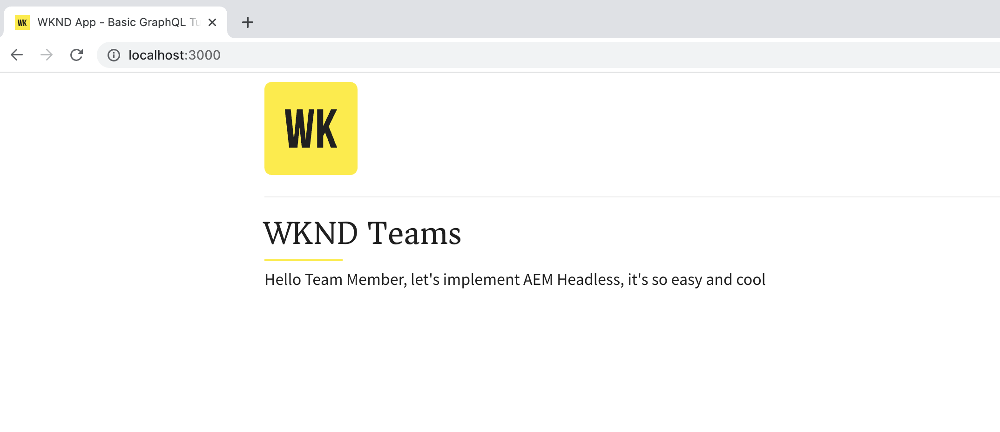

# AEM GraphQL API를 사용하는 React 앱 빌드

이 장에서는 AEM GraphQL API가 외부 애플리케이션에서 경험을 유도하는 방법을 살펴봅니다.

간단한 React 앱은 쿼리 및 표시에 사용됩니다 **팀** 및 **개인** AEM GraphQL API에 의해 노출된 컨텐츠. React의 사용은 크게 중요하지 않으며, 사용되는 외부 응용 프로그램은 모든 플랫폼의 프레임워크에 쓸 수 있습니다.

## 사전 요구 사항

이 다중 부분 자습서의 이전 부분에 요약된 단계가 완료되었다고 가정됩니다. 또는 [tutorial-solution-content.zip](assets/explore-graphql-api/tutorial-solution-content.zip) AEM as a Cloud Service 작성자 및 게시 서비스에 설치됩니다.

_이 장의 IDE 스크린샷은 [Visual Studio 코드](https://code.visualstudio.com/)_

다음 소프트웨어를 설치해야 합니다.

- [Node.js v18](https://nodejs.org/)
- [Visual Studio 코드](https://code.visualstudio.com/)

## 목표

방법 알아보기:

- 예제 React 앱을 다운로드하여 시작합니다
- 를 사용하여 AEM GraphQL 종단점을 쿼리합니다. [AEM Headless JS SDK](https://github.com/adobe/aem-headless-client-js)
- 팀 목록 및 참조된 구성원에 대해 AEM 쿼리
- 팀 구성원의 세부 정보에 대해 AEM 쿼리

## 샘플 React 앱 가져오기

이 장에서 Studout 샘플 React 앱은 AEM GraphQL API와 상호 작용하는 데 필요한 코드와 함께 구현되고 그로부터 얻은 팀 및 개인 데이터를 표시합니다.

샘플 React 앱 소스 코드는 Github.com의 <https://github.com/adobe/aem-guides-wknd-graphql/tree/main/basic-tutorial>

React 앱을 가져오려면 다음을 수행하십시오.

1. 에서 샘플 WKND GraphQL React 앱 복제 [Github.com](https://github.com/adobe/aem-guides-wknd-graphql).

   ```shell
   $ cd ~/Code
   $ git clone git@github.com:adobe/aem-guides-wknd-graphql.git
   ```

1. 다음으로 이동 `basic-tutorial` 폴더를 열고 IDE에서 엽니다.

   ```shell
   $ cd ~/Code/aem-guides-wknd-graphql/basic-tutorial
   $ code .
   ```

   

1. 업데이트 `.env.development` AEM as a Cloud Service 게시 서비스에 연결하려면

   - 설정 `REACT_APP_HOST_URI`의 값은 AEM as a Cloud Service의 게시 URL이 될 값입니다(예: `REACT_APP_HOST_URI=https://publish-p123-e456.adobeaemcloud.com`) 및 `REACT_APP_AUTH_METHOD`의 값 `none`
   >[!NOTE]
   >
   > 이전 단계에서 프로젝트 구성, 컨텐츠 조각 모델, 작성된 컨텐츠 조각, GraphQL 엔드포인트 및 지속된 쿼리를 게시했는지 확인합니다.
   >
   > 로컬 AEM 작성자 SDK에서 위의 단계를 수행한 경우, 다음을 가리킬 수 있습니다 `http://localhost:4502` 및 `REACT_APP_AUTH_METHOD`의 값 `basic`.


1. 명령줄에서 `aem-guides-wknd-graphql/basic-tutorial` 폴더

1. React 앱 시작

   ```shell
   $ cd ~/Code/aem-guides-wknd-graphql/basic-tutorial
   $ npm install
   $ npm start
   ```

1. React 앱은 의 개발 모드에서 시작됩니다 [http://localhost:3000/](http://localhost:3000/). 자습서 전체에서 React 앱에 대한 변경 사항이 즉시 반영됩니다.



>[!IMPORTANT]
>
>   이 React 앱은 부분적으로 구현됩니다. 이 자습서의 단계에 따라 구현을 완료합니다. 구현이 필요한 JavaScript 파일에는 다음 주석이 있습니다. 이 자습서에 지정된 코드를 사용하여 해당 파일의 코드를 추가/업데이트해야 합니다.
>
>
> //*********************************
>
>  // TODO : AEM Headless 자습서의 단계에 따라 이를 구현합니다
>
>  //*********************************

## React 앱의 구조

샘플 React 앱에는 다음 세 가지 주요 부분이 있습니다.

1. 다음 `src/api` 폴더에는 AEM에 대한 GraphQL 쿼리를 만드는 데 사용되는 파일이 포함되어 있습니다.
   - `src/api/aemHeadlessClient.js` AEM과 통신하는 데 사용되는 AEM Headless 클라이언트를 초기화하고 내보냅니다.
   - `src/api/usePersistedQueries.js` 구현 [사용자 정의 React 후크](https://react.dev/docs/hooks-custom.html) AEM GraphQL에서 로 데이터 반환 `Teams.js` 및 `Person.js` 구성 요소 보기

1. 다음 `src/components/Teams.js` 파일에는 목록 쿼리를 사용하여 팀 및 해당 멤버 목록이 표시됩니다.
1. 다음 `src/components/Person.js` 파일에는 매개 변수가 있는 단일 결과 쿼리를 사용하여 한 사람의 세부 정보가 표시됩니다.

## AEMHeadless 개체 검토

를 검토합니다. `aemHeadlessClient.js` 파일 작성 방법 `AEMHeadless` AEM과 통신하는 데 사용되는 개체입니다.

1. 열기 `src/api/aemHeadlessClient.js`.

1. 1-40행을 검토합니다.

   - 가져오기 `AEMHeadless` 선언문 [JavaScript용 AEM Headless 클라이언트](https://github.com/adobe/aem-headless-client-js), 11호선.

   - 에 정의된 변수를 기반으로 한 권한 부여 구성 `.env.development`, 14-22행 및 화살표 함수 표현식 `setAuthorization`31-40호선입니다

   - 다음 `serviceUrl` 포함된 항목에 대한 설정 [개발 프록시](https://github.com/adobe/aem-guides-wknd-graphql/tree/main/react-app#proxy-api-requests) 구성, 27행

1. 줄을 42-49로 인스턴스화하므로 가장 중요합니다 `AEMHeadless` React 앱 전체에서 사용하기 위해 클라이언트를 내보내고 내보냅니다.

```javascript
// Initialize the AEM Headless Client and export it for other files to use
const aemHeadlessClient = new AEMHeadless({
  serviceURL: serviceURL,
  endpoint: REACT_APP_GRAPHQL_ENDPOINT,
  auth: setAuthorization(),
});

export default aemHeadlessClient;
```

## 구현을 통해 AEM GraphQL 지속적인 쿼리를 실행합니다

원본을 구현하려면 `fetchPersistedQuery(..)` 함수 를 사용하여 AEM GraphQL 지속된 쿼리를 실행하면 `usePersistedQueries.js` 파일. 다음 `fetchPersistedQuery(..)` 함수는 `aemHeadlessClient` 개체 `runPersistedQuery()` 비동기적으로 쿼리를 실행하는 promise 기반 동작입니다.

나중에 사용자 지정 반응 `useEffect` 후크는 이 함수를 호출하여 AEM에서 특정 데이터를 검색합니다.

1. in `src/api/usePersistedQueries.js` **업데이트** `fetchPersistedQuery(..)`아래의 코드를 사용하여 35번을 누르십시오.

```javascript
/**
 * Private, shared function that invokes the AEM Headless client.
 *
 * @param {String} persistedQueryName the fully qualified name of the persisted query
 * @param {*} queryParameters an optional JavaScript object containing query parameters
 * @returns the GraphQL data or an error message
 */
async function fetchPersistedQuery(persistedQueryName, queryParameters) {
  let data;
  let err;

  try {
    // AEM GraphQL queries are asynchronous, either await their return or use Promise-based syntax
    const response = await aemHeadlessClient.runPersistedQuery(
      persistedQueryName,
      queryParameters
    );
    // The GraphQL data is stored on the response's data field
    data = response?.data;
  } catch (e) {
    // An error occurred, return the error messages
    err = e
      .toJSON()
      ?.map((error) => error.message)
      ?.join(", ");
    console.error(e.toJSON());
  }

  // Return the GraphQL and any errors
  return { data, err };
}
```

## 팀 기능 구현

다음으로, React 앱의 기본 보기에 팀 및 해당 구성원을 표시하는 기능을 빌드합니다. 이 기능을 사용하려면 다음 요구 사항을 충족해야 합니다.

- 새로운 [사용자 정의 React 사용 효과 후크](https://react.dev/docs/hooks-custom.html) in `src/api/usePersistedQueries.js` 이 호출되면 `my-project/all-teams` 지속형 쿼리, AEM의 팀 컨텐츠 조각 목록을 반환합니다.
- React 구성 요소 `src/components/Teams.js` 이 호출되면 새로운 사용자 지정 React가 호출됩니다 `useEffect` 팀 데이터를 후크하고 렌더링합니다.

완료되면 앱의 기본 보기가 AEM의 팀 데이터로 채워집니다.


### 단계

1. 열기 `src/api/usePersistedQueries.js`.

1. 함수 찾기 `useAllTeams()`

1. 을(를) 만들려면 `useEffect` 지속된 쿼리를 호출하는 후크 `my-project/all-teams` via `fetchPersistedQuery(..)`를 눌러 다음 코드를 추가합니다. 또한 후크는 AEM GraphQL 응답에서 관련 데이터만 반환합니다 `data?.teamList?.items`: React 보기 구성 요소가 상위 JSON 구조와 일치하지 않도록 합니다.

   ```javascript
   /**
    * Custom hook that calls the 'my-project/all-teams' persisted query.
    *
    * @returns an array of Team JSON objects, and array of errors
    */
   export function useAllTeams() {
     const [teams, setTeams] = useState(null);
     const [error, setError] = useState(null);
   
     // Use React useEffect to manage state changes
     useEffect(() => {
       async function fetchData() {
         // Call the AEM GraphQL persisted query named "my-project/all-teams"
         const { data, err } = await fetchPersistedQuery(
           "my-project/all-teams"
         );
         // Sets the teams variable to the list of team JSON objects
         setTeams(data?.teamList?.items);
         // Set any errors
         setError(err);
       }
       // Call the internal fetchData() as per React best practices
       fetchData();
     }, []);
   
     // Returns the teams and errors
     return { teams, error };
   }
   ```

1. 열기 `src/components/Teams.js`

1. 에서 `Teams` React 구성 요소를 사용하여 AEM에서 팀 목록을 가져옵니다. `useAllTeams()` 후크.

   ```javascript
   import { useAllTeams } from "../api/usePersistedQueries";
   ...
   function Teams() {
     // Get the Teams data from AEM using the useAllTeams
     const { teams, error } = useAllTeams();
     ...
   }
   ```


1. 반환된 데이터를 기반으로 오류 메시지 또는 로드 표시기를 표시하여 보기 기반 데이터 유효성 검사를 수행합니다.

   ```javascript
   function Teams() {
     const { teams, error } = useAllTeams();
   
     // Handle error and loading conditions
     if (error) {
       // If an error ocurred while executing the GraphQL query, display an error message
       return <Error errorMessage={error} />;
     } else if (!teams) {
       // While the GraphQL request is executing, show the Loading indicator
       return <Loading />;
     }
     ...
   }
   ```

1. 마지막으로 팀 데이터를 렌더링합니다. GraphQL 쿼리에서 반환된 각 팀은 제공된 를 사용하여 렌더링됩니다 `Team` React 하위 구성 요소.

   ```javascript
   import React from "react";
   import { Link } from "react-router-dom";
   import { useAllTeams } from "../api/usePersistedQueries";
   import Error from "./Error";
   import Loading from "./Loading";
   import "./Teams.scss";
   
   function Teams() {
     const { teams, error } = useAllTeams();
   
     // Handle error and loading conditions
     if (error) {
       return <Error errorMessage={error} />;
     } else if (!teams) {
       return <Loading />;
     }
   
     // Teams have been populated by AEM GraphQL query. Display the teams.
     return (
       <div className="teams">
         {teams.map((team, index) => {
           return <Team key={index} {...team} />;
         })}
       </div>
     );
   }
   
   // Render single Team
   function Team({ title, shortName, description, teamMembers }) {
     // Must have title, shortName and at least 1 team member
     if (!title || !shortName || !teamMembers) {
       return null;
     }
   
     return (
       <div className="team">
         <h2 className="team__title">{title}</h2>
         <p className="team__description">{description.plaintext}</p>
         <div>
           <h4 className="team__members-title">Members</h4>
           <ul className="team__members">
             {/* Render the referenced Person models associated with the team */}
             {teamMembers.map((teamMember, index) => {
               return (
                 <li key={index} className="team__member">
                   <Link to={`/person/${teamMember.fullName}`}>
                     {teamMember.fullName}
                   </Link>
                 </li>
               );
             })}
           </ul>
         </div>
       </div>
     );
   }
   
   export default Teams;
   ```


## 개인 기능 구현

사용 [팀 기능](#implement-teams-functionality) 완료: 팀 구성원 또는 사용자의 세부 정보에 표시되는 표시를 처리하는 기능을 구현하겠습니다.

이 기능을 사용하려면 다음 요구 사항을 충족해야 합니다.

- 새로운 [사용자 정의 React 사용 효과 후크](https://react.dev/docs/hooks-custom.html) in `src/api/usePersistedQueries.js` 이 호출되면 매개 변수가 있는 `my-project/person-by-name` 지속된 쿼리를 반환하고 단일 개인 레코드를 반환합니다.

- React 구성 요소 `src/components/Person.js` 개인의 전체 이름을 쿼리 매개 변수로 사용하는 는 새로운 사용자 지정 React를 호출합니다 `useEffect` 개인 데이터를 후크하고 렌더링합니다.

완료되면 팀 보기에서 개인 이름을 선택하면 개인 보기가 렌더링됩니다.


1. 열기 `src/api/usePersistedQueries.js`.

1. 함수 찾기 `usePersonByName(fullName)`

1. 을(를) 만들려면 `useEffect` 지속된 쿼리를 호출하는 후크 `my-project/all-teams` via `fetchPersistedQuery(..)`를 눌러 다음 코드를 추가합니다. 또한 후크는 AEM GraphQL 응답에서 관련 데이터만 반환합니다 `data?.teamList?.items`: React 보기 구성 요소가 상위 JSON 구조와 일치하지 않도록 합니다.

   ```javascript
   /**
    * Calls the 'my-project/person-by-name' and provided the {fullName} as the persisted query's `name` parameter.
    *
    * @param {String!} fullName the full
    * @returns a JSON object representing the person
    */
   export function usePersonByName(fullName) {
     const [person, setPerson] = useState(null);
     const [errors, setErrors] = useState(null);
   
     useEffect(() => {
       async function fetchData() {
         // The key is the variable name as defined in the persisted query, and may not match the model's field name
         const queryParameters = { name: fullName };
   
         // Invoke the persisted query, and pass in the queryParameters object as the 2nd parameter
         const { data, err } = await fetchPersistedQuery(
           "my-project/person-by-name",
           queryParameters
         );
   
         if (err) {
           // Capture errors from the HTTP request
           setErrors(err);
         } else if (data?.personList?.items?.length === 1) {
           // Set the person data after data validation
           setPerson(data.personList.items[0]);
         } else {
           // Set an error if no person could be found
           setErrors(`Cannot find person with name: ${fullName}`);
         }
       }
       fetchData();
     }, [fullName]);
   
     return { person, errors };
   }
   ```

1. 열기 `src/components/Person.js`
1. 에서 `Person` React 구성 요소, 구문 분석 `fullName` 매개 변수 경로 지정 및 을 사용하여 AEM에서 개인 데이터를 가져옵니다. `usePersonByName(fullName)` 후크.

   ```javascript
   import { useParams } from "react-router-dom";
   import { usePersonByName } from "../api/usePersistedQueries";
   ...
   function Person() {
     // Read the person's `fullName` which is the parameter used to query for the person's details
     const { fullName } = useParams();
   
     // Query AEM for the Person's details, using the `fullName` as the filtering parameter
     const { person, error } = usePersonByName(fullName);
     ...
   }
   ```

1. 반환된 데이터를 기반으로 오류 메시지 또는 로드 표시기를 표시하여 보기 기반 데이터 유효성 검사를 수행합니다.

   ```javascript
   function Person() {
     // Read the person's `fullName` which is the parameter used to query for the person's details
     const { fullName } = useParams();
   
     // Query AEM for the Person's details, using the `fullName` as the filtering parameter
     const { person, error } = usePersonByName(fullName);
   
     // Handle error and loading conditions
     if (error) {
       return <Error errorMessage={error} />;
     } else if (!person) {
       return <Loading />;
     }
     ...
   }
   ```

1. 마지막으로 개인 데이터를 렌더링합니다.

   ```javascript
   import React from "react";
   import { useParams } from "react-router-dom";
   import { usePersonByName } from "../api/usePersistedQueries";
   import { mapJsonRichText } from "../utils/renderRichText";
   import Error from "./Error";
   import Loading from "./Loading";
   import "./Person.scss";
   
   function Person() {
     // Read the person's `fullName` which is the parameter used to query for the person's details
     const { fullName } = useParams();
   
     // Query AEM for the Person's details, using the `fullName` as the filtering parameter
     const { person, error } = usePersonByName(fullName);
   
     // Handle error and loading conditions
     if (error) {
       return <Error errorMessage={error} />;
     } else if (!person) {
       return <Loading />;
     }
   
     // Render the person data
     return (
       <div className="person">
         
         <div className="person__occupations">
           {person.occupation.map((occupation, index) => {
             return (
               <span key={index} className="person__occupation">
                 {occupation}
               </span>
             );
           })}
         </div>
         <div className="person__content">
           <h1 className="person__full-name">{person.fullName}</h1>
           <div className="person__biography">
             {/* Use this utility to transform multi-line text JSON into HTML */}
             {mapJsonRichText(person.biographyText.json)}
           </div>
         </div>
       </div>
     );
   }
   
   export default Person;
   ```

## 앱 시도

앱 검토 [http://localhost:3000/](http://localhost:3000/) 을(를) 클릭합니다. _멤버_ 링크. AEM에서 컨텐츠 조각을 추가하여 팀 알파에 팀 및/또는 구성원을 더 추가할 수도 있습니다.

## 후드

브라우저의 **개발자 도구** > **네트워크** 및 _필터_ 대상 `all-teams` 요청. GraphQL API 요청 알림 `/graphql/execute.json/my-project/all-teams` 에 대해 `http://localhost:3000` 및 **NOT** 의 값에 대해 `REACT_APP_HOST_URI` (예: <https://publish-p123-e456.adobeaemcloud.com>). 요청은 React 앱의 도메인에 대해 수행되므로 [프록시 설정](https://create-react-app.dev/docs/proxying-api-requests-in-development/#configuring-the-proxy-manually) 를 사용하여 활성화됨 `http-proxy-middleware` 모듈.


기본 사항 검토 `../setupProxy.js` 파일 및 내 `../proxy/setupProxy.auth.**.js` 파일 알림 방법 `/content` 및 `/graphql` 경로가 프록시되고 정적 자산이 아님을 나타냅니다.

```javascript
module.exports = function(app) {
  app.use(
    ['/content', '/graphql'],
  ...
```

로컬 프록시를 사용하는 것은 프로덕션 배포에 적합한 옵션이 아니므로 자세한 내용은 _프로덕션 배포_ 섹션을 참조하십시오.

## 축하합니다!{#congratulations}

축하합니다! 기본 자습서의 일부로 AEM GraphQL API의 데이터를 사용하고 표시할 React 앱을 성공적으로 만들었습니다!
