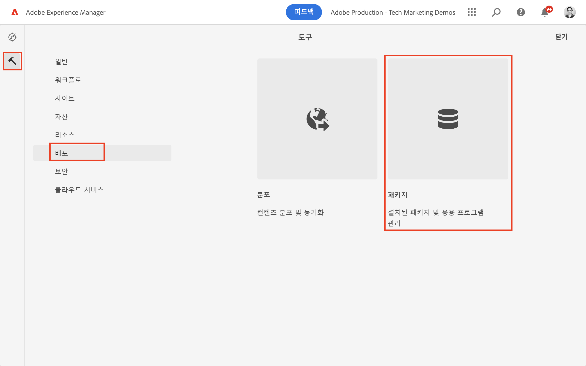
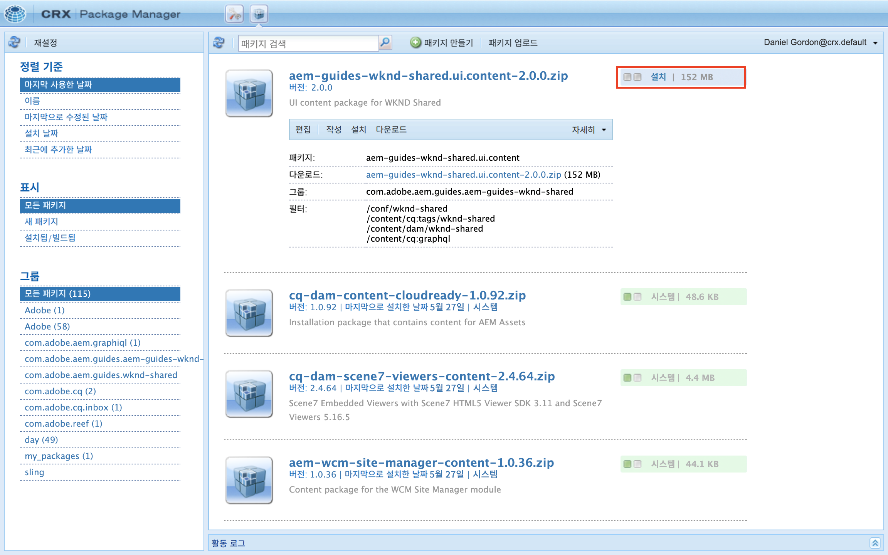

# AEM 헤드리스 시작하기 - GraphQL

AEM GraphQL API를 사용하여 컨텐츠를 작성하고 노출하고 헤드리스 CMS 시나리오에서 외부 앱에서 사용하는 방법을 소개하는 종단간 자습서입니다.

이 자습서에서는 AEM GraphQL API 및 헤드리스 기능을 사용하여 외부 앱에서 노출되는 경험을 향상시키는 방법을 설명합니다.

이 자습서에서는 다음 주제를 다룹니다.

* 새 프로젝트 구성 만들기
* 새 컨텐츠 조각 모델을 만들어 데이터를 모델링합니다
* 이전에 만든 모델을 기반으로 새 컨텐츠 조각을 만듭니다.
* 통합 GraphiQL 개발 도구를 사용하여 AEM에서 컨텐츠 조각을 쿼리할 수 있는 방법을 알아봅니다.
* GraphQL 쿼리를 AEM에 저장하거나 유지하려면
* 샘플 React 앱에서 지속적인 GraphQL 쿼리 사용

## 사전 요구 사항 {#prerequisites}

이 자습서를 따르려면 다음을 수행해야 합니다.

* 기본 HTML 및 JavaScript 기술
* 다음 도구는 로컬로 설치해야 합니다.
   * [Node.js v10+](https://nodejs.org/en/)
   * [npm 6+](https://www.npmjs.com/)
   * [Git](https://git-scm.com/)
   * IDE(예: [Microsoft® Visual Studio 코드](https://code.visualstudio.com/))

### AEM 환경

이 자습서를 완료하려면 Adobe Experience Manager 환경이 필요합니다. 다음 중 하나를 사용할 수 있습니다(스크린샷은 AEM as a Cloud Service 환경에서 기록됨).

* AEM as a Cloud Service 환경
   * [AEM as a Cloud Service 및 Cloud Manager 액세스](/help/cloud-service/accessing/overview.md)
      * **AEM 관리자** AEM as a Cloud Service 액세스
      * **Cloud Manager - 개발자** cloud Manager 액세스

### 샘플 컨텐츠 설치 {#install-sample-content}

이렇게 하면 AEM 환경에서 이미 사용 가능한 샘플 컨텐츠를 참조로 사용할 수 있는 것이 도움이 될 수 있습니다.

1. 로 이동합니다 [AEM WKND 공유 프로젝트](https://github.com/adobe/aem-guides-wknd-shared/releases).
1. 최신 릴리스 자산을 다운로드합니다. `aem-guides-wknd-shared.ui.content-x.x.x.zip`.
1. 자습서에 사용할 AEM 작성 환경에 로그인합니다.
1. AEM 시작 화면에서 로 이동합니다. **도구** > **배포** > **패키지**:

   

1. 탭 **패키지 업로드** 그리고 `aem-guides-wknd-shared.ui.content-x.x.x.zip` 이전에 다운로드한 파일입니다. 탭 **확인** 업로드합니다.
1. 패키지 업로드를 마치면 를 누릅니다 **설치** 을 클릭하여 콘텐츠를 설치합니다.

   

1. 샘플 컨텐츠 조각, 컨텐츠 조각 모델, 이미지 등이 매우 중요하므로 [WKND 브랜드](https://wknd.site/). 샘플 컨텐츠는 자습서에서 나중에 참조됩니다.

## 시작해 보겠습니다!

1. 자습서를 다음으로 시작 [컨텐츠 조각 모델 정의](content-fragment-models.md).

## GitHub 프로젝트

소스 코드 및 컨텐츠 패키지는 [AEM 안내서 - WKND GraphQL GitHub 프로젝트](https://github.com/adobe/aem-guides-wknd-graphql).

자습서나 코드에 문제가 있는 경우 [GitHub 문제](https://github.com/adobe/aem-guides-wknd-graphql/issues).

샘플 컨텐츠 조각, 모델 및 쿼리는 [AEM WKND 공유 프로젝트](https://github.com/adobe/aem-guides-wknd-shared)
