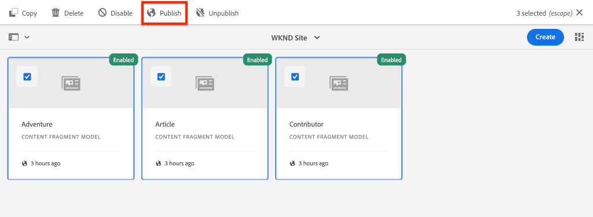
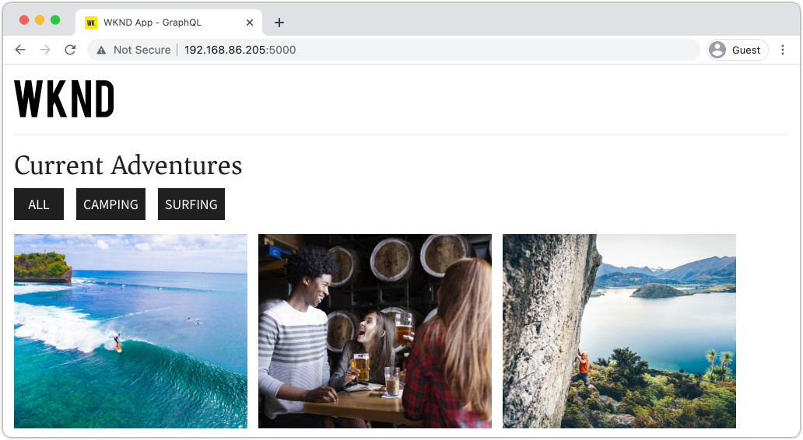

# AEM Publish 서비스를 사용한 프로덕션 배포

이 자습서에서는 작성자 인스턴스에서 게시 인스턴스로 배포되는 콘텐츠를 시뮬레이션하도록 로컬 환경을 설정합니다. 또한 GraphQL API를 사용하여 AEM 게시 환경의 콘텐츠를 사용하도록 구성된 React 앱의 프로덕션 빌드를 생성합니다. 그 과정에서 환경 변수를 효과적으로 사용하는 방법과 AEM CORS 구성을 업데이트하는 방법을 배우게 됩니다.

## 사전 요구 사항

이 튜토리얼은 여러 부분으로 구성된 튜토리얼의 일부입니다. 이전 부분에서 설명한 단계가 완료된 것으로 가정합니다.

## 목표

방법 알아보기:

* AEM Author 및 Publish 아키텍처를 이해합니다.
* 환경 변수 관리에 대한 모범 사례를 알아봅니다.
* CORS(원본 간 리소스 공유)를 위해 AEM을 올바르게 구성하는 방법에 대해 알아봅니다.

## Author Publish 배포 패턴 {#deployment-pattern}

전체 AEM 환경은 작성자, 게시와 Dispatcher로 구성됩니다. Author 서비스는 내부 사용자가 콘텐츠를 만들고 관리하고 미리 보는 곳입니다. Publish 서비스는 &quot;라이브&quot; 환경으로 간주되며 일반적으로 최종 사용자는 이 서비스를 통해 상호 작용합니다. Author 서비스에서 편집 및 승인된 콘텐츠는 Publish 서비스로 배포됩니다.

AEM Headless 애플리케이션의 가장 일반적인 배포 패턴은 애플리케이션의 프로덕션 버전을 AEM Publish 서비스에 연결하는 것입니다.


위의 다이어그램은 이러한 일반적인 배포 패턴을 보여 줍니다.

1. A **콘텐츠 작성자** 는 AEM 작성자 서비스를 사용하여 컨텐츠를 만들고, 편집하고, 관리합니다.
2. **콘텐츠 작성자**&#x200B;와 기타 내부 사용자는 Author 서비스에서 직접 콘텐츠를 미리 볼 수 있습니다. Author 서비스에 연결하는 애플리케이션의 미리보기 버전을 설정할 수 있습니다.
3. 콘텐츠가 승인되면 다음과 같을 수 있습니다. **게시됨** AEM Publish 서비스로 리디렉션됩니다.
4. **최종 사용자** 애플리케이션의 프로덕션 버전과 상호 작용합니다. 프로덕션 애플리케이션은 Publish 서비스에 연결하고 GraphQL API를 사용하여 콘텐츠를 요청하고 소비합니다.

자습서에서는 AEM Publish 인스턴스를 현재 설정에 추가하여 위의 배포를 시뮬레이션합니다. 이전 장에서는 React 앱을 작성자 인스턴스에 직접 연결하여 미리보기 역할을 했습니다. React 앱의 프로덕션 빌드는 새 게시 인스턴스에 연결하는 정적 Node.js 서버에 배포됩니다.

결국 세 개의 로컬 서버가 실행되고 있습니다.

* http://localhost:4502 - 작성자 인스턴스
* http://localhost:4503 - 게시 인스턴스
* http://localhost:5000 - 프로덕션 모드의 React 앱으로 게시 인스턴스에 연결합니다.

## AEM SDK 설치 - 게시 모드 {#aem-sdk-publish}

현재 실행 중인 SDK 인스턴스가 있습니다. **작성자** 모드. SDK는에서 시작할 수도 있습니다. **게시** AEM 게시 환경을 시뮬레이션하는 모드입니다.

로컬 개발 환경 설정에 대한 자세한 안내서 [은(는) 여기에서 찾을 수 있음](https://experienceleague.adobe.com/docs/experience-manager-learn/cloud-service/local-development-environment-set-up/overview.html?lang=en#local-development-environment-set-up).

1. 로컬 파일 시스템에서 게시 인스턴스를 설치할 전용 폴더(예: )를 만듭니다. `~/aem-sdk/publish`.
1. 이전 장의 작성자 인스턴스에 사용된 Quickstart jar 파일을 복사하여 `publish` 디렉토리. 또는 로 이동합니다. [소프트웨어 배포 포털](https://experience.adobe.com/#/downloads/content/software-distribution/en/aemcloud.html) 최신 SDK를 다운로드하고 Quickstart jar 파일을 추출합니다.
1. jar 파일 이름을 로 변경합니다. `aem-publish-p4503.jar`.

   다음 `publish` string 은 Quickstart jar이 게시 모드에서 시작되도록 지정합니다. 다음 `p4503` quickstart 서버가 포트 4503에서 실행되도록 지정합니다.

1. 새 터미널 창을 열고 jar 파일이 포함된 폴더로 이동합니다. AEM 인스턴스를 설치하고 시작합니다.

   ```shell
   $ cd ~/aem-sdk/publish
   $ java -jar aem-publish-p4503.jar
   ```

1. 관리자 암호 입력 `admin`. 모든 관리자 암호는 사용할 수 있지만 추가 구성을 방지하기 위해 로컬 개발에 기본값을 사용하는 것이 좋습니다.
1. AEM 인스턴스 설치가 완료되면 다음 위치에 새 브라우저 창이 열립니다. [http://localhost:4503/content.html](http://localhost:4503/content.html)

   404 찾을 수 없음 페이지를 반환합니다. 완전히 새로운 AEM 인스턴스이며, 콘텐츠가 설치되지 않았습니다.

## 샘플 콘텐츠 및 GraphQL 엔드포인트 설치 {#wknd-site-content-endpoints}

작성자 인스턴스에서와 마찬가지로, 게시 인스턴스도 GraphQL 엔드포인트가 활성화되어 있어야 하며 샘플 콘텐츠가 필요합니다. 그런 다음 게시 인스턴스에 WKND 참조 사이트 를 설치합니다.

1. WKND 사이트용 컴파일된 최신 AEM 패키지 다운로드: [aem-guides-wknd.all-x.x.x.zip](https://github.com/adobe/aem-guides-wknd/releases/latest).

   >[!NOTE]
   >
   > AEM as a Cloud Service 및 와 호환되는 표준 버전을 다운로드해야 합니다. **아님** 다음 `classic` 버전.

1. 다음으로 직접 이동하여 게시 인스턴스에 로그인합니다. [http://localhost:4503/libs/granite/core/content/login.html](http://localhost:4503/libs/granite/core/content/login.html) (사용자 이름 포함) `admin` 및 암호 `admin`.
1. 그런 다음 의 패키지 관리자로 이동합니다. [http://localhost:4503/crx/packmgr/index.jsp](http://localhost:4503/crx/packmgr/index.jsp).
1. 클릭 **패키지 업로드** 이전 단계에서 다운로드한 WKND 패키지를 선택합니다. **설치**&#x200B;를 클릭하여 패키지를 설치합니다.
1. 패키지를 설치한 후에서 WKND 참조 사이트를 사용할 수 있습니다. [http://localhost:4503/content/wknd/us/en.html](http://localhost:4503/content/wknd/us/en.html).
1. 다음으로 로그아웃 `admin` 메뉴 막대에서 &quot;로그아웃&quot; 버튼을 클릭하여 사용자를 지정합니다.

   

   AEM Author 인스턴스와 달리 AEM Publish 인스턴스는 기본적으로 익명 읽기 전용 액세스로 설정됩니다. React 애플리케이션을 실행할 때 익명의 사용자 경험을 시뮬레이션하려고 합니다.

## 게시 인스턴스를 가리키도록 환경 변수 업데이트 {#react-app-publish}

그런 다음 React 애플리케이션에서 사용하는 환경 변수를 업데이트하여 게시 인스턴스를 가리킵니다. React 앱은 **전용** 프로덕션 모드에서 게시 인스턴스에 연결합니다.

그런 다음 새 파일을 추가합니다 `.env.production.local` 프로덕션 경험을 시뮬레이션합니다.

1. IDE에서 WKND GraphQL React 앱을 엽니다.

1. 아래에 `aem-guides-wknd-graphql/react-app`, 다음 이름의 파일 추가 `.env.production.local`.
1. 채우기 `.env.production.local` 다음을 사용하여:

   ```plain
   REACT_APP_HOST_URI=http://localhost:4503
   REACT_APP_GRAPHQL_ENDPOINT=/content/graphql/global/endpoint.json
   ```

   

   환경 변수를 사용하면 애플리케이션 코드 내에 추가 논리를 추가하지 않고도 작성자 또는 게시 환경 간에 GraphQL 엔드포인트를 쉽게 전환할 수 있습니다. 다음에 대한 추가 정보: [React에 대한 사용자 정의 환경 변수는 여기에서 찾을 수 있습니다.](https://create-react-app.dev/docs/adding-custom-environment-variables).

   >[!NOTE]
   >
   > 게시 환경은 기본적으로 콘텐츠에 대한 익명 액세스를 제공하므로 인증 정보가 포함되지 않습니다.

## 정적 노드 서버 배포 {#static-server}

React 앱은 Webpack 서버를 사용하여 시작할 수 있지만 개발용입니다. 다음으로, 를 사용하여 프로덕션 배포 시뮬레이션 [서비스](https://github.com/vercel/serve) Node.js를 사용하여 React 앱의 프로덕션 빌드를 호스팅합니다.

1. 새 터미널 창을 열고 다음으로 이동 `aem-guides-wknd-graphql/react-app` 디렉터리

   ```shell
   $ cd aem-guides-wknd-graphql/react-app
   ```

1. 설치 [서비스](https://github.com/vercel/serve) 다음 명령을 사용하여 생성합니다.

   ```shell
   $ npm install serve --save-dev
   ```

1. 파일 열기 `package.json` 위치: `react-app/package.json`. 이름이 인 스크립트 추가 `serve`:

   ```diff
    "scripts": {
       "start": "react-scripts start",
       "build": "react-scripts build",
       "test": "react-scripts test",
       "eject": "react-scripts eject",
   +   "serve": "npm run build && serve -s build"
   },
   ```

   다음 `serve` 스크립트는 두 가지 작업을 수행합니다. 먼저 React 앱의 프로덕션 빌드가 생성됩니다. 두 번째, Node.js 서버는 프로덕션 빌드를 시작하고 사용합니다.

1. 터미널로 돌아가서 명령을 입력하여 정적 서버를 시작합니다.

   ```shell
   $ npm run serve
   
   ┌────────────────────────────────────────────────────┐
   │                                                    │
   │   Serving!                                         │
   │                                                    │
   │   - Local:            http://localhost:5000        │
   │   - On Your Network:  http://192.168.86.111:5000   │
   │                                                    │
   │   Copied local address to clipboard!               │
   │                                                    │
   └────────────────────────────────────────────────────┘
   ```

1. 새 브라우저를 열고 다음으로 이동 [http://localhost:5000/](http://localhost:5000/). React App이 제공되고 있습니다.

   

   GraphQL 쿼리가 홈 페이지에서 작동하는 것을 확인합니다. Inspect **XHR** 개발자 도구를 사용하여 요청합니다. GraphQL POST이 의 게시 인스턴스에 있는지 확인합니다. `http://localhost:4503/content/graphql/global/endpoint.json`.

   하지만 홈페이지에서 모든 이미지가 손상되었습니다!

1. 어드벤처 세부 정보 페이지 중 하나를 클릭합니다.

   

   다음에 대한 GraphQL 오류가 발생합니다. `adventureContributor`. 다음 연습에서는 깨진 이미지와 `adventureContributor` 문제가 해결되었습니다.

## 절대 이미지 참조 {#absolute-image-references}

다음과 같은 이유로 이미지가 손상된 것 같습니다. `` 태그:

   ```diff
   - 
   + 
   ```

1. 파일 열기 `AdventureDetail.js` 위치: `react-app/src/components/AdventureDetail.js`.
1. 동일한 단계를 반복하여 GraphQL 쿼리를 수정하고 `_publishUrl` 모험을 위한 속성

   ```diff
    adventureByPath (_path: "${_path}") {
       item {
           _path
           adventureTitle
           adventureActivity
           adventureType
           adventurePrice
           adventureTripLength
           adventureGroupSize
           adventureDifficulty
           adventurePrice
           adventurePrimaryImage {
               ... on ImageRef {
               _path
   +           _publishUrl
               mimeType
               width
               height
               }
           }
           adventureDescription {
               html
           }
           adventureItinerary {
               html
           }
           adventureContributor {
               fullName
               occupation
               pictureReference {
                   ...on ImageRef {
                       _path
   +                   _publishUrl
                   }
               }
           }
       }
       }
   } 
   ```

1. 둘 수정 `` 의 Adventure 기본 이미지 및 기여자 사진 참조용 태그 `AdventureDetail.js`:

   ```diff
   /* AdventureDetail.js */
   ...
   
   ...
   pictureReference =  
   ```

1. 터미널로 돌아가서 정적 서버를 시작합니다.

   ```shell
   $ npm run serve
   ```

1. 다음으로 이동 [http://localhost:5000/](http://localhost:5000/) 그리고 이미지가 나타나고 `` 속성 가리키기 `http://localhost:4503`.

   

## 콘텐츠 게시 시뮬레이션 {#content-publish}

다음에 대한 GraphQL 오류가 발생했음을 상기하십시오. `adventureContributor` 어드벤처 세부 정보 페이지가 요청되는 경우. 다음 **참여자** 콘텐츠 조각 모델이 게시 인스턴스에 아직 없습니다. 에 대한 업데이트 **모험** 콘텐츠 조각 모델 은 게시 인스턴스에서도 사용할 수 없습니다. 이러한 변경 사항은 작성자 인스턴스에 직접 적용되었으며 게시 인스턴스에 배포해야 합니다.

이는 콘텐츠 조각 또는 콘텐츠 조각 모델에 대한 업데이트를 사용하는 애플리케이션에 새 업데이트를 롤아웃할 때 고려해야 할 사항입니다.

그런 다음 로컬 작성자와 게시 인스턴스 간에 콘텐츠 게시를 시뮬레이션하도록 합니다.

1. 작성자 인스턴스를 시작하고(아직 시작되지 않은 경우) 다음 위치의 패키지 관리자로 이동합니다. [http://localhost:4502/crx/packmgr/index.jsp](http://localhost:4502/crx/packmgr/index.jsp)
1. 패키지 다운로드 [EnableReplicationAgent.zip](./assets/publish-deployment/EnableReplicationAgent.zip) 패키지 관리자를 사용하여 설치합니다.

   이 패키지는 작성자 인스턴스가 게시 인스턴스에 콘텐츠를 게시할 수 있도록 하는 구성을 설치합니다. 수동 단계 [이 구성은 여기에서 찾을 수 있습니다.](https://experienceleague.adobe.com/docs/experience-manager-learn/cloud-service/local-development-environment-set-up/aem-runtime.html?lang=en#content-distribution).

   >[!NOTE]
   >
   > AEM as a Cloud Service 환경에서는 작성 계층이 게시 계층에 컨텐츠를 배포하도록 자동으로 설정됩니다.

1. 다음에서 **AEM 시작** 메뉴, 다음으로 이동 **도구** > **에셋** > **컨텐츠 조각 모델**.

1. 을(를) 클릭하여 **WKND 사이트** 폴더를 삭제합니다.

1. 세 가지 모델을 모두 선택하고 **게시**:

   

   확인 대화 상자가 나타나면 **게시**.

1. 에서 발리 서프 캠프 콘텐츠 조각 탐색 [http://localhost:4502/editor.html/content/dam/wknd/en/adventures/bali-surf-camp/bali-surf-camp](http://localhost:4502/editor.html/content/dam/wknd/en/adventures/bali-surf-camp/bali-surf-camp).

1. 다음을 클릭합니다. **게시** 단추를 클릭합니다.

   

1. 게시 마법사는 게시해야 하는 모든 종속 에셋을 표시합니다. 이 경우 참조된 조각 **스테이시-로필러스** 가 나열되고 여러 이미지가 참조되기도 합니다. 참조된 에셋은 조각과 함께 게시됩니다.

   

   다음을 클릭합니다. **게시** 버튼을 다시 클릭하여 콘텐츠 조각 및 종속 에셋을 게시합니다.

1. 에서 실행 중인 React 앱으로 돌아갑니다. [http://localhost:5000/](http://localhost:5000/). 이제 발리 서프 캠프(Bali Surf Camp)를 클릭하여 모험 세부 정보를 볼 수 있습니다.

1. 다음 위치에서 AEM 작성자 인스턴스로 다시 전환: [http://localhost:4502/editor.html/content/dam/wknd/en/adventures/bali-surf-camp/bali-surf-camp](http://localhost:4502/editor.html/content/dam/wknd/en/adventures/bali-surf-camp/bali-surf-camp) 및 업데이트 **제목** 조각. **저장 및 닫기** 조각. 그러면 **게시** 조각.
1. 다음으로 돌아가기: [http://localhost:5000/adventure:/content/dam/wknd/en/adventures/bali-surf-camp/bali-surf-camp](http://localhost:5000/adventure:/content/dam/wknd/en/adventures/bali-surf-camp/bali-surf-camp) 게시된 변경 사항을 확인합니다.

   

## COR 구성 업데이트

AEM은 기본적으로 안전하며 AEM이 아닌 웹 속성에서 클라이언트측 호출을 허용하지 않습니다. AEM CORS(원본 간 리소스 공유) 구성을 사용하면 특정 도메인에서 AEM을 호출할 수 있습니다.

그런 다음 AEM 게시 인스턴스의 CORS 구성을 테스트합니다.

1. 명령을 사용하여 React 앱이 실행 중인 터미널 창으로 돌아갑니다. `npm run serve`:

   ```shell
   ┌────────────────────────────────────────────────────┐
   │                                                    │
   │   Serving!                                         │
   │                                                    │
   │   - Local:            http://localhost:5000        │
   │   - On Your Network:  http://192.168.86.205:5000   │
   │                                                    │
   │   Copied local address to clipboard!               │
   │                                                    │
   └────────────────────────────────────────────────────┘
   ```

   두 개의 URL이 제공되는지 확인합니다. 1개 사용 `localhost` 로컬 네트워크 IP 주소를 사용하는 또 다른 IP 주소입니다.

1. 다음으로 시작하는 주소로 이동 [http://192.168.86.XXX:5000](http://192.168.86.XXX:5000). 로컬 컴퓨터마다 주소가 약간 다릅니다. 데이터를 가져올 때 CORS 오류가 있는지 확인합니다. 이는 현재 CORS 구성이 의 요청만 허용하기 때문입니다. `localhost`.

   

   그런 다음 AEM Publish CORS 구성을 업데이트하여 네트워크 IP 주소에서 요청을 허용합니다.

1. 다음으로 이동 [http://localhost:4503/content/wknd/us/en/errors/sign-in.html](http://localhost:4503/content/wknd/us/en/errors/sign-in.html) 사용자 이름으로 로그인 `admin` 및 암호 `admin`.

1. 다음으로 이동 [http://localhost:4503/system/console/configMgr](http://localhost:4503/system/console/configMgr) 에서 WKND GraphQL 구성을 찾습니다. `com.adobe.granite.cors.impl.CORSPolicyImpl~wknd-graphql`.

1. 업데이트 **허용된 원본** 네트워크 IP 주소를 포함할 필드:

   

   특정 하위 도메인의 모든 요청을 허용하는 정규 표현식을 포함할 수도 있습니다. 변경 사항을 저장합니다.

1. 검색 대상 **Apache Sling Referrer 필터** 구성을 검토합니다. 다음 **빈 항목 허용** 외부 도메인에서 GraphQL 요청을 활성화하기 위한 구성도 필요합니다.

   

   WKND 참조 사이트의 일부로 구성되었습니다. 다음을 통해 전체 OSGi 구성 세트를 볼 수 있습니다. [GitHub 저장소](https://github.com/adobe/aem-guides-wknd/tree/master/ui.config/src/main/content/jcr_root/apps/wknd/osgiconfig).

   >[!NOTE]
   >
   > OSGi 구성은 소스 제어에 커밋된 AEM 프로젝트에서 관리됩니다. Cloud Manager를 사용하여 AEM 프로젝트를 Cloud Service 환경으로 AEM에 배포할 수 있습니다. 다음 [AEM Project Archetype](https://github.com/adobe/aem-project-archetype) 는 특정 구현을 위해 프로젝트를 생성하는 데 도움이 될 수 있습니다.

1. 다음으로 시작하는 React 앱으로 돌아가기 [http://192.168.86.XXX:5000](http://192.168.86.XXX:5000) 그리고 애플리케이션에서 더 이상 CORS 오류가 발생하지 않는지 확인합니다.

   

## 축하합니다! {#congratulations}

축하합니다! 이제 AEM Publish 환경을 사용하여 전체 프로덕션 배포를 시뮬레이션했습니다. 또한 AEM에서 CORS 구성을 사용하는 방법에 대해 알아보았습니다.

## 기타 리소스

콘텐츠 조각 및 GraphQL에 대한 자세한 내용은 다음 리소스를 참조하십시오.

* [GraphQL에서 콘텐츠 조각을 사용하여 Headless 콘텐츠 게재](https://experienceleague.adobe.com/docs/experience-manager-cloud-service/assets/content-fragments/content-fragments-graphql.html?lang=ko-KR)
* [콘텐츠 조각과 함께 사용하기 위한 AEM GraphQL API](https://experienceleague.adobe.com/docs/experience-manager-cloud-service/assets/admin/graphql-api-content-fragments.html?lang=ko-KR)
* [토큰 기반 인증](https://experienceleague.adobe.com/docs/experience-manager-learn/getting-started-with-aem-headless/authentication/overview.html?lang=en#authentication)
* [AEM에 as a Cloud Service 코드 배포](https://experienceleague.adobe.com/docs/experience-manager-learn/cloud-service/cloud-manager/devops/deploy-code.html?lang=en#cloud-manager)
