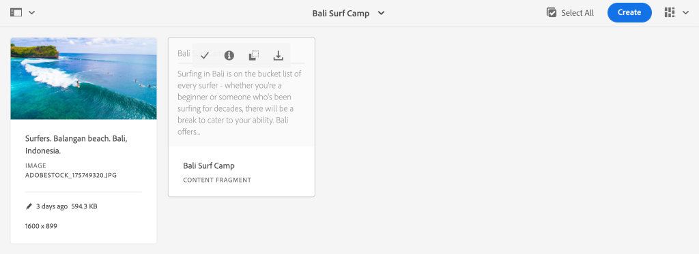

# 로컬 SDK를 사용하여 AEM Headless 빠른 설정 {#setup}

AEM 헤드리스 빠른 설정을 사용하면 WKND 사이트 샘플 프로젝트의 컨텐츠를 사용하여 AEM 헤드리스와 AEM Headless GraphQL API에서 컨텐츠를 사용하는 샘플 React 앱(SPA)을 직접 사용할 수 있습니다. 이 안내서에서는 [AEM as a Cloud Service SDK](https://experienceleague.adobe.com/docs/experience-manager-cloud-service/content/implementing/developing/aem-as-a-cloud-service-sdk.html).

## 사전 요구 사항 {#prerequisites}

다음 도구는 로컬에 설치해야 합니다.

* [JDK 11](https://experience.adobe.com/#/downloads/content/software-distribution/en/general.html?1_group.propertyvalues.property=.%2Fjcr%3Acontent%2Fmetadata%2Fdc%3AsoftwareType&amp;1_group.propertyvalues.operation=equals&amp;1_group.propertyvalues.0_values=software-type%3Atologing&amp;fulltext=Oracle%7E+JDK%7E+11%7E&amp;orderby=%40jcr%3Acontent%3AlastModified&amp;orderby.sort=desc&amp;layout=0&amp;p.offset=0&amp;p.limit=0&amp;limit=1)
* [Node.js v10+](https://nodejs.org/en/)
* [npm 6+](https://www.npmjs.com/)
* [Git](https://git-scm.com/)

## 1. AEM SDK를 설치합니다. {#aem-sdk}

이 설정에서는 [AEM as a Cloud Service SDK](https://experienceleague.adobe.com/docs/experience-manager-cloud-service/implementing/developing/aem-as-a-cloud-service-sdk.html?#aem-as-a-cloud-service-sdk) AEM GraphQL API를 탐색합니다. 이 섹션에서는 AEM SDK를 설치하고 작성자 모드에서 실행하는 빠른 안내서를 제공합니다. 로컬 개발 환경 설정에 대한 자세한 안내서 [여기에서 찾을 수 있습니다.](https://experienceleague.adobe.com/docs/experience-manager-learn/cloud-service/local-development-environment-set-up/overview.html#local-development-environment-set-up).

>[!NOTE]
>
> 또한 자습서에 [AEM as a Cloud Service 환경](./cloud-service.md). 클라우드 환경 사용에 대한 추가 참고 사항은 자습서 전체에서 포함되어 있습니다.

1. 로 이동합니다 **[소프트웨어 배포 포털](https://experience.adobe.com/#/downloads/content/software-distribution/en/aemcloud.html?fulltext=AEM*+SDK*&amp;orderby=%40jcr%3Acontent%2Fjcr%3AlastModified&amp;orderby.sort=desc&amp;layout=list&amp;p.offset=0&amp;p.limit=1)** > **AEM as a Cloud Service** 최신 버전의 **AEM SDK**.

   

1. 다운로드 압축을 풀고 Quickstart jar 를 복사합니다(`aem-sdk-quickstart-XXX.jar`) 를 전용 폴더, 즉 `~/aem-sdk/author`.
1. jar 파일의 이름을 다음으로 변경합니다. `aem-author-p4502.jar`.

   다음 `author` name: Quickstart jar가 작성자 모드에서 시작되도록 지정합니다. 다음 `p4502` 포트 4502에서 Quickstart 실행을 지정합니다.

1. AEM 인스턴스를 설치하고 시작하려면 jar 파일이 포함된 폴더에서 명령 프롬프트를 열고 다음 명령을 실행합니다.

   ```shell
   $ cd ~/aem-sdk/author
   $ java -jar aem-author-p4502.jar
   ```

1. 다음과 같이 관리자 암호를 제공합니다. `admin`. 모든 관리자 암호는 사용할 수 있지만 `admin` 로컬 개발을 위해 재구성할 필요가 줄어듭니다.
1. AEM 서비스 설치가 완료되면 새 브라우저 창에서 [http://localhost:4502](http://localhost:4502).
1. 사용자 이름으로 로그인합니다. `admin` 및 AEM 초기 시작 중에 선택한 암호(일반적으로 `admin`).

## 2. 샘플 컨텐츠 설치 {#install-sample-content}

의 샘플 컨텐츠 **WKND 참조 사이트** 는 자습서를 가속화하는 데 사용됩니다. WKND는 가상 라이프스타일 브랜드이며, 종종 AEM 교육에서 사용됩니다.

WKND 사이트에는 [GraphQL 끝점](https://experienceleague.adobe.com/docs/experience-manager-cloud-service/content/headless/graphql-api/content-fragments.html). 실제 구현에서는 다음의 문서화된 단계를 따릅니다. [GraphQL 엔드포인트 포함](https://experienceleague.adobe.com/docs/experience-manager-cloud-service/content/headless/graphql-api/content-fragments.html) 고객 프로젝트에서 확인하십시오. A [CORS](#cors-config) 는 WKND 사이트의 일부로 패키지화되어 있습니다. 외부 응용 프로그램에 대한 액세스 권한을 부여하려면 CORS 구성이 필요합니다. 자세한 내용은 [CORS](#cors-config) 은 아래에서 찾을 수 있습니다.

1. WKND Site용 최신 컴파일된 AEM 패키지를 다운로드합니다. [aem-guides-wknd.all-x.x.zip](https://github.com/adobe/aem-guides-wknd/releases/latest).

   >[!NOTE]
   >
   > AEM as a Cloud Service 및 과 호환되는 표준 버전을 다운로드하십시오 **not** a `classic` 버전.

1. 에서 **AEM 시작** 메뉴, 이동 **도구** > **배포** > **패키지**.

   

1. 클릭 **패키지 업로드** 이전 단계에서 다운로드한 WKND 패키지를 선택합니다. **설치**&#x200B;를 클릭하여 패키지를 설치합니다.

1. 에서 **AEM 시작** 메뉴, 이동 **자산** > **파일** > **WKND 공유** > **영어** > **모험**.

   

   WKND 브랜드로 승격된 다양한 모험들을 구성하는 모든 자산의 폴더입니다. 여기에는 이미지 및 비디오와 같은 일반적인 미디어 유형과 AEM과 관련된 미디어가 포함됩니다 **컨텐츠 조각**.

1. 을(를) 클릭하여 **다운 스키 와이오밍** 폴더를 클릭하고 **다운 스키 와이오밍 콘텐츠 조각** 카드:

   

1. 콘텐츠 조각 편집기가 Wyoming의 Designing Screens 어드벤처에 열립니다.

   

   다음과 같은 다양한 필드를 관찰합니다 **제목**, **설명**, 및 **활동** 조각을 정의합니다.

   **컨텐츠 조각** 는 AEM에서 컨텐츠를 관리할 수 있는 방법 중 하나입니다. 컨텐츠 조각은 텍스트, 리치 텍스트, 날짜 또는 다른 컨텐츠 조각에 대한 참조와 같은 구조화된 데이터 요소로 구성된 재사용 가능한 프레젠테이션에 관계 없는 컨텐츠입니다. 컨텐츠 조각은 빠른 설정에서 나중에 더 자세히 조사됩니다.

1. 클릭 **취소** 조각을 닫습니다. 다른 폴더 중 일부를 자유롭게 탐색하고 다른 Adventure 컨텐츠를 탐색합니다.

>[!NOTE]
>
> Cloud Service 환경을 사용하는 경우 방법에 대한 설명서를 참조하십시오. [WKND 참조 사이트와 같은 코드 베이스를 Cloud Service 환경에 배포](https://experienceleague.adobe.com/docs/experience-manager-cloud-service/implementing/deploying/overview.html#coding-against-the-right-aem-version).

## 3. WKND React 앱을 다운로드하여 실행합니다. {#sample-app}

이 자습서의 목표 중 하나는 GraphQL API를 사용하여 외부 애플리케이션에서 AEM 컨텐츠를 사용하는 방법을 보여주는 것입니다. 이 자습서에서는 React App 예를 사용합니다. React 앱은 AEM GraphQL API와의 통합에 중점을 두기 위해 의도적으로 간단합니다.

1. 새 명령 프롬프트를 열고 GitHub에서 샘플 React 앱을 복제합니다.

   ```shell
   $ git clone git@github.com:adobe/aem-guides-wknd-graphql.git
   $ cd aem-guides-wknd-graphql/react-app
   ```

1. React 앱을 엽니다. `aem-guides-wknd-graphql/react-app` IDE에서 선택할 수 있습니다.
1. IDE에서 파일을 엽니다 `.env.development` at `/.env.development`. 확인 `REACT_APP_AUTHORIZATION` 줄의 주석 처리를 취소하면 파일에 다음 변수가 선언됩니다.

   ```plain
   REACT_APP_HOST_URI=http://localhost:4502
   REACT_APP_GRAPHQL_ENDPOINT=/content/graphql/global/endpoint.json
   # Use Authorization when connecting to an AEM Author environment
   REACT_APP_AUTHORIZATION=admin:admin
   ```

   확인 `REACT_APP_HOST_URI` 는 로컬 AEM SDK를 가리킵니다. 편의상, 이 빠른 시작은 React 앱을  **AEM 작성자**. **작성자** 서비스를 사용하려면 인증이 필요하므로 앱이 `admin` 사용자가 연결을 설정할 수 있습니다. 앱을 AEM Author에 연결하는 것은 일반적인 방법이며, 이 경우 변경 내용을 게시하지 않고도 컨텐츠를 빠르게 반복할 수 있습니다.

   >[!NOTE]
   >
   > 프로덕션 시나리오에서는 앱이 AEM에 연결됩니다 **게시** 환경. 자세한 내용은 _프로덕션 배포_ 섹션을 참조하십시오.


1. React 앱을 설치하고 시작합니다.

   ```shell
   $ cd aem-guides-wknd-graphql/react-app
   $ npm install
   $ npm start
   ```

1. 새 브라우저 창에서 앱을 자동으로 엽니다. [http://localhost:3000](http://localhost:3000).

   

   AEM의 모험 컨텐츠 목록이 표시됩니다.

1. 모험 이미지 중 하나를 클릭하여 모험 세부 사항을 확인합니다. AEM에 모험에 대한 세부 사항을 반환해 달라는 요청이 있습니다.

   

1. 브라우저의 개발자 도구를 사용하여 **네트워크** 요청. 보기 **XHR** 요청 및 관찰에 대한 여러 GET 요청 `/graphql/execute.json/...`. 이 경로 접두사는 AEM 지속적인 쿼리 끝점을 호출하여 접두사 다음의 이름 및 인코딩된 매개 변수를 사용하여 실행할 지속형 쿼리를 선택합니다.

   

## 4. AEM에서 컨텐츠 편집

React 앱이 실행 중이면 AEM의 콘텐츠를 업데이트하고 변경 사항이 앱에 반영되었는지 확인합니다.

1. AEM으로 이동합니다. [http://localhost:4502](http://localhost:4502).
1. 다음으로 이동 **자산** > **파일** > **WKND 공유** > **영어** > **모험** > **[발리 서프 캠프](http://localhost:4502/assets.html/content/dam/wknd-shared/en/adventures/bali-surf-camp)**.

   

1. 을(를) 클릭하여 **발리 서프 캠프** 컨텐츠 조각을 사용하여 컨텐츠 조각 편집기를 엽니다.
1. 수정 **제목** 그리고 **설명** 그 모험에 대해

   

1. 클릭 **저장** 변경 사항을 저장하려면 을 클릭합니다.
1. 에서 React 앱 새로 고침 [http://localhost:3000](http://localhost:3000) 변경 사항을 확인하려면:

   

## 5. GraphiQL 탐색 {#graphiql}

1. 열기 [GraphiQL](http://localhost:4502/aem/graphiql.html) 으로 이동 **도구** > **일반** > **GraphQL 쿼리 편집기**
1. 왼쪽의 기존 지속된 쿼리를 선택하고 이를 실행하여 결과를 확인합니다.

   >[!NOTE]
   >
   > GraphiQL 도구 및 GraphQL API는 다음과 같습니다 [튜토리얼의 후반부에 더 자세히 살펴보십시오](../multi-step/explore-graphql-api.md).

## 축하합니다!{#congratulations}

축하합니다. 이제 GraphQL에서 AEM 컨텐츠를 사용하는 외부 애플리케이션이 있습니다. 언제든지 React 앱에서 코드를 검사하고 기존 컨텐츠 조각 수정을 계속 실험할 수 있습니다.

### 다음 단계

* [AEM Headless 자습서 시작](../multi-step/overview.md)
