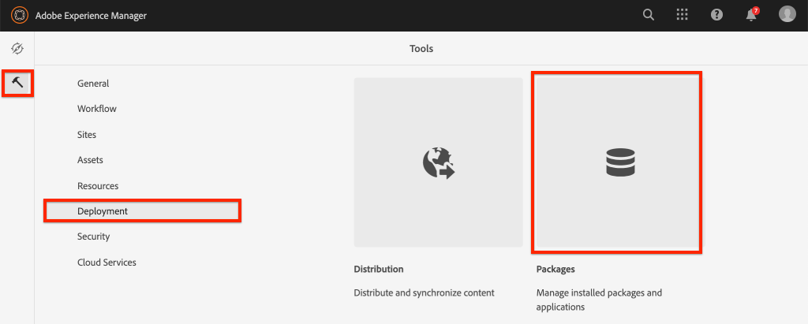
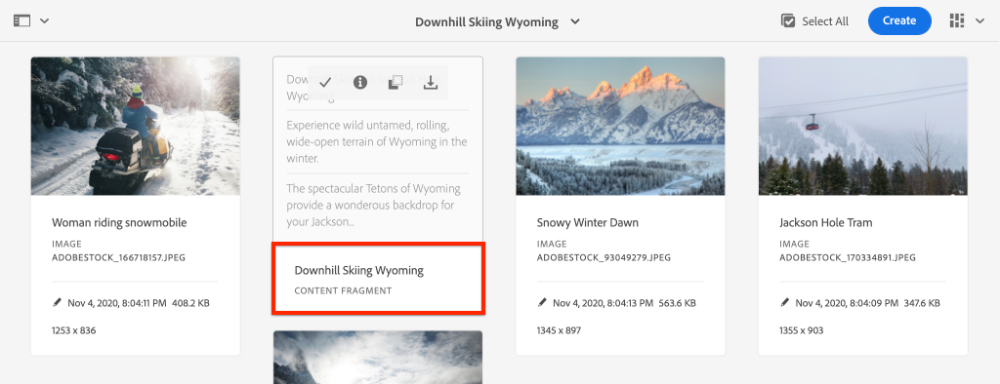
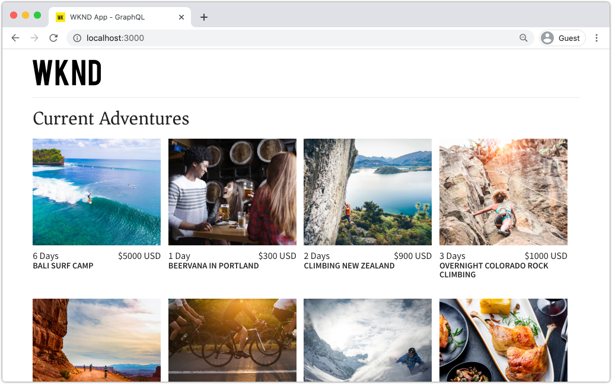
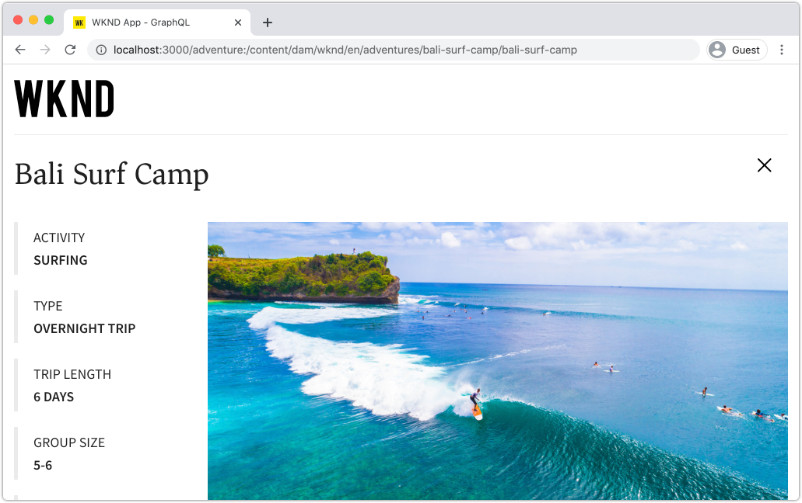

# 로컬 SDK를 사용하여 AEM Headless 빠른 설정 {#setup}

AEM 헤드리스 빠른 설정을 사용하면 WKND 사이트 샘플 프로젝트의 컨텐츠를 사용하여 AEM 헤드리스와 AEM Headless GraphQL API에서 컨텐츠를 사용하는 샘플 React 앱(SPA)을 직접 사용할 수 있습니다. 이 안내서에서는 [AEM as a Cloud Service SDK](https://experienceleague.adobe.com/docs/experience-manager-cloud-service/implementing/developing/aem-as-a-cloud-service-sdk.html?lang=en#aem-as-a-cloud-service-sdk).

## 전제 조건 {#prerequisites}

다음 도구는 로컬에 설치해야 합니다.

* [JDK 11](https://experience.adobe.com/#/downloads/content/software-distribution/en/general.html?1_group.propertyvalues.property=.%2Fjcr%3Acontent%2Fmetadata%2Fdc%3AsoftwareType&amp;1_group.propertyvalues.operation=equals&amp;1_group.propertyvalues.0_values=software-type%3Atologing&amp;fulltext=Oracle%7E+JDK%7E+11%7E&amp;orderby=%40jcr%3Acontent%3AlastModified&amp;orderby.sort=desc&amp;layout=0&amp;p.offset=0&amp;p.limit=0&amp;limit=1)
* [Node.js v10+](https://nodejs.org/en/)
* [npm 6+](https://www.npmjs.com/)
* [Git](https://git-scm.com/)

## 1. AEM SDK를 설치합니다. {#aem-sdk}

이 설정에서는 [AEM as a Cloud Service SDK](https://experienceleague.adobe.com/docs/experience-manager-cloud-service/implementing/developing/aem-as-a-cloud-service-sdk.html?lang=en#aem-as-a-cloud-service-sdk) AEM GraphQL API를 탐색합니다. 이 섹션에서는 AEM SDK를 설치하고 작성자 모드에서 실행하는 빠른 안내서를 제공합니다. 로컬 개발 환경 설정에 대한 자세한 안내서 [여기에서 찾을 수 있습니다.](https://experienceleague.adobe.com/docs/experience-manager-learn/cloud-service/local-development-environment-set-up/overview.html?lang=en#local-development-environment-set-up).

>[!NOTE]
>
> 또한 자습서에 [AEM as a Cloud Service 환경](./cloud-service.md). 클라우드 환경 사용에 대한 추가 참고 사항은 자습서 전체에서 포함되어 있습니다.

1. 로 이동합니다 **[소프트웨어 배포 포털](https://experience.adobe.com/#/downloads/content/software-distribution/en/aemcloud.html)** > **AEM as a Cloud Service** 최신 버전의 **AEM SDK**.

   

   >[!CAUTION]
   >
   > GraphQL 기능은 2021-02-04 이상의 AEM SDK에서만 기본적으로 활성화됩니다.

1. 다운로드 압축을 풀고 Quickstart jar 를 복사합니다(`aem-sdk-quickstart-XXX.jar`) 를 전용 폴더, 즉 `~/aem-sdk/author`.
1. jar 파일의 이름을 로 다시 지정합니다. `aem-author-p4502.jar`.

   다음 `author` name: Quickstart jar가 작성자 모드에서 시작되도록 지정합니다. 다음 `p4502` quickstart 서버가 포트 4502에서 실행되도록 지정합니다.

1. 새 터미널 창을 열고 jar 파일이 포함된 폴더로 이동합니다. 다음 명령을 실행하여 AEM 인스턴스를 설치하고 시작합니다.

   ```shell
   $ cd ~/aem-sdk/author
   $ java -jar aem-author-p4502.jar
   ```

1. 다음과 같이 관리자 암호를 제공합니다. `admin`. 모든 관리자 암호는 사용할 수 있지만 `admin` 를 사용하도록 선택할 수 있습니다.
1. 몇 분 후에 AEM 인스턴스가 설치를 완료하고 새 브라우저 창이 다음에 열립니다. [http://localhost:4502](http://localhost:4502).
1. 사용자 이름으로 로그인합니다. `admin` 및 AEM 초기 시작 중에 선택한 암호(일반적으로 `admin`).

## 2. 샘플 WKND 컨텐츠 설치 {#wknd-site-content}

의 샘플 컨텐츠 **WKND 참조 사이트** 이 설치되어 자습서를 가속화합니다. WKND는 가상 라이프스타일 브랜드이며, 종종 AEM 교육과 함께 사용됩니다.

WKND 참조 사이트에는 [GraphQL 끝점](https://experienceleague.adobe.com/docs/experience-manager-cloud-service/assets/admin/graphql-api-content-fragments.html?lang=en#graphql-aem-endpoint). 실제 구현에서는 다음의 문서화된 단계를 따릅니다. [GraphQL 엔드포인트 포함](https://experienceleague.adobe.com/docs/experience-manager-cloud-service/assets/admin/graphql-api-content-fragments.html?lang=en#graphql-aem-endpoint) 고객 프로젝트에서 확인하십시오. A [CORS](#cors-config) 는 WKND 사이트의 일부로 패키지화되어 있습니다. 외부 응용 프로그램에 대한 액세스 권한을 부여하려면 CORS 구성이 필요합니다. 자세한 내용은 [CORS](#cors-config) 은 아래에서 찾을 수 있습니다.

1. WKND Site용 최신 컴파일된 AEM 패키지를 다운로드합니다. [aem-guides-wknd.all-x.x.zip](https://github.com/adobe/aem-guides-wknd/releases/latest).

   >[!NOTE]
   >
   > AEM as a Cloud Service 및 과 호환되는 표준 버전을 다운로드하십시오 **not** a `classic` 버전.

1. 에서 **AEM 시작** 메뉴 탐색 **도구** > **배포** > **패키지**.

   

1. 클릭 **패키지 업로드** 이전 단계에서 다운로드한 WKND 패키지를 선택합니다. 클릭 **설치** 를 클릭하여 패키지를 설치합니다.

1. 에서 **AEM 시작** 메뉴 탐색 **자산** > **파일**.
1. 폴더를 클릭하여 이동합니다. **WKND 사이트** > **영어** > **모험**.

   

   WKND 브랜드로 승격된 다양한 모험들을 구성하는 모든 자산의 폴더입니다. 여기에는 이미지 및 비디오와 같은 기존 미디어 유형과 AEM과 같은 특정 미디어가 포함됩니다 **컨텐츠 조각**.

1. 을(를) 클릭하여 **다운 스키 와이오밍** 폴더를 클릭하고 **다운 스키 와이오밍 콘텐츠 조각** 카드:

   

1. 콘텐츠 조각 편집기 UI가 다운 스키 와이오밍 어드벤처에 대해 열립니다.

   

   다음과 같은 다양한 필드를 관찰합니다 **제목**, **설명**, 및 **활동** 조각을 정의합니다.

   **컨텐츠 조각** 는 AEM에서 컨텐츠를 관리할 수 있는 방법 중 하나입니다. 컨텐츠 조각은 텍스트, 리치 텍스트, 날짜 또는 다른 컨텐츠 조각에 대한 참조와 같은 구조화된 데이터 요소로 구성된 재사용 가능한 프레젠테이션에 관계 없는 컨텐츠입니다. 컨텐츠 조각은 튜토리얼의 후반부에 보다 자세히 탐색을 할 수 있습니다.

1. 클릭 **취소** 조각을 닫습니다. 다른 폴더 중 일부를 자유롭게 탐색하고 다른 Adventure 컨텐츠를 탐색합니다.

>[!NOTE]
>
> Cloud Service 환경을 사용하는 경우 방법에 대한 설명서를 참조하십시오. [WKND 참조 사이트와 같은 코드 베이스를 Cloud Service 환경에 배포](https://experienceleague.adobe.com/docs/experience-manager-cloud-service/implementing/deploying/overview.html?lang=en#coding-against-the-right-aem-version).

## 3. WKND React 앱을 다운로드하여 실행합니다. {#sample-app}

이 자습서의 목표 중 하나는 GraphQL API를 사용하여 외부 애플리케이션에서 AEM 컨텐츠를 사용하는 방법을 보여주는 것입니다. 이 자습서에서는 부분적으로 완료된 React 앱 예제를 사용하여 자습서를 가속화합니다. iOS, Android 또는 기타 플랫폼으로 빌드된 앱에 동일한 단원과 개념이 적용됩니다. React 앱은 불필요한 복잡성을 방지하기 위해 의도적으로 간단합니다. 참조 구현이 아닙니다.

1. Git을 사용하여 새 터미널 창 및 복제 자습서 시작 분기 를 엽니다.

   ```shell
   $ git clone --branch tutorial/react git@github.com:adobe/aem-guides-wknd-graphql.git
   ```

1. 선택한 IDE에서 파일을 엽니다 `.env.development` at `aem-guides-wknd-graphql/react-app/.env.development`. 다음 사항을 확인합니다. `REACT_APP_AUTHORIZATION` 줄이 주석 처리되지 않고 파일의 모양은 다음과 같습니다.

   ```plain
   REACT_APP_HOST_URI=http://localhost:4502
   REACT_APP_GRAPHQL_ENDPOINT=/content/graphql/global/endpoint.json
   # Use Authorization when connecting to an AEM Author environment
   REACT_APP_AUTHORIZATION=admin:admin
   ```

   확인 `React_APP_HOST_URI` 로컬 AEM 인스턴스와 일치합니다. 이 장에서는 React 앱을 AEM에 직접 연결합니다 **작성자** 환경. **작성자** 기본적으로 환경에는 인증이 필요하므로 앱이 `admin` 사용자. 이 방법은 AEM 환경을 빠르게 변경하고 앱에 즉시 반영되는 것을 볼 수 있으므로 개발 중 일반적인 방법입니다.

   >[!NOTE]
   >
   > 프로덕션 시나리오에서는 앱이 AEM에 연결됩니다 **게시** 환경. 자세한 내용은 [프로덕션 배포](../multi-step/production-deployment.md) 제2장.

1. 로 이동합니다. `aem-guides-wknd-graphql/react-app` 폴더를 입력합니다. 앱을 설치하고 시작합니다.

   ```shell
   $ cd aem-guides-wknd-graphql/react-app
   $ npm install
   $ npm start
   ```

1. 새 브라우저 창에서 다음 위치에서 앱을 자동으로 실행해야 합니다. [http://localhost:3000](http://localhost:3000).

   

   AEM의 현재 Adventure 컨텐츠 목록이 표시됩니다.

1. 모험 이미지 중 하나를 클릭하여 모험 세부 사항을 확인합니다. AEM에 모험에 대한 세부 사항을 반환해 달라는 요청이 있습니다.

   

1. 브라우저의 개발자 도구를 사용하여 **네트워크** 요청. 보기 **XHR** 에 대한 여러 POST 요청을 요청하고 관찰합니다. `/content/graphql/global/endpoint.json`: AEM용으로 구성된 GraphQL 종단점입니다.

   

1. 네트워크 요청을 검사하여 매개 변수와 JSON 응답을 볼 수도 있습니다. 과 같은 브라우저 확장을 설치하는 것이 도움이 될 수 있습니다. [GraphQL 네트워크 관리자](https://chrome.google.com/webstore/detail/graphql-network-inspector/ndlbedplllcgconngcnfmkadhokfaaln) Chrome이 쿼리 및 응답을 더 잘 이해할 수 있도록 해줍니다.

## 4. AEM에서 컨텐츠 편집

React 앱이 실행 중이니 AEM에서 콘텐츠를 업데이트하고 앱에 반영된 변경 사항을 확인합니다.

1. AEM으로 이동합니다. [http://localhost:4502](http://localhost:4502).
1. 다음으로 이동 **자산** > **파일** > **WKND 사이트** > **영어** > **모험** > **[발리 서프 캠프](http://localhost:4502/assets.html/content/dam/wknd/en/adventures/bali-surf-camp)**.

   

1. 을(를) 클릭하여 **발리 서프 캠프** 컨텐츠 조각을 사용하여 컨텐츠 조각 편집기를 엽니다.
1. 수정 **제목** 그리고 **설명** 모험의

   

1. 클릭 **저장** 변경 사항을 저장하려면 을 클릭합니다.
1. 의 React 앱으로 돌아갑니다. [http://localhost:3000](http://localhost:3000) 를 새로 고쳐 변경 사항을 확인합니다.

   

## 5. GraphiQL 도구 설치 {#install-graphiql}

[GraphiQL](https://github.com/graphql/graphiql) 는 개발 도구이며 개발 또는 로컬 인스턴스와 같은 하위 수준 환경에서만 필요합니다. GraphiQL IDE를 사용하면 반환된 쿼리 및 데이터를 빠르게 테스트하고 세분화할 수 있습니다. GraphiQL도 설명서에 쉽게 액세스할 수 있으므로 사용 가능한 방법을 쉽게 파악하고 이해할 수 있습니다.

1. 로 이동합니다 **[소프트웨어 배포 포털](https://experience.adobe.com/#/downloads/content/software-distribution/en/aemcloud.html)** > **AEM as a Cloud Service**.
1. &quot;GraphiQL&quot;을 검색합니다(를). **i** in **GraphiQL**.
1. 최신 다운로드 **GraphiQL 컨텐츠 패키지 v.x.x.x**

   

   zip 파일은 직접 설치할 수 있는 AEM 패키지입니다.

1. 에서 **AEM 시작** 메뉴 탐색 **도구** > **배포** > **패키지**.
1. 클릭 **패키지 업로드** 이전 단계에서 다운로드한 패키지를 선택합니다. 클릭 **설치** 를 클릭하여 패키지를 설치합니다.

   
1. GraphiQL IDE로 이동합니다. [http://localhost:4502/content/graphiql.html](http://localhost:4502/content/graphiql.html) GraphQL API 탐색을 시작합니다.

   >[!NOTE]
   >
   > GraphiQL 도구 및 GraphQL API는 다음과 같습니다 [튜토리얼의 후반부에 더 자세히 살펴보십시오](../multi-step/explore-graphql-api.md).

## 축하합니다! {#congratulations}

축하합니다. 이제 GraphQL에서 AEM 컨텐츠를 사용하는 외부 애플리케이션이 있습니다. 언제든지 React 앱에서 코드를 검사하고 기존 컨텐츠 조각 수정을 계속 실험할 수 있습니다.

### 다음 단계

* [AEM Headless 자습서 시작](../multi-step/overview.md)

## (보너스) CORS 구성 {#cors-config}

AEM은 기본적으로 보안을 유지하여 교차 도메인 요청을 차단하므로 허가되지 않은 응용 프로그램이 해당 내용에 연결되어 표시되지 않습니다.

이 자습서의 React 앱이 AEM GraphQL API 끝점과 상호 작용할 수 있도록 WKND 사이트 참조 프로젝트에 원본 간 리소스 공유 구성이 정의되어 있습니다.


배포된 구성을 보려면

1. 에서 AEM SDK의 웹 콘솔로 이동합니다. [http://localhost:4502/system/console](http://localhost:4502/system/console).

   >[!NOTE]
   >
   > 웹 콘솔은 SDK에서만 사용할 수 있습니다. AEM as a Cloud Service 환경에서는 [개발자 콘솔](https://experienceleague.adobe.com/docs/experience-manager-learn/cloud-service/debugging/debugging-aem-as-a-cloud-service/developer-console.html).

1. 상단 메뉴에서 **OSGI** > **구성** 모든 것을 [OSGi 구성](http://localhost:4502/system/console/configMgr).
1. 페이지를 아래로 스크롤합니다. **Granite CORS(원본 간 리소스 공유) Adobe**.
1. 다음에 대한 구성을 클릭합니다. `com.adobe.granite.cors.impl.CORSPolicyImpl~wknd-graphql`.
1. 다음 필드가 업데이트되었습니다.
   * 허용된 원본(Regex): `http://localhost:.*`
      * 모든 로컬 호스트 연결을 허용합니다.
   * 허용되는 경로: `/content/graphql/global/endpoint.json`
      * 현재 구성된 유일한 GraphQL 엔드포인트입니다. CORS 구성은 가능한 한 제한적이어야 합니다.
   * 허용되는 메서드: `GET`, `HEAD`, `POST`
      * 전용 `POST` 는 GraphQL에 필요하지만 다른 방법은 헤드리스 방식으로 AEM과 상호 작용할 때 유용할 수 있습니다.
   * 지원되는 헤더: **권한** 작성자 환경에서 기본 인증을 전달하도록 이 추가되었습니다.
   * 자격 증명 지원: `Yes`
      * React 앱이 AEM 작성자 서비스에서 보호된 GraphQL 종료 포인트와 통신하므로 필요합니다.

이 구성 및 GraphQL 종단점은 AEM WKND 프로젝트의 일부입니다. 모든 [OSGi 구성은 여기에서](https://github.com/adobe/aem-guides-wknd/tree/master/ui.config/src/main/content/jcr_root/apps/wknd/osgiconfig).
