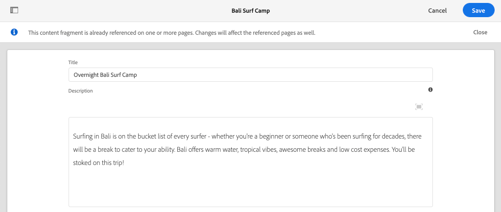

# 로컬 AEM SDK을 사용한 AEM Headless 빠른 설정 {#setup}

AEM Headless 빠른 설정은 WKND Site 샘플 프로젝트 및 AEM Headless GraphQL API에 대한 콘텐츠를 사용하는 샘플 React 앱(SPA)의 콘텐츠를 사용하여 AEM Headless를 실습해 볼 수 있도록 합니다. 이 안내서에서는 [AEM as a Cloud Service SDK](https://experienceleague.adobe.com/docs/experience-manager-cloud-service/content/implementing/developing/aem-as-a-cloud-service-sdk.html?lang=ko)를 사용합니다.

## 사전 요구 사항 {#prerequisites}

다음 도구를 로컬에 설치해야 합니다.

* [JDK 11](https://experience.adobe.com/#/downloads/content/software-distribution/en/general.html?1_group.propertyvalues.property=.%2Fjcr%3Acontent%2Fmetadata%2Fdc%3AsoftwareType&1_group.propertyvalues.operation=equals&1_group.propertyvalues.0_values=software-type%3Atoling&fulltext=Oracle%7E+JDK%7E+11%7E&orderby=%40jcr%3Acontent%2Fjcr%3AlastModified&orderby.sort=desc&layout=list&p.offset=0&p.limit=14)
* [Node.js v18](https://nodejs.org/en/)
* [Git](https://git-scm.com/)

## 1. AEM SDK 설치 {#aem-sdk}

이 설정에서는 [AEM as a Cloud Service SDK](https://experienceleague.adobe.com/docs/experience-manager-cloud-service/implementing/developing/aem-as-a-cloud-service-sdk.html?lang=ko&#aem-as-a-cloud-service-sdk)를 사용하여 AEM의 GraphQL API를 살펴봅니다. 이 섹션에서는 AEM SDK을 설치하고 작성자 모드에서 실행하는 방법에 대한 빠른 안내서를 제공합니다. 로컬 개발 환경 [을(를) 설정하는 자세한 안내서는 여기](https://experienceleague.adobe.com/docs/experience-manager-learn/cloud-service/local-development-environment-set-up/overview.html?lang=ko#local-development-environment-set-up)에서 확인할 수 있습니다.

>[!NOTE]
>
> [AEM as a Cloud Service 환경](./cloud-service.md)에서 자습서를 따를 수도 있습니다. Cloud 환경 사용에 대한 추가 참고가 자습서 전체에 포함되어 있습니다.

1. **[소프트웨어 배포 포털](https://experience.adobe.com/#/downloads/content/software-distribution/en/aemcloud.html?fulltext=AEM*+SDK*&amp;orderby=%40jcr%3Acontent%2Fjcr%3AlastModified&amp;orderby.sort=desc&amp;layout=list&amp;p.offset=0&amp;p.limit=1)** > **AEM as a Cloud Service**(으)로 이동하여 **AEM SDK**&#x200B;의 최신 버전을 다운로드합니다.

   

1. 다운로드의 압축을 풀고 Quickstart Jar(`aem-sdk-quickstart-XXX.jar`)를 전용 폴더(예: `~/aem-sdk/author`)에 복사합니다.
1. jar 파일의 이름을 `aem-author-p4502.jar`(으)로 바꿉니다.

   `author` 이름은 Quickstart jar가 작성자 모드에서 시작되도록 지정합니다. `p4502`은(는) 포트 4502에서 빠른 시작 실행을 지정합니다.

1. AEM 인스턴스를 설치하고 시작하려면 jar 파일이 포함된 폴더에서 명령 프롬프트를 열고 다음 명령 를 실행합니다.

   ```shell
   $ cd ~/aem-sdk/author
   $ java -jar aem-author-p4502.jar
   ```

1. 관리자 암호를 `admin`(으)로 제공하십시오. 모든 관리자 암호를 사용할 수 있지만, 다시 구성할 필요가 없도록 로컬 개발에 `admin`을(를) 사용하는 것이 좋습니다.
1. AEM 서비스 설치를 마치면 [http://localhost:4502](http://localhost:4502)에 새 브라우저 창이 열립니다.
1. AEM의 초기 시작 시 선택한 사용자 이름 `admin` 및 암호로 로그인합니다(일반적으로 `admin`).

## 2. 샘플 콘텐츠 설치 {#install-sample-content}

**WKND 참조 사이트**&#x200B;의 샘플 콘텐츠를 사용하여 자습서를 가속화합니다. WKND는 AEM 교육에 자주 사용되는 가상 생활 스타일 브랜드입니다.

WKND 사이트에는 [GraphQL 끝점](https://experienceleague.adobe.com/docs/experience-manager-cloud-service/content/headless/graphql-api/content-fragments.html?lang=ko)을 노출하는 데 필요한 구성이 포함되어 있습니다. 실제 구현에서는 문서화된 단계에 따라 고객 프로젝트에 [GraphQL 끝점을 포함](https://experienceleague.adobe.com/docs/experience-manager-cloud-service/content/headless/graphql-api/content-fragments.html?lang=ko)합니다. [CORS](#cors-config)도 WKND 사이트의 일부로 패키지되었습니다. 외부 응용 프로그램에 대한 액세스 권한을 부여하려면 CORS 구성이 필요합니다. [CORS](#cors-config)에 대한 자세한 내용은 아래에서 확인할 수 있습니다.

1. WKND 사이트용 컴파일된 최신 AEM 패키지를 다운로드합니다. [aem-guides-wknd.all-x.x.x.zip](https://github.com/adobe/aem-guides-wknd/releases/latest).

   >[!NOTE]
   >
   > AEM as a Cloud Service과 호환되는 표준 버전을 다운로드하고 `classic` 버전을 **아님**&#x200B;하세요.

1. **AEM 시작** 메뉴에서 **도구** > **배포** > **패키지**&#x200B;로 이동합니다.

   

1. **패키지 업로드**&#x200B;를 클릭하고 이전 단계에서 다운로드한 WKND 패키지를 선택합니다. **설치**&#x200B;를 클릭하여 패키지를 설치합니다.

1. **AEM 시작** 메뉴에서 **Assets** > **파일** > **WKND 공유** > **영어** > **모험**(으)로 이동합니다.

   

   WKND 브랜드에서 추진하는 다양한 모험을 구성하는 모든 에셋의 폴더입니다. 여기에는 이미지 및 비디오와 같은 기존 미디어 유형과 **콘텐츠 조각**&#x200B;과 같은 AEM 관련 미디어가 포함됩니다.

1. **활강 스키 와이오밍** 폴더를 클릭하고 **활강 스키 와이오밍 콘텐츠 조각** 카드를 클릭합니다.

   

1. 활강 스키 와이오밍 모험을 위한 콘텐츠 조각 편집기가 열립니다.

   

   **제목**, **설명**, **활동** 등 다양한 필드에서 조각을 정의하는지 확인하십시오.

   **콘텐츠 조각**&#x200B;은(는) AEM에서 콘텐츠를 관리할 수 있는 방법 중 하나입니다. 콘텐츠 조각은 텍스트, 리치 텍스트, 날짜 또는 다른 콘텐츠 조각에 대한 참조와 같은 구조화된 데이터 요소로 구성된 재사용 가능한 프레젠테이션 독립적인 콘텐츠입니다. 콘텐츠 조각은 나중에 빠른 설정에서 더 자세히 살펴봅니다.

1. 조각을 닫으려면 **취소**&#x200B;를 클릭하십시오. 자유롭게 다른 폴더 중 일부로 이동하여 다른 어드벤처 콘텐츠를 살펴보십시오.

>[!NOTE]
>
> Cloud Service 환경을 사용하는 경우 WKND 참조 사이트와 같은 코드 베이스를 Cloud Service 환경에 [배포](https://experienceleague.adobe.com/docs/experience-manager-cloud-service/implementing/deploying/overview.html?lang=ko#coding-against-the-right-aem-version)하는 방법에 대한 설명서를 참조하십시오.

## 3. WKND React 앱 다운로드 및 실행 {#sample-app}

이 자습서의 목표 중 하나는 GraphQL API를 사용하여 외부 애플리케이션에서 AEM 콘텐츠를 사용하는 방법을 보여 주는 것입니다. 이 자습서에서는 React 앱 예제를 사용합니다. React 앱은 AEM의 GraphQL API와의 통합에 초점을 맞추기 위해 의도적으로 간단합니다.

1. 새 명령 프롬프트를 열고 GitHub에서 샘플 React 앱을 복제합니다.

   ```shell
   $ git clone git@github.com:adobe/aem-guides-wknd-graphql.git
   $ cd aem-guides-wknd-graphql/react-app
   ```

1. 선택한 IDE의 `aem-guides-wknd-graphql/react-app`에서 React 앱을 엽니다.
1. IDE에서 `/.env.development`에 있는 `.env.development` 파일을 엽니다. `REACT_APP_AUTHORIZATION` 줄의 주석 처리를 제거하고 파일이 다음 변수를 선언하는지 확인합니다.

   ```plain
   REACT_APP_HOST_URI=http://localhost:4502
   REACT_APP_GRAPHQL_ENDPOINT=/content/graphql/global/endpoint.json
   # Use Authorization when connecting to an AEM Author environment
   REACT_APP_AUTHORIZATION=admin:admin
   ```

   로컬 AEM SDK에 대해 `REACT_APP_HOST_URI`점을 확인합니다. 이 빠른 시작은 편의상 React 앱을 **AEM 작성자**&#x200B;에 연결합니다. **작성자** 서비스에는 인증이 필요하므로 앱은 `admin` 사용자를 사용하여 연결을 설정합니다. AEM 작성자에 앱을 연결하는 것은 변경 사항을 게시하지 않고도 콘텐츠를 빠르게 반복할 수 있으므로 개발 중에 일반적인 방법입니다.

   >[!NOTE]
   >
   > 프로덕션 시나리오에서는 앱이 AEM **Publish** 환경에 연결됩니다. 이 내용은 _프로덕션 배포_ 섹션에서 자세히 다룹니다.


1. React 앱을 설치하고 시작합니다.

   ```shell
   $ cd aem-guides-wknd-graphql/react-app
   $ npm install
   $ npm start
   ```

1. 새 브라우저 창에서 [http://localhost:3000](http://localhost:3000)에 앱이 자동으로 열립니다.

   

   AEM의 모험 콘텐츠 목록이 표시됩니다.

1. 어드벤처 세부 사항을 보려면 어드벤처 이미지 중 하나를 클릭하십시오. 모험에 대한 세부 정보를 반환하도록 AEM에 요청합니다.

   

1. 브라우저의 개발자 도구를 사용하여 **네트워크** 요청을 검사합니다. **XHR** 요청을 보고 `/graphql/execute.json/...`에 대한 여러 GET 요청을 확인합니다. 이 경로 접두사는 AEM의 지속 쿼리 끝점을 호출하여 이름 및 접두사 다음의 인코딩된 매개 변수를 사용하여 실행할 지속 쿼리를 선택합니다.

   

## 4. AEM에서 컨텐츠 편집

React 앱이 실행 중인 경우 AEM에서 콘텐츠를 업데이트하고 변경 사항이 앱에 반영되었는지 확인합니다.

1. AEM [http://localhost:4502](http://localhost:4502)&#x200B;(으)로 이동합니다.
1. **Assets** > **파일** > **WKND 공유** > **영어** > **모험** > **[Bali Surf Camp](http://localhost:4502/assets.html/content/dam/wknd-shared/en/adventures/bali-surf-camp)**(으)로 이동합니다.

   

1. **Bali Surf Camp** 콘텐츠 조각을 클릭하여 콘텐츠 조각 편집기를 엽니다.
1. 모험의 **제목** 및 **설명**&#x200B;을 수정합니다.

   

1. **저장**&#x200B;을 클릭하여 변경 내용을 저장합니다.
1. 변경 내용을 보려면 [http://localhost:3000](http://localhost:3000)에서 React 앱을 새로 고치십시오.

   

## 5. GraphiQL 살펴보기 {#graphiql}

1. **도구** > **일반** > **GraphQL 쿼리 편집기**&#x200B;로 이동하여 [GraphiQL](http://localhost:4502/aem/graphiql.html)을(를) 엽니다.
1. 왼쪽에서 기존 지속 쿼리를 선택하고 실행하여 결과를 확인합니다.

   >[!NOTE]
   >
   > GraphiQL 도구 및 GraphQL API는 [나중에 자습서에서 자세히 알아봅니다](../multi-step/explore-graphql-api.md).

## 축하합니다!{#congratulations}

축하합니다. 이제 GraphQL으로 AEM 콘텐츠를 사용하는 외부 애플리케이션이 있습니다. 언제든지 React 앱에서 코드를 검사하고 기존 콘텐츠 조각을 수정해 보십시오.

### 다음 단계

* [AEM Headless 튜토리얼 시작](../multi-step/overview.md)
