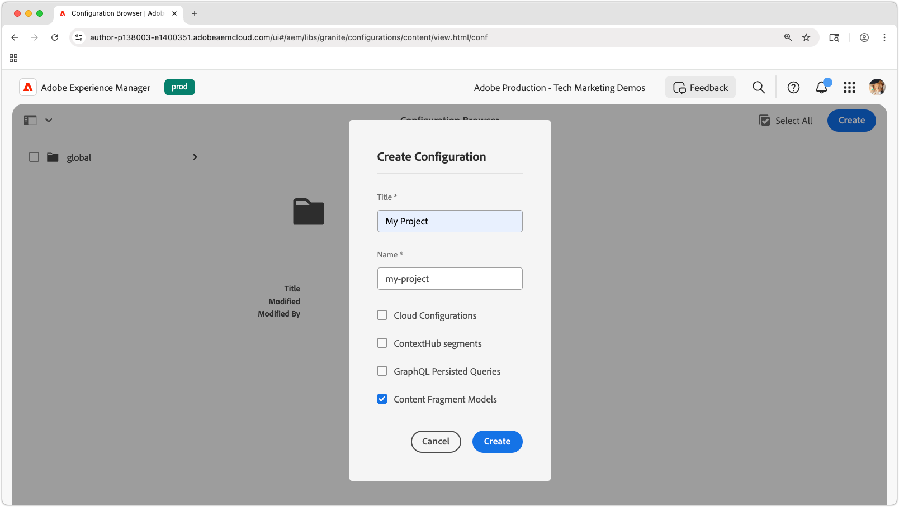

# 콘텐츠 조각 모델 만들기

이 장에서는 콘텐츠를 모델링하고 **콘텐츠 조각 모델**&#x200B;을(를) 사용하여 스키마를 구축하는 방법과 콘텐츠 조각 모델을 정의하는 다양한 데이터 유형에 대해 알아봅니다.

이 자습서에서는 **팀**&#x200B;과 **사람**, 이렇게 두 개의 간단한 모델을 만듭니다. **Team** 데이터 모델에 이름, 약식 이름 및 설명이 있으며 전체 이름, 생체 정보, 프로필 사진 및 직업 목록이 있는 **Person** 데이터 모델을 참조합니다.

## 목표

* 콘텐츠 조각 모델을 만듭니다.
* 모델 구축에 사용 가능한 데이터 유형 및 유효성 검사 옵션을 살펴봅니다.
* 콘텐츠 조각 모델에서 콘텐츠 조각에 대한 데이터 스키마와 작성 템플릿을 **모두**&#x200B;정의하는 방법을 이해합니다.

## 프로젝트 구성 만들기

프로젝트 구성은 특정 프로젝트와 관련된 모든 콘텐츠 조각 모델을 포함하며 모델을 구성하는 수단을 제공합니다. 콘텐츠 조각 모델을 만드는 **이전** 프로젝트를 하나 이상 만듭니다.

1. AEM **작성자** 환경에 로그인합니다(예: `https://author-p<PROGRAM_ID>-e<ENVIRONMENT_ID>.adobeaemcloud.com/`).
1. AEM 시작 화면에서 **도구** > **일반** > **구성 브라우저**&#x200B;로 이동합니다.
1. 맨 위의 작업 표시줄에서 **만들기**&#x200B;를 클릭하고 다음 구성 세부 정보를 입력합니다.
   * 제목: **내 프로젝트**
   * 이름: **my-project**
   * 콘텐츠 조각 모델: **확인됨**

   

1. 프로젝트 구성을 만들려면 **만들기**&#x200B;를 선택하십시오.

## 콘텐츠 조각 모델 만들기

그런 다음 **팀** 및 **개인**&#x200B;에 대한 콘텐츠 조각 모델을 만듭니다. 이는 팀과 팀에 속한 사람을 나타내는 데이터 모델 또는 스키마 역할을 하며 작성자가 이러한 모델을 기반으로 콘텐츠 조각을 만들고 편집할 수 있는 인터페이스를 정의합니다.

### 개인 콘텐츠 조각 모델 만들기

팀에 속한 사용자를 나타내는 데이터 모델 또는 스키마인 **개인**&#x200B;에 대한 콘텐츠 조각 모델을 만듭니다.

1. AEM 시작 화면에서 **도구** > **일반** > **콘텐츠 조각 모델**&#x200B;로 이동합니다.
1. **내 프로젝트** 폴더로 이동합니다.
1. 오른쪽 상단의 **만들기**&#x200B;을(를) 선택하여 **모델 만들기** 마법사를 표시합니다.
1. 다음 속성을 사용하여 콘텐츠 조각 모델을 만듭니다.

   * 모델 제목: **사용자**
   * 모델 사용: **확인**

   **만들기**&#x200B;를 선택합니다. 결과 대화 상자에서 **열기**&#x200B;를 선택하여 모델을 빌드합니다.

1. **한 줄 텍스트** 요소를 기본 패널로 끌어서 놓습니다. **속성** 탭에서 다음 속성을 입력하십시오.

   * 필드 레이블: **전체 이름**
   * 속성 이름: `fullName`
   * **필수** 확인

   **속성 이름**&#x200B;은(는) 작성된 값이 AEM에 저장되는 속성의 이름을 정의합니다. **속성 이름**&#x200B;은(는) 또한 이 속성의 **키** 이름을 데이터 스키마의 일부로 정의하며 AEM의 OpenAPI를 통해 콘텐츠 조각이 전달될 때 JSON 응답의 키로 사용됩니다.

1. **데이터 형식** 탭을 선택하고 **전체 이름** 필드 아래에 **여러 줄 텍스트** 필드를 끌어서 놓습니다. 다음 속성을 입력합니다.

   * 필드 레이블: **전기**
   * 속성 이름: `biographyText`
   * 기본 유형: **서식 있는 텍스트**

1. **데이터 형식** 탭을 클릭하고 **콘텐츠 참조** 필드를 끌어서 놓습니다. 다음 속성을 입력합니다.

   * 필드 레이블: **프로필 사진**
   * 속성 이름: `profilePicture`
   * 루트 경로: `/content/dam`

     **루트 경로**&#x200B;를 구성할 때 **폴더** 아이콘을 클릭하여 경로를 선택하는 모달을 표시할 수 있습니다. 이로 인해 작성자가 경로를 채우는 데 사용할 수 있는 폴더가 제한됩니다. `/content/dam`은(는) 모든 AEM Assets(이미지, 비디오, 기타 콘텐츠 조각)가 저장되는 루트입니다.

   * 특정 콘텐츠 형식만 수락: **이미지**

     **이미지**&#x200B;의 콘텐츠 형식만 사용하여 필드를 채울 수 있도록 **그림 참조**&#x200B;에 유효성 검사를 추가하십시오.

   * 썸네일 표시: **확인함**

1. **데이터 형식** 탭을 클릭하고 **그림 참조** 필드 아래에 **열거형** 데이터 형식을 끌어서 놓습니다. 다음 속성을 입력합니다.

   * 렌더링 형식: **확인란**
   * 필드 레이블: **직업**
   * 속성 이름: `occupation`
   * 옵션:
      * **아티스트**
      * **영향력 있는 사용자**
      * **사진사**
      * **여행자**
      * **작성기**
      * **YouTube**

   옵션 레이블과 값을 모두 동일한 값으로 설정합니다.

1. 최종 **사용자** 모델은 다음과 같아야 합니다.

   

1. **저장**&#x200B;을 클릭하여 변경 내용을 저장합니다.

### 팀 콘텐츠 조각 모델 만들기

사람 팀의 데이터 모델인 **팀**&#x200B;에 대한 콘텐츠 조각 모델을 만듭니다. 팀 모델은 팀 구성원을 나타내는 개인 콘텐츠 조각을 참조합니다.

1. **내 프로젝트** 폴더에서 오른쪽 상단의 **만들기**&#x200B;을(를) 선택하여 **모델 만들기** 마법사를 표시합니다.
1. **모델 제목** 필드에 **팀**&#x200B;을 입력하고 **만들기**&#x200B;를 선택합니다.

   결과 대화 상자에서 **열기**&#x200B;를 선택하여 새로 만든 모델을 엽니다.

1. **한 줄 텍스트** 요소를 기본 패널로 끌어서 놓습니다. **속성** 탭에서 다음 속성을 입력하십시오.

   * 필드 레이블: **제목**
   * 속성 이름: `title`
   * **필수** 확인

1. **데이터 형식** 탭을 선택하고 **짧은 이름** 필드 아래에 **여러 줄 텍스트** 필드를 끌어서 놓습니다. 다음 속성을 입력합니다.

   * 필드 레이블: **설명**
   * 속성 이름: `description`
   * 기본 유형: **서식 있는 텍스트**

1. **데이터 형식** 탭을 클릭하고 **조각 참조** 필드를 끌어서 놓습니다. 다음 속성을 입력합니다.

   * 렌더링 형식: **여러 필드**
   * 최소 항목 수: **2**
   * 필드 레이블: **팀원**
   * 속성 이름: `teamMembers`
   * 허용되는 콘텐츠 조각 모델: 폴더 아이콘을 사용하여 **개인** 모델을 선택하십시오.

1. 최종 **팀** 모델은 다음과 같아야 합니다.

   

1. **저장**&#x200B;을 클릭하여 변경 내용을 저장합니다.

1. 이제 다음 두 가지 모델을 사용하여 작업할 수 있습니다.

   

## 축하합니다!

축하합니다. 방금 첫 번째 콘텐츠 조각 모델을 만들었습니다!

## 다음 단계

다음 장 [콘텐츠 조각 모델 작성](2-author-content-fragments.md)에서는 콘텐츠 조각 모델을 기반으로 새 콘텐츠 조각을 만들고 편집합니다. 콘텐츠 조각의 변형을 만드는 방법도 알아봅니다.

## 관련 설명서

* [콘텐츠 조각 모델](https://experienceleague.adobe.com/docs/experience-manager-cloud-service/content/assets/content-fragments/content-fragments-models.html)

