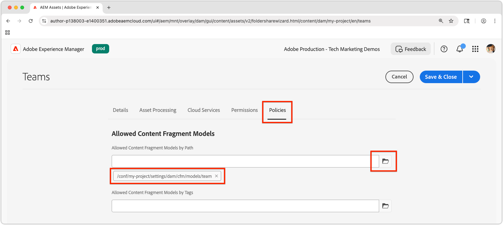

# 콘텐츠 조각 작성

이 장에서는 [팀 및 개인 콘텐츠 조각 모델](./1-content-fragment-models.md)을(를) 기반으로 새 콘텐츠 조각을 만들고 편집합니다. 이러한 콘텐츠 조각은 OpenAPI API와 함께 AEM 콘텐츠 조각 전달을 사용하는 React 앱에서 사용하는 콘텐츠입니다.

## 사전 요구 사항

이 자습서는 여러 부분으로 나뉘어져 있으며 [콘텐츠 조각 모델 정의](./1-content-fragment-models.md)에 설명된 단계가 완료된 것으로 간주됩니다.

## 목표

* 콘텐츠 조각 모델을 기반으로 콘텐츠 조각을 만듭니다.
* 콘텐츠 조각을 작성합니다.
* 콘텐츠 조각을 게시합니다.

## 콘텐츠 조각용 에셋 폴더 만들기

컨텐츠 조각은 AEM Assets의 폴더에 저장됩니다. 이전 장에서 만든 콘텐츠 조각 모델에서 콘텐츠 조각을 만들려면 저장할 폴더가 있어야 합니다. 특정 콘텐츠 조각 모델에서 콘텐츠 조각을 만들 수 있도록 폴더에 구성이 필요합니다.

AEM은 &quot;플랫&quot; 폴더 구성을 지원합니다. 즉, 다른 콘텐츠 조각 모델의 콘텐츠 조각이 단일 폴더에서 함께 혼합됩니다. 그러나 이 자습서에서는 콘텐츠 조각 모델에 맞는 폴더 구조를 사용하여 **다음 챕터**&#x200B;에서 [폴더별 모든 콘텐츠 조각 나열](./3-explore-openapis.md) API를 탐색합니다. 콘텐츠 조각 조직을 결정할 때는 콘텐츠 조각을 작성 및 관리할 방법과 OpenAPI를 통해 AEM 콘텐츠 조각 전달을 통해 전달하고 소비하는 방법을 모두 고려하십시오.

1. AEM 시작 화면에서 **Assets** > **파일**(으)로 이동합니다.
1. 오른쪽 상단에서 **만들기**&#x200B;를 선택하고 **폴더**&#x200B;를 선택합니다. 다음을 입력합니다.

   * 제목: **내 프로젝트**
   * 이름: **my-project**

   폴더를 만들려면 **만들기**&#x200B;를 선택합니다.

1. 새 **내 프로젝트** 폴더를 열고 새 **내 프로젝트** 폴더 아래에 다음 값으로 하위 폴더를 만듭니다.

   * 제목: **영어**
   * 이름: **en**

   AEM의 기본 현지화 기능을 지원하도록 프로젝트를 배치하기 위해 루트 언어 폴더를 만듭니다. 가장 좋은 방법은 현지화가 필요하지 않더라도 다국어 지원을 위한 프로젝트를 설정하는 것입니다. 자세한 내용은 [다음 문서 페이지](https://experienceleague.adobe.com/docs/experience-manager-cloud-service/content/assets/admin/translate-assets.html)를 참조하세요.

1. 다음 값으로 새 **내 프로젝트 > 영어** 폴더 아래에 두 개의 하위 폴더를 만듭니다.

   `teams`팀&#x200B;**콘텐츠 조각이 포함된** 폴더

   * 제목: **팀**
   * 이름: **팀**

   ... 및 `people`개인&#x200B;**콘텐츠 조각이 포함된** 폴더.

   * 제목: **사람**
   * 이름: **사람**

1. **내 프로젝트 > 영어** 폴더로 다시 이동하여 두 개의 새 폴더가 만들어졌는지 확인하십시오.
1. **Teams** 폴더를 선택하고 맨 위의 작업 표시줄에서 **속성**&#x200B;을 선택합니다.
1. **정책** 탭을 선택하고 **에서 상속된`/content/dam/my-project`**&#x200B;을(를) 선택 취소합니다.
1. **정책** 탭의 **경로별 허용된 콘텐츠 조각 모델** 필드에서 **팀** 콘텐츠 조각 모델을 선택합니다.

   

   이러한 정책은 하위 폴더에 자동으로 상속되지만 재정의할 수 있습니다. 태그로 콘텐츠 조각 모델을 허용하거나 다른 프로젝트 구성의 콘텐츠 조각 모델을 활성화할 수 있습니다. 이 메커니즘은 콘텐츠 계층 구조를 관리하는 강력한 방법을 제공합니다.

1. 폴더 속성에 대한 변경 사항을 저장하려면 **저장 및 닫기**&#x200B;를 선택합니다.
1. **사람** 폴더에 대한 **정책**&#x200B;을 같은 방식으로 업데이트하되 대신 **사람** 콘텐츠 조각 모델을 선택하세요.

## 개인 콘텐츠 조각 만들기

**내 프로젝트 > 영어 > 사람** 폴더의 **사람** 콘텐츠 조각 모델을 기반으로 콘텐츠 조각을 만듭니다.

1. AEM 시작 화면에서 **콘텐츠 조각**&#x200B;을 선택하여 콘텐츠 조각 콘솔을 엽니다.
1. **폴더 표시** 단추를 선택하여 폴더 브라우저를 엽니다.
1. **내 프로젝트 > 영어 > 사람** 폴더를 선택합니다.
1. **만들기 > 콘텐츠 조각**&#x200B;을(를) 선택하고 다음 값을 입력하십시오.

   * 위치: `/content/dam/my-project/en/people`
   * 콘텐츠 조각 모델: **개인**
   * 제목: **John Doe**
   * 이름: `john-doe`

   **새 콘텐츠 조각** 대화 상자의 **제목**, **이름** 및 **설명** 필드는 콘텐츠 조각 데이터의 일부가 아니라 콘텐츠 조각에 대한 메타데이터로 저장됩니다.

   

1. **만들기 및 열기**&#x200B;를 선택합니다.
1. **John Doe** 조각의 필드를 채웁니다.

   * 전체 이름: **John Doe**
   * 전기: **John Doe는 소셜 미디어와 여행 애호가를 좋아합니다.**
   * 프로필 사진: `/content/dam`에서 이미지를 선택하거나 새 이미지를 업로드하세요.
   * 직업: **영향력 있는 사용자**, **여행자**

   이러한 필드 및 값은 OpenAPI를 통해 AEM 콘텐츠 조각 전달을 통해 사용할 콘텐츠 조각의 콘텐츠를 정의합니다.

   

1. 콘텐츠 조각 변경 내용이 자동으로 저장되므로 **저장** 단추가 없습니다.
1. 콘텐츠 조각 콘솔로 돌아가서 **내 프로젝트 > 영어 > 사용자**&#x200B;를 선택하여 새 콘텐츠 조각을 확인합니다.

### 추가 사용자 콘텐츠 조각 만들기

추가 **개인** 조각을 만들려면 위의 단계를 반복합니다.

1. 다음 속성을 사용하여 **Alison Smith**&#x200B;에 대한 개인 콘텐츠 조각을 만듭니다.

   * 위치: `/content/dam/my-project/en/people`
   * 콘텐츠 조각 모델: **개인**
   * 제목: **Alison Smith**
   * 이름: `alison-smith`

   **만들기 및 열기**&#x200B;를 선택하고 다음 값을 작성합니다.

   * 전체 이름: **앨리슨 스미스**
   * 전기: **Alison은 사진작가이며 그녀의 여행에 대해 쓰는 것을 좋아합니다.**
   * 프로필 사진: `/content/dam`에서 이미지를 선택하거나 새 이미지를 업로드하세요.
   * 직업: **사진사**, **여행자**, **작가**.

이제 **내 프로젝트 > 영어 > 사람** 폴더에 두 개의 콘텐츠 조각이 있습니다.

원할 경우 추가 사용자를 나타내기 위해 몇 개의 사용자 콘텐츠 조각을 더 만들 수 있습니다.

## 팀 콘텐츠 조각 만들기

동일한 방법을 사용하여 **내 프로젝트 > 영어 > 팀** 폴더에서 **팀** 콘텐츠 조각 모델을 기반으로 **팀** 조각을 만듭니다.

1. 다음 속성을 사용하여 **팀 Alpha**&#x200B;을(를) 나타내는 **팀** 조각을 만듭니다.

   * 위치: `/content/dam/my-project/en`
   * 콘텐츠 조각 모델: **팀**
   * 제목: **팀 Alpha**
   * 이름: `team-alpha`

   **만들기 및 열기**&#x200B;를 선택하고 다음 값을 작성합니다.

   * 제목: **팀 Alpha**
   * 설명: **팀 Alpha은 사진 및 여행 작성을 전문으로 하는 여행 콘텐츠 팀입니다.**
   * **팀원**: **John Doe** 및 **Alison Smith** 콘텐츠 조각을 선택하여 **팀원** 필드를 채웁니다.

   

1. 팀 콘텐츠 조각을 만들려면 **만들기 및 열기**&#x200B;를 선택하십시오.
1. **내 프로젝트 > 영어 > 팀** 아래에 하나의 콘텐츠 조각이 있어야 합니다.

이제 **내 프로젝트 > 영어 > 팀** 폴더에 **팀 Alpha** 콘텐츠 조각이 있어야 합니다.

필요한 경우 다른 사용자 집합과 함께 **팀 오메가**&#x200B;를 만듭니다.

## 콘텐츠 조각 게시

컨텐츠 조각을 OpenAPI를 통해 사용할 수 있도록 하려면 게시합니다. 게시를 사용하면 다음을 통해 콘텐츠 조각에 액세스할 수 있습니다.

* **서비스 게시** - 프로덕션 응용 프로그램에 콘텐츠를 제공합니다.
* **미리보기 서비스** - 미리보기 응용 프로그램에 콘텐츠를 제공합니다.

일반적으로 콘텐츠는 먼저 **미리보기 서비스**&#x200B;에 게시되고 **게시 서비스**&#x200B;에 게시되기 전에 미리보기 응용 프로그램에서 검토됩니다. **게시 서비스**&#x200B;에 게시하는 것은 **미리보기 서비스**&#x200B;에도 게시되지 않습니다. **미리 보기 서비스**&#x200B;에 별도로 게시해야 합니다.

이 자습서에서는 AEM Publish 서비스에 게시되지만 AEM 미리 보기 서비스를 사용하는 것은 React 앱에서 [AEM 서비스의 URL을 변경하는 것만큼 쉽습니다](./4-react-app.md)

1. 콘텐츠 조각 콘솔에서 **내 프로젝트 > 영어** 폴더를 찾습니다.
1. 모든 하위 폴더에 모든 콘텐츠 조각을 표시하는 **영어** 폴더의 모든 콘텐츠 조각을 선택하고 상단 작업 모음에서 **게시 > 지금**&#x200B;을 선택합니다.

   

1. **게시 서비스**&#x200B;를 선택하고 **모든 참조 포함**&#x200B;에서 **게시되지 않음** 및 **수정됨**&#x200B;을 선택한 다음 **게시**&#x200B;를 선택합니다.

   

이제 콘텐츠 조각, 팀 콘텐츠 조각에서 참조하는 모든 개인 콘텐츠 조각 및 참조된 에셋이 **Publish 서비스**&#x200B;에 게시됩니다.

같은 방법으로 **미리보기 서비스**&#x200B;에 게시할 수 있습니다.

## 축하합니다!

축하합니다. AEM의 콘텐츠 조각 모델을 기반으로 콘텐츠 조각을 성공적으로 작성했습니다. **개인** 콘텐츠 조각 모델을 만들고, 여러 **개인** 콘텐츠 조각을 작성하고, 여러 **개인** 콘텐츠 조각을 참조하는 **팀** 콘텐츠 조각을 만들었습니다.

콘텐츠 조각이 게시되면 이제 OpenAPI API를 통해 AEM 콘텐츠 조각 전달을 통해 액세스할 수 있습니다.

## 다음 단계

다음 장인 [OpenAPI 탐색](3-explore-openapis.md)에서는 API 설명서에 내장된 **사용해 보기** 기능을 사용하여 OpenAPI API를 사용하여 AEM 콘텐츠 조각 배달을 살펴봅니다.

