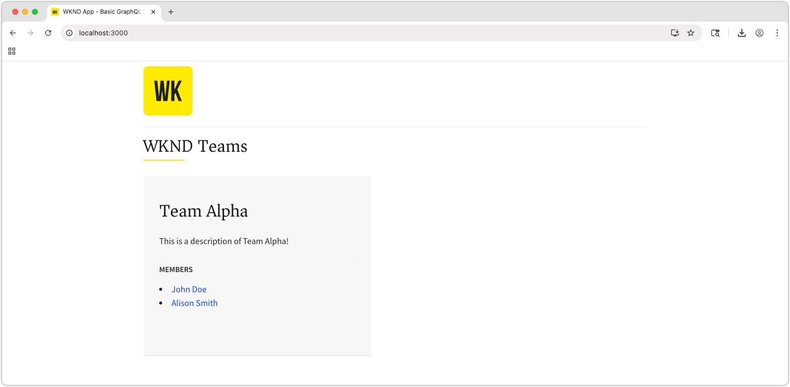

# AEM의 컨텐츠 조각 전달 OpenAPI를 사용하여 React 앱 빌드

이 장에서는 OpenAPI API를 통한 AEM 콘텐츠 조각 전달이 외부 애플리케이션에서 경험을 유도하는 방법을 살펴봅니다.

간단한 React 앱을 사용하여 OpenAPI를 통해 AEM 콘텐츠 조각 배달로 노출된 **팀** 및 **개인** 콘텐츠를 요청하고 표시합니다. React를 사용하는 것은 대부분 중요하지 않으며, AEM as a Cloud Service에 대한 HTTP 요청을 할 수 있는 한 소비하는 외부 애플리케이션을 모든 플랫폼의 프레임워크에 작성할 수 있습니다.

## 사전 요구 사항

이 다중 파트 튜토리얼의 이전 부분에 설명된 단계가 완료되었다고 간주됩니다.

다음 소프트웨어를 설치해야 합니다.

* [Node.js v22+](https://nodejs.org/en)
* [Visual Studio 코드](https://code.visualstudio.com/)

## 목표

방법 알아보기:

* 예제 React 앱을 다운로드하여 시작합니다.
* 팀 및 참조된 구성원 목록에 대해 OpenAPI를 사용하여 AEM 콘텐츠 조각 게재를 호출합니다.
* OpenAPI를 사용하여 AEM 콘텐츠 조각 게재를 호출하여 팀원의 세부 정보를 검색합니다.

## AEM as a Cloud Service에서 CORS 설정

이 예제 React 앱은 `http://localhost:3000`에서 로컬로 실행되고 OpenAPI API를 사용하여 AEM Publish 서비스의 AEM 콘텐츠 조각 배달에 연결합니다. 이 연결을 허용하려면 AEM 게시(또는 미리보기) 서비스에 CORS(원본 간 리소스 공유)를 구성해야 합니다.

[에서 실행 중인 SPA를 설정하여 AEM 게시 서비스에 대한 CORS 요청을 허용하는 방법에 대한 `http://localhost:3000`지침을 따르십시오](https://experienceleague.adobe.com/ko/docs/experience-manager-learn/getting-started-with-aem-headless/deployments/spa#different-domains).

### 로컬 CORS 프록시

또는 개발을 위해 AEM에 대한 CORS 친화적인 연결을 제공하는 [로컬 CORS 프록시](https://www.npmjs.com/package/local-cors-proxy)를 실행하십시오.

```bash
$ npm install --global lcp
$ lcp --proxyUrl https://publish-p<PROGRAM_ID>-e<ENVIRONMENT_ID>.adobeaemcloud.com
```

`--proxyUrl` 값을 AEM 게시(또는 미리보기) URL로 업데이트하십시오.

로컬 CORS 프록시가 실행 중인 상태에서 `http://localhost:8010/proxy`의 AEM 콘텐츠 조각 배달 API에 액세스하여 CORS 문제를 방지합니다.

## 샘플 React 앱 복제

스터브된 샘플 React 앱은 OpenAPI API를 통해 AEM 콘텐츠 조각 전달과 상호 작용하고 팀원 및 그로부터 얻은 개인 데이터를 표시하는 데 필요한 코드로 구현됩니다.

샘플 React 앱 소스 코드는 [Github.com에서 사용할 수 있습니다](https://github.com/adobe/aem-tutorials/tree/main/headless/open-api/basic).

React 앱을 다운로드하려면:

1. [ 태그의 ](https://github.com/adobe/aem-tutorials)Github.com[`headless_open-api_basic`에서 샘플 WKND OpenAPI React 앱을 복제합니다](https://github.com/adobe/aem-tutorials/tree/headless_open-api_basic).

   ```shell
   $ cd ~/Code
   $ git clone git@github.com:adobe/aem-tutorials.git
   $ cd aem-tutorials  
   $ git fetch --tags
   $ git tag
   $ git checkout tags/headless_open-api_basic
   ```

1. `headless/open-api/basic` 폴더로 이동하여 IDE에서 엽니다.

   ```shell
   $ cd ~/Code/aem-tutorials/headless/open-api/basic
   $ code .
   ```

1. 콘텐츠 조각이 게시되는 AEM as a Cloud Service Publish 서비스에 연결하려면 `.env`을(를) 업데이트하십시오. 앱을 AEM 미리보기 서비스(및 콘텐츠 조각이 게시됨)로 테스트하려는 경우 AEM 미리보기 서비스를 지정할 수 있습니다.

   ```
   # AEM Publish (or Preview) service that provides Content Fragments
   REACT_APP_HOST_URI=https://publish-p123-e456.adobeaemcloud.com
   ```

   [로컬 CORS 프록시](#local-cors-proxy)을(를) 사용하는 경우 `REACT_APP_HOST_URI`을(를) `http://localhost:8010/proxy`(으)로 설정하십시오.

   ```
   # AEM Publish (or Preview) service that provides Content Fragments
   REACT_APP_HOST_URI=http://localhost:8010/proxy
   ```

1. React 앱 시작

   ```shell
   $ cd ~/Code/aem-tutorials/headless/open-api/basic
   $ npm install
   $ npm start
   ```

1. React 앱이 [http://localhost:3000/](http://localhost:3000/)에 개발 모드에서 시작됩니다. 자습서 전체에서 React 앱에 대한 변경 사항은 웹 브라우저에 즉시 반영됩니다.

>[!IMPORTANT]
>
>   이 React 앱은 부분적으로 구현됩니다. 이 자습서의 단계에 따라 구현을 완료합니다. 구현 작업이 필요한 JavaScript 파일에는 다음 주석이 있습니다. 이 자습서에 지정된 코드로 해당 파일의 코드를 추가/업데이트하십시오.
>
>
>  //**&#x200B;**&#x200B;**&#x200B;**&#x200B;**&#x200B;**&#x200B;**&#x200B;**&#x200B;**&#x200B;**&#x200B;**&#x200B;**&#x200B;**&#x200B;**&#x200B;**&#x200B;***
>  &#x200B;>  // TODO: AEM Headless 자습서의 단계에 따라 이를 구현합니다.
>  &#x200B;>  //**&#x200B;**&#x200B;**&#x200B;**&#x200B;**&#x200B;**&#x200B;**&#x200B;**&#x200B;**&#x200B;**&#x200B;**&#x200B;**&#x200B;**&#x200B;**&#x200B;**&#x200B;***
>

## React 앱 구조

샘플 React 앱에는 업데이트가 필요한 세 가지 주요 부분이 있습니다.

1. `.env` 파일에 AEM 게시(또는 미리 보기) 서비스 URL이 포함되어 있습니다.
1. `src/components/Teams.js`에 팀 및 해당 구성원 목록이 표시됩니다.
1. `src/components/Person.js`은(는) 단일 팀원의 세부 정보를 표시합니다.

## 팀 기능 구현

React 앱의 기본 보기에서 팀과 팀원을 표시하는 기능을 빌드합니다. 이 기능을 사용하려면 다음 조건을 충족해야 합니다.

* 가져오기 요청을 통해 [모든 콘텐츠 조각 API 나열](https://react.dev/reference/react/useEffect#useeffect)을(를) 호출한 다음 표시할 각 **에 대한** 값을 가져오는 새 `fullName`사용자 지정 React useEffect 후크`teamMember`입니다.

완료되면 앱의 기본 보기가 AEM의 팀 데이터로 채워집니다.



1. `src/components/Teams.js`를 엽니다.

1. **팀** 구성 요소를 구현하여 [모든 콘텐츠 조각 API 나열](https://developer.adobe.com/experience-cloud/experience-manager-apis/api/stable/contentfragments/delivery/#operation/fragments/getFragments)에서 팀 목록을 가져오고 팀 콘텐츠를 렌더링합니다. 이 단계는 다음과 같이 나뉩니다.

1. AEM의 `useEffect`모든 콘텐츠 조각 나열&#x200B;**API를 호출하고 데이터를 React 구성 요소의 상태로 저장하는** 후크를 만듭니다.
1. 반환된 각 **Team** 콘텐츠 조각에 대해 **콘텐츠 조각 가져오기** API를 호출하여 팀원 및 해당 `fullNames`을(를) 포함하여 완전히 하이드레이션된 팀 세부 정보를 가져옵니다.
1. `Team` 함수를 사용하여 팀 데이터를 렌더링합니다.

   ```javascript
   import { useEffect, useState } from "react";
   import { Link } from "react-router-dom";
   import "./Teams.scss";
   
   function Teams() {
   
     // The teams folder is the only folder-tree that is allowed to contain Team Content Fragments.
     const TEAMS_FOLDER = '/content/dam/my-project/en/teams';
   
     // State to store the teams data
     const [teams, setTeams] = useState(null);
   
     useEffect(() => {
       /**
       * Fetches all teams and their associated member details
       * This is a two-step process:
       * 1. First, get all team content fragments from the specified folder
       * 2. Then, for each team, fetch the full details including hydrated references to get the team member names
       */
       const fetchData = async () => {
         try {
           // Step 1: Fetch all teams from the teams folder
           const response = await fetch(
             `${process.env.REACT_APP_HOST_URI}/adobe/contentFragments?path=${TEAMS_FOLDER}`
           );
           const allTeams = (await response.json()).items || [];
   
           // Step 2: Fetch detailed information for each team with hydrated references
           const hydratedTeams = [];
           for (const team of allTeams) {
             const hydratedTeamResponse = await fetch(
               `${process.env.REACT_APP_HOST_URI}/adobe/contentFragments/${team.id}?references=direct-hydrated`
             );
             hydratedTeams.push(await hydratedTeamResponse.json());
           }
   
           setTeams(hydratedTeams);
         } catch (error) {
           console.error("Error fetching content fragments:", error);
         }
       };
   
       fetchData();
     }, [TEAMS_FOLDER]);
   
     // Show loading state while teams data is being fetched
     if (!teams) {
       return <div>Loading teams...</div>;
     }
   
     // Render the teams
     return (
       <div className="teams">
         {teams.map((team, index) => {
           return (
             <Team 
               key={index} 
               {..team}
             />
           );
         })}
       </div>
     );
   }
   
   /**
   * Team component - renders a single team with its details and members
   * @param {string} fields - The authorable fields
   * @param {Object} references - Hydrated references containing member details such as fullName
   */
   function Team({ fields, references, path }) {
     if (!fields.title || !fields.teamMembers) {
       return null;
     }
   
     return (
       <div className="team">
         <h2 className="team__title">{fields.title}</h2>
         {/* Render description as HTML using dangerouslySetInnerHTML */}
         <p 
           className="team__description" 
           dangerouslySetInnerHTML={{ __html: fields.description.value }}
         />
         <div>
           <h4 className="team__members-title">Members</h4>
           <ul className="team__members">
             {/* Render each team member as a link to their detail page */}
             {fields.teamMembers.map((teamMember, index) => {
               return (
                 <li key={index} className="team__member">
                   <Link to={`/person/${teamMember}`}>
                     {/* Display the full name from the hydrated reference */}
                     {references[teamMember].value.fields.fullName}
                   </Link>
                 </li>
               );
             })}
           </ul>
         </div>
       </div>
     );
   }
   
   export default Teams;
   ```

## 사용자 기능 구현

[팀 기능](#implement-teams-functionality)을(를) 완료하면 팀 구성원 또는 개인 세부 정보의 표시를 처리하는 기능을 구현하십시오.


이를 위해 진행되는 작업:

1. `src/components/Person.js` 열기
1. `Person` React 구성 요소에서 `id` 경로 매개 변수를 구문 분석합니다. React 앱의 경로는 이전에 `id` URL 매개 변수를 수락하도록 설정되었습니다(`/src/App.js` 참조).
1. [콘텐츠 조각 API 가져오기](https://developer.adobe.com/experience-cloud/experience-manager-apis/api/stable/contentfragments/delivery/#operation/fragments/getFragment)를 통해 AEM에서 개인 데이터를 가져옵니다.

   ```javascript
   import "./Person.scss";
   import { useEffect, useState } from "react";
   import { useParams } from "react-router-dom";
   
   /**
   * Person component - displays detailed information about a single person
   * Fetches person data from AEM using the ID from the URL parameters
   */
   function Person() {
     // Get the person ID from the URL parameter
     const { id } = useParams();
   
     // State to store the person data
     const [person, setPerson] = useState(null);
   
     useEffect(() => {
       /**
       * Fetches person data from AEM Content Fragment Delivery API
       * Uses the ID from URL parameters to get the specific person's details
       */
       const fetchData = async () => {
         try {
           /* Hydrate references for access to profilePicture asset path */
           const response = await fetch(
             `${process.env.REACT_APP_HOST_URI}/adobe/contentFragments/${id}?references=direct-hydrated`
           );
           const json = await response.json();
           setPerson(json || null);
         } catch (error) {
           console.error("Error fetching person data:", error);
         }
       };
       fetchData();
     }, [id]); // Re-fetch when ID changes
   
     // Show loading state while person data is being fetched
     if (!person) {
       return <div>Loading person...</div>;
     }
   
     return (
       <div className="person">
         {/* Person profile image - Look up the profilePicture reference in the references object */}
         
         {/* Display person's occupations */}
         <div className="person__occupations">
           {person.fields.occupation.map((occupation, index) => {
             return (
               <span key={index} className="person__occupation">
                 {occupation}
               </span>
             );
           })}
         </div>
   
         {/* Person's main content: name and biography */}
         <div className="person__content">
           <h1 className="person__full-name">{person.fields.fullName}</h1>
           {/* Render biography as HTML content */}
           <div
             className="person__biography"
             dangerouslySetInnerHTML={{ __html: person.fields.biographyText.value }}
           />
         </div>
       </div>
     );  
   }
   
   export default Person;
   ```

### 완료된 코드 가져오기

이 장의 전체 소스 코드는 [Github.com에서 사용할 수 있습니다](https://github.com/adobe/aem-tutorials/tree/headless_open-api_basic_4-end).

```bash
$ git fetch --tags
$ git tag
$ git checkout tags/headless_open-api_basic_4-end
```

## 앱 사용

[http://localhost:3000/](http://localhost:3000/) 앱을 검토하고 _팀원_ 링크를 클릭하세요. 또한 AEM Author 서비스에서 콘텐츠 조각을 추가하고 게시하여 Alpha 팀에 더 많은 팀 및/또는 구성원을 추가할 수 있습니다.

## 후드 아래

React 앱과 상호 작용할 때 브라우저의 **개발자 도구 > 네트워크** 콘솔을 열고 **을(를) 위해**&#x200B;필터`/adobe/contentFragments`을(를) 가져옵니다.

## 축하합니다!

축하합니다! OpenAPI를 사용하여 AEM 콘텐츠 조각 게재에서 콘텐츠 조각을 소비 및 표시하는 React 앱을 생성했습니다.
