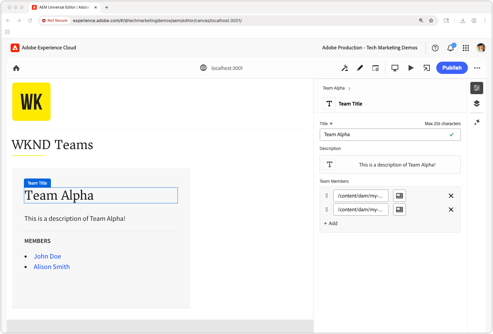

# 범용 편집기로 React 앱 편집

이 장에서는 AEM Universal Editor를 사용하여 [이전 챕터](./4-react-app.md)에 내장된 React 앱을 편집 가능하게 만드는 방법에 대해 알아봅니다. 범용 편집기를 사용하면 콘텐츠 작성자가 Headless 애플리케이션의 원활한 경험을 유지하면서 React 앱 환경의 컨텍스트 내에서 직접 콘텐츠를 편집할 수 있습니다.


유니버설 편집기는 모든 웹 응용 프로그램에 대해 컨텍스트 내 편집을 사용할 수 있는 강력한 방법을 제공하여 작성자가 서로 다른 작성 인터페이스 간을 전환하지 않고도 콘텐츠를 편집할 수 있도록 합니다.

## 사전 요구 사항

* 이 자습서의 이전 단계가 완료되었습니다. 특히 [AEM 콘텐츠 조각 배달 OpenAPI를 사용하는 React 앱을 빌드합니다](./4-react-app.md)
* [유니버설 편집기를 사용하고 구현하는 방법](https://experienceleague.adobe.com/ko/docs/experience-manager-cloud-service/content/implementing/developing/universal-editor/introduction)에 대한 작업 지식입니다.

## 목표

방법 알아보기:

* React 앱에 Universal Editor 계기를 추가합니다.
* 범용 편집기에 대한 React 앱을 구성합니다.
* 범용 편집기를 사용하여 React 앱 인터페이스에서 직접 콘텐츠 편집을 활성화합니다.

## 유니버설 편집기 계측

유니버설 편집기에서 편집 가능한 콘텐츠를 식별하고 UI와 AEM 콘텐츠 간의 연결을 설정하려면 [HTML 특성 및 메타 태그](https://experienceleague.adobe.com/ko/docs/experience-manager-cloud-service/content/implementing/developing/universal-editor/attributes-types)가 필요합니다.

### 범용 편집기 태그 추가

먼저 필요한 메타 태그를 추가하여 React 앱을 범용 편집기 호환으로 식별합니다.

1. React 앱에서 `public/index.html` 열기
1. React 앱의 [&#x200B; 섹션에서 &#x200B;](https://experienceleague.adobe.com/ko/docs/experience-manager-cloud-service/content/implementing/developing/universal-editor/getting-started)유니버설 편집기 메타 태그 및 CORS 스크립트`<head>`를 추가합니다.

   ```html
   <!DOCTYPE html>
   <html lang="en">
   <head>
       <meta charset="utf-8" />
       <link rel="icon" href="%PUBLIC_URL%/favicon.ico" />
       <meta name="viewport" content="width=device-width, initial-scale=1" />
       <meta name="theme-color" content="#000000" />
       <meta name="description" content="WKND Teams React App" />
   
       <!-- Universal Editor meta tags and CORS script -->
       <meta name="urn:adobe:aue:system:aemconnection" content="aem:%REACT_APP_AEM_AUTHOR_HOST_URI%" />
       <script src="https://universal-editor-service.adobe.io/cors.js"></script>
   
       <link rel="apple-touch-icon" href="%PUBLIC_URL%/logo192.png" />
       <link rel="manifest" href="%PUBLIC_URL%/manifest.json" />
       <title>WKND Teams</title>
   </head>
   <body>
       <noscript>You need to enable JavaScript to run this app.</noscript>
       <div id="root"></div>
   </body>
   </html>
   ```

1. 범용 편집기에서 다시 쓰기를 지원하도록 AEM 작성자 서비스 호스트를 포함하도록 React 앱의 `.env` 파일을 업데이트합니다(`urn:adobe:aue:system:aemconnection` metat 태그의 값에 사용됨).

   ```bash
   # The AEM Publish (or Preview) service
   REACT_APP_HOST_URI=https://publish-p123-e456.adobeaemcloud.com
   
   # The AEM Author service
   REACT_APP_AEM_AUTHOR_HOST_URI=https://author-p123-e456.adobeaemcloud.com
   ```

### 팀 구성 요소 계측

이제 Teams 구성 요소를 편집할 수 있도록 유니버설 편집기 속성을 추가하십시오.

1. `src/components/Teams.js`를 엽니다.
1. `Team`유니버설 편집기 데이터 특성[을 포함하도록 &#x200B;](https://experienceleague.adobe.com/ko/docs/experience-manager-cloud-service/content/implementing/developing/universal-editor/attributes-types) 구성 요소 업데이트:

   `data-aue-resource` 특성을 설정할 때 OpenAPI API를 사용하여 AEM 콘텐츠 조각 게재에서 반환된 콘텐츠 조각에 대한 AEM 경로가 콘텐츠 조각 변형에 대한 하위 경로와 함께 포스트픽스되는지 확인하십시오(이 경우 `/jcr:content/data/master`).

   ```javascript
   import { useEffect, useState } from "react";
   import { Link } from "react-router-dom";
   import "./Teams.scss";
   
   function Teams() {
   
   // The teams folder is the only folder-tree that is allowed to contain Team Content Fragments.
   const TEAMS_FOLDER = '/content/dam/my-project/en/teams';
   
   // State to store the teams data
   const [teams, setTeams] = useState(null);
   
   useEffect(() => {
       /**
       * Fetches all teams and their associated member details
       * This is a two-step process:
       * 1. First, get all team content fragments from the specified folder
       * 2. Then, for each team, fetch the full details including hydrated references to get the team member names
       */
       const fetchData = async () => {
       try {
           // Step 1: Fetch all teams from the teams folder
           const response = await fetch(
           `${process.env.REACT_APP_HOST_URI}/adobe/contentFragments?path=${TEAMS_FOLDER}`
           );
           const allTeams = (await response.json()).items || [];
   
           // Step 2: Fetch detailed information for each team with hydrated references
           const hydratedTeams = [];
           for (const team of allTeams) {
               const hydratedTeamResponse = await fetch(
                   `${process.env.REACT_APP_HOST_URI}/adobe/contentFragments/${team.id}?references=direct-hydrated`
               );
               hydratedTeams.push(await hydratedTeamResponse.json());
           }
   
           setTeams(hydratedTeams);
       } catch (error) {
           console.error("Error fetching content fragments:", error);
       }
       };
   
       fetchData();
   }, [TEAMS_FOLDER]);
   
   // Show loading state while teams data is being fetched
   if (!teams) {
       return <div>Loading teams...</div>;
   }
   
   // Render the teams
   return (
       <div className="teams">
       {teams.map((team, index) => {
           return (
           <Team
               key={index}
               {...team}
           />
           );
       })}
       </div>
   );
   }
   
   /**
   * Team - renders a single team with its details and members
   * @param {Object} fields - The authored Content Fragment fields
   * @param {Object} references - Hydrated references containing member details such as fullName
   * @param {string} path - Path of the team content fragment
   */
   function Team({ fields, references, path }) {
   if (!fields.title || !fields.teamMembers) {
       return null;
   }
   
   return (
       <>
       {/* Specify the correct Content Fragment variation path suffix in the data-aue-resource attribute */}
       <div className="team"
           data-aue-resource={`urn:aemconnection:${path}/jcr:content/data/master`}
           data-aue-type="component"
           data-aue-label={fields.title}>
   
           <h2 className="team__title"
           data-aue-prop="title"
           data-aue-type="text"
           data-aue-label="Team Title">{fields.title}</h2>
           <p className="team__description"
           data-aue-prop="description"
           data-aue-type="richtext"
           data-aue-label="Team Description"
           dangerouslySetInnerHTML={{ __html: fields.description.value }}
           />
           <div>
           <h4 className="team__members-title">Members</h4>
           <ul className="team__members">
               {fields.teamMembers.map((teamMember, index) => {
               return (
                   <li key={index} className="team__member">
                   <Link to={`/person/${teamMember}`}>
                       {references[teamMember].value.fields.fullName}
                   </Link>
                   </li>
               );
               })}
           </ul>
           </div>
       </div>
       </>
   );
   }
   
   export default Teams;
   ```

### 사용자 구성 요소 계기

마찬가지로 범용 편집기 속성을 사용자 구성 요소에 추가합니다.

1. `src/components/Person.js`를 엽니다.
1. [유니버설 편집기 데이터 특성](https://experienceleague.adobe.com/ko/docs/experience-manager-cloud-service/content/implementing/developing/universal-editor/attributes-types)을 포함하도록 구성 요소를 업데이트하십시오.

   `data-aue-resource` 특성을 설정할 때 OpenAPI API를 사용하여 AEM 콘텐츠 조각 게재에서 반환된 콘텐츠 조각에 대한 AEM 경로가 콘텐츠 조각 변형에 대한 하위 경로와 함께 포스트픽스되는지 확인하십시오(이 경우 `/jcr:content/data/master`).

   ```javascript
   import "./Person.scss";
   import { useEffect, useState } from "react";
   import { useParams } from "react-router-dom";
   
   /**
   * Person component - displays detailed information about a single person
   * Fetches person data from AEM using the ID from the URL parameters
   */
   function Person() {
       const { id } = useParams();
       const [person, setPerson] = useState(null);
   
       useEffect(() => {
           const fetchData = async () => {
           try {
               const response = await fetch(
               `${process.env.REACT_APP_HOST_URI}/adobe/contentFragments/${id}?references=direct-hydrated`
               );
               const json = await response.json();
               setPerson(json || null);
           } catch (error) {
               console.error("Error fetching person data:", error);
           }
           };
           fetchData();
       }, [id]);
   
       if (!person) {
           return <div>Loading person...</div>;
       }
   
       /* Add the Universal Editor data-aue-* attirbutes to the rendered HTML */
       return (
           <div className="person"
               data-aue-resource={`urn:aemconnection:${person.path}/jcr:content/data/master`}
               data-aue-type="component"
               data-aue-label={person.fields.fullName}>
               
               <div className="person__occupations">
                   {person.fields.occupation.map((occupation, index) => {
                   return (
                       <span key={index} className="person__occupation">
                           {occupation}
                       </span>
                   );
                   })}
               </div>
   
               <div className="person__content">
                   <h1 className="person__full-name"
                       data-aue-prop="fullName"
                       data-aue-type="text"
                       data-aue-label="Full Name">
                       {person.fields.fullName}
                   </h1>
                   <div className="person__biography"
                       data-aue-prop="biographyText"
                       data-aue-type="richtext"
                       data-aue-label="Biography"
                       dangerouslySetInnerHTML={{ __html: person.fields.biographyText.value }}
                   />
               </div>
           </div>
       );
   }
   ```

### 완료된 코드 가져오기

이 장의 전체 소스 코드는 [Github.com에서 사용할 수 있습니다](https://github.com/adobe/aem-tutorials/tree/headless_open-api_basic_5-end).


```bash
$ git fetch --tags
$ git tag
$ git checkout tags/headless_open-api_basic_5-end
```

## 유니버설 편집기 통합 테스트

이제 Universal Editor에서 React 앱을 열어 Universal Editor 호환성 업데이트를 테스트합니다.

### React 앱 시작

1. React 앱이 실행 중인지 확인합니다.

   ```bash
   $ cd ~/Code/aem-guides-wknd-openapi/basic-tutorial
   $ npm install
   $ npm start
   ```

1. 앱이 `http://localhost:3000`에 로드되고 팀 및 사용자 콘텐츠가 표시되는지 확인합니다.

### 로컬 SSL 프록시 실행

Universal Editor를 사용하려면 HTTPS를 통해 편집 가능한 애플리케이션을 로드해야 합니다.

1. HTTPS를 통해 로컬 React 앱을 실행하려면 명령줄에서 [local-ssl-proxy](https://www.npmjs.com/package/local-ssl-proxy) npm 모듈을 사용합니다.

   ```bash
   $ npm install -g local-ssl-proxy
   $ local-ssl-proxy --source 3001 --target 3000
   ```

1. 웹 브라우저에서 `https://localhost:3001` 열기
1. 자체 서명된 인증서를 수락합니다.
1. React 앱이 로드되는지 확인합니다.

### 유니버설 편집기에서 열기


1. [유니버설 편집기](https://experience.adobe.com/#/@myOrg/aem/editor/canvas/)&#x200B;(으)로 이동합니다.
1. **사이트 URL** 필드에 HTTPS React 앱 URL `https://localhost:3001`을(를) 입력합니다.
1. **열기**&#x200B;를 클릭합니다.

Universal Editor는 편집 기능이 활성화된 React 앱을 로드해야 합니다.

### 편집 기능 테스트



1. 범용 편집기에서 React 앱의 편집 가능한 요소를 마우스로 가리킵니다.

1. React 앱 내에서 탐색하려면 **미리 보기** 모드를 켜고 끄면 편집할 수 있습니다. **미리 보기**&#x200B;는 AEM 미리 보기 서비스와 관련이 없으며, 유니버설 편집기에서 Chrome 편집을 켜거나 끕니다.

1. 편집 표시기가 표시되고 React 앱의 편집 가능한 다양한 요소를 클릭할 수 있습니다.

1. 팀 제목을 편집해 보십시오.
   * 팀 제목 클릭
   * 속성 패널에서 텍스트 편집
   * 변경 내용 저장

1. 사용자의 프로필 사진을 편집해 보십시오.
   * 사용자 프로필 사진 클릭
   * 자산 선택기에서 새 이미지 선택
   * 변경 내용 저장

1. 유니버설 편집기의 오른쪽 상단에서 **게시**&#x200B;를 눌러 AEM 게시(또는 미리보기) 서비스에 대한 편집 내용을 게시하면 해당 편집 내용이 유니버설 편집기의 React 앱에 반영됩니다.

## 유니버설 편집기 데이터 특성

유니버설 편집기의 응용 프로그램 계측에 대한 자세한 내용은 [유니버설 편집기 설명서](https://experience.adobe.com/#/@myOrg/aem/editor/canvas/)를 참조하세요.

## 축하합니다!

축하합니다! React 앱에 유니버설 편집기를 통합했습니다. 이제 콘텐츠 작성자는 React 앱 인터페이스 내에서 콘텐츠 조각을 직접 편집할 수 있으므로 Headless 아키텍처의 이점을 유지하면서 원활한 작성 경험을 제공할 수 있습니다.

`main`GitHub.com 저장소[의 &#x200B;](https://github.com/adobe/aem-tutorials/tree/main) 분기에서 이 자습서의 최종 소스 코드를 항상 가져올 수 있습니다.
