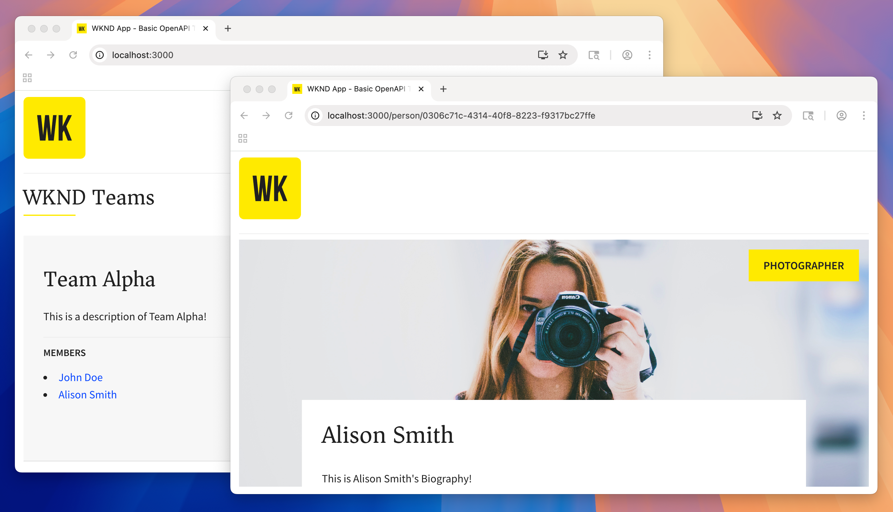

# OpenAPI를 사용하여 AEM 콘텐츠 조각 게재 시작

Headless CMS 시나리오에서, OpenAPI API를 통해 AEM의 컨텐츠 조각 전달을 사용하고 외부 앱에서 사용하여 AEM 컨텐츠를 작성하고 노출하는 방법을 설명하는 이 튜토리얼을 살펴보십시오. 이렇게 하면 WKND 팀 및 관련 멤버 세부 사항을 표시하는 React 앱을 만든 것처럼 생각하여 이러한 개념을 살펴볼 수 있습니다. 팀 및 구성원은 AEM 콘텐츠 조각 모델을 사용하여 모델링되고, OpenAPI를 통해 AEM 콘텐츠 조각 전달을 사용하는 React 앱에서 사용됩니다.

이 튜토리얼에서는 다음 주제를 다룹니다.

* 프로젝트 구성 만들기
* 데이터 모델링을 위한 콘텐츠 조각 모델 만들기
* 이전에 만든 모델을 기반으로 콘텐츠 조각 만들기
* OpenAPI API 설명서의 &quot;Try It&quot; 기능을 사용하여 AEMAEM 의 콘텐츠 조각을 쿼리할 수 있는 방법을 살펴봅니다
* 샘플 React 앱의 OpenAPI API 호출을 통해 AEM 컨텐츠 조각 전달을 통해 컨텐츠 조각 데이터를 사용합니다.
* Universal Editor에서 편집할 수 있도록 React 앱 개선

## 사전 요구 사항 {#prerequisites}

이 튜토리얼을 따르려면 다음 사항이 필요합니다.

* AEM Sites as a Cloud Service
* 기본 HTML 및 JavaScript 기술
* 다음 도구가 로컬에 설치되어 있어야 합니다.
   * [Node.js v22+](https://nodejs.org/)
   * [Git](https://git-scm.com/)
   * IDE(예: [Microsoft® Visual Studio Code](https://code.visualstudio.com/))

### AEM as a Cloud Service 환경

이 자습서를 완료하려면 AEM as a Cloud Service 환경에 대한 **AEM 관리자** 액세스 권한이 있는 것이 좋습니다. **개발** 환경, **신속한 개발 환경** 또는 **샌드박스 프로그램**&#x200B;의 환경을 사용할 수도 있습니다.

## 시작하기

[콘텐츠 조각 모델 정의](1-content-fragment-models.md)로 튜토리얼을 시작하십시오.

## GitHub 프로젝트

소스 코드 및 컨텐츠 패키지는 [AEM Headless 튜토리얼](https://github.com/adobe/aem-tutorials) GitHub 리포지토리에서 사용할 수 있습니다.

[`main` 분기에는 이 자습서에 대한 최종 소스 코드](https://github.com/adobe/aem-tutorials/tree/main/headless/open-api/basic)이(가) 포함되어 있습니다.
각 단계가 끝날 때 코드의 스냅샷을 Git 태그로 사용할 수 있습니다.

* 4장 시작 - React 앱: [`headless_open-api_basic`](https://github.com/adobe/aem-tutorials/tree/headless_open-api_basic//headless/open-api/basic)
* 4장 끝 - React 앱: [`headless_open-api_basic_4-end`](https://github.com/adobe/aem-tutorials/tree/headless_open-api_basic_4-end//headless/open-api/basic)
* 5장 끝 - 유니버설 편집기: [`headless_open-api_basic_5-end`](https://github.com/adobe/aem-tutorials/tree/headless_open-api_basic_5-end//headless/open-api/basic)

튜토리얼이나 코드에 문제가 있는 경우 [GitHub 문제](https://github.com/adobe/aem-tutorials/issues)를 남겨주십시오.
