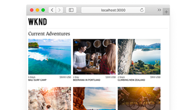

# AEM의 Headless 튜토리얼{#aem-headless-tutorials}

Adobe Experience Manager(AEM)에는 Headless 엔드포인트를 정의하고 콘텐츠를 JSON으로 전달하기 위한 여러 옵션이 있습니다. 실습형 튜토리얼을 사용하여 다양한 옵션을 사용하는 방법을 살펴보고 자신에게 적합한 옵션을 선택하십시오.

>[!TIP]
>
>이 튜토리얼 컬렉션은 **배워서**&#x200B;하기를 원하는 사용자를 위해 설계되었습니다. 처음부터 개념을 배우려면 [AEM Headless 개발자 여정](https://experienceleague.adobe.com/docs/experience-manager-cloud-service/content/headless/journeys/developer/overview.html)을 확인하십시오. 이 튜토리얼 세트와 여정은 서로 보완됩니다.

## API별 자습서

<table>
<tr>
  <td>
    
    

      <a href="https://experienceleague.adobe.com/docs/experience-manager-learn/getting-started-with-aem-headless/graphql/overview.html?lang=ko-KR">
    <strong>GraphQL API</strong>
    </a>
    

    

    <em>응용 프로그램에서 AEM의 GraphQL API를 사용하여 콘텐츠를 쿼리하는 방법을 알아봅니다.</em>
    

  </td>
  <td>
    
    

    <a href="https://experienceleague.adobe.com/docs/experience-manager-learn/getting-started-with-aem-headless/authentication/overview.html">
    <strong>토큰 인증</strong>
    </a>
    

    

    <em>AEM을 사용하여 응용 프로그램을 안전하게 인증하는 방법을 알아봅니다.</em>
    

  </td>
  <td>
    
     

      <a href="https://experienceleague.adobe.com/docs/experience-manager-learn/getting-started-with-aem-headless/content-services/overview.html">
        <strong>콘텐츠 서비스</strong>
      </a>
    

    

    <em>응용 프로그램에서 REST API를 사용하여 콘텐츠를 사용하는 방법을 알아봅니다.</em>
    

  </td>
</tr>
</table>

## 예제 애플리케이션

예제 애플리케이션은 Adobe Experience Manager(AEM)의 Headless 기능을 살펴볼 수 있는 좋은 방법입니다. 이 완료된 예제를 다운로드하여 설치하고 바로 시작하십시오.

<table>
<tr>
  <td>
    
    

      <a href="https://experienceleague.adobe.com/docs/experience-manager-learn/getting-started-with-aem-headless/graphql/example-apps/ios-swiftui-app.html">
    <strong>iOS SwiftUI 예</strong>
    </a>
    

    

    <em>AEM의 GraphQL API를 기반으로 하는 iOS 애플리케이션입니다.</em>
    

  </td>
  <td>
    
    

    <a href="https://experienceleague.adobe.com/docs/experience-manager-learn/getting-started-with-aem-headless/graphql/example-apps/android-app.html">
    <strong>Android™ 예</strong>
    </a>
    

    

    <em>AEM의 GraphQL API를 기반으로 하는 Android™ 애플리케이션입니다.</em>
    

  </td>
  <td>
    
     

      <a href="https://experienceleague.adobe.com/docs/experience-manager-learn/getting-started-with-aem-headless/graphql/example-apps/react-app.html">
        <strong>React 예제</strong>
      </a>
    

    

    <em>AEM의 GraphQL API에서 제공하는 React 응용 프로그램입니다.</em>
    

  </td>
</tr>
</table>

## 튜토리얼

사용된 기술을 기반으로 다음 튜토리얼을 찾아보십시오. 컨텍스트 내 작성 및 경험 관리 옵션을 통해 AEM이 순수한 Headless 사용 사례를 넘어서는 방법에 대해 알아봅니다.

<table>
<tr>
  <td>
    
    

      <a href="https://experienceleague.adobe.com/docs/experience-manager-learn/getting-started-with-aem-headless/graphql/overview.html?lang=ko-KR">
    <strong>React - Headless</strong>
    </a>
    

    

    <em>순수 Headless 시나리오에서 GraphQL을 사용하여 React JS 앱을 빌드합니다.</em>
    

  </td>
  <td>
    
     

      <a href="https://experienceleague.adobe.com/en/docs/experience-manager-learn/cloud-service/developing/universal-editor/react-app-editing/overview">
        <strong>React - 유니버설 편집기를 통해 콘텐츠 편집</strong>
      </a>
    

    

    <em>범용 편집기를 사용하여 React 응용 프로그램의 콘텐츠를 편집하십시오.</em>
    

  </td>  
  <td>
    
    

    <a href="https://experienceleague.adobe.com/docs/experience-manager-learn/getting-started-with-aem-headless/spa-editor/remote-spa/overview.html">
    <strong>React - 원격 편집기</strong>
    </a>
    

    

    <em>원격으로 호스팅된 React 응용 프로그램의 컨텍스트 내 일부를 작성합니다.</em>
    

  </td>
</tr>
<tr>  
  <td>
    
     

      <a href="https://experienceleague.adobe.com/docs/experience-manager-learn/getting-started-with-aem-headless/spa-editor/react/overview.html">
        <strong>React - SPA 편집기</strong>
      </a>
    

    

    <em>AEM SPA 편집기를 사용하여 전체 React 앱 환경을 관리하십시오.</em>
    

  </td>
  <td>
    
    

    <a href="https://experienceleague.adobe.com/docs/experience-manager-learn/getting-started-with-aem-headless/content-services/overview.html">
    <strong>Android - 콘텐츠 서비스</strong>
    </a>
    

    

    <em>Content Services 및 REST를 사용하여 모바일 Android™ 응용 프로그램을 실행합니다.</em>
    

  </td>
  <td>
    
     

      <a href="https://experienceleague.adobe.com/docs/experience-manager-learn/getting-started-with-aem-headless/authentication/overview.html">
        <strong>Node.js - 인증</strong>
      </a>
    

    

    <em>인증할 개발자 및 서비스 토큰을 사용하여 Node.js 앱을 빌드합니다.</em>
    

  </td>
</tr>
</table>
