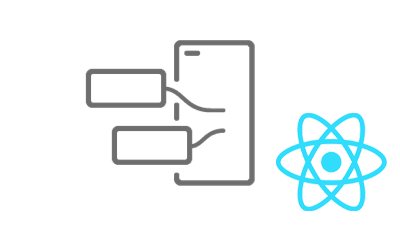

# AEM의 Headless Tutorials{#aem-headless-tutorials}

{{aem-headless-trials-promo}}

Adobe Experience Manager(AEM)에는 Headless 엔드포인트를 정의하고 콘텐츠를 JSON으로 전달하기 위한 여러 옵션이 있습니다. 실습형 튜토리얼을 사용하여 다양한 옵션을 사용하는 방법을 살펴보고 자신에게 적합한 옵션을 선택하십시오.

>[!TIP]
>
>이 자습서 컬렉션은 을(를) 선호하는 사용자를 위해 설계되었습니다. **다음을 수행하여 학습**. 기초부터 개념에 대해 배우는 것을 선호한다면 다음을 확인하십시오. [AEM Headless 개발자 여정](https://experienceleague.adobe.com/docs/experience-manager-cloud-service/content/headless/journeys/developer/overview.html). 이 튜토리얼 세트와 여정은 서로 보완됩니다.

## API별 Tutorials

<table>
<tr>
  <td>
    
    

      <a href="https://experienceleague.adobe.com/docs/experience-manager-learn/getting-started-with-aem-headless/graphql/overview.html">
    <strong>GraphQL API</strong>
    </a>
    

    

    <em>애플리케이션이 AEM GraphQL API를 사용하여 콘텐츠를 쿼리하는 방법에 대해 알아봅니다.</em>
    

  </td>
  <td>
    
    

    <a href="https://experienceleague.adobe.com/docs/experience-manager-learn/getting-started-with-aem-headless/authentication/overview.html">
    <strong>토큰 인증</strong>
    </a>
    

    

    <em>AEM을 통해 응용 프로그램을 안전하게 인증하는 방법을 알아봅니다.</em>
    

  </td>
  <td>
    
     

      <a href="https://experienceleague.adobe.com/docs/experience-manager-learn/getting-started-with-aem-headless/content-services/overview.html">
        <strong>Content Services</strong>
      </a>
    

    

    <em>애플리케이션이 REST API를 사용하여 콘텐츠를 사용하는 방법에 대해 알아봅니다.</em>
    

  </td>
</tr>
</table>

## 예제 애플리케이션

예제 애플리케이션은 AEM(Adobe Experience Manager)의 Headless 기능을 살펴볼 수 있는 좋은 방법입니다. 이 완료된 예제를 다운로드하여 설치하고 바로 시작하십시오.

<table>
<tr>
  <td>
    
    

      <a href="https://experienceleague.adobe.com/docs/experience-manager-learn/getting-started-with-aem-headless/graphql/example-apps/ios-swiftui-app.html">
    <strong>iOS SwiftUI 예</strong>
    </a>
    

    

    <em>AEM GraphQL API를 기반으로 하는 iOS 애플리케이션.</em>
    

  </td>
  <td>
    
    

    <a href="https://experienceleague.adobe.com/docs/experience-manager-learn/getting-started-with-aem-headless/graphql/example-apps/android-app.html">
    <strong>Android™ 예</strong>
    </a>
    

    

    <em>AEM GraphQL API에서 제공하는 Android™ 애플리케이션입니다.</em>
    

  </td>
  <td>
    
     

      <a href="https://experienceleague.adobe.com/docs/experience-manager-learn/getting-started-with-aem-headless/graphql/example-apps/react-app.html">
        <strong>React 예</strong>
      </a>
    

    

    <em>AEM GraphQL API에서 제공하는 React 애플리케이션.</em>
    

  </td>
</tr>
</table>

## 프레임워크별 Tutorials

사용된 기술을 기반으로 다음 튜토리얼을 찾아보십시오. 컨텍스트 내 작성 및 경험 관리 옵션을 통해 AEM이 순수한 Headless 사용 사례를 넘어서는 방법에 대해 알아봅니다.

<table>
<tr>
  <td>
    
    

      <a href="https://experienceleague.adobe.com/docs/experience-manager-learn/getting-started-with-aem-headless/graphql/overview.html">
    <strong>React - 헤드리스</strong>
    </a>
    

    

    <em>순수 Headless 시나리오에서 GraphQL을 사용하여 React JS 앱을 빌드합니다.</em>
    

  </td>
  <td>
    
    

    <a href="https://experienceleague.adobe.com/docs/experience-manager-learn/getting-started-with-aem-headless/spa-editor/remote-spa/overview.html">
    <strong>React - 원격 편집기</strong>
    </a>
    

    

    <em>원격으로 호스팅된 React 애플리케이션의 일부를 컨텍스트에서 작성합니다.</em>
    

  </td>
  <td>
    
     

      <a href="https://experienceleague.adobe.com/docs/experience-manager-learn/getting-started-with-aem-headless/spa-editor/react/overview.html">
        <strong>React - SPA 편집기</strong>
      </a>
    

    

    <em>AEM SPA 편집기를 사용하여 전체 React 앱 경험을 관리합니다.</em>
    

  </td>
</tr>
<tr>  
  <td>
    
    

    <a href="https://experienceleague.adobe.com/docs/experience-manager-learn/getting-started-with-aem-headless/content-services/overview.html">
    <strong>Android - 콘텐츠 서비스</strong>
    </a>
    

    

    <em>컨텐츠 서비스 및 REST를 사용하여 모바일 Android™ 애플리케이션을 실행합니다.</em>
    

  </td>
  <td>
    
     

      <a href="https://experienceleague.adobe.com/docs/experience-manager-learn/getting-started-with-aem-headless/authentication/overview.html">
        <strong>Node.js - 인증</strong>
      </a>
    

    

    <em>개발자 및 서비스 토큰을 사용하여 Node.js 앱을 빌드하여 인증합니다.</em>
    

  </td>
  <td></td>
</tr>
</table>
