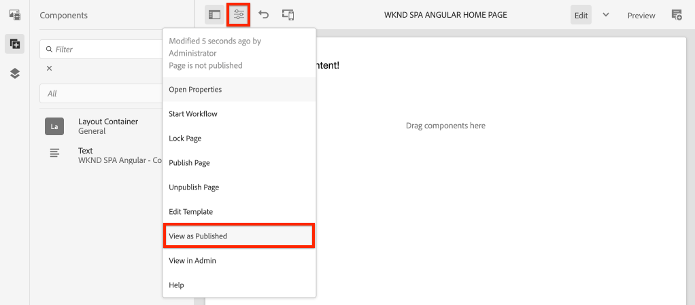

# SPA 편집기 프로젝트 {#create-project}

AEM(Adobe Experience Manager) Maven 프로젝트를 SPA Editor와 통합된 Angular AEM 애플리케이션의 시작점으로 사용하는 방법에 대해 알아봅니다.

## 목표

1. Maven Archetype으로 빌드된 새 AEM SPA Editor 프로젝트의 구조를 이해합니다.
2. 스타터 프로젝트를 AEM의 로컬 인스턴스에 배포합니다.

## 빌드할 내용

이 장에서는 를 기반으로 새 AEM 프로젝트를 배포합니다. [AEM Project Archetype](https://github.com/adobe/aem-project-archetype). AEM 프로젝트는 Angular SPA의 매우 간단한 시작점으로 부트스트랩됩니다. 이 장에서 사용하는 프로젝트는 WKND SPA의 구현을 위한 기초 역할을 하며 향후 장에서 빌드될 예정입니다.


*고전적인 Hello World 메시지.*

## 사전 요구 사항

설정에 필요한 도구 및 지침 검토 [로컬 개발 환경](overview.md#local-dev-environment). Adobe Experience Manager의 새 인스턴스가 **작성자** 모드, 가 로컬에서 실행 중입니다.

## 프로젝트 가져오기

AEM용 Maven 다중 모듈 프로젝트를 만드는 몇 가지 옵션이 있습니다. 이 자습서에서는 최신 버전을 사용했습니다. [AEM Project Archetype](https://github.com/adobe/aem-project-archetype) 를 자습서 코드의 기반으로 사용하십시오. 여러 버전의 AEM을 지원하기 위해 프로젝트 코드가 수정되었습니다. 검토하십시오. [이전 버전과의 호환성에 대한 참고 사항](overview.md#compatibility).

>[!CAUTION]
>
>를 사용하는 것이 좋습니다. **최신** 버전 [원형](https://github.com/adobe/aem-project-archetype) 실제 구현을 위한 새 프로젝트를 생성합니다. AEM 프로젝트는 를 사용하여 단일 버전의 AEM을 타깃팅해야 합니다. `aemVersion` archetype 속성.

1. Git을 통해 이 자습서의 시작점을 다운로드하십시오.

   ```shell
   $ git clone git@github.com:adobe/aem-guides-wknd-spa.git
   $ cd aem-guides-wknd-spa
   $ git checkout Angular/create-project-start
   ```

2. 다음 폴더 및 파일 구조는 로컬 파일 시스템에서 Maven Archetype으로 생성된 AEM Project를 나타냅니다.

   ```plain
   |--- aem-guides-wknd-spa
       |--- all/
       |--- core/
       |--- dispatcher/
       |--- ui.apps/
       |--- ui.apps.structure/
       |--- ui.content/
       |--- ui.frontend /
       |--- it.tests/
       |--- pom.xml
       |--- README.md
       |--- .gitignore
       |--- archetype.properties
   ```

3. 에서 AEM 프로젝트를 생성할 때 다음 속성이 사용되었습니다. [AEM 프로젝트 원형](https://github.com/Adobe-Marketing-Cloud/aem-project-archetype/releases/tag/aem-project-archetype-14):

   | 속성 | 값 |
   |-----------------|---------------------------------------|
   | aemVersion | 클라우드 |
   | appTitle | WKND SPA ANGULAR |
   | appId | wknd-spa-angular |
   | groupId | com.adobe.aem.guides |
   | frontendModule | angular |
   | 패키지 | com.adobe.aem.guides.wknd.spa.angular |
   | includeExamples | n |

   >[!NOTE]
   >
   > 다음 사항에 주목합니다. `frontendModule=angular` 속성. 이는 AEM Project Archetype에 Starter로 프로젝트를 부트스트랩하도록 지시합니다 [Angular 코드 베이스](https://experienceleague.adobe.com/docs/experience-manager-core-components/using/developing/archetype/uifrontend-angular.html) AEM SPA 편집기와 함께 사용됩니다.

## 프로젝트 빌드

그런 다음 Maven을 사용하여 AEM의 로컬 인스턴스에 프로젝트 코드를 컴파일, 빌드 및 배포합니다.

1. AEM 인스턴스가 포트에서 로컬로 실행 중인지 확인합니다. **4502**.
2. 명령줄 터미널에서 Maven이 설치되어 있는지 확인합니다.

   ```shell
   $ mvn --version
   Apache Maven 3.6.2
   Maven home: /Library/apache-maven-3.6.2
   Java version: 11.0.4, vendor: Oracle Corporation, runtime: /Library/Java/JavaVirtualMachines/jdk-11.0.4.jdk/Contents/Home
   ```

3. 에서 아래 Maven 명령을 실행합니다. `aem-guides-wknd-spa` 프로젝트를 빌드하고 AEM에 배포하는 디렉토리:

   ```shell
   $ mvn -PautoInstallSinglePackage clean install
   ```

   사용 중인 경우 [AEM 6.x](overview.md#compatibility):

   ```shell
   $ mvn clean install -PautoInstallSinglePackage -Pclassic
   ```

   프로젝트의 여러 모듈을 컴파일하고 AEM에 배포해야 합니다.

   ```plain
   [INFO] ------------------------------------------------------------------------
   [INFO] Reactor Summary for wknd-spa-angular 1.0.0-SNAPSHOT:
   [INFO] 
   [INFO] wknd-spa-angular ................................... SUCCESS [  0.473 s]
   [INFO] WKND SPA Angular - Core ............................ SUCCESS [ 54.866 s]
   [INFO] wknd-spa-angular.ui.frontend - UI Frontend ......... SUCCESS [02:10 min]
   [INFO] WKND SPA Angular - Repository Structure Package .... SUCCESS [  0.694 s]
   [INFO] WKND SPA Angular - UI apps ......................... SUCCESS [  6.351 s]
   [INFO] WKND SPA Angular - UI content ...................... SUCCESS [  2.885 s]
   [INFO] WKND SPA Angular - All ............................. SUCCESS [  1.736 s]
   [INFO] WKND SPA Angular - Integration Tests Bundles ....... SUCCESS [  2.563 s]
   [INFO] WKND SPA Angular - Integration Tests Launcher ...... SUCCESS [  1.846 s]
   [INFO] WKND SPA Angular - Dispatcher ...................... SUCCESS [  0.270 s]
   [INFO] ------------------------------------------------------------------------
   [INFO] BUILD SUCCESS
   [INFO] ------------------------------------------------------------------------
   ```

   Maven 프로필 ***autoInstallSinglePackage*** 프로젝트의 개별 모듈을 컴파일하고 단일 패키지를 AEM 인스턴스에 배포합니다. 기본적으로 이 패키지는 포트에서 로컬로 실행되는 AEM 인스턴스에 배포됩니다. **4502** 의 자격 증명으로 **admin:admin**.

4. 다음으로 이동 **[!UICONTROL 패키지 관리자]** 로컬 AEM 인스턴스에서 다음을 수행합니다. [http://localhost:4502/crx/packmgr/index.jsp](http://localhost:4502/crx/packmgr/index.jsp).

5. 다음에 대한 세 가지 패키지를 살펴보십시오. `wknd-spa-angular.all`, `wknd-spa-angular.ui.apps` 및 `wknd-spa-angular.ui.content`.

   

   프로젝트에 필요한 모든 사용자 지정 코드는 이러한 패키지에 번들로 제공되며 AEM 런타임에 설치됩니다.

6. 또한 다음과 같은 몇 가지 패키지가 표시됩니다. `spa.project.core` 및 `core.wcm.components`. 이러한 종속성은 Archetype에 의해 자동으로 포함됩니다. 다음에 대한 추가 정보: [AEM 핵심 구성 요소는 여기에서 찾을 수 있습니다.](https://experienceleague.adobe.com/docs/experience-manager-core-components/using/introduction.html).

## 콘텐츠 작성

그런 다음 Archetype으로 생성된 스타터 SPA을 열고 일부 콘텐츠를 업데이트합니다.

1. 다음 위치로 이동 **[!UICONTROL 사이트]** 콘솔: [http://localhost:4502/sites.html/content](http://localhost:4502/sites.html/content).

   WKND SPA에는 국가, 언어 및 홈 페이지가 있는 기본 사이트 구조가 포함되어 있습니다. 이 계층은 다음에 대한 Archetype의 기본값을 기반으로 합니다 `language_country` 및 `isSingleCountryWebsite`. 이러한 값은 를 업데이트하여 덮어쓸 수 있습니다. [사용 가능한 속성](https://github.com/adobe/aem-project-archetype#available-properties) 프로젝트를 생성할 때.

2. 를 엽니다. **[!DNL us]** > **[!DNL en]** > **[!DNL WKND SPA Angular Home Page]** 페이지를 선택하고 **[!UICONTROL 편집]** 메뉴 모음의 단추:

   

3. A **[!UICONTROL 텍스트]** 구성 요소가 페이지에 이미 추가되었습니다. 이 구성 요소는 AEM의 다른 구성 요소와 마찬가지로 편집할 수 있습니다.

   

4. 추가 항목 추가 **[!UICONTROL 텍스트]** 구성 요소를 페이지에 추가합니다.

   작성 경험은 기존 AEM Sites 페이지의 작성 경험과 유사합니다. 현재는 제한된 수의 구성 요소를 사용할 수 있습니다. 튜토리얼 과정에 따라 더 많은 내용이 추가됩니다.

## Inspect 단일 페이지 애플리케이션

그런 다음 브라우저의 개발자 도구를 사용하는 단일 페이지 애플리케이션인지 확인합니다.

1. 다음에서 **[!UICONTROL 페이지 편집기]**&#x200B;를 클릭하고 **[!UICONTROL 페이지 정보]** 메뉴 > **[!UICONTROL 게시됨으로 보기]**:

   

   쿼리 매개 변수가 있는 새 탭이 열립니다 `?wcmmode=disabled` AEM 편집기를 효과적으로 해제하는 방법: [http://localhost:4502/content/wknd-spa-angular/us/en/home.html?wcmmode=disabled](http://localhost:4502/content/wknd-spa-angular/us/en/home.html?wcmmode=disabled)

2. 페이지의 소스를 보고 텍스트 콘텐츠가 **[!DNL Hello World]** 또는 다른 콘텐츠를 찾을 수 없습니다. 대신 다음과 같은 HTML이 표시됩니다.

   ```html
   ...
   <body>
       <noscript>You need to enable JavaScript to run this app.</noscript>
       <div id="spa-root"></div>
       <script type="text/javascript" src="/etc.clientlibs/wknd-spa-angular/clientlibs/clientlib-angular.min.js"></script>
       ...
   </body>
   ...
   ```

   `clientlib-angular.min.js` 는 페이지에 로드되고 컨텐츠 렌더링을 담당하는 Angular SPA입니다.

   *콘텐츠는 어디에서 가져옵니까?*

3. 탭으로 돌아갑니다. [http://localhost:4502/content/wknd-spa-angular/us/en/home.html?wcmmode=disabled](http://localhost:4502/content/wknd-spa-angular/us/en/home.html?wcmmode=disabled)
4. 브라우저의 개발자 도구를 열고 새로 고침 중에 페이지의 네트워크 트래픽을 검사합니다. 보기 **XHR** 요청:

   

   다음에 대한 요청이 있어야 합니다. [http://localhost:4502/content/wknd-spa-angular/us/en.model.json](http://localhost:4502/content/wknd-spa-angular/us/en.model.json). 여기에는 SPA을 구동하는 JSON 형식의 모든 콘텐츠가 포함되어 있습니다.

5. 새 탭에서 을 엽니다. [http://localhost:4502/content/wknd-spa-angular/us/en.model.json](http://localhost:4502/content/wknd-spa-angular/us/en.model.json)

   요청 `en.model.json` 응용 프로그램을 구동할 콘텐츠 모델을 나타냅니다. Inspect에 JSON 출력이 제공되면 다음을 나타내는 코드 조각을 찾을 수 있습니다. **[!UICONTROL 텍스트]** 구성 요소.

   ```json
   ...
   ":items": {
       "text": {
           "text": "<p>Hello World! Updated content!</p>\r\n",
           "richText": true,
           ":type": "wknd-spa-angular/components/text"
       },
       "text_98796435": {
           "text": "<p>A new text component.</p>\r\n",
           "richText": true,
           ":type": "wknd-spa-angular/components/text"
   },
   ...
   ```

   다음 장에서는 AEM SPA 편집기 경험의 기반을 형성하기 위해 JSON 콘텐츠가 AEM 구성 요소에서 SPA 구성 요소로 매핑되는 방법을 검사합니다.

   >[!NOTE]
   >
   > 브라우저 확장 프로그램을 설치하여 JSON 출력의 형식을 자동으로 지정하는 것이 도움이 될 수 있습니다.

## 축하합니다! {#congratulations}

축하합니다. 첫 번째 AEM SPA 편집기 프로젝트를 방금 만들었습니다!

지금은 매우 간단하지만 다음 몇 장에서는 더 많은 기능이 추가됩니다.

### 다음 단계 {#next-steps}

[SPA 통합](integrate-spa.md) - SPA 소스 코드를 AEM Project와 통합하는 방법을 알아보고 SPA을 신속하게 개발하는 데 사용할 수 있는 도구를 이해합니다.
