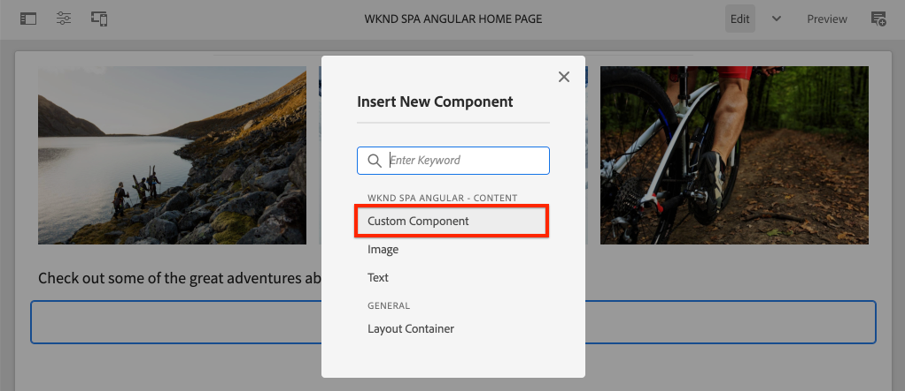

# 사용자 지정 구성 요소 만들기 {#custom-component}

{{spa-editor-deprecation}}

AEM SPA 편집기에서 사용할 사용자 지정 구성 요소를 만드는 방법을 알아봅니다. 작성자 대화 상자 및 Sling 모델을 개발하여 JSON 모델을 확장하여 사용자 지정 구성 요소를 채우는 방법에 대해 알아봅니다.

## 목표

1. AEM에서 제공하는 JSON 모델 API를 조작하는 Sling 모델의 역할을 이해합니다.
2. AEM 구성 요소 대화 상자를 만드는 방법을 이해합니다.
3. SPA 편집기 프레임워크와 호환되는 **사용자 지정** AEM 구성 요소를 만드는 방법을 알아봅니다.

## 빌드할 내용

이전 장에서는 SPA 구성 요소를 개발하여 *기존* AEM 핵심 구성 요소에 매핑하는 데 중점을 둡니다. 이 장에서는 *새* AEM 구성 요소를 만들고 확장하고 AEM에서 제공하는 JSON 모델을 조작하는 방법에 중점을 둡니다.

간단한 `Custom Component`은(는) 새로운 AEM 구성 요소를 만드는 데 필요한 단계를 보여 줍니다.


## 사전 요구 사항

[로컬 개발 환경](overview.md#local-dev-environment)을 설정하는 데 필요한 도구 및 지침을 검토하십시오.

### 코드 가져오기

1. Git을 통해 이 자습서의 시작점을 다운로드하십시오.

   ```shell
   $ git clone git@github.com:adobe/aem-guides-wknd-spa.git
   $ cd aem-guides-wknd-spa
   $ git checkout Angular/custom-component-start
   ```

2. Maven을 사용하여 로컬 AEM 인스턴스에 코드 베이스를 배포합니다.

   ```shell
   $ mvn clean install -PautoInstallSinglePackage
   ```

   [AEM 6.x](overview.md#compatibility)을(를) 사용하는 경우 `classic` 프로필을 추가하십시오.

   ```shell
   $ mvn clean install -PautoInstallSinglePackage -Pclassic
   ```

3. 기존 [WKND 참조 사이트](https://github.com/adobe/aem-guides-wknd/releases/latest)에 대해 완료된 패키지를 설치합니다. [WKND 참조 사이트](https://github.com/adobe/aem-guides-wknd/releases/latest)에서 제공한 이미지를 WKND SPA에서 다시 사용합니다. 패키지는 [AEM의 패키지 관리자](http://localhost:4502/crx/packmgr/index.jsp)를 사용하여 설치할 수 있습니다.

   

[GitHub](https://github.com/adobe/aem-guides-wknd-spa/tree/Angular/custom-component-solution)에서 완성된 코드를 항상 보거나 `Angular/custom-component-solution` 분기로 전환하여 코드를 로컬로 확인할 수 있습니다.

## AEM 구성 요소 정의

AEM 구성 요소는 노드 및 속성으로 정의됩니다. 프로젝트에서 이러한 노드 및 속성은 `ui.apps` 모듈에서 XML 파일로 표시됩니다. 그런 다음 `ui.apps` 모듈에서 AEM 구성 요소를 만듭니다.

>[!NOTE]
>
> AEM 구성 요소의 [기본 사항에 대한 빠른 새로 고침이 도움이 될 수 있습니다](https://experienceleague.adobe.com/docs/experience-manager-learn/getting-started-wknd-tutorial-develop/project-archetype/component-basics.html).

1. 선택한 IDE에서 `ui.apps` 폴더를 엽니다.
2. `ui.apps/src/main/content/jcr_root/apps/wknd-spa-angular/components`(으)로 이동하여 `custom-component` 폴더를 만듭니다.
3. `custom-component` 폴더 아래에 이름이 `.content.xml`인 파일을 만듭니다. `custom-component/.content.xml`을(를) 다음과 같이 채웁니다.

   ```xml
   <?xml version="1.0" encoding="UTF-8"?>
   <jcr:root xmlns:sling="http://sling.apache.org/jcr/sling/1.0" xmlns:cq="http://www.day.com/jcr/cq/1.0" xmlns:jcr="http://www.jcp.org/jcr/1.0"
       jcr:primaryType="cq:Component"
       jcr:title="Custom Component"
       componentGroup="WKND SPA Angular - Content"/>
   ```

   

   `jcr:primaryType="cq:Component"` - 이 노드가 AEM 구성 요소임을 식별합니다.

   `jcr:title`은(는) 콘텐츠 작성자에게 표시되는 값이며 `componentGroup`은(는) 작성 UI에서 구성 요소의 그룹화를 결정합니다.

4. `custom-component` 폴더 아래에 `_cq_dialog` 폴더를 만듭니다.
5. `_cq_dialog` 폴더 아래에서 이름이 `.content.xml`인 파일을 만들고 다음으로 채웁니다.

   ```xml
   <?xml version="1.0" encoding="UTF-8"?>
   <jcr:root xmlns:sling="http://sling.apache.org/jcr/sling/1.0" xmlns:granite="http://www.adobe.com/jcr/granite/1.0" xmlns:cq="http://www.day.com/jcr/cq/1.0" xmlns:jcr="http://www.jcp.org/jcr/1.0" xmlns:nt="http://www.jcp.org/jcr/nt/1.0"
       jcr:primaryType="nt:unstructured"
       jcr:title="Custom Component"
       sling:resourceType="cq/gui/components/authoring/dialog">
       <content
           jcr:primaryType="nt:unstructured"
           sling:resourceType="granite/ui/components/coral/foundation/container">
           <items jcr:primaryType="nt:unstructured">
               <tabs
                   jcr:primaryType="nt:unstructured"
                   sling:resourceType="granite/ui/components/coral/foundation/tabs"
                   maximized="{Boolean}true">
                   <items jcr:primaryType="nt:unstructured">
                       <properties
                           jcr:primaryType="nt:unstructured"
                           jcr:title="Properties"
                           sling:resourceType="granite/ui/components/coral/foundation/container"
                           margin="{Boolean}true">
                           <items jcr:primaryType="nt:unstructured">
                               <columns
                                   jcr:primaryType="nt:unstructured"
                                   sling:resourceType="granite/ui/components/coral/foundation/fixedcolumns"
                                   margin="{Boolean}true">
                                   <items jcr:primaryType="nt:unstructured">
                                       <column
                                           jcr:primaryType="nt:unstructured"
                                           sling:resourceType="granite/ui/components/coral/foundation/container">
                                           <items jcr:primaryType="nt:unstructured">
                                               <message
                                                   jcr:primaryType="nt:unstructured"
                                                   sling:resourceType="granite/ui/components/coral/foundation/form/textfield"
                                                   fieldDescription="The text to display on the component."
                                                   fieldLabel="Message"
                                                   name="./message"/>
                                           </items>
                                       </column>
                                   </items>
                               </columns>
                           </items>
                       </properties>
                   </items>
               </tabs>
           </items>
       </content>
   </jcr:root>
   ```

   

   위의 XML 파일은 `Custom Component`에 대한 간단한 대화 상자를 생성합니다. 파일의 중요한 부분은 내부 `<message>` 노드입니다. 이 대화 상자에는 `Message`(이)라는 간단한 `textfield`이(가) 포함되어 있으며 textifield의 값을 `message`(이)라는 속성에 유지합니다.

   JSON 모델을 통해 `message` 속성의 값을 표시하기 위해 Sling 모델이 옆에 만들어집니다.

   >[!NOTE]
   >
   > 핵심 구성 요소 정의를 보면 훨씬 많은 [대화 상자의 예제를 볼 수 있습니다](https://github.com/adobe/aem-core-wcm-components/tree/master/content/src/content/jcr_root/apps/core/wcm/components). [CRXDE-Lite](http://localhost:4502/crx/de/index.jsp#/libs/granite/ui/components/coral/foundation/form)의 `/libs/granite/ui/components/coral/foundation/form` 아래에서 사용할 수 있는 `select`, `textarea`, `pathfield`과(와) 같은 추가 양식 필드를 볼 수도 있습니다.

   기존 AEM 구성 요소의 경우 일반적으로 [HTL](https://experienceleague.adobe.com/docs/experience-manager-htl/content/overview.html) 스크립트가 필요합니다. SPA는 구성 요소를 렌더링하므로 HTL 스크립트가 필요하지 않습니다.

## Sling 모델 만들기

Sling 모델은 JCR에서 Java™ 변수로 데이터를 쉽게 매핑하는 주석 기반 Java™ &quot;POJO&quot;(일반 이전 Java™ 개체)입니다. [Sling 모델](https://experienceleague.adobe.com/docs/experience-manager-learn/getting-started-wknd-tutorial-develop/project-archetype/component-basics.html#sling-models)은 일반적으로 AEM 구성 요소에 대한 복잡한 서버측 비즈니스 논리를 캡슐화하는 기능을 합니다.

SPA 편집기의 컨텍스트에서 슬링 모델은 [슬링 모델 내보내기 도구](https://experienceleague.adobe.com/docs/experience-manager-learn/foundation/development/develop-sling-model-exporter.html?lang=ko)를 사용하는 기능을 통해 JSON 모델을 통해 구성 요소의 콘텐츠를 노출합니다.

1. 선택한 IDE에서 `core` 모듈을 엽니다. `CustomComponent.java` 및 `CustomComponentImpl.java`이(가) 이미 만들어져 챕터 시작 코드의 일부로 스텁아웃되었습니다.

   >[!NOTE]
   >
   > Visual Studio Code IDE를 사용하는 경우 [Java용 확장 기능](https://code.visualstudio.com/docs/java/extensions)을 설치하는 ™ 도움이 될 수 있습니다.

2. `core/src/main/java/com/adobe/aem/guides/wknd/spa/angular/core/models/CustomComponent.java`에서 Java™ 인터페이스 `CustomComponent.java`을(를) 엽니다.

   

   Sling 모델로 구현된 Java™ 인터페이스입니다.

3. `ComponentExporter` 인터페이스를 확장하도록 `CustomComponent.java`을(를) 업데이트합니다.

   ```java
   package com.adobe.aem.guides.wknd.spa.angular.core.models;
   import com.adobe.cq.export.json.ComponentExporter;
   
   public interface CustomComponent extends ComponentExporter {
   
       public String getMessage();
   
   }
   ```

   `ComponentExporter` 인터페이스 구현은 JSON 모델 API에서 슬링 모델을 자동으로 선택하는 요구 사항입니다.

   `CustomComponent` 인터페이스에 단일 getter 메서드 `getMessage()`이(가) 포함되어 있습니다. JSON 모델을 통해 작성자 대화 상자의 값을 표시하는 메서드입니다. 빈 매개 변수 `()`이(가) 있는 getter 메서드만 JSON 모델에서 내보냅니다.

4. `core/src/main/java/com/adobe/aem/guides/wknd/spa/angular/core/models/impl/CustomComponentImpl.java`에서 `CustomComponentImpl.java`을(를) 엽니다.

   `CustomComponent` 인터페이스의 구현입니다. `@Model` 주석은 Java™ 클래스를 Sling 모델로 식별합니다. `@Exporter` 주석을 사용하면 Java™ 클래스를 직렬화하고 Sling 모델 익스포터를 통해 내보낼 수 있습니다.

5. 이전 연습에서 만든 AEM 구성 요소 `wknd-spa-angular/components/custom-component`을(를) 가리키도록 정적 변수 `RESOURCE_TYPE`을(를) 업데이트합니다.

   ```java
   static final String RESOURCE_TYPE = "wknd-spa-angular/components/custom-component";
   ```

   구성 요소의 리소스 유형은 슬링 모델을 AEM 구성 요소에 바인딩하고 궁극적으로 Angular 구성 요소에 매핑하는 것입니다.

6. 구성 요소 리소스 형식을 반환하려면 `getExportedType()` 메서드를 `CustomComponentImpl` 클래스에 추가하십시오.

   ```java
   @Override
   public String getExportedType() {
       return CustomComponentImpl.RESOURCE_TYPE;
   }
   ```

   이 메서드는 `ComponentExporter` 인터페이스를 구현하고 Angular 구성 요소에 매핑을 허용하는 리소스 형식을 노출할 때 필요합니다.

7. 작성자 대화 상자에서 지속되는 `message` 속성의 값을 반환하도록 `getMessage()` 메서드를 업데이트합니다. `@ValueMap` 주석을 사용하여 JCR 값 `message`을(를) Java™ 변수에 매핑합니다.

   ```java
   import org.apache.commons.lang3.StringUtils;
   ...
   
   @ValueMapValue
   private String message;
   
   @Override
   public String getMessage() {
       return StringUtils.isNotBlank(message) ? message.toUpperCase() : null;
   }
   ```

   메시지 값을 대문자로 반환하기 위해 일부 &quot;비즈니스 논리&quot;가 추가됩니다. 이를 통해 작성자 대화 상자에 의해 저장된 원시 값과 슬링 모델에 의해 노출된 값 간의 차이를 볼 수 있습니다.

   >[!NOTE]
   >
   > 여기서 [완료된 CustomComponentImpl.java를 볼 수 있습니다](https://github.com/adobe/aem-guides-wknd-spa/blob/Angular/custom-component-solution/core/src/main/java/com/adobe/aem/guides/wknd/spa/angular/core/models/impl/CustomComponentImpl.java).

## Angular 구성 요소 업데이트

사용자 지정 구성 요소에 대한 Angular 코드가 이미 생성되었습니다. 그런 다음 몇 가지 업데이트를 통해 Angular 구성 요소를 AEM 구성 요소에 매핑합니다.

1. `ui.frontend` 모듈에서 `ui.frontend/src/app/components/custom/custom.component.ts` 파일을 엽니다.
2. `@Input() message: string;` 줄을 확인합니다. 변환된 대문자 값은 이 변수에 매핑되어야 합니다.
3. AEM SPA Editor JS SDK에서 `MapTo` 개체를 가져와서 AEM 구성 요소에 매핑하는 데 사용합니다.

   ```diff
   + import {MapTo} from '@adobe/cq-angular-editable-components';
   
    ...
    export class CustomComponent implements OnInit {
        ...
    }
   
   + MapTo('wknd-spa-angular/components/custom-component')(CustomComponent, CustomEditConfig);
   ```

4. `cutom.component.html`을(를) 열고 `{{message}}` 값이 `<h2>` 태그 옆에 표시되는지 확인합니다.
5. `custom.component.css`을(를) 열고 다음 규칙을 추가합니다.

   ```css
   :host-context {
       display: block;
   }
   ```

   구성 요소가 비어 있을 때 AEM 편집기 자리 표시자가 제대로 표시되려면 `:host-context` 또는 다른 `<div>`을(를) `display: block;`(으)로 설정해야 합니다.

6. Maven 기술을 사용하여 프로젝트 디렉토리의 루트에서 로컬 AEM 환경에 업데이트를 배포합니다.

   ```shell
   $ cd aem-guides-wknd-spa
   $ mvn clean install -PautoInstallSinglePackage
   ```

## 템플릿 정책 업데이트

그런 다음 AEM으로 이동하여 업데이트를 확인하고 `Custom Component`을(를) SPA에 추가할 수 있도록 합니다.

1. [http://localhost:4502/system/console/status-slingmodels](http://localhost:4502/system/console/status-slingmodels)&#x200B;(으)로 이동하여 새 Sling 모델의 등록을 확인하십시오.

   ```plain
   com.adobe.aem.guides.wknd.spa.angular.core.models.impl.CustomComponentImpl - wknd-spa-angular/components/custom-component
   
   com.adobe.aem.guides.wknd.spa.angular.core.models.impl.CustomComponentImpl exports 'wknd-spa-angular/components/custom-component' with selector 'model' and extension '[Ljava.lang.String;@6fb4a693' with exporter 'jackson'
   ```

   `CustomComponentImpl`이(가) `wknd-spa-angular/components/custom-component` 구성 요소와 연결되어 있고 슬링 모델 익스포터를 통해 등록되었음을 나타내는 위의 두 줄이 표시됩니다.

2. [http://localhost:4502/editor.html/conf/wknd-spa-angular/settings/wcm/templates/spa-page-template/structure.html](http://localhost:4502/editor.html/conf/wknd-spa-angular/settings/wcm/templates/spa-page-template/structure.html)의 SPA 페이지 템플릿으로 이동합니다.
3. 레이아웃 컨테이너의 정책을 업데이트하여 새 `Custom Component`을(를) 허용된 구성 요소로 추가합니다.

   

   정책에 대한 변경 내용을 저장하고 `Custom Component`을(를) 허용된 구성 요소로 관찰합니다.

   

## 사용자 지정 구성 요소 작성

그런 다음 AEM SPA 편집기를 사용하여 `Custom Component`을(를) 작성합니다.

1. [http://localhost:4502/editor.html/content/wknd-spa-angular/us/en/home.html](http://localhost:4502/editor.html/content/wknd-spa-angular/us/en/home.html)&#x200B;(으)로 이동합니다.
2. `Edit` 모드에서 `Custom Component`을(를) `Layout Container`에 추가합니다.

   

3. 구성 요소의 대화 상자를 열고 일부 소문자가 포함된 메시지를 입력합니다.

   

   이 대화 상자는 이 장 앞부분에서 XML 파일을 기반으로 만든 대화 상자입니다.

4. 변경 사항을 저장합니다. 표시된 메시지가 모두 대문자로 표시되는지 확인합니다.

   

5. [http://localhost:4502/content/wknd-spa-angular/us/en.model.json](http://localhost:4502/content/wknd-spa-angular/us/en.model.json)&#x200B;(으)로 이동하여 JSON 모델을 봅니다. `wknd-spa-angular/components/custom-component` 검색:

   ```json
   "custom_component_208183317": {
       "message": "HELLO WORLD",
       ":type": "wknd-spa-angular/components/custom-component"
   }
   ```

   JSON 값은 Sling 모델에 추가된 논리를 기반으로 모든 대문자로 설정됩니다.

## 축하합니다! {#congratulations}

축하합니다. 사용자 지정 AEM 구성 요소를 만드는 방법과 Sling 모델 및 대화 상자가 JSON 모델과 함께 작동하는 방법을 배웠습니다.

[GitHub](https://github.com/adobe/aem-guides-wknd-spa/tree/Angular/custom-component-solution)에서 완성된 코드를 항상 보거나 `Angular/custom-component-solution` 분기로 전환하여 코드를 로컬로 확인할 수 있습니다.

### 다음 단계 {#next-steps}

[핵심 구성 요소 확장](extend-component.md) - AEM SPA 편집기에서 사용할 기존 핵심 구성 요소를 확장하는 방법을 알아봅니다. 기존 구성 요소에 속성 및 콘텐츠를 추가하는 방법을 이해하는 것은 AEM SPA Editor 구현의 기능을 확장하는 강력한 기술입니다.
