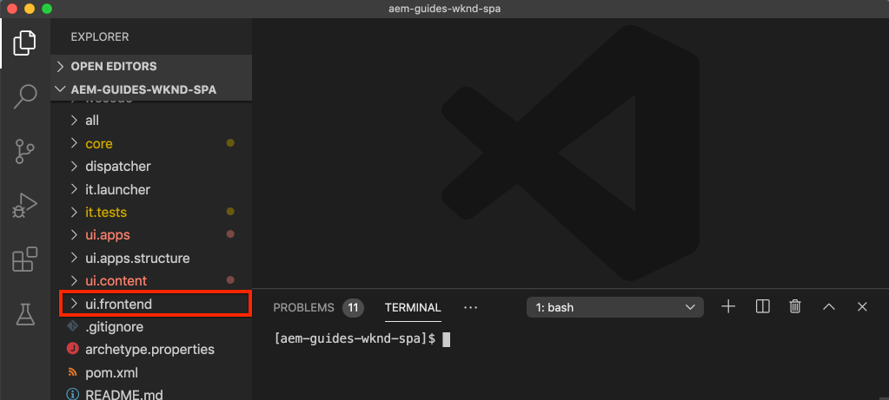

# SPA 통합 {#integrate-spa}

angular에 작성된 SPA(단일 페이지 애플리케이션)의 소스 코드를 AEM(Adobe Experience Manager) 프로젝트와 통합하는 방법을 알아봅니다. 웹 팩 개발 서버와 같은 최신 프런트 엔드 도구를 사용하여 AEM JSON 모델 API에 대해 SPA을 빠르게 개발하는 방법을 알아봅니다.

## 목표

1. SPA 프로젝트가 클라이언트 측 라이브러리와 AEM과 통합된 방법을 이해합니다.
2. 전용 프런트 엔드 개발에 로컬 개발 서버를 사용하는 방법을 알아봅니다.
3. AEM JSON 모델 API에 대해 개발을 위한 **proxy** 및 정적 **mock** 파일의 사용을 탐색합니다.

## 빌드할 내용

이 장에서는 간단한 `Header` 구성 요소를 SPA에 추가합니다. 이 정적 `Header` 구성 요소를 작성하는 과정에서 AEM SPA 개발에 대한 몇 가지 접근 방식이 사용됩니다.


*SPA이 확장 되어 정적  `Header` 구성 요소 추가*

## 전제 조건

[로컬 개발 환경](overview.md#local-dev-environment)을 설정하는 데 필요한 도구 및 지침을 검토하십시오.

### 코드 가져오기

1. Git을 통해 이 자습서의 시작점을 다운로드합니다.

   ```shell
   $ git clone git@github.com:adobe/aem-guides-wknd-spa.git
   $ cd aem-guides-wknd-spa
   $ git checkout Angular/integrate-spa-start
   ```

2. Maven을 사용하여 로컬 AEM 인스턴스에 코드 베이스를 배포합니다.

   ```shell
   $ mvn clean install -PautoInstallSinglePackage
   ```

   [AEM 6.x](overview.md#compatibility)을 사용하는 경우 `classic` 프로필을 추가합니다.

   ```shell
   $ mvn clean install -PautoInstallSinglePackage -Pclassic
   ```

항상 [GitHub](https://github.com/adobe/aem-guides-wknd-spa/tree/Angular/integrate-spa-solution)에서 완료된 코드를 보거나 분기 `Angular/integrate-spa-solution`로 전환하여 로컬로 코드를 체크 아웃할 수 있습니다.

## 통합 방법 {#integration-approach}

AEM 프로젝트의 일부로 두 개의 모듈이 생성되었습니다. `ui.apps` 및 `ui.frontend`

`ui.frontend` 모듈은 모든 SPA 소스 코드를 포함하는 [webpack](https://webpack.js.org/) 프로젝트입니다. 대부분의 SPA 개발 및 테스트는 웹 팩 프로젝트에서 수행됩니다. 프로덕션 빌드가 트리거되면 SPA이 웹 팩을 사용하여 빌드되고 컴파일됩니다. 컴파일된 객체(CSS 및 Javascript)는 `ui.apps` 모듈에 복사되며 AEM 런타임에 배포됩니다.


*SPA 통합에 대한 높은 수준의 묘사.*

프런트 엔드 빌드에 대한 추가 정보는 [여기에서 찾을 수 있습니다](https://experienceleague.adobe.com/docs/experience-manager-core-components/using/developing/archetype/uifrontend-angular.html).

## Inspect SPA 통합 {#inspect-spa-integration}

그런 다음 [AEM Project Archetype](https://experienceleague.adobe.com/docs/experience-manager-core-components/using/developing/archetype/uifrontend-angular.html)에서 자동으로 생성된 SPA을 이해하려면 `ui.frontend` 모듈을 검사하십시오.

1. 선택한 IDE에서 WKND SPA용 AEM 프로젝트를 엽니다. 이 자습서에서는 [Visual Studio 코드 IDE](https://experienceleague.adobe.com/docs/experience-manager-learn/cloud-service/local-development-environment-set-up/development-tools.html#microsoft-visual-studio-code)를 사용합니다.

   

2. `ui.frontend` 폴더를 확장하고 검사합니다. `ui.frontend/package.json` 파일을 엽니다.

3. `dependencies` 아래에 `@angular`과 관련된 여러 개가 표시됩니다.

   ```json
   "@angular/animations": "~9.1.11",
   "@angular/common": "~9.1.11",
   "@angular/compiler": "~9.1.11",
   "@angular/core": "~9.1.11",
   "@angular/forms": "~9.1.10",
   "@angular/platform-browser": "~9.1.10",
   "@angular/platform-browser-dynamic": "~9.1.10",
   "@angular/router": "~9.1.10",
   ```

   `ui.frontend` 모듈은 라우팅을 포함하는 [Angular CLI 도구](https://angular.io/cli)를 사용하여 생성된 [Angular 응용 프로그램](https://angular.io)입니다.

4. `@adobe` 접두사가 있는 종속성이 세 개 있습니다.

   ```json
   "@adobe/cq-angular-editable-components": "^2.0.2",
   "@adobe/cq-spa-component-mapping": "^1.0.3",
   "@adobe/cq-spa-page-model-manager": "^1.1.3",
   ```

   위의 모듈은 [AEM SPA Editor JS SDK](https://experienceleague.adobe.com/docs/experience-manager-65/developing/headless/spas/spa-blueprint.html)를 구성하고 SPA 구성 요소를 AEM 구성 요소에 매핑할 수 있는 기능을 제공합니다.

5. `package.json` 파일에서 여러 `scripts`이 정의되어 있습니다.

   ```json
   "scripts": {
       "start": "ng serve --open --proxy-config ./proxy.conf.json",
       "build": "ng lint && ng build && clientlib",
       "build:production": "ng lint && ng build --prod && clientlib",
       "test": "ng test",
       "sync": "aemsync -d -w ../ui.apps/src/main/content"
   }
   ```

   이러한 스크립트는 일반적인 [Angular CLI 명령](https://angular.io/cli/build)을 기반으로 하지만 큰 AEM 프로젝트에서 작동하도록 약간 수정되었습니다.

   `start` - 로컬 웹 서버를 사용하여 로컬에서 Angular 앱을 실행합니다. 로컬 AEM 인스턴스의 컨텐츠를 프록시하도록 업데이트되었습니다.

   `build` - 프로덕션 배포를 위한 Angular 앱을 컴파일합니다. `&& clientlib`을 추가하면 빌드 중에 컴파일된 SPA을 `ui.apps` 모듈로 클라이언트측 라이브러리로 복사할 수 있습니다. npm 모듈 [aem-clientlib-generator](https://github.com/wcm-io-frontend/aem-clientlib-generator)은(는) 이 작업을 용이하게 하는 데 사용됩니다.

   사용 가능한 스크립트에 대한 자세한 내용은 [여기](https://experienceleague.adobe.com/docs/experience-manager-core-components/using/developing/archetype/uifrontend-angular.html)를 참조하십시오.

6. Inspect: `ui.frontend/clientlib.config.js` 파일 이 구성 파일은 [aem-clientlib-generator](https://github.com/wcm-io-frontend/aem-clientlib-generator#clientlibconfigjs)에서 클라이언트 라이브러리를 생성하는 방법을 결정하는 데 사용됩니다.

7. Inspect: `ui.frontend/pom.xml` 파일 이 파일은 `ui.frontend` 폴더를 [Maven 모듈](http://maven.apache.org/guides/mini/guide-multiple-modules.html)로 변환합니다. `pom.xml` 파일이 Maven 빌드 중에 [frontend-maven-plugin](https://github.com/eirslett/frontend-maven-plugin)test **및** SPA 빌드&#x200B;**를 사용하도록 업데이트되었습니다.**

8. Inspect `ui.frontend/src/app/app.component.ts`에 있는 `app.component.ts` 파일:

   ```js
   import { Constants } from '@adobe/cq-angular-editable-components';
   import { ModelManager } from '@adobe/cq-spa-page-model-manager';
   import { Component } from '@angular/core';
   
   @Component({
   selector: '#spa-root', // tslint:disable-line
   styleUrls: ['./app.component.css'],
   templateUrl: './app.component.html'
   })
   export class AppComponent {
       ...
   
       constructor() {
           ModelManager.initialize().then(this.updateData);
       }
   
       private updateData = pageModel => {
           this.path = pageModel[Constants.PATH_PROP];
           this.items = pageModel[Constants.ITEMS_PROP];
           this.itemsOrder = pageModel[Constants.ITEMS_ORDER_PROP];
       }
   }
   ```

   `app.component.js` 는 SPA의 시작점입니다. `ModelManager` 는 AEM SPA Editor JS SDK에서 제공합니다. JSON 콘텐츠는 를 호출하고 애플리케이션에 `pageModel` (JSON 콘텐츠)를 삽입해야 합니다.

## 헤더 구성 요소 추가 {#header-component}

다음으로, SPA에 새 구성 요소를 추가하고 변경 사항을 로컬 AEM 인스턴스에 배포하여 통합을 확인합니다.

1. 새 터미널 창을 열고 `ui.frontend` 폴더로 이동합니다.

   ```shell
   $ cd aem-guides-wknd-spa/ui.frontend
   ```

2. [Angular CLI](https://angular.io/cli#installing-angular-cli) 전역적으로 설치 **ng** 명령을 통해 Angular 구성 요소를 생성하고 Angular 응용 프로그램을 제공하는 데 사용됩니다.

   ```shell
   $ npm install -g @angular/cli
   ```

   >[!CAUTION]
   >
   > 이 프로젝트에서 사용하는 **@angular/cli** 버전은 **9.1.7**&#x200B;입니다. angular CLI 버전을 동기화하는 것이 좋습니다.

3. `ui.frontend` 폴더 내에서 Angular CLI `ng generate component` 명령을 실행하여 새 `Header` 구성 요소를 만듭니다.

   ```shell
   $ ng generate component components/header
   
   CREATE src/app/components/header/header.component.css (0 bytes)
   CREATE src/app/components/header/header.component.html (21 bytes)
   CREATE src/app/components/header/header.component.spec.ts (628 bytes)
   CREATE src/app/components/header/header.component.ts (269 bytes)
   UPDATE src/app/app.module.ts (1809 bytes)
   ```

   이렇게 하면 `ui.frontend/src/app/components/header`에 있는 새 Angular 헤더 구성 요소에 대한 골격이 만들어집니다.

4. 선택한 IDE에서 `aem-guides-wknd-spa` 프로젝트를 엽니다. `ui.frontend/src/app/components/header` 폴더로 이동합니다.

   

5. `header.component.html` 파일을 열고 내용을 다음과 같이 바꿉니다.

   ```html
   <!--/* header.component.html */-->
   <header className="header">
       <div className="header-container">
           <h1>WKND</h1>
       </div>
   </header>
   ```

   참고 이 구성 요소는 정적 콘텐츠를 표시하므로 이 Angular 구성 요소에서는 생성된 기본값 `header.component.ts`에 대한 조정이 필요하지 않습니다.

6. **app.component.html** 파일을 `ui.frontend/src/app/app.component.html`에서 엽니다. `app-header` 추가:

   ```html
   <app-header></app-header>
   <router-outlet></router-outlet>
   ```

   여기에는 모든 페이지 컨텐츠 위에 `header` 구성 요소가 포함됩니다.

7. 새 터미널을 열고 `ui.frontend` 폴더로 이동한 다음 `npm run build` 명령을 실행합니다.

   ```shell
   $ cd ui.frontend
   $ npm run build
   
   Linting "angular-app"...
   All files pass linting.
   Generating ES5 bundles for differential loading...
   ES5 bundle generation complete.
   ```

8. `ui.apps` 폴더로 이동합니다. `ui.apps/src/main/content/jcr_root/apps/wknd-spa-angular/clientlibs/clientlib-angular` 아래에 컴파일된 SPA 파일이`ui.frontend/build` 폴더에서 복사된 것이 표시됩니다.

   

9. 터미널로 돌아가서 `ui.apps` 폴더로 이동합니다. 다음 Maven 명령을 실행합니다.

   ```shell
   $ cd ../ui.apps
   $ mvn clean install -PautoInstallPackage
   ...
   [INFO] ------------------------------------------------------------------------
   [INFO] BUILD SUCCESS
   [INFO] ------------------------------------------------------------------------
   [INFO] Total time:  9.629 s
   [INFO] Finished at: 2020-05-04T17:48:07-07:00
   [INFO] ------------------------------------------------------------------------
   ```

   이렇게 하면 `ui.apps` 패키지가 AEM의 로컬 실행 인스턴스에 배포됩니다.

10. 브라우저 탭을 열고 [http://localhost:4502/editor.html/content/wknd-spa-angular/us/en/home.html](http://localhost:4502/editor.html/content/wknd-spa-angular/us/en/home.html)로 이동합니다. 이제 SPA에 표시되는 `Header` 구성 요소의 컨텐츠가 표시됩니다.

   

   **7-9** 단계는 프로젝트의 루트에서 Maven 빌드를 트리거할 때 자동으로 실행됩니다(예: `mvn clean install -PautoInstallSinglePackage`). 이제 SPA과 AEM 클라이언트 측 라이브러리 간의 통합에 대한 기본 사항을 이해해야 합니다. AEM에서 `Text` 구성 요소를 계속 편집하고 추가할 수 있지만 `Header` 구성 요소는 편집할 수 없습니다.

## Webpack 개발 서버 - JSON API 프록시 {#proxy-json}

이전 연습에서 보듯이 빌드를 수행하고 클라이언트 라이브러리를 AEM의 로컬 인스턴스에 동기화하는 데에는 몇 분이 소요됩니다. 최종 테스트에는 허용되지만, SPA 개발의 대부분을 위해서는 적합하지 않습니다.

[웹 팩 개발 서버](https://webpack.js.org/configuration/dev-server/)를 사용하여 SPA을 신속하게 개발할 수 있습니다. SPA은 AEM에서 생성한 JSON 모델에 의해 제어됩니다. 이 연습에서 실행 중인 AEM 인스턴스의 JSON 콘텐츠는 **프록시된**&#x200B;이 [Angular 프로젝트](https://angular.io/guide/build)에 의해 구성된 개발 서버로 전송됩니다.

1. IDE로 돌아가서 **proxy.conf.json** 파일을 `ui.frontend/proxy.conf.json`에서 엽니다.

   ```json
   [
       {
           "context": [
                       "/content/**/*.(jpg|jpeg|png|model.json)",
                       "/etc.clientlibs/**/*"
                   ],
           "target": "http://localhost:4502",
           "auth": "admin:admin",
           "logLevel": "debug"
       }
   ]
   ```

   [Angular 앱](https://angular.io/guide/build#proxying-to-a-backend-server)은 API 요청을 프록시하는 간단한 메커니즘을 제공합니다. `context`에 지정된 패턴은 로컬 AEM 빠른 시작인 `localhost:4502`을 통해 프록시됩니다.

2. **index.html** 파일을 `ui.frontend/src/index.html`에서 엽니다. 개발 서버에서 사용하는 루트 HTML 파일입니다.

   `base href="/"`에 대한 항목이 있습니다. [기본 태그](https://angular.io/guide/deployment#the-base-tag)는 앱이 상대 URL을 확인하는 데 매우 중요합니다.

   ```html
   <base href="/">
   ```

3. 터미널 창을 열고 `ui.frontend` 폴더로 이동합니다. 명령 `npm start` 실행:

   ```shell
   $ cd ui.frontend
   $ npm start
   
   > wknd-spa-angular@0.1.0 start /Users/dgordon/Documents/code/aem-guides-wknd-spa/ui.frontend
   > ng serve --open --proxy-config ./proxy.conf.json
   
   10% building 3/3 modules 0 active[HPM] Proxy created: [ '/content/**/*.(jpg|jpeg|png|model.json)', '/etc.clientlibs/**/*' ]  ->  http://localhost:4502
   [HPM] Subscribed to http-proxy events:  [ 'error', 'close' ]
   ℹ ｢wds｣: Project is running at http://localhost:4200/webpack-dev-server/
   ℹ ｢wds｣: webpack output is served from /
   ℹ ｢wds｣: 404s will fallback to //index.html
   ```

4. 새 브라우저 탭을 열고(아직 열지 않은 경우) [http://localhost:4200/content/wknd-spa-angular/us/en/home.html](http://localhost:4200/content/wknd-spa-angular/us/en/home.html)로 이동합니다.

   

   AEM에서와 동일한 컨텐츠가 표시되지만 작성 기능이 활성화되지 않은 컨텐츠가 표시됩니다.

5. IDE로 돌아가서 `ui.frontend/src/assets`에 `img`라는 새 폴더를 만듭니다.
6. 다음 WKND 로고를 다운로드하여 `img` 폴더에 추가합니다.

   

7. `ui.frontend/src/app/components/header/header.component.html`에서 **header.component.html** 을 열고 로고를 포함하십시오.

   ```html
   <header class="header">
       <div class="header-container">
           <div class="logo">
               
           </div>
       </div>
   </header>
   ```

   변경 내용을 **header.component.html**&#x200B;에 저장합니다.

8. 브라우저로 돌아갑니다. 앱의 변경 사항이 즉시 반영됩니다.

   

   콘텐츠를 프록시하고 있으므로 **AEM**&#x200B;에서 콘텐츠를 계속 업데이트하고 **webpack 개발 서버**&#x200B;에 반영되는 콘텐츠를 볼 수 있습니다. 컨텐츠 변경 사항은 **웹 팩 개발 서버**&#x200B;에만 표시됩니다.

9. 터미널에서 `ctrl+c`을(를) 사용하여 로컬 웹 서버를 중지합니다.

## 웹 팩 개발 서버 - Mock JSON API {#mock-json}

신속한 개발에 대한 또 다른 접근 방법은 정적 JSON 파일을 사용하여 JSON 모델 역할을 하는 것입니다. JSON을 &quot;놀림&quot;하여 로컬 AEM 인스턴스에 대한 종속성을 제거합니다. 또한 프런트 엔드 개발자는 기능을 테스트하고 나중에 백엔드 개발자가 구현할 JSON API의 변경 사항을 유도하기 위해 JSON 모델을 업데이트할 수 있습니다.

샘플 JSON의 초기 설정에는 **로컬 AEM 인스턴스**&#x200B;가 필요합니다.

1. 브라우저에서 [http://localhost:4502/content/wknd-spa-angular/us/en.model.json](http://localhost:4502/content/wknd-spa-angular/us/en.model.json)로 이동합니다.

   애플리케이션을 구동하는 AEM에서 내보낸 JSON입니다. JSON 출력을 복사합니다.

2. IDE로 돌아가서 `ui.frontend/src` 로 이동하고 **jandroid** 및 **json**&#x200B;라는 새 폴더를 추가하여 다음 폴더 구조와 일치합니다.

   ```plain
   |-- ui.frontend
       |-- src
           |-- mocks
               |-- json
   ```

3. `ui.frontend/public/mocks/json` 아래에 **en.model.json**&#x200B;이라는 새 파일을 만듭니다. **1단계**&#x200B;에서 JSON 출력을 여기에 붙여 넣습니다.

   

4. `ui.frontend` 아래에 새 파일 **proxy.mock.json**&#x200B;을 만듭니다. 파일을 다음으로 채웁니다.

   ```json
   [
       {
       "context": [
           "/content/**/*.model.json"
       ],
       "pathRewrite": { "^/content/wknd-spa-angular/us" : "/mocks/json"} ,
       "target": "http://localhost:4200",
       "logLevel": "debug"
       }
   ]
   ```

   이 프록시 구성은 `/mocks/json` 로 시작하는 요청을 다시 작성하고 해당 정적 JSON 파일을 제공합니다(예: ).`/content/wknd-spa-angular/us`

   ```plain
   /content/wknd-spa-angular/us/en.model.json -> /mocks/json/en.model.json
   ```

5. **angular.json** 파일을 엽니다. 업데이트된 **assets** 배열이 있는 새 **dev** 구성을 추가하여 **만든** 폴더를 참조합니다.

   ```json
    "dev": {
             "assets": [
               "src/mocks",
               "src/assets",
               "src/favicon.ico",
               "src/logo192.png",
               "src/logo512.png",
               "src/manifest.json"
             ]
       },
   ```

   

   전용 **dev** 구성을 만들면 **android** 폴더가 개발 중에만 사용되고 프로덕션 빌드에서 AEM에 배포되지 않습니다.

6. **angular.json** 파일에서 다음 **browserTarget** 구성을 업데이트하여 새 **dev** 구성을 사용하십시오.

   ```diff
     ...
     "serve": {
         "builder": "@angular-devkit/build-angular:dev-server",
         "options": {
   +       "browserTarget": "angular-app:build:dev"
   -       "browserTarget": "angular-app:build"
         },
     ...
   ```

   

7. `ui.frontend/package.json` 파일을 열고 새 **start:mock** 명령을 추가하여 **proxy.mock.conf.json** 파일을 참조합니다.

   ```diff
       "scripts": {
           "start": "ng serve --open --proxy-config ./proxy.conf.json",
   +       "start:mock": "ng serve --open --proxy-config ./proxy.mock.conf.json",
           "build": "ng lint && ng build && clientlib",
           "build:production": "ng lint && ng build --prod && clientlib",
           "test": "ng test",
           "sync": "aemsync -d -w ../ui.apps/src/main/content"
       }
   ```

   새 명령을 추가하면 프록시 구성 간에 쉽게 전환할 수 있습니다.

8. 현재 실행 중인 경우 **웹 팩 개발 서버**&#x200B;를 중지합니다. **start:mock** 스크립트를 사용하여 **webpack 개발 서버**&#x200B;를 시작합니다.

   ```shell
   $ npm run start:mock
   
   > wknd-spa-angular@0.1.0 start:mock /Users/dgordon/Documents/code/aem-guides-wknd-spa/ui.frontend
   > ng serve --open --proxy-config ./proxy.mock.conf.json
   ```

   [http://localhost:4200/content/wknd-spa-angular/us/en/home.html](http://localhost:4200/content/wknd-spa-angular/us/en/home.html)로 이동하면 동일한 SPA이 표시되지만 이제 **mock** JSON 파일에서 콘텐츠를 가져오는 중입니다.

9. 앞에서 만든 **en.model.json** 파일을 약간 변경합니다. 업데이트된 컨텐츠는 **웹 팩 개발 서버**&#x200B;에 즉시 반영되어야 합니다.

   

   JSON 모델을 조작하고 라이브 SPA에 미치는 효과를 볼 수 있으면 개발자가 JSON 모델 API를 이해하는 데 도움이 될 수 있습니다. 또한 프런트엔드 및 백엔드 개발을 동시에 수행할 수 있습니다.

## Sass를 사용하여 스타일 추가

그런 다음 업데이트된 일부 스타일이 프로젝트에 추가됩니다. 이 프로젝트에서는 변수와 같은 몇 가지 유용한 기능에 대해 [Sas](https://sass-lang.com/) 지원을 추가합니다.

1. 터미널 창을 열고 **webpack dev server**&#x200B;를 시작하는 경우 중지합니다. `ui.frontend` 폴더 내에서 다음 명령을 입력하여 Angular 앱을 업데이트하여 **.scss** 파일을 처리합니다.

   ```shell
   $ cd ui.frontend
   $ ng config schematics.@schematics/angular:component.styleext scss
   ```

   그러면 파일 하단에 새 항목이 있는 `angular.json` 파일이 업데이트됩니다.

   ```json
   "schematics": {
       "@schematics/angular:component": {
       "styleext": "scss"
       }
   }
   ```

2. 브라우저 간에 스타일을 정규화하려면 `normalize-scss` 을 설치하십시오.

   ```shell
   $ npm install normalize-scss --save
   ```

3. IDE로 돌아가서 `ui.frontend/src` 아래에 `styles` 라는 새 폴더를 만듭니다.
4. `_variables.scss` 라는 `ui.frontend/src/styles` 아래에 새 파일을 만들고 다음 변수로 채웁니다.

   ```scss
   //_variables.scss
   
   //== Colors
   //
   //## Gray and brand colors for use across theme.
   
   $black:                  #202020;
   $gray:                   #696969;
   $gray-light:             #EBEBEB;
   $gray-lighter:           #F7F7F7;
   $white:                  #FFFFFF;
   $yellow:                 #FFEA00;
   $blue:                   #0045FF;
   
   
   //== Typography
   //
   //## Font, line-height, and color for body text, headings, and more.
   
   $font-family-sans-serif:  "Helvetica Neue", Helvetica, Arial, sans-serif;
   $font-family-serif:       Georgia, "Times New Roman", Times, serif;
   $font-family-base:        $font-family-sans-serif;
   $font-size-base:          18px;
   
   $line-height-base:        1.5;
   $line-height-computed:    floor(($font-size-base * $line-height-base));
   
   // Functional Colors
   $brand-primary:             $yellow;
   $body-bg:                   $white;
   $text-color:                $black;
   $text-color-inverse:        $gray-light;
   $link-color:                $blue;
   
   //Layout
   $max-width: 1024px;
   $header-height: 75px;
   
   // Spacing
   $gutter-padding: 12px;
   ```

5. `ui.frontend/src/styles.css`의 **스타일즈.css** 파일의 확장명을 **스타일즈.scss**&#x200B;로 다시 지정합니다. 컨텐츠를 다음과 같이 바꿉니다.

   ```scss
   /* styles.scss * /
   
   /* Normalize */
   @import '~normalize-scss/sass/normalize';
   
   @import './styles/variables';
   
   body {
       background-color: $body-bg;
       font-family: $font-family-base;
       margin: 0;
       padding: 0;
       font-size: $font-size-base;
       text-align: left;
       color: $text-color;
       line-height: $line-height-base;
   }
   
   body.page {
       max-width: $max-width;
       margin: 0 auto;
       padding: $gutter-padding;
       padding-top: $header-height;
   }
   ```

6. **angular.json**&#x200B;을 업데이트하고 **style.css**&#x200B;에 대한 모든 참조의 이름을 **styles.scss**&#x200B;로 다시 지정합니다. 3개의 추천이 있어야 합니다.

   ```diff
     "styles": [
   -    "src/styles.css"
   +    "src/styles.scss"
      ],
   ```

## 헤더 스타일 업데이트

다음으로 Sass를 사용하여 **Header** 구성 요소에 일부 브랜드별 스타일을 추가합니다.

1. **웹 팩 개발 서버**&#x200B;를 시작하여 실시간으로 업데이트된 스타일을 확인합니다.

   ```shell
   $ npm run start:mock
   ```

2. `ui.frontend/src/app/components/header` 아래의 **header.component.css**&#x200B;에서 **header.component.scss**&#x200B;로 이름을 다시 지정합니다. 파일을 다음으로 채웁니다.

   ```scss
   @import "~src/styles/variables";
   
   .header {
       width: 100%;
       position: fixed;
       top: 0;
       left:0;
       z-index: 99;
       background-color: $brand-primary;
       box-shadow: 0px 0px 10px 0px rgba(0, 0, 0, 0.24);
   }
   
   .header-container {
       display: flex;
       max-width: $max-width;
       margin: 0 auto;
       padding-left: $gutter-padding;
       padding-right: $gutter-padding;
   }
   
   .logo {
       z-index: 100;
       display: flex;
       padding-top: $gutter-padding;
       padding-bottom: $gutter-padding;
   }
   
   .logo-img {
       width: 100px;
   }
   ```

3. **header.component.js**&#x200B;를 업데이트하여 **header.component.scss**:

   ```diff
   ...
     @Component({
       selector: 'app-header',
       templateUrl: './header.component.html',
   -   styleUrls: ['./header.component.css']
   +   styleUrls: ['./header.component.scss']
     })
   ...
   ```

4. 브라우저 및 **웹 팩 개발 서버**&#x200B;로 돌아갑니다.

   

   이제 **Header** 구성 요소에 추가된 업데이트된 스타일이 표시됩니다.

## AEM에 SPA 업데이트 배포

**헤더**&#x200B;에 대한 변경 사항은 현재 **웹 팩 개발 서버**&#x200B;를 통해서만 볼 수 있습니다. 업데이트된 SPA을 AEM에 배포하여 변경 사항을 확인합니다.

1. **웹 팩 개발 서버**&#x200B;를 중지합니다.
2. 프로젝트 `/aem-guides-wknd-spa` 루트로 이동하고 Maven을 사용하여 프로젝트를 AEM에 배포합니다.

   ```shell
   $ cd ..
   $ mvn clean install -PautoInstallSinglePackage
   ```

3. [http://localhost:4502/editor.html/content/wknd-spa-angular/us/en/home.html](http://localhost:4502/editor.html/content/wknd-spa-angular/us/en/home.html)로 이동합니다. 로고와 스타일이 적용된 업데이트된 **Header**&#x200B;이 표시됩니다.

   

   업데이트된 SPA이 AEM에 있으므로 작성을 계속할 수 있습니다.

## 축하합니다! {#congratulations}

축하합니다. SPA을 업데이트하고 AEM와의 통합을 탐색했습니다! 이제 **webpack dev server**&#x200B;를 사용하여 AEM JSON 모델 API에 대해 SPA을 개발하는 두 가지 방법을 알고 있습니다.

항상 [GitHub](https://github.com/adobe/aem-guides-wknd-spa/tree/Angular/integrate-spa-solution)에서 완료된 코드를 보거나 분기 `Angular/integrate-spa-solution`로 전환하여 로컬로 코드를 체크 아웃할 수 있습니다.

### 다음 단계 {#next-steps}

[AEM 구성 요소에 SPA 구성 요소 매핑](map-components.md)  - AEM SPA Editor JS SDK를 사용하여 Angular 구성 요소를 Adobe Experience Manager(AEM) 구성 요소에 매핑하는 방법을 알아봅니다. 구성 요소 매핑을 사용하면 작성자가 기존의 AEM 작성과 유사하게 AEM SPA 편집기 내에서 SPA 구성 요소를 동적으로 업데이트할 수 있습니다.
