# SPA 통합 {#integrate-spa}

{{spa-editor-deprecation}}

Angular으로 작성된 단일 페이지 애플리케이션(SPA)의 소스 코드를 Adobe Experience Manager(AEM) 프로젝트와 통합하는 방법에 대해 알아봅니다. Webpack 개발 서버와 같은 최신 프론트엔드 도구를 사용하여 AEM JSON 모델 API에 대해 SPA를 신속하게 개발하는 방법에 대해 알아봅니다.

## 목표

1. SPA 프로젝트가 클라이언트측 라이브러리와 함께 AEM과 통합되는 방법을 이해합니다.
2. 전용 프론트엔드 개발을 위해 로컬 개발 서버를 사용하는 방법을 알아봅니다.
3. AEM JSON 모델 API에 대한 개발을 위해 **프록시** 및 정적 **mock** 파일의 사용을 살펴봅니다

## 빌드 결과물

이 장에서는 간단한 `Header` 구성 요소를 SPA에 추가합니다. 이 정적 `Header` 구성 요소를 빌드하는 과정에서 AEM SPA 개발에 대한 몇 가지 접근 방식이 사용됩니다.

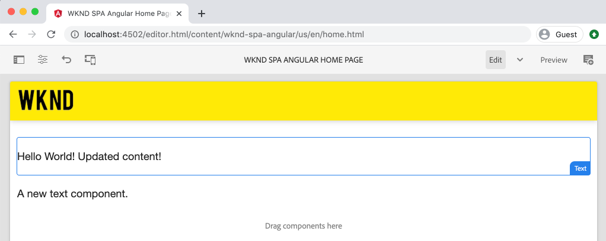

*SPA가 확장되어 정적 `Header` 구성 요소를 추가합니다*

## 사전 요구 사항

[로컬 개발 환경](overview.md#local-dev-environment)을 설정하는 데 필요한 도구와 지침을 검토합니다.

### 코드 가져오기

1. Git을 통해 이 자습서의 시작점을 다운로드하십시오.

   ```shell
   $ git clone git@github.com:adobe/aem-guides-wknd-spa.git
   $ cd aem-guides-wknd-spa
   $ git checkout Angular/integrate-spa-start
   ```

2. Maven을 사용하여 로컬 AEM 인스턴스에 코드 베이스를 배포합니다.

   ```shell
   $ mvn clean install -PautoInstallSinglePackage
   ```

   [AEM 6.x](overview.md#compatibility)을(를) 사용하는 경우 `classic` 프로필을 추가하십시오.

   ```shell
   $ mvn clean install -PautoInstallSinglePackage -Pclassic
   ```

[GitHub](https://github.com/adobe/aem-guides-wknd-spa/tree/Angular/integrate-spa-solution)에서 완성된 코드를 항상 보거나 `Angular/integrate-spa-solution` 분기로 전환하여 로컬에서 코드를 확인할 수 있습니다.

## 통합 접근 방식 {#integration-approach}

두 개의 모듈이 AEM 프로젝트의 일부로 만들어졌습니다. `ui.apps` 및 `ui.frontend`.

`ui.frontend` 모듈은 모든 SPA 소스 코드를 포함하는 [webpack](https://webpack.js.org/) 프로젝트입니다. SPA 개발 및 테스트의 대부분은 Webpack 프로젝트에서 수행됩니다. 프로덕션 빌드가 트리거되면 SPA가 Webpack을 사용하여 빌드되고 컴파일됩니다. 컴파일된 아티팩트(CSS 및 Javascript)는 `ui.apps` 모듈에 복사된 다음 AEM 런타임에 배포됩니다.

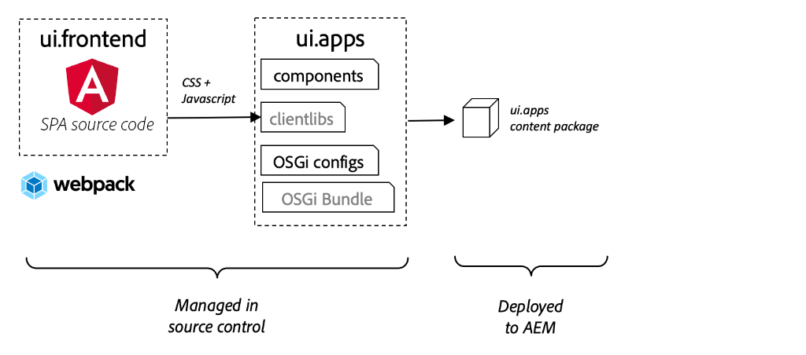

*SPA 통합에 대한 높은 수준의 설명입니다.*

프론트엔드 빌드에 대한 추가 정보는 [여기에서 찾을 수 있음](https://experienceleague.adobe.com/docs/experience-manager-core-components/using/developing/archetype/uifrontend-angular.html).

## SPA 통합 검사 {#inspect-spa-integration}

Next, inspect the `ui.frontend` module to understand the SPA that has been auto-generated by the [AEM Project archetype](https://experienceleague.adobe.com/docs/experience-manager-core-components/using/developing/archetype/uifrontend-angular.html).

1. 선택한 IDE에서 WKND SPA에 대한 AEM 프로젝트를 엽니다. This tutorial will use the [Visual Studio Code IDE](https://experienceleague.adobe.com/docs/experience-manager-learn/cloud-service/local-development-environment-set-up/development-tools.html#microsoft-visual-studio-code).

   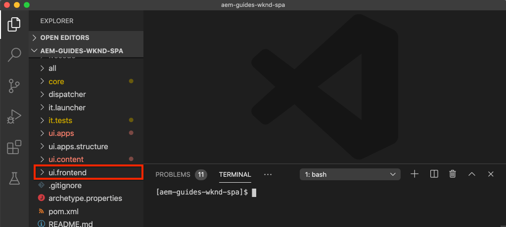

2. Expand and inspect the `ui.frontend` folder. `ui.frontend/package.json` 파일을 엽니다.

3. Under the `dependencies` you should see several related to `@angular`:

   ```json
   "@angular/animations": "~9.1.11",
   "@angular/common": "~9.1.11",
   "@angular/compiler": "~9.1.11",
   "@angular/core": "~9.1.11",
   "@angular/forms": "~9.1.10",
   "@angular/platform-browser": "~9.1.10",
   "@angular/platform-browser-dynamic": "~9.1.10",
   "@angular/router": "~9.1.10",
   ```

   The `ui.frontend` module is an [Angular application](https://angular.io) generated by using the [Angular CLI tool](https://angular.io/cli) that includes routing.

4. There are also three dependencies prefixed with `@adobe`:

   ```json
   "@adobe/cq-angular-editable-components": "^2.0.2",
   "@adobe/cq-spa-component-mapping": "^1.0.3",
   "@adobe/cq-spa-page-model-manager": "^1.1.3",
   ```

   The above modules make up the [AEM SPA Editor JS SDK](https://experienceleague.adobe.com/docs/experience-manager-65/developing/headless/spas/spa-blueprint.html) and provide the functionality to make it possible to map SPA Components to AEM Components.

5. In the `package.json` file several `scripts` are defined:

   ```json
   "scripts": {
       "start": "ng serve --open --proxy-config ./proxy.conf.json",
       "build": "ng lint && ng build && clientlib",
       "build:production": "ng lint && ng build --prod && clientlib",
       "test": "ng test",
       "sync": "aemsync -d -w ../ui.apps/src/main/content"
   }
   ```

   These scripts are based on common [Angular CLI commands](https://angular.io/cli/build) but have been modified slightly to work with the larger AEM project.

   `start` - runs the Angular app locally using a local web server. It has been updated to proxy the content of local AEM instance.

   `build` - compiles the Angular app for production distribution. The addition of `&& clientlib` is responsible for copying the compiled SPA into the `ui.apps` module as a client-side library during a build. The npm module [aem-clientlib-generator](https://github.com/wcm-io-frontend/aem-clientlib-generator) is used to facilitate this.

   More details about the available scripts can be found [here](https://experienceleague.adobe.com/docs/experience-manager-core-components/using/developing/archetype/uifrontend-angular.html).

6. `ui.frontend/clientlib.config.js` 파일을 검사합니다. This configuration file is used by [aem-clientlib-generator](https://github.com/wcm-io-frontend/aem-clientlib-generator#clientlibconfigjs) to determine how to generate the client library.

7. `ui.frontend/pom.xml` 파일을 검사합니다. This file transforms the `ui.frontend` folder into a [Maven module](https://maven.apache.org/guides/mini/guide-multiple-modules.html). The `pom.xml` file has been updated to use the [frontend-maven-plugin](https://github.com/eirslett/frontend-maven-plugin) to **test** and **build** the SPA during a Maven build.

8. Inspect the file `app.component.ts` at `ui.frontend/src/app/app.component.ts`:

   ```js
   import { Constants } from '@adobe/cq-angular-editable-components';
   import { ModelManager } from '@adobe/cq-spa-page-model-manager';
   import { Component } from '@angular/core';
   
   @Component({
   selector: '#spa-root', // tslint:disable-line
   styleUrls: ['./app.component.css'],
   templateUrl: './app.component.html'
   })
   export class AppComponent {
       ...
   
       constructor() {
           ModelManager.initialize().then(this.updateData);
       }
   
       private updateData = pageModel => {
           this.path = pageModel[Constants.PATH_PROP];
           this.items = pageModel[Constants.ITEMS_PROP];
           this.itemsOrder = pageModel[Constants.ITEMS_ORDER_PROP];
       }
   }
   ```

   `app.component.js` is the entrypoint of the SPA. `ModelManager` is provided by the AEM SPA Editor JS SDK. It is responsible for calling and injecting the `pageModel` (the JSON content) into the application.

## Add a Header component {#header-component}

그런 다음 새 구성 요소를 SPA에 추가하고 변경 사항을 로컬 AEM 인스턴스에 배포하여 통합을 확인합니다.

1. 새 터미널 창을 열고 `ui.frontend` 폴더로 이동합니다.

   ```shell
   $ cd aem-guides-wknd-spa/ui.frontend
   ```

2. 전체적으로 [Angular CLI](https://angular.io/cli#installing-angular-cli)를 설치하십시오. 이 옵션은 Angular 구성 요소를 생성하고 **ng** 명령을 통해 Angular 응용 프로그램을 빌드하고 제공하는 데 사용됩니다.

   ```shell
   $ npm install -g @angular/cli
   ```

   >[!CAUTION]
   >
   > 이 프로젝트에서 사용하는 **@angular/cli**&#x200B;의 버전은 **9.1.7**&#x200B;입니다. Angular CLI 버전을 계속 동기화하는 것이 좋습니다.

3. `ui.frontend` 폴더 내에서 Angular CLI `ng generate component` 명령을 실행하여 새 `Header` 구성 요소를 만듭니다.

   ```shell
   $ ng generate component components/header
   
   CREATE src/app/components/header/header.component.css (0 bytes)
   CREATE src/app/components/header/header.component.html (21 bytes)
   CREATE src/app/components/header/header.component.spec.ts (628 bytes)
   CREATE src/app/components/header/header.component.ts (269 bytes)
   UPDATE src/app/app.module.ts (1809 bytes)
   ```

   `ui.frontend/src/app/components/header`에 새 Angular 헤더 구성 요소에 대한 뼈대가 만들어집니다.

4. 선택한 IDE에서 `aem-guides-wknd-spa` 프로젝트를 엽니다. `ui.frontend/src/app/components/header` 폴더로 이동합니다.

   IDE의 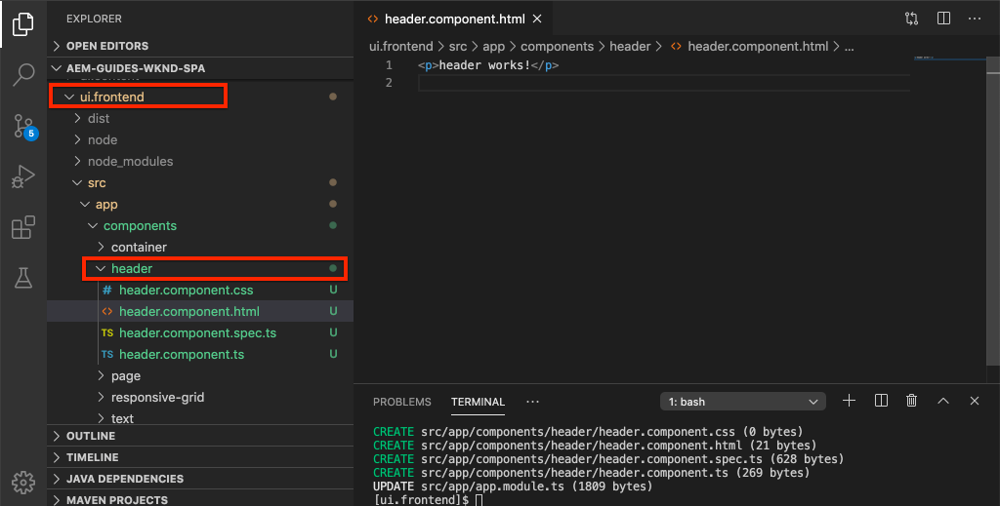

5. `header.component.html` 파일을 열고 내용을 다음과 같이 바꿉니다.

   ```html
   <!--/* header.component.html */-->
   <header className="header">
       <div className="header-container">
           <h1>WKND</h1>
       </div>
   </header>
   ```

   이 옵션은 정적 콘텐츠를 표시하므로 이 Angular 구성 요소에서는 기본 생성된 `header.component.ts`을(를) 조정할 필요가 없습니다.

6. `ui.frontend/src/app/app.component.html`에서 **app.component.html** 파일을 엽니다. `app-header` 추가:

   ```html
   <app-header></app-header>
   <router-outlet></router-outlet>
   ```

   모든 페이지 콘텐츠 위에 `header` 구성 요소가 포함됩니다.

7. 새 터미널을 열고 `ui.frontend` 폴더로 이동한 다음 `npm run build` 명령을 실행합니다.

   ```shell
   $ cd ui.frontend
   $ npm run build
   
   Linting "angular-app"...
   All files pass linting.
   Generating ES5 bundles for differential loading...
   ES5 bundle generation complete.
   ```

8. `ui.apps` 폴더로 이동합니다. `ui.apps/src/main/content/jcr_root/apps/wknd-spa-angular/clientlibs/clientlib-angular` 아래에 컴파일된 SPA 파일이 `ui.frontend/build` 폴더에서 복사되었습니다.

   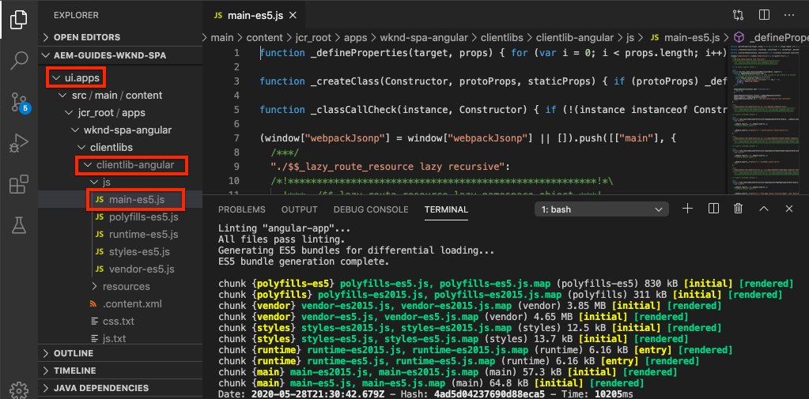

9. 터미널로 돌아가서 `ui.apps` 폴더로 이동합니다. 다음 Maven 명령을 실행합니다.

   ```shell
   $ cd ../ui.apps
   $ mvn clean install -PautoInstallPackage
   ...
   [INFO] ------------------------------------------------------------------------
   [INFO] BUILD SUCCESS
   [INFO] ------------------------------------------------------------------------
   [INFO] Total time:  9.629 s
   [INFO] Finished at: 2020-05-04T17:48:07-07:00
   [INFO] ------------------------------------------------------------------------
   ```

   `ui.apps` 패키지가 AEM의 로컬 실행 인스턴스에 배포됩니다.

10. 브라우저 탭을 열고 [http://localhost:4502/editor.html/content/wknd-spa-angular/us/en/home.html](http://localhost:4502/editor.html/content/wknd-spa-angular/us/en/home.html)&#x200B;(으)로 이동합니다. 이제 SPA에 `Header` 구성 요소의 콘텐츠가 표시됩니다.

   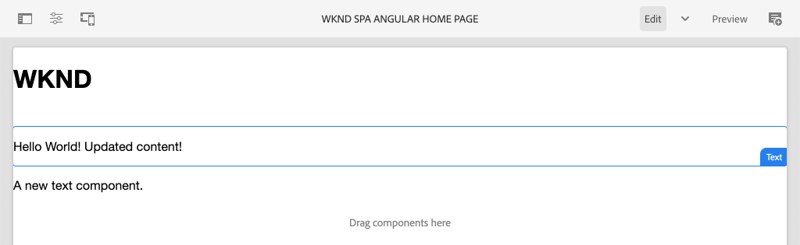

   프로젝트 루트(즉, `mvn clean install -PautoInstallSinglePackage`)에서 Maven 빌드를 트리거할 때 **7-9** 단계가 자동으로 실행됩니다. 이제 SPA와 AEM 클라이언트측 라이브러리 간의 통합에 대한 기본 사항을 이해해야 합니다. AEM에서 `Text` 구성 요소를 편집하고 추가할 수 있지만 `Header` 구성 요소는 편집할 수 없습니다.

## Webpack 개발 서버 - JSON API 프록시 {#proxy-json}

이전 연습에서 보듯이 빌드를 수행하고 클라이언트 라이브러리를 AEM의 로컬 인스턴스와 동기화하는 데 몇 분이 소요됩니다. 이는 최종 테스트에 사용할 수 있지만, 대부분의 SPA 개발에는 적합하지 않습니다.

[Webpack 개발 서버](https://webpack.js.org/configuration/dev-server/)를 사용하여 SPA를 신속하게 개발할 수 있습니다. SPA는 AEM에서 생성한 JSON 모델에 의해 구동됩니다. 이 연습에서는 실행 중인 AEM 인스턴스의 JSON 콘텐츠를 [Angular 프로젝트](https://angular.io/guide/build)에 의해 구성된 개발 서버로 **프록시**&#x200B;합니다.

1. IDE로 돌아가서 `ui.frontend/proxy.conf.json`에 **proxy.conf.json** 파일을 엽니다.

   ```json
   [
       {
           "context": [
                       "/content/**/*.(jpg|jpeg|png|model.json)",
                       "/etc.clientlibs/**/*"
                   ],
           "target": "http://localhost:4502",
           "auth": "admin:admin",
           "logLevel": "debug"
       }
   ]
   ```

   [Angular 앱](https://angular.io/guide/build#proxying-to-a-backend-server)은(는) API 요청을 프록시하기 쉬운 메커니즘을 제공합니다. `context`에 지정된 패턴은 로컬 AEM 빠른 시작인 `localhost:4502`을(를) 통해 프록시됩니다.

2. `ui.frontend/src/index.html`에서 **index.html** 파일을 엽니다. 개발 서버에서 사용하는 루트 HTML 파일입니다.

   `base href="/"`에 대한 항목이 있습니다. [기본 태그](https://angular.io/guide/deployment#the-base-tag)은(는) 앱이 상대 URL을 확인하는 데 중요합니다.

   ```html
   <base href="/">
   ```

3. 터미널 창을 열고 `ui.frontend` 폴더로 이동합니다. `npm start` 명령 실행:

   ```shell
   $ cd ui.frontend
   $ npm start
   
   > wknd-spa-angular@0.1.0 start /Users/dgordon/Documents/code/aem-guides-wknd-spa/ui.frontend
   > ng serve --open --proxy-config ./proxy.conf.json
   
   10% building 3/3 modules 0 active[HPM] Proxy created: [ '/content/**/*.(jpg|jpeg|png|model.json)', '/etc.clientlibs/**/*' ]  ->  http://localhost:4502
   [HPM] Subscribed to http-proxy events:  [ 'error', 'close' ]
   ℹ ｢wds｣: Project is running at http://localhost:4200/webpack-dev-server/
   ℹ ｢wds｣: webpack output is served from /
   ℹ ｢wds｣: 404s will fallback to //index.html
   ```

4. 새 브라우저 탭을 열고 [http://localhost:4200/content/wknd-spa-angular/us/en/home.html](http://localhost:4200/content/wknd-spa-angular/us/en/home.html)&#x200B;(으)로 이동합니다.

   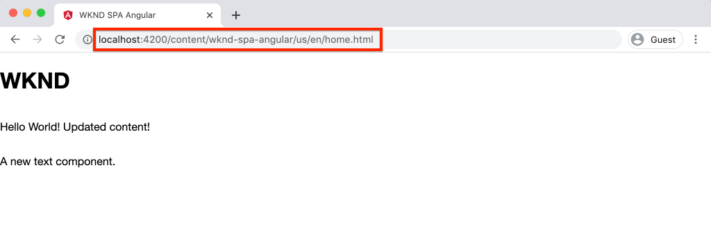

   AEM과 동일한 콘텐츠가 표시되지만 작성 기능이 활성화되어 있지 않아야 합니다.

5. IDE로 돌아가서 `ui.frontend/src/assets`에 `img`(이)라는 새 폴더를 만드십시오.
6. 다음 WKND 로고를 다운로드하여 `img` 폴더에 추가합니다.

   

7. `ui.frontend/src/app/components/header/header.component.html`에서 **header.component.html**&#x200B;을(를) 열고 로고를 포함하십시오.

   ```html
   <header class="header">
       <div class="header-container">
           <div class="logo">
               
           </div>
       </div>
   </header>
   ```

   **header.component.html**&#x200B;의 변경 사항을 저장합니다.

8. 브라우저로 돌아갑니다. 앱에 대한 변경 사항이 즉시 반영됩니다.

   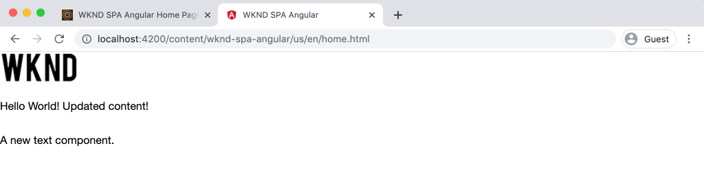

   콘텐츠를 프록시하고 있으므로 **AEM**&#x200B;에서 콘텐츠를 계속 업데이트하고 **Webpack 개발 서버**&#x200B;에 이를 반영할 수 있습니다. 콘텐츠 변경 내용은 **Webpack 개발 서버**&#x200B;에서만 볼 수 있습니다.

9. 터미널에서 `ctrl+c`(으)로 로컬 웹 서버를 중지합니다.

## Webpack 개발 서버 - 모의 JSON API {#mock-json}

빠른 개발에 대한 또 다른 접근 방식은 정적 JSON 파일을 사용하여 JSON 모델로 작동하는 것입니다. JSON을 &quot;조롱&quot;하여 로컬 AEM 인스턴스에 대한 종속성을 제거합니다. 또한 프론트엔드 개발자는 JSON 모델을 업데이트하여 기능을 테스트하고 나중에 백엔드 개발자가 구현하는 JSON API의 변경 사항을 유도할 수 있습니다.

초기 모의 JSON 설정에는 **로컬 AEM 인스턴스가 필요합니다**.

1. 브라우저에서 [http://localhost:4502/content/wknd-spa-angular/us/en.model.json](http://localhost:4502/content/wknd-spa-angular/us/en.model.json)&#x200B;(으)로 이동합니다.

   애플리케이션을 구동하는 AEM에서 내보낸 JSON입니다. JSON 출력을 복사합니다.

2. IDE로 돌아가서 `ui.frontend/src`(으)로 이동하고 다음 폴더 구조와 일치하도록 **mocks** 및 **json**(이)라는 새 폴더를 추가하십시오.

   ```plain
   |-- ui.frontend
       |-- src
           |-- mocks
               |-- json
   ```

3. `ui.frontend/public/mocks/json` 아래에 **en.model.json**(이)라는 새 파일을 만듭니다. **단계 1**&#x200B;의 JSON 출력을 여기에 붙여 넣으십시오.

   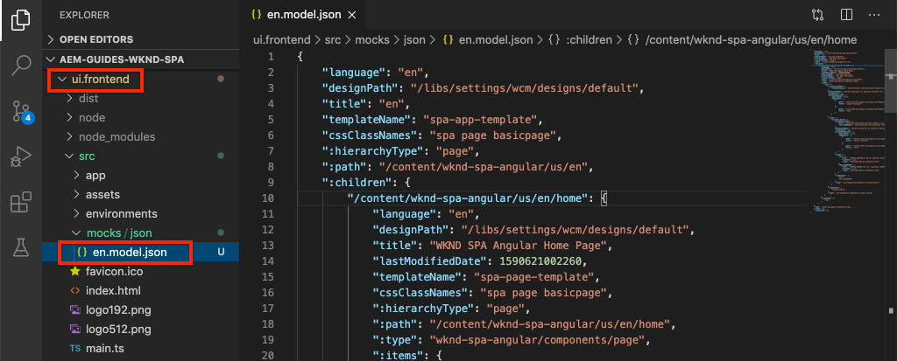

4. `ui.frontend` 아래에 새 파일 **proxy.mock.conf.json**&#x200B;을(를) 만듭니다. 파일을 다음과 같이 채웁니다.

   ```json
   [
       {
       "context": [
           "/content/**/*.model.json"
       ],
       "pathRewrite": { "^/content/wknd-spa-angular/us" : "/mocks/json"} ,
       "target": "http://localhost:4200",
       "logLevel": "debug"
       }
   ]
   ```

   이 프록시 구성은 `/mocks/json`이(가) 있는 `/content/wknd-spa-angular/us`(으)로 시작하는 요청을 다시 작성하고 해당 정적 JSON 파일을 제공합니다. 예를 들면 다음과 같습니다.

   ```plain
   /content/wknd-spa-angular/us/en.model.json -> /mocks/json/en.model.json
   ```

5. **angular.json** 파일을 엽니다. 생성된 **mock** 폴더를 참조하도록 업데이트된 **assets** 배열로 새 **dev** 구성을 추가하십시오.

   ```json
    "dev": {
             "assets": [
               "src/mocks",
               "src/assets",
               "src/favicon.ico",
               "src/logo192.png",
               "src/logo512.png",
               "src/manifest.json"
             ]
       },
   ```

   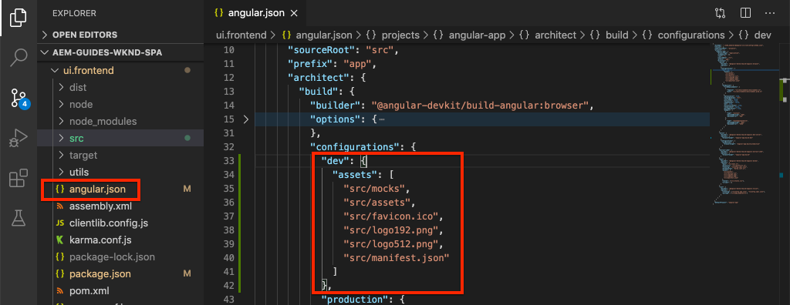

   전용 **dev** 구성을 만들면 **mocks** 폴더가 개발 중에만 사용되고 프로덕션 빌드의 AEM에 배포되지 않습니다.

6. **angular.json** 파일에서 다음에 **browserTarget** 구성을 업데이트하여 새 **dev** 구성을 사용합니다.

   ```diff
     ...
     "serve": {
         "builder": "@angular-devkit/build-angular:dev-server",
         "options": {
   +       "browserTarget": "angular-app:build:dev"
   -       "browserTarget": "angular-app:build"
         },
     ...
   ```

   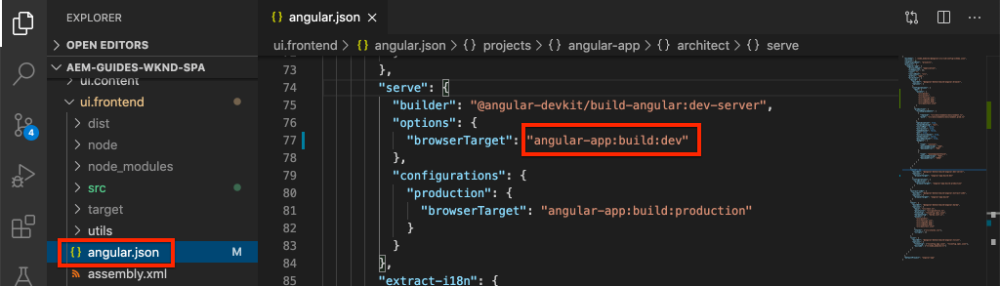

7. `ui.frontend/package.json` 파일을 열고 새 **start:mock** 명령을 추가하여 **proxy.mock.conf.json** 파일을 참조합니다.

   ```diff
       "scripts": {
           "start": "ng serve --open --proxy-config ./proxy.conf.json",
   +       "start:mock": "ng serve --open --proxy-config ./proxy.mock.conf.json",
           "build": "ng lint && ng build && clientlib",
           "build:production": "ng lint && ng build --prod && clientlib",
           "test": "ng test",
           "sync": "aemsync -d -w ../ui.apps/src/main/content"
       }
   ```

   새 명령을 추가하면 프록시 구성 간을 쉽게 전환할 수 있습니다.

8. 현재 실행 중인 경우 **Webpack 개발 서버**&#x200B;를 중지하십시오. **start:mock** 스크립트를 사용하여 **Webpack 개발 서버**&#x200B;를 시작합니다.

   ```shell
   $ npm run start:mock
   
   > wknd-spa-angular@0.1.0 start:mock /Users/dgordon/Documents/code/aem-guides-wknd-spa/ui.frontend
   > ng serve --open --proxy-config ./proxy.mock.conf.json
   ```

   [http://localhost:4200/content/wknd-spa-angular/us/en/home.html](http://localhost:4200/content/wknd-spa-angular/us/en/home.html)&#x200B;(으)로 이동하면 동일한 SPA가 표시되지만 이제 **mock** JSON 파일에서 콘텐츠를 가져옵니다.

9. 이전에 만든 **en.model.json** 파일을 약간 변경합니다. 업데이트된 콘텐츠는 즉시 **Webpack 개발 서버**&#x200B;에 반영되어야 합니다.

   

   JSON 모델을 조작하고 라이브 SPA에서 효과를 확인할 수 있으므로 개발자가 JSON 모델 API를 이해하는 데 도움이 될 수 있습니다. 또한 프론트엔드 및 백엔드 개발을 동시에 수행할 수 있습니다.

## Sass로 스타일 추가

그런 다음 업데이트된 일부 스타일이 프로젝트에 추가됩니다. 이 프로젝트에서는 변수와 같은 몇 가지 유용한 기능에 대한 [Sass](https://sass-lang.com/) 지원을 추가합니다.

1. 터미널 창을 열고 **Webpack 개발 서버**&#x200B;를 시작한 경우 중지합니다. `ui.frontend` 폴더 내에서 다음 명령을 입력하여 **.scss** 파일을 처리하도록 Angular 앱을 업데이트합니다.

   ```shell
   $ cd ui.frontend
   $ ng config schematics.@schematics/angular:component.styleext scss
   ```

   `angular.json` 파일이 파일 하단에 새 항목으로 업데이트됩니다.

   ```json
   "schematics": {
       "@schematics/angular:component": {
       "styleext": "scss"
       }
   }
   ```

2. `normalize-scss`을(를) 설치하여 브라우저 간 스타일을 정규화합니다.

   ```shell
   $ npm install normalize-scss --save
   ```

3. IDE로 돌아가서 `ui.frontend/src` 아래에 `styles`(이)라는 새 폴더를 만듭니다.
4. `ui.frontend/src/styles` 아래에 이름이 `_variables.scss`인 새 파일을 만들고 다음 변수로 채웁니다.

   ```scss
   //_variables.scss
   
   //== Colors
   //
   //## Gray and brand colors for use across theme.
   
   $black:                  #202020;
   $gray:                   #696969;
   $gray-light:             #EBEBEB;
   $gray-lighter:           #F7F7F7;
   $white:                  #FFFFFF;
   $yellow:                 #FFEA00;
   $blue:                   #0045FF;
   
   
   //== Typography
   //
   //## Font, line-height, and color for body text, headings, and more.
   
   $font-family-sans-serif:  "Helvetica Neue", Helvetica, Arial, sans-serif;
   $font-family-serif:       Georgia, "Times New Roman", Times, serif;
   $font-family-base:        $font-family-sans-serif;
   $font-size-base:          18px;
   
   $line-height-base:        1.5;
   $line-height-computed:    floor(($font-size-base * $line-height-base));
   
   // Functional Colors
   $brand-primary:             $yellow;
   $body-bg:                   $white;
   $text-color:                $black;
   $text-color-inverse:        $gray-light;
   $link-color:                $blue;
   
   //Layout
   $max-width: 1024px;
   $header-height: 75px;
   
   // Spacing
   $gutter-padding: 12px;
   ```

5. **styles.css** 파일의 확장명을 `ui.frontend/src/styles.css`에서 **styles.scss**(으)로 다시 지정하십시오. 내용을 다음과 같이 바꿉니다.

   ```scss
   /* styles.scss * /
   
   /* Normalize */
   @import '~normalize-scss/sass/normalize';
   
   @import './styles/variables';
   
   body {
       background-color: $body-bg;
       font-family: $font-family-base;
       margin: 0;
       padding: 0;
       font-size: $font-size-base;
       text-align: left;
       color: $text-color;
       line-height: $line-height-base;
   }
   
   body.page {
       max-width: $max-width;
       margin: 0 auto;
       padding: $gutter-padding;
       padding-top: $header-height;
   }
   ```

6. **angular.json**&#x200B;을(를) 업데이트하고 **style.css**&#x200B;에 대한 모든 참조의 이름을 **styles.scss**(으)로 다시 지정합니다. 3개의 참조가 있어야 합니다.

   ```diff
     "styles": [
   -    "src/styles.css"
   +    "src/styles.scss"
      ],
   ```

## 헤더 스타일 업데이트

Next add some brand-specific styles to the **Header** component using Sass.

1. Start the **webpack dev server** to see the styles updating in real-time:

   ```shell
   $ npm run start:mock
   ```

2. Under `ui.frontend/src/app/components/header` re-name **header.component.css** to **header.component.scss**. 파일을 다음과 같이 채웁니다.

   ```scss
   @import "~src/styles/variables";
   
   .header {
       width: 100%;
       position: fixed;
       top: 0;
       left:0;
       z-index: 99;
       background-color: $brand-primary;
       box-shadow: 0px 0px 10px 0px rgba(0, 0, 0, 0.24);
   }
   
   .header-container {
       display: flex;
       max-width: $max-width;
       margin: 0 auto;
       padding-left: $gutter-padding;
       padding-right: $gutter-padding;
   }
   
   .logo {
       z-index: 100;
       display: flex;
       padding-top: $gutter-padding;
       padding-bottom: $gutter-padding;
   }
   
   .logo-img {
       width: 100px;
   }
   ```

3. Update **header.component.ts** to reference **header.component.scss**:

   ```diff
   ...
     @Component({
       selector: 'app-header',
       templateUrl: './header.component.html',
   -   styleUrls: ['./header.component.css']
   +   styleUrls: ['./header.component.scss']
     })
   ...
   ```

4. Return to the browser and the **webpack dev server**:

   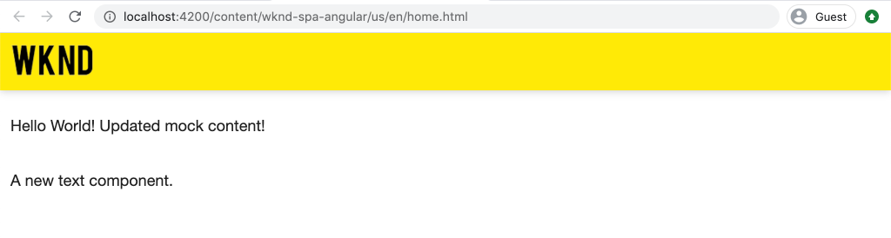

   You should now see the updated styles added to the **Header** component.

## Deploy SPA updates to AEM

The changes made to the **Header** are currently only visible through the **webpack dev server**. Deploy the updated SPA to AEM to see the changes.

1. Stop the **webpack dev server**.
2. Navigate to the root of the project `/aem-guides-wknd-spa` and deploy the project to AEM using Maven:

   ```shell
   $ cd ..
   $ mvn clean install -PautoInstallSinglePackage
   ```

3. [http://localhost:4502/editor.html/content/wknd-spa-angular/us/en/home.html](http://localhost:4502/editor.html/content/wknd-spa-angular/us/en/home.html)&#x200B;(으)로 이동합니다. You should see the updated **Header** with logo and styles applied:

   

   Now that the updated SPA is in AEM, authoring can continue.

## 축하합니다! {#congratulations}

Congratulations, you have updated the SPA and explored the integration with AEM! You now know two different approaches for developing the SPA against the AEM JSON model API using a **webpack dev server**.

[GitHub](https://github.com/adobe/aem-guides-wknd-spa/tree/Angular/integrate-spa-solution)에서 완성된 코드를 항상 보거나 `Angular/integrate-spa-solution` 분기로 전환하여 로컬에서 코드를 확인할 수 있습니다.

### 다음 단계 {#next-steps}

[Map SPA components to AEM components](map-components.md) - Learn how to map Angular components to Adobe Experience Manager (AEM) components with the AEM SPA Editor JS SDK. Component mapping enables authors to make dynamic updates to SPA components within the AEM SPA Editor, similar to traditional AEM authoring.
