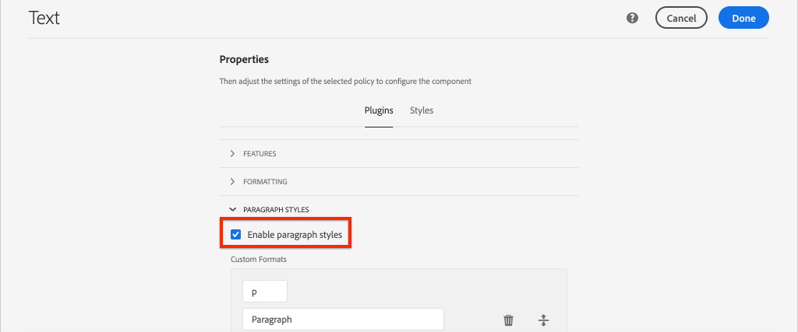

# SPA 구성 요소를 AEM 구성 요소에 매핑 {#map-components}

AEM SPA Editor JS SDK를 사용하여 Angular 구성 요소를 Adobe Experience Manager(AEM) 구성 요소에 매핑하는 방법에 대해 알아봅니다. 구성 요소 매핑을 통해 사용자는 AEM SPA 편집기 내에서 기존의 AEM 작성과 유사하게 SPA 구성 요소를 동적으로 업데이트할 수 있습니다.

이 장에서는 AEM JSON 모델 API에 대해 자세히 알아보고 AEM 구성 요소에 의해 노출된 JSON 콘텐츠를 어떻게 자동으로 Angular 구성 요소에 prop으로 삽입할 수 있는지 살펴봅니다.

## 목표

1. AEM 구성 요소를 SPA 구성 요소에 매핑하는 방법을 알아봅니다.
2. 의 차이점 이해 **컨테이너** 구성 요소 및 **콘텐츠** 구성 요소.
3. 기존 AEM 구성 요소에 매핑되는 새 Angular 구성 요소를 만듭니다.

## 빌드할 내용

이 장에서는 제공된 방법을 검사합니다 `Text` SPA 구성 요소는 AEM에 매핑됩니다. `Text`구성 요소. 새 항목 `Image` SPA 구성 요소가 만들어지는데, 이 구성 요소는 SPA에서 사용할 수 있고 AEM에서 작성할 수 있습니다. 의 기본 기능 **레이아웃 컨테이너** 및 **템플릿 편집기** 정책은 또한 외형이 약간 더 다양한 보기를 만드는 데 사용됩니다.


## 사전 요구 사항

설정에 필요한 도구 및 지침 검토 [로컬 개발 환경](overview.md#local-dev-environment).

### 코드 가져오기

1. Git을 통해 이 자습서의 시작점을 다운로드하십시오.

   ```shell
   $ git clone git@github.com:adobe/aem-guides-wknd-spa.git
   $ cd aem-guides-wknd-spa
   $ git checkout Angular/map-components-start
   ```

2. Maven을 사용하여 로컬 AEM 인스턴스에 코드 베이스를 배포합니다.

   ```shell
   $ mvn clean install -PautoInstallSinglePackage
   ```

   사용 중인 경우 [AEM 6.x](overview.md#compatibility) 추가 `classic` 프로필:

   ```shell
   $ mvn clean install -PautoInstallSinglePackage -Pclassic
   ```

에서 완성된 코드를 항상 볼 수 있습니다. [GitHub](https://github.com/adobe/aem-guides-wknd-spa/tree/Angular/map-components-solution) 또는 분기로 전환하여 코드를 로컬에서 확인합니다. `Angular/map-components-solution`.

## 매핑 접근 방식

기본 개념은 SPA 구성 요소를 AEM 구성 요소에 매핑하는 것입니다. AEM 구성 요소, 서버측 실행, JSON 모델 API의 일부로 콘텐츠 내보내기. JSON 콘텐츠는 브라우저에서 클라이언트측을 실행하는 SPA에서 사용됩니다. SPA 구성 요소와 AEM 구성 요소 간의 1:1 매핑이 생성됩니다.


*AEM 구성 요소를 Angular 구성 요소에 매핑하는 방법에 대한 높은 수준의 개요*

## 텍스트 구성 요소 Inspect

다음 [AEM Project Archetype](https://github.com/adobe/aem-project-archetype) 는 을(를) 제공합니다 `Text` AEM에 매핑된 구성 요소 [텍스트 구성 요소](https://experienceleague.adobe.com/docs/experience-manager-core-components/using/components/text.html). 다음은 의 예입니다 **콘텐츠** 구성 요소, 렌더링됩니다. *콘텐츠* AEM에서.

구성 요소가 어떻게 작동하는지 살펴보겠습니다.

### Inspect JSON 모델

1. SPA 코드로 이동하기 전에 AEM에서 제공하는 JSON 모델을 이해하는 것이 중요합니다. 다음 위치로 이동 [핵심 구성 요소 라이브러리](https://www.aemcomponents.dev/content/core-components-examples/library/core-content/text.html) 텍스트 구성 요소에 대한 페이지를 봅니다. 핵심 구성 요소 라이브러리는 모든 AEM 핵심 구성 요소의 예를 제공합니다.
2. 다음 항목 선택 **JSON** 예제 중 하나에 대한 탭:

   

   다음 세 가지 속성이 표시됩니다. `text`, `richText`, 및 `:type`.

   `:type` 는 다음을 나열하는 예약된 속성입니다. `sling:resourceType` AEM 구성 요소 (또는 경로). 값: `:type` 는 AEM 구성 요소를 SPA 구성 요소에 매핑하는 데 사용되는 것입니다.

   `text` 및 `richText` 는 SPA 구성 요소에 노출되는 추가 속성입니다.

### 텍스트 구성 요소 Inspect

1. 새 터미널을 열고 다음으로 이동 `ui.frontend` 프로젝트 내 폴더. 실행 `npm install` 그런 다음 `npm start` 을(를) 시작하려면 **webpack 개발 서버**:

   ```shell
   $ cd ui.frontend
   $ npm run start:mock
   ```

   다음 `ui.frontend` 모듈이 현재 를 사용하도록 설정되어 있습니다. [모의 JSON 모델](./integrate-spa.md#mock-json).

2. 다음 위치에 새 브라우저 창이 열립니다 [http://localhost:4200/content/wknd-spa-angular/us/en/home.html](http://localhost:4200/content/wknd-spa-angular/us/en/home.html)

   

3. 선택한 IDE에서 WKND SPA에 대한 AEM 프로젝트를 엽니다. 확장 `ui.frontend` 모듈을 클릭하고 파일을 엽니다. **text.component.ts** 아래에 `ui.frontend/src/app/components/text/text.component.ts`:

   

4. 첫 번째 검사 영역은 `class TextComponent` ~line 35:

   ```js
   export class TextComponent {
       @Input() richText: boolean;
       @Input() text: string;
       @Input() itemName: string;
   
       @HostBinding('innerHtml') get content() {
           return this.richText
           ? this.sanitizer.bypassSecurityTrustHtml(this.text)
           : this.text;
       }
       @HostBinding('attr.data-rte-editelement') editAttribute = true;
   
       constructor(private sanitizer: DomSanitizer) {}
   }
   ```

   [@Input()](https://angular.io/api/core/Input) decorator는 앞에서 검토한 매핑된 JSON 개체를 통해 값이 설정된 필드를 선언하는 데 사용됩니다.

   `@HostBinding('innerHtml') get content()` 은 다음 값에서 작성된 텍스트 콘텐츠를 노출하는 메서드입니다. `this.text`. 콘텐츠가 리치 텍스트인 경우( `this.richText` flag) Angular의 기본 제공 보안은 무시됩니다. Angular [돔세니타이저](https://angular.io/api/platform-browser/DomSanitizer) 원시 HTML을 &quot;스크러빙&quot;하고 교차 사이트 스크립팅 취약성을 방지하는 데 사용됩니다. 메서드는 `innerHtml` 를 사용하는 속성 [@HostBinding](https://angular.io/api/core/HostBinding) 장식가.

5. 다음 검사 `TextEditConfig` ~line 24:

   ```js
   const TextEditConfig = {
       emptyLabel: 'Text',
       isEmpty: cqModel =>
           !cqModel || !cqModel.text || cqModel.text.trim().length < 1
   };
   ```

   위의 코드는 AEM 작성 환경에서 자리 표시자를 렌더링할 시기를 결정합니다. 다음과 같은 경우 `isEmpty` 메서드 반환 **true** 그러면 자리 표시자가 렌더링됩니다.

6. 마지막으로 다음을 살펴보십시오 `MapTo` ~53번 줄에서 호출:

   ```js
   MapTo('wknd-spa-angular/components/text')(TextComponent, TextEditConfig );
   ```

   **매핑 대상** AEM SPA Editor JS SDK에서 제공됩니다(`@adobe/cq-angular-editable-components`). 경로 `wknd-spa-angular/components/text` 다음 표현: `sling:resourceType` AEM 구성 요소 이 경로는 `:type` 이전에 관찰된 JSON 모델에 의해 노출됩니다. **매핑 대상** 는 JSON 모델 응답을 구문 분석하고 올바른 값을 `@Input()` SPA 구성 요소의 변수입니다.

   AEM을 찾을 수 있습니다. `Text` 구성 요소 정의 위치 `ui.apps/src/main/content/jcr_root/apps/wknd-spa-angular/components/text`.

7. 을 수정하여 실험 **en.model.json** 파일 위치: `ui.frontend/src/mocks/json/en.model.json`.

   ~라인 62에서 첫 번째 `Text` 사용할 값 **`H1`** 및 **`u`** 태그:

   ```json
       "text": {
           "text": "<h1><u>Hello World!</u></h1>",
           "richText": true,
           ":type": "wknd-spa-angular/components/text"
       }
   ```

   브라우저에서 제공하는 효과를 보려면 돌아가기 **webpack 개발 서버**:

   

   전환 시도 `richText` 다음 기간 사이의 속성 **true** / **false** 렌더링 논리를 작동 상태로 봅니다.

8. Inspect **text.component.html** 위치: `ui.frontend/src/app/components/text/text.component.html`.

   구성 요소의 전체 내용이 `innerHTML` 속성.

9. Inspect **app.module.ts** 위치: `ui.frontend/src/app/app.module.ts`.

   ```js
   @NgModule({
   imports: [
       BrowserModule,
       SpaAngularEditableComponentsModule,
       AppRoutingModule
   ],
   providers: [ModelManagerService, { provide: APP_BASE_HREF, useValue: '/' }],
   declarations: [AppComponent, TextComponent, PageComponent, HeaderComponent],
   entryComponents: [TextComponent, PageComponent],
   bootstrap: [AppComponent]
   })
   export class AppModule {}
   ```

   다음 **텍스트 구성 요소** 가 명시적으로 포함되지 않고 를 통해 동적으로 **AEMResponsiveGridComponent** AEM SPA Editor JS SDK에서 제공합니다. 따라서 다음 목록에 있어야 합니다. **app.module.ts**&#39; [entryComponent](https://angular.io/guide/entry-components) 배열입니다.

## 이미지 구성 요소 만들기

그런 다음 을(를) 만듭니다. `Image` AEM에 매핑된 angular 구성 요소 [이미지 구성 요소](https://experienceleague.adobe.com/docs/experience-manager-core-components/using/components/image.html). 다음 `Image` 구성 요소는 의 다른 예입니다. **콘텐츠** 구성 요소.

### JSON INSPECT

SPA 코드로 이동하기 전에 AEM에서 제공하는 JSON 모델을 검사합니다.

1. 다음 위치로 이동 [핵심 구성 요소 라이브러리의 이미지 예](https://www.aemcomponents.dev/content/core-components-examples/library/core-content/image.html).

   

   속성 `src`, `alt`, 및 `title` SPA을 채우는 데 사용됩니다. `Image` 구성 요소.

   >[!NOTE]
   >
   > 다른 이미지 속성이 노출되었습니다(`lazyEnabled`, `widths`)를 입력하여 개발자가 적응형 및 소극적 로드 구성 요소를 만들 수 있습니다. 이 자습서에 빌드된 구성 요소는 간단하며 **아님** 다음 고급 속성을 사용합니다.

2. IDE로 돌아가서 `en.model.json` 위치: `ui.frontend/src/mocks/json/en.model.json`. 이것은 프로젝트의 새로운 구성 요소이므로 이미지 JSON을 &quot;복제&quot;해야 합니다.

   ~70행에서 다음에 대한 JSON 항목을 추가합니다. `image` 모델(맨 뒤에 쉼표가 있습니다.) `,` 초 후 `text_386303036`) 및 업데이트 `:itemsOrder` 배열입니다.

   ```json
   ...
   ":items": {
               ...
               "text_386303036": {
                   "text": "<p>A new text component.</p>\r\n",
                   "richText": true,
                   ":type": "wknd-spa-angular/components/text"
                   },
               "image": {
                   "alt": "Rock Climber in New Zealand",
                   "title": "Rock Climber in New Zealand",
                   "src": "/mocks/images/adobestock-140634652.jpeg",
                   ":type": "wknd-spa-angular/components/image"
               }
           },
           ":itemsOrder": [
               "text",
               "text_386303036",
               "image"
           ],
   ```

   프로젝트는에 샘플 이미지를 포함합니다. `/mock-content/adobestock-140634652.jpeg` 와 함께 사용됩니다. **webpack 개발 서버**.

   전체를 볼 수 있습니다. [en.model.json 위치](https://github.com/adobe/aem-guides-wknd-spa/blob/Angular/map-components-solution/ui.frontend/src/mocks/json/en.model.json).

3. 구성 요소에서 표시할 스톡 사진을 추가합니다.

   (이)라는 이름의 새 폴더 만들기 **이미지** 아래에 `ui.frontend/src/mocks`. 다운로드 [adobestock-140634652.jpeg](assets/map-components/adobestock-140634652.jpeg) 새로 만든 페이지에 넣습니다. **이미지** 폴더를 삭제합니다. 원하는 경우 언제든지 나만의 이미지를 사용할 수 있습니다.

### 이미지 구성 요소 구현

1. 중지 **webpack 개발 서버** 시작하는 경우.
2. angular CLI를 실행하여 새 이미지 구성 요소 만들기 `ng generate component` 내에서 명령 `ui.frontend` 폴더:

   ```shell
   $ ng generate component components/image
   ```

3. IDE에서 를 엽니다. **image.component.ts** 위치: `ui.frontend/src/app/components/image/image.component.ts` 및 를 다음과 같이 업데이트합니다.

   ```js
   import {Component, Input, OnInit} from '@angular/core';
   import {MapTo} from '@adobe/cq-angular-editable-components';
   
   const ImageEditConfig = {
   emptyLabel: 'Image',
   isEmpty: cqModel =>
       !cqModel || !cqModel.src || cqModel.src.trim().length < 1
   };
   
   @Component({
   selector: 'app-image',
   templateUrl: './image.component.html',
   styleUrls: ['./image.component.scss']
   })
   export class ImageComponent implements OnInit {
   
   @Input() src: string;
   @Input() alt: string;
   @Input() title: string;
   
   constructor() { }
   
   get hasImage() {
       return this.src && this.src.trim().length > 0;
   }
   
   ngOnInit() { }
   }
   
   MapTo('wknd-spa-angular/components/image')(ImageComponent, ImageEditConfig);
   ```

   `ImageEditConfig` 는 AEM에서 작성자 자리 표시자를 렌더링할지 여부를 결정하는 구성입니다. `src` 속성이 채워집니다.

   `@Input()` / `src`, `alt`, 및 `title` 는 JSON API에서 매핑된 속성입니다.

   `hasImage()` 는 이미지를 렌더링해야 하는지 여부를 결정하는 메서드입니다.

   `MapTo` SPA 구성 요소를 다음 위치에 있는 AEM 구성 요소에 매핑합니다. `ui.apps/src/main/content/jcr_root/apps/wknd-spa-angular/components/image`.

4. 열기 **image.component.html** 다음과 같이 업데이트합니다.

   ```html
   <ng-container *ngIf="hasImage">
       
   </ng-container>
   ```

   이렇게 하면 `` 요소 if `hasImage` 반환 **true**.

5. 열기 **image.component.scss** 다음과 같이 업데이트합니다.

   ```scss
   :host-context {
       display: block;
   }
   
   .image {
       margin: 1rem 0;
       width: 100%;
       border: 0;
   }
   ```

   >[!NOTE]
   >
   > 다음 `:host-context` 규칙: **중요** AEM SPA 편집기 자리 표시자가 올바르게 작동하도록 합니다. AEM 페이지 편집기에서 작성되도록 하는 모든 SPA 구성 요소에는 최소한 이 규칙이 필요합니다.

6. 열기 `app.module.ts` 및 추가 `ImageComponent` (으)로 `entryComponents` 배열:

   ```js
   entryComponents: [TextComponent, PageComponent, ImageComponent],
   ```

   다음과 같음 `TextComponent`, `ImageComponent` 동적으로 로드되므로 `entryComponents` 배열입니다.

7. 시작 **webpack 개발 서버** 을(를) 보려면 `ImageComponent` 렌더링합니다.

   ```shell
   $ npm run start:mock
   ```

   

   *SPA에 추가된 이미지*

   >[!NOTE]
   >
   > **보너스 챌린지**: 값을 표시하는 새 메서드 구현 `title` 이미지 아래에 캡션으로 추가합니다.

## AEM에서 정책 업데이트

다음 `ImageComponent` 구성 요소는에서 볼 수만 있습니다. **webpack 개발 서버**. 그런 다음 업데이트된 SPA을 AEM에 배포하고 템플릿 정책을 업데이트합니다.

1. 중지 **webpack 개발 서버** 및 **루트** Maven 스킬을 사용하여 변경 사항을 AEM에 배포합니다.

   ```shell
   $ cd aem-guides-wknd-spa
   $ mvn clean install -PautoInstallSinglePackage
   ```

2. AEM 시작 화면에서 다음으로 이동합니다. **[!UICONTROL 도구]** > **[!UICONTROL 템플릿]** > **[WKND SPA ANGULAR](http://localhost:4502/libs/wcm/core/content/sites/templates.html/conf/wknd-spa-angular)**.

   선택 및 편집 **SPA 페이지**:

   

3. 다음 항목 선택 **레이아웃 컨테이너** 다음을 클릭합니다. **정책** 아이콘을 클릭하여 정책을 편집합니다.

   

4. 아래 **허용된 구성 요소** > **WKND SPA Angular - 컨텐츠** > 다음을 확인하십시오. **이미지** 구성 요소:

   

   아래 **기본 구성 요소** > **매핑 추가** 및 선택 **이미지 - WKND SPA Angular - 컨텐츠** 구성 요소:

   

   입력 **mime 유형** / `image/*`.

   클릭 **완료** 정책 업데이트를 저장합니다.

5. 다음에서 **레이아웃 컨테이너** 클릭: **정책** 아이콘 **텍스트** 구성 요소:

   

   이름이 인 새 정책 만들기 **WKND SPA 텍스트**. 아래 **플러그인** > **서식** > 모든 상자를 선택하여 추가 서식 옵션을 활성화합니다.

   

   아래 **플러그인** > **단락 스타일** > 다음 확인란을 선택합니다. **단락 스타일 사용**:

   

   클릭 **완료** 정책 업데이트를 저장합니다.

6. 다음 위치로 이동 **홈페이지** [http://localhost:4502/editor.html/content/wknd-spa-angular/us/en/home.html](http://localhost:4502/editor.html/content/wknd-spa-angular/us/en/home.html).

   또한 을(를) 편집할 수 있어야 합니다. `Text` 구성 요소 및 의 추가 단락 스타일 추가 **전체 화면** 모드.

   

7. 에서 이미지를 드래그 앤 드롭할 수도 있습니다. **자산 파인더**:

   

8. 을 통해 나만의 이미지 추가 [AEM Assets](http://localhost:4502/assets.html/content/dam) 또는 standard의 완성된 코드 베이스를 설치합니다. [WKND 참조 사이트](https://github.com/adobe/aem-guides-wknd/releases/latest). 다음 [WKND 참조 사이트](https://github.com/adobe/aem-guides-wknd/releases/latest) 에는 WKND SPA에서 다시 사용할 수 있는 많은 이미지가 포함되어 있습니다. 패키지를 설치하려면 [AEM 패키지 관리자](http://localhost:4502/crx/packmgr/index.jsp).

   

## 레이아웃 컨테이너 Inspect

지원 **레이아웃 컨테이너** 는 AEM SPA Editor SDK에서 자동으로 제공합니다. 다음 **레이아웃 컨테이너**&#x200B;로 표시된 대로 는 입니다 **컨테이너** 구성 요소. 컨테이너 구성 요소는 다음을 나타내는 JSON 구조를 허용하는 구성 요소입니다. *기타* 구성 요소를 만들고 동적으로 인스턴스화합니다.

레이아웃 컨테이너를 더 검사해 보겠습니다.

1. IDE에서 열기 **responsive-grid.component.ts** 위치: `ui.frontend/src/app/components/responsive-grid`:

   ```js
   import { AEMResponsiveGridComponent,MapTo } from '@adobe/cq-angular-editable-components';
   
   MapTo('wcm/foundation/components/responsivegrid')(AEMResponsiveGridComponent);
   ```

   다음 `AEMResponsiveGridComponent` 는 AEM SPA Editor SDK의 일부로 구현되며 를 통해 프로젝트에 포함됩니다. `import-components`.

2. 브라우저에서 다음 위치로 이동합니다 [http://localhost:4502/content/wknd-spa-angular/us/en.model.json](http://localhost:4502/content/wknd-spa-angular/us/en.model.json)

   

   다음 **레이아웃 컨테이너** 구성 요소에 다음이 있음: `sling:resourceType` / `wcm/foundation/components/responsivegrid` 는 를 사용하여 SPA 편집기에서 인식됩니다. `:type` 속성입니다. `Text` 및 `Image` 구성 요소.

   를 사용하여 구성 요소 크기를 재조정하는 것과 동일한 기능 [레이아웃 모드](https://experienceleague.adobe.com/docs/experience-manager-65/authoring/siteandpage/responsive-layout.html#defining-layouts-layout-mode) SPA 편집기에서 사용할 수 있습니다.

3. 다음으로 돌아가기: [http://localhost:4502/editor.html/content/wknd-spa-angular/us/en/home.html](http://localhost:4502/editor.html/content/wknd-spa-angular/us/en/home.html). 추가 항목 추가 **이미지** 구성 요소를 사용한 크기 조정 시도 **레이아웃** 옵션:

   

4. JSON 모델 다시 열기 [http://localhost:4502/content/wknd-spa-angular/us/en.model.json](http://localhost:4502/content/wknd-spa-angular/us/en.model.json) 및 `columnClassNames` JSON의 일부로:

   

   클래스 이름 `aem-GridColumn--default--4` 12열 그리드를 기준으로 구성 요소 너비가 4열이어야 함을 나타냅니다. 에 대한 자세한 내용 [응답형 격자는 여기에서 찾을 수 있습니다.](https://adobe-marketing-cloud.github.io/aem-responsivegrid/).

5. IDE로 돌아가서 `ui.apps` 모듈에는에 정의된 클라이언트측 라이브러리가 있습니다. `ui.apps/src/main/content/jcr_root/apps/wknd-spa-angular/clientlibs/clientlib-grid`. 파일 열기 `less/grid.less`.

   이 파일은 중단점(`default`, `tablet`, 및 `phone`)에서 사용함 **레이아웃 컨테이너**. 이 파일은 프로젝트 사양에 따라 사용자 지정하기 위한 것입니다. 현재 중단점이 다음으로 설정되어 있습니다. `1200px` 및 `650px`.

6. 의 응답형 기능과 업데이트된 리치 텍스트 정책을 사용할 수 있어야 합니다. `Text` 다음과 같은 보기를 작성할 구성 요소:

   

## 축하합니다! {#congratulations}

축하합니다. SPA 구성 요소를 AEM 구성 요소에 매핑하는 방법을 배웠고 새 기능을 구현했습니다. `Image` 구성 요소. 또한 의 반응형 기능을 살펴볼 수 있습니다. **레이아웃 컨테이너**.

에서 완성된 코드를 항상 볼 수 있습니다. [GitHub](https://github.com/adobe/aem-guides-wknd-spa/tree/Angular/map-components-solution) 또는 분기로 전환하여 코드를 로컬에서 확인합니다. `Angular/map-components-solution`.

### 다음 단계 {#next-steps}

[탐색 및 라우팅](navigation-routing.md) - SPA Editor SDK를 사용하여 SPA 페이지에 매핑하여 AEM의 여러 보기를 지원하는 방법에 대해 알아봅니다. 동적 탐색은 Angular 라우터를 사용하여 구현되고 기존 헤더 구성 요소에 추가됩니다.

## 보너스 - 소스 제어에 구성 유지 {#bonus}

대부분의 경우, 특히 AEM 프로젝트 시작 시 소스 제어에 템플릿 및 관련 콘텐츠 정책과 같은 구성을 유지하는 것이 중요합니다. 이렇게 하면 모든 개발자가 동일한 콘텐츠 및 구성 세트에 대해 작업하고 환경 간에 추가적인 일관성을 보장할 수 있습니다. 일단 프로젝트가 일정 수준의 완성도에 도달하면 템플릿을 관리하는 관행을 특별한 고급 사용자 그룹에게 이관할 수 있습니다.

다음 몇 단계는 Visual Studio Code IDE 및 [VSCode AEM 동기화](https://marketplace.visualstudio.com/items?itemName=yamato-ltd.vscode-aem-sync) 그러나 구성된 도구와 IDE를 사용하여 수행할 수 있습니다. **가져오기** 또는 **가져오기** AEM 로컬 인스턴스의 콘텐츠입니다.

1. Visual Studio Code IDE에서 다음을 수행해야 합니다. **VSCode AEM 동기화** marketplace 확장을 통해 설치:

   

2. 확장 **ui.content** 프로젝트 탐색기에서 모듈로 이동하여 `/conf/wknd-spa-angular/settings/wcm/templates`.

3. **마우스 오른쪽 단추 클릭** 다음 `templates` 폴더 및 선택 **AEM 서버에서 가져오기**:

   

4. 콘텐츠를 가져오려면 단계를 반복하되 **정책** 폴더 위치: `/conf/wknd-spa-angular/settings/wcm/policies`.

5. Inspect `filter.xml` 파일 위치: `ui.content/src/main/content/META-INF/vault/filter.xml`.

   ```xml
   <!--ui.content filter.xml-->
   <?xml version="1.0" encoding="UTF-8"?>
    <workspaceFilter version="1.0">
        <filter root="/conf/wknd-spa-angular" mode="merge"/>
        <filter root="/content/wknd-spa-angular" mode="merge"/>
        <filter root="/content/dam/wknd-spa-angular" mode="merge"/>
        <filter root="/content/experience-fragments/wknd-spa-angular" mode="merge"/>
    </workspaceFilter>
   ```

   다음 `filter.xml` 파일은 패키지와 함께 설치된 노드의 경로를 식별합니다. 다음 사항에 주목합니다. `mode="merge"` 기존 콘텐츠가 수정되지 않음을 나타내는 각 필터에는 새 콘텐츠만 추가됩니다. 콘텐츠 작성자는 이러한 경로를 업데이트할 수 있으므로 코드 배포는 다음 작업을 수행하는 것이 중요합니다 **아님** 컨텐츠를 덮어씁니다. 다음을 참조하십시오. [FileVault 설명서](https://jackrabbit.apache.org/filevault/filter.html) 필터 요소 작업에 대한 자세한 내용을 알아봅니다.

   비교 `ui.content/src/main/content/META-INF/vault/filter.xml` 및 `ui.apps/src/main/content/META-INF/vault/filter.xml` 각 모듈에서 관리하는 서로 다른 노드를 이해합니다.
