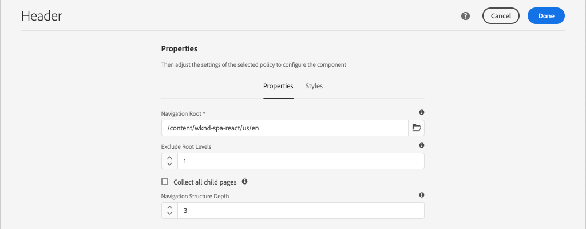
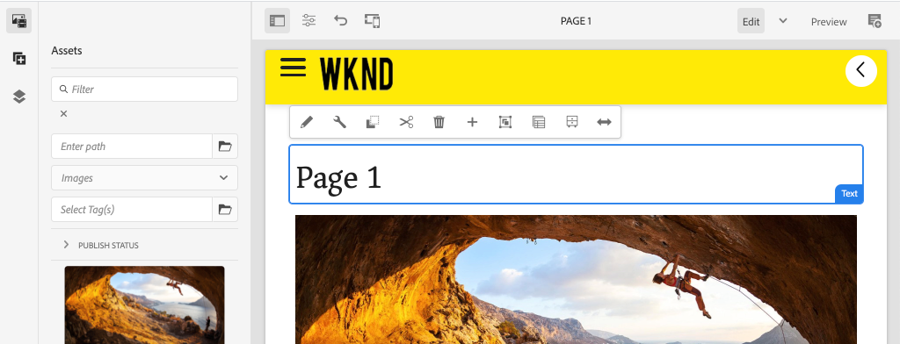
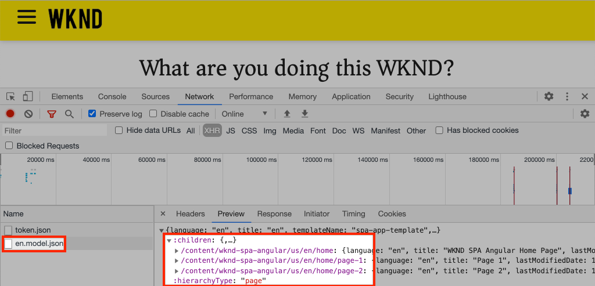

# 탐색 및 라우팅 추가 {#navigation-routing}

AEM Pages 및 SPA Editor SDK을 사용하여 SPA의 여러 보기가 지원되는 방법에 대해 알아봅니다. 동적 탐색은 Angular 경로를 사용하여 구현되고 기존 헤더 구성 요소에 추가됩니다.

## 목표

1. SPA 편집기를 사용할 때 사용할 수 있는 SPA 모델 라우팅 옵션을 이해합니다.
2. [Angular 라우팅](https://angular.io/guide/router)을 사용하여 SPA의 다양한 보기 사이를 탐색하는 방법을 알아봅니다.
3. AEM 페이지 계층 구조에 의해 실행되는 동적 탐색 구현

## 빌드할 내용

이 장에서는 기존 `Header` 구성 요소에 탐색 메뉴를 추가합니다. 탐색 메뉴는 AEM 페이지 계층 구조에 의해 구동되며 [탐색 핵심 구성 요소](https://experienceleague.adobe.com/docs/experience-manager-core-components/using/components/navigation.html)에서 제공하는 JSON 모델을 사용합니다.


## 사전 요구 사항

[로컬 개발 환경](overview.md#local-dev-environment)을 설정하는 데 필요한 도구 및 지침을 검토하십시오.

### 코드 가져오기

1. Git을 통해 이 자습서의 시작점을 다운로드하십시오.

   ```shell
   $ git clone git@github.com:adobe/aem-guides-wknd-spa.git
   $ cd aem-guides-wknd-spa
   $ git checkout Angular/navigation-routing-start
   ```

2. Maven을 사용하여 로컬 AEM 인스턴스에 코드 베이스를 배포합니다.

   ```shell
   $ mvn clean install -PautoInstallSinglePackage
   ```

   [AEM 6.x](overview.md#compatibility)을(를) 사용하는 경우 `classic` 프로필을 추가하십시오.

   ```shell
   $ mvn clean install -PautoInstallSinglePackage -Pclassic
   ```

3. 기존 [WKND 참조 사이트](https://github.com/adobe/aem-guides-wknd/releases/latest)에 대해 완료된 패키지를 설치합니다. [WKND 참조 사이트](https://github.com/adobe/aem-guides-wknd/releases/latest)에서 제공한 이미지를 WKND SPA에서 다시 사용합니다. 패키지는 [AEM의 패키지 관리자](http://localhost:4502/crx/packmgr/index.jsp)를 사용하여 설치할 수 있습니다.

   

[GitHub](https://github.com/adobe/aem-guides-wknd-spa/tree/Angular/navigation-routing-solution)에서 완성된 코드를 항상 보거나 `Angular/navigation-routing-solution` 분기로 전환하여 로컬에서 코드를 확인할 수 있습니다.

## HeaderComponent 업데이트 검사 {#inspect-header}

이전 장에서는 `HeaderComponent` 구성 요소가 `app.component.html`을(를) 통해 포함된 순수 Angular 구성 요소로 추가되었습니다. 이 장에서는 `HeaderComponent` 구성 요소가 앱에서 제거되고 [템플릿 편집기](https://experienceleague.adobe.com/docs/experience-manager-learn/sites/page-authoring/template-editor-feature-video-use.html?lang=ko)를 통해 추가됩니다. 이렇게 하면 사용자가 AEM 내에서 `HeaderComponent`의 탐색 메뉴를 구성할 수 있습니다.

>[!NOTE]
>
> 이 장을 시작하기 위해 코드 베이스에 여러 개의 CSS 및 JavaScript 업데이트가 이미 수행되었습니다. 핵심 개념에 중점을 두기 위해 코드 변경 사항의 **모두**&#x200B;에 대해서는 다루지 않습니다. 전체 변경 내용을 [여기](https://github.com/adobe/aem-guides-wknd-spa/compare/Angular/map-components-solution...Angular/navigation-routing-start)에서 볼 수 있습니다.

1. 선택한 IDE에서 이 장에 대한 SPA 스타터 프로젝트를 엽니다.
2. `ui.frontend` 모듈 아래에서 `ui.frontend/src/app/components/header/header.component.ts`의 `header.component.ts` 파일을 검사합니다.

   구성 요소를 AEM 구성 요소 `wknd-spa-angular/components/header`에 매핑할 수 있도록 `HeaderEditConfig` 및 `MapTo`을(를) 추가하는 등 여러 업데이트가 수행되었습니다.

   ```js
   /* header.component.ts */
   ...
   const HeaderEditConfig = {
       ...
   };
   
   @Component({
   selector: 'app-header',
   templateUrl: './header.component.html',
   styleUrls: ['./header.component.scss']
   })
   export class HeaderComponent implements OnInit {
   @Input() items: object[];
       ...
   }
   ...
   MapTo('wknd-spa-angular/components/header')(withRouter(Header), HeaderEditConfig);
   ```

   `items`에 대한 `@Input()` 주석을 메모하십시오. `items`에는 AEM에서 전달된 탐색 개체 배열이 포함됩니다.

3. `ui.apps` 모듈에서 AEM `Header` 구성 요소의 구성 요소 정의를 검사합니다. `ui.apps/src/main/content/jcr_root/apps/wknd-spa-angular/components/header/.content.xml`:

   ```xml
   <?xml version="1.0" encoding="UTF-8"?>
   <jcr:root xmlns:sling="http://sling.apache.org/jcr/sling/1.0" xmlns:cq="http://www.day.com/jcr/cq/1.0"
       xmlns:jcr="http://www.jcp.org/jcr/1.0"
       jcr:primaryType="cq:Component"
       jcr:title="Header"
       sling:resourceSuperType="wknd-spa-angular/components/navigation"
       componentGroup="WKND SPA Angular - Structure"/>
   ```

   AEM `Header` 구성 요소는 `sling:resourceSuperType` 속성을 통해 [탐색 핵심 구성 요소](https://experienceleague.adobe.com/docs/experience-manager-core-components/using/components/navigation.html)의 모든 기능을 상속합니다.

## SPA 템플릿에 HeaderComponent 추가 {#add-header-template}

1. 브라우저를 열고 AEM([http://localhost:4502/](http://localhost:4502/))에 로그인합니다. 시작 코드 베이스를 이미 배포해야 합니다.
2. **[!UICONTROL SPA 페이지 템플릿]**(으)로 이동합니다. [http://localhost:4502/editor.html/conf/wknd-spa-angular/settings/wcm/templates/spa-page-template/structure.html](http://localhost:4502/editor.html/conf/wknd-spa-angular/settings/wcm/templates/spa-page-template/structure.html).
3. 가장 바깥쪽의 **[!UICONTROL 루트 레이아웃 컨테이너]**&#x200B;를 선택하고 **[!UICONTROL 정책]** 아이콘을 클릭합니다. 작성을 위해 잠기지 않은 **[!UICONTROL 레이아웃 컨테이너]**&#x200B;를 선택하려면 **not**&#x200B;에 주의하십시오.

   

4. 현재 정책을 복사하고 이름이 **[!UICONTROL SPA 구조]**&#x200B;인 새 정책을 만드십시오.

   

   **[!UICONTROL 허용된 구성 요소]** > **[!UICONTROL 일반]** > **[!UICONTROL 레이아웃 컨테이너]** 구성 요소를 선택합니다.

   **[!UICONTROL 허용된 구성 요소]** > **[!UICONTROL WKND SPA ANGULAR - 구조]** > **[!UICONTROL 헤더]** 구성 요소를 선택합니다.

   

   **[!UICONTROL 허용된 구성 요소]** > **[!UICONTROL WKND SPA ANGULAR - 콘텐츠]**&#x200B;에서 **[!UICONTROL 이미지]** 및 **[!UICONTROL 텍스트]** 구성 요소를 선택합니다. 총 4개의 구성 요소를 선택해야 합니다.

   **[!UICONTROL 완료]**&#x200B;를 클릭하여 변경 내용을 저장합니다.

5. 페이지를 **새로 고침**&#x200B;합니다. 잠기지 않은 **[!UICONTROL 레이아웃 컨테이너]** 위에 **[!UICONTROL Header]** 구성 요소 추가:

   

6. **[!UICONTROL Header]** 구성 요소를 선택하고 **정책** 아이콘을 클릭하여 정책을 편집합니다.

   

7. **&quot;WKND SPA 헤더&quot;**&#x200B;의 **[!UICONTROL 정책 제목]**&#x200B;을 사용하여 새 정책을 만듭니다.

   **[!UICONTROL 속성]**&#x200B;에서:

   * **[!UICONTROL 탐색 루트]**&#x200B;을(를) `/content/wknd-spa-angular/us/en`(으)로 설정합니다.
   * **[!UICONTROL 루트 수준 제외]**&#x200B;를 **1**(으)로 설정합니다.
   * **[!UICONTROL 모든 하위 페이지 수집]**&#x200B;을 선택 취소합니다.
   * **[!UICONTROL 탐색 구조 깊이]**&#x200B;을(를) **3**(으)로 설정합니다.

   

   `/content/wknd-spa-angular/us/en` 아래에 있는 탐색 수준을 수집합니다.

8. 변경 내용을 저장하면 템플릿의 일부로 채워진 `Header`이(가) 표시됩니다.

   

## 하위 페이지 만들기

그런 다음 SPA에서 다양한 보기 역할을 할 AEM에서 추가 페이지를 만듭니다. 또한 AEM에서 제공하는 JSON 모델의 계층 구조도 검사할 것입니다.

1. **사이트** 콘솔로 이동합니다. [http://localhost:4502/sites.html/content/wknd-spa-angular/us/en/home](http://localhost:4502/sites.html/content/wknd-spa-angular/us/en/home). **WKND SPA Angular 홈 페이지**&#x200B;를 선택하고 **[!UICONTROL 만들기]** > **[!UICONTROL 페이지]**&#x200B;를 클릭합니다.

   

2. **[!UICONTROL 템플릿]**&#x200B;에서 **[!UICONTROL SPA 페이지]**&#x200B;을(를) 선택합니다. **[!UICONTROL 속성]**&#x200B;에서 **[!UICONTROL 제목]** 및 **&quot;페이지-1&quot;**&#x200B;에 대한 **&quot;페이지 1&quot;**&#x200B;을(를) 이름으로 입력하십시오.

   

   **[!UICONTROL 만들기]**&#x200B;를 클릭하고 대화 상자 팝업에서 **[!UICONTROL 열기]**&#x200B;를 클릭하여 AEM SPA 편집기에서 페이지를 엽니다.

3. 새 **[!UICONTROL Text]** 구성 요소를 기본 **[!UICONTROL 레이아웃 컨테이너]**&#x200B;에 추가합니다. 구성 요소를 편집하고 RTE 및 **H1** 요소를 사용하여 다음 텍스트를 입력하십시오. **&quot;페이지 1&quot;**(단락 요소를 변경하려면 전체 화면 모드로 전환해야 함)

   

   이미지와 같은 콘텐츠를 자유롭게 추가할 수 있습니다.

4. AEM Sites 콘솔로 돌아가서 위의 단계를 반복하여 **&quot;Page 2&quot;**(이)라는 두 번째 페이지를 **Page 1**&#x200B;의 형제 페이지로 만듭니다. 콘텐츠를 쉽게 식별할 수 있도록 **페이지 2**&#x200B;에 콘텐츠를 추가하십시오.
5. 마지막으로 세 번째 페이지인 **&quot;페이지 3&quot;**&#x200B;을(를) **페이지 2**&#x200B;의 **자식**(으)로 만듭니다. 사이트 계층 구조가 완료되면 다음과 같이 표시됩니다.

   

6. 새 탭에서 AEM에서 제공하는 JSON 모델 API를 엽니다. [http://localhost:4502/content/wknd-spa-angular/us/en.model.json](http://localhost:4502/content/wknd-spa-angular/us/en.model.json). SPA가 처음 로드될 때 이 JSON 콘텐츠가 요청됩니다. 외부 구조는 다음과 같습니다.

   ```json
   {
   "language": "en",
   "title": "en",
   "templateName": "spa-app-template",
   "designPath": "/libs/settings/wcm/designs/default",
   "cssClassNames": "spa page basicpage",
   ":type": "wknd-spa-angular/components/spa",
   ":items": {},
   ":itemsOrder": [],
   ":hierarchyType": "page",
   ":path": "/content/wknd-spa-angular/us/en",
   ":children": {
       "/content/wknd-spa-angular/us/en/home": {},
       "/content/wknd-spa-angular/us/en/home/page-1": {},
       "/content/wknd-spa-angular/us/en/home/page-2": {},
       "/content/wknd-spa-angular/us/en/home/page-2/page-3": {}
       }
   }
   ```

   `:children`에서 만들어진 각 페이지에 대한 항목이 표시됩니다. 모든 페이지의 컨텐츠는 이 초기 JSON 요청에 있습니다. 탐색 라우팅이 구현되면 SPA의 후속 보기가 빠르게 로드됩니다. 콘텐츠는 이미 클라이언트측에서 사용할 수 있기 때문입니다.

   초기 JSON 요청에서 SPA의 **ALL** 콘텐츠를 로드하는 것은 좋지 않습니다. 이렇게 하면 초기 페이지 로드 속도가 느려질 수 있습니다. 다음으로 페이지 계층 깊이가 수집되는 방식을 살펴보겠습니다.

7. [http://localhost:4502/editor.html/conf/wknd-spa-angular/settings/wcm/templates/spa-app-template/structure.html](http://localhost:4502/editor.html/conf/wknd-spa-angular/settings/wcm/templates/spa-app-template/structure.html)에서 **SPA 루트** 템플릿으로 이동합니다.

   **[!UICONTROL 페이지 속성 메뉴]** > **[!UICONTROL 페이지 정책]**&#x200B;을 클릭합니다.

   

8. **SPA 루트** 템플릿에는 수집된 JSON 콘텐츠를 제어하는 추가 **[!UICONTROL 계층 구조]** 탭이 있습니다. **[!UICONTROL 구조 깊이]**&#x200B;은(는) 사이트 계층 구조에서 **루트** 아래에 있는 하위 페이지를 수집하는 정도를 결정합니다. **[!UICONTROL 구조 패턴]** 필드를 사용하여 정규 표현식에 따라 추가 페이지를 필터링할 수도 있습니다.

   **[!UICONTROL 구조 깊이]**&#x200B;을(를) **&quot;2&quot;**(으)로 업데이트:

   

   정책에 대한 변경 내용을 저장하려면 **[!UICONTROL 완료]**&#x200B;를 클릭합니다.

9. JSON 모델 [http://localhost:4502/content/wknd-spa-angular/us/en.model.json](http://localhost:4502/content/wknd-spa-angular/us/en.model.json)을(를) 다시 엽니다.

   ```json
   {
   "language": "en",
   "title": "en",
   "templateName": "spa-app-template",
   "designPath": "/libs/settings/wcm/designs/default",
   "cssClassNames": "spa page basicpage",
   ":type": "wknd-spa-angular/components/spa",
   ":items": {},
   ":itemsOrder": [],
   ":hierarchyType": "page",
   ":path": "/content/wknd-spa-angular/us/en",
   ":children": {
       "/content/wknd-spa-angular/us/en/home": {},
       "/content/wknd-spa-angular/us/en/home/page-1": {},
       "/content/wknd-spa-angular/us/en/home/page-2": {}
       }
   }
   ```

   **페이지 3** 경로가 초기 JSON 모델에서 제거되었습니다. `/content/wknd-spa-angular/us/en/home/page-2/page-3`.

   나중에 AEM SPA Editor SDK 가 추가 콘텐츠를 동적으로 로드하는 방법에 대해 알아보겠습니다.

## 탐색 구현

그런 다음 새 `NavigationComponent`을(를) 사용하여 탐색 메뉴를 구현합니다. `header.component.html`에서 직접 코드를 추가할 수 있지만 큰 구성 요소를 사용하지 않는 것이 좋습니다. 대신 나중에 다시 사용할 수 있는 `NavigationComponent`을(를) 구현하십시오.

1. [http://localhost:4502/content/wknd-spa-angular/us/en.model.json](http://localhost:4502/content/wknd-spa-angular/us/en.model.json)에서 AEM `Header` 구성 요소에 의해 노출된 JSON을 검토하십시오.

   ```json
   ...
   "header": {
       "items": [
       {
       "level": 0,
       "active": true,
       "path": "/content/wknd-spa-angular/us/en/home",
       "description": null,
       "url": "/content/wknd-spa-angular/us/en/home.html",
       "lastModified": 1589062597083,
       "title": "WKND SPA Angular Home Page",
       "children": [
               {
               "children": [],
               "level": 1,
               "active": false,
               "path": "/content/wknd-spa-angular/us/en/home/page-1",
               "description": null,
               "url": "/content/wknd-spa-angular/us/en/home/page-1.html",
               "lastModified": 1589429385100,
               "title": "Page 1"
               },
               {
               "level": 1,
               "active": true,
               "path": "/content/wknd-spa-angular/us/en/home/page-2",
               "description": null,
               "url": "/content/wknd-spa-angular/us/en/home/page-2.html",
               "lastModified": 1589429603507,
               "title": "Page 2",
               "children": [
                   {
                   "children": [],
                   "level": 2,
                   "active": false,
                   "path": "/content/wknd-spa-angular/us/en/home/page-2/page-3",
                   "description": null,
                   "url": "/content/wknd-spa-angular/us/en/home/page-2/page-3.html",
                   "lastModified": 1589430413831,
                   "title": "Page 3"
                   }
               ],
               }
           ]
           }
       ],
   ":type": "wknd-spa-angular/components/header"
   ```

   AEM 페이지의 계층적 특성은 탐색 메뉴를 채우는 데 사용할 수 있는 JSON에서 모델링됩니다. `Header` 구성 요소가 [탐색 핵심 구성 요소](https://www.aemcomponents.dev/content/core-components-examples/library/core-structure/navigation.html)의 모든 기능을 상속하고 JSON을 통해 노출된 콘텐츠가 자동으로 Angular `@Input` 주석에 매핑된다는 점을 상기하십시오.

2. 새 터미널 창을 열고 SPA 프로젝트의 `ui.frontend` 폴더로 이동합니다. Angular CLI 도구를 사용하여 새 `NavigationComponent`을(를) 만듭니다.

   ```shell
   $ cd ui.frontend
   $ ng generate component components/navigation
   CREATE src/app/components/navigation/navigation.component.scss (0 bytes)
   CREATE src/app/components/navigation/navigation.component.html (25 bytes)
   CREATE src/app/components/navigation/navigation.component.spec.ts (656 bytes)
   CREATE src/app/components/navigation/navigation.component.ts (286 bytes)
   UPDATE src/app/app.module.ts (2032 bytes)
   ```

3. 그런 다음 새로 만든 `components/navigation` 디렉터리에서 Angular CLI를 사용하여 이름이 `NavigationLink`인 클래스를 만듭니다.

   ```shell
   $ cd src/app/components/navigation/
   $ ng generate class NavigationLink
   CREATE src/app/components/navigation/navigation-link.spec.ts (187 bytes)
   CREATE src/app/components/navigation/navigation-link.ts (32 bytes)
   ```

4. 선택한 IDE로 돌아가서 `/src/app/components/navigation/navigation-link.ts`의 `navigation-link.ts`에서 파일을 엽니다.

   

5. `navigation-link.ts`을(를) 다음으로 채우기:

   ```js
   export class NavigationLink {
   
       title: string;
       path: string;
       url: string;
       level: number;
       children: NavigationLink[];
       active: boolean;
   
       constructor(data) {
           this.path = data.path;
           this.title = data.title;
           this.url = data.url;
           this.level = data.level;
           this.active = data.active;
           this.children = data.children.map( item => {
               return new NavigationLink(item);
           });
       }
   }
   ```

   개별 탐색 링크를 나타내는 간단한 클래스입니다. 클래스 생성자에서 `data`은(는) AEM에서 전달된 JSON 개체여야 합니다. 이 클래스는 탐색 구조를 쉽게 채우기 위해 `NavigationComponent`과(와) `HeaderComponent` 모두에서 사용됩니다.

   데이터 변환은 수행되지 않습니다. 이 클래스는 주로 JSON 모델을 강하게 입력하도록 만들어집니다. `this.children`이(가) `NavigationLink[]`(으)로 형식화되고 생성자가 `children` 배열의 각 항목에 대해 새 `NavigationLink` 개체를 재귀적으로 만듭니다. `Header`에 대한 JSON 모델이 계층적이라는 점을 상기하십시오.

6. `navigation-link.spec.ts` 파일을 엽니다. `NavigationLink` 클래스의 테스트 파일입니다. 다음과 같이 업데이트합니다.

   ```js
   import { NavigationLink } from './navigation-link';
   
   describe('NavigationLink', () => {
       it('should create an instance', () => {
           const data = {
               children: [],
               level: 1,
               active: false,
               path: '/content/wknd-spa-angular/us/en/home/page-1',
               description: null,
               url: '/content/wknd-spa-angular/us/en/home/page-1.html',
               lastModified: 1589429385100,
               title: 'Page 1'
           };
           expect(new NavigationLink(data)).toBeTruthy();
       });
   });
   ```

   `const data`은(는) 단일 링크에 대해 이전에 검사한 동일한 JSON 모델을 따릅니다. 이는 강력한 단위 테스트와는 거리가 멀지만 `NavigationLink`의 생성자를 테스트하는 것만으로도 충분합니다.

7. `navigation.component.ts` 파일을 엽니다. 다음과 같이 업데이트합니다.

   ```js
   import { Component, OnInit, Input } from '@angular/core';
   import { NavigationLink } from './navigation-link';
   
   @Component({
   selector: 'app-navigation',
   templateUrl: './navigation.component.html',
   styleUrls: ['./navigation.component.scss']
   })
   export class NavigationComponent implements OnInit {
   
       @Input() items: object[];
   
       constructor() { }
   
       get navigationLinks(): NavigationLink[] {
   
           if (this.items && this.items.length > 0) {
               return this.items.map(item => {
                   return new NavigationLink(item);
               });
           }
   
           return null;
       }
   
       ngOnInit() {}
   
   }
   ```

   `NavigationComponent`에는 AEM의 JSON 모델인 이름이 `items`인 `object[]`이(가) 필요합니다. 이 클래스는 `NavigationLink` 개체의 배열을 반환하는 단일 메서드 `get navigationLinks()`을(를) 노출합니다.

8. 파일 `navigation.component.html`을(를) 열고 다음 내용으로 업데이트합니다.

   ```html
   <ul *ngIf="navigationLinks && navigationLinks.length > 0" class="navigation__group">
       <ng-container *ngTemplateOutlet="recursiveListTmpl; context:{ links: navigationLinks }"></ng-container>
   </ul>
   ```

   초기 `<ul>`을(를) 생성하고 `navigation.component.ts`에서 `get navigationLinks()` 메서드를 호출합니다. `<ng-container>`은(는) 템플릿 `recursiveListTmpl`을(를) 호출하여 변수 `links`(으)로 `navigationLinks`에 전달하는 데 사용됩니다.

   `recursiveListTmpl`을(를) 다음으로 추가:

   ```html
   <ng-template #recursiveListTmpl let-links="links">
       <li *ngFor="let link of links" class="{{'navigation__item navigation__item--' + link.level}}">
           <a [routerLink]="link.url" class="navigation__item-link" [title]="link.title" [attr.aria-current]="link.active">
               {{link.title}}
           </a>
           <ul *ngIf="link.children && link.children.length > 0">
               <ng-container *ngTemplateOutlet="recursiveListTmpl; context:{ links: link.children }"></ng-container>
           </ul>
       </li>
   </ng-template>
   ```

   여기에서는 탐색 링크에 대한 나머지 렌더링이 구현됩니다. `link` 변수는 `NavigationLink` 형식이며 해당 클래스에서 만든 모든 메서드/속성을 사용할 수 있습니다. [`[routerLink]`](https://angular.io/api/router/RouterLink)이(가) 일반적인 `href` 특성 대신 사용됩니다. 이렇게 하면 전체 페이지를 새로 고치지 않고도 앱의 특정 경로에 연결할 수 있습니다.

   현재 `link`에 비어 있지 않은 `children` 배열이 있는 경우 다른 `<ul>`을(를) 만들어 탐색의 재귀 부분도 구현합니다.

9. `RouterTestingModule`에 대한 지원을 추가하려면 `navigation.component.spec.ts`을(를) 업데이트하십시오.

   ```diff
    ...
   + import { RouterTestingModule } from '@angular/router/testing';
    ...
    beforeEach(async(() => {
       TestBed.configureTestingModule({
   +   imports: [ RouterTestingModule ],
       declarations: [ NavigationComponent ]
       })
       .compileComponents();
    }));
    ...
   ```

   구성 요소가 `[routerLink]`을(를) 사용하므로 `RouterTestingModule`을(를) 추가해야 합니다.

10. `navigation.component.scss`을(를) 업데이트하여 `NavigationComponent`에 일부 기본 스타일을 추가하십시오.

   ```scss
   @import "~src/styles/variables";
   
   $link-color: $black;
   $link-hover-color: $white;
   $link-background: $black;
   
   :host-context {
       display: block;
       width: 100%;
   }
   
   .navigation__item {
       list-style: none;
   }
   
   .navigation__item-link {
       color: $link-color;
       font-size: $font-size-large;
       text-transform: uppercase;
       padding: $gutter-padding;
       display: flex;
       border-bottom: 1px solid $gray;
   
       &:hover {
           background: $link-background;
           color: $link-hover-color;
       }
   
   }
   ```

## 헤더 구성 요소 업데이트

`NavigationComponent`이(가) 구현되었으므로 참조하려면 `HeaderComponent`을(를) 업데이트해야 합니다.

1. 터미널을 열고 SPA 프로젝트 내의 `ui.frontend` 폴더로 이동합니다. **Webpack 개발 서버**&#x200B;를 시작합니다.

   ```shell
   $ npm start
   ```

2. 브라우저 탭을 열고 [http://localhost:4200/](http://localhost:4200/)&#x200B;(으)로 이동합니다.

   **Webpack 개발 서버**&#x200B;는 AEM(`ui.frontend/proxy.conf.json`)의 로컬 인스턴스에서 JSON 모델을 프록시하도록 구성해야 합니다. 이렇게 하면 자습서의 앞부분에서 AEM에서 만든 콘텐츠에 대해 직접 코드를 작성할 수 있습니다.

   

   현재 `HeaderComponent`에 이미 구현된 메뉴 전환 기능이 있습니다. 그런 다음 탐색 구성 요소를 추가합니다.

3. 선택한 IDE로 돌아가서 `ui.frontend/src/app/components/header/header.component.ts`에서 `header.component.ts` 파일을 엽니다.
4. `setHomePage()` 메서드를 업데이트하여 하드 코딩된 문자열을 제거하고 AEM 구성 요소에서 전달된 동적 prop을 사용합니다.

   ```js
   /* header.component.ts */
   import { NavigationLink } from '../navigation/navigation-link';
   ...
    setHomePage() {
       if (this.hasNavigation) {
           const rootNavigationLink: NavigationLink = new NavigationLink(this.items[0]);
           this.isHome = rootNavigationLink.path === this.route.snapshot.data.path;
           this.homePageUrl = rootNavigationLink.url;
       }
   }
   ...
   ```

   AEM에서 전달된 탐색 JSON 모델의 루트인 `items[0]`을(를) 기반으로 `NavigationLink`의 새 인스턴스가 만들어집니다. `this.route.snapshot.data.path`이(가) 현재 Angular 경로의 경로를 반환합니다. 이 값은 현재 경로가 **홈 페이지**&#x200B;인지 확인하는 데 사용됩니다. `this.homePageUrl`은(는) **로고**&#x200B;에서 앵커 링크를 채우는 데 사용됩니다.

5. `header.component.html`을(를) 열고 탐색에 대한 정적 자리 표시자를 새로 만든 `NavigationComponent`에 대한 참조로 바꿉니다.

   ```diff
       <div class="header-navigation">
           <div class="navigation">
   -            Navigation Placeholder
   +           <app-navigation [items]="items"></app-navigation>
           </div>
       </div>
   ```

   `[items]=items` 특성은 `HeaderComponent`에서 `NavigationComponent`(으)로 `@Input() items`을(를) 전달하여 탐색을 빌드합니다.

6. `header.component.spec.ts`을(를) 열고 `NavigationComponent`에 대한 선언을 추가합니다.

   ```diff
       /* header.component.spect.ts */
   +   import { NavigationComponent } from '../navigation/navigation.component';
   
       describe('HeaderComponent', () => {
       let component: HeaderComponent;
       let fixture: ComponentFixture<HeaderComponent>;
   
       beforeEach(async(() => {
           TestBed.configureTestingModule({
           imports: [ RouterTestingModule ],
   +       declarations: [ HeaderComponent, NavigationComponent ]
           })
           .compileComponents();
       }));
   ```

   이제 `NavigationComponent`이(가) `HeaderComponent`의 일부로 사용되므로 테스트 베드의 일부로 선언해야 합니다.

7. 열려 있는 파일에 변경 내용을 저장하고 **Webpack 개발 서버**&#x200B;로 돌아갑니다. [http://localhost:4200/](http://localhost:4200/)

   

   메뉴 전환을 클릭하여 탐색을 열면 채워진 탐색 링크가 표시됩니다. SPA의 다른 보기로 이동할 수 있습니다.

## SPA 라우팅 이해

탐색이 구현되었으므로 AEM에서 라우팅을 검사합니다.

1. IDE에서 `ui.frontend/src/app`에 있는 `app-routing.module.ts` 파일을 엽니다.

   ```js
   /* app-routing.module.ts */
   import { AemPageDataResolver, AemPageRouteReuseStrategy } from '@adobe/cq-angular-editable-components';
   import { NgModule } from '@angular/core';
   import { RouteReuseStrategy, RouterModule, Routes, UrlMatchResult, UrlSegment } from '@angular/router';
   import { PageComponent } from './components/page/page.component';
   
   export function AemPageMatcher(url: UrlSegment[]): UrlMatchResult {
       if (url.length) {
           return {
               consumed: url,
               posParams: {
                   path: url[url.length - 1]
               }
           };
       }
   }
   
   const routes: Routes = [
       {
           matcher: AemPageMatcher,
           component: PageComponent,
           resolve: {
               path: AemPageDataResolver
           }
       }
   ];
   @NgModule({
       imports: [RouterModule.forRoot(routes)],
       exports: [RouterModule],
       providers: [
           AemPageDataResolver,
           {
           provide: RouteReuseStrategy,
           useClass: AemPageRouteReuseStrategy
           }
       ]
   })
   export class AppRoutingModule {}
   ```

   `routes: Routes = [];` 배열은 Angular 구성 요소 매핑에 대한 경로 또는 탐색 경로를 정의합니다.

   `AemPageMatcher`은(는) 사용자 지정 Angular 라우터 [UrlMatcher](https://angular.io/api/router/UrlMatcher)로서, 이 Angular 애플리케이션의 일부인 AEM의 페이지와 &quot;유사&quot;하는 모든 항목을 찾습니다.

   `PageComponent`은(는) AEM의 페이지를 나타내는 Angular 구성 요소이며 일치하는 경로를 렌더링하는 데 사용됩니다. `PageComponent`은(는) 나중에 자습서에서 검토됩니다.

   AEM SPA Editor JS SDK에서 제공한 `AemPageDataResolver`은(는) AEM의 경로인 경로 URL(예: the.html 확장 포함)을 확장보다 작은 페이지 경로인 AEM의 리소스 경로로 변환하는 데 사용되는 사용자 지정 [Angular Router Resolver](https://angular.io/api/router/Resolve)입니다.

   예를 들어 `AemPageDataResolver`은(는) 경로의 URL `content/wknd-spa-angular/us/en/home.html`을(를) `/content/wknd-spa-angular/us/en/home`의 경로로 변환합니다. JSON 모델 API의 경로를 기반으로 페이지의 콘텐츠를 확인하는 데 사용됩니다.

   AEM SPA Editor JS SDK에서 제공하는 `AemPageRouteReuseStrategy`은(는) 경로 간 `PageComponent`의 재사용을 방지하는 사용자 지정 [RouteReuseStrategy](https://angular.io/api/router/RouteReuseStrategy)입니다. 그렇지 않으면 페이지 &quot;B&quot;로 이동할 때 페이지 &quot;A&quot;의 콘텐츠가 표시될 수 있습니다.

2. `ui.frontend/src/app/components/page/`에서 `page.component.ts` 파일을 엽니다.

   ```js
   ...
   export class PageComponent {
       items;
       itemsOrder;
       path;
   
       constructor(
           private route: ActivatedRoute,
           private modelManagerService: ModelManagerService
       ) {
           this.modelManagerService
           .getData({ path: this.route.snapshot.data.path })
           .then(data => {
               this.path = data[Constants.PATH_PROP];
               this.items = data[Constants.ITEMS_PROP];
               this.itemsOrder = data[Constants.ITEMS_ORDER_PROP];
           });
       }
   }
   ```

   `PageComponent`은(는) AEM에서 검색한 JSON을 처리하는 데 필요하며 경로를 렌더링하기 위한 Angular 구성 요소로 사용됩니다.

   Angular 라우터 모듈에서 제공하는 `ActivatedRoute`에는 이 Angular 페이지 구성 요소 인스턴스에 로드해야 하는 AEM 페이지의 JSON 콘텐츠를 나타내는 상태가 포함되어 있습니다.

   `ModelManagerService`, 경로를 기반으로 JSON 데이터를 가져오고 해당 데이터를 클래스 변수 `path`, `items`, `itemsOrder`에 매핑합니다. 그러면 [AEMPageComponent](https://www.npmjs.com/package/@adobe/cq-angular-editable-components#aempagecomponent.md)에 전달됩니다.

3. `ui.frontend/src/app/components/page/`에서 `page.component.html` 파일을 엽니다.

   ```html
   <aem-page 
       class="structure-page" 
       [attr.data-cq-page-path]="path" 
       [cqPath]="path" 
       [cqItems]="items" 
       [cqItemsOrder]="itemsOrder">
   </aem-page>
   ```

   `aem-page`에 [AEMPageComponent](https://www.npmjs.com/package/@adobe/cq-angular-editable-components#aempagecomponent.md)가 포함되어 있습니다. 변수 `path`, `items` 및 `itemsOrder`이(가) `AEMPageComponent`에 전달됩니다. 그런 다음 SPA 편집기 JavaScript SDK을 통해 제공된 `AemPageComponent`은(는) 이 데이터를 반복하고 [구성 요소 매핑 자습서](./map-components.md)에 표시된 대로 JSON 데이터를 기반으로 Angular 구성 요소를 동적으로 인스턴스화합니다.

   `PageComponent`은(는) 실제로 `AEMPageComponent`의 프록시이며 JSON 모델을 Angular 구성 요소에 올바르게 매핑하기 위한 대규모 작업을 수행하는 `AEMPageComponent`입니다.

## AEM에서 SPA 라우팅 검사

1. 터미널을 열고 **Webpack 개발 서버**&#x200B;가 시작되면 중지합니다. 프로젝트의 루트로 이동한 다음 Maven 기술을 사용하여 프로젝트를 AEM에 배포합니다.

   ```shell
   $ cd aem-guides-wknd-spa
   $ mvn clean install -PautoInstallSinglePackage
   ```

   >[!CAUTION]
   >
   > Angular 프로젝트에는 매우 엄격한 린팅 규칙이 활성화되어 있습니다. Maven 빌드가 실패하면 오류를 확인하고 나열된 파일에서 **Lint 오류가 있는지 확인하십시오.**. 링터에서 발견한 문제를 수정하고 Maven 명령을 다시 실행합니다.

2. AEM의 SPA 홈 페이지([http://localhost:4502/content/wknd-spa-angular/us/en/home.html](http://localhost:4502/content/wknd-spa-angular/us/en/home.html))로 이동하여 브라우저의 개발자 도구를 엽니다. 아래 스크린샷은 Google Chrome 브라우저에서 캡처됩니다.

   페이지를 새로 고치면 SPA 루트인 `/content/wknd-spa-angular/us/en.model.json`에 대한 XHR 요청이 표시됩니다. 자습서에서 이전에 만든 SPA 루트 템플릿에 대한 계층 구조 깊이 구성에 따라 하위 페이지가 세 개만 포함됩니다. 여기에는 **페이지 3**&#x200B;이(가) 포함되지 않습니다.

   

3. 개발자 도구를 연 상태에서 **페이지 3**(으)로 이동합니다.

   

   `/content/wknd-spa-angular/us/en/home/page-2/page-3.model.json`에 새 XHR 요청이 수행되었는지 확인합니다.

   

   AEM 모델 관리자는 **페이지 3** JSON 콘텐츠를 사용할 수 없다는 것을 이해하고 추가 XHR 요청을 자동으로 트리거합니다.

4. 다양한 탐색 링크를 사용하여 SPA를 계속 탐색합니다. 추가적인 XHR 요청이 수행되지 않으며 전체 페이지 새로 고침이 발생하지 않는지 확인합니다. 이렇게 하면 최종 사용자에게 SPA가 신속하게 제공되고 AEM에 대한 불필요한 요청이 줄어듭니다.

   

5. [http://localhost:4502/content/wknd-spa-angular/us/en/home/page-2.html](http://localhost:4502/content/wknd-spa-angular/us/en/home/page-2.html)&#x200B;(으)로 직접 이동하여 딥링크를 실험해 보십시오. 브라우저의 뒤로 단추가 계속 작동하는지 확인하십시오.

## 축하합니다! {#congratulations}

축하합니다. SPA 편집기 SDK을 사용하여 AEM 페이지에 매핑하여 SPA의 여러 보기를 지원하는 방법에 대해 알아보았습니다. 동적 탐색은 Angular 라우팅을 사용하여 구현되었으며 `Header` 구성 요소에 추가되었습니다.

[GitHub](https://github.com/adobe/aem-guides-wknd-spa/tree/Angular/navigation-routing-solution)에서 완성된 코드를 항상 보거나 `Angular/navigation-routing-solution` 분기로 전환하여 로컬에서 코드를 확인할 수 있습니다.

### 다음 단계 {#next-steps}

[사용자 지정 구성 요소 만들기](custom-component.md) - AEM SPA 편집기에서 사용할 사용자 지정 구성 요소를 만드는 방법에 대해 알아봅니다. 작성자 대화 상자 및 Sling 모델을 개발하여 JSON 모델을 확장하여 사용자 지정 구성 요소를 채우는 방법에 대해 알아봅니다.
