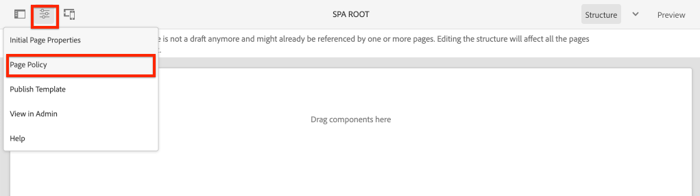

# 탐색 및 라우팅 추가 {#navigation-routing}

AEM 페이지 및 SPA Editor SDK를 사용하여 SPA에서 여러 개의 보기가 지원되는 방법을 알아봅니다. 동적 탐색은 Angular 경로를 사용하여 구현되고 기존 헤더 구성 요소에 추가됩니다.

## 목표

1. SPA 편집기를 사용할 때 사용할 수 있는 SPA 모델 라우팅 옵션을 이해합니다.
2. 사용 방법 알아보기 [Angular 라우팅](https://angular.io/guide/router) SPA의 다른 보기 사이를 탐색합니다.
3. AEM 페이지 계층 구조에 의해 구동되는 동적 탐색을 구현합니다.

## 빌드할 내용

이 장은 탐색 메뉴를 기존 `Header` 구성 요소. 탐색 메뉴는 AEM 페이지 계층 구조에 의해 제어되며, [탐색 코어 구성 요소](https://experienceleague.adobe.com/docs/experience-manager-core-components/using/components/navigation.html).


## 전제 조건

설정에 필요한 도구 및 지침을 검토합니다. [로컬 개발 환경](overview.md#local-dev-environment).

### 코드 가져오기

1. Git을 통해 이 자습서의 시작점을 다운로드합니다.

   ```shell
   $ git clone git@github.com:adobe/aem-guides-wknd-spa.git
   $ cd aem-guides-wknd-spa
   $ git checkout Angular/navigation-routing-start
   ```

2. Maven을 사용하여 로컬 AEM 인스턴스에 코드 베이스를 배포합니다.

   ```shell
   $ mvn clean install -PautoInstallSinglePackage
   ```

   를 사용하는 경우 [AEM 6.x](overview.md#compatibility) 추가 `classic` 프로필:

   ```shell
   $ mvn clean install -PautoInstallSinglePackage -Pclassic
   ```

3. 기존 패키지에 대해 완료된 패키지 설치 [WKND 참조 사이트](https://github.com/adobe/aem-guides-wknd/releases/latest). 에서 제공하는 이미지 [WKND 참조 사이트](https://github.com/adobe/aem-guides-wknd/releases/latest) 는 WKND SPA에서 다시 사용됩니다. 패키지는 [AEM 패키지 관리자](http://localhost:4502/crx/packmgr/index.jsp).

   

항상 완료된 코드를 [GitHub](https://github.com/adobe/aem-guides-wknd-spa/tree/Angular/navigation-routing-solution) 또는 분기로 전환하여 로컬로 코드를 체크 아웃합니다 `Angular/navigation-routing-solution`.

## Inspect HeaderComponent 업데이트 {#inspect-header}

이전 장에서는 `HeaderComponent` 구성 요소는 를 통해 포함된 순수 Angular 구성 요소로 추가됩니다. `app.component.html`. 이 장에서는 `HeaderComponent` 구성 요소는 앱에서 제거되고 를 통해 추가됩니다. [템플릿 편집기](https://experienceleague.adobe.com/docs/experience-manager-learn/sites/page-authoring/template-editor-feature-video-use.html). 이를 통해 사용자가 `HeaderComponent` AEM 내에서 사용할 수 있습니다.

>[!NOTE]
>
> 이 장을 시작하기 위해 코드 베이스에 이미 여러 CSS 및 JavaScript 업데이트가 있습니다. 핵심 개념에 중점을 두려면 다음을 수행하지 마십시오 **모두** 코드 변경 사항에 대해 설명합니다. 전체 변경 사항을 볼 수 있습니다 [여기](https://github.com/adobe/aem-guides-wknd-spa/compare/Angular/map-components-solution...Angular/navigation-routing-start).

1. 선택한 IDE에서 이 장의 SPA 시작 프로젝트를 엽니다.
2. 아래 `ui.frontend` 모듈이 파일을 검사합니다. `header.component.ts` at: `ui.frontend/src/app/components/header/header.component.ts`.

   다음을 포함한 몇 가지 업데이트가 수행되었습니다. `HeaderEditConfig` 그리고 `MapTo` 구성 요소를 AEM 구성 요소에 매핑하려면 다음을 수행하십시오 `wknd-spa-angular/components/header`.

   ```js
   /* header.component.ts */
   ...
   const HeaderEditConfig = {
       ...
   };
   
   @Component({
   selector: 'app-header',
   templateUrl: './header.component.html',
   styleUrls: ['./header.component.scss']
   })
   export class HeaderComponent implements OnInit {
   @Input() items: object[];
       ...
   }
   ...
   MapTo('wknd-spa-angular/components/header')(withRouter(Header), HeaderEditConfig);
   ```

   참고 사항 `@Input()` 주석 `items`. `items` 에는 AEM에서 전달된 탐색 개체 배열이 포함되어 있습니다.

3. 에서 `ui.apps` 모듈이 AEM의 구성 요소 정의를 검사합니다. `Header` 구성 요소: `ui.apps/src/main/content/jcr_root/apps/wknd-spa-angular/components/header/.content.xml`:

   ```xml
   <?xml version="1.0" encoding="UTF-8"?>
   <jcr:root xmlns:sling="http://sling.apache.org/jcr/sling/1.0" xmlns:cq="http://www.day.com/jcr/cq/1.0"
       xmlns:jcr="http://www.jcp.org/jcr/1.0"
       jcr:primaryType="cq:Component"
       jcr:title="Header"
       sling:resourceSuperType="wknd-spa-angular/components/navigation"
       componentGroup="WKND SPA Angular - Structure"/>
   ```

   AEM `Header` 구성 요소는 [탐색 코어 구성 요소](https://experienceleague.adobe.com/docs/experience-manager-core-components/using/components/navigation.html) 사용 `sling:resourceSuperType` 속성을 사용합니다.

## SPA 템플릿에 HeaderComponent 추가 {#add-header-template}

1. 브라우저를 열고 AEM에 로그인합니다. [http://localhost:4502/](http://localhost:4502/). 시작 코드 베이스를 이미 배포해야 합니다.
2. 로 이동합니다 **[!UICONTROL SPA 페이지 템플릿]**: [http://localhost:4502/editor.html/conf/wknd-spa-angular/settings/wcm/templates/spa-page-template/structure.html](http://localhost:4502/editor.html/conf/wknd-spa-angular/settings/wcm/templates/spa-page-template/structure.html).
3. 가장 바깥쪽을 선택합니다 **[!UICONTROL 루트 레이아웃 컨테이너]** 및 **[!UICONTROL 정책]** 아이콘. 조심해 **not** 을(를) 선택하려면 **[!UICONTROL 레이아웃 컨테이너]** 작성을 위해 잠금이 해제되었습니다.

   

4. 현재 정책을 복사하고 새 정책을 만듭니다. **[!UICONTROL SPA 구조]**:

   

   아래 **[!UICONTROL 허용된 구성 요소]** > **[!UICONTROL 일반]** > 를 선택합니다. **[!UICONTROL 레이아웃 컨테이너]** 구성 요소.

   아래 **[!UICONTROL 허용된 구성 요소]** > **[!UICONTROL WKND SPA ANGULAR - 구조]** > 를 선택합니다. **[!UICONTROL Header]** 구성 요소:

   

   아래 **[!UICONTROL 허용된 구성 요소]** > **[!UICONTROL WKND SPA ANGULAR - 컨텐츠]** > 를 선택합니다. **[!UICONTROL 이미지]** 및 **[!UICONTROL 텍스트]** 구성 요소. 총 4개의 구성 요소가 선택되어 있어야 합니다.

   클릭 **[!UICONTROL 완료]** 변경 사항을 저장하려면 을 클릭합니다.

5. **페이지를 새로 고칩니다.** 추가 **[!UICONTROL Header]** 잠기지 않은 구성 요소 위에 있는 구성 요소 **[!UICONTROL 레이아웃 컨테이너]**:

   

6. 을(를) 선택합니다 **[!UICONTROL Header]** 구성 요소를 클릭한 다음 **정책** 아이콘을 클릭하여 정책을 편집합니다.

   

7. 를 사용하여 새 정책 만들기 **[!UICONTROL 정책 제목]** 의 **&quot;WKND SPA 헤더&quot;**.

   아래에 **[!UICONTROL 속성]**:

   * 설정 **[!UICONTROL 탐색 루트]** to `/content/wknd-spa-angular/us/en`.
   * 설정 **[!UICONTROL 루트 수준 제외]** to **1**.
   * 선택을 취소합니다 **[!UICONTROL 모든 하위 페이지 수집]**.
   * 설정 **[!UICONTROL 탐색 구조 깊이]** to **3**.

   

   이렇게 하면 아래의 탐색 2단계가 수집됩니다 `/content/wknd-spa-angular/us/en`.

8. 변경 사항을 저장한 후에는 채워진 가 표시됩니다 `Header` 템플릿의 일부로:

   

## 하위 페이지 만들기

다음으로, SPA에서 다른 보기 역할을 하는 AEM에서 추가 페이지를 만듭니다. 또한 AEM에서 제공하는 JSON 모델의 계층 구조도 검사합니다.

1. 로 이동합니다 **Sites** 콘솔: [http://localhost:4502/sites.html/content/wknd-spa-angular/us/en/home](http://localhost:4502/sites.html/content/wknd-spa-angular/us/en/home). 을(를) 선택합니다 **WKND SPA Angular 홈 페이지** 을(를) 클릭합니다. **[!UICONTROL 만들기]** > **[!UICONTROL 페이지]**:

   

2. 아래 **[!UICONTROL 템플릿]** 선택 **[!UICONTROL SPA 페이지]**. 아래 **[!UICONTROL 속성]** enter **&quot;1페이지&quot;** 대상 **[!UICONTROL 제목]** 및 **&quot;page-1&quot;** 를 입력합니다.

   

   클릭 **[!UICONTROL 만들기]** 대화 상자 팝업에서 **[!UICONTROL 열기]** 를 클릭하여 AEM SPA 편집기에서 페이지를 엽니다.

3. 새 추가 **[!UICONTROL 텍스트]** 기본 구성 요소 **[!UICONTROL 레이아웃 컨테이너]**. 구성 요소를 편집하고 텍스트를 입력합니다. **&quot;1페이지&quot;** RTE와 **H1** 요소(단락 요소를 변경하려면 전체 화면 모드로 전환해야 함)

   

   이미지와 같은 추가 컨텐츠를 자유롭게 추가할 수 있습니다.

4. AEM Sites 콘솔으로 돌아가서 위의 절차를 반복하고 이름이 인 두 번째 페이지를 만듭니다. **&quot;2페이지&quot;** 형제로서 **1페이지**. 에 컨텐츠 추가 **2페이지** 쉽게 확인될 수 있습니다.
5. 마지막으로 세 번째 페이지를 만들고 **&quot;3페이지&quot;** 하지만 **하위** 의 **2페이지**. 사이트 계층 구조가 완료되면 다음과 같이 표시됩니다.

   

6. 새 탭에서 AEM에서 제공하는 JSON 모델 API를 엽니다. [http://localhost:4502/content/wknd-spa-angular/us/en.model.json](http://localhost:4502/content/wknd-spa-angular/us/en.model.json). SPA이 처음 로드될 때 이 JSON 컨텐츠가 요청됩니다. 외부 구조는 다음과 같습니다.

   ```json
   {
   "language": "en",
   "title": "en",
   "templateName": "spa-app-template",
   "designPath": "/libs/settings/wcm/designs/default",
   "cssClassNames": "spa page basicpage",
   ":type": "wknd-spa-angular/components/spa",
   ":items": {},
   ":itemsOrder": [],
   ":hierarchyType": "page",
   ":path": "/content/wknd-spa-angular/us/en",
   ":children": {
       "/content/wknd-spa-angular/us/en/home": {},
       "/content/wknd-spa-angular/us/en/home/page-1": {},
       "/content/wknd-spa-angular/us/en/home/page-2": {},
       "/content/wknd-spa-angular/us/en/home/page-2/page-3": {}
       }
   }
   ```

   아래 `:children` 만들어진 각 페이지에 대한 항목이 표시됩니다. 모든 페이지의 컨텐츠는 이 초기 JSON 요청에 있습니다. 탐색 라우팅이 구현되면 콘텐츠를 이미 클라이언트측에서 사용할 수 있으므로 SPA의 후속 보기가 빠르게 로드됩니다.

   적재하는 것은 현명하지 않다 **모두** 초기 JSON 요청에 있는 SPA의 컨텐츠가 처리되면 초기 페이지 로드 속도가 느려집니다. 다음으로, 페이지의 계층 깊이가 수집되는 방식을 살펴보겠습니다.

7. 로 이동합니다 **SPA 루트** 템플릿 위치: [http://localhost:4502/editor.html/conf/wknd-spa-angular/settings/wcm/templates/spa-app-template/structure.html](http://localhost:4502/editor.html/conf/wknd-spa-angular/settings/wcm/templates/spa-app-template/structure.html).

   을(를) 클릭합니다. **[!UICONTROL 페이지 속성 메뉴]** > **[!UICONTROL 페이지 정책]**:

   

8. 다음 **SPA 루트** 템플릿에는 추가 항목이 있습니다 **[!UICONTROL 계층적 구조]** 수집된 JSON 컨텐츠를 제어하는 탭 다음 **[!UICONTROL 구조 깊이]** 에서는 사이트 계층 구조에서 하위 페이지 아래의 하위 페이지를 수집하는 깊이를 결정합니다 **루트**. 를 사용할 수도 있습니다 **[!UICONTROL 구조 패턴]** 정규 표현식을 기반으로 추가 페이지를 필터링하는 필드입니다.

   업데이트 **[!UICONTROL 구조 깊이]** to **&quot;2&quot;**:

   

   클릭 **[!UICONTROL 완료]** 정책에 대한 변경 사항을 저장합니다.

9. JSON 모델 다시 열기 [http://localhost:4502/content/wknd-spa-angular/us/en.model.json](http://localhost:4502/content/wknd-spa-angular/us/en.model.json).

   ```json
   {
   "language": "en",
   "title": "en",
   "templateName": "spa-app-template",
   "designPath": "/libs/settings/wcm/designs/default",
   "cssClassNames": "spa page basicpage",
   ":type": "wknd-spa-angular/components/spa",
   ":items": {},
   ":itemsOrder": [],
   ":hierarchyType": "page",
   ":path": "/content/wknd-spa-angular/us/en",
   ":children": {
       "/content/wknd-spa-angular/us/en/home": {},
       "/content/wknd-spa-angular/us/en/home/page-1": {},
       "/content/wknd-spa-angular/us/en/home/page-2": {}
       }
   }
   ```

   다음 사항에 주의하십시오. **3페이지** 경로가 제거되었습니다. `/content/wknd-spa-angular/us/en/home/page-2/page-3` 기본 JSON 모델에서 입니다.

   나중에 AEM SPA Editor SDK에서 추가 컨텐츠를 동적으로 로드하는 방법을 관찰할 수 있습니다.

## 탐색 구현

다음으로, 새 `NavigationComponent`. 코드를에 바로 추가할 수 있습니다. `header.component.html` 하지만 더 좋은 방법은 큰 구성 요소를 피하는 것입니다. 대신 를 구현합니다 `NavigationComponent` 나중에 다시 사용할 수도 있습니다.

1. AEM에 의해 노출된 JSON 검토 `Header` 구성 요소 위치 [http://localhost:4502/content/wknd-spa-angular/us/en.model.json](http://localhost:4502/content/wknd-spa-angular/us/en.model.json):

   ```json
   ...
   "header": {
       "items": [
       {
       "level": 0,
       "active": true,
       "path": "/content/wknd-spa-angular/us/en/home",
       "description": null,
       "url": "/content/wknd-spa-angular/us/en/home.html",
       "lastModified": 1589062597083,
       "title": "WKND SPA Angular Home Page",
       "children": [
               {
               "children": [],
               "level": 1,
               "active": false,
               "path": "/content/wknd-spa-angular/us/en/home/page-1",
               "description": null,
               "url": "/content/wknd-spa-angular/us/en/home/page-1.html",
               "lastModified": 1589429385100,
               "title": "Page 1"
               },
               {
               "level": 1,
               "active": true,
               "path": "/content/wknd-spa-angular/us/en/home/page-2",
               "description": null,
               "url": "/content/wknd-spa-angular/us/en/home/page-2.html",
               "lastModified": 1589429603507,
               "title": "Page 2",
               "children": [
                   {
                   "children": [],
                   "level": 2,
                   "active": false,
                   "path": "/content/wknd-spa-angular/us/en/home/page-2/page-3",
                   "description": null,
                   "url": "/content/wknd-spa-angular/us/en/home/page-2/page-3.html",
                   "lastModified": 1589430413831,
                   "title": "Page 3"
                   }
               ],
               }
           ]
           }
       ],
   ":type": "wknd-spa-angular/components/header"
   ```

   AEM 페이지의 계층 특성은 JSON에서 모델링되며 탐색 메뉴를 채우는 데 사용할 수 있습니다. 이 사실을 상기시켜 `Header` 구성 요소는 [탐색 코어 구성 요소](https://www.aemcomponents.dev/content/core-components-examples/library/core-structure/navigation.html) JSON을 통해 노출된 컨텐츠는 자동으로 Angular에 매핑됩니다 `@Input` 주석.

2. 새 터미널 창을 열고 `ui.frontend` SPA 프로젝트의 폴더입니다. 새 만들기 `NavigationComponent` angular CLI 툴 사용:

   ```shell
   $ cd ui.frontend
   $ ng generate component components/navigation
   CREATE src/app/components/navigation/navigation.component.scss (0 bytes)
   CREATE src/app/components/navigation/navigation.component.html (25 bytes)
   CREATE src/app/components/navigation/navigation.component.spec.ts (656 bytes)
   CREATE src/app/components/navigation/navigation.component.ts (286 bytes)
   UPDATE src/app/app.module.ts (2032 bytes)
   ```

3. 다음으로 이름이 인 클래스를 만듭니다. `NavigationLink` 새로 생성된 Angular CLI에서 CLI 사용 `components/navigation` 디렉토리:

   ```shell
   $ cd src/app/components/navigation/
   $ ng generate class NavigationLink
   CREATE src/app/components/navigation/navigation-link.spec.ts (187 bytes)
   CREATE src/app/components/navigation/navigation-link.ts (32 bytes)
   ```

4. 원하는 IDE로 돌아가서 파일을 엽니다. `navigation-link.ts` at `/src/app/components/navigation/navigation-link.ts`.

   

5. 채우기 `navigation-link.ts` 사용:

   ```js
   export class NavigationLink {
   
       title: string;
       path: string;
       url: string;
       level: number;
       children: NavigationLink[];
       active: boolean;
   
       constructor(data) {
           this.path = data.path;
           this.title = data.title;
           this.url = data.url;
           this.level = data.level;
           this.active = data.active;
           this.children = data.children.map( item => {
               return new NavigationLink(item);
           });
       }
   }
   ```

   개별 탐색 링크를 나타내는 간단한 클래스입니다. 클래스 생성자에서 `data` AEM에서 전달된 JSON 개체여야 합니다. 이 클래스는 `NavigationComponent` 및 `HeaderComponent` 탐색 구조를 쉽게 채울 수 있습니다.

   데이터 변환은 수행되지 않으며, 이 클래스는 주로 JSON 모델을 강력하게 입력할 수 있도록 생성됩니다. 주의 사항 `this.children` 는 `NavigationLink[]` 생성자가 재귀적으로 새 `NavigationLink` 의 각 항목에 대한 객체 `children` 배열입니다. 에 대해 해당 JSON 모델을 기억하십시오 `Header` 는 계층적입니다.

6. 파일을 엽니다. `navigation-link.spec.ts`. 이 파일은 `NavigationLink` 클래스 이름을 지정합니다. 다음과 같이 업데이트합니다.

   ```js
   import { NavigationLink } from './navigation-link';
   
   describe('NavigationLink', () => {
       it('should create an instance', () => {
           const data = {
               children: [],
               level: 1,
               active: false,
               path: '/content/wknd-spa-angular/us/en/home/page-1',
               description: null,
               url: '/content/wknd-spa-angular/us/en/home/page-1.html',
               lastModified: 1589429385100,
               title: 'Page 1'
           };
           expect(new NavigationLink(data)).toBeTruthy();
       });
   });
   ```

   주의 사항 `const data` 는 단일 링크에 대해 이전에 검사한 동일한 JSON 모델을 따릅니다. 이것은 강력한 단위 테스트와는 거리가 멀지만, 생성자를 테스트하면 충분합니다. `NavigationLink`.

7. 파일을 엽니다. `navigation.component.ts`. 다음과 같이 업데이트합니다.

   ```js
   import { Component, OnInit, Input } from '@angular/core';
   import { NavigationLink } from './navigation-link';
   
   @Component({
   selector: 'app-navigation',
   templateUrl: './navigation.component.html',
   styleUrls: ['./navigation.component.scss']
   })
   export class NavigationComponent implements OnInit {
   
       @Input() items: object[];
   
       constructor() { }
   
       get navigationLinks(): NavigationLink[] {
   
           if (this.items && this.items.length > 0) {
               return this.items.map(item => {
                   return new NavigationLink(item);
               });
           }
   
           return null;
       }
   
       ngOnInit() {}
   
   }
   ```

   `NavigationComponent` 예상 `object[]` 명명된 이름 `items` AEM의 JSON 모델입니다. 이 클래스는 단일 메서드를 노출합니다 `get navigationLinks()` 배열 반환 `NavigationLink` 개체.

8. 파일을 엽니다. `navigation.component.html` 다음을 사용하여 업데이트합니다.

   ```html
   <ul *ngIf="navigationLinks && navigationLinks.length > 0" class="navigation__group">
       <ng-container *ngTemplateOutlet="recursiveListTmpl; context:{ links: navigationLinks }"></ng-container>
   </ul>
   ```

   이렇게 하면 초기값이 생성됩니다 `<ul>` 및 는 `get navigationLinks()` 메서드 `navigation.component.ts`. An `<ng-container>` 는 라는 이름의 템플릿을 호출하는 데 사용됩니다 `recursiveListTmpl` 그리고 그것을 통과시켜 `navigationLinks` 라는 변수로 `links`.

   추가 `recursiveListTmpl` 다음:

   ```html
   <ng-template #recursiveListTmpl let-links="links">
       <li *ngFor="let link of links" class="{{'navigation__item navigation__item--' + link.level}}">
           <a [routerLink]="link.url" class="navigation__item-link" [title]="link.title" [attr.aria-current]="link.active">
               {{link.title}}
           </a>
           <ul *ngIf="link.children && link.children.length > 0">
               <ng-container *ngTemplateOutlet="recursiveListTmpl; context:{ links: link.children }"></ng-container>
           </ul>
       </li>
   </ng-template>
   ```

   여기서는 탐색 링크에 대한 나머지 렌더링이 구현됩니다. 변수가 `link` 유형 `NavigationLink` 또한 해당 클래스에서 만든 모든 메서드/속성을 사용할 수 있습니다. [`[routerLink]`](https://angular.io/api/router/RouterLink) 이 정상 대신 사용됩니다. `href` 속성을 사용합니다. 이렇게 하면 전체 페이지를 새로 고치지 않고 앱의 특정 경로에 연결할 수 있습니다.

   탐색의 재귀 부분도 다른 부분을 만들어 구현됩니다 `<ul>` 현재 `link` 에는 비어 있지 않은 가 있습니다. `children` 배열입니다.

9. 업데이트 `navigation.component.spec.ts` 지원 추가 `RouterTestingModule`:

   ```diff
    ...
   + import { RouterTestingModule } from '@angular/router/testing';
    ...
    beforeEach(async(() => {
       TestBed.configureTestingModule({
   +   imports: [ RouterTestingModule ],
       declarations: [ NavigationComponent ]
       })
       .compileComponents();
    }));
    ...
   ```

   추가 `RouterTestingModule` 는 구성 요소가 `[routerLink]`.

10. 업데이트 `navigation.component.scss` 기본 스타일을 `NavigationComponent`:

   ```scss
   @import "~src/styles/variables";
   
   $link-color: $black;
   $link-hover-color: $white;
   $link-background: $black;
   
   :host-context {
       display: block;
       width: 100%;
   }
   
   .navigation__item {
       list-style: none;
   }
   
   .navigation__item-link {
       color: $link-color;
       font-size: $font-size-large;
       text-transform: uppercase;
       padding: $gutter-padding;
       display: flex;
       border-bottom: 1px solid $gray;
   
       &:hover {
           background: $link-background;
           color: $link-hover-color;
       }
   
   }
   ```

## 헤더 구성 요소 업데이트

이제 `NavigationComponent` 이 구현되었습니다. `HeaderComponent` 참조할 수 있도록 업데이트해야 합니다.

1. 터미널을 열고 `ui.frontend` SPA 프로젝트 내의 폴더. 시작 **웹 팩 개발 서버**:

   ```shell
   $ npm start
   ```

2. 브라우저 탭을 열고 다음 위치로 이동합니다. [http://localhost:4200/](http://localhost:4200/).

   다음 **웹 팩 개발 서버** AEM의 로컬 인스턴스에서 JSON 모델을 프록시하도록 구성해야 합니다(`ui.frontend/proxy.conf.json`). 이렇게 하면 자습서의 앞부분에서 AEM에서 만든 컨텐츠에 대해 직접 코드를 작성할 수 있습니다.

   

   다음 `HeaderComponent` 현재 에는 메뉴 전환 기능이 이미 구현되어 있습니다. 그런 다음 탐색 구성 요소를 추가합니다.

3. 원하는 IDE로 돌아가서 파일을 엽니다 `header.component.ts` at `ui.frontend/src/app/components/header/header.component.ts`.
4. 업데이트 `setHomePage()` 하드 코딩된 문자열을 제거하고 AEM 구성 요소에서 전달한 동적 prop을 사용하는 방법:

   ```js
   /* header.component.ts */
   import { NavigationLink } from '../navigation/navigation-link';
   ...
    setHomePage() {
       if (this.hasNavigation) {
           const rootNavigationLink: NavigationLink = new NavigationLink(this.items[0]);
           this.isHome = rootNavigationLink.path === this.route.snapshot.data.path;
           this.homePageUrl = rootNavigationLink.url;
       }
   }
   ...
   ```

   의 새 인스턴스 `NavigationLink` 는 `items[0]`: AEM에서 전달된 탐색 JSON 모델의 루트입니다. `this.route.snapshot.data.path` 현재 Angular 경로의 경로를 반환합니다. 이 값은 현재 경로가 **홈 페이지**. `this.homePageUrl` 는 를 사용하여 **로고**.

5. 열기 `header.component.html` 탐색에 대한 정적 자리 표시자를 새로 만든 을 참조하여 바꿉니다 `NavigationComponent`:

   ```diff
       <div class="header-navigation">
           <div class="navigation">
   -            Navigation Placeholder
   +           <app-navigation [items]="items"></app-navigation>
           </div>
       </div>
   ```

   `[items]=items` 속성은 를 전달합니다 `@Input() items` 에서 `HeaderComponent` 변환 후 `NavigationComponent` 탐색이 빌드되는 위치입니다.

6. 열기 `header.component.spec.ts` 그리고 `NavigationComponent`:

   ```diff
       /* header.component.spect.ts */
   +   import { NavigationComponent } from '../navigation/navigation.component';
   
       describe('HeaderComponent', () => {
       let component: HeaderComponent;
       let fixture: ComponentFixture<HeaderComponent>;
   
       beforeEach(async(() => {
           TestBed.configureTestingModule({
           imports: [ RouterTestingModule ],
   +       declarations: [ HeaderComponent, NavigationComponent ]
           })
           .compileComponents();
       }));
   ```

   다음 이후 `NavigationComponent` 는 이제 의 일부로 사용됩니다 `HeaderComponent` 그것은 시험대의 일부로 선언되어야 한다.

7. 열려 있는 파일에 변경 내용을 저장하고 **웹 팩 개발 서버**: [http://localhost:4200/](http://localhost:4200/)

   

   메뉴 토글을 클릭하여 탐색을 엽니다. 그러면 채워진 탐색 링크가 표시됩니다. SPA의 다른 보기로 이동할 수 있어야 합니다.

## SPA 라우팅 이해

탐색이 구현되었으므로 이제 AEM에서 라우팅을 검사합니다.

1. IDE에서 파일을 엽니다 `app-routing.module.ts` at `ui.frontend/src/app`.

   ```js
   /* app-routing.module.ts */
   import { AemPageDataResolver, AemPageRouteReuseStrategy } from '@adobe/cq-angular-editable-components';
   import { NgModule } from '@angular/core';
   import { RouteReuseStrategy, RouterModule, Routes, UrlMatchResult, UrlSegment } from '@angular/router';
   import { PageComponent } from './components/page/page.component';
   
   export function AemPageMatcher(url: UrlSegment[]): UrlMatchResult {
       if (url.length) {
           return {
               consumed: url,
               posParams: {
                   path: url[url.length - 1]
               }
           };
       }
   }
   
   const routes: Routes = [
       {
           matcher: AemPageMatcher,
           component: PageComponent,
           resolve: {
               path: AemPageDataResolver
           }
       }
   ];
   @NgModule({
       imports: [RouterModule.forRoot(routes)],
       exports: [RouterModule],
       providers: [
           AemPageDataResolver,
           {
           provide: RouteReuseStrategy,
           useClass: AemPageRouteReuseStrategy
           }
       ]
   })
   export class AppRoutingModule {}
   ```

   다음 `routes: Routes = [];` 배열은 Angular 구성 요소 매핑에 대한 경로 또는 탐색 경로를 정의합니다.

   `AemPageMatcher` 사용자 지정 Angular 라우터입니다. [UrlMatcher](https://angular.io/api/router/UrlMatcher)를 검색하는 경우, 은 이 Angular 애플리케이션의 일부인 AEM의 페이지에 &quot;유사&quot;인 모든 항목에 일치합니다.

   `PageComponent` 는 AEM의 페이지를 나타내는 Angular 구성 요소이며 일치하는 경로가 호출됩니다. 다음 `PageComponent` 추가 검사를 받게 됩니다.

   `AemPageDataResolver`는 AEM SPA Editor JS SDK에서 제공하며, 사용자 지정 항목입니다. [Angular 라우터 확인자](https://angular.io/api/router/Resolve) .html 확장을 포함하여 AEM의 경로인 경로 URL을 확장이 없는 페이지 경로인 AEM의 리소스 경로로 변환하는 데 사용됩니다.

   예: `AemPageDataResolver` 경로의 URL을 변환합니다. `content/wknd-spa-angular/us/en/home.html` 의 경로로 `/content/wknd-spa-angular/us/en/home`. JSON 모델 API의 경로를 기반으로 페이지의 컨텐츠를 해결하는 데 사용됩니다.

   `AemPageRouteReuseStrategy`는 AEM SPA Editor JS SDK에서 제공하며, 사용자 지정 항목입니다. [RouteReuseStrategy](https://angular.io/api/router/RouteReuseStrategy) 재사용을 방지합니다 `PageComponent` 여러 경로를 통해 이동할 수 있습니다. 그렇지 않으면 페이지 &quot;B&quot;로 이동할 때 페이지 &quot;A&quot;의 컨텐츠가 표시될 수 있습니다.

2. 파일을 엽니다. `page.component.ts` at `ui.frontend/src/app/components/page/`.

   ```js
   ...
   export class PageComponent {
       items;
       itemsOrder;
       path;
   
       constructor(
           private route: ActivatedRoute,
           private modelManagerService: ModelManagerService
       ) {
           this.modelManagerService
           .getData({ path: this.route.snapshot.data.path })
           .then(data => {
               this.path = data[Constants.PATH_PROP];
               this.items = data[Constants.ITEMS_PROP];
               this.itemsOrder = data[Constants.ITEMS_ORDER_PROP];
           });
       }
   }
   ```

   다음 `PageComponent` 는 AEM에서 검색한 JSON을 처리하는 데 필요하며, 이 경로를 렌더링하기 위해 Angular 구성 요소로 사용됩니다.

   `ActivatedRoute`angular 라우터 모듈에서 제공하는 에는 이 Angular 페이지 구성 요소 인스턴스에 어떤 AEM 페이지의 JSON 콘텐츠를 로드해야 하는지 나타내는 상태가 포함되어 있습니다.

   `ModelManagerService`를 지정하면 경로를 기반으로 JSON 데이터를 가져오고 데이터를 클래스 변수에 매핑합니다 `path`, `items`, `itemsOrder`. 그러면 이 값들이 [AEMPageComponent](https://www.npmjs.com/package/@adobe/cq-angular-editable-components#aempagecomponent.md)

3. 파일을 엽니다. `page.component.html` at `ui.frontend/src/app/components/page/`

   ```html
   <aem-page 
       class="structure-page" 
       [attr.data-cq-page-path]="path" 
       [cqPath]="path" 
       [cqItems]="items" 
       [cqItemsOrder]="itemsOrder">
   </aem-page>
   ```

   `aem-page` include [AEMPageComponent](https://www.npmjs.com/package/@adobe/cq-angular-editable-components#aempagecomponent.md). 변수 `path`, `items`, 및 `itemsOrder` 에 전달됩니다 `AEMPageComponent`. 다음 `AemPageComponent`그런 다음 SPA Editor JavaScript SDK를 통해 제공된 는 이 데이터를 반복하고 [구성 요소 매핑 자습서](./map-components.md).

   다음 `PageComponent` 이건 정말 `AEMPageComponent` 그리고 `AEMPageComponent` 이렇게 하면 대부분의 JSON 모델을 Angular 구성 요소에 올바르게 매핑하기 위한 중량이 수행됩니다.

## AEM에서 SPA 라우팅 Inspect

1. 터미널을 열고 **웹 팩 개발 서버** 시작하는 경우 프로젝트의 루트로 이동하고 Maven 기술을 사용하여 프로젝트를 AEM에 배포합니다.

   ```shell
   $ cd aem-guides-wknd-spa
   $ mvn clean install -PautoInstallSinglePackage
   ```

   >[!CAUTION]
   >
   > angular 프로젝트에 매우 엄격한 라인 지정 규칙이 활성화되어 있습니다. Maven 빌드가 실패하면 오류를 확인하고 다음을 찾습니다 **나열된 파일에 오류가 있습니다.**. Linter에서 발견된 문제를 해결하고 Maven 명령을 다시 실행하십시오.

2. AEM에서 SPA 홈 페이지로 이동합니다. [http://localhost:4502/content/wknd-spa-angular/us/en/home.html](http://localhost:4502/content/wknd-spa-angular/us/en/home.html) 브라우저의 개발자 도구를 엽니다. 아래 스크린샷은 Google Chrome 브라우저에서 촬영됩니다.

   페이지를 새로 고치면 XHR 요청이 표시됩니다. `/content/wknd-spa-angular/us/en.model.json`: SPA 루트입니다. 자습서에서 이전에 만든 SPA 루트 템플릿에 대한 계층 구조 깊이 구성을 기준으로 세 개의 하위 페이지만 포함됩니다. 여기에는 포함되지 않습니다 **3페이지**.

   

3. 개발자 도구를 연 상태에서 다음 위치로 이동합니다. **3페이지**:

   

   다음에 대한 새 XHR 요청이 수행되는지 확인합니다. `/content/wknd-spa-angular/us/en/home/page-2/page-3.model.json`

   

   AEM 모델 관리자는 **3페이지** JSON 콘텐츠는 사용할 수 없으며 추가 XHR 요청을 자동으로 트리거합니다.

4. 다양한 탐색 링크를 사용하여 SPA을 계속 탐색합니다. 추가적인 XHR 요청이 수행되지 않으며 전체 페이지 새로 고침이 발생하지 않음을 확인합니다. 이렇게 하면 최종 사용자가 SPA을 빠르게 사용할 수 있으며, AEM에 대한 불필요한 요청을 다시 줄일 수 있습니다.

   

5. 다음으로 직접 이동하여 딥 링크를 실험합니다. [http://localhost:4502/content/wknd-spa-angular/us/en/home/page-2.html](http://localhost:4502/content/wknd-spa-angular/us/en/home/page-2.html). 브라우저의 뒤로 단추가 계속 작동하는 것을 확인합니다.

## 축하합니다! {#congratulations}

축하합니다. SPA Editor SDK를 사용하여 AEM 페이지에 매핑하여 SPA에서 여러 개의 보기를 지원하는 방법을 알아보았습니다. 동적 내비게이션은 Angular 라우팅을 사용하여 구현되었으며 `Header` 구성 요소.

항상 완료된 코드를 [GitHub](https://github.com/adobe/aem-guides-wknd-spa/tree/Angular/navigation-routing-solution) 또는 분기로 전환하여 로컬로 코드를 체크 아웃합니다 `Angular/navigation-routing-solution`.

### 다음 단계 {#next-steps}

[사용자 지정 구성 요소 만들기](custom-component.md) - AEM SPA 편집기에 사용할 사용자 지정 구성 요소를 만드는 방법을 알아봅니다. 작성자 대화 상자 및 Sling 모델을 개발하여 JSON 모델을 확장하여 사용자 지정 구성 요소를 채우는 방법을 알아봅니다.
