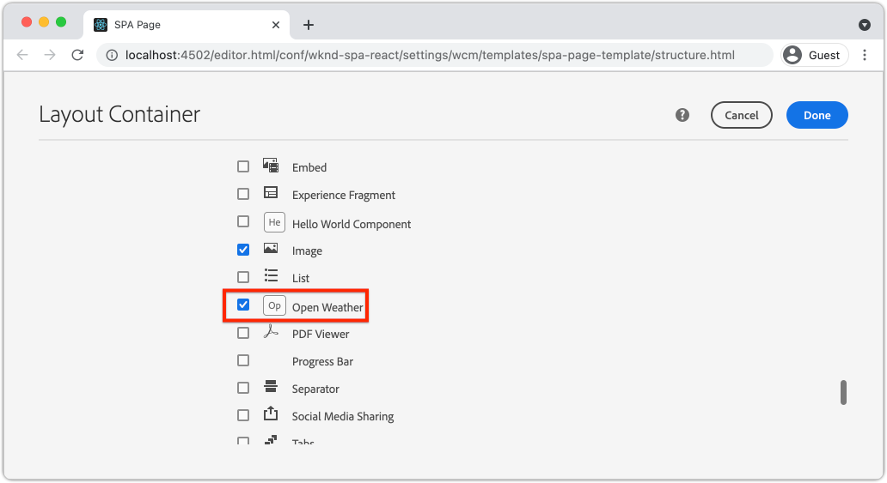

# 사용자 지정 날씨 구성 요소 {#custom-component} 만들기

AEM SPA 편집기에 사용할 사용자 지정 날씨 구성 요소를 만드는 방법을 알아봅니다. 작성자 대화 상자 및 Sling 모델을 개발하여 JSON 모델을 확장하여 사용자 지정 구성 요소를 채우는 방법을 알아봅니다. [Open Weather API](https://openweathermap.org) 및 [React Open Weather 구성 요소](https://www.npmjs.com/package/react-open-weather)가 사용됩니다.

## 목표

1. AEM에서 제공하는 JSON 모델 API를 조작할 때 Sling 모델의 역할을 이해합니다.
2. 새 AEM 구성 요소 대화 상자를 만드는 방법을 이해합니다.
3. SPA 편집기 프레임워크와 호환되는 **사용자 지정** AEM 구성 요소를 만드는 방법을 알아봅니다.

## 빌드할 내용

간단한 날씨 구성 요소가 구축될 것입니다. 이 구성 요소는 컨텐츠 작성자가 SPA에 추가할 수 있습니다. 작성자는 AEM 대화 상자를 사용하여 날씨를 표시할 위치를 설정할 수 있습니다.  이 구성 요소의 구현은 AEM SPA Editor 프레임워크와 호환되는 net-new AEM 구성 요소를 만드는 데 필요한 단계를 보여줍니다.


## 전제 조건

[로컬 개발 환경](overview.md#local-dev-environment)을 설정하는 데 필요한 도구 및 지침을 검토하십시오. 이 장은 [탐색 및 라우팅](navigation-routing.md) 장의 연속이지만, 필요한 모든 작업을 수행하려면 로컬 AEM 인스턴스에 배포된 SPA 사용 AEM 프로젝트가 있습니다.

### Open Weather API 키

자습서와 함께 [Open Weather](https://openweathermap.org/)의 API 키가 필요합니다. [등록은 제한된 ](https://home.openweathermap.org/users/sign_up) 양의 API 호출을 무료로 제공합니다.

## AEM 구성 요소 정의

AEM 구성 요소는 노드 및 속성으로 정의됩니다. 프로젝트에서 이러한 노드 및 속성은 `ui.apps` 모듈에서 XML 파일로 표시됩니다. 그런 다음 `ui.apps` 모듈에서 AEM 구성 요소를 만듭니다.

>[!NOTE]
>
> AEM 구성 요소의 [기본 사항에 대한 빠른 재료는](https://experienceleague.adobe.com/docs/experience-manager-learn/getting-started-wknd-tutorial-develop/project-archetype/component-basics.html)에 도움이 될 수 있습니다.

1. 선택한 IDE에서 `ui.apps` 폴더를 엽니다.
2. `ui.apps/src/main/content/jcr_root/apps/wknd-spa-react/components` 로 이동하여 `open-weather` 라는 새 폴더를 만듭니다.
3. `open-weather` 폴더 아래에 `.content.xml` 라는 새 파일을 만듭니다. `open-weather/.content.xml`을(를) 다음 값으로 채웁니다.

   ```xml
   <?xml version="1.0" encoding="UTF-8"?>
   <jcr:root xmlns:sling="http://sling.apache.org/jcr/sling/1.0" xmlns:cq="http://www.day.com/jcr/cq/1.0" xmlns:jcr="http://www.jcp.org/jcr/1.0"
       jcr:primaryType="cq:Component"
       jcr:title="Open Weather"
       componentGroup="WKND SPA React - Content"/>
   ```

   

   `jcr:primaryType="cq:Component"` - 이 노드가 AEM 구성 요소임을 식별합니다.

   `jcr:title` 는 컨텐츠 작성자에게 표시될 값이며 작성 UI의 구성 요소  `componentGroup` 그룹을 결정합니다.

4. `custom-component` 폴더 아래에서 `_cq_dialog` 라는 다른 폴더를 만듭니다.
5. `_cq_dialog` 폴더 아래에 `.content.xml` 라는 새 파일을 만들고 다음 파일로 채웁니다.

   ```xml
   <?xml version="1.0" encoding="UTF-8"?>
   <jcr:root xmlns:sling="http://sling.apache.org/jcr/sling/1.0" xmlns:granite="http://www.adobe.com/jcr/granite/1.0" xmlns:cq="http://www.day.com/jcr/cq/1.0" xmlns:jcr="http://www.jcp.org/jcr/1.0" xmlns:nt="http://www.jcp.org/jcr/nt/1.0"
       jcr:primaryType="nt:unstructured"
       jcr:title="Open Weather"
       sling:resourceType="cq/gui/components/authoring/dialog">
       <content
           jcr:primaryType="nt:unstructured"
           sling:resourceType="granite/ui/components/coral/foundation/container">
           <items jcr:primaryType="nt:unstructured">
               <tabs
                   jcr:primaryType="nt:unstructured"
                   sling:resourceType="granite/ui/components/coral/foundation/tabs"
                   maximized="{Boolean}true">
                   <items jcr:primaryType="nt:unstructured">
                       <properties
                           jcr:primaryType="nt:unstructured"
                           jcr:title="Properties"
                           sling:resourceType="granite/ui/components/coral/foundation/container"
                           margin="{Boolean}true">
                           <items jcr:primaryType="nt:unstructured">
                               <columns
                                   jcr:primaryType="nt:unstructured"
                                   sling:resourceType="granite/ui/components/coral/foundation/fixedcolumns"
                                   margin="{Boolean}true">
                                   <items jcr:primaryType="nt:unstructured">
                                       <column
                                           jcr:primaryType="nt:unstructured"
                                           sling:resourceType="granite/ui/components/coral/foundation/container">
                                           <items jcr:primaryType="nt:unstructured">
                                               <label
                                                   jcr:primaryType="nt:unstructured"
                                                   sling:resourceType="granite/ui/components/coral/foundation/form/textfield"
                                                   fieldDescription="The label to display for the component"
                                                   fieldLabel="Label"
                                                   name="./label"/>
                                               <lat
                                                   jcr:primaryType="nt:unstructured"
                                                   sling:resourceType="granite/ui/components/coral/foundation/form/numberfield"
                                                   fieldDescription="The latitude of the location."
                                                   fieldLabel="Latitude"
                                                   step="any"
                                                   name="./lat" />
                                               <lon
                                                   jcr:primaryType="nt:unstructured"
                                                   sling:resourceType="granite/ui/components/coral/foundation/form/numberfield"
                                                   fieldDescription="The longitude of the location."
                                                   fieldLabel="Longitude"
                                                   step="any"
                                                   name="./lon"/>
                                           </items>
                                       </column>
                                   </items>
                               </columns>
                           </items>
                       </properties>
                   </items>
               </tabs>
           </items>
       </content>
   </jcr:root>
   ```

   

   위의 XML 파일은 `Weather Component`에 대한 매우 간단한 대화 상자를 생성합니다. 파일의 중요한 부분은 내부 `<label>`, `<lat>` 및 `<lon>` 노드입니다. 이 대화 상자에는 사용자가 날씨를 표시할 수 있도록 구성하는 두 개의 `numberfield`과 `textfield`이 포함됩니다.

   JSON 모델을 통해 `label`,`lat` 및 `long` 속성의 값을 노출하는 옆에 Sling 모델이 만들어집니다.

   >[!NOTE]
   >
   > 코어 구성 요소 정의](https://github.com/adobe/aem-core-wcm-components/tree/master/content/src/content/jcr_root/apps/core/wcm/components)를 보면 대화 상자의 예제를 훨씬 더 많이 볼 수 있습니다. [ [CRXDE-Lite](http://localhost:4502/crx/de/index.jsp#/libs/granite/ui/components/coral/foundation/form)에서 `/libs/granite/ui/components/coral/foundation/form` 아래에 있는 `select`, `textarea`, `pathfield` 등의 추가 양식 필드를 볼 수도 있습니다.

   기존 AEM 구성 요소를 사용하는 경우 일반적으로 [HTL](https://docs.adobe.com/content/help/ko/experience-manager-htl/using/overview.html) 스크립트가 필요합니다. SPA이 구성 요소를 렌더링하므로 HTL 스크립트가 필요하지 않습니다.

## Sling 모델 만들기

Sling 모델은 JCR에서 Java 변수에 데이터를 쉽게 매핑하는 주석 기반의 Java &quot;POJO&quot;(일반 이전 Java 개체)입니다. [AEM ](https://experienceleague.adobe.com/docs/experience-manager-learn/getting-started-wknd-tutorial-develop/project-archetype/component-basics.html?lang=en#sling-models) 구성 요소에 대한 복잡한 서버측 비즈니스 로직을 캡슐화하는 Sling Modelstically 함수

SPA Editor 컨텍스트에서 Sling Models는 [Sling Model Exporter](https://experienceleague.adobe.com/docs/experience-manager-learn/foundation/development/develop-sling-model-exporter.html)를 사용하는 기능을 통해 JSON 모델을 통해 구성 요소의 컨텐츠를 제공합니다.

1. 선택한 IDE에서 `aem-guides-wknd-spa.react/core`에 있는 `core` 모듈을 엽니다.
1. `core/src/main/java/com/adobe/aem/guides/wkndspa/react/core/models`에서 `OpenWeatherModel.java`에 이름이 지정된 파일을 만듭니다.
1. `OpenWeather.java` 을 다음과 같이 채웁니다.

   ```java
   package com.adobe.aem.guides.wkndspa.react.core.models;
   
   import com.adobe.cq.export.json.ComponentExporter;
   
   // Sling Models intended to be used with SPA Editor must extend ComponentExporter interface
   public interface OpenWeatherModel extends ComponentExporter {
   
       public String getLabel();
   
       public double getLat();
   
       public double getLon();
   
   }
   ```

   구성 요소의 Java 인터페이스입니다. Sling 모델을 SPA Editor 프레임워크와 호환하려면 `ComponentExporter` 클래스를 확장해야 합니다.

1. `core/src/main/java/com/adobe/aem/guides/wkndspa/react/core/models` 아래에 `impl` 폴더를 만듭니다.
1. `impl` 아래에 `OpenWeatherModelImpl.java` 파일을 만들고 다음 파일로 채웁니다.

   ```java
   package com.adobe.aem.guides.wkndspa.react.core.models.impl;
   
   import org.apache.sling.models.annotations.*;
   import org.apache.sling.models.annotations.injectorspecific.ValueMapValue;
   import com.adobe.cq.export.json.ComponentExporter;
   import com.adobe.cq.export.json.ExporterConstants;
   import org.apache.commons.lang3.StringUtils;
   import org.apache.sling.api.SlingHttpServletRequest;
   import com.adobe.aem.guides.wkndspa.react.core.models.OpenWeatherModel;
   
   // Sling Model annotation
   @Model(
       adaptables = SlingHttpServletRequest.class, 
       adapters = { OpenWeatherModel.class, ComponentExporter.class }, 
       resourceType = OpenWeatherModelImpl.RESOURCE_TYPE, 
       defaultInjectionStrategy = DefaultInjectionStrategy.OPTIONAL
       )
   @Exporter( //Exporter annotation that serializes the modoel as JSON
       name = ExporterConstants.SLING_MODEL_EXPORTER_NAME, 
       extensions = ExporterConstants.SLING_MODEL_EXTENSION
       )
   public class OpenWeatherModelImpl implements OpenWeatherModel {
   
       @ValueMapValue
       private String label; //maps variable to jcr property named "label" persisted by Dialog
   
       @ValueMapValue
       private double lat; //maps variable to jcr property named "lat"
   
       @ValueMapValue
       private double lon; //maps variable to jcr property named "lon"
   
       // points to AEM component definition in ui.apps
       static final String RESOURCE_TYPE = "wknd-spa-react/components/open-weather";
   
       // public getter method to expose value of private variable `label`
       // adds additional logic to default the label to "(Default)" if not set.
       @Override
       public String getLabel() {
           return StringUtils.isNotBlank(label) ? label : "(Default)";
       }
   
       // public getter method to expose value of private variable `lat`
       @Override
       public double getLat() {
           return lat;
       }
   
       // public getter method to expose value of private variable `lon`
       @Override
       public double getLon() {
           return lon;
       }
   
       // method required by `ComponentExporter` interface
       // exposes a JSON property named `:type` with a value of `wknd-spa-react/components/open-weather`
       // required to map the JSON export to the SPA component props via the `MapTo`
       @Override
       public String getExportedType() {
           return OpenWeatherModelImpl.RESOURCE_TYPE;
       }
   } 
   ```

   정적 변수 `RESOURCE_TYPE`은(는) 구성 요소의 `ui.apps`에 있는 경로를 가리켜야 합니다. `getExportedType()` 은 `MapTo` 을 통해 JSON 속성을 SPA 구성 요소에 매핑하는 데 사용됩니다. `@ValueMapValue` 는 대화 상자에 저장된 jcr 속성을 읽는 주석입니다.

## SPA 업데이트

그런 다음 React 코드를 업데이트하여 [React Open Weather 구성 요소](https://www.npmjs.com/package/react-open-weather)를 포함하고 이전 단계에서 만든 AEM 구성 요소에 매핑하도록 합니다.

1. React Open Weather 구성 요소를 **npm** 종속으로 설치합니다.

   ```shell
   $ cd aem-guides-wknd-spa.react/ui.frontend
   $ npm i react-open-weather
   ```

1. `ui.frontend/src/components/OpenWeather`에 `OpenWeather` 라는 새 폴더를 만듭니다.
1. `OpenWeather.js` 파일을 추가하고 다음 파일로 채웁니다.

   ```js
   import React from 'react';
   import {MapTo} from '@adobe/aem-react-editable-components';
   import ReactWeather, { useOpenWeather } from 'react-open-weather';
   
   // Open weather API Key
   // For simplicity it is hard coded in the file, ideally this is extracted in to an environment variable
   const API_KEY = 'YOUR_API_KEY';
   
   // Logic to render placeholder or component
   const OpenWeatherEditConfig = {
   
       emptyLabel: 'Weather',
       isEmpty: function(props) {
           return !props || !props.lat || !props.lon || !props.label;
       }
   };
   
   // Wrapper function that includes react-open-weather component
   function ReactWeatherWrapper(props) {
       const { data, isLoading, errorMessage } = useOpenWeather({
           key: API_KEY,
           lat: props.lat, // passed in from AEM JSON
           lon: props.lon, // passed in from AEM JSON
           lang: 'en',
           unit: 'imperial', // values are (metric, standard, imperial)
       });
   
       return (
           <div className="cmp-open-weather">
               <ReactWeather
                   isLoading={isLoading}
                   errorMessage={errorMessage}
                   data={data}
                   lang="en"
                   locationLabel={props.label} // passed in from AEM JSON
                   unitsLabels={{ temperature: 'F', windSpeed: 'mph' }}
                   showForecast={false}
                 />
           </div>
       );
   }
   
   export default function OpenWeather(props) {
   
           // render nothing if component not configured
           if(OpenWeatherEditConfig.isEmpty(props)) {
               return null;
           }
   
           // render ReactWeather component if component configured
           // pass props to ReactWeatherWrapper. These props include the mapped properties from AEM JSON
           return ReactWeatherWrapper(props);
   
   }
   
   // Map OpenWeather to AEM component
   MapTo('wknd-spa-react/components/open-weather')(OpenWeather, OpenWeatherEditConfig);
   ```

1. `OpenWeather` 구성 요소를 포함하도록 `ui.frontend/src/components/import-components.js`에서 `import-components.js`을 업데이트합니다.

   ```diff
     // import-component.js
     import './Container/Container';
     import './ExperienceFragment/ExperienceFragment';
   + import './OpenWeather/OpenWeather';
   ```

1. Maven 기술을 사용하여 프로젝트 디렉토리의 루트에서 로컬 AEM 환경에 모든 업데이트를 배포합니다.

   ```shell
   $ cd aem-guides-wknd-spa.react
   $ mvn clean install -PautoInstallSinglePackage
   ```

## 템플릿 정책 업데이트

다음으로 AEM으로 이동하여 업데이트를 확인하고 `OpenWeather` 구성 요소를 SPA에 추가할 수 있도록 합니다.

1. [http://localhost:4502/system/console/status-slingmodels](http://localhost:4502/system/console/status-slingmodels)로 이동하여 새 Sling 모델의 등록을 확인합니다.

   ```plain
   com.adobe.aem.guides.wkndspa.react.core.models.impl.OpenWeatherModelImpl - wknd-spa-react/components/open-weather
   
   com.adobe.aem.guides.wkndspa.react.core.models.impl.OpenWeatherModelImpl exports 'wknd-spa-react/components/open-weather' with selector 'model' and extension '[Ljava.lang.String;@2fd80fc5' with exporter 'jackson'
   ```

   위의 두 행이 표시되고 `OpenWeatherModelImpl` 구성 요소가 `wknd-spa-react/components/open-weather` 구성 요소와 연결되며 Sling 모델 익스포터를 통해 등록되었음을 나타냅니다.

1. [http://localhost:4502/editor.html/conf/wknd-spa-react/settings/wcm/templates/spa-page-template/structure.html](http://localhost:4502/editor.html/conf/wknd-spa-react/settings/wcm/templates/spa-page-template/structure.html)의 SPA 페이지 템플릿으로 이동합니다.
1. 레이아웃 컨테이너의 정책을 업데이트하여 새 `Open Weather`을 허용된 구성 요소로 추가합니다.

   

   정책에 대한 변경 사항을 저장하고 `Open Weather` 을 허용된 구성 요소로 관찰합니다.

   

## Open Weather 구성 요소 작성

그런 다음 AEM SPA 편집기를 사용하여 `Open Weather` 구성 요소를 작성합니다.

1. [http://localhost:4502/editor.html/content/wknd-spa-react/us/en/home.html](http://localhost:4502/editor.html/content/wknd-spa-react/us/en/home.html)로 이동합니다.
1. `Edit` 모드에서 `Open Weather`을 `Layout Container`에 추가합니다.

   

1. 구성 요소의 대화 상자를 열고 **Label**, **Latitude** 및 **Longitude**&#x200B;를 입력합니다. 예: **San Diego**, **32.7157** 및 **-117.1611** 북반구와 남반구의 숫자는 Open Weather API로 음수로 표시됩니다

   

   이 대화 상자는 장의 앞부분에 있는 XML 파일을 기반으로 작성된 것입니다.

1. 변경 사항을 저장합니다. 이제 **San Diego**&#x200B;의 날씨가 표시됩니다.

   

1. [http://localhost:4502/content/wknd-spa-react/us/en.model.json](http://localhost:4502/content/wknd-spa-react/us/en.model.json)로 이동하여 JSON 모델을 봅니다. `wknd-spa-react/components/open-weather` 검색:

   ```json
   "open_weather": {
       "label": "San Diego",
       "lat": 32.7157,
       "lon": -117.1611,
       ":type": "wknd-spa-react/components/open-weather"
   }
   ```

   JSON 값은 Sling 모델에 의해 출력됩니다. 이러한 JSON 값은 React 구성 요소에 prop으로 전달됩니다.

## 축하합니다! {#congratulations}

축하합니다. SPA 편집기에 사용할 사용자 지정 AEM 구성 요소를 만드는 방법을 알아보았습니다. 또한 대화 상자, JCR 속성 및 Sling 모델이 JSON 모델을 출력하는 방법을 학습했습니다.

### 다음 단계 {#next-steps}

[코어 구성 요소 확장](extend-component.md)  - AEM SPA 편집기와 함께 사용할 기존 AEM 코어 구성 요소를 확장하는 방법을 알아봅니다. 기존 구성 요소에 속성 및 컨텐츠를 추가하는 방법을 이해하는 것은 AEM SPA 편집기 구현의 기능을 확장하는 강력한 방법입니다.
