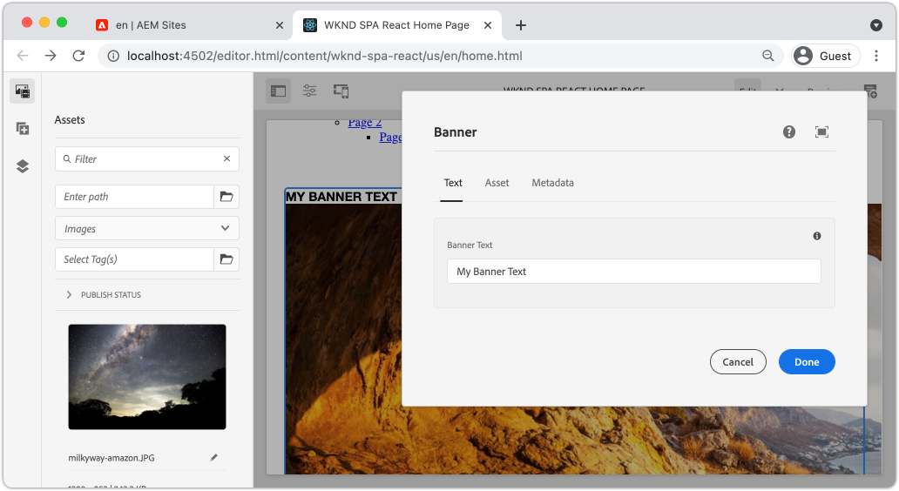

# 핵심 구성 요소 확장 {#extend-component}

{{spa-editor-deprecation}}

AEM SPA 편집기에서 사용할 기존 핵심 구성 요소를 확장하는 방법을 알아봅니다. 기존 구성 요소를 확장하는 방법을 이해하는 것은 AEM SPA Editor 구현의 기능을 사용자 정의하고 확장하는 강력한 기술입니다.

## 목표

1. 추가 속성 및 콘텐츠를 사용하여 기존 핵심 구성 요소를 확장합니다.
2. `sling:resourceSuperType`을(를) 사용하여 구성 요소 상속의 기본 사항을 이해합니다.
3. Sling 모델에 대해 [위임 패턴](https://github.com/adobe/aem-core-wcm-components/wiki/Delegation-Pattern-for-Sling-Models)을 활용하여 기존 논리 및 기능을 다시 사용하는 방법에 대해 알아봅니다.

## 빌드할 내용

이 장에서는 새 `Banner` 구성 요소에 대한 요구 사항을 충족하기 위해 표준 `Image` 구성 요소에 속성을 추가하는 데 필요한 추가 코드를 보여 줍니다. `Banner` 구성 요소에 표준 `Image` 구성 요소와 동일한 속성이 모두 포함되어 있지만 사용자가 **배너 텍스트**&#x200B;를 채울 수 있는 추가 속성이 포함되어 있습니다.



## 사전 요구 사항

[로컬 개발 환경](overview.md#local-dev-environment)을 설정하는 데 필요한 도구 및 지침을 검토하십시오. 이 시점에서 자습서에서는 사용자가 AEM SPA 편집기 기능을 잘 이해하고 있다고 가정합니다.

## Sling 리소스 슈퍼 유형을 통한 상속 {#sling-resource-super-type}

기존 구성 요소를 확장하려면 구성 요소 정의에 이름이 `sling:resourceSuperType`인 속성을 설정합니다.  `sling:resourceSuperType`은(는) 다른 구성 요소를 가리키는 AEM 구성 요소의 정의에 설정할 수 있는 [속성](https://sling.apache.org/documentation/the-sling-engine/resources.html#resource-properties)입니다. 이렇게 하면 구성 요소가 `sling:resourceSuperType`(으)로 식별된 구성 요소의 모든 기능을 상속하도록 명시적으로 설정됩니다.

`wknd-spa-react/components/image`에서 `Image` 구성 요소를 확장하려면 `ui.apps` 모듈에서 코드를 업데이트해야 합니다.

1. `ui.apps/src/main/content/jcr_root/apps/wknd-spa-react/components/banner`의 `banner`에 대한 `ui.apps` 모듈 아래에 새 폴더를 만듭니다.
1. `banner` 아래에 다음과 같은 구성 요소 정의(`.content.xml`)를 만듭니다.

   ```xml
   <?xml version="1.0" encoding="UTF-8"?>
   <jcr:root xmlns:sling="http://sling.apache.org/jcr/sling/1.0" xmlns:cq="http://www.day.com/jcr/cq/1.0" xmlns:jcr="http://www.jcp.org/jcr/1.0"
       jcr:primaryType="cq:Component"
       jcr:title="Banner"
       sling:resourceSuperType="wknd-spa-react/components/image"
       componentGroup="WKND SPA React - Content"/>
   ```

   `wknd-spa-react/components/image`의 모든 기능을 상속하도록 `wknd-spa-react/components/banner`을(를) 설정합니다.

## cq:editConfig {#cq-edit-config}

`_cq_editConfig.xml` 파일은 AEM 작성 UI에서 끌어서 놓기 동작을 지시합니다. 이미지 구성 요소를 확장할 때 리소스 유형이 구성 요소 자체와 일치해야 합니다.

1. `ui.apps` 모듈에서 `banner` 아래에 이름이 `_cq_editConfig.xml`인 다른 파일을 만듭니다.
1. `_cq_editConfig.xml`을(를) 다음 XML로 채우기:

   ```xml
   <?xml version="1.0" encoding="UTF-8"?>
   <jcr:root xmlns:sling="http://sling.apache.org/jcr/sling/1.0" xmlns:cq="http://www.day.com/jcr/cq/1.0" xmlns:jcr="http://www.jcp.org/jcr/1.0" xmlns:nt="http://www.jcp.org/jcr/nt/1.0"
       jcr:primaryType="cq:EditConfig">
       <cq:dropTargets jcr:primaryType="nt:unstructured">
           <image
               jcr:primaryType="cq:DropTargetConfig"
               accept="[image/gif,image/jpeg,image/png,image/webp,image/tiff,image/svg\\+xml]"
               groups="[media]"
               propertyName="./fileReference">
               <parameters
                   jcr:primaryType="nt:unstructured"
                   sling:resourceType="wknd-spa-react/components/banner"
                   imageCrop=""
                   imageMap=""
                   imageRotate=""/>
           </image>
       </cq:dropTargets>
       <cq:inplaceEditing
           jcr:primaryType="cq:InplaceEditingConfig"
           active="{Boolean}true"
           editorType="image">
           <inplaceEditingConfig jcr:primaryType="nt:unstructured">
               <plugins jcr:primaryType="nt:unstructured">
                   <crop
                       jcr:primaryType="nt:unstructured"
                       supportedMimeTypes="[image/jpeg,image/png,image/webp,image/tiff]"
                       features="*">
                       <aspectRatios jcr:primaryType="nt:unstructured">
                           <wideLandscape
                               jcr:primaryType="nt:unstructured"
                               name="Wide Landscape"
                               ratio="0.6180"/>
                           <landscape
                               jcr:primaryType="nt:unstructured"
                               name="Landscape"
                               ratio="0.8284"/>
                           <square
                               jcr:primaryType="nt:unstructured"
                               name="Square"
                               ratio="1"/>
                           <portrait
                               jcr:primaryType="nt:unstructured"
                               name="Portrait"
                               ratio="1.6180"/>
                       </aspectRatios>
                   </crop>
                   <flip
                       jcr:primaryType="nt:unstructured"
                       supportedMimeTypes="[image/jpeg,image/png,image/webp,image/tiff]"
                       features="-"/>
                   <map
                       jcr:primaryType="nt:unstructured"
                       supportedMimeTypes="[image/jpeg,image/png,image/webp,image/tiff,image/svg+xml]"
                       features="*"/>
                   <rotate
                       jcr:primaryType="nt:unstructured"
                       supportedMimeTypes="[image/jpeg,image/png,image/webp,image/tiff]"
                       features="*"/>
                   <zoom
                       jcr:primaryType="nt:unstructured"
                       supportedMimeTypes="[image/jpeg,image/png,image/webp,image/tiff]"
                       features="*"/>
               </plugins>
               <ui jcr:primaryType="nt:unstructured">
                   <inline
                       jcr:primaryType="nt:unstructured"
                       toolbar="[crop#launch,rotate#right,history#undo,history#redo,fullscreen#fullscreen,control#close,control#finish]">
                       <replacementToolbars
                           jcr:primaryType="nt:unstructured"
                           crop="[crop#identifier,crop#unlaunch,crop#confirm]"/>
                   </inline>
                   <fullscreen jcr:primaryType="nt:unstructured">
                       <toolbar
                           jcr:primaryType="nt:unstructured"
                           left="[crop#launchwithratio,rotate#right,flip#horizontal,flip#vertical,zoom#reset100,zoom#popupslider]"
                           right="[history#undo,history#redo,fullscreen#fullscreenexit]"/>
                       <replacementToolbars jcr:primaryType="nt:unstructured">
                           <crop
                               jcr:primaryType="nt:unstructured"
                               left="[crop#identifier]"
                               right="[crop#unlaunch,crop#confirm]"/>
                           <map
                               jcr:primaryType="nt:unstructured"
                               left="[map#rectangle,map#circle,map#polygon]"
                               right="[map#unlaunch,map#confirm]"/>
                       </replacementToolbars>
                   </fullscreen>
               </ui>
           </inplaceEditingConfig>
       </cq:inplaceEditing>
   </jcr:root>
   ```

1. 파일의 고유한 특성은 resourceType을 `wknd-spa-react/components/banner`(으)로 설정하는 `<parameters>` 노드입니다.

   ```xml
   <parameters
       jcr:primaryType="nt:unstructured"
       sling:resourceType="wknd-spa-react/components/banner"
       imageCrop=""
       imageMap=""
       imageRotate=""/>
   ```

   대부분의 구성 요소에는 `_cq_editConfig`이(가) 필요하지 않습니다. 이미지 구성 요소와 하위 항목은 예외입니다.

## 대화 상자 확장 {#extend-dialog}

`Banner` 구성 요소에서 `bannerText`을(를) 캡처하려면 대화 상자에 추가 텍스트 필드가 필요합니다. Sling 상속을 사용하고 있으므로 [Sling 리소스 병합](https://experienceleague.adobe.com/docs/experience-manager-65/developing/platform/sling-resource-merger.html?lang=ko)의 기능을 사용하여 대화 상자의 일부를 재정의하거나 확장할 수 있습니다. 이 샘플에서는 작성자의 추가 데이터를 캡처하여 카드 구성 요소를 채우기 위한 새 탭이 대화 상자에 추가되었습니다.

1. `banner` 폴더 아래의 `ui.apps` 모듈에서 `_cq_dialog` 폴더를 만듭니다.
1. `_cq_dialog` 아래에 대화 상자 정의 파일 `.content.xml`을(를) 만듭니다. 다음을 사용하여 채웁니다.

   ```xml
   <?xml version="1.0" encoding="UTF-8"?>
   <jcr:root xmlns:sling="http://sling.apache.org/jcr/sling/1.0" xmlns:granite="http://www.adobe.com/jcr/granite/1.0" xmlns:cq="http://www.day.com/jcr/cq/1.0" xmlns:jcr="http://www.jcp.org/jcr/1.0" xmlns:nt="http://www.jcp.org/jcr/nt/1.0"
       jcr:primaryType="nt:unstructured"
       jcr:title="Banner"
       sling:resourceType="cq/gui/components/authoring/dialog">
       <content jcr:primaryType="nt:unstructured">
           <items jcr:primaryType="nt:unstructured">
               <tabs jcr:primaryType="nt:unstructured">
                   <items jcr:primaryType="nt:unstructured">
                       <text
                           jcr:primaryType="nt:unstructured"
                           jcr:title="Text"
                           sling:orderBefore="asset"
                           sling:resourceType="granite/ui/components/coral/foundation/container"
                           margin="{Boolean}true">
                           <items jcr:primaryType="nt:unstructured">
                               <columns
                                   jcr:primaryType="nt:unstructured"
                                   sling:resourceType="granite/ui/components/coral/foundation/fixedcolumns"
                                   margin="{Boolean}true">
                                   <items jcr:primaryType="nt:unstructured">
                                       <column
                                           jcr:primaryType="nt:unstructured"
                                           sling:resourceType="granite/ui/components/coral/foundation/container">
                                           <items jcr:primaryType="nt:unstructured">
                                               <textGroup
                                                   granite:hide="${cqDesign.titleHidden}"
                                                   jcr:primaryType="nt:unstructured"
                                                   sling:resourceType="granite/ui/components/coral/foundation/well">
                                                   <items jcr:primaryType="nt:unstructured">
                                                       <bannerText
                                                           jcr:primaryType="nt:unstructured"
                                                           sling:resourceType="granite/ui/components/coral/foundation/form/textfield"
                                                           fieldDescription="Text to display on top of the banner."
                                                           fieldLabel="Banner Text"
                                                           name="./bannerText"/>
                                                   </items>
                                               </textGroup>
                                           </items>
                                       </column>
                                   </items>
                               </columns>
                           </items>
                       </text>
                   </items>
               </tabs>
           </items>
       </content>
   </jcr:root>
   ```

   위의 XML 정의는 **Text**(이)라는 새 탭을 만들고 기존 **Asset** 탭의 순서를 *before*&#x200B;합니다. 단일 필드 **배너 텍스트**&#x200B;가 포함됩니다.

1. 대화 상자는 다음과 같이 표시됩니다.

   

   **자산** 또는 **메타데이터**&#x200B;에 대한 탭을 정의할 필요가 없습니다. `sling:resourceSuperType` 속성을 통해 상속됩니다.

   대화 상자를 미리 보려면 SPA 구성 요소와 `MapTo` 함수를 구현해야 합니다.

## SPA 구성 요소 구현 {#implement-spa-component}

SPA 편집기에서 배너 구성 요소를 사용하려면 `wknd-spa-react/components/banner`에 매핑될 새 SPA 구성 요소를 만들어야 합니다. 이 작업은 `ui.frontend` 모듈에서 수행됩니다.

1. `ui.frontend` 모듈에서 `ui.frontend/src/components/Banner`에 `Banner`에 대한 새 폴더를 만듭니다.
1. `Banner` 폴더 아래에 이름이 `Banner.js`인 새 파일을 만듭니다. 다음을 사용하여 채웁니다.

   ```js
   import React, {Component} from 'react';
   import {MapTo} from '@adobe/aem-react-editable-components';
   
   export const BannerEditConfig = {
       emptyLabel: 'Banner',
   
       isEmpty: function(props) {
           return !props || !props.src || props.src.trim().length < 1;
       }
   };
   
   export default class Banner extends Component {
   
       get content() {
           return ;
       }
   
       // display our custom bannerText property!
       get bannerText() {
           if(this.props.bannerText) {
               return <h4>{this.props.bannerText}</h4>;
           }
   
           return null;
       }
   
       render() {
           if (BannerEditConfig.isEmpty(this.props)) {
               return null;
           }
   
           return (
               <div className="Banner">
                   {this.bannerText}
                   <div className="BannerImage">{this.content}</div>
               </div>
           );
       }
   }
   
   MapTo('wknd-spa-react/components/banner')(Banner, BannerEditConfig);
   ```

   이 SPA 구성 요소는 이전에 만든 AEM 구성 요소 `wknd-spa-react/components/banner`에 매핑됩니다.

1. 새 `Banner` SPA 구성 요소를 포함하도록 `ui.frontend/src/components/import-components.js`에서 `import-components.js`을(를) 업데이트합니다.

   ```diff
     import './ExperienceFragment/ExperienceFragment';
     import './OpenWeather/OpenWeather';
   + import './Banner/Banner';
   ```

1. 이 시점에서 프로젝트를 AEM에 배포하고 대화 상자를 테스트할 수 있습니다. Maven 기술을 사용하여 프로젝트를 배포합니다.

   ```shell
   $ cd aem-guides-wknd-spa.react
   $ mvn clean install -PautoInstallSinglePackage
   ```

1. SPA 템플릿의 정책을 업데이트하여 `Banner` 구성 요소를 **허용된 구성 요소**(으)로 추가합니다.

1. SPA 페이지로 이동하고 SPA 페이지 중 하나에 `Banner` 구성 요소를 추가합니다.

   

   >[!NOTE]
   >
   > 대화 상자에서 **배너 텍스트**&#x200B;에 대한 값을 저장할 수 있지만 이 값은 SPA 구성 요소에 반영되지 않습니다. 활성화하려면 구성 요소에 대한 슬링 모델 을 확장해야 합니다.

## Java 인터페이스 추가 {#java-interface}

궁극적으로 구성 요소 대화 상자의 값을 React 구성 요소에 노출하려면 `Banner` 구성 요소에 대해 JSON을 채우는 Sling 모델을 업데이트해야 합니다. 이 작업은 SPA 프로젝트에 대한 모든 Java 코드를 포함하는 `core` 모듈에서 수행됩니다.

먼저 `Image` Java 인터페이스를 확장하는 `Banner`에 대한 새 Java 인터페이스를 만듭니다.

1. `core` 모듈에서 `core/src/main/java/com/adobe/aem/guides/wkndspa/react/core/models`에 이름이 `BannerModel.java`인 새 파일을 만듭니다.
1. `BannerModel.java`을(를) 다음으로 채우기:

   ```java
   package com.adobe.aem.guides.wkndspa.react.core.models;
   
   import com.adobe.cq.wcm.core.components.models.Image;
   import org.osgi.annotation.versioning.ProviderType;
   
   @ProviderType
   public interface BannerModel extends Image {
   
       public String getBannerText();
   
   }
   ```

   핵심 구성 요소 `Image` 인터페이스에서 모든 메서드를 상속하고 새 메서드 `getBannerText()`을(를) 하나 추가합니다.

## Sling 모델 구현 {#sling-model}

그런 다음 `BannerModel` 인터페이스에 대한 Sling 모델을 구현합니다.

1. `core` 모듈에서 `core/src/main/java/com/adobe/aem/guides/wkndspa/react/core/models/impl`에 이름이 `BannerModelImpl.java`인 새 파일을 만듭니다.

1. `BannerModelImpl.java`을(를) 다음으로 채우기:

   ```java
   package com.adobe.aem.guides.wkndspa.react.core.models.impl;
   
   import com.adobe.aem.guides.wkndspa.react.core.models.BannerModel;
   import com.adobe.cq.export.json.ComponentExporter;
   import com.adobe.cq.export.json.ExporterConstants;
   import com.adobe.cq.wcm.core.components.models.Image;
   import org.apache.sling.models.annotations.*;
   import org.apache.sling.api.SlingHttpServletRequest;
   import org.apache.sling.models.annotations.Model;
   import org.apache.sling.models.annotations.injectorspecific.Self;
   import org.apache.sling.models.annotations.injectorspecific.ValueMapValue;
   import org.apache.sling.models.annotations.via.ResourceSuperType;
   
   @Model(
       adaptables = SlingHttpServletRequest.class, 
       adapters = { BannerModel.class,ComponentExporter.class}, 
       resourceType = BannerModelImpl.RESOURCE_TYPE, 
       defaultInjectionStrategy = DefaultInjectionStrategy.OPTIONAL
   )
   @Exporter(name = ExporterConstants.SLING_MODEL_EXPORTER_NAME, extensions = ExporterConstants.SLING_MODEL_EXTENSION)
   public class BannerModelImpl implements BannerModel {
   
       // points to the the component resource path in ui.apps
       static final String RESOURCE_TYPE = "wknd-spa-react/components/banner";
   
       @Self
       private SlingHttpServletRequest request;
   
       // With sling inheritance (sling:resourceSuperType) we can adapt the current resource to the Image class
       // this allows us to re-use all of the functionality of the Image class, without having to implement it ourself
       // see https://github.com/adobe/aem-core-wcm-components/wiki/Delegation-Pattern-for-Sling-Models
       @Self
       @Via(type = ResourceSuperType.class)
       private Image image;
   
       // map the property saved by the dialog to a variable named `bannerText`
       @ValueMapValue
       private String bannerText;
   
       // public getter to expose the value of `bannerText` via the Sling Model and JSON output
       @Override
       public String getBannerText() {
           return bannerText;
       }
   
       // Re-use the Image class for all other methods:
   
       @Override
       public String getSrc() {
           return null != image ? image.getSrc() : null;
       }
   
       @Override
       public String getAlt() {
           return null != image ? image.getAlt() : null;
       }
   
       @Override
       public String getTitle() {
           return null != image ? image.getTitle() : null;
       }
   
       // method required by `ComponentExporter` interface
       // exposes a JSON property named `:type` with a value of `wknd-spa-react/components/banner`
       // required to map the JSON export to the SPA component props via the `MapTo`
       @Override
       public String getExportedType() {
           return BannerModelImpl.RESOURCE_TYPE;
       }
   }
   ```

   Sling 모델 내보내기를 통해 Sling 모델을 JSON으로 serialize할 수 있도록 `@Model` 및 `@Exporter` 주석을 사용하십시오.

   `BannerModelImpl.java`은(는) 이미지 핵심 구성 요소의 모든 논리를 다시 쓰지 않도록 Sling 모델에 대해 [위임 패턴](https://github.com/adobe/aem-core-wcm-components/wiki/Delegation-Pattern-for-Sling-Models)을 사용합니다.

1. 다음 행을 검토하십시오.

   ```java
   @Self
   @Via(type = ResourceSuperType.class)
   private Image image;
   ```

   위의 주석은 `Banner` 구성 요소의 `sling:resourceSuperType` 상속을 기반으로 이름이 `image`인 이미지 개체를 인스턴스화합니다.

   ```java
   @Override
   public String getSrc() {
       return null != image ? image.getSrc() : null;
   }
   ```

   그러면 논리를 직접 작성하지 않고도 `image` 개체를 사용하여 `Image` 인터페이스에서 정의한 메서드를 구현할 수 있습니다. 이 기술은 `getSrc()`, `getAlt()` 및 `getTitle()`에 사용됩니다.

1. 터미널 창을 열고 `core` 디렉터리의 Maven `autoInstallBundle` 프로필을 사용하여 `core` 모듈에 대한 업데이트만 배포합니다.

   ```shell
   $ cd core/
   $ mvn clean install -PautoInstallBundle
   ```

## 결합하기 {#put-together}

1. AEM으로 돌아가서 `Banner` 구성 요소가 있는 SPA 페이지를 엽니다.
1. **배너 텍스트**&#x200B;를 포함하도록 `Banner` 구성 요소 업데이트:

   

1. 구성 요소를 이미지로 채웁니다.

   

   대화 상자 업데이트를 저장합니다.

1. 이제 **배너 텍스트**&#x200B;의 렌더링된 값이 표시됩니다.


1. [http://localhost:4502/content/wknd-spa-react/us/en.model.json](http://localhost:4502/content/wknd-spa-react/us/en.model.json)에서 JSON 모델 응답을 보고 `wknd-spa-react/components/card`을(를) 검색합니다.

   ```json
   "banner": {
       "bannerText": "My Banner Text",
       "src": "/content/wknd-spa-react/us/en/home/_jcr_content/root/responsivegrid/banner.coreimg.jpeg/1622167884688/sport-climbing.jpeg",
       "alt": "alt banner rock climber",
       ":type": "wknd-spa-react/components/banner"
    },
   ```

   `BannerModelImpl.java`에서 Sling 모델을 구현한 후 추가 키/값 쌍으로 JSON 모델이 업데이트됩니다.

## 축하합니다! {#congratulations}

축하합니다. 를 사용하여 AEM 구성 요소를 확장하는 방법과 Sling 모델 및 대화 상자가 JSON 모델과 함께 작동하는 방법을 배웠습니다.
