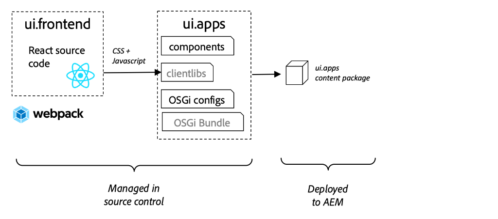
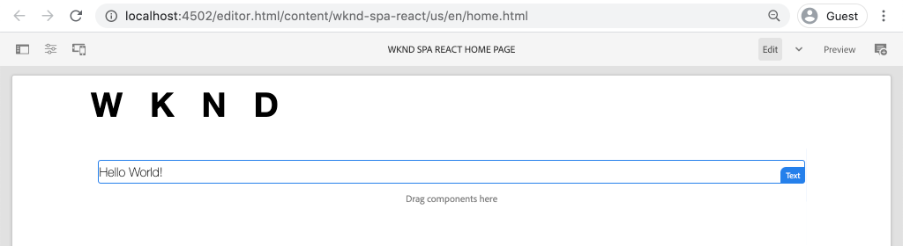

# SPA 통합 {#developer-workflow}

React에 작성된 SPA(단일 페이지 애플리케이션)의 소스 코드를 Adobe Experience Manager(AEM) 프로젝트와 통합하는 방법을 이해합니다. 웹 팩 개발 서버와 같은 최신 프런트 엔드 도구를 사용하여 AEM JSON 모델 API에 대해 SPA을 빠르게 개발하는 방법을 알아봅니다.

## 목표

1. SPA 프로젝트가 클라이언트 측 라이브러리와 AEM과 통합된 방법을 이해합니다.
2. 전용 프런트 엔드 개발을 위해 웹 팩 개발 서버를 사용하는 방법을 알아봅니다.
3. 사용 탐색 **프록시** 및 정적 **mock** AEM JSON 모델 API에 대해 개발하는 파일입니다.

## 빌드할 내용

이 장에서는 SPA이 AEM과 통합되는 방법을 이해하기 위해 몇 가지 작은 변경 사항을 수행합니다.
이 장에서는 `Header` 구성 요소를 SPA에 추가합니다. 이걸 만드는 과정에서 **정적** `Header` AEM SPA 개발에 대한 몇 가지 구성 요소 접근 방식이 사용됩니다.


*SPA이 확장되어 정적 추가 `Header` 구성 요소*

## 사전 요구 사항

설정에 필요한 도구 및 지침을 검토합니다. [로컬 개발 환경](overview.md#local-dev-environment). 이 장은 ...의 연속이다 [프로젝트 만들기](create-project.md) 그러나 필요한 모든 작업을 수행하는 데는 SPA 지원 AEM 프로젝트가 있습니다.

## 통합 방법 {#integration-approach}

AEM 프로젝트의 일부로 두 개의 모듈이 생성되었습니다. `ui.apps` 및 `ui.frontend`.

다음 `ui.frontend` 모듈은 [웹 팩](https://webpack.js.org/) 모든 SPA 소스 코드를 포함하는 프로젝트입니다. 대부분의 SPA 개발 및 테스트는 웹 팩 프로젝트에서 수행됩니다. 프로덕션 빌드가 트리거되면 SPA이 웹 팩을 사용하여 빌드되고 컴파일됩니다. 컴파일된 객체(CSS 및 Javascript)는 `ui.apps` 모듈이 AEM 런타임으로 배포됩니다.



*SPA 통합에 대한 높은 수준의 묘사.*

프런트 엔드 빌드에 대한 추가 정보는 [여기에서](https://experienceleague.adobe.com/docs/experience-manager-core-components/using/developing/archetype/uifrontend-react.html).

## Inspect SPA 통합 {#inspect-spa-integration}

다음으로, `ui.frontend` 모듈이 자동으로 생성한 SPA을 이해하는 모듈 [AEM 프로젝트 원형](https://experienceleague.adobe.com/docs/experience-manager-core-components/using/developing/archetype/uifrontend-react.html).

1. 선택한 IDE에서 AEM 프로젝트를 엽니다. 이 자습서에서는 [Visual Studio 코드 IDE](https://experienceleague.adobe.com/docs/experience-manager-learn/cloud-service/local-development-environment-set-up/development-tools.html#microsoft-visual-studio-code).

   

1. 확장 및 검사 `ui.frontend` 폴더를 입력합니다. 파일을 엽니다. `ui.frontend/package.json`

1. 아래에 `dependencies` 와 관련된 여러 항목이 표시됩니다. `react` 포함 `react-scripts`

   다음 `ui.frontend` 는 [React 앱 만들기](https://create-react-app.dev/) 또는 CRA를 짧게 표시합니다. 다음 `react-scripts` 버전은 CRA가 사용되는 버전을 나타냅니다.

1. 에는 몇 가지 종속성이 접두사로 추가됩니다. `@adobe`:

   ```json
   "@adobe/aem-react-editable-components": "~1.1.2",
   "@adobe/aem-spa-component-mapping": "~1.1.0",
   "@adobe/aem-spa-page-model-manager": "~1.3.3",
   "@adobe/aem-core-components-react-base": "1.1.8",
   "@adobe/aem-core-components-react-spa": "1.1.7",
   ```

   위의 모듈은 [AEM SPA Editor JS SDK](https://experienceleague.adobe.com/docs/experience-manager-65/developing/headless/spas/spa-blueprint.html) AEM 구성 요소에 SPA 구성 요소를 매핑할 수 있는 기능을 제공합니다.

   또한 다음과 같습니다 [AEM WCM 구성 요소 - React Core 구현](https://github.com/adobe/aem-react-core-wcm-components-base) 및 [AEM WCM 구성 요소 - Spa 편집기 - React Core 구현](https://github.com/adobe/aem-react-core-wcm-components-spa). 이는 즉시 사용 가능한 AEM 구성 요소에 매핑되는 재사용 가능한 UI 구성 요소 세트입니다. 이러한 프로젝트들은 프로젝트의 요구 사항을 충족하도록 그대로 사용하고 스타일이 지정되도록 디자인되었습니다.

1. 에서 `package.json` 몇 가지 파일 `scripts` 정의:

   ```json
   "scripts": {
       "start": "react-scripts start",
       "build": "react-scripts build && clientlib",
       "test": "react-scripts test",
       "eject": "react-scripts eject",
   }
   ```

   다음은 작성된 표준 빌드 스크립트입니다 [사용 가능](https://create-react-app.dev/docs/available-scripts) 반응형 앱 만들기

   유일한 차이점은 `&& clientlib` 변환 후 `build` 스크립트. 이 추가 지침은 컴파일된 SPA을 `ui.apps` 빌드 중에 클라이언트측 라이브러리로 모듈 사용.

   npm 모듈 [aem-clientlib-generator](https://github.com/wcm-io-frontend/aem-clientlib-generator) 는 이 작업을 용이하게 하는 데 사용됩니다.

1. Inspect 파일 `ui.frontend/clientlib.config.js`. 이 구성 파일은 [aem-clientlib-generator](https://github.com/wcm-io-frontend/aem-clientlib-generator#clientlibconfigjs) 클라이언트 라이브러리를 생성하는 방법을 결정합니다.

1. Inspect 파일 `ui.frontend/pom.xml`. 이 파일은 `ui.frontend` 폴더에 [Maven 모듈](https://maven.apache.org/guides/mini/guide-multiple-modules.html). 다음 `pom.xml` 파일을 사용하도록 업데이트했습니다 [frontend-maven-plugin](https://github.com/eirslett/frontend-maven-plugin) to **테스트** 및 **빌드** maven 빌드 중 SPA에 대한 추가 정보.

1. Inspect 파일 `index.js` at `ui.frontend/src/index.js`:

   ```js
   //ui.frontend/src/index.js
   ...
   document.addEventListener('DOMContentLoaded', () => {
       ModelManager.initialize().then(pageModel => {
           const history = createBrowserHistory();
           render(
           <Router history={history}>
               <App
               history={history}
               cqChildren={pageModel[Constants.CHILDREN_PROP]}
               cqItems={pageModel[Constants.ITEMS_PROP]}
               cqItemsOrder={pageModel[Constants.ITEMS_ORDER_PROP]}
               cqPath={pageModel[Constants.PATH_PROP]}
               locationPathname={window.location.pathname}
               />
           </Router>,
           document.getElementById('spa-root')
           );
       });
   });
   ```

   `index.js` 는 SPA의 시작점입니다. `ModelManager` 는 AEM SPA Editor JS SDK에서 제공합니다. 호출 및 주입 책임은 다음과 같습니다 `pageModel` (JSON 콘텐츠)를 애플리케이션에 추가합니다.

1. Inspect 파일 `import-components.js` at `ui.frontend/src/components/import-components.js`. 이 파일은 즉시 가져옵니다 **React 코어 구성 요소** 프로젝트에 사용할 수 있도록 합니다. 다음 장에서는 AEM 컨텐츠가 SPA 구성 요소에 매핑되는지 검사합니다.

## 정적 SPA 구성 요소 추가 {#static-spa-component}

그런 다음, SPA에 새 구성 요소를 추가하고 변경 사항을 로컬 AEM 인스턴스에 배포합니다. 이는 SPA이 업데이트된 방식을 보여주는 간단한 변경 사항입니다.

1. 에서 `ui.frontend` 모듈, 아래 `ui.frontend/src/components` 이름이 인 새 폴더 만들기 `Header`.
1. 이름이 인 파일 만들기 `Header.js` 아래 `Header` 폴더를 입력합니다.

   

1. 채우기 `Header.js` 사용:

   ```js
   //Header.js
   import React, {Component} from 'react';
   
   export default class Header extends Component {
   
       render() {
           return (
                   <header className="Header">
                       <div className="Header-container">
                           <h1>WKND</h1>
                       </div>
                   </header>
           );
       }
   }
   ```

   이상은 정적 텍스트 문자열을 출력하는 표준 React 구성 요소입니다.

1. 파일을 엽니다. `ui.frontend/src/App.js`. 응용 프로그램 진입점입니다.
1. 다음 사항을 업데이트하여 `App.js` 정적 포함 `Header`:

   ```diff
     import { Page, withModel } from '@adobe/aem-react-editable-components';
     import React from 'react';
   + import Header from './components/Header/Header';
   
     // This component is the application entry point
     class App extends Page {
     render() {
         return (
         <div>
   +       <Header />
            {this.childComponents}
            {this.childPages}
        </div>
   ```

1. 새 터미널을 열고 `ui.frontend` 폴더 및 실행 `npm run build` 명령:

   ```shell
   $ cd aem-guides-wknd-spa
   $ cd ui.frontend
   $ npm run build
   ...
   Compiled successfully.
   
   File sizes after gzip:
   
   118.95 KB (-33 B)  build/static/js/2.489f399a.chunk.js
   1.11 KB (+48 B)    build/static/js/main.6cfa5095.chunk.js
   806 B              build/static/js/runtime-main.42b998df.js
   451 B              build/static/css/main.e57bbe8a.chunk.css
   ```

1. 로 이동합니다 `ui.apps` 폴더를 입력합니다. 아래 `ui.apps/src/main/content/jcr_root/apps/wknd-spa-react/clientlibs/clientlib-react` 컴파일된 SPA 파일이`ui.frontend/build` 폴더를 입력합니다.

   

1. 터미널로 돌아가서 `ui.apps` 폴더를 입력합니다. 다음 Maven 명령을 실행합니다.

   ```shell
   $ cd ../ui.apps
   $ mvn clean install -PautoInstallPackage
   ...
   [INFO] ------------------------------------------------------------------------
   [INFO] BUILD SUCCESS
   [INFO] ------------------------------------------------------------------------
   [INFO] Total time:  9.629 s
   [INFO] Finished at: 2020-05-04T17:48:07-07:00
   [INFO] ------------------------------------------------------------------------
   ```

   이렇게 하면 `ui.apps` AEM의 로컬 실행 인스턴스에 패키지를 제공합니다.

1. 브라우저 탭을 열고 다음 위치로 이동합니다. [http://localhost:4502/editor.html/content/wknd-spa-react/us/en/home.html](http://localhost:4502/editor.html/content/wknd-spa-react/us/en/home.html). 이제 의 컨텐츠가 표시됩니다 `Header` 구성 요소가 SPA에 표시됩니다.

   

   위의 단계는 프로젝트 루트에서 Maven 빌드를 트리거할 때(예: `mvn clean install -PautoInstallSinglePackage`). 이제 SPA과 AEM 클라이언트 측 라이브러리 간의 통합에 대한 기본 사항을 이해해야 합니다. 계속 편집하고 추가할 수 있습니다 `Text` 정적 아래의 AEM에 있는 구성 요소 `Header` 구성 요소.

## Webpack 개발 서버 - JSON API 프록시 {#proxy-json}

이전 연습에서 보듯이 빌드를 수행하고 클라이언트 라이브러리를 AEM의 로컬 인스턴스에 동기화하는 데에는 몇 분이 소요됩니다. 최종 테스트에는 허용되지만, SPA 개발의 대부분을 위해서는 적합하지 않습니다.

A [webpack-dev-server](https://webpack.js.org/configuration/dev-server/) 는 SPA을 빠르게 개발하는 데 사용할 수 있습니다. SPA은 AEM에서 생성한 JSON 모델에 의해 제어됩니다. 이 연습에서는 실행 중인 AEM 인스턴스의 JSON 콘텐츠가 다음과 같습니다 **프록시** 를 개발 서버에 연결합니다.

1. IDE로 돌아가서 파일을 엽니다. `ui.frontend/package.json`.

   다음과 같은 라인을 찾습니다.

   ```json
   "proxy": "http://localhost:4502",
   ```

   다음 [React 앱 만들기](https://create-react-app.dev/docs/proxying-api-requests-in-development) 는 API 요청을 프록시하기 위한 쉬운 메커니즘을 제공합니다. 알 수 없는 모든 요청은 프록시됩니다 `localhost:4502`: 로컬 AEM 빠른 시작입니다.

1. 터미널 창을 열고 `ui.frontend` 폴더를 입력합니다. 명령 실행 `npm start`:

   ```shell
   $ cd ui.frontend
   $ npm start
   ...
   Compiled successfully!
   
   You can now view wknd-spa-react in the browser.
   
   Local:            http://localhost:3000
   On Your Network:  http://192.168.86.136:3000
   
   Note that the development build is not optimized.
   To create a production build, use npm run build.
   ```

1. 새 브라우저 탭을 열고(아직 열지 않은 경우) [http://localhost:3000/content/wknd-spa-react/us/en/home.html](http://localhost:3000/content/wknd-spa-react/us/en/home.html).

   

   AEM에서와 동일한 컨텐츠가 표시되지만 작성 기능이 활성화되지 않은 컨텐츠가 표시됩니다.

   >[!NOTE]
   >
   > AEM의 보안 요구 사항 때문에 동일한 브라우저에서 다른 탭에 있는 로컬 AEM 인스턴스(http://localhost:4502)에 로그인해야 합니다.

1. IDE로 돌아가서 라는 파일을 만듭니다. `Header.css` 에서 `src/components/Header` 폴더를 입력합니다.
1. 을(를) 채우기 `Header.css` 사용:

   ```css
   .Header {
       background-color: #FFEA00;
       width: 100%;
       position: fixed;
       top: 0;
       left: 0;
       z-index: 99;
       box-shadow: 0px 0px 10px 0px rgba(0, 0, 0, 0.24);
   }
   
   .Header-container {
       display: flex;
       max-width: 1024px;
       margin: 0 auto;
       padding: 12px;
   }
   
   .Header-container h1 {
       letter-spacing: 0;
       font-size: 48px;
   }
   ```

   

1. 다시 열기 `Header.js` 참조할 다음 줄을 추가합니다 `Header.css`:

   ```diff
     //Header.js
     import React, {Component} from 'react';
   + require('./Header.css');
   ```

   변경 사항을 저장합니다.

1. 다음으로 이동 [http://localhost:3000/content/wknd-spa-react/us/en/home.html](http://localhost:3000/content/wknd-spa-react/us/en/home.html) 스타일 변경 사항이 자동으로 반영되도록 하려면

1. 파일을 엽니다. `Page.css` at `ui.frontend/src/components/Page`. 다음 변경 작업을 수행하여 패딩을 수정합니다.

   ```css
   .page {
     max-width: 1024px;
     margin: 0 auto;
     padding: 12px;
     padding-top: 50px;
   }
   ```

1. 다음에서 브라우저로 돌아갑니다. [http://localhost:3000/content/wknd-spa-react/us/en/home.html](http://localhost:3000/content/wknd-spa-react/us/en/home.html). 앱의 변경 사항이 즉시 반영됩니다.

   

   AEM에서 컨텐츠를 계속 업데이트하여 다음에 반영되는 것을 볼 수 있습니다. **webpack-dev-server**: 콘텐츠를 프록시합니다.

1. 웹 팩 개발 서버를 `ctrl+c` 터미널.

## AEM에 SPA 업데이트 배포

에 대한 변경 사항 `Header` 는 현재 **webpack-dev-server**. 업데이트된 SPA을 AEM에 배포하여 변경 사항을 확인합니다.

1. 프로젝트의 루트로 이동합니다(`aem-guides-wknd-spa`) 및 Maven을 사용하여 프로젝트를 AEM에 배포합니다.

   ```shell
   $ cd ..
   $ mvn clean install -PautoInstallSinglePackage
   ```

2. 다음으로 이동 [http://localhost:4502/editor.html/content/wknd-spa-react/us/en/home.html](http://localhost:4502/editor.html/content/wknd-spa-react/us/en/home.html). 업데이트된 내용이 표시됩니다 `Header` 및 스타일이 적용되었습니다.

   

   업데이트된 SPA이 AEM에 있으므로 작성을 계속할 수 있습니다.

## 축하합니다! {#congratulations}

축하합니다. SPA을 업데이트하고 AEM와의 통합을 탐색했습니다! 를 사용하여 AEM JSON 모델 API에 대해 SPA을 개발하는 방법을 알고 있습니다. **webpack-dev-server**.

### 다음 단계 {#next-steps}

[AEM 구성 요소에 SPA 구성 요소 매핑](map-components.md) - AEM SPA Editor JS SDK로 React 구성 요소를 Adobe Experience Manager(AEM) 구성 요소에 매핑하는 방법을 알아봅니다. 구성 요소 매핑을 사용하면 기존 AEM 작성과 유사하게 AEM SPA 편집기 내에서 SPA 구성 요소를 동적으로 업데이트할 수 있습니다.

## (보너스) 웹 팩 개발 서버 - Mock JSON API {#mock-json}

신속한 개발에 대한 또 다른 접근 방법은 정적 JSON 파일을 사용하여 JSON 모델 역할을 하는 것입니다. JSON을 &quot;놀림&quot;하여 로컬 AEM 인스턴스에 대한 종속성을 제거합니다. 또한 프런트 엔드 개발자는 기능을 테스트하고 나중에 백엔드 개발자가 구현할 JSON API의 변경 사항을 유도하기 위해 JSON 모델을 업데이트할 수 있습니다.

샘플 JSON의 초기 설정 작업은 수행됩니다 **로컬 AEM 인스턴스 필요**.

1. IDE로 돌아가서 `ui.frontend/public` 새 폴더를 추가하고 `mock-content`.
1. 이름이 인 새 파일 만들기 `mock.model.json` 아래 `ui.frontend/public/mock-content`.
1. 브라우저에서 [http://localhost:4502/content/wknd-spa-react/us/en.model.json](http://localhost:4502/content/wknd-spa-react/us/en.model.json).

   애플리케이션을 구동하는 AEM에서 내보낸 JSON입니다. JSON 출력을 복사합니다.

1. 이전 단계의 JSON 출력을 파일에 붙여넣기 `mock.model.json`.

   

1. 파일을 엽니다. `index.html` at `ui.frontend/public/index.html`. 변수를 가리키도록 AEM 페이지 모델의 메타데이터 속성을 업데이트합니다 `%REACT_APP_PAGE_MODEL_PATH%`:

   ```html
       <!-- AEM page model -->
       <meta
          property="cq:pagemodel_root_url"
          content="%REACT_APP_PAGE_MODEL_PATH%"
       />
   ```

   의 값에 변수 사용 `cq:pagemodel_root_url` 를 사용하면 프록시와 mock json 모델 간을 쉽게 전환할 수 있습니다.

1. 파일을 엽니다. `ui.frontend/.env.development` 및에 대한 이전 값을 주석으로 업데이트하기 위해 다음 업데이트를 수행합니다. `REACT_APP_PAGE_MODEL_PATH` 및 `REACT_APP_API_HOST`:

   ```diff
   + PUBLIC_URL=/
   - PUBLIC_URL=/etc.clientlibs/wknd-spa-react/clientlibs/clientlib-react/resources
   
   - REACT_APP_PAGE_MODEL_PATH=/content/wknd-spa-react/us/en.model.json
   + REACT_APP_PAGE_MODEL_PATH=/mock-content/mock.model.json
   
   - REACT_APP_API_HOST=http://localhost:4502
   + #REACT_APP_API_HOST=http://localhost:4502
   
   REACT_APP_ROOT=/content/wknd-spa-react/us/en/home.html
   ```

1. 현재 실행 중인 경우 **webpack-dev-server**. 시작 **webpack-dev-server** 터미널:

   ```shell
   $ cd ui.frontend
   $ npm start
   ```

   다음으로 이동 [http://localhost:3000/content/wknd-spa-react/us/en/home.html](http://localhost:3000/content/wknd-spa-react/us/en/home.html) 에 사용된 동일한 컨텐츠가 있는 SPA이 표시됩니다 **프록시** json.

1. 을(를) 약간 변경합니다 `mock.model.json` 이전에 만든 파일입니다. 업데이트된 컨텐츠가 다음에 즉시 반영됩니다. **webpack-dev-server**.

   

JSON 모델을 조작하고 라이브 SPA에 미치는 효과를 볼 수 있으면 개발자가 JSON 모델 API를 이해하는 데 도움이 될 수 있습니다. 또한 프런트엔드 및 백엔드 개발을 동시에 수행할 수 있습니다.

이제 의 항목을 토글하여 JSON 콘텐츠를 사용할 위치를 전환할 수 있습니다 `env.development` 파일:

```plain
# JSON API via proxy to AEM
#REACT_APP_PAGE_MODEL_PATH=/content/wknd-spa-react/us/en.model.json
#REACT_APP_API_HOST=http://localhost:4502

# JSON API via static mock file
REACT_APP_PAGE_MODEL_PATH=/mock-content/mock.model.json
```
