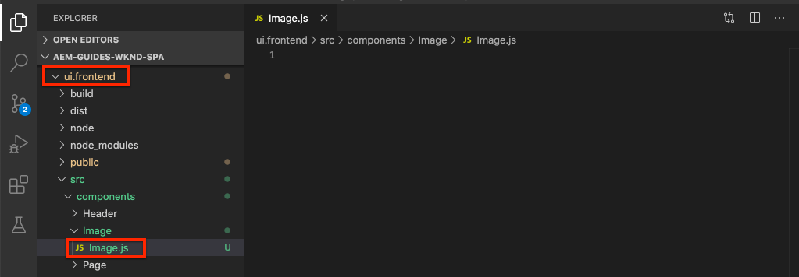

# SPA 구성 요소를 AEM 구성 요소에 매핑 {#map-components}

AEM SPA Editor JS SDK을 사용하여 React 구성 요소를 Adobe Experience Manager(AEM) 구성 요소에 매핑하는 방법을 알아봅니다. 구성 요소 매핑을 통해 사용자는 AEM SPA 편집기 내에서 기존 AEM 작성과 유사하게 SPA 구성 요소를 동적으로 업데이트할 수 있습니다.

이 장에서는 AEM JSON 모델 API에 대해 자세히 알아보고 AEM 구성 요소에 의해 노출된 JSON 콘텐츠를 React 구성 요소에 Prop으로 자동으로 주입하는 방법에 대해 살펴봅니다.

## 목표

1. AEM 구성 요소를 SPA 구성 요소에 매핑하는 방법을 알아봅니다.
1. React 구성 요소가 AEM에서 전달된 동적 속성을 사용하는 방법을 검사합니다.
1. 기본 제공 [React AEM 핵심 구성 요소](https://github.com/adobe/aem-react-core-wcm-components-examples)를 사용하는 방법에 대해 알아봅니다.

## 빌드할 내용

이 장에서는 제공된 `Text` SPA 구성 요소가 AEM `Text` 구성 요소에 매핑되는 방법을 검사합니다. `Image` SPA 구성 요소와 같은 React 핵심 구성 요소는 SPA에서 사용되고 AEM에서 작성됩니다. **레이아웃 컨테이너** 및 **템플릿 편집기** 정책의 기본 기능을 사용하여 모양이 약간 더 다양한 보기를 만들 수도 있습니다.


## 사전 요구 사항

[로컬 개발 환경](overview.md#local-dev-environment)을 설정하는 데 필요한 도구 및 지침을 검토하십시오. 이 챕터는 [SPA 통합](integrate-spa.md) 챕터의 연속이지만 SPA를 사용할 수 있는 AEM 프로젝트만 있으면 됩니다.

## 매핑 접근 방식

기본 개념은 SPA 구성 요소를 AEM 구성 요소에 매핑하는 것입니다. AEM 구성 요소, 서버측 실행, JSON 모델 API의 일부로 콘텐츠 내보내기. JSON 콘텐츠는 브라우저에서 클라이언트측을 실행하는 SPA에서 사용됩니다. SPA 구성 요소와 AEM 구성 요소 간의 1:1 매핑이 생성됩니다.


*AEM 구성 요소를 React 구성 요소에 매핑하는 방법에 대한 높은 수준의 개요*

## 텍스트 구성 요소 검사

[AEM Project Archetype](https://github.com/adobe/aem-project-archetype)은(는) AEM [텍스트 구성 요소](https://experienceleague.adobe.com/docs/experience-manager-core-components/using/components/text.html?lang=ko)에 매핑된 `Text` 구성 요소를 제공합니다. AEM에서 *content*&#x200B;을(를) 렌더링한다는 점에서 **content** 구성 요소의 예입니다.

구성 요소가 어떻게 작동하는지 살펴보겠습니다.

### JSON 모델 검사

1. SPA 코드로 이동하기 전에 AEM에서 제공하는 JSON 모델을 이해하는 것이 중요합니다. [핵심 구성 요소 라이브러리](https://www.aemcomponents.dev/content/core-components-examples/library/core-content/text.html)&#x200B;(으)로 이동하여 텍스트 구성 요소에 대한 페이지를 봅니다. 핵심 구성 요소 라이브러리는 모든 AEM 핵심 구성 요소의 예를 제공합니다.
1. 다음 예제 중 하나에 대해 **JSON** 탭을 선택하십시오.

   

   세 개의 속성(`text`, `richText` 및 `:type`)이 표시됩니다.

   `:type`은(는) AEM 구성 요소의 `sling:resourceType`(또는 경로)을(를) 나열하는 예약된 속성입니다. `:type`의 값은 AEM 구성 요소를 SPA 구성 요소에 매핑하는 데 사용되는 값입니다.

   `text` 및 `richText`은(는) SPA 구성 요소에 노출되는 추가 속성입니다.

1. [http://localhost:4502/content/wknd-spa-react/us/en.model.json](http://localhost:4502/content/wknd-spa-react/us/en.model.json)에서 JSON 출력을 봅니다. 다음과 유사한 항목을 찾을 수 있어야 합니다.

   ```json
   "text": {
       "id": "text-a647cec03a",
       "text": "<p>Hello World! Updated content!</p>\r\n",
       "richText": true,
       ":type": "wknd-spa-react/components/text",
       "dataLayer": {}
      }
   ```

### 텍스트 SPA 구성 요소 검사

1. 선택한 IDE에서 SPA용 AEM 프로젝트를 엽니다. `ui.frontend` 모듈을 확장하고 `ui.frontend/src/components/Text/Text.js`에서 `Text.js` 파일을 엽니다.

1. 검사해야 할 첫 번째 영역은 `class Text`의 ~줄 40입니다.

   ```js
   class Text extends Component {
   
       get richTextContent() {
           return (<div
                   id={extractModelId(this.props.cqPath)}
                   data-rte-editelement
                   dangerouslySetInnerHTML={{__html: DOMPurify.sanitize(this.props.text)}} />
                   );
       }
   
       get textContent() {
           return <div>{this.props.text}</div>;
       }
   
       render() {
           return this.props.richText ? this.richTextContent : this.textContent;
       }
   }
   ```

   `Text`은(는) 표준 React 구성 요소입니다. 구성 요소는 `this.props.richText`을(를) 사용하여 렌더링할 콘텐츠가 서식 있는 텍스트인지 일반 텍스트인지를 결정합니다. 사용된 실제 &quot;콘텐츠&quot;는 `this.props.text`에서 가져옵니다.

   잠재적인 XSS 공격을 방지하기 위해 콘텐츠를 렌더링하기 위해 [위험한SetInnerHTML](https://reactjs.org/docs/dom-elements.html#dangerouslysetinnerhtml)을(를) 사용하기 전에 `DOMPurify`을(를) 통해 서식 있는 텍스트가 이스케이프됩니다. 연습 앞부분에서 JSON 모델에서 `richText` 및 `text` 속성을 회수합니다.

1. `ui.frontend/src/components/import-components.js`을(를) 열고 ~86번 줄에서 `TextEditConfig`을(를) 봅니다.

   ```js
   const TextEditConfig = {
   emptyLabel: 'Text',
   
       isEmpty: function(props) {
           return !props || !props.text || props.text.trim().length < 1;
       }
   };
   ```

   위의 코드는 AEM 작성 환경에서 자리 표시자를 렌더링할 시기를 결정합니다. `isEmpty` 메서드가 **true**&#x200B;을(를) 반환하면 자리 표시자가 렌더링됩니다.

1. 마지막으로 ~94행의 `MapTo` 호출을 살펴보십시오.

   ```js
   export default MapTo('wknd-spa-react/components/text')(LazyTextComponent, TextEditConfig);
   ```

   `MapTo`은(는) AEM SPA 편집기 JS SDK(`@adobe/aem-react-editable-components`)에서 제공합니다. `wknd-spa-react/components/text` 경로는 AEM 구성 요소의 `sling:resourceType`을(를) 나타냅니다. 이 경로는 이전에 관찰된 JSON 모델에 의해 노출된 `:type`과(와) 일치합니다. `MapTo`은(는) JSON 모델 응답을 구문 분석하고 `props`(으)로 올바른 값을 SPA 구성 요소에 전달합니다.

   `ui.apps/src/main/content/jcr_root/apps/wknd-spa-react/components/text`에서 AEM `Text` 구성 요소 정의를 찾을 수 있습니다.

## React 핵심 구성 요소 사용

[AEM WCM 구성 요소 - React 코어 구현](https://github.com/adobe/aem-react-core-wcm-components-base) 및 [AEM WCM 구성 요소 - Spa 편집기 - React 코어 구현](https://github.com/adobe/aem-react-core-wcm-components-spa). 기본 AEM 구성 요소에 매핑되는 재사용 가능한 UI 구성 요소 세트입니다. 대부분의 프로젝트는 이러한 구성 요소를 자체 구현을 위한 시작점으로 다시 사용할 수 있습니다.

1. 프로젝트 코드에서 `ui.frontend/src/components`의 `import-components.js` 파일을 엽니다.
이 파일은 AEM 구성 요소에 매핑되는 모든 SPA 구성 요소를 가져옵니다. SPA 편집기 구현의 동적 특성이 주어지면 AEM 작성 가능 구성 요소에 연결된 모든 SPA 구성 요소를 명시적으로 참조해야 합니다. 이를 통해 AEM 작성자는 애플리케이션에서 원하는 위치에 구성 요소를 사용할 수 있습니다.
1. 다음 가져오기 구문에는 프로젝트에 작성된 SPA 구성 요소가 포함됩니다.

   ```js
   import './Page/Page';
   import './Text/Text';
   import './Container/Container';
   import './ExperienceFragment/ExperienceFragment';
   ```

1. `@adobe/aem-core-components-react-spa` 및 `@adobe/aem-core-components-react-base`의 다른 `imports`이(가) 몇 개 있습니다. React 코어 구성 요소를 가져와 현재 프로젝트에서 사용할 수 있도록 설정하는 것입니다. 그런 다음 이전 `Text` 구성 요소 예제와 마찬가지로 `MapTo`을(를) 사용하여 프로젝트별 AEM 구성 요소에 매핑됩니다.

### AEM 정책 업데이트

정책은 개발자와 고급 사용자가 사용할 수 있는 구성 요소를 세부적으로 제어할 수 있는 AEM 템플릿의 기능입니다. React 코어 구성 요소는 SPA 코드에 포함되어 있지만 애플리케이션에서 사용하려면 정책을 통해 활성화해야 합니다.

1. AEM 시작 화면에서 **도구** > **템플릿** > **[WKND SPA 반응](http://localhost:4502/libs/wcm/core/content/sites/templates.html/conf/wknd-spa-react)**(으)로 이동합니다.

1. 편집할 **SPA 페이지** 템플릿을 선택하고 엽니다.

1. **레이아웃 컨테이너**&#x200B;를 선택하고 **정책** 아이콘을 클릭하여 정책을 편집합니다.

   

1. **허용된 구성 요소** > **WKND SPA 반응 - 콘텐츠** > 확인 **이미지**, **티저** 및 **제목**&#x200B;에서.

   

   **기본 구성 요소** > **매핑 추가**&#x200B;에서 **이미지 - WKND SPA React - 콘텐츠** 구성 요소를 선택합니다.

   

   `image/*`의 **mime 유형**&#x200B;을(를) 입력하십시오.

   정책 업데이트를 저장하려면 **완료**&#x200B;를 클릭하십시오.

1. **레이아웃 컨테이너**&#x200B;에서 **Text** 구성 요소에 대한 **정책** 아이콘을 클릭합니다.

   **WKND SPA 텍스트**(이)라는 새 정책을 만듭니다. **플러그인** > **서식** > 모든 상자를 선택하여 추가 서식 옵션을 사용하도록 설정합니다.

   

   **플러그인** > **단락 스타일** > **단락 스타일 사용** 확인란을 선택합니다.

   

   정책 업데이트를 저장하려면 **완료**&#x200B;를 클릭하십시오.

### 콘텐츠 작성

1. **홈 페이지** [http://localhost:4502/editor.html/content/wknd-spa-react/us/en/home.html](http://localhost:4502/editor.html/content/wknd-spa-react/us/en/home.html)&#x200B;(으)로 이동합니다.

1. 이제 페이지에서 추가 구성 요소 **이미지**, **티저** 및 **제목**&#x200B;을 사용할 수 있습니다.

   

1. **전체 화면** 모드에서 `Text` 구성 요소를 편집하고 추가 단락 스타일을 추가할 수도 있습니다.

   

1. **자산 파인더**&#x200B;에서 이미지를 드래그 앤 드롭할 수도 있습니다.

   

1. **Title** 및 **Teaser** 구성 요소를 사용한 경험.

1. [AEM Assets](http://localhost:4502/assets.html/content/dam)를 통해 자신의 이미지를 추가하거나 표준 [WKND 참조 사이트](https://github.com/adobe/aem-guides-wknd/releases/latest)에 대한 완성된 코드 베이스를 설치하십시오. [WKND 참조 사이트](https://github.com/adobe/aem-guides-wknd/releases/latest)에 WKND SPA에서 다시 사용할 수 있는 많은 이미지가 포함되어 있습니다. 패키지는 [AEM의 패키지 관리자](http://localhost:4502/crx/packmgr/index.jsp)를 사용하여 설치할 수 있습니다.

   

## 레이아웃 컨테이너 검사

**레이아웃 컨테이너**&#x200B;에 대한 지원은 AEM SPA Editor SDK에서 자동으로 제공됩니다. **레이아웃 컨테이너**&#x200B;은(는) **컨테이너** 구성 요소입니다. 컨테이너 구성 요소는 *other* 구성 요소를 나타내고 동적으로 인스턴스화하는 JSON 구조를 수락하는 구성 요소입니다.

레이아웃 컨테이너를 더 검사해 보겠습니다.

1. 브라우저에서 [http://localhost:4502/content/wknd-spa-react/us/en.model.json](http://localhost:4502/content/wknd-spa-react/us/en.model.json)&#x200B;(으)로 이동

   

   **레이아웃 컨테이너** 구성 요소에 `wcm/foundation/components/responsivegrid`의 `sling:resourceType`이(가) 있으며, `Text` 및 `Image` 구성 요소와 마찬가지로 `:type` 속성을 사용하여 SPA 편집기에서 인식됩니다.

   SPA 편집기에서 [레이아웃 모드](https://experienceleague.adobe.com/docs/experience-manager-65/authoring/siteandpage/responsive-layout.html?lang=ko#defining-layouts-layout-mode)를 사용하여 구성 요소 크기를 다시 조정하는 것과 동일한 기능을 사용할 수 있습니다.

2. [http://localhost:4502/editor.html/content/wknd-spa-react/us/en/home.html](http://localhost:4502/editor.html/content/wknd-spa-react/us/en/home.html)&#x200B;(으)로 돌아갑니다. **이미지** 구성 요소를 추가하고 **레이아웃** 옵션을 사용하여 크기를 다시 조정해 보십시오.

   

3. JSON 모델 [http://localhost:4502/content/wknd-spa-react/us/en.model.json](http://localhost:4502/content/wknd-spa-react/us/en.model.json)을(를) 다시 열고 `columnClassNames`을(를) JSON의 일부로 관찰합니다.

   

   클래스 이름 `aem-GridColumn--default--4`은(는) 구성 요소의 너비가 12개 열 그리드를 기준으로 4열이어야 함을 나타냅니다. [응답형 격자에 대한 자세한 내용은 여기](https://adobe-marketing-cloud.github.io/aem-responsivegrid/)를 참조하십시오.

4. IDE로 돌아가서 `ui.apps` 모듈에 `ui.apps/src/main/content/jcr_root/apps/wknd-spa-react/clientlibs/clientlib-grid`에 정의된 클라이언트측 라이브러리가 있습니다. `less/grid.less` 파일을 엽니다.

   이 파일은 **레이아웃 컨테이너**&#x200B;에서 사용하는 중단점(`default`, `tablet` 및 `phone`)을 결정합니다. 이 파일은 프로젝트 사양에 따라 사용자 지정하기 위한 것입니다. 현재 중단점은 `1200px` 및 `768px`(으)로 설정되어 있습니다.

5. `Text` 구성 요소의 응답형 기능과 업데이트된 서식 있는 텍스트 정책을 사용하여 다음과 같은 보기를 작성할 수 있어야 합니다.

   

## 축하합니다! {#congratulations}

축하합니다. SPA 구성 요소를 AEM 구성 요소에 매핑하는 방법을 배웠고 React 핵심 구성 요소를 사용했습니다. 또한 **레이아웃 컨테이너**&#x200B;의 응답형 기능을 살펴볼 수 있습니다.

### 다음 단계 {#next-steps}

[탐색 및 라우팅](navigation-routing.md) - SPA 편집기 SDK을 사용하여 AEM 페이지에 매핑하여 SPA에서 여러 보기를 지원하는 방법에 대해 알아봅니다. 동적 탐색은 React Router 및 React 핵심 구성 요소를 사용하여 구현됩니다.

## (보너스) 소스 제어에 구성을 유지합니다. {#bonus-configs}

대부분의 경우, 특히 AEM 프로젝트 시작 시 소스 제어에 템플릿 및 관련 콘텐츠 정책과 같은 구성을 유지하는 것이 중요합니다. 이렇게 하면 모든 개발자가 동일한 콘텐츠 및 구성 세트에 대해 작업하고 환경 간에 추가적인 일관성을 보장할 수 있습니다. 일단 프로젝트가 일정 수준의 완성도에 도달하면 템플릿을 관리하는 관행을 특별한 고급 사용자 그룹에게 이관할 수 있습니다.

다음 몇 단계는 Visual Studio Code IDE 및 [VSCode AEM 동기화](https://marketplace.visualstudio.com/items?itemName=yamato-ltd.vscode-aem-sync)를 사용하지만 AEM의 로컬 인스턴스에서 **끌어오기** 또는 **가져오기** 콘텐츠를 사용하도록 구성한 모든 도구와 IDE를 사용하여 수행할 수 있습니다.

1. Visual Studio 코드 IDE에서 Marketplace 확장을 통해 **VSCode AEM Sync**&#x200B;가 설치되어 있는지 확인합니다.

   

2. 프로젝트 탐색기에서 **ui.content** 모듈을 확장하고 `/conf/wknd-spa-react/settings/wcm/templates`(으)로 이동합니다.

3. `templates` 폴더를 **마우스 오른쪽 단추로 클릭**&#x200B;하고 **AEM 서버에서 가져오기**&#x200B;를 선택합니다.

   

4. 콘텐츠를 가져오려면 단계를 반복하되 `/conf/wknd-spa-react/settings/wcm/templates/policies`에 있는 **정책** 폴더를 선택하십시오.

5. `ui.content/src/main/content/META-INF/vault/filter.xml`에 있는 `filter.xml` 파일을 검사합니다.

   ```xml
   <!--ui.content filter.xml-->
   <?xml version="1.0" encoding="UTF-8"?>
    <workspaceFilter version="1.0">
        <filter root="/conf/wknd-spa-react" mode="merge"/>
        <filter root="/content/wknd-spa-react" mode="merge"/>
        <filter root="/content/dam/wknd-spa-react" mode="merge"/>
        <filter root="/content/experience-fragments/wknd-spa-react" mode="merge"/>
    </workspaceFilter>
   ```

   `filter.xml` 파일은 패키지와 함께 설치된 노드의 경로를 식별합니다. 각 필터에서 `mode="merge"`을(를) 확인합니다. 이는 기존 콘텐츠는 수정되지 않고 새 콘텐츠만 추가됨을 나타냅니다. 콘텐츠 작성자가 이러한 경로를 업데이트할 수 있으므로 코드 배포는 콘텐츠를 **덮어쓰지**&#x200B;하지 않는 것이 중요합니다. 필터 요소 작업에 대한 자세한 내용은 [FileVault 설명서](https://jackrabbit.apache.org/filevault/filter.html)를 참조하십시오.

   `ui.content/src/main/content/META-INF/vault/filter.xml`과(와) `ui.apps/src/main/content/META-INF/vault/filter.xml`을(를) 비교하여 각 모듈에서 관리하는 다른 노드를 이해합니다.

## (보너스) 사용자 지정 이미지 구성 요소 만들기 {#bonus-image}

SPA 이미지 구성 요소는 React 핵심 구성 요소에서 이미 제공했습니다. 그러나 추가 연습이 필요하면 AEM [이미지 구성 요소](https://experienceleague.adobe.com/docs/experience-manager-core-components/using/components/image.html?lang=ko)에 매핑되는 React 구현을 직접 만드십시오. `Image` 구성 요소는 **content** 구성 요소의 또 다른 예입니다.

### JSON 검사

SPA 코드로 이동하기 전에 AEM에서 제공하는 JSON 모델을 검사합니다.

1. [핵심 구성 요소 라이브러리의 이미지 예제](https://www.aemcomponents.dev/content/core-components-examples/library/core-content/image.html)&#x200B;(으)로 이동합니다.

   

   `src`, `alt` 및 `title`의 속성은 SPA `Image` 구성 요소를 채우는 데 사용됩니다.

   >[!NOTE]
   >
   > 개발자가 적응형 및 소극적 로드 구성 요소를 만들 수 있는 다른 이미지 속성(`lazyEnabled`, `widths`)이 노출되어 있습니다. 이 자습서에 빌드된 구성 요소는 간단하며 **이러한 고급 속성을 사용하지 않습니다**.

### 이미지 구성 요소 구현

1. 그런 다음 `ui.frontend/src/components` 아래에 `Image`(이)라는 새 폴더를 만듭니다.
1. `Image` 폴더 아래에서 `Image.js`(이)라는 새 파일을 만듭니다.

   

1. 다음 `import` 문을 `Image.js`에 추가합니다.

   ```js
   import React, {Component} from 'react';
   import {MapTo} from '@adobe/aem-react-editable-components';
   ```

1. 그런 다음 `ImageEditConfig`을(를) 추가하여 AEM에 자리 표시자를 표시할 시기를 결정합니다.

   ```js
   export const ImageEditConfig = {
   
       emptyLabel: 'Image',
   
       isEmpty: function(props) {
           return !props || !props.src || props.src.trim().length < 1;
       }
   };
   ```

   `src` 속성이 설정되지 않은 경우 자리 표시자가 표시됩니다.

1. 다음으로 `Image` 클래스를 구현합니다.

   ```js
    export default class Image extends Component {
   
       get content() {
           return ;
       }
   
       render() {
           if(ImageEditConfig.isEmpty(this.props)) {
               return null;
           }
   
           return (
                   <div className="Image">
                       {this.content}
                   </div>
           );
       }
   }
   ```

   위의 코드는 JSON 모델에서 전달된 prop `src`, `alt` 및 `title`을(를) 기반으로 ``을(를) 렌더링합니다.

1. React 구성 요소를 AEM 구성 요소에 매핑하려면 `MapTo` 코드를 추가하십시오.

   ```js
   MapTo('wknd-spa-react/components/image')(Image, ImageEditConfig);
   ```

   `wknd-spa-react/components/image` 문자열은 `ui.apps`의 `ui.apps/src/main/content/jcr_root/apps/wknd-spa-react/components/image`에 있는 AEM 구성 요소의 위치에 해당합니다.

1. 같은 디렉터리에 이름이 `Image.css`인 새 파일을 만들고 다음을 추가합니다.

   ```scss
   .Image-src {
       margin: 1rem 0;
       width: 100%;
       border: 0;
   }
   ```

1. `Image.js`에서 `import` 문 아래 맨 위에 있는 파일에 대한 참조를 추가합니다.

   ```js
   import React, {Component} from 'react';
   import {MapTo} from '@adobe/aem-react-editable-components';
   
   require('./Image.css');
   ```

1. `ui.frontend/src/components/import-components.js` 파일을 열고 새 `Image` 구성 요소에 대한 참조를 추가합니다.

   ```js
   import './Page/Page';
   import './Text/Text';
   import './Container/Container';
   import './ExperienceFragment/ExperienceFragment';
   import './Image/Image'; //add reference to Image component
   ```

1. `import-components.js`에서 React 핵심 구성 요소 이미지를 주석 처리합니다.

   ```js
   //MapTo('wknd-spa-react/components/image')(ImageV2, {isEmpty: ImageV2IsEmptyFn});
   ```

   이렇게 하면 사용자 지정 이미지 구성 요소가 대신 사용됩니다.

1. 프로젝트의 루트에서 Maven을 사용하여 AEM에 SPA 코드 배포:

   ```shell
   $ cd aem-guides-wknd-spa.react
   $ mvn clean install -PautoInstallSinglePackage
   ```

1. AEM에서 SPA를 검사합니다. 페이지의 모든 이미지 구성 요소는 계속 작동해야 합니다. 렌더링된 출력을 검사하면 React 코어 구성 요소 대신 사용자 지정 이미지 구성 요소에 대한 마크업이 표시됩니다.

   *사용자 지정 이미지 구성 요소 마크업*

   ```html
   <div class="Image">
       
   </div>
   ```

   *React 핵심 구성 요소 이미지 마크업*

   ```html
   <div class="cmp-image cq-dd-image">
       
   </div>
   ```

   자체 구성 요소를 확장하고 구현하는 방법을 소개합니다.
