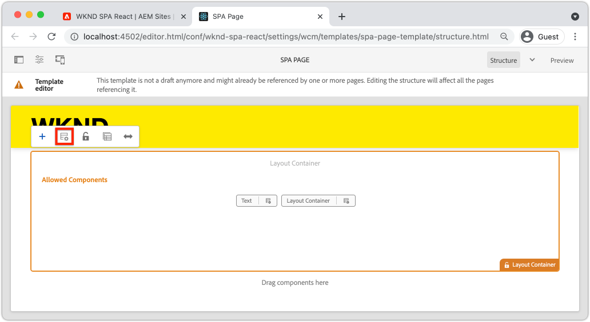
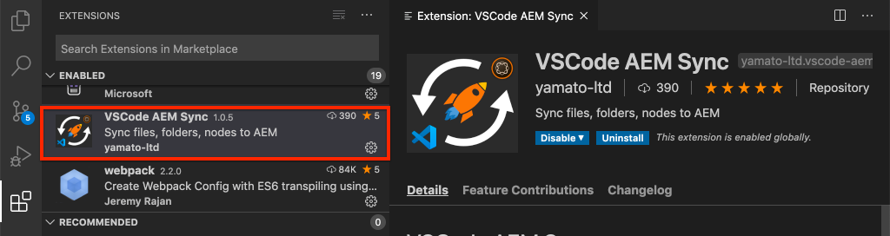

# AEM 구성 요소에 SPA 구성 요소 매핑 {#map-components}

AEM SPA Editor JS SDK를 사용하여 AEM(Adobe Experience Manager) 구성 요소에 React 구성 요소를 매핑하는 방법을 알아봅니다. 구성 요소 매핑을 사용하면 기존 AEM 작성과 유사하게 AEM SPA 편집기 내에서 SPA 구성 요소를 동적으로 업데이트할 수 있습니다.

이 장에서는 AEM JSON 모델 API와 AEM 구성 요소에 의해 노출된 JSON 컨텐츠를 prop으로 React 구성 요소에 자동으로 삽입할 수 있는 방법에 대해 자세히 살펴봅니다.

## 목표

1. AEM 구성 요소를 SPA 구성 요소에 매핑하는 방법을 알아봅니다.
1. Inspect에서 React 구성 요소가 AEM에서 전달된 동적 속성을 사용하는 방법입니다.
1. [React AEM Core Components](https://github.com/adobe/aem-react-core-wcm-components-examples) 곧바로 사용하는 방법을 알아봅니다.

## 빌드할 내용

이 장에서는 제공된 `Text` SPA 구성 요소가 AEM `Text`구성 요소에 매핑되는 방식을 검사합니다. `Image` SPA 구성 요소와 같은 React Core 구성 요소는 SPA에서 사용되고 AEM에서 작성됩니다. **레이아웃 컨테이너** 및 **템플릿 편집기** 정책의 기본 기능도 사용하여 모양에서 약간 더 다양한 보기를 만듭니다.


## 전제 조건

[로컬 개발 환경](overview.md#local-dev-environment)을 설정하는 데 필요한 도구 및 지침을 검토하십시오. 이 장은 [SPA](integrate-spa.md) 장을 통합하지만, SPA이 활성화된 AEM 프로젝트를 수행하는 데 필요한 모든 작업은 계속됩니다.

## 매핑 방법

기본 개념은 SPA 구성 요소를 AEM 구성 요소에 매핑하는 것입니다. AEM 구성 요소를 실행하고, 서버측을 실행하고, JSON 모델 API의 일부로 컨텐츠를 내보냅니다. JSON 콘텐츠는 브라우저에서 클라이언트측을 실행하는 SPA에 의해 사용됩니다. SPA 구성 요소와 AEM 구성 요소 간의 1:1 매핑이 만들어집니다.


*AEM 구성 요소를 React 구성 요소에 매핑하는 것에 대한 개요*

## 텍스트 구성 요소의 Inspect

[AEM Project Archetype](https://github.com/adobe/aem-project-archetype)은 AEM [텍스트 구성 요소](https://experienceleague.adobe.com/docs/experience-manager-core-components/using/components/text.html)에 매핑되는 `Text` 구성 요소를 제공합니다. AEM에서 *content*&#x200B;를 렌더링한다는 점에서 **content** 구성 요소의 예입니다.

구성 요소가 어떻게 작동하는지 살펴보겠습니다.

### JSON 모델을 Inspect 합니다.

1. SPA 코드로 이동하기 전에 AEM에서 제공하는 JSON 모델을 이해하는 것이 중요합니다. [코어 구성 요소 라이브러리](https://www.aemcomponents.dev/content/core-components-examples/library/page-authoring/text.html)로 이동하여 텍스트 구성 요소에 대한 페이지를 확인합니다. 코어 구성 요소 라이브러리는 모든 AEM 코어 구성 요소의 예를 제공합니다.
1. 다음 예 중 하나에 대해 **JSON** 탭을 선택합니다.

   

   다음 세 가지 속성이 표시됩니다. `text`, `richText` 및 `:type`

   `:type` 는 AEM 구성 요소의  `sling:resourceType` (또는 경로)를 나열하는 예약된 속성입니다. `:type` 값은 AEM 구성 요소를 SPA 구성 요소에 매핑하는 데 사용되는 값입니다.

   `text` 및  `richText` 는 SPA 구성 요소에 노출될 추가 속성입니다.

1. [http://localhost:4502/content/wknd-spa-react/us/en.model.json](http://localhost:4502/content/wknd-spa-react/us/en.model.json)에서 JSON 출력을 봅니다. 다음과 유사한 항목을 찾을 수 있습니다.

   ```json
   "text": {
       "id": "text-a647cec03a",
       "text": "<p>Hello World! Updated content!</p>\r\n",
       "richText": true,
       ":type": "wknd-spa-react/components/text",
       "dataLayer": {}
      }
   ```

### 텍스트 SPA 구성 요소의 Inspect

1. 선택한 IDE에서 SPA용 AEM 프로젝트를 엽니다. `ui.frontend` 모듈을 확장하고 `ui.frontend/src/components/Text/Text.js` 아래에서 `Text.js` 파일을 엽니다.

1. 검사할 첫 번째 영역은 `class Text`( ~40행)입니다.

   ```js
   class Text extends Component {
   
       get richTextContent() {
           return (<div
                   id={extractModelId(this.props.cqPath)}
                   data-rte-editelement
                   dangerouslySetInnerHTML={{__html: DOMPurify.sanitize(this.props.text)}} />
                   );
       }
   
       get textContent() {
           return <div>{this.props.text}</div>;
       }
   
       render() {
           return this.props.richText ? this.richTextContent : this.textContent;
       }
   }
   ```

   `Text` 는 표준 React 구성 요소입니다. 구성 요소는 `this.props.richText` 을 사용하여 렌더링할 컨텐츠가 리치 텍스트인지 아니면 일반 텍스트인지를 결정합니다. 사용되는 실제 &quot;컨텐츠&quot;는 `this.props.text`에서 가져옵니다.

   잠재적 XSS 공격을 방지하기 위해 리치 텍스트는 [dangeroomSetInnerHTML](https://reactjs.org/docs/dom-elements.html#dangerouslysetinnerhtml)을 사용하여 컨텐츠를 렌더링하기 전에 `DOMPurify`을 통해 이스케이프됩니다. 연습의 앞부분에서 JSON 모델에서 `richText` 및 `text` 속성을 기억하십시오.

1. 다음으로 ~29행의 `TextEditConfig`을 살펴 보십시오.

   ```js
   const TextEditConfig = {
   emptyLabel: 'Text',
   
       isEmpty: function(props) {
           return !props || !props.text || props.text.trim().length < 1;
       }
   };
   ```

   위의 코드는 AEM 작성 환경에서 자리 표시자를 렌더링할 시기를 결정합니다. `isEmpty` 메서드가 **true**&#x200B;를 반환하는 경우 자리 표시자가 렌더링됩니다.

1. 마지막으로 ~62행에서 `MapTo` 호출을 살펴보십시오.

   ```js
   export default MapTo('wknd-spa-react/components/text')(Text, TextEditConfig);
   ```

   `MapTo` 는 AEM SPA Editor JS SDK(`@adobe/aem-react-editable-components`)에서 제공합니다. 경로 `wknd-spa-react/components/text`은 AEM 구성 요소의 `sling:resourceType`을 나타냅니다. 이 경로는 이전에 관찰된 JSON 모델에 의해 노출된 `:type`과 일치합니다. `MapTo` 는 JSON 모델 응답을 구문 분석하고 올바른 값을 SPA 구성 요소 `props` 에 전달해야 합니다.

   `ui.apps/src/main/content/jcr_root/apps/wknd-spa-react/components/text`에서 AEM `Text` 구성 요소 정의를 찾을 수 있습니다.

## React 코어 구성 요소 사용

[AEM WCM 구성 요소 - React Core ](https://github.com/adobe/aem-react-core-wcm-components-base) 구현 및  [AEM WCM 구성 요소 - Spa 편집기 - React Core 구현](https://github.com/adobe/aem-react-core-wcm-components-spa). 이는 즉시 사용 가능한 AEM 구성 요소에 매핑되는 재사용 가능한 UI 구성 요소 세트입니다. 대부분의 프로젝트는 이러한 구성 요소를 자체 구현의 시작점으로 다시 사용할 수 있습니다.

1. 프로젝트 코드에서 `ui.frontend/src/components`에 있는 `import-components.js` 파일을 엽니다.
이 파일은 AEM 구성 요소에 매핑되는 모든 SPA 구성 요소를 가져옵니다. SPA 편집기 구현의 동적 특성을 고려할 때, AEM 작성 가능한 구성 요소에 연결된 모든 SPA 구성 요소를 명시적으로 참조해야 합니다. 이렇게 하면 AEM 작성자는 애플리케이션에서 원하는 위치에 구성 요소를 사용할 수 있습니다.
1. 다음 가져오기 구문에는 프로젝트에 작성된 SPA 구성 요소가 포함됩니다.

   ```js
   import './Page/Page';
   import './Text/Text';
   import './Container/Container';
   import './ExperienceFragment/ExperienceFragment';
   ```

1. `@adobe/aem-core-components-react-spa` 및 `@adobe/aem-core-components-react-base`의 다른 `imports`이 여러 개 있습니다. React 코어 구성 요소를 가져와 현재 프로젝트에서 사용할 수 있도록 하는 것입니다. 그런 다음 `Text` 구성 요소 예와 마찬가지로 `MapTo`을 사용하여 프로젝트별 AEM 구성 요소에 매핑됩니다.

### AEM 정책 업데이트

정책은 AEM 템플릿의 기능으로 개발자와 고급 사용자가 사용할 수 있는 구성 요소를 세부적으로 제어할 수 있습니다. React 코어 구성 요소는 SPA 코드에 포함되어 있지만, 애플리케이션에서 사용하려면 정책을 통해 활성화해야 합니다.

1. AEM 시작 화면에서 **도구** > **템플릿** > **[WKND SPA React](http://localhost:4502/libs/wcm/core/content/sites/templates.html/conf/wknd-spa-react)**&#x200B;로 이동합니다.

1. 을(를) 선택하고 편집할 **SPA Page** 템플릿을 엽니다.

1. **레이아웃 컨테이너**&#x200B;를 선택하고 **정책** 아이콘을 클릭하여 정책을 편집합니다.

   

1. **허용된 구성 요소** > **WKND SPA React - Content** >에서 **이미지**, **Teaser** 및 **Title**&#x200B;을 선택합니다.

   

   **기본 구성 요소** > **매핑**&#x200B;추가 아래에서 **이미지 - WKND SPA React - Content** 구성 요소를 선택합니다.

   

   `image/*`의 **mime 유형**&#x200B;을 입력합니다.

   **완료**&#x200B;를 클릭하여 정책 업데이트를 저장합니다.

1. **레이아웃 컨테이너**&#x200B;에서 **Text** 구성 요소에 대한 **정책** 아이콘을 클릭합니다.

   **WKND SPA Text**&#x200B;라는 새 정책을 만듭니다. **Plugins** > **Formatting** >에서 모든 상자를 선택하여 추가 서식 옵션을 활성화합니다.

   

   **Plugins** > **Paragraph Styles** >에서 **단락 스타일 활성화** 상자를 선택합니다.

   

   **완료**&#x200B;를 클릭하여 정책 업데이트를 저장합니다.

### 컨텐츠 작성

1. **Homepage** [http://localhost:4502/editor.html/content/wknd-spa-react/us/en/home.html](http://localhost:4502/editor.html/content/wknd-spa-react/us/en/home.html)로 이동합니다.

1. 이제 페이지에서 추가 구성 요소 **이미지**, **Teaser** 및 **제목**&#x200B;을 사용할 수 있습니다.

   

1. `Text` 구성 요소를 편집하고 **전체 화면** 모드에서 추가 단락 스타일을 추가할 수도 있습니다.

   

1. **자산 파인더**&#x200B;에서 이미지를 드래그 앤 드롭할 수도 있습니다.

   

1. **제목** 및 **Teaser** 구성 요소가 있는 경험.

1. [AEM Assets](http://localhost:4502/assets.html/content/dam)을 통해 자신의 이미지를 추가하거나 표준 [WKND 참조 사이트](https://github.com/adobe/aem-guides-wknd/releases/latest)에 대해 완료된 코드 베이스를 설치합니다. [WKND 참조 사이트](https://github.com/adobe/aem-guides-wknd/releases/latest)에는 WKND SPA에서 다시 사용할 수 있는 많은 이미지가 포함되어 있습니다. 패키지는 [AEM 패키지 관리자](http://localhost:4502/crx/packmgr/index.jsp)를 사용하여 설치할 수 있습니다.

   

## 레이아웃 컨테이너 Inspect

**레이아웃 컨테이너**&#x200B;에 대한 지원은 AEM SPA Editor SDK에서 자동으로 제공합니다. **레이아웃 컨테이너**&#x200B;는 **컨테이너** 구성 요소입니다. 컨테이너 구성 요소는 *기타* 구성 요소를 나타내고 동적으로 인스턴스화하는 JSON 구조를 허용하는 구성 요소입니다.

레이아웃 컨테이너를 더 살펴보겠습니다.

1. 브라우저에서 [http://localhost:4502/content/wknd-spa-react/us/en.model.json](http://localhost:4502/content/wknd-spa-react/us/en.model.json)로 이동합니다.

   

   **레이아웃 컨테이너** 구성 요소에는 `wcm/foundation/components/responsivegrid`의 `sling:resourceType`가 있으며, `Text` 및 `Image` 구성 요소처럼 `:type` 속성을 사용하여 SPA 편집기에서 인식됩니다.

   SPA 편집기에서 [레이아웃 모드](https://experienceleague.adobe.com/docs/experience-manager-65/authoring/siteandpage/responsive-layout.html#defining-layouts-layout-mode)를 사용하여 구성 요소의 크기를 다시 조정하는 동일한 기능을 사용할 수 있습니다.

2. [http://localhost:4502/editor.html/content/wknd-spa-react/us/en/home.html](http://localhost:4502/editor.html/content/wknd-spa-react/us/en/home.html)로 돌아갑니다. **이미지** 구성 요소를 더 추가하고 **레이아웃** 옵션을 사용하여 구성 요소의 크기를 다시 조정해 보십시오.

   

3. JSON 모델 [http://localhost:4502/content/wknd-spa-react/us/en.model.json](http://localhost:4502/content/wknd-spa-react/us/en.model.json)을 다시 열고 JSON의 일부로 `columnClassNames`를 관찰합니다.

   

   클래스 이름 `aem-GridColumn--default--4`은 구성 요소가 12개의 열 그리드를 기준으로 4개의 열 너비여야 함을 나타냅니다. [응답형 그리드에 대한 자세한 내용은 여기](https://adobe-marketing-cloud.github.io/aem-responsivegrid/)에서 확인할 수 있습니다.

4. IDE로 돌아가서 `ui.apps` 모듈에는 `ui.apps/src/main/content/jcr_root/apps/wknd-spa-react/clientlibs/clientlib-grid`에 정의된 클라이언트측 라이브러리가 있습니다. `less/grid.less` 파일을 엽니다.

   이 파일은 **레이아웃 컨테이너**&#x200B;에 사용되는 중단점(`default`, `tablet` 및 `phone`)을 결정합니다. 이 파일은 프로젝트 사양에 따라 사용자 지정되기 위한 것입니다. 현재 중단점은 `1200px` 및 `768px`로 설정됩니다.

5. 응답형 기능 및 `Text` 구성 요소의 업데이트된 리치 텍스트 정책을 사용하여 다음과 같은 보기를 작성할 수 있어야 합니다.

   

## 축하합니다! {#congratulations}

축하합니다. SPA 구성 요소를 AEM 구성 요소에 매핑하는 방법을 배우고 React 코어 구성 요소를 사용했습니다. 또한 **레이아웃 컨테이너**&#x200B;의 응답형 기능을 탐색할 수 있습니다.

### 다음 단계 {#next-steps}

[탐색 및 라우팅](navigation-routing.md)  - SPA Editor SDK를 사용하여 AEM 페이지에 매핑하여 SPA에서 여러 보기를 지원하는 방법을 알아봅니다. 동적 탐색은 React Router 및 React Core 구성 요소를 사용하여 구현됩니다.

## (보너스) 소스 제어에 구성을 유지합니다. {#bonus-configs}

대부분의 경우, 특히 AEM 프로젝트 시작 시 템플릿 및 관련 컨텐츠 정책과 같은 구성을 소스 제어에 유지하는 것이 중요합니다. 이렇게 하면 모든 개발자가 동일한 컨텐츠 및 구성 세트에 대해 작업하고 있으므로 환경 간에 추가적인 일관성을 유지할 수 있습니다. 프로젝트가 일정 수준의 성숙기에 도달하면 템플릿 관리 방법을 특수 사용자 그룹으로 전환할 수 있습니다.

다음 몇 단계는 Visual Studio 코드 IDE 및 [VSCode AEM 동기화](https://marketplace.visualstudio.com/items?itemName=yamato-ltd.vscode-aem-sync)를 사용하여 수행되지만, AEM의 로컬 인스턴스에서 **pull** 또는 **import** 콘텐츠를 가져오도록 구성한 도구 및 IDE를 사용하여 수행할 수 있습니다.

1. Visual Studio 코드 IDE에서 Marketplace 확장을 통해 **VSCode AEM Sync**&#x200B;가 설치되어 있는지 확인합니다.

   

2. 프로젝트 탐색기에서 **ui.content** 모듈을 확장하고 `/conf/wknd-spa-react/settings/wcm/templates`로 이동합니다.

3. **마우스 오른쪽** 단추+폴더를  `templates` 클릭하고  **AEM Server에서 가져오기**&#x200B;를 선택합니다.

   

4. 단계를 반복하여 컨텐츠를 가져오지만 `/conf/wknd-spa-react/settings/wcm/templates/policies`에 있는 **정책** 폴더를 선택합니다.

5. Inspect은 `ui.content/src/main/content/META-INF/vault/filter.xml`에 있는 `filter.xml` 파일입니다.

   ```xml
   <!--ui.content filter.xml-->
   <?xml version="1.0" encoding="UTF-8"?>
    <workspaceFilter version="1.0">
        <filter root="/conf/wknd-spa-react" mode="merge"/>
        <filter root="/content/wknd-spa-react" mode="merge"/>
        <filter root="/content/dam/wknd-spa-react" mode="merge"/>
        <filter root="/content/experience-fragments/wknd-spa-react" mode="merge"/>
    </workspaceFilter>
   ```

   `filter.xml` 파일은 패키지와 함께 설치할 노드의 경로를 식별해야 합니다. 기존 컨텐츠가 수정되지 않고 새 컨텐츠만 추가된다는 것을 나타내는 각 필터에 대해 `mode="merge"`이 표시됩니다. 컨텐츠 작성자는 이러한 경로를 업데이트할 수 있으므로 코드 배포에서 **이 컨텐츠를 덮어쓰지 않는 것이 중요합니다.** 필터 요소 작업에 대한 자세한 내용은 [FileVault 설명서](https://jackrabbit.apache.org/filevault/filter.html)를 참조하십시오.

   `ui.content/src/main/content/META-INF/vault/filter.xml` 및 `ui.apps/src/main/content/META-INF/vault/filter.xml` 를 비교하여 각 모듈에서 관리하는 서로 다른 노드를 파악합니다.

## (보너스) 사용자 지정 이미지 구성 요소 만들기 {#bonus-image}

React Core 구성 요소에서 이미 SPA 이미지 구성 요소를 제공했습니다. 그러나 추가 작업이 필요한 경우 AEM [이미지 구성 요소](https://experienceleague.adobe.com/docs/experience-manager-core-components/using/components/image.html)에 매핑되는 자체 React 구현을 만드십시오. `Image` 구성 요소는 **content** 구성 요소의 다른 예입니다.

### JSON의 Inspect

SPA 코드로 이동하기 전에 AEM에서 제공하는 JSON 모델을 검사하십시오.

1. 코어 구성 요소 라이브러리](https://www.aemcomponents.dev/content/core-components-examples/library/page-authoring/image.html)의 [이미지 예제로 이동합니다.

   

   `src`, `alt` 및 `title`의 속성은 SPA `Image` 구성 요소를 채우는 데 사용됩니다.

   >[!NOTE]
   >
   > 개발자가 적응형 및 지연 로드 구성 요소를 만들 수 있는 다른 이미지 속성(`lazyEnabled`, `widths`)이 노출됩니다. 이 자습서에 빌드된 구성 요소는 간단하며 **이 이러한 고급 속성을 사용하지 않습니다.**

### 이미지 구성 요소 구현

1. 그런 다음 `ui.frontend/src/components` 아래에 `Image` 라는 새 폴더를 만듭니다.
1. `Image` 폴더 아래에 `Image.js` 라는 새 파일이 만들어집니다.

   

1. 다음 `import` 문을 `Image.js`에 추가합니다.

   ```js
   import React, {Component} from 'react';
   import {MapTo} from '@adobe/aem-react-editable-components';
   ```

1. 그런 다음 `ImageEditConfig` 을 추가하여 AEM에서 자리 표시자를 표시할 시기를 결정합니다.

   ```js
   export const ImageEditConfig = {
   
       emptyLabel: 'Image',
   
       isEmpty: function(props) {
           return !props || !props.src || props.src.trim().length < 1;
       }
   };
   ```

   `src` 속성이 설정되지 않은 경우 자리 표시자가 표시됩니다.

1. 다음으로 `Image` 클래스를 구현합니다.

   ```js
    export default class Image extends Component {
   
       get content() {
           return ;
       }
   
       render() {
           if(ImageEditConfig.isEmpty(this.props)) {
               return null;
           }
   
           return (
                   <div className="Image">
                       {this.content}
                   </div>
           );
       }
   }
   ```

   위의 코드는 JSON 모델에 의해 전달된 props `src`, `alt` 및 `title`를 기반으로 ``을 렌더링합니다.

1. `MapTo` 코드를 추가하여 React 구성 요소를 AEM 구성 요소에 매핑합니다.

   ```js
   MapTo('wknd-spa-react/components/image')(Image, ImageEditConfig);
   ```

   `wknd-spa-react/components/image` 문자열은 `ui.apps`에 있는 AEM 구성 요소의 위치에 해당합니다. `ui.apps/src/main/content/jcr_root/apps/wknd-spa-react/components/image`

1. 같은 디렉토리에 `Image.css` 라는 새 파일을 만들고 다음을 추가합니다.

   ```scss
   .Image-src {
       margin: 1rem 0;
       width: 100%;
       border: 0;
   }
   ```

1. `Image.js`에서 `import` 문 아래의 맨 위에 있는 파일에 대한 참조를 추가합니다.

   ```js
   import React, {Component} from 'react';
   import {MapTo} from '@adobe/aem-react-editable-components';
   
   require('./Image.css');
   ```

1. `ui.frontend/src/components/import-components.js` 파일을 열고 새 `Image` 구성 요소에 대한 참조를 추가합니다.

   ```js
   import './Page/Page';
   import './Text/Text';
   import './Container/Container';
   import './ExperienceFragment/ExperienceFragment';
   import './Image/Image'; //add reference to Image component
   ```

1. `import-components.js`에서 React Core Component 이미지에 주석을 답니다.

   ```js
   //MapTo('wknd-spa-react/components/image')(ImageV2, {isEmpty: ImageV2IsEmptyFn});
   ```

   이렇게 하면 사용자 지정 이미지 구성 요소가 대신 사용됩니다.

1. 프로젝트의 루트에서 Maven을 사용하여 SPA 코드를 AEM에 배포합니다.

   ```shell
   $ cd aem-guides-wknd-spa.react
   $ mvn clean install -PautoInstallSinglePackage
   ```

1. AEM에서 SPA을 Inspect에 추가합니다. 페이지의 모든 이미지 구성 요소는 계속 작동해야 합니다. Inspect 렌더링된 출력은 React Core 구성 요소 대신 사용자 지정 이미지 구성 요소에 대한 마크업이 표시됩니다.

   *사용자 지정 이미지 구성 요소 마크업*

   ```html
   <div class="Image">
       
   </div>
   ```

   *React 코어 구성 요소 이미지 마크업*

   ```html
   <div class="cmp-image cq-dd-image">
       
   </div>
   ```

   자체 구성 요소를 확장하고 구현하는 데 유용한 소개입니다.

