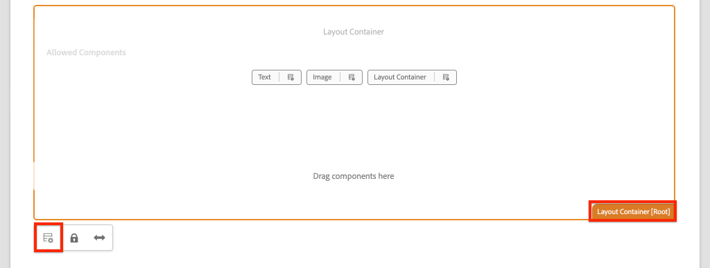
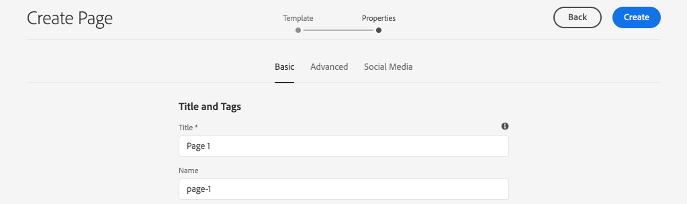
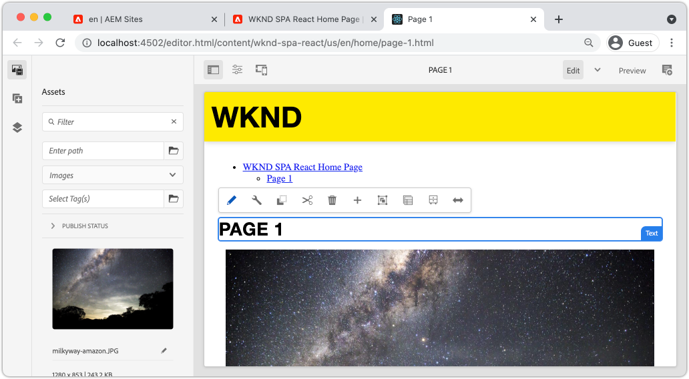

# 탐색 및 라우팅 추가 {#navigation-routing}

SPA Editor SDK를 사용하여 AEM 페이지에 매핑하여 SPA에서 여러 개의 보기를 지원하는 방법을 알아봅니다. 동적 탐색은 React Router 및 React Core 구성 요소를 사용하여 구현됩니다.

## 목표

1. SPA 편집기를 사용할 때 사용할 수 있는 SPA 모델 라우팅 옵션을 이해합니다.
1. [React Router](https://reacttraining.com/react-router/)를 사용하여 SPA의 다른 보기 사이를 탐색하는 방법을 알아봅니다.
1. AEM React 코어 구성 요소 를 사용하여 AEM 페이지 계층 구조에 의해 구동되는 동적 탐색을 구현합니다.

## 빌드할 내용

이 장에서는 AEM의 SPA에 탐색을 추가합니다. 탐색 메뉴는 AEM 페이지 계층 구조에 의해 제어되며, [탐색 코어 구성 요소](https://docs.adobe.com/content/help/ko-KR/experience-manager-core-components/using/components/navigation.html)에서 제공하는 JSON 모델을 사용합니다.


## 전제 조건

[로컬 개발 환경](overview.md#local-dev-environment)을 설정하는 데 필요한 도구 및 지침을 검토하십시오. 이 장은 [구성 요소 매핑](map-components.md) 장의 연속이지만, 필요한 모든 작업을 수행하려면 로컬 AEM 인스턴스에 배포된 SPA 사용 AEM 프로젝트가 있습니다.

## 템플릿 {#add-navigation-template}에 탐색 추가

1. 브라우저를 열고 AEM, [http://localhost:4502/](http://localhost:4502/)에 로그인합니다. 시작 코드 베이스를 이미 배포해야 합니다.
1. **SPA 페이지 템플릿**&#x200B;으로 이동합니다.[http://localhost:4502/editor.html/conf/wknd-spa-react/settings/wcm/templates/spa-page-template/structure.html](http://localhost:4502/editor.html/conf/wknd-spa-react/settings/wcm/templates/spa-page-template/structure.html)
1. 가장 바깥쪽 **루트 레이아웃 컨테이너**&#x200B;를 선택하고 해당 **정책** 아이콘을 클릭합니다. 작성을 위해 **레이아웃 컨테이너**&#x200B;가 잠겨 있지 않은 **을 선택하려면 주의하십시오.**

   

1. **SPA 구조**&#x200B;라는 새 정책을 만듭니다.

   

   **허용된 구성 요소** > **일반** 아래에서 **레이아웃 컨테이너** 구성 요소를 선택합니다.

   **허용된 구성 요소** > **WKND SPA REACT - STRUCTURE** 아래에서 **헤더** 구성 요소를 선택합니다.

   

   **허용된 구성 요소** > **WKND SPA REACT - Content** 아래에서 **이미지** 및 **텍스트** 구성 요소를 선택합니다. 총 4개의 구성 요소가 선택되어 있어야 합니다.

   **완료**&#x200B;를 클릭하여 변경 내용을 저장합니다.

1. 페이지를 새로 고침하고 잠금 해제된 **레이아웃 컨테이너** 위에 **탐색** 구성 요소를 추가합니다.

   

1. **탐색** 구성 요소를 선택하고 해당 **정책** 아이콘을 클릭하여 정책을 편집합니다.
1. **SPA 탐색**&#x200B;의 **정책 제목**&#x200B;을 사용하여 새 정책을 만듭니다.

   **속성**&#x200B;에서 다음을 수행합니다.

   * **탐색 루트**&#x200B;를 `/content/wknd-spa-react/us/en`로 설정합니다.
   * **루트 수준 제외**&#x200B;를 **1**&#x200B;로 설정합니다.
   * **모든 하위 페이지 수집**&#x200B;의 선택을 취소합니다.
   * **탐색 구조 깊이**&#x200B;를 **3**&#x200B;로 설정합니다.

   

   이렇게 하면 `/content/wknd-spa-react/us/en` 아래의 탐색 2 수준이 수집됩니다.

1. 변경 사항을 저장한 후에는 채워진 `Navigation`이 템플릿의 일부로 표시됩니다.

   

## 하위 페이지 만들기

다음으로, SPA에서 다른 보기 역할을 하는 AEM에서 추가 페이지를 만듭니다. 또한 AEM에서 제공하는 JSON 모델의 계층 구조도 검사합니다.

1. **사이트** 콘솔로 이동합니다.[http://localhost:4502/sites.html/content/wknd-spa-react/us/en/home](http://localhost:4502/sites.html/content/wknd-spa-react/us/en/home) **WKND SPA React 홈 페이지**&#x200B;를 선택하고 **만들기** > **페이지**&#x200B;를 클릭합니다.

   

1. **템플릿** SPA 페이지&#x200B;**를 선택합니다.** **속성** 아래에 **제목** 및 **page-1**&#x200B;을 이름으로 입력합니다.****

   

   **만들기**&#x200B;를 클릭하고 대화 상자 팝업에서 **열기**&#x200B;를 클릭하여 AEM SPA 편집기에서 페이지를 엽니다.

1. 새 **Text** 구성 요소를 기본 **레이아웃 컨테이너**&#x200B;에 추가합니다. 구성 요소를 편집하고 텍스트를 입력합니다.**RTE와** H2 **요소를 사용하여 1페이지**.

   

   이미지와 같은 추가 컨텐츠를 자유롭게 추가할 수 있습니다.

1. AEM Sites 콘솔으로 돌아가서 위의 단계를 반복하여 **Page 2** Page 1 **의 동위 멤버로 명명된 두 번째 페이지를 만듭니다.**
1. 마지막으로 세 번째 페이지인 **Page 3**&#x200B;을(를) 만들지만, **Page 2**&#x200B;의 **child**&#x200B;로 만듭니다. 사이트 계층 구조가 완료되면 다음과 같이 표시됩니다.

   

1. 이제 탐색 구성 요소를 사용하여 SPA의 다른 영역으로 이동할 수 있습니다.

   

1. AEM 편집기 외부에서 페이지를 엽니다.[http://localhost:4502/content/wknd-spa-react/us/en/home.html](http://localhost:4502/content/wknd-spa-react/us/en/home.html) **탐색** 구성 요소를 사용하여 앱의 다른 보기로 이동합니다.

1. 탐색할 때 브라우저의 개발자 도구를 사용하여 네트워크 요청을 검사합니다. 아래 스크린샷은 Google Chrome 브라우저에서 촬영됩니다.

   

   초기 페이지 로드 후 후속 탐색으로 전체 페이지 새로 고침이 발생하지 않으며 이전에 방문한 페이지로 돌아올 때 네트워크 트래픽이 최소화되는지 확인합니다.

## 계층 페이지 JSON 모델 {#hierarchy-page-json-model}

다음으로, SPA의 다중 보기 경험을 유도하는 JSON 모델을 검사합니다.

1. 새 탭에서 AEM에서 제공하는 JSON 모델 API를 엽니다.[http://localhost:4502/content/wknd-spa-react/us/en.model.json](http://localhost:4502/content/wknd-spa-react/us/en.model.json) 브라우저 확장을 사용하여 [JSON](https://chrome.google.com/webstore/detail/json-formatter/bcjindcccaagfpapjjmafapmmgkkhgoa)의 형식을 지정하는 것이 도움이 될 수 있습니다.

   SPA이 처음 로드될 때 이 JSON 컨텐츠가 요청됩니다. 외부 구조는 다음과 같습니다.

   ```json
   {
   "language": "en",
   "title": "en",
   "templateName": "spa-app-template",
   "designPath": "/libs/settings/wcm/designs/default",
   "cssClassNames": "spa page basicpage",
   ":type": "wknd-spa-react/components/spa",
   ":items": {},
   ":itemsOrder": [],
   ":hierarchyType": "page",
   ":path": "/content/wknd-spa-react/us/en",
   ":children": {
      "/content/wknd-spa-react/us/en/home": {},
      "/content/wknd-spa-react/us/en/home/page-1": {},
      "/content/wknd-spa-react/us/en/home/page-2": {},
      "/content/wknd-spa-react/us/en/home/page-2/page-3": {}
      }
   }
   ```

   `:children` 아래에 작성된 각 페이지에 대한 항목이 표시됩니다. 모든 페이지의 컨텐츠는 이 초기 JSON 요청에 있습니다. 탐색 라우팅에서는 컨텐츠를 이미 클라이언트측에서 사용할 수 있으므로 SPA의 후속 보기가 빠르게 로드됩니다.

   초기 JSON 요청에 SPA의 컨텐츠 **ALL**&#x200B;을 로드하는 것이 초기 페이지 로드 속도를 저하하므로 현명한 방법은 아닙니다. 다음으로, 페이지의 계층 구조 깊이를 수집하는 방법을 살펴보겠습니다.

1. 다음 위치에서 **SPA Root** 템플릿으로 이동합니다.[http://localhost:4502/editor.html/conf/wknd-spa-react/settings/wcm/templates/spa-app-template/structure.html](http://localhost:4502/editor.html/conf/wknd-spa-react/settings/wcm/templates/spa-app-template/structure.html)

   **페이지 속성 메뉴** > **페이지 정책**&#x200B;을 클릭합니다.

   

1. **SPA Root** 템플릿에는 수집된 JSON 컨텐츠를 제어하는 추가 **계층 구조** 탭이 있습니다. **구조 깊이**&#x200B;는 **루트** 아래에 있는 하위 페이지를 수집하기 위해 사이트 계층 구조에서 깊이가 얼마나 되는지 결정합니다. **구조 패턴** 필드를 사용하여 정규 표현식에 따라 추가 페이지를 필터링할 수도 있습니다.

   **구조 깊이**&#x200B;를 **2**&#x200B;로 업데이트하십시오.

   

   **완료**&#x200B;를 클릭하여 정책에 대한 변경 사항을 저장합니다.

1. JSON 모델 [http://localhost:4502/content/wknd-spa-react/us/en.model.json](http://localhost:4502/content/wknd-spa-react/us/en.model.json)을 다시 엽니다.

   ```json
   {
   "language": "en",
   "title": "en",
   "templateName": "spa-app-template",
   "designPath": "/libs/settings/wcm/designs/default",
   "cssClassNames": "spa page basicpage",
   ":type": "wknd-spa-react/components/spa",
   ":items": {},
   ":itemsOrder": [],
   ":hierarchyType": "page",
   ":path": "/content/wknd-spa-react/us/en",
   ":children": {
      "/content/wknd-spa-react/us/en/home": {},
      "/content/wknd-spa-react/us/en/home/page-1": {},
      "/content/wknd-spa-react/us/en/home/page-2": {}
      }
   }
   ```

   **페이지 3** 경로가 제거되었습니다.초기 JSON 모델의 `/content/wknd-spa-react/us/en/home/page-2/page-3`. 이것은 **Page 3**&#x200B;이 계층 구조의 수준 3에 있고 최대 수준 2의 콘텐츠만 포함하도록 정책을 업데이트했기 때문입니다.

1. SPA 홈 페이지를 다시 엽니다.[http://localhost:4502/content/wknd-spa-react/us/en/home.html](http://localhost:4502/content/wknd-spa-react/us/en/home.html) 브라우저의 개발자 도구를 엽니다.

   페이지를 새로 고치면 SPA 루트인 `/content/wknd-spa-react/us/en.model.json`에 대한 XHR 요청이 표시됩니다. 자습서에서 이전에 만든 SPA 루트 템플릿에 대한 계층 구조 깊이 구성을 기준으로 세 개의 하위 페이지만 포함됩니다. 여기에는 **페이지 3**&#x200B;이 포함되지 않습니다.

   

1. 개발자 도구가 열려 있으면 `Navigation` 구성 요소를 사용하여 **페이지 3**&#x200B;로 직접 이동합니다.

   다음에 대한 새 XHR 요청이 수행되는지 확인합니다.`/content/wknd-spa-react/us/en/home/page-2/page-3.model.json`

   

   AEM Model Manager는 **페이지 3** JSON 콘텐츠를 사용할 수 없으며 추가 XHR 요청을 자동으로 트리거함을 이해합니다.

1. 다음으로 직접 이동하여 딥 링크를 실험합니다.[http://localhost:4502/content/wknd-spa-react/us/en/home/page-2.html](http://localhost:4502/content/wknd-spa-react/us/en/home/page-2.html) 또한 브라우저의 뒤로 단추가 계속 작동하는 것을 확인합니다.

## Inspect React 라우팅 {#react-routing}

탐색 및 라우팅은 [React Router](https://reactrouter.com/)로 구현됩니다. React Router는 React 응용 프로그램에 대한 탐색 구성 요소의 컬렉션입니다. [AEM React 코어 ](https://github.com/adobe/aem-react-core-wcm-components-base) 구성 요소 는 React Router의 기능을 사용하여  **** 이전 단계에서 사용되는 탐색 구성 요소를 구현합니다.

다음으로, React Router가 SPA과 통합되는 방법을 검사하고 React Router의 [Link](https://reactrouter.com/web/api/Link) 구성 요소를 사용하여 실험합니다.

1. IDE에서 `ui.frontend/src/index.js`에 있는 `index.js` 파일을 엽니다.

   ```js
   /* index.js */
   import { Router } from 'react-router-dom';
   ...
   ...
    ModelManager.initialize().then(pageModel => {
       const history = createBrowserHistory();
       render(
       <Router history={history}>
           <App
           history={history}
           cqChildren={pageModel[Constants.CHILDREN_PROP]}
           cqItems={pageModel[Constants.ITEMS_PROP]}
           cqItemsOrder={pageModel[Constants.ITEMS_ORDER_PROP]}
           cqPath={pageModel[Constants.PATH_PROP]}
           locationPathname={window.location.pathname}
           />
       </Router>,
       document.getElementById('spa-root')
       );
   });
   ```

   `App`은 [React Router](https://reacttraining.com/react-router/)에서 `Router` 구성 요소에 래핑됩니다. AEM SPA Editor JS SDK에서 제공하는 `ModelManager` 에서는 JSON 모델 API를 기반으로 AEM 페이지에 동적 경로를 추가합니다.

1. `ui.frontend/src/components/Page/Page.js`에서 `Page.js` 파일을 엽니다.

   ```js
   class AppPage extends Page {
     get containerProps() {
       let attrs = super.containerProps;
       attrs.className =
         (attrs.className || '') + ' page ' + (this.props.cssClassNames || '');
       return attrs;
     }
   }
   
   export default MapTo('wknd-spa-react/components/page')(
     withComponentMappingContext(withRoute(AppPage))
   );
   ```

   `Page` SPA 구성 요소는 `MapTo` 함수를 사용하여 AEM의 **Pages**&#x200B;를 해당 SPA 구성 요소에 매핑합니다. `withRoute` 유틸리티는 `cqPath` 속성을 기반으로 SPA을 적절한 AEM 하위 페이지로 동적으로 라우팅하는 데 도움이 됩니다.

1. `ui.frontend/src/components/Header/Header.js`에서 `Header.js` 구성 요소를 엽니다.
1. `Header`을 업데이트하여 [Link](https://reactrouter.com/web/api/Link)에 있는 `<h1>` 태그를 홈 페이지에 래핑합니다.

   ```diff
     //Header.js
     import React, {Component} from 'react';
   + import {Link} from 'react-router-dom';
     require('./Header.css');
   
   export default class Header extends Component {
   
       render() {
           return (
               <header className="Header">
               <div className="Header-container">
   +              <Link to="/content/wknd-spa-react/us/en/home.html">
                       <h1>WKND</h1>
   +              </Link>
               </div>
               </header>
           );
       }
   ```

   기본 `<a>` 앵커 태그를 사용하는 대신 React Router에서 제공한 `<Link>`을 사용합니다. `to=` 이 유효한 경로를 가리키는 한 SPA은 해당 경로로 전환되고 **가 아닌**&#x200B;은 전체 페이지 새로 고침을 수행합니다. 여기서는 `Link` 사용을 설명하기 위해 홈 페이지에 대한 링크를 하드 코딩하기만 하면 됩니다.

1. `ui.frontend/src/App.test.js`에 있는 `App.test.js`에서 테스트를 업데이트합니다.

   ```diff
   + import { BrowserRouter as Router } from 'react-router-dom';
     import App from './App';
   
     it('renders without crashing', () => {
       const div = document.createElement('div');
   -   ReactDOM.render(<App />, div);
   +   ReactDOM.render(<Router><App /></Router>, div);
     });
   ```

   `App.js`에서 참조되는 정적 구성 요소 내에서 React Router의 기능을 사용하고 있으므로 단위 테스트를 업데이트하여 고려해야 합니다.

1. 터미널을 열고 프로젝트의 루트로 이동한 다음 Maven 기술을 사용하여 프로젝트를 AEM에 배포합니다.

   ```shell
   $ cd aem-guides-wknd-spa.react
   $ mvn clean install -PautoInstallSinglePackage
   ```

1. AEM에서 SPA 페이지 중 하나로 이동합니다.[http://localhost:4502/content/wknd-spa-react/us/en/home/page-1.html](http://localhost:4502/content/wknd-spa-react/us/en/home/page-1.html)

   `Navigation` 구성 요소를 사용하여 탐색하는 대신 `Header` 의 링크를 사용하십시오.

   

   전체 페이지 새로 고침이 트리거되지 않은 **이며 SPA 라우팅이 작동하는 것을 확인합니다.**

1. 원할 경우 표준 `<a>` 앵커 태그를 사용하여 `Header.js` 파일을 실험해 보십시오.

   ```js
   <a href="/content/wknd-spa-react/us/en/home.html">
       <h1>WKND</h1>
   </a>
   ```

   이렇게 하면 SPA 라우팅과 일반 웹 페이지 링크 간의 차이를 알 수 있습니다.

## 축하합니다! {#congratulations}

축하합니다. SPA Editor SDK를 사용하여 AEM 페이지에 매핑하여 SPA에서 여러 개의 보기를 지원하는 방법을 알아보았습니다. 동적 탐색이 React Router를 사용하여 구현되었으며 `Header` 구성 요소에 추가되었습니다.

