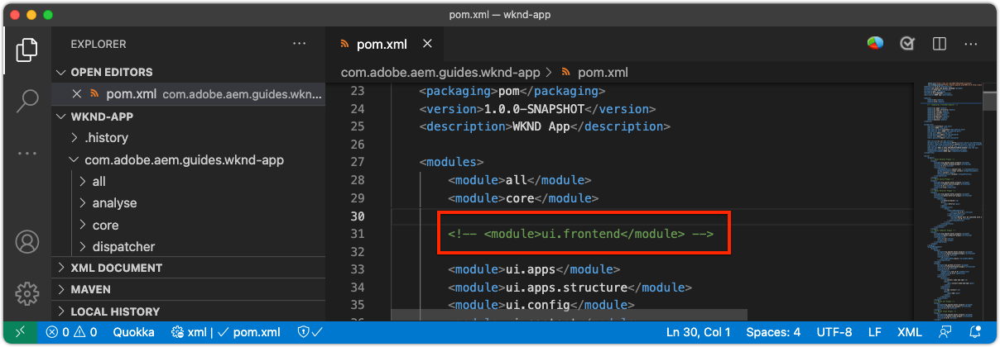
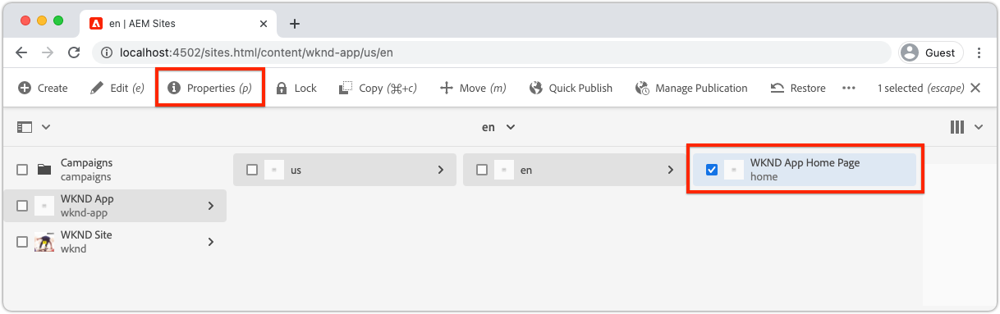

# SPA 편집기용 AEM 구성

SPA 코드베이스는 AEM 외부에서 관리되지만 구성 및 컨텐츠 요구 사항을 지원하는 AEM 프로젝트가 필요합니다. 이 장에서는 필요한 구성을 포함하는 AEM 프로젝트 생성에 대해 설명합니다.

+ AEM WCM 핵심 구성 요소 프록시
+ AEM 원격 SPA 페이지 프록시
+ AEM 원격 SPA 페이지 템플릿
+ 기본 원격 SPA AEM 페이지
+ SPA-AEM URL 매핑을 정의하는 하위 프로젝트
+ OSGi 구성 폴더

## AEM 프로젝트 만들기

구성 및 기준 컨텐츠를 관리하는 AEM 프로젝트를 만듭니다.

_항상 최신 버전의  [AEM Lianype을 사용하십시오](https://github.com/adobe/aem-project-archetype)._


```
$ mkdir -p ~/Code/wknd-app
$ cd ~/Code/wknd-app
$ mvn -B archetype:generate \
 -D archetypeGroupId=com.adobe.aem \
 -D archetypeArtifactId=aem-project-archetype \
 -D archetypeVersion=27 \
 -D aemVersion=cloud \
 -D appTitle="WKND App" \
 -D appId="wknd-app" \
 -D groupId="com.adobe.aem.guides.wkndapp" \
 -D frontendModule="react"
$ mv ~/Code/wknd-app/wknd-app ~/Code/wknd-app/com.adobe.aem.guides.wknd-app
```

_마지막 명령은 간단히 AEM 프로젝트 폴더의 이름을 변경하므로 AEM 프로젝트이므로 Remote SPA__

`frontendModule="react"`이(가) 지정된 동안 `ui.frontend` 프로젝트는 원격 SPA 사용 사례에 사용되지 않습니다. SPA은 외부에서 AEM으로 개발 및 관리되며 컨텐츠 API로 AEM만 사용합니다. 프로젝트에 `frontendModule="react"` 플래그는 `spa-project` AEM Java™ 종속성이 포함되고 원격 SPA 페이지 템플릿을 설정해야 합니다.

AEM Project Tranype은 SPA와의 통합을 위해 AEM을 구성하는 데 사용되는 다음 요소를 생성합니다.

+ __AEM WCM 핵심 구성 요소__ 프로그램  `ui.content/src/.../apps/wknd-app/components`
+ __AEM SPA Remote Page__ proxyat  `ui.content/src/.../apps/wknd-app/components/remotepage`
+ __AEM 페이지__ 템플릿  `ui.content/src/.../conf/wknd-app/settings/wcm/templates`
+ __컨텐츠 매핑 정의를 위한 하위__ 프로젝트  `ui.content/src/...`
+ __Baseline Remote SPA AEM__ 페이지  `ui.content/src/.../content/wknd-app`
+ __OSGi 구성__ 폴더  `ui.config/src/.../apps/wknd-app/osgiconfig`

기본 AEM 프로젝트가 생성되면 몇 가지 조정을 통해 SPA 편집기가 Remote SPA과 호환되도록 할 수 있습니다.

## ui.frontend 프로젝트 제거

SPA은 원격 SPA이므로 AEM 프로젝트 외부에서 개발 및 관리되었다고 가정합니다. 충돌을 방지하려면 `ui.frontend` 프로젝트를 배포에서 제거합니다. `ui.frontend` 프로젝트가 제거되지 않으면 `ui.frontend` 프로젝트 및 Remote SPA에 제공된 기본 SPA인 2개의 SPA이 동시에 AEM SPA 편집기에서 로드됩니다.

1. IDE에서 AEM 프로젝트(`~/Code/wknd-app/com.adobe.aem.guides.wknd-app`)를 엽니다.
1. 루트 `pom.xml` 열기
1. `<modules>` 목록에서 `<module>ui.frontend</module`에 주석 추가

   ```
   <modules>
       <module>all</module>
       <module>core</module>
   
       <!-- <module>ui.frontend</module> -->
   
       <module>ui.apps</module>
       <module>ui.apps.structure</module>
       <module>ui.config</module>
       <module>ui.content</module>
       <module>it.tests</module>
       <module>dispatcher</module>
       <module>ui.tests</module>
       <module>analyse</module>
   </modules>
   ```

   `pom.xml` 파일은 다음과 같아야 합니다.

   

1. `ui.apps/pom.xml` 열기
1. `<artifactId>wknd-app.ui.frontend</artifactId>`의 `<dependency>`에 주석 추가

   ```
   <dependencies>
   
       <!-- Remote SPA project will provide all frontend resources
       <dependency>
           <groupId>com.adobe.aem.guides.wkndapp</groupId>
           <artifactId>wknd-app.ui.frontend</artifactId>
           <version>${project.version}</version>
           <type>zip</type>
       </dependency>
       --> 
   </dependencies>
   ```

   `ui.apps/pom.xml` 파일은 다음과 같아야 합니다.

   

이러한 변경 전에 AEM 프로젝트를 빌드한 경우 `ui.apps/src/main/content/jcr_root/apps/wknd-app/clientlibs/clientlib-react`의 `ui.apps` 프로젝트에서 생성된 클라이언트 라이브러리를 수동으로 삭제합니다.`ui.frontend`

## AEM 콘텐츠 매핑

AEM이 SPA 편집기에서 원격 SPA을 로드하려면 열어서 작성 컨텐트에 사용되는 SPA 경로와 AEM 페이지 간 매핑을 설정해야 합니다.

이 구성의 중요성은 나중에 살펴봅니다.

매핑은 `/etc/map`에 정의된 [Sling 매핑](https://sling.apache.org/documentation/the-sling-engine/mappings-for-resource-resolution.html#root-level-mappings-1)으로 수행할 수 있습니다.

1. IDE에서 `ui.content` 하위 프로젝트를 엽니다.
1. 다음으로 이동  `src/main/content/jcr_root/etc`
1. 폴더를 만듭니다 `map`
1. `map`에서 `http` 폴더를 만듭니다.
1. `http`에서 내용을 포함하는 `.content.xml` 파일을 만듭니다.

   ```
   <?xml version="1.0" encoding="UTF-8"?>
   <jcr:root xmlns:sling="http://sling.apache.org/jcr/sling/1.0" xmlns:jcr="http://www.jcp.org/jcr/1.0"
       jcr:primaryType="sling:Mapping">
       <localhost_any/>
   </jcr:root>
   ```

1. `http`에서 `localhost_any` 폴더를 만듭니다.
1. `localhost_any`에서 내용을 포함하는 `.content.xml` 파일을 만듭니다.

   ```
   <?xml version="1.0" encoding="UTF-8"?>
   <jcr:root xmlns:sling="http://sling.apache.org/jcr/sling/1.0" xmlns:jcr="http://www.jcp.org/jcr/1.0"
       jcr:primaryType="sling:Mapping"
       sling:match="localhost\\.\\d+">
       <wknd-app-routes-adventure/>
   </jcr:root>
   ```

1. `localhost_any`에서 `wknd-app-routes-adventure` 폴더를 만듭니다.
1. `wknd-app-routes-adventure`에서 내용을 포함하는 `.content.xml` 파일을 만듭니다.

   ```
   <?xml version="1.0" encoding="UTF-8"?>
   
   <!--
   The 'wknd-app-routes-adventure' mapping, maps requests to the SPA's adventure route 
   to it's corresponding page in AEM at /content/wknd-app/us/en/home/adventure/xxx.
   
   Note the adventure AEM pages will be created directly in AEM.
   -->
   
   <jcr:root xmlns:sling="http://sling.apache.org/jcr/sling/1.0" xmlns:jcr="http://www.jcp.org/jcr/1.0"
       jcr:primaryType="sling:Mapping"
       sling:match="adventure:.*/([^/]+)/?$"
       sling:internalRedirect="/content/wknd-app/us/en/home/adventure/$1"/>
   ```

1. 매핑 노드를 AEM 패키지에 포함된 `ui.content/src/main/content/META-INF/vault/filter.xml`에 추가합니다.

   ```
   <?xml version="1.0" encoding="UTF-8"?>
   <workspaceFilter version="1.0">
       <filter root="/conf/wknd-app" mode="merge"/>
       <filter root="/content/wknd-app" mode="merge"/>
       <filter root="/content/dam/wknd-app/asset.jpg" mode="merge"/>
       <filter root="/content/experience-fragments/wknd-app" mode="merge"/>
   
       <!-- Add the Sling Mapping rules for the WKND App -->
       <filter root="/etc/map" mode="merge"/>
   </workspaceFilter>
   ```

폴더 구조와 `.context.xml` 파일은 다음과 같아야 합니다.


`filter.xml` 파일은 다음과 같아야 합니다.


이제 AEM 프로젝트를 배포하면 이러한 구성이 자동으로 포함됩니다.

`http` 및 `localhost`에서 실행 중인 Sling 매핑 효과 AEM은 로컬 개발만 지원합니다. Cloud Service으로 AEM에 배포할 때는 유사한 Sling 매핑을 해당 대상 `https` 및 적절한 AEM을 Cloud Service 도메인으로 추가해야 합니다. 자세한 내용은 [Sling 매핑 설명서](https://sling.apache.org/documentation/the-sling-engine/mappings-for-resource-resolution.html)를 참조하십시오.

## 교차 도메인 리소스 공유 보안 정책

다음으로, 이 SPA만 AEM 컨텐츠에 액세스할 수 있도록 AEM이 컨텐츠를 보호하도록 구성합니다. C AEM](https://experienceleague.adobe.com/docs/experience-manager-learn/foundation/security/develop-for-cross-origin-resource-sharing.html)에서 [교차 도메인 리소스 공유를 구성합니다.

1. IDE에서 `ui.config` Maven 하위 프로젝트를 엽니다
1. 이동 `src/main/content/jcr_root/apps/wknd-app/osgiconfig/config`
1. `com.adobe.granite.cors.impl.CORSPolicyImpl~wknd-app_remote-spa.cfg.json` 파일을 만듭니다.
1. 파일에 다음을 추가합니다.

   ```
   {
       "supportscredentials":true,
       "exposedheaders":[
           ""
       ],
       "supportedmethods":[
           "GET",
           "HEAD",
           "POST",
           "OPTIONS"
       ],
       "alloworigin":[
           "https://external-hosted-app", "localhost:3000"
       ],
       "maxage:Integer":1800,
       "alloworiginregexp":[
           ".*"
       ],
       "allowedpaths":[
           ".*"
       ],
       "supportedheaders":[
           "Origin",
           "Accept",
           "X-Requested-With",
           "Content-Type",
           "Access-Control-Request-Method",
           "Access-Control-Request-Headers",
           "Authorization"
       ]
   }
   ```

`com.adobe.granite.cors.impl.CORSPolicyImpl~wknd-app_remote-spa.cfg.json` 파일은 다음과 같아야 합니다.


주요 구성 요소는 다음과 같습니다.

+ `alloworigin` AEM에서 컨텐츠를 검색할 수 있는 호스트를 지정합니다.
   + `localhost:3000` 로컬로 실행되는 SPA을 지원하기 위해 추가되었습니다.
   + `https://external-hosted-app` 원격 SPA이 호스팅된 도메인으로 대체할 자리 표시자 역할을 합니다.
+ `allowedpaths` AEM에서 이 CORS 구성으로 적용되는 경로를 지정합니다. 기본값은 AEM의 모든 컨텐츠에 대한 액세스를 허용하지만 SPA이 액세스할 수 있는 특정 경로에만 범위를 지정할 수 있습니다. 예:`/content/wknd-app`.

## AEM 페이지를 원격 SPA 페이지 템플릿으로 설정

AEM Project Tranype은 Remote SPA와의 AEM 통합을 위해 준비된 프로젝트를 생성하지만 자동 생성된 AEM 페이지 구조에 대한 작지만 중요한 조정이 필요합니다. 자동 생성된 AEM 페이지의 유형은 __SPA 페이지__&#x200B;이 아닌 __원격 SPA 페이지__&#x200B;로 변경되어야 합니다.

1. IDE에서 `ui.content` 하위 프로젝트를 엽니다.
1. `src/main/content/jcr_root/content/wknd-app/us/en/home/.content.xml`에 열기
1. 다음 항목으로 이 `.content.xml` 파일을 업데이트합니다.

   ```
   <?xml version="1.0" encoding="UTF-8"?>
   <jcr:root xmlns:sling="http://sling.apache.org/jcr/sling/1.0" xmlns:cq="http://www.day.com/jcr/cq/1.0" xmlns:jcr="http://www.jcp.org/jcr/1.0" xmlns:nt="http://www.jcp.org/jcr/nt/1.0"
           jcr:primaryType="cq:Page">
       <jcr:content
           cq:template="/conf/wknd-app/settings/wcm/templates/spa-remote-page"
           jcr:primaryType="cq:PageContent"
           jcr:title="WKND App Home Page"
           sling:resourceType="wknd-app/components/remotepage">
           <root
               jcr:primaryType="nt:unstructured"
               sling:resourceType="wcm/foundation/components/responsivegrid">
               <responsivegrid
                   jcr:primaryType="nt:unstructured"
                   sling:resourceType="wcm/foundation/components/responsivegrid">
                   <text
                       jcr:primaryType="nt:unstructured"
                       sling:resourceType="wknd-app/components/text"
                       text="&lt;p>Hello World!&lt;/p>"
                       textIsRich="true">
                       <cq:responsive jcr:primaryType="nt:unstructured"/>
                   </text>
               </responsivegrid>
           </root>
       </jcr:content>
   </jcr:root>
   ```

키 변경 사항은 `jcr:content` 노드 업데이트:

+ `cq:template` 끝 `/conf/wknd-app/settings/wcm/templates/spa-remote-page`
+ `sling:resourceType` 끝 `wknd-app/components/remotepage`

`src/main/content/jcr_root/content/wknd-app/us/en/home/.content.xml` 파일은 다음과 같아야 합니다.


이러한 변경 사항을 통해 AEM의 SPA 루트인 이 페이지가 SPA 편집기에서 원격 SPA을 로드할 수 있습니다.

>[!NOTE]
>
>이 프로젝트가 이전에 AEM으로 제공된 경우, `ui.content` 프로젝트가 __update__&#x200B;이 아닌 __merge__ 노드로 설정되어 있으므로 AEM 페이지를 __사이트 > WKND 앱 > us > en > WKND 앱 홈 페이지__&#x200B;로 삭제해야 합니다.

이 페이지는 AEM 자체에서 원격 SPA 페이지로 제거되고 다시 만들 수도 있지만, 이 페이지는 `ui.content` 프로젝트에서 자동으로 만들어지므로 코드 베이스에서 업데이트하는 것이 가장 좋습니다.

## AEM SDK에 AEM 프로젝트 배포

1. AEM 작성자 서비스가 포트 4502에서 실행 중인지 확인
1. 명령줄에서 AEM Maven 프로젝트의 루트로 이동합니다.
1. Maven을 사용하여 로컬 AEM SDK 작성자 서비스에 프로젝트를 배포합니다.

   ```
   $ mvn clean install -PautoInstallSinglePackage
   ```

   

## 루트 AEM 페이지 구성

AEM 프로젝트가 배포되면 Remote SPA을 로드할 SPA 편집기를 준비하는 마지막 단계가 있습니다. AEM에서 AEM 프로젝트 원형에서 생성된 SPA 루트`/content/wknd-app/us/en/home`에 해당하는 AEM 페이지를 표시합니다.

1. AEM 작성자 로그인
1. __사이트 > WKND 앱 > us > en__&#x200B;으로 이동합니다.
1. __WKND 앱 홈 페이지__&#x200B;를 선택하고 __속성__&#x200B;을 탭합니다.

   

1. __SPA__ 탭으로 이동합니다.
1. __원격 SPA 구성__ 채우기
   + __SPA 호스트 URL__:  `http://localhost:3000`
      + 원격 SPA 루트의 URL

   

1. __저장 및 닫기__&#x200B;를 탭합니다.

이 페이지의 유형을 __원격 SPA 페이지__&#x200B;의 유형으로 변경했습니다. 이 페이지에서 __페이지 속성__&#x200B;에 있는 __SPA__ 탭을 볼 수 있습니다.

이 구성은 SPA의 루트에 해당하는 AEM 페이지에서만 설정해야 합니다. 이 페이지 아래의 모든 AEM 페이지는 값을 상속합니다.

## 축하합니다.

이제 AEM 구성을 준비하여 로컬 AEM 작성자에게 배포했습니다! 이제 다음과 같은 방법을 알 수 있습니다.

+ `ui.frontend`의 종속성을 주석 처리하여 AEM 프로젝트 원형 생성 SPA을 제거합니다.
+ AEM의 리소스에 SPA 경로를 매핑하는 AEM에 Sling 매핑 추가
+ Remote SPA에서 AEM의 컨텐츠를 사용할 수 있도록 하는 AEM Cross-Origin Resource Sharing 보안 정책 설정
+ 로컬 AEM SDK 작성자 서비스에 AEM 프로젝트 배포
+ SPA 호스트 URL 페이지 속성을 사용하여 AEM 페이지를 원격 SPA 루트로 표시합니다.

## 다음 단계

AEM이 구성된 경우 AEM SPA Editor!를 사용하여 편집 가능한 영역에 대한 지원을 통해 [원격 SPA](./spa-bootstrap.md) 부트스트래핑에 집중할 수 있습니다.