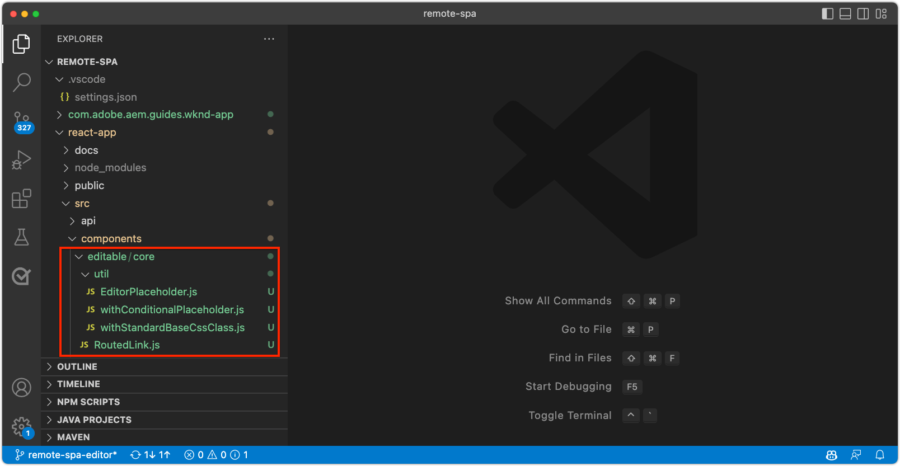

# SPA용 원격 SPA 편집기 Bootstrap

편집 가능한 영역을 원격 SPA에 추가하려면 먼저 AEM SPA Editor JavaScript SDK 및 기타 몇 가지 구성으로 부트스트랩해야 합니다.

## AEM SPA Editor JS SDK npm 종속성 설치

먼저 React 프로젝트에 대한 AEM SPA npm 종속성을 검토하고 설치합니다.

+ [`@adobe/aem-spa-page-model-manager`](https://github.com/adobe/aem-spa-page-model-manager) : AEM에서 콘텐츠를 검색하기 위한 API를 제공합니다.
+ [`@adobe/aem-spa-component-mapping`](https://github.com/adobe/aem-spa-component-mapping) : AEM 콘텐츠를 SPA 구성 요소에 매핑하는 API를 제공합니다.
+ [`@adobe/aem-react-editable-components` v2](https://github.com/adobe/aem-react-editable-components) : 사용자 지정 SPA 구성 요소를 빌드하기 위한 API를 제공하고 과 같은 일반적인 사용 구현을 제공합니다. `AEMPage` React 구성 요소입니다.

```shell
$ cd ~/Code/aem-guides-wknd-graphql/remote-spa-tutorial/react-app
$ npm install @adobe/aem-spa-page-model-manager 
$ npm install @adobe/aem-spa-component-mapping
$ npm install @adobe/aem-react-editable-components 
```

## SPA 환경 변수 검토

AEM과 상호 작용하는 방법을 알 수 있도록 몇 가지 환경 변수를 원격 SPA에 노출해야 합니다.

1. 다음 위치에서 원격 SPA 프로젝트 열기 `~/Code/aem-guides-wknd-graphql/remote-spa-tutorial/react-app` IDE에서
1. 파일 열기 `.env.development`
1. 파일에서 키에 특별히 주의하고 필요에 따라 업데이트합니다.

   ```
   REACT_APP_HOST_URI=http://localhost:4502
   
   REACT_APP_USE_PROXY=true
   
   REACT_APP_AUTH_METHOD=basic
   
   REACT_APP_BASIC_AUTH_USER=admin
   REACT_APP_BASIC_AUTH_PASS=admin
   ```

   

   *React의 사용자 지정 환경 변수 앞에 를 붙여야 합니다. `REACT_APP_`.*

   + `REACT_APP_HOST_URI`: 원격 SPA이 연결하는 AEM 서비스의 체계 및 호스트입니다.
      + 이 값은 AEM 환경(로컬, 개발, 스테이지 또는 프로덕션) 및 AEM 서비스 유형(작성자 대 게시)의 여부에 따라 변경됩니다
   + `REACT_APP_USE_PROXY`: React 개발 서버에 다음과 같은 프록시 AEM 요청을 전달하여 개발 중에 CORS 문제를 방지합니다. `/content, /graphql, .model.json` 사용 `http-proxy-middleware` 모듈.
   + `REACT_APP_AUTH_METHOD`: AEM에서 제공하는 요청에 대한 인증 방법, 옵션은 &#39;service-token&#39;, &#39;dev-token&#39;, &#39;basic&#39; 또는 no-auth 사용 사례를 위해 공백으로 둡니다.
      + AEM Author에 사용해야 합니다.
      + AEM 게시와 함께 사용해야 할 수도 있습니다(콘텐츠가 보호된 경우).
      + AEM SDK에 대해 개발하는 경우 기본 인증을 통해 로컬 계정을 지원합니다. 이 자습서에서 사용하는 메서드입니다.
      + AEMas a Cloud Service 과 통합할 때 다음을 사용합니다. [액세스 토큰](https://experienceleague.adobe.com/docs/experience-manager-learn/getting-started-with-aem-headless/authentication/overview.html)
   + `REACT_APP_BASIC_AUTH_USER`: AEM __사용자 이름__ SPA에서 AEM 컨텐츠를 검색하는 동안 인증합니다.
   + `REACT_APP_BASIC_AUTH_PASS`: AEM __암호__ SPA에서 AEM 컨텐츠를 검색하는 동안 인증합니다.

## ModelManager API 통합

앱에서 AEM SPA npm 종속성을 사용할 수 있는 경우 AEM을 초기화합니다. `ModelManager` 의 프로젝트에서 `index.js` 다음 이전 `ReactDOM.render(...)` 이 호출됩니다.

다음 [모델 관리자](https://github.com/adobe/aem-spa-page-model-manager/blob/master/src/ModelManager.ts) 는 편집 가능한 콘텐츠를 검색하기 위해 AEM에 연결을 담당합니다.

1. IDE에서 원격 SPA 프로젝트를 엽니다.
1. 파일 열기 `src/index.js`
1. 가져오기 추가 `ModelManager` 다음 시간 이전에 초기화 `root.render(..)` 호출,

   ```javascript
   ...
   import { ModelManager } from "@adobe/aem-spa-page-model-manager";
   
   // Initialize the ModelManager before invoking root.render(..).
   ModelManager.initializeAsync();
   
   const container = document.getElementById('root');
   const root = createRoot(container);
   root.render(<App />);
   ```

다음 `src/index.js` 파일은 다음과 같아야 합니다.


## 내부 SPA 프록시 설정

편집 가능한 SPA을 만들 때 [SPA의 내부 프록시](https://create-react-app.dev/docs/proxying-api-requests-in-development/#configuring-the-proxy-manually): 적절한 요청을 AEM에 라우팅하도록 구성됩니다. 이 작업은 다음을 사용하여 수행됩니다. [http-proxy-middle](https://www.npmjs.com/package/http-proxy-middleware) npm 모듈: 기본 WKND GraphQL 앱에서 이미 설치되어 있습니다.

1. IDE에서 원격 SPA 프로젝트를 엽니다.
1. 다음 위치에서 파일을 엽니다. `src/proxy/setupProxy.spa-editor.auth.basic.js`
1. 다음 코드를 사용하여 파일을 업데이트합니다.

   ```javascript
   const { createProxyMiddleware } = require('http-proxy-middleware');
   const {REACT_APP_HOST_URI, REACT_APP_BASIC_AUTH_USER, REACT_APP_BASIC_AUTH_PASS } = process.env;
   
   /*
       Set up a proxy with AEM for local development
       In a production environment this proxy should be set up at the webserver level or absolute URLs should be used.
   */
   module.exports = function(app) {
   
       /**
       * Filter to check if the request should be re-routed to AEM. The paths to be re-routed at:
       * - Starts with /content (AEM content)
       * - Starts with /graphql (AEM graphQL endpoint)
       * - Ends with .model.json (AEM Content Services)
       * 
       * @param {*} path the path being requested of the SPA
       * @param {*} req the request object
       * @returns true if the SPA request should be re-routed to AEM
       */
       const toAEM = function(path, req) {
           return path.startsWith('/content') || 
               path.startsWith('/graphql') ||
               path.endsWith('.model.json')
       }
   
       /**
       * Re-writes URLs being proxied to AEM such that they can resolve to real AEM resources
       * - The "root" case of `/.model.json` are rewritten to the SPA's home page in AEM
       * - .model.json requests for /adventure:xxx routes are rewritten to their corresponding adventure page under /content/wknd-app/us/en/home/adventure/ 
       * 
       * @param {*} path the path being requested of the SPA
       * @param {*} req the request object
       * @returns returns a re-written path, or nothing to use the @param path
       */
       const pathRewriteToAEM = function (path, req) { 
           if (path === '/.model.json') {
               return '/content/wknd-app/us/en/home.model.json';
           } else if (path.startsWith('/adventure/') && path.endsWith('.model.json')) {
               return '/content/wknd-app/us/en/home/adventure/' + path.split('/').pop();
           }    
       }
   
       /**
       * Register the proxy middleware using the toAEM filter and pathRewriteToAEM rewriter 
       */
       app.use(
           createProxyMiddleware(
               toAEM, // Only route the configured requests to AEM
               {
                   target: REACT_APP_HOST_URI,
                   changeOrigin: true,
                   // Pass in credentials when developing against an Author environment
                   auth: `${REACT_APP_BASIC_AUTH_USER}:${REACT_APP_BASIC_AUTH_PASS}`,
                   pathRewrite: pathRewriteToAEM // Rewrite SPA paths being sent to AEM
               }
           )
       );
   
       /**
       * Enable CORS on requests from the SPA to AEM
       * 
       * If this rule is not in place, CORS errors will occur when running the SPA on http://localhost:3000
       */
       app.use((req, res, next) => {
           res.header("Access-Control-Allow-Origin", REACT_APP_HOST_URI);
           next();
       });
   };
   ```

   다음 `setupProxy.spa-editor.auth.basic.js` 파일은 다음과 같아야 합니다.

   

   이 프록시 구성은 다음 두 가지 주요 작업을 수행합니다.

   1. SPA에 대한 특정 요청 프록시 지정(`http://localhost:3000`)에서 AEM으로 `http://localhost:4502`
      + 에서 정의한 대로 AEM에서 제공되어야 함을 나타내는 패턴과 일치하는 경로를 가진 요청만 프록시합니다 `toAEM(path, req)`.
      + 에 정의된 대로 SPA 경로를 해당 AEM 페이지에 재작성합니다. `pathRewriteToAEM(path, req)`
   1. 에 정의된 대로 AEM 콘텐츠에 액세스할 수 있도록 모든 요청에 CORS 헤더를 추가합니다. `res.header("Access-Control-Allow-Origin", REACT_APP_HOST_URI);`
      + 이 항목을 추가하지 않으면 SPA에서 AEM 콘텐츠를 로드할 때 CORS 오류가 발생합니다.

1. 파일 열기 `src/setupProxy.js`
1. 을(를) 가리키는 줄을 검토합니다. `setupProxy.spa-editor.auth.basic` 프록시 구성 파일:

   ```
   ...
   case BASIC:
   // Use user/pass for local development with Local Author Env
   return require('./proxy/setupProxy.spa-editor.auth.basic');
   ...
   ```

참고: `src/setupProxy.js` 또는 참조된 파일을 사용하려면 SPA을 다시 시작해야 합니다.

## 정적 SPA 리소스

WKND 로고 및 그래픽 로드 등 정적 SPA 리소스에서는 src URL이 업데이트되어야 원격 SPA 호스트에서 해당 리소스를 로드할 수 있습니다. 상대 URL을 사용하여 SPA을 작성할 때 SPA Editor에 로드하면 기본적으로 이러한 URL은 AEM이 아닌 SPA 호스트를 사용하기 때문에 아래 이미지에 표시된 대로 404개의 요청이 발생합니다.


이 문제를 해결하려면 원격 SPA에서 호스팅하는 정적 리소스가 원격 SPA 원본을 포함하는 절대 경로를 사용하도록 합니다.

1. IDE에서 SPA 프로젝트 열기
1. SPA 환경 변수 파일을 엽니다. `src/.env.development` 및 SPA 공개 URI에 대한 변수 추가:

   ```
   ...
   # The base URI the SPA is accessed from
   REACT_APP_PUBLIC_URI=http://localhost:3000
   ```

   _AEM에 as a Cloud Service으로 배포할 때는 해당 항목에 대해 동일한 권한이 필요합니다 `.env` 파일._

1. 파일 열기 `src/App.js`
1. SPA 환경 변수에서 SPA 공개 URI 가져오기

   ```javascript
   const {  REACT_APP_PUBLIC_URI } = process.env;
   
   function App() { ... }
   ```

1. WKND 로고 접두사 `` 포함 `REACT_APP_PUBLIC_URI` SPA에 대해 강제로 해결.

   ```html
   
   ```

1. 에서 이미지 로드에 대해서도 동일한 작업 수행 `src/components/Loading.js`

   ```javascript
   const { REACT_APP_PUBLIC_URI } = process.env;
   
   class Loading extends Component {
   
       render() {
           return (<div className="loading">
               
           </div>);
       }
   }
   ```

1. 및 __인스턴스 2개__ / 뒷면 버튼 `src/components/AdventureDetails.js`

   ```javascript
   const { REACT_APP_PUBLIC_URI } = process.env;
   
   function AdventureDetail(props) {
       ...
       render() {
           
       }
   }
   ```

다음 `App.js`, `Loading.js`, 및 `AdventureDetails.js` 파일은 다음과 같아야 합니다.


## AEM 응답형 격자

SPA에서 편집 가능한 영역에 대해 SPA Editor의 레이아웃 모드를 지원하려면 AEM 응답형 그리드 CSS를 SPA에 통합해야 합니다. 걱정하지 마십시오. 이 그리드 시스템은 편집 가능한 컨테이너에만 적용할 수 있으며 선택한 그리드 시스템을 사용하여 나머지 SPA의 레이아웃을 구동할 수 있습니다.

AEM Responsive Grid SCSS 파일을 SPA에 추가합니다.

1. IDE에서 SPA 프로젝트 열기
1. 다음 두 파일을 다운로드하고에 복사합니다. `src/styles`
   + [_grid.scss](./assets/spa-bootstrap/_grid.scss)
      + AEM 응답형 격자 SCSS 생성기
   + [_grid-init.scss](./assets/spa-bootstrap/_grid-init.scss)
      + 호출 `_grid.scss` SPA 특정 중단점(데스크탑 및 모바일) 및 열(12) 사용.
1. 열기 `src/App.scss` 및 가져오기 `./styles/grid-init.scss`

   ```scss
   ...
   @import './styles/grid-init';
   ...
   ```

다음 `_grid.scss` 및 `_grid-init.scss` 파일은 다음과 같아야 합니다.


이제 SPA에는 AEM 컨테이너에 추가된 구성 요소에 대해 AEM 레이아웃 모드를 지원하는 데 필요한 CSS가 포함되어 있습니다.

## 유틸리티 클래스

다음 유틸리티 클래스에서 React 앱 프로젝트에 복사합니다.

+ [RoutedLink.js](./assets/spa-bootstrap/RoutedLink.js) 끝 `~/Code/aem-guides-wknd-graphql/remote-spa-tutorial/react-app/src/components/editable/core/RoutedLink.js`
+ [EditorPlaceholder.js](./assets/spa-bootstrap/EditorPlaceholder.js) 끝 `~/Code/aem-guides-wknd-graphql/remote-spa-tutorial/react-app/src/components/editable/core/util/EditorPlaceholder.js`
+ [withConditionalPlaceholder.js](./assets/spa-bootstrap/withConditionalPlaceholder.js) 끝 `~/Code/aem-guides-wknd-graphql/remote-spa-tutorial/react-app/src/components/editable/core/util/withConditionalPlaceholder.js`
+ [withStandardBaseCssClass.js](./assets/spa-bootstrap/withStandardBaseCssClass.js) 끝 `~/Code/aem-guides-wknd-graphql/remote-spa-tutorial/react-app/src/components/editable/core/util/withStandardBaseCssClass.js`



## SPA 시작

이제 SPA이 AEM과의 통합을 위해 부트스트랩되었으므로 SPA을 실행하고 어떻게 보이는지 살펴보겠습니다!

1. 명령줄에서 SPA 프로젝트의 루트로 이동합니다
1. 일반 명령을 사용하여 SPA을 시작합니다(아직 실행하지 않은 경우).

   ```shell
   $ cd ~/Code/aem-guides-wknd-graphql/remote-spa-tutorial/react-app
   $ npm install 
   $ npm run start
   ```

1. SPA 찾아보기 [http://localhost:3000](http://localhost:3000). 모든 것이 좋아 보여야 합니다!


## AEM SPA 편집기에서 SPA 열기

SPA이에서 실행 중 [http://localhost:3000](http://localhost:3000)AEM SPA Editor를 사용하여 엽니다. 아직 SPA에서 편집할 수 있는 항목이 없습니다. AEM에서 SPA만 확인합니다.

1. AEM 작성자에 로그인
1. 다음으로 이동 __사이트 > WKND 앱 > us > en__
1. 다음 항목 선택 __WKND 앱 홈 페이지__ 및 탭 __편집__, SPA이 나타납니다.

   

1. 다음으로 전환 __미리 보기__ 오른쪽 상단의 모드 전환기 사용
1. SPA 주위를 클릭합니다.

   

## 축하합니다!

AEM SPA Editor와 호환되도록 원격 SPA을 부트스트랩했습니다! 이제 다음 방법을 이해할 수 있습니다.

+ AEM SPA Editor JS SDK npm 종속성을 SPA 프로젝트에 추가합니다.
+ SPA 환경 변수 구성
+ SPA과 ModelManager API 통합
+ 적절한 컨텐츠 요청을 SPA에 라우팅하도록 AEM에 대한 내부 프록시를 설정합니다.
+ SPA 편집기 컨텍스트에서 해결되는 정적 SPA 리소스와 관련된 문제 해결
+ AEM 편집 가능한 컨테이너에서 레이아웃 처리를 지원하도록 AEM 반응형 그리드 CSS 추가

## 다음 단계

이제 AEM SPA Editor와의 호환성을 기준선에 도달했으므로 편집 가능한 영역을 도입할 수 있습니다. 먼저 를 배치하는 방법을 살펴봅니다 [편집 가능한 구성 요소 수정](./spa-fixed-component.md) SPA에서
