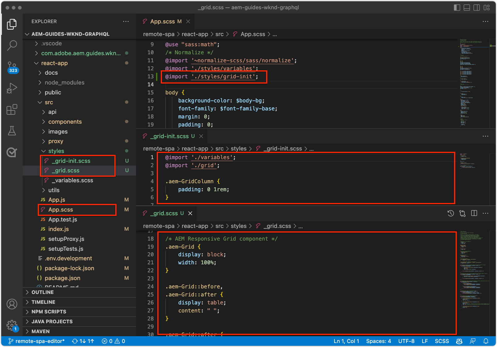

# SPA용 Remote SPA 편집기 Bootstrap

편집 가능한 영역을 원격 SPA에 추가하려면 먼저 AEM SPA Editor JavaScript SDK 및 기타 몇 가지 구성을 부트스트랩해야 합니다.

## AEM SPA Editor JS SDK npm 종속성 추가

먼저 반응형 프로젝트에 AEM SPA npm 종속성을 추가합니다.

```
$ cd ~/Code/wknd-app/aem-guides-wknd-graphql/react-app
$ npm install --save \
    @adobe/aem-spa-page-model-manager \
    @adobe/aem-spa-component-mapping \
    @adobe/aem-react-editable-components \
    @adobe/aem-core-components-react-base \
    @adobe/aem-core-components-react-spa
```

+ `@adobe/aem-spa-page-model-manager` 는 AEM에서 컨텐츠를 검색하기 위한 API를 제공합니다.
+ `@adobe/aem-spa-component-mapping` SPA 컨텐츠를 AEM 구성 요소에 매핑하는 API를 제공합니다.
+ ` @adobe/aem-react-editable-components` 은 사용자 지정 SPA 구성 요소를 빌드하기 위한 API를 제공하고  `AEMPage` React 구성 요소와 같은 일반적인 사용 구현을 제공합니다.
+ `@adobe/aem-core-components-react-base` AEM WCM 핵심 구성 요소와 매끄럽게 통합되고 SPA 편집기에 관계없이 즉시 사용할 수 있는 Response 구성 요소 패키지를 제공합니다. 이러한 구성 요소에는 주로 다음과 같은 컨텐츠 구성 요소가 포함됩니다.
   + 제목
   + 텍스트
   + 탐색 표시
   + 그리고,
+ `@adobe/aem-core-components-react-spa` AEM WCM 핵심 구성 요소와 매끄럽게 통합되지만 SPA 편집기가 필요한 즉시 사용할 수 있는 반응형 구성 요소 패키지를 제공합니다. 이러한 구성 요소에는 `@adobe/aem-core-components-react-base`의 컨텐츠 구성 요소가 들어 있는 구성 요소(예:
   + 컨테이너
   + 회전판
   + 기타 버전

## SPA 환경 변수 검토

AEM과 상호 작용하는 방법을 알 수 있도록 몇 가지 환경 변수를 원격 SPA에 노출해야 합니다.

1. IDE의 `~/Code/wknd-app/aem-guides-wknd-graphql/react-app`에서 원격 SPA 프로젝트 열기
1. `.env.development` 파일을 엽니다.
1. 파일을 추가하여 키에 특정 주의를 기울입니다.

   ```
   REACT_APP_HOST_URI=http://localhost:4502
   REACT_APP_AUTHORIZATION=admin:admin
   ```

   

   *[반응]의 사용자 지정 환경 변수는 접두사로 붙여야 합니다 `REACT_APP_`.*

   + `REACT_APP_AEM_URI`:Remote SPA이 연결하는 AEM 서비스의 구성표와 호스트입니다.
      + 이 값은 AEM 환경(로컬, 개발, 스테이지 또는 프로덕션)과 AEM 서비스 유형(작성자 및 게시)을 기반으로 변경됩니다.
   + `REACT_APP_AEM_AUTH`:SPA에서 사용하는 자격 증명은 AEM에 인증되고 컨텐츠를 검색합니다.
      + AEM 작성자와 함께 사용할 때 필요
      + AEM 게시와 함께 사용하는 데 필요할 수 있습니다(컨텐츠가 보호되는 경우).
      + AEM SDK를 기반으로 개발하는 경우 Basic Auth를 통해 로컬 계정을 지원합니다. 이 튜토리얼에서 사용되는 방법입니다.
      + AEM과 Cloud Service을 통합하는 경우 [액세스 토큰](https://experienceleague.adobe.com/docs/experience-manager-learn/getting-started-with-aem-headless/authentication/overview.html)을 사용합니다.

## ModelManager API 통합

앱에 사용할 수 있는 AEM SPA npm 종속성이 있는 상태에서 `ReactDOM.render(...)`이 호출되기 전에 프로젝트의 `index.js`에서 AEM `ModelManager`을(를) 초기화합니다.

[ModelManager](https://www.npmjs.com/package/@adobe/aem-spa-page-model-manager)는 편집 가능한 컨텐츠를 검색하는 데 AEM에 연결하는 책임을 집니다.

1. IDE에서 원격 SPA 프로젝트 열기
1. `src/index.js` 파일을 엽니다.
1. 가져오기 `ModelManager`을(를) 추가하고 `ReactDOM.render(..)` 호출 전에 초기화합니다.

   ```
   ...
   import { ModelManager } from "@adobe/aem-spa-page-model-manager";
   
   // Initialize the ModelManager before invoking ReactDOM.render(...).
   ModelManager.initializeAsync();
   
   ReactDOM.render(...);
   ```

`src/index.js` 파일은 다음과 같아야 합니다.


## 내부 SPA 프록시 설정

SPA에서 AEM의 편집 가능한 컨텐츠를 소싱하는 경우 해당 요청을 AEM으로 라우팅하도록 구성된 SPA](https://create-react-app.dev/docs/proxying-api-requests-in-development/#configuring-the-proxy-manually)에 [내부 프록시를 설정하는 것이 가장 좋습니다. 이 작업은 기본 WKND GraphQL 앱이 이미 설치한 [http-proxy-middleware](https://www.npmjs.com/package/http-proxy-middleware) npm 모듈을 사용하여 수행합니다.

1. IDE에서 원격 SPA 프로젝트 열기
1. `src/proxy/setupProxy.spa-editor.auth.basic.js`에서 파일 만들기
1. 파일에 다음 코드를 추가합니다.

   ```
   const { createProxyMiddleware } = require('http-proxy-middleware');
   const {REACT_APP_HOST_URI, REACT_APP_AUTHORIZATION } = process.env;
   
   /*
       Set up a proxy with AEM for local development
       In a production environment this proxy should be set up at the webserver level or absolute URLs should be used.
   */
   module.exports = function(app) {
   
       /**
       * Filter to check if the request should be re-routed to AEM. The paths to be re-routed at:
       * - Starts with /content (AEM content)
       * - Starts with /graphql (AEM graphQL endpoint)
       * - Ends with .model.json (AEM Content Services)
       * 
       * @param {*} path the path being requested of the SPA
       * @param {*} req the request object
       * @returns true if the SPA request should be re-routed to AEM
       */
       const toAEM = function(path, req) {
           return path.startsWith('/content') || 
               path.startsWith('/graphq') ||
               path.endsWith('.model.json')
       }
   
       /**
       * Re-writes URLs being proxied to AEM such that they can resolve to real AEM resources
       * - The "root" case of `/.model.json` are rewritten to the SPA's home page in AEM
       * - .model.json requests for /adventure:xxx routes are rewritten to their corresponding adventure page under /content/wknd-app/us/en/home/adventure/ 
       * 
       * @param {*} path the path being requested of the SPA
       * @param {*} req the request object
       * @returns returns a re-written path, or nothing to use the @param path
       */
       const pathRewriteToAEM = function (path, req) { 
           if (path === '/.model.json') {
               return '/content/wknd-app/us/en/home.model.json';
           } else if (path.startsWith('/adventure:') && path.endsWith('.model.json')) {
               return '/content/wknd-app/us/en/home/adventure/' + path.split('/').pop();
           }    
       }
   
       /**
       * Register the proxy middleware using the toAEM filter and pathRewriteToAEM rewriter 
       */
       app.use(
           createProxyMiddleware(
               toAEM, // Only route the configured requests to AEM
               {
                   target: REACT_APP_HOST_URI,
                   changeOrigin: true,
                   // Pass in credentials when developing against an Author environment
                   auth: REACT_APP_AUTHORIZATION,
                   pathRewrite: pathRewriteToAEM // Rewrite SPA paths being sent to AEM
               }
           )
       );
   
       /**
       * Enable CORS on requests from the SPA to AEM
       * 
       * If this rule is not in place, CORS errors will occur when running the SPA on http://localhost:3000
       */
       app.use((req, res, next) => {
           res.header("Access-Control-Allow-Origin", REACT_APP_HOST_URI);
           next();
       });
   };
   ```

   `setupProxy.spa-editor.auth.basic.js` 파일은 다음과 같아야 합니다.

   

   이 프록시 구성은 두 가지 주요 작업을 수행합니다.

   1. SPA에 대한 프록시 관련 요청, AEM `http://localhost:3000`에 대한 프록시 관련 요청`http://localhost:4502`
      + `toAEM(path, req)`에 정의된 대로 AEM에서 제공해야 한다는 것을 나타내는 경로 일치 패턴의 요청만 프록시합니다.
      + SPA 경로를 해당 AEM 페이지에 다시 씁니다(예: `pathRewriteToAEM(path, req)`).
   1. AEM 콘텐츠에 대한 액세스를 허용하기 위해 `res.header("Access-Control-Allow-Origin", REACT_APP_HOST_URI);`에 정의된 대로 CORS 헤더를 모든 요청에 추가합니다.
      + 이 값이 추가되지 않으면 SPA에서 AEM 컨텐츠를 로드할 때 CORS 오류가 발생합니다.

1. `src/setupProxy.js` 파일을 엽니다.
1. `const proxy = require('./proxy/setupProxy.auth.basic')` 줄에 주석 추가
1. 새 프록시 구성 파일을 가리키는 줄을 추가합니다.

   ```
   // Proxy configuration for SPA Editor (and GraphQL) using Basic Auth
   const proxy = require('./proxy/setupProxy.spa-editor.auth.basic')
   ```

   `setupProxy.js` 파일은 다음과 같아야 합니다.

   

참고: `src/setupProxy.js` 또는 참조된 파일을 변경하려면 SPA을 다시 시작해야 합니다.

## 정적 SPA 리소스

WKND 로고 및 그래픽 로드와 같은 정적 SPA 리소스는 src URL을 업데이트하여 원격 SPA 호스트에서 로드해야 합니다. 상대적으로 SPA이 작성용으로 SPA 편집기에 로드되면 이 URL은 기본적으로 SPA이 아닌 AEM 호스트를 사용하므로 아래 이미지에 설명된 대로 404개의 요청이 발생합니다.


이 문제를 해결하려면 원격 SPA에서 호스팅하는 정적 리소스를 원격 SPA 원본을 포함하는 절대 경로를 사용하도록 하십시오.

1. IDE에서 SPA 프로젝트 열기
1. SPA 환경 변수 파일 `src/.env.development`을 열고 SPA 공개 URI에 대한 변수를 추가합니다.

   ```
   ...
   # The base URI the SPA is accessed from
   REACT_APP_PUBLIC_URI=http://localhost:3000
   ```

   _Cloud Service으로 AEM에 배포할 때는 해당 파일에 대해 동일해야  `.env` 합니다._

1. `src/App.js` 파일을 엽니다.
1. SPA 환경 변수에서 SPA 공개 URI 가져오기

   ```
   const {  REACT_APP_PUBLIC_URI } = process.env;
   
   function App() { ... }
   ```

1. SPA에 대한 해상도를 강제 적용하려면 WKND 로고 ``에 `REACT_APP_PUBLIC_URI`을(를) 접두사로 설정합니다.

   ```
   
   ```

1. `src/components/Loading.js`에서 이미지를 로드하는 경우에도 동일하게 수행합니다.

   ```
   const { REACT_APP_PUBLIC_URI } = process.env;
   
   class Loading extends Component {
   
       render() {
           return (<div className="loading">
               
           </div>);
       }
   }
   ```

1. ... 및 `src/components/AdventureDetails.js`에서 __뒤로 버튼의 2개 인스턴스__&#x200B;에 대해

   ```
   const { REACT_APP_PUBLIC_URI } = process.env;
   
   function AdventureDetail(props) {
       ...
       render() {
           
       }
   }
   ```

`App.js`, `Loading.js` 및 `AdventureDetails.js` 파일은 다음과 같아야 합니다.


## AEM 반응형 격자

SPA에서 편집 가능한 영역에 대해 SPA 편집기의 레이아웃 모드를 지원하려면 AEM 반응형 격자 CSS를 SPA에 통합해야 합니다. 걱정하지 마십시오. 이 격자 시스템은 편집 가능한 컨테이너에만 해당되며 원하는 격자 시스템을 사용하여 나머지 SPA의 레이아웃을 구동할 수 있습니다.

AEM 반응형 격자 SCSS 파일을 SPA에 추가합니다.

1. IDE에서 SPA 프로젝트 열기
1. 다음 두 파일을 다운로드하여 `src/styles`에 복사합니다.
   + [_grid.scss](./assets/spa-bootstrap/_grid.scss)
      + AEM 반응형 격자 SCSS 생성기
   + [_grid-init.scss](./assets/spa-bootstrap/_grid.scss)
      + SPA 특정 중단점(데스크톱 및 모바일) 및 열(12)을 사용하여 `_grid.scss`을 호출합니다.
1. `src/App.scss`을(를) 열고 `./styles/grid-init.scss` 가져오기

   ```
   ...
   @import './styles/grid-init';
   ...
   ```

`_grid.scss` 및 `_grid-init.scss` 파일은 다음과 같아야 합니다.



이제 SPA에는 AEM 컨테이너에 추가된 구성 요소에 대해 AEM 레이아웃 모드를 지원하는 데 필요한 CSS가 포함되어 있습니다.

## SPA 시작

이제 SPA은 AEM과 통합할 수 있는 부트스트랩 되었으므로 SPA을 실행하여 어떻게 보일지 살펴보도록 하겠습니다!

1. 명령줄에서 SPA 프로젝트의 루트로 이동합니다.
1. 표준 명령을 사용하여 SPA을 시작합니다(아직 없는 경우 `npm install` 실행).

   ```
   $ cd ~/Code/wknd-app/aem-guides-wknd-graphql/react-app
   $ npm install 
   $ npm run start
   ```

1. [http://localhost:3000](http://localhost:3000)에서 SPA을 찾습니다. 모든 게 좋아 보일 거야!


## AEM SPA Editor에서 SPA 열기

SPA이 [http://localhost:3000](http://localhost:3000)에서 실행되는 경우 AEM SPA Editor를 사용하여 이 파일을 열겠습니다. SPA에서는 편집할 수 없는 항목이 있지만 AEM에서는 SPA만 확인할 수 있습니다.

1. AEM 작성자 로그인
1. __사이트 > WKND 앱 > us > en__&#x200B;으로 이동합니다.
1. __WKND 앱 홈 페이지__&#x200B;를 선택하고 __편집__&#x200B;을 탭하면 SPA이 나타납니다.

   

1. 오른쪽 상단의 모드 전환기를 사용하여 __미리 보기__&#x200B;로 전환합니다.
1. SPA을 클릭하여

   

## 축하합니다!

Remote SPA을 AEM SPA 편집기와 호환되도록 부트스트레이트했습니다! 이제 다음과 같은 방법을 알 수 있습니다.

+ SPA 프로젝트에 AEM SPA Editor JS SDK npm 종속성을 추가합니다.
+ SPA 환경 변수 구성
+ ModelManager API를 SPA과 통합
+ 적절한 컨텐트 요청을 AEM으로 라우팅하도록 SPA용 내부 프록시를 설정합니다.
+ SPA Editor 컨텍스트에서 정적 SPA 리소스 문제 해결
+ AEM 반응형 격자 CSS를 추가하여 AEM 편집 가능한 컨테이너의 레이아웃 작성 지원

## 다음 단계

이제 AEM SPA 편집기와의 호환성을 바탕으로 편집 가능한 영역을 소개할 수 있습니다. 먼저 SPA에 [고정 편집 가능한 구성 요소](./spa-fixed-component.md)를 배치하는 방법을 살펴보겠습니다.
