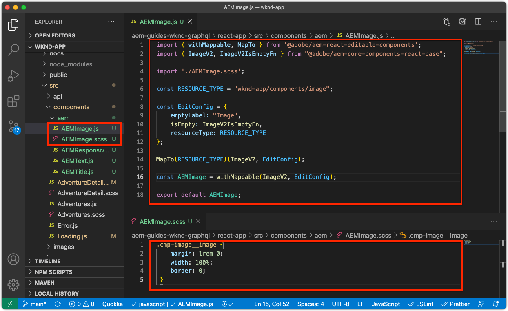
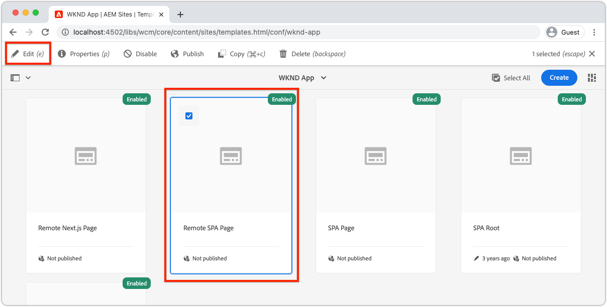

# 편집 가능한 컨테이너 구성 요소

[고정 ](./spa-fixed-component.md) 구성 요소는 SPA 컨텐츠를 작성하는 데 약간의 유연성을 제공하지만, 이 접근 방식은 까다롭고 개발자가 편집 가능한 컨텐츠의 정확한 구성을 정의해야 합니다. 작성자에 의한 예외적인 경험 만들기를 지원하기 위해 SPA 편집기는 SPA에서 컨테이너 구성 요소의 사용을 지원합니다. 컨테이너 구성 요소를 사용하면 작성자가 기존의 AEM Sites 작성에서 하듯이 허용된 구성 요소를 컨테이너에 드래그하여 놓고 작성할 수 있습니다.


이 장에서는 SPA에서 직접 AEM React 코어 구성 요소를 사용하여 리치 컨텐츠 경험을 작성하고 레이아웃할 수 있는 편집 가능한 컨테이너를 홈 보기에 추가합니다.

## WKND 앱 업데이트

홈 보기에 컨테이너 구성 요소를 추가하려면

+ AEM React 편집 가능한 구성 요소의 ResponsiveGrid 구성 요소 가져오기
+ 컨테이너 구성 요소에서 사용할 AEM React 코어 구성 요소(텍스트 및 이미지)를 가져오고 등록합니다

### ResponsiveGrid 컨테이너 구성 요소에서 가져오기

편집 가능한 영역을 홈 보기에 배치하려면 다음을 수행해야 합니다.

1. `@adobe/aem-react-editable-components`에서 ResponsiveGrid 구성 요소를 가져옵니다.
1. 개발자가 SPA에 배치할 수 있도록 `withMappable`을 사용하여 등록합니다
1. 또한 `MapTo`에 등록하여 다른 컨테이너 구성 요소에서 다시 사용할 수 있도록 함으로써 컨테이너를 효과적으로 중첩합니다.

이를 위해 진행되는 작업:

1. IDE에서 SPA 프로젝트를 엽니다.
1. `src/components/aem/AEMResponsiveGrid.js`에 React 구성 요소를 만듭니다.
1. 다음 코드를 `AEMResponsiveGrid.js`에 추가합니다

   ```
   // Import the withMappable API provided bu the AEM SPA Editor JS SDK
   import { withMappable, MapTo } from '@adobe/aem-react-editable-components';
   
   // Import the base ResponsiveGrid component
   import { ResponsiveGrid } from "@adobe/aem-react-editable-components";
   
   // The sling:resourceType for which this Core Component is registered with in AEM
   const RESOURCE_TYPE = "wcm/foundation/components/responsivegrid";
   
   // Create an EditConfig to allow the AEM SPA Editor to properly render the component in the Editor's context
   const EditConfig = {
       emptyLabel: "Layout Container",  // The component placeholder in AEM SPA Editor
       isEmpty: function(props) { 
           return props.cqItemsOrder == null || props.cqItemsOrder.length === 0;
       },                              // The function to determine if this component has been authored
       resourceType: RESOURCE_TYPE     // The sling:resourceType this SPA component is mapped to
   };
   
   // MapTo allows the AEM SPA Editor JS SDK to dynamically render components added to SPA Editor Containers
   MapTo(RESOURCE_TYPE)(ResponsiveGrid, EditConfig);
   
   // withMappable allows the component to be hardcoded into the SPA; <AEMResponsiveGrid .../>
   const AEMResponsiveGrid = withMappable(ResponsiveGrid, EditConfig);
   
   export default AEMResponsiveGrid;
   ```

코드는 `AEMTitle.js`AEM Reach 코어 구성 요소의 제목 구성 요소](./spa-fixed-component.md)를 가져온 것과 유사합니다.[


`AEMResponsiveGrid.js` 파일은 다음과 같습니다.


### AEMRresponsiveGrid SPA 구성 요소 사용

이제 AEM ResponsiveGrid 구성 요소가에 등록되었으며 SPA 내에서 사용할 수 있으므로 홈 보기에 배치할 수 있습니다.

1. `react-app/src/App.js` 열기 및 편집
1. `AEMResponsiveGrid` 구성 요소를 가져와 `<AEMTitle ...>` 구성 요소 위에 놓습니다.
1. `<AEMResponsiveGrid...>` 구성 요소에서 다음 속성을 설정하십시오
   + `pagePath = '/content/wknd-app/us/en/home'`
   + `itemPath = 'root/responsivegrid'`

   이렇게 하면 이 `AEMResponsiveGrid` 구성 요소가 AEM 리소스에서 해당 컨텐츠를 검색하도록 지시합니다.

   + `/content/wknd-app/us/en/home/jcr:content/root/responsivegrid`

   `itemPath`은 `Remote SPA Page` AEM 템플릿에 정의된 `responsivegrid` 노드에 매핑되며 `Remote SPA Page` AEM 템플릿에서 만든 새 AEM 페이지에 자동으로 만들어집니다.

   `App.js` 을 업데이트하여 `<AEMResponsiveGrid...>` 구성 요소를 추가합니다.

   ```
   ...
   import AEMResponsiveGrid from './components/aem/AEMResponsiveGrid';
   ...
   
   function Home() {
   return (
       <div className="Home">
           <AEMResponsiveGrid
               pagePath='/content/wknd-app/us/en/home' 
               itemPath='root/responsivegrid'/>
   
           <AEMTitle
               pagePath='/content/wknd-app/us/en/home' 
               itemPath='title'/>
           <Adventures />
       </div>
   );
   }
   ```

`Apps.js` 파일은 다음과 같습니다.


## 편집 가능한 구성 요소 만들기

SPA Editor에서 제공하는 유연한 작성 경험 컨테이너의 전체 효과를 얻을 수 있습니다. 이미 편집 가능한 제목 구성 요소를 만들었지만 작성자가 새로 추가된 컨테이너 구성 요소에서 텍스트 및 이미지 AEM WCM 핵심 구성 요소를 사용할 수 있도록 몇 가지 더 추가하겠습니다.

### 텍스트 구성 요소

1. IDE에서 SPA 프로젝트를 엽니다.
1. `src/components/aem/AEMText.js`에 React 구성 요소를 만듭니다.
1. 다음 코드를 `AEMText.js`에 추가합니다

   ```
   import { withMappable, MapTo } from '@adobe/aem-react-editable-components';
   import { TextV2, TextV2IsEmptyFn } from "@adobe/aem-core-components-react-base";
   
   const RESOURCE_TYPE = "wknd-app/components/text";
   
   const EditConfig = {    
       emptyLabel: "Text",
       isEmpty: TextV2IsEmptyFn,
       resourceType: RESOURCE_TYPE
   };
   
   MapTo(RESOURCE_TYPE)(TextV2, EditConfig);
   
   const AEMText = withMappable(TextV2, EditConfig);
   
   export default AEMText;
   ```

`AEMText.js` 파일은 다음과 같습니다.


### 이미지 구성 요소

1. IDE에서 SPA 프로젝트를 엽니다.
1. `src/components/aem/AEMImage.js`에 React 구성 요소를 만듭니다.
1. 다음 코드를 `AEMImage.js`에 추가합니다

   ```
   import { withMappable, MapTo } from '@adobe/aem-react-editable-components';
   import { ImageV2, ImageV2IsEmptyFn } from "@adobe/aem-core-components-react-base";
   
   const RESOURCE_TYPE = "wknd-app/components/image";
   
   const EditConfig = {    
       emptyLabel: "Image",
       isEmpty: ImageV2IsEmptyFn,
       resourceType: RESOURCE_TYPE
   };
   
   MapTo(RESOURCE_TYPE)(ImageV2, EditConfig);
   
   const AEMImage = withMappable(ImageV2, EditConfig);
   
   export default AEMImage;
   ```

1. `AEMImage.scss`에 대한 사용자 지정 스타일을 제공하는 SCSS 파일 `src/components/aem/AEMImage.scss`을 만듭니다. 이러한 스타일은 AEM React 코어 구성 요소의 BEM 표기법 CSS 클래스를 타깃팅합니다.
1. 다음 SCSS를 `AEMImage.scss`에 추가합니다.

   ```
   .cmp-image__image {
       margin: 1rem 0;
       width: 100%;
       border: 0;
    }
   ```

1. `AEMImage.js`에서 `AEMImage.scss` 가져오기

   ```
   ...
   import './AEMImage.scss';
   ...
   ```

`AEMImage.js` 및 `AEMImage.scss` 는 다음과 같아야 합니다.



### 편집 가능한 구성 요소 가져오기

새로 만든 `AEMText` 및 `AEMImage` SPA 구성 요소는 SPA에서 참조되며, AEM에서 반환된 JSON을 기반으로 동적으로 인스턴스화됩니다. 이러한 구성 요소를 SPA에서 사용할 수 있도록 하려면 `App.js`에서 해당 구성 요소에 대한 가져오기 구문을 만듭니다

1. IDE에서 SPA 프로젝트를 엽니다.
1. `src/App.js` 파일을 엽니다.
1. `AEMText` 및 `AEMImage`에 대한 가져오기 구문을 추가합니다.

   ```
   ...
   import AEMText from './components/aem/AEMText';
   import AEMImage from './components/aem/AEMImage';
   ...
   ```


결과는 다음과 같습니다.


이러한 가져오기가&#x200B;_추가되지 않은_&#x200B;이면 `AEMText` 및 `AEMImage` 코드가 SPA에 의해 호출되지 않으므로 구성 요소가 제공된 리소스 유형에 대해 등록되지 않습니다.

## AEM에서 컨테이너 구성

AEM 컨테이너 구성 요소는 정책을 사용하여 허용된 구성 요소를 나타냅니다. SPA 구성 요소 옆에 매핑된 AEM WCM 코어 구성 요소만 SPA에서 렌더링할 수 있으므로 SPA 편집기를 사용할 때 중요한 구성입니다. 에 SPA 구현을 제공한 구성 요소만 허용됩니다.

+ `AEMTitle` 매핑된 대상  `wknd-app/components/title`
+ `AEMText` 매핑된 대상  `wknd-app/components/text`
+ `AEMImage` 매핑된 대상  `wknd-app/components/image`

원격 SPA 페이지 템플릿의 Reponsivegrid 컨테이너를 구성하려면 다음을 수행합니다.

1. AEM 작성자에 로그인
1. __도구 > 일반 > 템플릿 > WKND 앱__&#x200B;으로 이동합니다.
1. __보고서 SPA 페이지__ 편집

   

1. 오른쪽 상단의 모드 전환기에서 __구조__&#x200B;를 선택합니다
1. 탭하여 __레이아웃 컨테이너__ 선택
1. 팝업 막대에서 __정책__ 아이콘을 탭합니다

   

1. 오른쪽의 __허용된 구성 요소__ 탭에서 __WKND APP - CONTENT__&#x200B;를 확장합니다
1. 다음을 선택하기만 하면 됩니다.
   + 이미지
   + 텍스트
   + 제목

   

1. __Done__&#x200B;을 누릅니다

## AEM에서 컨테이너 작성

`<AEMResponsiveGrid...>` 을 포함하도록 SPA이 업데이트되어 3개의 AEM React 코어 구성 요소(`AEMTitle`, `AEMText` 및 `AEMImage`)에 대한 래퍼가 업데이트되고, 일치하는 템플릿 정책으로 AEM이 업데이트되면 컨테이너 구성 요소에서 컨텐츠 작성을 시작할 수 있습니다.

1. AEM 작성자에 로그인
1. __사이트 > WKND 앱__&#x200B;으로 이동합니다.
1. __Home__&#x200B;을 탭하고 맨 위 작업 표시줄에서 __편집__&#x200B;을 선택합니다
   + AEM 프로젝트 원형 중 프로젝트를 생성할 때 자동으로 추가되었으므로 &quot;Hello World&quot; 텍스트 구성 요소가 표시됩니다
1. 페이지 편집기의 오른쪽 상단에 있는 모드 선택기에서 __편집__&#x200B;을 선택합니다
1. 제목 아래에서 __레이아웃 컨테이너__ 편집 가능한 영역을 찾습니다
1. __페이지 편집기의 측면 막대__&#x200B;을 열고 __구성 요소 보기__&#x200B;를 선택합니다
1. 다음 구성 요소를 __레이아웃 컨테이너__&#x200B;로 드래그합니다.
   + 이미지
   + 제목
1. 구성 요소를 드래그하여 다음 순서로 재정렬합니다.
   1. 제목
   1. 이미지
   1. 텍스트
1. ____ 작성  ____ 제목 구성 요소
   1. 제목 구성 요소를 탭하고 __렌치__ 아이콘을 탭하여 __편집__ 제목 구성 요소
   1. 다음 텍스트를 추가합니다.
      + 제목:__여름이 다가온다.__
      + 유형:__H1__
   1. __Done__&#x200B;을 누릅니다
1. ____ Imagecomponent  ____ 작성
   1. 이미지 구성 요소의 사이드 바(자산 보기로 전환한 후)에서 이미지를 드래그합니다
   1. 이미지 구성 요소를 탭하고 __렌치__ 아이콘을 탭하여 편집합니다
   1. __이미지가 장식용임__ 확인란을 선택합니다.
   1. __Done__&#x200B;을 누릅니다
1. ____ 텍스트 구성  ____ 요소 작성
   1. 텍스트 구성 요소를 탭하고 __렌치__ 아이콘을 탭하여 텍스트 구성 요소를 편집합니다
   1. 다음 텍스트를 추가합니다.
      + _지금, 여러분은 1주간의 모든 모험에서 15퍼센트를 얻을 수 있고, 2주 이상 되는 모든 모험에서 20퍼센트를 받을 수 있습니다! 체크아웃 시 할인을 받으려면 캠페인 코드 SUMMERISCOMING을 추가하면 됩니다!_
   1. __Done__&#x200B;을 누릅니다

1. 이제 구성 요소가 작성되었지만 수직으로 스택됩니다.

   

   구성 요소의 크기 및 레이아웃을 조정할 수 있도록 하려면 AEM 레이아웃 모드 를 사용하십시오.

1. 오른쪽 상단의 모드 선택기를 사용하여 __레이아웃 모드__&#x200B;로 전환합니다.
1. ____ 이미지 및 텍스트 구성 요소의 크기를 나란히 지정합니다
   + ____ Imagecomponent는  __8열 너비여야 합니다.__
   + ____ 텍스트 구성 요소의 너비는  __3열이어야 합니다__

   

1. ____ AEM 페이지 편집기에서 변경 사항 미리 보기
1. [http://localhost:3000](http://localhost:3000)에서 로컬로 실행되는 WKND 앱을 새로 고쳐 작성된 변경 사항을 확인합니다!

   


## 축하합니다!

작성자가 편집 가능한 구성 요소를 WKND 앱에 추가할 수 있는 컨테이너 구성 요소를 추가했습니다. 이제 방법을 알 수 있습니다.

+ SPA에서 AEM React 편집 가능한 구성 요소의 ResponsiveGrid 구성 요소를 사용합니다
+ 컨테이너 구성 요소를 통해 SPA에서 사용할 AEM React 코어 구성 요소(텍스트 및 이미지)를 등록합니다
+ SPA이 활성화된 핵심 구성 요소를 허용하도록 원격 SPA 페이지 템플릿을 구성합니다
+ 컨테이너 구성 요소에 편집 가능한 구성 요소 추가
+ SPA 편집기의 작성자 및 레이아웃 구성 요소

## 다음 단계

다음 단계에서는 다음과 같은 기술을 사용하여 SPA의 Adventure Details 경로](./spa-dynamic-routes.md)에 편집 가능한 구성 요소를 추가합니다.[
