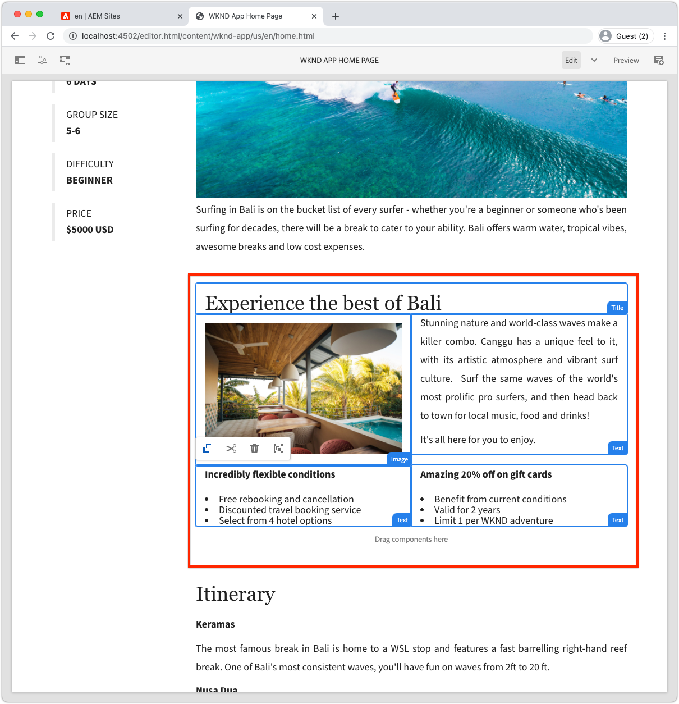

# 동적 경로 및 편집 가능한 구성 요소

이 장에서는 두 개의 동적 Adventure Detail 경로를 사용하여 편집 가능한 구성 요소를 지원합니다.__Bali Surf Camp__ 및 __Beervana in Portland__.


Adventure Detail SPA 경로는 `/adventure:path`으로 정의됩니다. 여기서 `path`은 WKND Adventure(컨텐츠 조각)에 대한 세부 정보를 표시하는 경로입니다.

## SPA URL을 AEM 페이지에 매핑

이전 두 장의 장에서 SPA 홈 보기의 편집 가능한 구성 요소 컨텐츠를 AEM의 `/content/wknd-app/us/en/`에 있는 해당 원격 SPA 루트 페이지에 매핑했습니다.

SPA 동적 경로에 대해 편집 가능한 구성 요소에 대한 매핑을 정의하는 것은 비슷하지만 라우트의 인스턴스와 AEM 페이지 간에 1:1 매핑 체계를 만들어야 합니다.

이 자습서에서는 경로의 마지막 세그먼트인 WKND Adventure 컨텐츠 조각 이름을 선택하고 이 이름을 `/content/wknd-app/us/en/adventure` 아래의 간단한 경로에 매핑합니다.

| 원격 SPA 경로 | AEM 페이지 경로 |
|------------------------------------|--------------------------------------------|
| / | /content/wknd-app/us/en/home |
| /adventure:/content/dam/wknd/en/adventures/bali-surf-camp/__발리-surf-camp__ | /content/wknd-app/us/en/home/adventure/__발리-surf-camp__ |
| /adventure:/content/dam/wknd/en/adventures/beervana-portland/__beervana-portland__ | /content/wknd-app/us/en/home/adventure/__beervana-in-portland__ |

따라서 이 매핑을 토대로 우리는 다음 위치에서 두 개의 새 AEM 페이지를 만들어야 합니다.

+ `/content/wknd-app/us/en/home/adventure/bali-surf-camp`
+ `/content/wknd-app/us/en/home/adventure/beervana-in-portland`

## 원격 SPA 매핑

원격 SPA을 떠나는 요청에 대한 매핑은 SPA](./spa-bootstrap.md)의 [Bootstrap에서 수행한 `setupProxy` 구성을 통해 구성됩니다.

## SPA 편집기 매핑

SPA SPA 편집기를 통해 AEM을 열 때의 SPA 요청에 대한 매핑은 [AEM](./aem-configure.md)에서 수행된 Sling 매핑 구성을 통해 구성됩니다.

## AEM에서 컨텐츠 페이지 만들기

먼저 중간 `adventure` 페이지 세그먼트를 만듭니다.

1. AEM 작성자 로그인
1. __사이트 > WKND 앱 > us > en > WKND 앱 홈 페이지로 이동__
   + 이 AEM 페이지는 SPA의 루트로 매핑되므로 다른 SPA 경로용 AEM 페이지 구조를 만들기 시작합니다.
1. __만들기__&#x200B;를 누르고 __페이지__&#x200B;를 선택합니다.
1. __원격 SPA 페이지__ 템플릿을 선택하고 __다음__&#x200B;을 탭합니다.
1. 페이지 속성 채우기
   + __제목__:모험
   + __이름__: `adventure`
      + 이 값은 AEM 페이지의 URL을 정의하므로 SPA의 경로 세그먼트와 일치해야 합니다.
1. __Done__&#x200B;을 누릅니다

그런 다음 편집 가능한 영역이 필요한 각 SPA URL에 해당하는 AEM 페이지를 만듭니다.

1. 사이트 관리자의 새 __모험__ 페이지로 이동합니다.
1. __만들기__&#x200B;를 누르고 __페이지__&#x200B;를 선택합니다.
1. __원격 SPA 페이지__ 템플릿을 선택하고 __다음__&#x200B;을 탭합니다.
1. 페이지 속성 채우기
   + __제목__:발리 서프 캠프
   + __이름__: `bali-surf-camp`
      + 이 값은 AEM 페이지의 URL을 정의하므로 SPA 경로의 마지막 세그먼트와 일치해야 합니다
1. __Done__&#x200B;을 누릅니다
1. 3-6단계를 반복하여 Portland __페이지에__ Beervana 페이지를 만듭니다. 이 페이지는 다음과 같습니다.
   + __제목__:포틀랜드의 비르바나
   + __이름__: `beervana-in-portland`
      + 이 값은 AEM 페이지의 URL을 정의하므로 SPA 경로의 마지막 세그먼트와 일치해야 합니다

이 두 AEM 페이지에는 일치하는 SPA 경로에 대해 작성된 각 컨텐츠가 들어 있습니다. 다른 SPA 경로가 작성되어야 하는 경우 AEM에서 원격 SPA 페이지의 루트 페이지(`/content/wknd-app/us/en/home`)에 있는 SPA URL에서 새 AEM 페이지를 만들어야 합니다.

## WKND 앱 업데이트

[마지막 장](./spa-container-component.md)에서 만든 `<AEMResponsiveGrid...>` 구성 요소를 `AdventureDetail` SPA 구성 요소에 배치하여 편집 가능한 컨테이너를 만듭니다.

### AEMRespiongrid SPA 구성 요소 배치

`AdventureDetail` 구성 요소에 `<AEMResponsiveGrid...>`을 배치하면 해당 경로에 편집 가능한 컨테이너가 만들어집니다. 비결은 여러 경로가 `AdventureDetail` 구성 요소를 사용하여 렌더링하기 때문에 `<AEMResponsiveGrid...>'s pagePath` 특성을 동적으로 조정해야 합니다. `pagePath`은 라우트의 인스턴스가 표시되는 탐색을 기준으로 해당 AEM 페이지를 가리키도록 파생되어야 합니다.

1. `react-app/src/components/AdventureDetail.js` 열기 및 편집
1. 컨텐츠 조각 경로에서 모험 이름을 파생시키는 `AdventureDetail(..)'s` 두 번째 `return(..)` 문 앞에 다음 줄을 추가합니다.

   ```
   ...
   // Get the last segment of the Adventure Content Fragment path to used to generate the pagePath for the AEMResponsiveGrid
   const adventureName = adventureData._path.split('/').pop();
   ...
   ```

1. `AEMResponsiveGrid` 구성 요소를 가져와 `<h2>Itinerary</h2>` 구성 요소 위에 배치합니다.
1. `<AEMResponsiveGrid...>` 구성 요소에서 다음 특성을 설정합니다.
   + `pagePath = '/content/wknd-app/us/en/home/adventure/${adventureName}'`
   + `itemPath = 'root/responsivegrid'`

   이렇게 하면 `AEMResponsiveGrid` 구성 요소가 AEM 리소스에서 해당 컨텐츠를 검색하도록 지시됩니다.

   + `/content/wknd-app/us/en/home/adventure/${adventureName}/jcr:content/root/responsivegrid`


다음 행으로 `AdventureDetail.js`을(를) 업데이트합니다.

```
...
import AEMResponsiveGrid from '../components/aem/AEMResponsiveGrid';
...

function AdventureDetail(props) {
    ...
    // Get the last segment of the Adventure Content Fragment path to used to generate the pagePath for the AEMResponsiveGrid
    const adventureName = adventureData._path.split('/').pop();

    return(
        ...
        <AEMResponsiveGrid 
            pagePath={`/content/wknd-app/us/en/home/adventure/${adventureName}`}
            itemPath="root/responsivegrid"/>
            
        <h2>Itinerary</h2>
        ...
    )
}
```

`AdventureDetail.js` 파일은 다음과 같아야 합니다.


## AEM에서 컨테이너 작성

렌더링되는 탐색을 기반으로 `<AEMResponsiveGrid...>`이(가) 제자리에 있고 `pagePath`이(가) 동적으로 설정되므로, Adobe에서는 해당 컨텐츠에 컨텐츠를 작성하려고 합니다.

1. AEM 작성자 로그인
1. __사이트 > WKND 앱 > us > en__&#x200B;으로 이동합니다.
1. ____ WKND  __앱 홈 페이지__ 편집
   + SPA에서 __발리 서프 캠프__ 경로로 이동하여 편집합니다.
1. 오른쪽 상단의 모드 선택기에서 __미리 보기__&#x200B;를 선택합니다.
1. SPA에서 __Bali Surf Camp__ 카드를 눌러 해당 경로로 이동합니다.
1. mode-selector에서 __편집__&#x200B;을 선택합니다.
1. __일정__ 바로 위에 있는 __레이아웃 컨테이너__ 편집 가능 영역을 찾습니다.
1. __페이지 편집기의 측면 막대__&#x200B;를 열고 __구성 요소 보기__&#x200B;를 선택합니다.
1. 활성화된 구성 요소 중 일부를 __레이아웃 컨테이너__&#x200B;로 드래그합니다.
   + 이미지
   + 텍스트
   + 제목

   홍보용 마케팅 자료를 만들 수 있습니다. 다음과 같이 보일 수 있습니다.

   

1. __AEM__ 페이지 편집기에서 변경 내용 미리 보기
1. [http://localhost:3000](http://localhost:3000)에서 로컬로 실행 중인 WKND 앱을 새로 고쳐서 __Bali Surf Camp__ 경로로 이동하여 제작된 변경 내용을 확인합니다!

   

매핑된 AEM Page가 없는 모험 세부 정보 경로로 이동하는 경우, 해당 경로 인스턴스에서 작성 기능이 없습니다. 이러한 페이지에서 작성을 활성화하려면 __Adventure__ 페이지 아래에 일치하는 이름으로 AEM 페이지를 만드십시오.

## 축하합니다!

축하합니다! SPA의 동적 경로에 저작 기능이 추가되었습니다.

+ AEM React Editable 구성 요소의 ResponsiveGrid 구성 요소를 동적 경로에 추가했습니다.
+ SPA(Bali Surf Camp and Beervana in Portland)에서 두 개의 특정 루트 저작을 지원하는 AEM 페이지를 만들었습니다.
+ 역동적인 발리 서프 캠프 루트에서 콘텐츠를 제작했습니다!

이제 AEM SPA 편집기를 사용하여 원격 SPA에 특정 편집 가능 영역을 추가하는 방법에 대한 첫 번째 단계를 살펴보았습니다!


>[!NOTE]
>
>채널을 고정하세요! 이 자습서는 Cloud Service 및 프로덕션 환경에서 SPA 편집기 솔루션을 AEM에 배포하는 방법에 대한 Adobe의 모범 사례와 권장 사항을 포함하도록 확장됩니다.