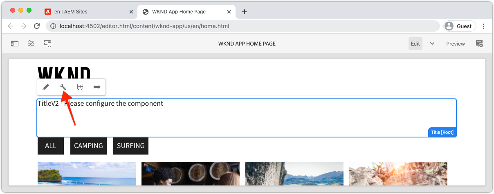

# 편집 가능한 고정 구성 요소

편집 가능한 반응 구성 요소는 SPA 보기에 &quot;고정&quot; 또는 하드 코딩될 수 있습니다. 이를 통해 개발자는 SPA Editor 호환 구성 요소를 SPA 뷰에 놓고 사용자가 AEM SPA Editor에서 구성 요소의 컨텐츠를 작성할 수 있습니다.


이 장에서는 `Home.js`에 있는 하드 코딩된 텍스트인 홈 보기의 제목인 &quot;현재 모험&quot;을 수정되지만 편집 가능한 제목 구성 요소로 대체합니다. 고정 구성 요소는 제목 배치를 보장하지만 제목의 텍스트를 작성하고 개발 주기 외부에서 변경할 수도 있습니다.

## WKND 앱 업데이트

[홈] 보기에 구성 요소를 추가하려면:

+ AEM React Core Component Title 구성 요소를 가져와 프로젝트의 제목 리소스 유형에 등록합니다.
+ 편집 가능한 제목 구성 요소를 SPA 홈 보기에 배치

### AEM 반응형 핵심 구성 요소의 제목 구성 요소로 가져오기

SPA 홈 보기에서 하드 코딩된 텍스트 `<h2>Current Adventures</h2>`을 AEM React Core Components의 제목 구성 요소로 바꿉니다. 제목 구성 요소를 사용하려면 먼저 다음을 수행해야 합니다.

1. `@adobe/aem-core-components-react-base`에서 제목 구성 요소 가져오기
1. 개발자가 SPA에 배치할 수 있도록 `withMappable`을 사용하여 등록하십시오.
1. 또한 `MapTo`에 등록하면 나중에 [컨테이너 구성 요소에서 사용할 수 있습니다](./spa-container-component.md).

이를 위해 진행되는 작업:

1. IDE의 `~/Code/wknd-app/aem-guides-wknd-graphql/react-app`에서 원격 SPA 프로젝트 열기
1. `react-app/src/components/aem/AEMTitle.js`에서 반응 구성 요소 만들기
1. 다음 코드를 `AEMTitle.js`에 추가합니다.

   ```
   // Import the withMappable API provided by the AEM SPA Editor JS SDK
   import { withMappable, MapTo } from '@adobe/aem-react-editable-components';
   
   // Import the AEM React Core Components' Title component implementation and it's Empty Function 
   import { TitleV2, TitleV2IsEmptyFn } from "@adobe/aem-core-components-react-base";
   
   // The sling:resourceType for which this Core Component is registered with in AEM
   const RESOURCE_TYPE = "wknd-app/components/title";
   
   // Create an EditConfig to allow the AEM SPA Editor to properly render the component in the Editor's context
   const EditConfig = {    
       emptyLabel: "Title",  // The component placeholder in AEM SPA Editor
       isEmpty: TitleV2IsEmptyFn, // The function to determine if this component has been authored
       resourceType: RESOURCE_TYPE // The sling:resourceType this component is mapped to
   };
   
   // MapTo allows the AEM SPA Editor JS SDK to dynamically render components added to SPA Editor Containers
   MapTo(RESOURCE_TYPE)(TitleV2, EditConfig);
   
   // withMappable allows the component to be hardcoded into the SPA; <AEMTitle .../>
   const AEMTitle = withMappable(TitleV2, EditConfig);
   
   export default AEMTitle;
   ```

구현에 대한 자세한 내용은 코드의 주석을 참조하십시오.

`AEMTitle.js` 파일은 다음과 같아야 합니다.


### 반응형 AEMTitle 구성 요소 사용

이제 AEM React 코어 구성 요소의 제목 구성 요소가 등록되어 React 앱 내에서 사용할 수 있게 되었으므로 홈 보기에서 하드 코딩된 제목 텍스트를 대체합니다.

1. 편집 `react-app/src/App.js`
1. 맨 아래의 `Home()`에서 하드 코딩된 제목을 새 `AEMTitle` 구성 요소로 바꿉니다.

   ```
   <h2>Current Adventures</h2>
   ```

   with

   ```
   <AEMTitle
       pagePath='/content/wknd-app/us/en/home' 
       itemPath='root/title'/>
   ```

   다음 코드로 `Apps.js`을(를) 업데이트합니다.

   ```
   ...
   import { AEMTitle } from './components/aem/AEMTitle';
   ...
   function Home() {
       return (
           <div className="Home">
   
               <AEMTitle
                   pagePath='/content/wknd-app/us/en/home' 
                   itemPath='root/title'/>
   
               <Adventures />
           </div>
       );
   }
   ```

`Apps.js` 파일은 다음과 같아야 합니다.


## AEM에서 제목 구성 요소 작성

1. AEM 작성자 로그인
1. __사이트 > WKND 앱__&#x200B;으로 이동합니다.
1. __Home__&#x200B;을 누르고 위쪽 작업 표시줄에서 __편집__&#x200B;을 선택합니다.
1. 페이지 편집기의 오른쪽 상단에 있는 편집 모드 선택기에서 __편집__&#x200B;을 선택합니다.
1. 파란색 편집 윤곽선이 표시될 때까지 WKND 로고 아래 및 모험 목록 위에 기본 제목 텍스트 위로 마우스를 가져갑니다.
1. 을 눌러 구성 요소의 작업 표시줄을 표시한 다음 __렌치__&#x200B;를 눌러 편집합니다.

   

1. 제목 구성 요소를 작성합니다.
   + 제목:__WKND Adventures__
   + 유형/크기:__H2__

      

1. __완료__&#x200B;를 눌러 저장합니다.
1. AEM SPA Editor에서 변경 내용 미리 보기
1. [http://localhost:3000](http://localhost:3000)에서 로컬로 실행 중인 WKND 앱을 새로 고치고, 즉시 반영된 제작된 제목 변경 내용을 확인합니다.

   

## 축하합니다!

고정 편집 가능한 구성 요소를 WKND 앱에 추가했습니다! 이제 다음과 같은 방법을 알 수 있습니다.

+ SPA에서 AEM 반응형 핵심 구성 요소 가져오기 및 재사용
+ SPA에 고정되었지만 편집 가능한 구성 요소 추가
+ AEM에서 고정 구성 요소 작성
+ 원격 SPA에서 제작된 콘텐츠 보기

## 다음 단계

다음 단계는 작성자가 SPA에 구성 요소를 추가 및 편집할 수 있도록 하는 AEM ResponsiveGrid 컨테이너 구성 요소](./spa-container-component.md)를 추가하는 것입니다![
