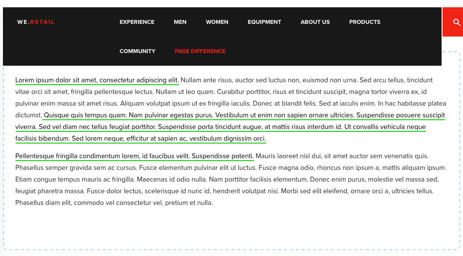

# 페이지 차이 {#developing-for-page-difference}에 대한 개발

이 비디오에서는 AEM Sites의 페이지 차이 기능에 대한 사용자 지정 스타일을 제공하는 방법을 보여줍니다.

## 페이지 차이 스타일 사용자 지정 {#customizing-page-difference-styles}

>[!VIDEO](https://video.tv.adobe.com/v/18871/?quality=9&learn=on)

>[!NOTE]
>
>이 비디오에서는 사용자 지정 CSS를 we.Retail 클라이언트 라이브러리에 추가합니다. 여기서 customizer의 AEM Sites 프로젝트를 변경해야 합니다.아래 예제 코드에서:`my-project`

AEM 페이지 차이는 `/libs/cq/gui/components/common/admin/diffservice/clientlibs/diffservice/css/htmldiff.css`의 직접 로드를 통해 OOTB CSS를 가져옵니다.

클라이언트 라이브러리 카테고리를 사용하지 않고 CSS의 직접 로드 때문에 사용자 지정 스타일에 대한 다른 삽입 지점을 찾아야 하며 이 사용자 지정 삽입 지점은 프로젝트의 authoring clientlib입니다.

이렇게 하면 이러한 사용자 지정 스타일 무시를 임차인별로 지정할 수 있는 이점이 있습니다.

### 작성 clientlib {#prepare-the-authoring-clientlib} 준비

`/apps/my-project/clientlib/authoring.`에서 프로젝트에 대한 `authoring` clientlib이 있는지 확인합니다.

```xml
<?xml version="1.0" encoding="UTF-8"?>
<jcr:root xmlns:cq="http://www.day.com/jcr/cq/1.0" xmlns:jcr="http://www.jcp.org/jcr/1.0"
        jcr:primaryType="cq:ClientLibraryFolder"
        categories="[my-project.authoring]"/>
```

### 사용자 지정 CSS {#provide-the-custom-css} 제공

재정의 스타일을 제공하는 보다 작은 파일을 가리키는 프로젝트의 `authoring` clientlib에 를 추가합니다. `css.txt` [](https://lesscss.org/) 이 예제에서 활용되는 클래스 래핑 등 여러 가지 편리한 기능으로 인해 Lesis가 선호됩니다.

```shell
base=./css

htmldiff.less
```

`/apps/my-project/clientlibs/authoring/css/htmldiff.less`에서 스타일 재정의가 포함된 `less` 파일을 만들고 필요에 따라 오버링 스타일을 제공합니다.

```css
/* Wrap with body to gives these rules more specificity than the OOTB */
body {

    /* .html-XXXX are the styles that wrap text that has been added or removed */

    .html-added {
        background-color: transparent;
     color: initial;
        text-decoration: none;
     border-bottom: solid 2px limegreen;
    }

    .html-removed {
        background-color: transparent;
     color: initial;
        text-decoration: none;
     border-bottom: solid 2px red;
    }

    /* .cq-component-XXXX require !important as the class these are overriding uses it. */

    .cq-component-changed {
        border: 2px dashed #B9DAFF !important;
        border-radius: 8px;
    }
    
    .cq-component-moved {
        border: 2px solid #B9DAFF !important;
        border-radius: 8px;
    }

    .cq-component-added {
        border: 2px solid #CCEBB8 !important;
        border-radius: 8px;
    }

    .cq-component-removed {
        border: 2px solid #FFCCCC !important;
        border-radius: 8px;
    }
}
```

### 페이지 구성 요소 {#include-the-authoring-clientlib-css-via-the-page-component}을 통해 작성 clientlib CSS를 포함합니다

`</head>` 태그 바로 앞에 있는 프로젝트의 기본 페이지의 `/apps/my-project/components/structure/page/customheaderlibs.html`에 authoring clientlibs 카테고리를 포함하여 스타일이 로드되도록 합니다.

이러한 스타일은 [!UICONTROL 편집] 및 [!UICONTROL 미리 보기] WCM 모드로 제한되어야 합니다.

```xml
<head>
  ...
  <sly data-sly-test="${wcmmode.preview || wcmmode.edit}" 
       data-sly-call="${clientLib.css @ categories='my-project.authoring'}"/>
</head>
```

위의 스타일이 적용된 diff의 페이지 종료 결과는 다음과 같습니다(HTML이 추가되고 구성 요소가 변경됨).



## 추가 리소스 {#additional-resources}

* [we.Retail 샘플 사이트 다운로드](https://github.com/Adobe-Marketing-Cloud/aem-sample-we-retail/releases)
* [AEM 클라이언트 라이브러리 사용](https://helpx.adobe.com/experience-manager/6-5/sites/developing/using/clientlibs.html)
* [Less CSS 설명서](https://lesscss.org/)
