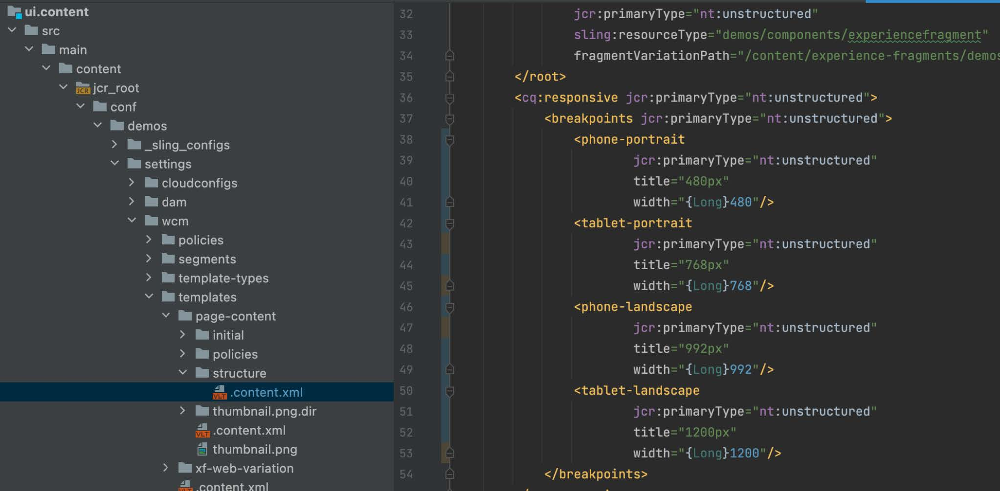

# 응답형 중단점

AEM 응답형 페이지 편집기의 새로운 응답형 중단점을 구성하는 방법을 알아봅니다.

## CSS 중단점 만들기

먼저 응답형 AEM 사이트가 준수하는 AEM 응답형 그리드 CSS에서 미디어 중단점을 만듭니다.

in `/ui.apps/src/main/content/jcr_root/apps/[app name]/clientlibs/clientlib-grid/less/grid.less` 파일, 모바일 에뮬레이터와 함께 사용할 중단점을 만듭니다. 다음 사항에 주의하십시오. `max-width` 각 중단점에 대해, CSS 중단점을 AEM 응답형 페이지 편집기 중단점에 매핑합니다.

## 템플릿의 중단점 사용자 지정

를 엽니다. `ui.content/src/main/content/jcr_root/conf/<app name>/settings/wcm/templates/page-content/structure/.content.xml` 파일 및 업데이트 `cq:responsive/breakpoints` 새 중단점 노드 정의 사용. 각 [CSS 중단점](#create-new-css-breakpoints) 에 해당 노드가 있어야 합니다. `breakpoints` 다음을 수행합니다 `width` CSS 중단점의 속성 설정 `max-width`.

## 에뮬레이터 만들기

AEM 에뮬레이터를 정의해야 작성자가 페이지 편집기에서 편집할 응답형 보기를 선택할 수 있습니다.

아래에 에뮬레이터 노드 만들기 `/ui.apps/src/main/content/jcr_root/apps/<app name>/emulators`

예, `/ui.apps/src/main/content/jcr_root/apps/wknd-examples/emulators/phone-landscape`. 다음에서 참조 에뮬레이터 노드 복사 `/libs/wcm/mobile/components/emulators` CRXDE Lite에서 복사본을 업데이트하고 업데이트하여 노드 정의를 신속히 처리합니다.

## 장치 그룹 만들기

에뮬레이터를 다음으로 그룹화 [AEM 페이지 편집기에서 사용할 수 있도록 합니다.](#update-the-templates-device-group).

만들기 `/apps/settings/mobile/groups/<name of device group>` 노드 구조 `/ui.apps/src/main/content/jcr_root`.

만들기 `.content.xml` 파일 위치 `/apps/settings/mobile/groups/<device group name>` 그리고 아래 코드와 유사한 코드를 사용하여 새 에뮬레이터를 정의합니다.

## 템플릿의 장치 그룹 업데이트

끝으로, 이 템플릿에서 만든 페이지에 대해 페이지 편집기에서 에뮬레이터를 사용할 수 있도록 장치 그룹을 다시 페이지 템플릿에 매핑합니다.

를 엽니다. `ui.content/src/main/content/jcr_root/conf/[app name]/settings/wcm/templates/page-content/structure/.content.xml` 파일 및 업데이트 `cq:deviceGroups` 새 모바일 그룹을 참조하는 속성(예: `cq:deviceGroups="[mobile/groups/customdevices]"`)
