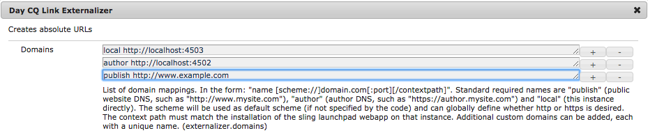

# 소셜 미디어 공유 사용 {#using-social-media-sharing-in-aem-sites}

소셜 미디어 공유 구성 요소 설정 및 사용을 살펴봅니다.

>[!VIDEO](https://video.tv.adobe.com/v/18897?quality=12&learn=on)

이 비디오는 [We.Retail](https://github.com/Adobe-Marketing-Cloud/aem-sample-we-retail#weretail) 샘플 웹 사이트를 사용하여 소셜 미디어 공유 구성 요소([AEM 핵심 구성 요소](https://experienceleague.adobe.com/docs/experience-manager-core-components/using/introduction.html?lang=ko-KR)의 일부)의 다음 기능에 대해 살펴봅니다.

* 0:00 - 소셜 미디어 공유 구성 요소 추가 및 구성
* 1:00 - Facebook에 공유
* 3:10 - Pinterest에 공유
* 6:25 - 제품 페이지에서 소셜 미디어 공유 구성 요소 사용

## 외부화 설정 {#externalizer-setup}

[http://localhost:4502/system/console/configMgr/com.day.cq.commons.impl.ExternalizerImpl](http://localhost:4502/system/console/configMgr/com.day.cq.commons.impl.ExternalizerImpl)

[AEM의 외부화](https://helpx.adobe.com/experience-manager/6-5/sites/developing/using/externalizer.html)을(를) AEM Author와 AEM Publish 모두에 설정하여 게시 실행 모드를 AEM Publish에 액세스하는 데 사용되는 공개적으로 액세스할 수 있는 도메인에 매핑해야 합니다.

이 비디오에서는 `/etc/hosts`을(를) 사용하여 *www.example.com*&#x200B;을(를) 스푸핑하여 localhost로 확인하고, [기본 AEM Dispatcher 구성](https://experienceleague.adobe.com/docs/experience-manager-dispatcher/using/getting-started/dispatcher-install.html)을(를) 사용하여 www.example.com이 AEM Publish을 앞지를 수 있도록 합니다.

## 지원 자료 {#supporting-materials}

* [AEM 핵심 구성 요소 다운로드](https://github.com/adobe/aem-core-wcm-components/releases)
* [We.Retail 다운로드](https://github.com/Adobe-Marketing-Cloud/aem-sample-we-retail/releases)
* [Dispatcher 설치](https://experienceleague.adobe.com/docs/experience-manager-dispatcher/using/getting-started/dispatcher-install.html)
