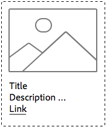

# 스타일 시스템 우수 사례 이해{#understanding-style-organization-with-the-aem-style-system}

>[!NOTE]
>
>AEM Style System에서 [사용하는 BEM-like 규칙을 이해하려면 Understanding how to code for the Style](style-system-technical-video-understand.md)System(스타일 시스템 코드 작성 방법 이해)의 내용을 검토하십시오.

AEM Style System에 대해 구현되는 두 가지 주요 버전 또는 스타일이 있습니다.

* **레이아웃 스타일**
* **스타일 표시**

**레이아웃 스타일은** 구성 요소의 많은 요소에 영향을 주므로 구성 요소의 정의 및 식별 가능한 변환(디자인 및 레이아웃)을 만들 수 있습니다. 이러한 변환 작업은 종종 특정 재사용 가능한 브랜드 개념에 맞춰 수행됩니다. 예를 들어 티저 구성 요소는 일반적인 카드 기반 레이아웃, 수평 홍보 스타일 또는 이미지의 텍스트 오버레이 영웅 레이아웃으로 표시될 수 있습니다.

**표시 스타일은** 레이아웃 스타일의 사소한 변형에 영향을 주는 데 사용되지만 레이아웃 스타일의 기본 속성이나 의도는 변경되지 않습니다. 예를 들어 메인 레이아웃 스타일에는 기본 브랜드 색상 구성표에서 보조 브랜드 색상 구성표로 색상 구성표를 변경하는 표시 스타일이 있을 수 있습니다.

## 스타일 구성 모범 사례 {#style-organization-best-practices}

AEM 작성자가 사용할 수 있는 스타일 이름을 정의할 때 다음 작업이 가장 좋습니다.

* 작성자가 알고 있는 용어를 사용하여 스타일 이름 지정
* 스타일 옵션 수 최소화
* 브랜드 표준에서 허용하는 스타일 옵션과 조합만 표시
* 효과가 있는 스타일 조합만 표시
   * 비효율적인 조합이 노출되어 있는 경우, 적어도 잘못된 효과가 없는지 확인하십시오

AEM 작성자가 사용할 수 있는 가능한 스타일 조합의 수가 증가함에 따라, 브랜드 표준에 대해 QAd가 있어야 하며 검증되어야 하는 순변형이 더 많이 존재합니다. 너무 많은 옵션을 사용하면 원하는 효과를 만들기 위해 어떤 옵션이나 조합이 필요한지 명확하지 않을 수 있으므로 작성자를 혼동시킬 수도 있습니다.

### 스타일 이름과 CSS 클래스 {#style-names-vs-css-classes}

스타일 이름 또는 AEM 작성자에게 제공되는 옵션과 AEM에서 구현 CSS 클래스 이름이 분리됩니다.

이를 통해 스타일 옵션은 AEM 작성자가 명확하게 파악하고 명확하게 이해할 수 있는 어휘로 레이블이 지정되지만 CSS 개발자는 나중에 의미론적 방식으로 CSS 클래스 이름을 지정할 수 있습니다. 예:

구성 요소에는 브랜드의 **기본** 및 **보조****색상과 함께 색상을 지정할 수 있는 옵션이 있어야 하지만 AEM 작성자는 1차 및 2차** 디자인 언어가 아니라 **녹색**&#x200B;및노란색색상으로 알고 있습니다.

AEM Style System은 작성자에게 친숙한 레이블 **Green** 및 **Yellow**&#x200B;를 사용하여 이러한 색상 표시 스타일을 노출할 수 있으며, CSS 개발자는 의미 체계 이름 지정 `.cmp-component--primary-color` 을 사용하고 실제 스타일 구현을 CSS에서 정의할 `.cmp-component--secondary-color` 수 있습니다.

녹색 **의 스타일** 이름은 `.cmp-component--primary-color`에 매핑되고 **노란색은** 에 매핑됩니다 `.cmp-component--secondary-color`.

회사의 브랜드 색상이 향후 변경될 경우, 변경해야 하는 모든 것은 단일 구현 `.cmp-component--primary-color` 및 스타일 이름 `.cmp-component--secondary-color`입니다.

## Teaser 구성 요소를 예로 들 수 있습니다. {#the-teaser-component-as-an-example-use-case}

다음은 Teaser 구성 요소에 여러 가지 다른 레이아웃 및 표시 스타일을 지정하도록 스타일을 지정하는 사용 사례입니다.

이렇게 하면 스타일 이름(작성자에게 노출)과 백업 CSS 클래스가 어떻게 구성되어 있는지 살펴봅니다.

### Teaser 구성 요소 스타일 구성 {#component-styles-configuration}

다음 이미지는 [!UICONTROL 사용 사례에서 설명한 변형에 대한 티저 구성 요소에] 대한 스타일 구성을 보여줍니다.

스타일 [!UICONTROL 그룹] 이름, 레이아웃 및 표시는 이 문서에서 스타일 유형을 개념적으로 분류하는 데 사용되는 표시 스타일 및 레이아웃 스타일의 일반적인 개념과 일치하므로

스타일 [!UICONTROL 그룹] 이름 및 [!UICONTROL 스타일 그룹] 수는 구성 요소 사용 대/소문자 및 프로젝트별 구성 요소 스타일 지정 규칙에 맞게 조정되어야 합니다.

예를 들어, **디스플레이** 스타일 그룹 이름의 이름이 **Colors로 지정되었을 수 있습니다**.


### 스타일 선택 메뉴 {#style-selection-menu}

아래 이미지는 [!UICONTROL 스타일] 메뉴 작성자가 구성 요소에 적합한 스타일을 선택하기 위해 상호 작용하는 이미지를 표시합니다. 스타일 이름 [!UICONTROL 과] 스타일 이름이 모두 작성자에게 노출되어 있습니다.


### Default style {#default-style}

기본 스타일은 종종 구성 요소의 가장 일반적으로 사용되는 스타일이며 페이지에 추가할 때 티저의 기본 스타일이 지정되지 않은 뷰입니다.

기본 스타일의 공통성에 따라 CSS는 수정자 없이 바로 `.cmp-teaser` 또는 a에 적용할 수 있습니다 `.cmp-teaser--default`.

기본 스타일 규칙이 모든 변형에 적용되지 않는 것보다 더 자주 적용되는 경우 모든 변형 `.cmp-teaser` 이 암시적으로 상속되어야 하므로 기본 스타일의 CSS 클래스로 사용하는 것이 가장 좋습니다. BEM과 같은 규칙이 따른다고 가정할 경우 그렇지 않은 경우 기본 수정자를 통해 적용해야 합니다. `.cmp-teaser--default`이렇게 하면 [구성 요소의 스타일 구성의 기본 CSS 클래스](#component-styles-configuration) 필드에 이 규칙을 추가해야 합니다. 그렇지 않으면 이러한 스타일 규칙은 각 변형에서 무시되어야 합니다.

&quot;명명된&quot; 스타일을 기본 스타일(예: 아래에 `(.cmp-teaser--hero)` 정의된 영웅 스타일)으로 할당할 수도 있지만 `.cmp-teaser` 또는 `.cmp-teaser--default` CSS 클래스 구현에 대해 기본 스타일을 구현하는 것이 더 명확합니다.

>[!NOTE]
>
>기본 레이아웃 스타일에는 표시 스타일 이름이 없지만, 작성자는 AEM 스타일 시스템 선택 도구에서 표시 옵션을 선택할 수 있습니다.
>
>우수 사례를 위반하는 행위:
>
>**효과가 있는 스타일 조합만 표시**
>
>작성자가 **녹색** 표시 스타일을 선택하면 아무 일도 발생하지 않습니다.
>
>이 경우 다른 모든 레이아웃 스타일에는 브랜드 색상을 사용할 수 있어야 하므로 이 위반이 있음을 인정합니다.
>
>아래의 **프로모션(오른쪽 정렬)** 섹션에서 원하지 않는 스타일 조합을 방지하는 방법을 확인할 수 있습니다.



* **레이아웃 스타일**
   * 기본값
* **스타일 표시**
   * 없음
* **효과적인 CSS 클래스**: `.cmp-teaser--promo` or `.cmp-teaser--default`

### 프로모션 스타일 {#promo-style}

프로모션 **레이아웃 스타일은** 사이트에서 고부가가치 컨텐츠를 홍보하는 데 사용되며 가로로 배치하여 웹 페이지에서 일련의 공간을 차지하며, 검정색 텍스트를 사용하는 기본 판촉 행사 레이아웃 스타일을 사용하여 브랜드 색상으로 스타일을 지정할 수 있어야 합니다.

이를 달성하기 위해 promo와 **표시 스타일** 의 **레이아웃 스타일****및 GreenTeaser 및 YellowStyle은 Teaser 구성 요소에 대해 AEM System에 구성되어 있습니다** **** **** .

#### 프로모션 기본값


* **레이아웃 스타일**
   * 스타일 이름: **프로모션**
   * CSS 클래스: `cmp-teaser--promo`
* **스타일 표시**
   * 없음
* **효과적인 CSS 클래스**: `.cmp-teaser--promo`

#### 프로모션 기본


* **레이아웃 스타일**
   * 스타일 이름: **프로모션**
   * CSS 클래스: `cmp-teaser--promo`
* **스타일 표시**
   * 스타일 이름: **녹색**
   * CSS 클래스: `cmp-teaser--primary-color`
* **효과적인 CSS 클래스**: `cmp-teaser--promo.cmp-teaser--primary-color`

#### 프로모션 보조


* **레이아웃 스타일**
   * 스타일 이름: **프로모션**
   * CSS 클래스: `cmp-teaser--promo`
* **스타일 표시**
   * 스타일 이름: **노란색**
   * CSS 클래스: `cmp-teaser--secondary-color`
* **효과적인 CSS 클래스**: `cmp-teaser--promo.cmp-teaser--secondary-color`

### 프로모션 오른쪽 정렬 스타일 {#promo-r-align}

프로모션 **오른쪽 정렬** 레이아웃 스타일은 이미지와 텍스트(오른쪽 이미지, 왼쪽 텍스트)의 위치를 변형하는 프로모션 스타일의 변형입니다.

오른쪽에 있는 오른쪽 맞춤은 표시 스타일이므로 AEM 스타일 시스템에 Promo 레이아웃 스타일과 함께 선택한 표시 스타일로 입력할 수 있습니다. 이는 다음의 우수 사례를 위반하는 것이다.

**효과가 있는 스타일 조합만 표시**

..이 값은 이미 [기본값 스타일로 위반되었습니다](#default-style).

오른쪽 맞춤은 프로모션 레이아웃 스타일만 영향을 주고 다른 두 레이아웃 스타일에는 영향을 주지 않습니다.기본 및 주인공, 프로모션 레이아웃 스타일 컨텐츠를 올바로 정렬하는 CSS 클래스가 포함된 새로운 레이아웃 스타일 프로모션(오른쪽 정렬)을 만들 수 있습니다. `cmp -teaser--alternate`.

여러 스타일을 하나의 스타일 항목으로 조합하면 사용 가능한 스타일 및 스타일 순열의 수를 줄이는 데 도움이 되므로 이를 최소화하면 좋습니다.

CSS 클래스의 이름 `cmp-teaser--alternate`이 &quot;오른쪽 정렬&quot;의 작성자와 친근한 표현식과 일치하지 않아도 됩니다.

#### 프로모션 오른쪽 정렬 기본값


* **레이아웃 스타일**
   * 스타일 이름: **프로모션(오른쪽 정렬)**
   * CSS 클래스: `cmp-teaser--promo cmp-teaser--alternate`
* **스타일 표시**
   * 없음
* **효과적인 CSS 클래스**: `.cmp-teaser--promo.cmp-teaser--alternate`

#### 프로모션 오른쪽 정렬 기본


* **레이아웃 스타일**
   * 스타일 이름: **프로모션(오른쪽 정렬)**
   * CSS 클래스: `cmp-teaser--promo cmp-teaser--alternate`
* **스타일 표시**
   * 스타일 이름: **녹색**
   * CSS 클래스: `cmp-teaser--primary-color`
* **효과적인 CSS 클래스**: `.cmp-teaser--promo.cmp-teaser--alternate.cmp-teaser--primary-color`

#### 프로모션 오른쪽 정렬 보조


* **레이아웃 스타일**
   * 스타일 이름: **프로모션(오른쪽 정렬)**
   * CSS 클래스: `cmp-teaser--promo cmp-teaser--alternate`
* **스타일 표시**
   * 스타일 이름: **노란색**
   * CSS 클래스: `cmp-teaser--secondary-color`
* **효과적인 CSS 클래스**: `.cmp-teaser--promo.cmp-teaser--alternate.cmp-teaser--secondary-color`

### 영웅 스타일 {#hero-style}

메인 레이아웃 스타일에는 구성 요소의 이미지가 제목 및 링크가 겹쳐진 배경으로 표시됩니다. 프로모션 레이아웃 스타일과 마찬가지로 주인공 레이아웃 스타일에는 브랜드 색상으로 색상을 적용할 수 있어야 합니다.

메인 레이아웃 스타일을 브랜드 색상으로 칠하려면 프로모션 레이아웃 스타일에 사용된 것과 동일한 표시 스타일을 활용할 수 있습니다.

구성 요소당 스타일 이름은 단일 CSS 클래스 세트에 매핑됩니다. 즉, 프로모션 레이아웃 스타일의 배경을 색상으로 표시하는 CSS 클래스 이름은 주인공 레이아웃 스타일의 텍스트와 링크에 색상을 지정해야 합니다.

그러나 CSS 규칙을 범위 지정하여 이러한 결과를 3차적으로 달성할 수 있지만, 이를 위해서는 CSS 개발자가 이러한 순차적 순서를 AEM에서 어떻게 지정할지 이해해야 합니다.

기본(녹색) 색상으로 **홍보** 레이아웃 스타일의 배경을 색상 지정하기 위한 CSS:

```css
.cmp-teaser--promo.cmp-teaser--primary--color {
   ...
   background-color: green;
   ...
}
```

기본(녹색) 색상으로 **영웅** 레이아웃 스타일의 텍스트 색상 지정을 위한 CSS:

```css
.cmp-teaser--hero.cmp-teaser--primary--color {
   ...
   color: green;
   ...
}
```

#### 영웅 기본값


* **레이아웃 스타일**
   * 스타일 이름: **히어로**
   * CSS 클래스: `cmp-teaser--hero`
* **스타일 표시**
   * 없음
* **효과적인 CSS 클래스**: `.cmp-teaser--hero`

#### 영웅 예비


* **레이아웃 스타일**
   * 스타일 이름: **프로모션**
   * CSS 클래스: `cmp-teaser--hero`
* **스타일 표시**
   * 스타일 이름: **녹색**
   * CSS 클래스: `cmp-teaser--primary-color`
* **효과적인 CSS 클래스**: `cmp-teaser--hero.cmp-teaser--primary-color`

#### Hero Secondary


* **레이아웃 스타일**
   * 스타일 이름: **프로모션**
   * CSS 클래스: `cmp-teaser--hero`
* **스타일 표시**
   * 스타일 이름: **노란색**
   * CSS 클래스: `cmp-teaser--secondary-color`
* **효과적인 CSS 클래스**: `cmp-teaser--hero.cmp-teaser--secondary-color`

## 추가 리소스 {#additional-resources}

* [스타일 시스템 설명서](https://helpx.adobe.com/experience-manager/6-5/sites/authoring/using/style-system.html)
* [AEM 클라이언트 라이브러리 만들기](https://helpx.adobe.com/experience-manager/6-5/sites/developing/using/clientlibs.html)
* [BEM(블록 요소 수정자) 설명서 웹 사이트](https://getbem.com/)
* [LESS 설명서 웹 사이트](https://lesscss.org/)
* [jQuery 웹 사이트](https://jquery.com/)
