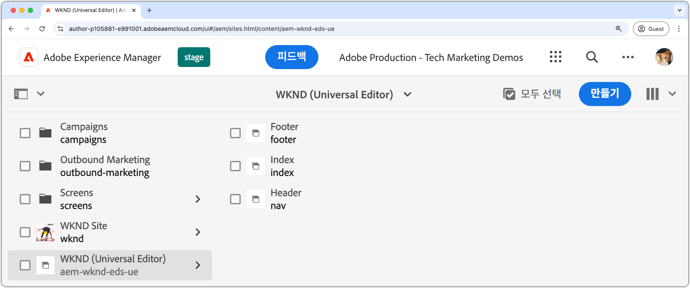

# Edge Delivery Services 및 유니버설 편집기 개발자 자습서

이 튜토리얼에서는 강력한 작성, 범용 편집기 및 Edge Delivery Services을 사용한 빠른 전달을 결합하는 AEM 웹 사이트 구축의 기본 사항에 대해 알아봅니다. 마지막으로 새 프로젝트를 만들고, 로컬 개발 환경을 설정하고, 새 블록을 만드는 방법에 대한 기본 사항을 이해할 수 있습니다.

## 프로젝트 설정

AEM as a Cloud Service에서 코드 프로젝트를 만들고 새 사이트를 구성하는 방법에 대해 알아봅니다. 이 설정을 사용하면 범용 편집기를 사용하여 컨텐츠를 원활하게 개발하고 Edge Delivery Services을 통해 컨텐츠를 빠르게 전달할 수 있습니다.

<!-- XCARDS 

* ./1-new-code-project.md
* ./2-new-aem-site.md

-->
<!-- START CARDS HTML - DO NOT MODIFY BY HAND -->

    

        

            

                <figure class="image x-is-16by9">
                    
                </figure>
            

            

                

                    

                        <a href="./1-new-code-project.md" target="_blank" rel="referrer" title="코드 프로젝트 만들기">코드 프로젝트 만들기</a>
                    

                    
범용 편집기를 사용하여 편집할 수 있는 Edge Delivery Services 코드 프로젝트를 만듭니다.

                

                <a href="./1-new-code-project.md" target="_blank" rel="referrer" class="spectrum-Button spectrum-Button--outline spectrum-Button--primary spectrum-Button--sizeM" style="align-self: flex-start; margin-top: 1rem;">
                    자세히 알아보기
                </a>
            

        

    

    

        

            

                <figure class="image x-is-16by9">
                    
                </figure>
            

            

                

                    

                        <a href="./2-new-aem-site.md" target="_blank" rel="referrer" title="AEM 사이트 만들기">AEM 사이트 만들기</a>
                    

                    
범용 편집기를 사용하여 편집할 수 있는 Edge Delivery Services을 위한 AEM Sites 사이트를 만듭니다.

                

                <a href="./2-new-aem-site.md" target="_blank" rel="referrer" class="spectrum-Button spectrum-Button--outline spectrum-Button--primary spectrum-Button--sizeM" style="align-self: flex-start; margin-top: 1rem;">
                    자세히 알아보기
                </a>
            

        

    

<!-- END CARDS HTML - DO NOT MODIFY BY HAND -->

## 개발 설정

빠른 웹 사이트 개발을 활성화하기 위해 로컬 개발 환경을 구성하는 방법에 대해 알아봅니다. 이 설정을 통해 범용 편집기로 원활한 사이트 생성 및 Edge Delivery Services을 통한 효율적인 콘텐츠 전달을 가능하게 하여 원활하고 최적화된 개발 워크플로를 보장합니다.
<!-- XCARDS 

* ./3-local-development-environment.md
* ./4-website-branding.md

-->
<!-- START CARDS HTML - DO NOT MODIFY BY HAND -->

    

        

            

                <figure class="image x-is-16by9">
                    
                </figure>
            

            

                

                    

                        <a href="./3-local-development-environment.md" target="_blank" rel="referrer" title="로컬 개발 환경 설정">로컬 개발 환경 설정</a>
                    

                    
Edge Delivery Services과 함께 제공되고 범용 편집기로 편집할 수 있는 사이트에 대한 로컬 개발 환경을 설정합니다.

                

                <a href="./3-local-development-environment.md" target="_blank" rel="referrer" class="spectrum-Button spectrum-Button--outline spectrum-Button--primary spectrum-Button--sizeM" style="align-self: flex-start; margin-top: 1rem;">
                    자세히 알아보기
                </a>
            

        

    

    

        

            

                <figure class="image x-is-16by9">
                    
                </figure>
            

            

                

                    

                        <a href="./4-website-branding.md" target="_blank" rel="referrer" title="웹 사이트 브랜딩 추가">웹 사이트 브랜딩 추가</a>
                    

                    
Edge Delivery Services 사이트에 대한 전역 CSS, CSS 변수 및 웹 글꼴을 정의합니다.

                

                <a href="./4-website-branding.md" target="_blank" rel="referrer" class="spectrum-Button spectrum-Button--outline spectrum-Button--primary spectrum-Button--sizeM" style="align-self: flex-start; margin-top: 1rem;">
                    자세히 알아보기
                </a>
            

        

    

<!-- END CARDS HTML - DO NOT MODIFY BY HAND -->

## 블록 개발

콘텐츠 모델을 정의하고 테스트 및 개발을 위한 샘플 콘텐츠를 설정하여 새 블록을 만드는 방법을 알아봅니다. 블록을 렌더링하는 두 가지 방법을 살펴보고 AEM 및 Edge Delivery Services에서 최적의 성능과 유연성을 위해 구성하는 방법을 이해합니다.

<!-- CARDS 

* ./5-new-block.md {image = ./assets/5-new-block/card.png}
* ./6-author-block.md {image = ./assets/6-author-block/card.png}
* ./7a-block-css.md {image = ./assets/7a-block-css/card.png}
* ./7b-block-js-css.md {image = ./assets/7b-block-js-css/card.png}

-->
<!-- START CARDS HTML - DO NOT MODIFY BY HAND -->

    

        

            

                <figure class="image x-is-16by9">
                    
                </figure>
            

            

                

                    

                        <a href="./5-new-block.md" target="_blank" rel="referrer" title="블록 만들기">블록 만들기</a>
                    

                    
범용 편집기로 편집할 수 있는 Edge Delivery Services 웹 사이트용 블록을 빌드합니다.

                

                <a href="./5-new-block.md" target="_blank" rel="referrer" class="spectrum-Button spectrum-Button--outline spectrum-Button--primary spectrum-Button--sizeM" style="align-self: flex-start; margin-top: 1rem;">
                    자세히 알아보기
                </a>
            

        

    

    

        

            

                <figure class="image x-is-16by9">
                    
                </figure>
            

            

                

                    

                        <a href="./6-author-block.md" target="_blank" rel="referrer" title="블록 작성">블록 작성</a>
                    

                    
범용 편집기로 Edge Delivery Services 블록을 작성합니다.

                

                <a href="./6-author-block.md" target="_blank" rel="referrer" class="spectrum-Button spectrum-Button--outline spectrum-Button--primary spectrum-Button--sizeM" style="align-self: flex-start; margin-top: 1rem;">
                    자세히 알아보기
                </a>
            

        

    

    

        

            

                <figure class="image x-is-16by9">
                    
                </figure>
            

            

                

                    

                        <a href="./7a-block-css.md" target="_blank" rel="referrer" title="CSS를 사용하여 블록 개발">CSS로 블록 개발</a>
                    

                    
범용 편집기를 사용하여 편집할 수 있는 Edge Delivery Services용 CSS를 사용하여 블록을 개발합니다.

                

                <a href="./7a-block-css.md" target="_blank" rel="referrer" class="spectrum-Button spectrum-Button--outline spectrum-Button--primary spectrum-Button--sizeM" style="align-self: flex-start; margin-top: 1rem;">
                    자세히 알아보기
                </a>
            

        

    

    

        

            

                <figure class="image x-is-16by9">
                    
                </figure>
            

            

                

                    

                        <a href="./7b-block-js-css.md" target="_blank" rel="referrer" title="CSS 및 JS를 사용하여 블록 개발">CSS 및 JS를 사용하여 블록 개발</a>
                    

                    
CSS와 JavaScript for Edge Delivery Services을 사용하여 블록을 개발하고 범용 편집기를 사용하여 편집할 수 있습니다.

                

                <a href="./7b-block-js-css.md" target="_blank" rel="referrer" class="spectrum-Button spectrum-Button--outline spectrum-Button--primary spectrum-Button--sizeM" style="align-self: flex-start; margin-top: 1rem;">
                    자세히 알아보기
                </a>
            

        

    

<!-- END CARDS HTML - DO NOT MODIFY BY HAND -->
