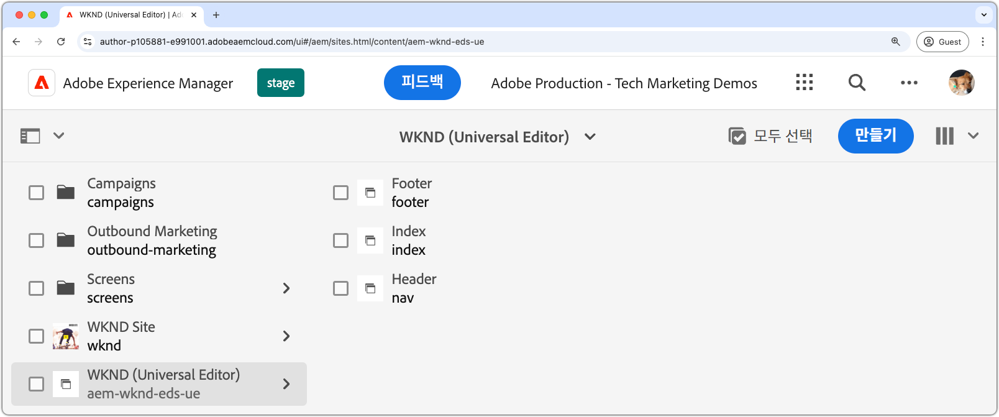

# AEM 사이트 만들기

AEM 사이트에서는 웹 사이트의 콘텐츠를 편집, 관리 및 게시할 수 있습니다. Edge Delivery Services을 통해 전달되고 범용 편집기를 사용하여 작성된 AEM 사이트를 만들려면 [AEM 작성 사이트 Edge Delivery Services을 사용하여](https://github.com/adobe-rnd/aem-boilerplate-xwalk/releases)을(를) 사용하여 AEM 작성자에 새 사이트를 만듭니다.

AEM 사이트는 웹 사이트의 콘텐츠를 저장 및 작성하는 곳입니다. 최종 경험은 AEM 사이트 콘텐츠와 [웹 사이트의 코드](./1-new-code-project.md)의 조합입니다.

새 AEM 사이트를 만들려면 [설명서에 요약된 자세한 단계](https://experienceleague.adobe.com/en/docs/experience-manager-cloud-service/content/edge-delivery/wysiwyg-authoring/edge-dev-getting-started#create-aem-site)를 따르십시오.  다음은 이 자습서에 사용된 값을 포함하여 단계가 요약된 목록입니다.
1. AEM 작성자에 **새 사이트를 만듭니다**. 이 자습서에서는 다음 사이트 이름을 사용합니다.
   * 사이트 제목: `WKND (Universal Editor)`
   * 사이트 이름: `aem-wknd-eds-ue`

      * 사이트 이름 값은 `paths.json`](https://experienceleague.adobe.com/en/docs/experience-manager-cloud-service/content/edge-delivery/wysiwyg-authoring/path-mapping)에 추가된 사이트 경로 이름 [과(와) 일치해야 합니다.

2. **AEM 작성 사이트 서식 파일이 있는 Edge Delivery Services [에서 최신 서식 파일을 가져오기**&#x200B;합니다](https://github.com/adobe-rnd/aem-boilerplate-xwalk/releases).
3. **GitHub 저장소 이름과 일치하도록 사이트 이름을**&#x200B;로 지정하고 GitHub URL을 저장소의 URL로 설정합니다.

## 미리 볼 새 사이트 Publish

AEM Author에서 사이트를 만든 후 [로컬 개발 환경](./3-local-development-environment.md)에서 사용할 수 있도록 Edge Delivery Services 미리 보기에 게시합니다.

1. **AEM 작성자**&#x200B;에 로그인하고 **사이트**(으)로 이동합니다.
2. **새 사이트**(`WKND (Universal Editor)`)를 선택하고 **게시 관리**&#x200B;를 클릭합니다.
3. **대상**&#x200B;에서 **미리 보기**&#x200B;를 선택하고 **다음**&#x200B;을 클릭합니다.
4. **하위 설정 포함**&#x200B;에서 **하위 설정 포함**&#x200B;을 선택하고 다른 옵션을 선택 취소한 다음 **확인**&#x200B;을 클릭합니다.
5. 미리 볼 사이트의 콘텐츠를 게시하려면 **Publish**&#x200B;을(를) 클릭하십시오.
6. 미리보기에 게시하면 페이지가 Edge Delivery Services 미리보기 환경에서 사용할 수 있습니다(페이지는 AEM 미리보기 서비스에 표시되지 않음).
