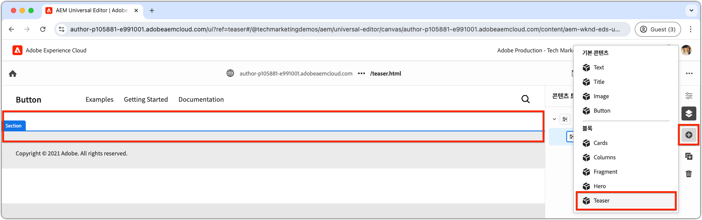

# 새 블록 만들기

이 장에서는 범용 편집기를 사용하여 Edge Delivery Services 웹 사이트에 대해 편집 가능한 새 티저 블록을 만드는 프로세스를 다룹니다.


이름이 `teaser`인 블록에는 다음 요소가 표시됩니다.

- **이미지**: 시각적으로 매력적인 이미지입니다.
- **텍스트 콘텐츠**:
   - **제목**: 초점을 맞추는 매력적인 헤드라인입니다.
   - **본문**: 선택적 사용 약관을 포함하여 컨텍스트 또는 세부 정보를 제공하는 설명 콘텐츠입니다.
   - **콜 투 액션(CTA) 버튼**: 사용자 상호 작용을 촉진하고 추가 참여를 안내하기 위해 디자인된 링크입니다.

`teaser` 블록의 콘텐츠를 유니버설 편집기에서 편집할 수 있으므로 웹 사이트 전체에서 쉽게 사용하고 다시 사용할 수 있습니다.

`teaser` 블록은 보일러판의 `hero` 블록과 유사합니다. 따라서 `teaser` 블록은 개발 개념을 설명하기 위한 간단한 예제로만 사용됩니다.

## 새 Git 분기 만들기

깔끔하고 정리된 워크플로우를 유지 관리하려면 각 특정 개발 작업에 대해 새 분기를 만듭니다. 이렇게 하면 프로덕션에 완료되지 않았거나 테스트되지 않은 코드를 배포할 때 발생하는 문제를 방지하는 데 도움이 됩니다.

1. **주 분기에서 시작**: 최신 프로덕션 코드에서 작업하면 기초가 탄탄해집니다.
2. **원격 변경 내용 가져오기**: GitHub에서 최신 업데이트를 가져오면 개발을 시작하기 전에 최신 코드를 사용할 수 있습니다.
   - 예: `wknd-styles` 분기의 변경 내용을 `main`(으)로 병합한 후 최신 업데이트를 가져오십시오.
3. **새 분기 만들기**:

```bash
# ~/Code/aem-wknd-eds-ue

$ git fetch origin  
$ git checkout -b teaser origin/main  
```

`teaser` 분기가 만들어지면 티저 블록 개발을 시작할 준비가 되었습니다.

## 폴더 차단

프로젝트의 `blocks` 디렉터리에 이름이 `teaser`인 새 폴더를 만듭니다. 이 폴더에는 블록의 JSON, CSS 및 JavaScript 파일이 포함되어 있으며 블록의 파일을 한 위치에 구성합니다.

```
# ~/Code/aem-wknd-eds-ue

/blocks/teaser
```

블록 폴더 이름은 블록의 ID 역할을 하며 개발 전체에서 블록을 참조하는 데 사용됩니다.

## JSON 차단

블록 JSON은 블록의 세 가지 주요 측면을 정의합니다.

- **정의**: 유니버설 편집기에서 블록을 편집 가능한 구성 요소로 등록하여 블록 모델 및 선택적으로 필터에 연결합니다.
- **모델**: 블록의 작성 필드와 이러한 필드를 의미 체계 Edge Delivery Services HTML으로 렌더링하는 방법을 지정합니다.
- **필터**: 유니버설 편집기를 통해 블록을 추가할 수 있는 컨테이너를 제한하도록 필터링 규칙을 구성합니다. 대부분의 블록은 컨테이너가 아니라 다른 컨테이너 블록의 필터에 추가됩니다.

`/blocks/teaser/_teaser.json`에 다음의 초기 구조로 정확한 순서로 새 파일을 만듭니다. 키가 작동하지 않으면 제대로 빌드되지 않을 수 있습니다.

[!BADGE /blocks/teaser/_teaser.json]{type=Neutral tooltip="아래 코드 샘플의 파일 이름입니다."}

```json
{
    "definitions": [],
    "models": [],
    "filters": []
}
```

### 블록 모델

블록 모델은 다음을 정의하는 대로 블록 구성의 중요한 부분입니다.

1. 편집할 수 있는 필드를 정의하여 작성 환경.

   

2. 필드의 값이 Edge Delivery Services HTML에 렌더링되는 방식입니다.

모델에 [블록의 정의](#block-definition)에 해당하는 `id`이(가) 할당되고 편집 가능한 필드를 지정하기 위해 `fields` 배열이 포함됩니다.

`fields` 배열의 각 필드에는 다음과 같은 필수 속성을 포함하는 JSON 개체가 있습니다.

| JSON 속성 | 설명 |
|---------------|-----------------------------------------------------------------------------------------------------------------------|
| `component` | [필드 형식](https://experienceleague.adobe.com/en/docs/experience-manager-cloud-service/content/implementing/developing/universal-editor/field-types#component-types)(예: `text`, `reference` 또는 `aem-content`). |
| `name` | 값이 AEM에 저장되는 JCR 속성에 매핑되는 필드의 이름입니다. |
| `label` | 범용 편집기에서 작성자에게 표시되는 레이블입니다. |

선택 사항을 포함한 포괄적인 속성 목록을 보려면 [유니버설 편집기 필드 설명서](https://experienceleague.adobe.com/en/docs/experience-manager-cloud-service/content/implementing/developing/universal-editor/field-types#fields)를 검토하십시오.

#### 블록 디자인


티저 블록에는 다음과 같은 편집 가능한 요소가 포함됩니다.

1. **이미지**: 티저의 시각적 콘텐츠를 나타냅니다.
2. **텍스트 컨텐츠**: 제목, 본문, 클릭 유도 문안 단추를 포함하며 흰색 사각형에 위치합니다.
   - **title** 및 **본문**&#x200B;은(는) 동일한 서식 있는 텍스트 편집기를 통해 작성할 수 있습니다.
   - **CTA**&#x200B;은(는) **label**&#x200B;에 대한 `text` 필드와 **link**&#x200B;에 대한 `aem-content` 필드를 통해 작성할 수 있습니다.

티저 블록의 디자인은 이러한 두 가지 논리적 구성 요소(이미지 및 텍스트 콘텐츠)로 분할되므로 사용자에게 구조화된 직관적인 작성 환경이 보장됩니다.

### 블록 필드

블록에 필요한 필드(이미지, 이미지 대체 텍스트, 텍스트, CTA 레이블 및 CTA 링크)를 정의합니다.

>[!BEGINTABS]

>[!TAB 올바른 방법]

**이 탭은 티저 블록을 모델링하는 올바른 방법을 보여 줍니다.**

티저는 이미지와 텍스트의 두 가지 논리적 영역으로 구성됩니다. Edge Delivery Services HTML을 원하는 웹 경험으로 표시하는 데 필요한 코드를 간소화하려면 블록 모델이 이 구조를 반영해야 합니다.

- [필드 축소](https://experienceleague.adobe.com/en/docs/experience-manager-cloud-service/content/edge-delivery/wysiwyg-authoring/content-modeling#field-collapse)를 사용하여 **이미지** 및 **이미지 대체 텍스트**&#x200B;를 함께 그룹화합니다.
- [요소 그룹화](https://experienceleague.adobe.com/en/docs/experience-manager-cloud-service/content/edge-delivery/wysiwyg-authoring/content-modeling#element-grouping) 및 [CTA의 필드 축소](https://experienceleague.adobe.com/en/docs/experience-manager-cloud-service/content/edge-delivery/wysiwyg-authoring/content-modeling#field-collapse)을 사용하여 텍스트 콘텐츠 필드를 함께 그룹화합니다.

[필드 축소](https://experienceleague.adobe.com/en/docs/experience-manager-cloud-service/content/edge-delivery/wysiwyg-authoring/content-modeling#field-collapse), [요소 그룹화](https://experienceleague.adobe.com/en/docs/experience-manager-cloud-service/content/edge-delivery/wysiwyg-authoring/content-modeling#element-grouping) 또는 [형식 유추](https://experienceleague.adobe.com/en/docs/experience-manager-cloud-service/content/edge-delivery/wysiwyg-authoring/content-modeling#type-inference)에 익숙하지 않은 경우 올바른 구조의 블록 모델을 만드는 데 필수이므로 연결된 설명서를 검토한 후 계속하십시오.

아래 예에서:

- [형식 유추](https://experienceleague.adobe.com/en/docs/experience-manager-cloud-service/content/edge-delivery/wysiwyg-authoring/content-modeling#type-inference)은(는) `image` 필드에서 `` HTML 요소를 자동으로 만드는 데 사용됩니다. `image` 및 `imageAlt` 필드와 함께 필드 축소법을 사용하여 `` HTML 요소를 만듭니다. `src` 특성은 `image` 필드의 값으로 설정되어 있고 `alt` 특성은 `imageAlt` 필드의 값으로 설정되어 있습니다.
- `textContent`은(는) 필드를 분류하는 데 사용되는 그룹 이름입니다. 의미론적이어야 하지만 이 블록에 고유한 것일 수 있습니다. 이렇게 하면 최종 HTML 출력의 동일한 `<div>` 요소 내에서 이 접두사가 있는 모든 필드를 렌더링하도록 유니버설 편집기에 알립니다.
- 필드 축소도 클릭 유도 문안(CTA)에 대해 `textContent` 그룹 내에 적용됩니다. [형식 유추](https://experienceleague.adobe.com/en/docs/experience-manager-cloud-service/content/edge-delivery/wysiwyg-authoring/content-modeling#type-inference)를 통해 `<a>`(으)로 CTA이 만들어졌습니다. `cta` 필드는 `<a>` 요소의 `href` 특성을 설정하는 데 사용되며 `ctaText` 필드는 `<a ...>` 태그 내의 링크에 대한 텍스트 콘텐츠를 제공합니다.

[!BADGE /blocks/teaser/_teaser.json]{type=Neutral tooltip="아래 코드 샘플의 파일 이름입니다."}

```json
{
    "definitions": [],
    "models": [
        {
            "id": "teaser", 
            "fields": [
                {
                    "component": "reference",
                    "valueType": "string",
                    "name": "image",
                    "label": "Image",
                    "multi": false
                },
                {
                    "component": "text",
                    "valueType": "string",
                    "name": "imageAlt",
                    "label": "Image alt text",
                    "required": true
                },
                {
                    "component": "richtext",
                    "name": "textContent_text",
                    "label": "Text",
                    "valueType": "string",
                    "required": true
                },
                {
                    "component": "aem-content",
                    "name": "textContent_cta",
                    "label": "CTA",
                    "valueType": "string"
                },
                {
                    "component": "text",
                    "name": "textContent_ctaText",
                    "label": "CTA label",
                    "valueType": "string"
                }
            ]
        }
    ],
    "filters": []
}
```

이 모델은 블록에 대한 유니버설 편집기의 작성 입력을 정의합니다.

이 블록의 결과 Edge Delivery Services HTML은 이미지를 첫 번째 div에 넣고 요소 그룹 `textContent` 필드를 두 번째 div에 넣습니다.

```html
<div>
    <div>
        <!-- This div contains the field-collapsed image fields  -->
        <picture>
            ...
            <source .../>            
            
        </picture>
    </div>
    <div>
        <!-- This div, via element grouping contains the textContent fields -->
        <h2>The authored title</h2>
        <p>The authored body text</p>
        <a href="/authored/cta/link">The authored CTA label</a>
    </div>
</div>        
```

다음 [장](./7a-block-css.md)에서 설명한 대로 이 HTML 구조는 블록 스타일을 결합 단위로 단순화합니다.

필드 축소 및 요소 그룹화를 사용하지 않은 결과를 이해하려면 위의 **잘못된 방법** 탭을 참조하십시오.

>[!TAB 잘못된 방법]

**이 탭은 티저 블록을 모델링하는 최적의 방법을 보여 주며 올바른 방법과 병치됩니다.**

[필드 접기](https://experienceleague.adobe.com/en/docs/experience-manager-cloud-service/content/edge-delivery/wysiwyg-authoring/content-modeling#field-collapse) 및 [요소 그룹화](https://experienceleague.adobe.com/en/docs/experience-manager-cloud-service/content/edge-delivery/wysiwyg-authoring/content-modeling#element-grouping)을 사용하지 않고 각 필드를 블록 모델에서 독립 실행형 필드로 정의하면 끌릴 수 있습니다. 그러나 이러한 감독이 블록을 결합 단위로 스타일링하는 것을 복잡하게 만듭니다.

예를 들어 다음과 같이 필드 축소 또는 요소 그룹화가 없는 **티저 모델을 정의할 수 있습니다.**

[!BADGE /blocks/teaser/_teaser.json]{type=Neutral tooltip="아래 코드 샘플의 파일 이름입니다."}

```json
{
    "definitions": [],
    "models": [
        {
            "id": "teaser", 
            "fields": [
                {
                    "component": "reference",
                    "valueType": "string",
                    "name": "image",
                    "label": "Image",
                    "multi": false
                },
                {
                    "component": "text",
                    "valueType": "string",
                    "name": "alt",
                    "label": "Image alt text",
                    "required": true
                },
                {
                    "component": "richtext",
                    "name": "text",
                    "label": "Text",
                    "valueType": "string",
                    "required": true
                },
                {
                    "component": "aem-content",
                    "name": "link",
                    "label": "CTA",
                    "valueType": "string"
                },
                {
                    "component": "text",
                    "name": "label",
                    "label": "CTA label",
                    "valueType": "string"
                }
            ]
        }
    ],
    "filters": []
}
```

블록의 Edge Delivery Services HTML은 각 필드의 값을 별도의 `div`에 렌더링하므로 콘텐츠 이해, 스타일 적용 및 HTML 구조 조정이 복잡해져 원하는 디자인을 달성할 수 있습니다.

```html
<div>
    <div>
        <!-- This div contains the field-collapsed image  -->
        <picture>
            ...
            <source .../>            
            
        </picture>
    </div>
    <div>
        <p>The authored alt text</p>
    </div>
    <div>
        <h2>The authored title</h2>
        <p>The authored body text</p>
    </div>
    <div>
        <a href="/authored/cta/link">/authored/cta/link</a>
    </div>
    <div>
        The authored CTA label
    </div>
</div>        
```

각 필드는 자체 `div`에서 분리되어 있어 이미지 및 텍스트 콘텐츠를 일관된 단위로 스타일링하기 어렵습니다. 노력과 창의력으로 원하는 디자인을 달성할 수 있지만, [요소 그룹화](https://experienceleague.adobe.com/en/docs/experience-manager-cloud-service/content/edge-delivery/wysiwyg-authoring/content-modeling#element-grouping)를 사용하여 텍스트 콘텐츠 필드를 그룹화하고 [필드 축소](https://experienceleague.adobe.com/en/docs/experience-manager-cloud-service/content/edge-delivery/wysiwyg-authoring/content-modeling#field-collapse)를 사용하여 작성된 값을 요소 특성으로 추가하는 것이 더 쉽고, 의미론적으로 정확합니다.

티저 블록을 더 잘 모델링하는 방법은 위의 **쓰기 방법** 탭을 참조하십시오.

>[!ENDTABS]


### 블록 정의

블록 정의는 유니버설 편집기에서 블록을 등록합니다. 다음은 블록 정의에 사용되는 JSON 속성에 대한 분류입니다.

| JSON 속성 | 설명 |
|---------------|-------------|
| `definition.title` | 유니버설 편집기의 **추가** 블록에 표시되는 블록의 제목입니다. |
| `definition.id` | `filters`에서 사용을 제어하는 데 사용되는 블록의 고유 ID입니다. |
| `definition.plugins.xwalk.page.resourceType` | 유니버설 편집기에서 구성 요소를 렌더링하기 위한 Sling 리소스 유형을 정의합니다. 항상 `core/franklin/components/block/v#/block` 리소스 형식을 사용하십시오. |
| `definition.plugins.xwalk.page.template.name` | 블록의 이름입니다. 블록의 폴더 이름과 일치하도록 대/소문자를 줄이고 하이픈을 사용해야 합니다. 이 값은 범용 편집기에서 블록 인스턴스에 레이블을 지정하는 데도 사용됩니다. |
| `definition.plugins.xwalk.page.template.model` | 이 정의를 유니버설 편집기에서 블록에 대해 표시되는 작성 필드를 제어하는 `model` 정의에 연결합니다. 이 값은 `model.id` 값과 일치해야 합니다. |
| `definition.plugins.xwalk.page.template.classes` | 블록 HTML 요소의 `class` 특성에 값을 추가하는 선택적 속성입니다. 이렇게 하면 동일한 블록의 변형이 허용됩니다. [클래스 필드 추가](https://experienceleague.adobe.com/en/docs/experience-manager-cloud-service/content/edge-delivery/wysiwyg-authoring/create-block#block-options)를 블록의 [모델](#block-model)에 사용하면 `classes` 값을 편집할 수 있습니다. |


다음은 블록 정의에 대한 JSON 예입니다.

[!BADGE /blocks/teaser/_teaser.json]{type=Neutral tooltip="아래 코드 샘플의 파일 이름입니다."}

```json
{
    "definitions": [{
      "title": "Teaser",
      "id": "teaser",
      "plugins": {
        "xwalk": {
          "page": {
            "resourceType": "core/franklin/components/block/v1/block",
            "template": {
              "name": "Teaser",
              "model": "teaser",
              "textContent_text": "<h2>Enter a title</h2><p>...and body text here!</p>",
              "textContent_cta": "/",
              "textContent_ctaText": "Click me!"
            }
          }
        }
      }
    }],
    "models": [... from previous section ...],
    "filters": []
}
```

이 예제에서는

- 블록의 이름은 &quot;Teaser&quot;이며 유니버설 편집기에서 편집할 수 있는 필드를 결정하는 `teaser` 모델을 사용합니다.
- 블록에는 제목 및 본문 텍스트의 서식 있는 텍스트 영역인 `textContent_text` 필드에 대한 기본 컨텐츠와 CTA(콜 투 액션) 링크 및 레이블에 대한 `textContent_cta` 및 `textContent_ctaText`이(가) 포함되어 있습니다. 초기 콘텐츠가 포함된 템플릿의 필드 이름이 [콘텐츠 모델의 필드 배열](#block-model)에 정의된 필드 이름과 일치합니다.

이 구조를 사용하면 렌더링에 적합한 필드, 콘텐츠 모델 및 리소스 유형으로 유니버설 편집기에서 블록을 설정할 수 있습니다.

### 블록 필터

블록의 `filters` 배열은 [컨테이너 블록](https://experienceleague.adobe.com/en/docs/experience-manager-cloud-service/content/edge-delivery/wysiwyg-authoring/content-modeling#container)에 대해 다른 블록을 컨테이너에 추가할 수 있는 블록을 정의합니다. 필터는 컨테이너에 추가할 수 있는 블록 ID(`model.id`) 목록을 정의합니다.

[!BADGE /blocks/teaser/_teaser.json]{type=Neutral tooltip="아래 코드 샘플의 파일 이름입니다."}

```json
{
  "definitions": [... populated from previous section ...],
  "models": [... populated from previous section ...],
  "filters": []
}
```

티저 구성 요소가 [컨테이너 블록](https://experienceleague.adobe.com/en/docs/experience-manager-cloud-service/content/edge-delivery/wysiwyg-authoring/content-modeling#container)이(가) 아닙니다. 즉, 다른 블록을 추가할 수 없습니다. 따라서 해당 `filters` 배열이 비어 있습니다. 대신 티저를 섹션에 추가할 수 있도록 티저의 ID를 섹션 블록의 필터 목록에 추가합니다.



섹션 블록과 같은 Adobe 제공 블록은 프로젝트의 `models` 폴더에 필터를 저장합니다. 조정하려면 Adobe이 제공한 블록(예: `/models/_section.json`)에 대한 JSON 파일을 찾아 티저의 ID(`teaser`)를 필터 목록에 추가합니다. 구성은 티저 구성 요소를 섹션 컨테이너 블록에 추가할 수 있다는 신호를 유니버설 편집기에 보냅니다.

[!BADGE /models/_section.json]{type=Neutral tooltip="아래 코드 샘플의 파일 이름입니다."}

```json
{
  "definitions": [],
  "models": [],
  "filters": [
    {
      "id": "section",
      "components": [
        "text",
        "image",
        "button",
        "title",
        "hero",
        "cards",
        "columns",
        "fragment",
        "teaser"
      ]
    }
  ]
}
```

`teaser`의 티저 블록 정의 ID가 `components` 배열에 추가되었습니다.

## JSON 파일 린트

변경 내용이 깨끗하고 일관되도록 변경 내용을 [자주 린트](./3-local-development-environment.md#linting)하세요. 자주 연결하는 것은 문제를 조기에 발견하는 데 도움이 되며 전반적인 개발 시간을 단축합니다. `npm run lint:js` 명령은 JSON 파일도 링크하고 구문 오류를 모두 catch합니다.

```bash
# ~/Code/aem-wknd-eds-ue

$ npm run lint:js
```

## 프로젝트 JSON 작성

블록 JSON 파일(`blocks/teaser/_teaser.json`, `models/_section.json`)을 구성한 후 프로젝트의 `component-models.json`, `component-definitions.json` 및 `component-filters.json` 파일로 컴파일해야 합니다. 프로젝트의 [JSON 빌드](./3-local-development-environment.md#build-json-fragments) npm 스크립트를 실행하여 컴파일을 수행합니다.

```bash
# ~/Code/aem-wknd-eds-ue

$ npm run build:json
```

## 블록 정의 배포

유니버설 편집기에서 블록을 사용하려면 프로젝트를 커밋하고 GitHub 리포지토리의 분기(이 경우 `teaser` 분기)로 푸시해야 합니다.

Universal Editor가 사용하는 정확한 분기 이름은 Universal Editor의 URL을 통해 사용자별로 조정할 수 있습니다.

```bash
# ~/Code/aem-wknd-eds-ue

$ git add .
$ git commit -m "Add teaser block JSON files so it is available in Universal Editor"
$ git push origin teaser
```

쿼리 매개 변수 `?ref=teaser`을(를) 사용하여 유니버설 편집기를 열면 새 `teaser` 블록이 블록 팔레트에 나타납니다. 블록에는 스타일이 없습니다. 블록의 필드를 [전역 CSS](./4-website-branding.md#global-css)를 통해서만 스타일이 지정된 의미 HTML으로 렌더링합니다.
