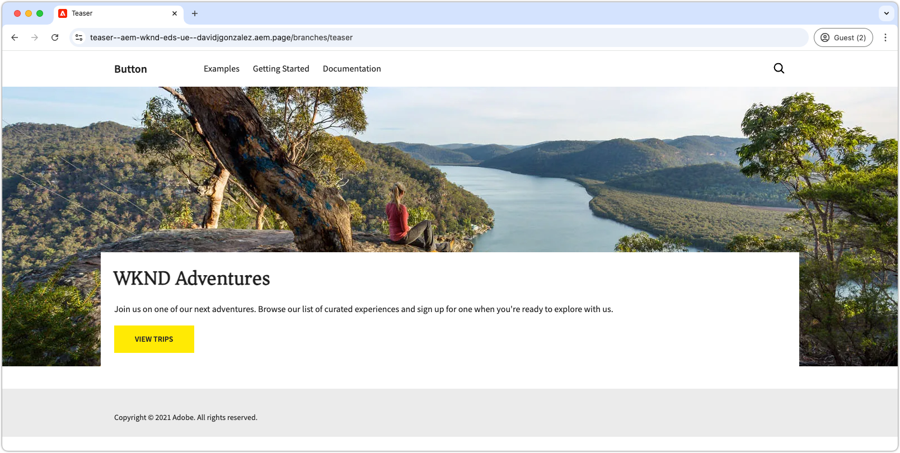
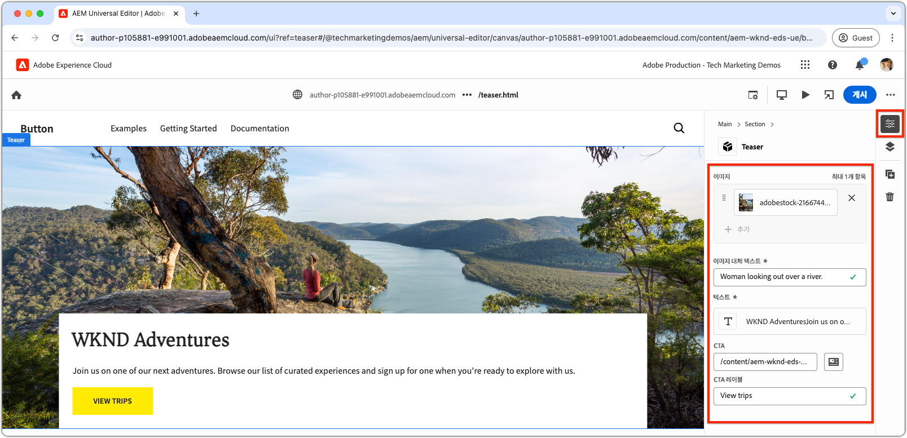

# 새 블록 만들기

이 장에서는 범용 편집기를 사용하여 Edge Delivery Services 웹 사이트를 위한 새롭고 편집 가능한 티저 블록을 만드는 과정에 대해 설명합니다.



`teaser` 블록은 다음 요소를 보여 줍니다.

- **이미지**: 시각적으로 매력적인 이미지.
- **텍스트 콘텐츠**:
   - **제목**: 주목을 끌기 위한 설득력 있는 헤드라인.
   - **본문 텍스트**: 선택적 약관을 포함하여 맥락이나 세부 정보를 제공하는 설명적 콘텐츠.
   - **CTA(콜 투 액션) 버튼**: 사용자 상호 작용을 유도하고 추가 참여를 장려하도록 설계된 링크.

`teaser` 블록 콘텐츠는 범용 편집기에서 편집할 수 있어 웹 사이트 전체에서 사용 편의성과 재사용성이 보장됩니다.

`teaser` 블록은 보일러플레이트의 `hero` 블록과 유사합니다. 따라서 `teaser` 블록은 개발 개념을 설명하기 위한 단순한 예제로만 제공됩니다.

## 새 Git 분기 만들기

깔끔하고 체계적인 워크플로를 유지하려면 각 개발 작업에 대해 새로운 분기를 만드십시오. 이를 통해 불완전하거나 테스트되지 않은 코드를 프로덕션에 배포할 때 발생하는 문제를 방지할 수 있습니다.

1. **주 분기에서 시작**: 최신 프로덕션 코드를 사용하면 견고한 기반을 보장할 수 있습니다.
2. **원격 변경 사항 가져오기**: GitHub에서 최신 업데이트를 가져오면 개발을 시작하기 전에 최신 코드를 확보할 수 있습니다.
   - 예: `wknd-styles` 분기의 변경 사항을 `main`에 병합한 후 최신 업데이트를 가져옵니다.
3. **새 분기 만들기**:

```bash
# ~/Code/aem-wknd-eds-ue

$ git fetch origin  
$ git checkout -b teaser origin/main  
```

`teaser` 분기를 만들었다면 이제 티저 블록 개발을 시작할 수 있습니다.

## 블록 폴더

프로젝트의 `blocks` 디렉터리에서 `teaser`라는 이름의 새 폴더를 만듭니다. 이 폴더에는 블록의 JSON, CSS 및 JavaScript 파일이 포함되어 있어, 블록의 파일을 한 곳에 정리할 수 있습니다.

```
# ~/Code/aem-wknd-eds-ue

/blocks/teaser
```

블록 폴더 이름은 블록의 ID 역할을 하며, 블록 개발 전반에서 해당 블록을 참조하는 데 사용됩니다.

## 블록 JSON

블록 JSON은 블록의 세 가지 주요 측면을 정의합니다.

- **정의**: 블록을 범용 편집기에서 편집 가능한 구성 요소로 등록하고, 블록 모델과 연결하며, 선택적으로 필터에 연결합니다.
- **모델**: 블록의 작성 필드와 이러한 필드가 유의미한 Edge Delivery Services HTML로 렌더링되는 방식을 지정합니다.
- **필터**: 범용 편집기를 통해 블록을 추가할 수 있는 컨테이너를 제한하는 필터링 규칙을 구성합니다. 대부분의 블록은 컨테이너가 아니며, 대신 블록의 ID는 다른 컨테이너 블록의 필터에 추가됩니다.

다음과 같은 초기 구조를 정확한 순서로 갖춘 새 파일을 `/blocks/teaser/_teaser.json` 경로에 만듭니다. 키의 순서가 맞지 않으면 빌드가 제대로 되지 않을 수 있습니다.

[!BADGE /blocks/teaser/_teaser.json]{type=Neutral tooltip="아래 코드 샘플의 파일 이름입니다."}

```json
{
    "definitions": [],
    "models": [],
    "filters": []
}
```

### 블록 모델

블록 모델은 블록 구성의 중요한 부분으로, 다음을 정의합니다.

1. 편집 가능한 필드를 정의하여 작성 경험을 정의합니다.

   

2. 해당 필드 값이 Edge Delivery Services HTML로 렌더링되는 방식을 정의합니다.

모델은 [블록 정의](#block-definition)에 해당하는 `id`를 가지며, 편집 가능한 필드를 지정하는 `fields` 배열을 포함합니다.

`fields` 배열의 각 필드에는 다음과 같은 필수 속성이 포함된 JSON 오브젝트가 있습니다.

| JSON 속성 | 설명 |
|---------------|-----------------------------------------------------------------------------------------------------------------------|
| `component` | [필드 유형](https://experienceleague.adobe.com/ko/docs/experience-manager-cloud-service/content/implementing/developing/universal-editor/field-types#component-types)&#x200B;(예: `text`, `reference` 또는 `aem-content`). |
| `name` | AEM에 값이 저장되는 JCR 속성에 매핑되는 필드 이름. |
| `label` | 범용 편집기에서 작성자에게 표시되는 레이블. |

선택 사항을 포함한 전체 속성 목록을 보려면 [범용 편집기필드 설명서](https://experienceleague.adobe.com/ko/docs/experience-manager-cloud-service/content/implementing/developing/universal-editor/field-types#fields)를 검토하십시오.

#### 블록 디자인


티저 블록에는 다음과 같은 편집 가능한 요소가 포함되어 있습니다.

1. **이미지**: 티저의 시각적 콘텐츠를 나타냅니다.
2. **텍스트 콘텐츠**: 제목, 본문 텍스트 및 콜 투 액션 버튼이 포함되며 흰색 사각형에 표시됩니다.
   - **제목**&#x200B;과 **본문 텍스트**&#x200B;는 동일한 리치 텍스트 편집기를 통해 작성할 수 있습니다.
   - **CTA**&#x200B;는 **레이블**&#x200B;을 위한 `text` 필드와 **링크**&#x200B;를 위한 `aem-content` 필드를 통해 작성할 수 있습니다.

티저 블록의 디자인은 두 가지 논리적 구성 요소(이미지와 텍스트 콘텐츠)로 구분되어 사용자에게 구조화되고 직관적인 작성 경험을 제공합니다.

### 블록 필드

이미지, 이미지 대체 텍스트, 텍스트, CTA 레이블, CTA 링크 등 블록에 필요한 필드를 정의합니다.

>[!BEGINTABS]

>[!TAB 올바른 방법]

**이 탭은 티저 블록을 모델링하는 올바른 방법을 보여 줍니다.**

티저는 이미지와 텍스트라는 두 가지 논리적 영역으로 구성됩니다. Edge Delivery Services HTML을 원하는 웹 경험으로 표시하는 데 필요한 코드를 간소화하려면 블록 모델이 이 구조를 반영해야 합니다.

- [필드 축소](https://experienceleague.adobe.com/ko/docs/experience-manager-cloud-service/content/edge-delivery/wysiwyg-authoring/content-modeling#field-collapse)를 사용하여 **이미지**&#x200B;와 **이미지 대체 텍스트**&#x200B;를 그룹화합니다.
- 텍스트 콘텐츠 필드는 [요소 그룹화](https://experienceleague.adobe.com/ko/docs/experience-manager-cloud-service/content/edge-delivery/wysiwyg-authoring/content-modeling#element-grouping)를, [CTA는 필드 축소](https://experienceleague.adobe.com/ko/docs/experience-manager-cloud-service/content/edge-delivery/wysiwyg-authoring/content-modeling#field-collapse)를 사용하여 그룹화합니다.

[필드 축소](https://experienceleague.adobe.com/ko/docs/experience-manager-cloud-service/content/edge-delivery/wysiwyg-authoring/content-modeling#field-collapse), [요소 그룹화](https://experienceleague.adobe.com/ko/docs/experience-manager-cloud-service/content/edge-delivery/wysiwyg-authoring/content-modeling#element-grouping) 또는 [유형 추론](https://experienceleague.adobe.com/ko/docs/experience-manager-cloud-service/content/edge-delivery/wysiwyg-authoring/content-modeling#type-inference)에 익숙하지 않은 경우, 계속 진행하기 전에 연결된 설명서를 검토하시기 바랍니다. 이는 잘 구성된 블록 모델을 만들기 위해 필수적인 개념입니다.

아래 예에서는 다음과 같은 구조를 따릅니다.

- [유형 추론](https://experienceleague.adobe.com/ko/docs/experience-manager-cloud-service/content/edge-delivery/wysiwyg-authoring/content-modeling#type-inference)은 `image` 필드에서 `` HTML 요소를 자동으로 생성하는 데 사용됩니다. 필드 축소는 `image` 및 `imageAlt` 필드와 함께 `` HTML 요소를 만드는 데 사용합니다. `src` 속성은 `image` 필드 값으로 설정되고, `alt` 속성은 `imageAlt` 필드 값으로 설정됩니다.
- `textContent`는 필드를 분류하는 데 사용되는 그룹 이름입니다. 의미론적인 이름이면 좋지만 이 블록 내에서 고유한 이름이면 어떤 것이든 가능합니다. 이렇게 하면 범용 편집기에서 이 접두사가 포함된 모든 필드를 최종 HTML 출력에서 동일한 `<div>` 요소 내에 렌더링합니다.
- 필드 축소는 CTA(콜 투 액션)를 위한 `textContent` 그룹 내에서도 적용됩니다. CTA는 [유형 추론](https://experienceleague.adobe.com/ko/docs/experience-manager-cloud-service/content/edge-delivery/wysiwyg-authoring/content-modeling#type-inference)을 통해 `<a>`로 생성됩니다. `cta` 필드는 `<a>` 요소의 `href` 속성을 설정하는 데 사용되며, `ctaText` 필드는 `<a ...>` 태그 내부의 링크에 대한 텍스트 콘텐츠를 제공합니다.

[!BADGE /blocks/teaser/_teaser.json]{type=Neutral tooltip="아래 코드 샘플의 파일 이름입니다."}

```json
{
    "definitions": [],
    "models": [
        {
            "id": "teaser", 
            "fields": [
                {
                    "component": "reference",
                    "valueType": "string",
                    "name": "image",
                    "label": "Image",
                    "multi": false
                },
                {
                    "component": "text",
                    "valueType": "string",
                    "name": "imageAlt",
                    "label": "Image alt text",
                    "required": true
                },
                {
                    "component": "richtext",
                    "name": "textContent_text",
                    "label": "Text",
                    "valueType": "string",
                    "required": true
                },
                {
                    "component": "aem-content",
                    "name": "textContent_cta",
                    "label": "CTA",
                    "valueType": "string"
                },
                {
                    "component": "text",
                    "name": "textContent_ctaText",
                    "label": "CTA label",
                    "valueType": "string"
                }
            ]
        }
    ],
    "filters": []
}
```

이 모델은 블록에 대한 범용 편집기의 작성 입력을 정의합니다.

이 블록에 대해 생성된 Edge Delivery Services HTML은 첫 번째 div에 이미지를, 두 번째 div에는 요소 그룹 `textContent` 필드를 배치합니다.

```html
<div>
    <div>
        <!-- This div contains the field-collapsed image fields  -->
        <picture>
            ...
            <source .../>            
            
        </picture>
    </div>
    <div>
        <!-- This div, via element grouping contains the textContent fields -->
        <h2>The authored title</h2>
        <p>The authored body text</p>
        <a href="/authored/cta/link">The authored CTA label</a>
    </div>
</div>        
```

[다음 장에서](./7a-block-css.md) 설명하겠지만 이 HTML 구조는 블록을 하나의 통합된 단위로 스타일 지정하는 작업을 단순화해 줍니다.

필드 축소 및 요소 그룹화를 사용하지 않을 경우의 결과를 알아보려면 위의 **잘못된 방법** 탭을 참조하십시오.

>[!TAB 잘못된 방법]

**이 탭은 티저 블록을 비효율적으로 모델링한 예시를 보여 주며, 올바른 방법과 대비하기 위한 용도로만 제공됩니다.**

[필드 축소](https://experienceleague.adobe.com/ko/docs/experience-manager-cloud-service/content/edge-delivery/wysiwyg-authoring/content-modeling#field-collapse) 및 [요소 그룹화](https://experienceleague.adobe.com/ko/docs/experience-manager-cloud-service/content/edge-delivery/wysiwyg-authoring/content-modeling#element-grouping)를 사용하지 않고 블록 모델에서 각 필드를 독립형 필드로 정의하는 것이 처음에는 단순해 보일 수 있습니다. 그러나 이러한 접근 방식은 블록을 하나의 통합된 단위로 스타일 지정하는 작업을 복잡하게 만듭니다.

예를 들어 티저 모델을 다음과 같이 필드 축소나 요소 그룹화 **없이** 정의될 수도 있습니다.

[!BADGE /blocks/teaser/_teaser.json]{type=Neutral tooltip="아래 코드 샘플의 파일 이름입니다."}

```json
{
    "definitions": [],
    "models": [
        {
            "id": "teaser", 
            "fields": [
                {
                    "component": "reference",
                    "valueType": "string",
                    "name": "image",
                    "label": "Image",
                    "multi": false
                },
                {
                    "component": "text",
                    "valueType": "string",
                    "name": "alt",
                    "label": "Image alt text",
                    "required": true
                },
                {
                    "component": "richtext",
                    "name": "text",
                    "label": "Text",
                    "valueType": "string",
                    "required": true
                },
                {
                    "component": "aem-content",
                    "name": "link",
                    "label": "CTA",
                    "valueType": "string"
                },
                {
                    "component": "text",
                    "name": "label",
                    "label": "CTA label",
                    "valueType": "string"
                }
            ]
        }
    ],
    "filters": []
}
```

블록의 Edge Delivery Services HTML은 각 필드의 값을 별도의 `div`로 렌더링합니다. 이렇게 하면 원하는 디자인을 달성하기 위한 콘텐츠 이해, 스타일 적용, HTML 구조 조정 과정이 복잡해집니다.

```html
<div>
    <div>
        <!-- This div contains the field-collapsed image  -->
        <picture>
            ...
            <source .../>            
            
        </picture>
    </div>
    <div>
        <p>The authored alt text</p>
    </div>
    <div>
        <h2>The authored title</h2>
        <p>The authored body text</p>
    </div>
    <div>
        <a href="/authored/cta/link">/authored/cta/link</a>
    </div>
    <div>
        The authored CTA label
    </div>
</div>        
```

각 필드가 각각의 `div`로 분리되어 있어 이미지와 텍스트 콘텐츠를 하나의 통합된 단위로 스타일 지정하기 어렵습니다. 원하는 디자인을 노력과 창의성으로 구현하는 것도 가능하지만 텍스트 콘텐츠 필드를 그룹화하는 [요소 그룹화](https://experienceleague.adobe.com/ko/docs/experience-manager-cloud-service/content/edge-delivery/wysiwyg-authoring/content-modeling#element-grouping)와 작성된 값을 요소 속성으로 추가하는 [필드 축소](https://experienceleague.adobe.com/ko/docs/experience-manager-cloud-service/content/edge-delivery/wysiwyg-authoring/content-modeling#field-collapse)를 사용하는 것이 더 간단하고 쉽고 의미론적으로도 올바른 방법입니다.

더 나은 티저 블록 모델링 방법은 위의 **올바른 방법** 탭을 참조하십시오.

>[!ENDTABS]


### 블록 정의

블록 정의는 범용 편집기에서 블록을 등록합니다. 블록 정의에 사용된 JSON 속성에 대한 분류는 다음과 같습니다.

| JSON 속성 | 설명 |
|---------------|-------------|
| `definition.title` | 블록 제목으로, 범용 편집기의 블록 **추가**&#x200B;에 화면에 표시됩니다. |
| `definition.id` | 블록의 고유 ID는 `filters`에서 블록 사용을 제어하는 데 사용됩니다. |
| `definition.plugins.xwalk.page.resourceType` | 범용 편집기에서 구성 요소를 렌더링하기 위한 Sling 리소스 유형을 정의합니다. 항상 `core/franklin/components/block/v#/block` 리소스 유형을 사용해야 합니다. |
| `definition.plugins.xwalk.page.template.name` | 블록 이름입니다. 블록의 폴더 이름과 일치하도록 소문자로 쓰고 하이픈으로 구분해야 합니다. 이 값은 범용 편집기에서 블록 인스턴스에 레이블을 지정하는 데에도 사용됩니다. |
| `definition.plugins.xwalk.page.template.model` | `model` 정의를 모델 정의에 연결하며, 범용 편집기에서 블록에 대해 표시되는 작성 필드를 제어합니다. 값은 `model.id` 값과 일치해야 합니다. |
| `definition.plugins.xwalk.page.template.classes` | 선택 속성으로, 블록 HTML 요소의 `class` 속성에 추가됩니다. 동일한 블록의 변형을 허용합니다. 블록 [모델](#block-model)에 [클래스 필드를 추가](https://experienceleague.adobe.com/ko/docs/experience-manager-cloud-service/content/edge-delivery/wysiwyg-authoring/create-block#block-options)하면 `classes` 값을 편집 가능하게 만들 수 있습니다. |


블록 정의에 대한 JSON 예는 다음과 같습니다.

[!BADGE /blocks/teaser/_teaser.json]{type=Neutral tooltip="아래 코드 샘플의 파일 이름입니다."}

```json
{
    "definitions": [{
      "title": "Teaser",
      "id": "teaser",
      "plugins": {
        "xwalk": {
          "page": {
            "resourceType": "core/franklin/components/block/v1/block",
            "template": {
              "name": "Teaser",
              "model": "teaser",
              "textContent_text": "<h2>Enter a title</h2><p>...and body text here!</p>",
              "textContent_cta": "/",
              "textContent_ctaText": "Click me!"
            }
          }
        }
      }
    }],
    "models": [... from previous section ...],
    "filters": []
}
```

이 예에서

- 블록 이름은 “티저”이며, 범용 편집기에서 편집 가능한 필드를 결정하는 `teaser` 모델을 사용합니다.
- 블록에는 제목과 본문 텍스트를 위한 리치 텍스트 영역인 `textContent_text` 필드, CTA(콜 투 액션) 링크와 레이블을 위한 `textContent_cta` 및 `textContent_ctaText`에 대한 기본 콘텐츠가 포함되어 있습니다. 템플릿의 초기 콘텐츠를 포함하는 필드 이름은 [콘텐츠 모델의 필드 배열](#block-model)에 정의된 필드 이름과 일치합니다.

이 구조를 통해 블록을 범용 편집기 내에서 적절한 필드, 콘텐츠 모델 및 렌더링을 위한 리소스 유형으로 설정할 수 있습니다.

### 블록 필터

블록의 `filters` 배열은 [컨테이너 블록](https://experienceleague.adobe.com/ko/docs/experience-manager-cloud-service/content/edge-delivery/wysiwyg-authoring/content-modeling#container)에 대해 어떤 다른 블록을 추가할 수 있는지를 정의합니다. 필터는 컨테이너에 추가 가능한 블록 ID(`model.id`) 목록을 정의합니다.

[!BADGE /blocks/teaser/_teaser.json]{type=Neutral tooltip="아래 코드 샘플의 파일 이름입니다."}

```json
{
  "definitions": [... populated from previous section ...],
  "models": [... populated from previous section ...],
  "filters": []
}
```

티저 구성 요소는 [컨테이너 블록](https://experienceleague.adobe.com/ko/docs/experience-manager-cloud-service/content/edge-delivery/wysiwyg-authoring/content-modeling#container)이 아니므로 여기에는 다른 블록을 추가할 수 없습니다. 따라서 `filters` 배열은 비워둡니다. 대신 티저의 ID를 섹션 블록의 필터 목록에 추가하면 티저를 섹션에 추가할 수 있습니다.


Adobe에서 제공하는 블록(예: 섹션 블록)은 프로젝트의 `models` 폴더에 필터를 저장합니다. 이를 조정하려면 Adobe에서 제공한 블록의 JSON 파일(예: `/models/_section.json`)을 찾아 티저의 ID(`teaser`)를 필터 목록에 추가합니다. 구성은 티저 구성 요소를 섹션 컨테이너 블록에 추가할 수 있음을 범용 편집기에 알립니다.

[!BADGE /models/_section.json]{type=Neutral tooltip="아래 코드 샘플의 파일 이름입니다."}

```json
{
  "definitions": [],
  "models": [],
  "filters": [
    {
      "id": "section",
      "components": [
        "text",
        "image",
        "button",
        "title",
        "hero",
        "cards",
        "columns",
        "fragment",
        "teaser"
      ]
    }
  ]
}
```

티저 블록 정의 ID인 `teaser`가 `components` 배열에 추가되었습니다.

## JSON 파일 린트

변경 사항을 [자주 린트](./3-local-development-environment.md#linting)하여 깔끔하고 일관되게 유지하십시오. 린트를 자주 하면 문제를 일찍 발견하여 전체 개발 시간을 줄이는 데 도움이 됩니다. 또한 `npm run lint:js` 명령을 사용하면 JSON 파일을 검사하고 구문 오류를 포착할 수 있습니다.

```bash
# ~/Code/aem-wknd-eds-ue

$ npm run lint:js
```

## 프로젝트 JSON 빌드

블록 JSON 파일(예: `blocks/teaser/_teaser.json`, `models/_section.json`)을 구성하면 해당 파일이 자동으로 프로젝트의 `component-models.json`, `component-definitions.json` 및 `component-filters.json` 파일에 컴파일됩니다. 이 컴파일은 [AEM 보일러플레이트 XWalk 프로젝트 템플릿](https://github.com/adobe-rnd/aem-boilerplate-xwalk)에 포함된 [Husky](https://typicode.github.io/husky/) pre-commit hook에 의해 자동으로 처리됩니다.

빌드는 프로젝트의 [빌드 JSON](./3-local-development-environment.md#build-json-fragments) NPM 스크립트를 사용하여 수동이나 프로그래밍 방식으로 트리거할 수도 있습니다.

## 블록 JSON 배포

블록을 범용 편집기에서 사용할 수 있게 하려면 프로젝트를 커밋하고 GitHub 저장소의 분기(이 경우에는 `teaser` 분기)에 푸시해야 합니다.

범용 편집기가 사용하는 정확한 분기 이름은 사용자별로 범용 편집기의 URL을 통해 조정할 수 있습니다.

```bash
# ~/Code/aem-wknd-eds-ue

$ git add .
$ git commit -m "Add teaser block JSON files so it is available in Universal Editor"
# JSON files are compiled automatically and added to the commit via a husky precommit hook
$ git push origin teaser
```

`?ref=teaser` 쿼리 매개변수를 사용하여 범용 편집기를 열면 새로운 `teaser` 블록이 블록 팔레트에 나타납니다. 블록에는 별도의 스타일링이 없습니다. 블록의 필드는 유의미한 HTML로 렌더링되며, [글로벌 CSS](./4-website-branding.md#global-css)를 통해서만 스타일이 지정됩니다.
