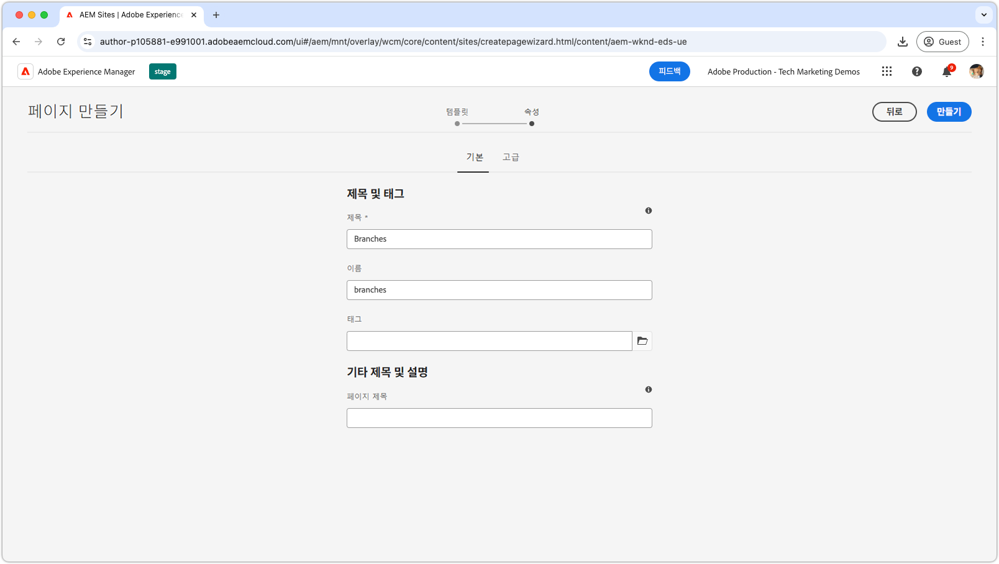
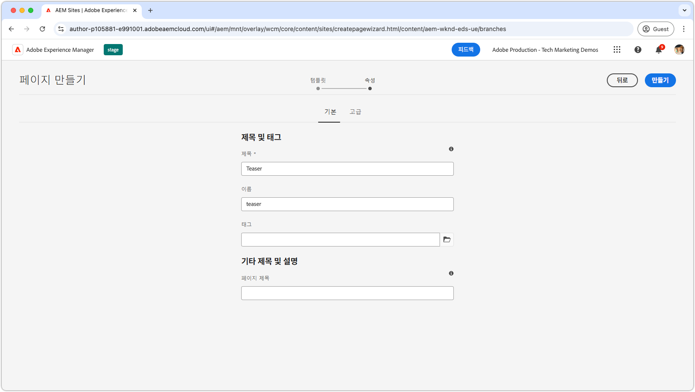
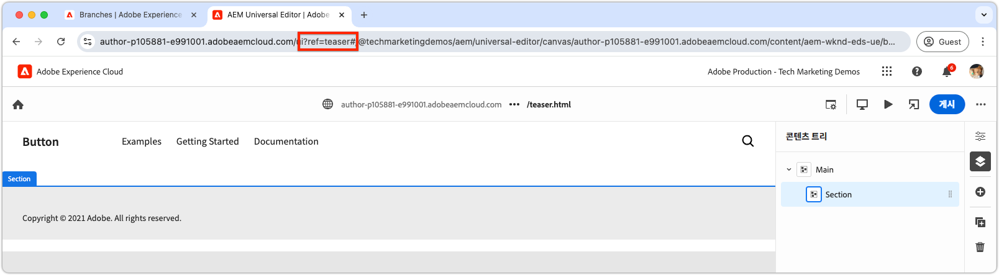
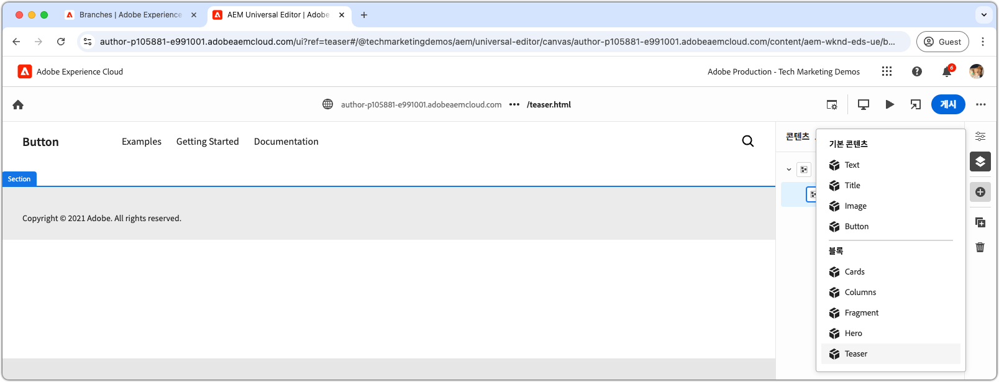
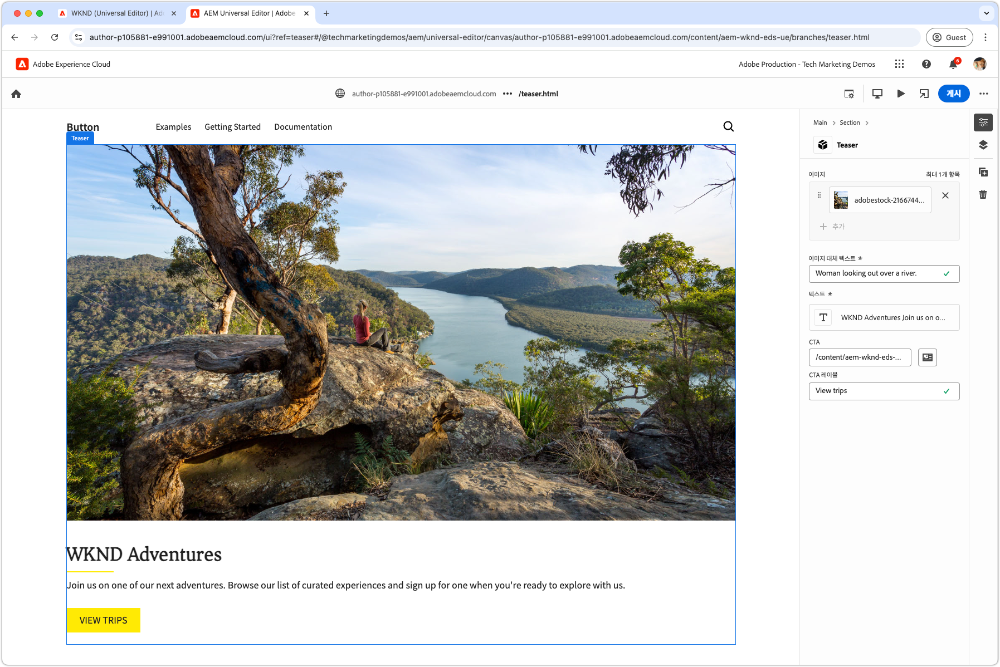
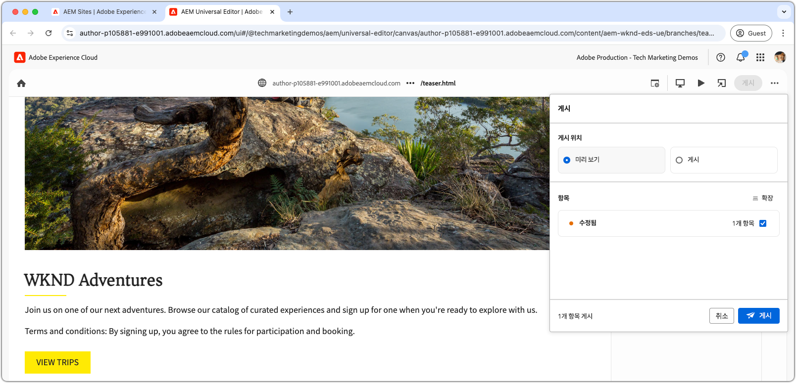

# 블록 작성

[티저 블록의 JSON](./5-new-block.md)을(를) `teaser` 분기로 푸시하면 AEM 유니버설 편집기에서 블록을 편집할 수 있습니다.

개발에서 블록을 작성하는 것은 다음과 같은 몇 가지 이유로 중요합니다.

1. 블록의 정의와 모델이 정확한지 검증한다.
1. 개발자가 블록의 의미론적 HTML을 검토할 수 있도록 해 개발의 밑거름이 된다.
1. 이를 통해 콘텐츠와 시맨틱 HTML을 모두 미리보기 환경에 배포할 수 있으므로 보다 빠른 블록 개발을 지원합니다.

## `teaser` 분기의 코드를 사용하여 유니버설 편집기 열기

1. AEM 작성자에 로그인합니다.
2. **사이트**(으)로 이동하여 [이전 챕터](./2-new-aem-site.md)에서 만든 사이트(WKND(유니버설 편집기))를 선택합니다.

   

3. 페이지를 만들거나 편집하여 새 블록을 추가하고, 컨텍스트를 통해 로컬 개발을 지원할 수 있습니다. 사이트 내 어디에서나 페이지를 만들 수 있지만 새로운 각 작업 본문에 대해 개별 페이지를 만드는 것이 가장 좋습니다. **분기**(이)라는 새 &quot;폴더&quot; 페이지를 만듭니다. 각 하위 페이지는 동일한 이름의 Git 분기 개발을 지원하는 데 사용됩니다.

   

4. **분기** 페이지에서 개발 분기 이름과 일치하는 **티저**&#x200B;라는 새 페이지를 만들고 **열기**&#x200B;를 클릭하여 페이지를 편집합니다.

   

5. URL에 `?ref=teaser`을(를) 추가하여 `teaser` 분기에서 코드를 로드하도록 유니버설 편집기를 업데이트하십시오. 쿼리 매개 변수 **BEFORE**&#x200B;에 `#` 기호를 추가해야 합니다.

   

6. **기본**&#x200B;에서 첫 번째 섹션을 선택하고 **추가** 단추를 클릭한 다음 **티저** 블록을 선택하세요.

   

7. 캔버스에서 새로 추가된 티저를 선택하고 오른쪽에 있는 필드를 작성하거나 인라인 편집 기능을 통해 필드를 작성합니다.

   

8. 작성을 완료한 후 유니버설 편집기의 오른쪽 상단에 있는 **게시** 단추를 선택하고 **미리 보기**&#x200B;에 게시를 선택한 다음 변경 내용을 미리 보기 환경에 게시합니다. 그러면 변경 내용이 웹 사이트의 `aem.page` 도메인에 게시됩니다.
   

9. 변경 내용이 미리보기에 게시될 때까지 기다렸다가 [http://localhost:3000/branches/teaser](http://localhost:3000/branches/teaser)에서 [AEM CLI](./3-local-development-environment.md#install-the-aem-cli)를 통해 웹 페이지를 여십시오.

   

이제 작성된 티저 블록의 컨텐츠 및 의미 있는 HTML을 미리 보기 웹 사이트에서 사용할 수 있으며 로컬 개발 환경에서 AEM CLI를 사용하여 개발할 준비가 되었습니다.
