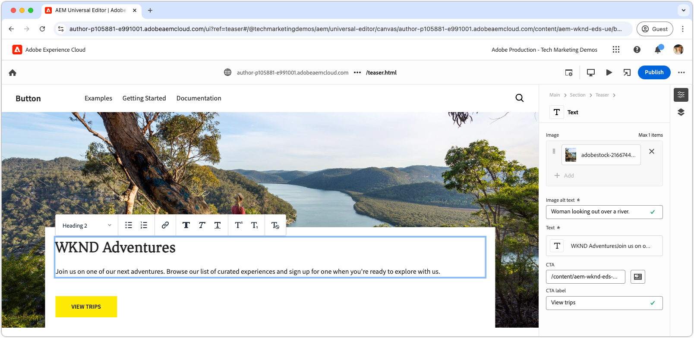

# CSS를 사용하여 블록 개발

Edge Delivery Services의 블록은 CSS를 사용하여 스타일링됩니다. 블록에 대한 CSS 파일은 블록의 디렉터리에 저장되며 블록과 동일한 이름을 갖습니다. 예를 들어, 이름이 `teaser`인 블록의 CSS 파일이 `blocks/teaser/teaser.css`에 있습니다.

이상적으로 블록은 JavaScript을 사용하여 DOM을 수정하거나 CSS 클래스를 추가하지 않고 스타일링에만 CSS가 필요합니다. JavaScript의 필요성은 블록의 [콘텐츠 모델링](./5-new-block.md#block-model) 및 복잡성에 따라 다릅니다. 필요한 경우 [JavaScript 차단](./7b-block-js-css.md)을 추가할 수 있습니다.

CSS 전용 접근 방식을 사용하면 블록의 (대부분) 기본 의미 있는 HTML 요소가 타겟팅되고 스타일링됩니다.

## HTML 차단

블록 스타일을 지정하는 방법을 이해하려면 먼저 Edge Delivery Services에서 공개한 DOM을 검토하십시오. 스타일링할 수 있는 기능이기 때문입니다. DOM은 AEM CLI의 로컬 개발 환경에서 제공하는 블록을 검사하여 찾을 수 있습니다. 유니버설 편집기의 DOM은 약간 다르므로 사용하지 마십시오.

>[!BEGINTABS]

>[!TAB DOM에서 스타일]

다음은 스타일링의 대상이 되는 티저 블록의 DOM입니다.

Edge Delivery Services JavaScript에서 유추한 요소로 [자동으로 증가](./4-website-branding.md#inferred-elements)되는 `<p class="button-container">...`을(를) 확인합니다.

```html
...
<body>
    <header/>
    <main>
        <div>
            <!-- Start block HTML -->
            <div class="teaser block" data-block-name="teaser" data-block-status="loaded">
                <div>
                    <div>
                        <picture>
                            <source type="image/webp" srcset="./media_15ba2b455e29aca38c1ca653d24c40acaec8a008f.jpeg?width=2000&amp;format=webply&amp;optimize=medium" media="(min-width: 600px)">
                            <source type="image/webp" srcset="./media_15ba2b455e29aca38c1ca653d24c40acaec8a008f.jpeg?width=750&amp;format=webply&amp;optimize=medium">
                            <source type="image/jpeg" srcset="./media_15ba2b455e29aca38c1ca653d24c40acaec8a008f.jpeg?width=2000&amp;format=jpeg&amp;optimize=medium" media="(min-width: 600px)">
                            
                        </picture>
                    </div>
                </div>
                <div>
                    <div>
                        <h2 id="wknd-adventures">WKND Adventures</h2>
                        <p>Join us on one of our next adventures. Browse our list of curated experiences and sign up for one when you're ready to explore with us.</p>
                        <p class="button-container"><a href="/" title="View trips" class="button">View trips</a></p>
                    </div>
                </div>
            </div>     
            <!-- End block HTML -->
        </div>
    </main>
    <footer/>
</body>
...
```

>[!TAB DOM을 찾는 방법]

스타일을 지정할 DOM을 찾으려면 로컬 개발 환경에서 스타일이 지정되지 않은 블록이 있는 페이지를 열고 블록을 선택한 다음 DOM을 검사하십시오.


>[!ENDTABS]

## CSS 차단

블록의 이름을 파일 이름으로 사용하여 블록의 폴더에 새 CSS 파일을 만듭니다. 예를 들어 **teaser** 블록의 경우 파일은 `/blocks/teaser/teaser.css`에 있습니다.

Edge Delivery Services의 JavaScript이 티저 블록을 나타내는 페이지에서 DOM 요소를 감지하면 이 CSS 파일이 자동으로 로드됩니다.

[!BADGE /blocks/teaser/teaser.css]{type=Neutral tooltip="아래 코드 샘플의 파일 이름입니다."}

```css
/* /blocks/teaser/teaser.css */

/* Scope each selector in the block with `.block.teaser` using CSS nesting (https://developer.mozilla.org/en-US/docs/Web/CSS/CSS_nesting) to avoid accidental conflicts outside the block */
.block.teaser {
    animation: teaser-fade-in .6s;
    position: relative;
    width: 1600px;
    max-width: 100vw;
    left: 50%; 
    transform: translateX(-50%);
    height: 500px;
    overflow: hidden; 

    /* The image is rendered to the first div in the block */
    picture {
        position: absolute;
        z-index: -1;
        inset: 0;
        box-sizing: border-box;

        img {
            object-fit: cover;
            object-position: center;
            width: 100%;
            height: 100%;
        }
    }

    /** 
    The teaser's text is rendered to the second (also the last) div in the block.

    These styles are scoped to the second (also the last) div in the block (.block.teaser > div:last-child).

    This div order can be used to target different styles to the same semantic elements in the block. 
    For example, if the block has two images, we could target the first image with `.block.teaser > div:first-child img`, 
    and the second image with `.block.teaser > div:nth-child(2) img`.
    **/
    & > div:last-child {
        position: absolute;
        bottom: 0;
        left: 50%;
        transform: translateX(-50%);
        background: var(--background-color);
        padding: 1.5rem 1.5rem 1rem;
        width: 80vw;
        max-width: 1200px;

        /** 
        The following elements reside within `.block.teaser > div:last-child` and could be scoped as such, for example:

        .block.teaser > div:last-child p { .. }

        However since these element can only appear in the second/last div per our block's model, it's unnecessary to add this additional scope.
        **/

        /* Regardless of the authored heading level, we only want one style the heading */
        h1,
        h2,
        h3,
        h4,
        h5,
        h6 {
            font-size: var(--heading-font-size-xl);
            margin: 0;
        }

        h1::after,
        h2::after,
        h3::after,
        h4::after,
        h5::after,
        h6::after {
            border-bottom: 0;
        }

        p {
            font-size: var(--body-font-size-s);
            margin-bottom: 1rem;
        }

        /* Add underlines to links in the text */
        a:hover {
            text-decoration: underline;
        }

        /* Add specific spacing to buttons. These button CSS classes are automatically added by Edge Delivery Services. */
        .button-container {
            margin: 0;
            padding: 0;

            .button {
                background-color: var(--primary-color);
                border-radius: 0;
                color: var(--dark-color);
                font-size: var(--body-font-size-xs);
                font-weight: bold;
                padding: 1em 2.5em;
                margin: 0;
                text-transform: uppercase;
            }
        }
    }
}

/** Animations 
    Scope the @keyframes to the block (teaser) to avoid accidental conflicts outside the block

    Global @keyframes can defines in styles/styles.css and used in this file.
**/

@keyframes teaser-fade-in {
    from {
        opacity: 0;
    }

    to {
        opacity: 1;
    }
}
```

## 개발 미리보기

CSS가 코드 프로젝트에 작성되면 AEM CLI의 핫 리로드가 변경되므로 CSS가 블록에 미치는 영향을 빠르고 쉽게 파악할 수 있습니다.


## 코드 린트

코드가 깔끔하고 일관되도록 코드를 [자주 lint](./3-local-development-environment.md#linting)해야 합니다. 린팅은 문제를 조기에 발견하는 데 도움이 되며, 전체 개발 시간을 단축합니다. 모든 린팅 문제가 해결될 때까지 개발 작업을 `main`에 병합할 수 없습니다.

```bash
# ~/Code/aem-wknd-eds-ue

$ npm run lint:css
```

## 유니버설 편집기에서 미리 보기

AEM의 유니버설 편집기에서 변경 사항을 보려면 변경 사항을 추가하고, 커밋한 다음 유니버설 편집기에서 사용하는 Git 저장소 분기에 푸시합니다. 이 단계는 블록 구현이 작성 경험을 중단하지 않도록 하는 데 도움이 됩니다.

```bash
# ~/Code/aem-wknd-eds-ue

$ git add .
$ git commit -m "Add CSS-only implementation for teaser block"
$ git push origin teaser
```

이제 `?ref=teaser` 쿼리 매개 변수를 추가하면 유니버설 편집기에서 변경 내용을 미리 볼 수 있습니다.


