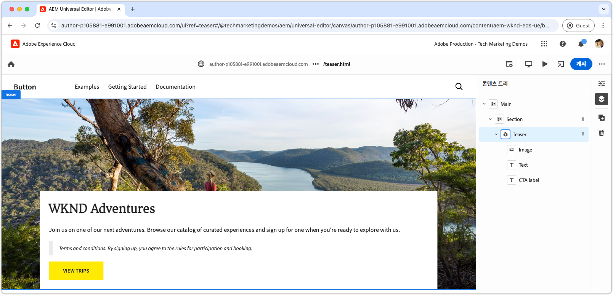

# CSS 및 JavaScript을 사용하여 블록 개발

[이전 챕터](./7b-block-js-css.md)에서는 CSS만 사용하여 블록 스타일을 지정하는 방법에 대해 다룹니다. 이제 포커스가 JavaScript과 CSS를 모두 사용하는 블록 개발로 이동합니다.

다음 예에서는 세 가지 방법으로 블록을 향상시키는 방법을 보여 줍니다.

1. 사용자 지정 CSS 클래스를 추가하는 중입니다.
1. 이벤트 리스너를 사용하여 이동 추가.
1. 티저의 텍스트에 선택적으로 포함될 수 있는 약관 처리.

## 일반적인 사용 사례

이 접근 방식은 다음 시나리오에서 특히 유용합니다.

- **외부 CSS 관리:** 블록의 CSS가 Edge Delivery Services 외부에서 관리되고 해당 HTML 구조와 일치하지 않는 경우.
- **추가 특성:** 접근성을 위한 [ARIA](https://developer.mozilla.org/en-US/docs/Web/Accessibility/ARIA) 또는 [microdata](https://developer.mozilla.org/en-US/docs/Web/HTML/Microdata)와 같은 추가 특성이 필요한 경우.
- **JavaScript 개선 사항:** 이벤트 리스너와 같은 대화형 기능이 필요한 경우.

이 방법은 브라우저 기반의 JavaScript DOM 조작을 사용하지만 DOM을 수정할 때, 특히 요소를 이동할 때 주의해야 합니다. 이러한 변경 사항으로 인해 유니버설 편집기의 작성 경험이 중단될 수 있습니다. 블록의 [콘텐츠 모델](./5-new-block.md#block-model)은(는) 광범위한 DOM 변경의 필요성을 최소화하도록 신중하게 디자인되어야 합니다.

## 블록 HTML

블록 개발에 접근하려면 먼저 Edge Delivery Services에 의해 노출된 DOM을 검토하십시오. 구조는 JavaScript으로 개선되고 CSS로 스타일링됩니다.

>[!BEGINTABS]

>[!TAB 장식할 DOM]

다음은 JavaScript 및 CSS를 사용하여 장식할 타겟인 티저 블록의 DOM입니다.

```html
...
<body>
    <header/>
    <main>
        <div>
            <!-- Start block HTML -->
            <div class="teaser block" data-block-name="teaser" data-block-status="loaded">
                <div>
                    <div>
                    <picture>
                        <source type="image/webp" srcset="./media_15ba2b455e29aca38c1ca653d24c40acaec8a008f.jpeg?width=2000&amp;format=webply&amp;optimize=medium" media="(min-width: 600px)">
                        <source type="image/webp" srcset="./media_15ba2b455e29aca38c1ca653d24c40acaec8a008f.jpeg?width=750&amp;format=webply&amp;optimize=medium">
                        <source type="image/jpeg" srcset="./media_15ba2b455e29aca38c1ca653d24c40acaec8a008f.jpeg?width=2000&amp;format=jpeg&amp;optimize=medium" media="(min-width: 600px)">
                        
                    </picture>
                    </div>
                </div>
                <div>
                    <div>
                    <h2 id="wknd-adventures">WKND Adventures</h2>
                    <p>Join us on one of our next adventures. Browse our list of curated experiences and sign up for one when you're ready to explore with us.</p>
                    <p class="button-container"><a href="/" title="View trips" class="button">View trips</a></p>
                    </div>
                </div>
            </div>     
            <!-- End block HTML -->
        </div>
    </main>
    <footer/>
</body>
...
```

>[!TAB DOM을 찾는 방법]

꾸밀 DOM을 찾으려면 로컬 개발 환경에서 꾸미지 않은 블록으로 페이지를 열고 블록을 선택한 다음 DOM을 검사합니다.


>[!ENDTABS]


## JavaScript 차단

블록에 JavaScript 기능을 추가하려면 블록의 디렉터리에 블록과 같은 이름으로 JavaScript 파일을 만듭니다(예: `/blocks/teaser/teaser.js`).

JavaScript 파일은 기본 함수를 내보내야 합니다.

```javascript
export default function decorate(block) { ... }
```

기본 함수는 Edge Delivery Services HTML에서 블록을 나타내는 DOM 요소/트리를 사용하며 블록이 렌더링될 때 실행되는 사용자 지정 JavaScript을 포함합니다.

이 예제 JavaScript은 다음 세 가지 주요 작업을 수행합니다.

1. CTA 단추에 이벤트 리스너를 추가하여 마우스로 가리키면 이미지를 확대/축소합니다.
1. 기존 CSS 디자인 시스템을 통합할 때 유용한 의미 있는 CSS 클래스를 블록의 요소에 추가합니다.
1. `Terms and conditions:`(으)로 시작하는 단락에 특수 CSS 클래스를 추가합니다.

[!BADGE /blocks/teaser/teaser.js]{type=Neutral tooltip="아래 코드 샘플의 파일 이름입니다."}

```javascript
/* /blocks/teaser/teaser.js */

/**
 * Adds a zoom effect to image using event listeners.
 *
 * When the CTA button is hovered over, the image zooms in.
 *
 * @param {HTMLElement} block represents the block's' DOM tree
 */
function addEventListeners(block) {
  block.querySelector('.button').addEventListener('mouseover', () => {
    block.querySelector('.image').classList.add('zoom');
  });

  block.querySelector('.button').addEventListener('mouseout', () => {
    block.querySelector('.image').classList.remove('zoom');
  });
}

/**
   * Entry point to block's JavaScript.
   * Must be exported as default and accept a block's DOM element.
   * This function is called by the project's style.js, and passed the block's element.
   *
   * @param {HTMLElement} block represents the block's' DOM element/tree
   */
export default function decorate(block) {
  /* This JavaScript makes minor adjustments to the block's DOM */

  // Dress the DOM elements with semantic CSS classes so it's obvious what they are.
  // If needed we could also add ARIA roles and attributes, or add/remove/move DOM elements.

  // Add a class to the first picture element to target it with CSS
  block.querySelector('picture').classList.add('image-wrapper');

  // Use previously applied classes to target new elements
  block.querySelector('.image-wrapper img').classList.add('image');

  // Mark the second/last div as the content area (white, bottom aligned box w/ text and cta)
  block.querySelector(':scope > div:last-child').classList.add('content');

  // Mark the first H1-H6 as a title
  block.querySelector('h1,h2,h3,h4,h5,h6').classList.add('title');

  // Process each paragraph and mark it as text or terms-and-conditions
  block.querySelectorAll('p').forEach((p) => {
    const innerHTML = p.innerHTML?.trim();

    // If the paragraph starts with Terms and conditions: then style it as such
    if (innerHTML?.startsWith("Terms and conditions:")) {
      /* If a paragraph starts with '*', add a special CSS class. */
      p.classList.add('terms-and-conditions');
    }
  });

  // Add event listeners to the block
  addEventListeners(block);
}
```

## CSS 차단

[이전 챕터](./7a-block-css.md)에서 `teaser.css`을(를) 만든 경우 삭제하거나 이름을 `teaser.css.bak`(으)로 바꾸십시오. 이 챕터는 티저 블록에 대한 다른 CSS를 구현합니다.

블록의 폴더에 `teaser.css` 파일을 만듭니다. 이 파일에는 블록 스타일을 지정하는 CSS 코드가 포함되어 있습니다. 이 CSS 코드는 블록의 요소 및 `teaser.js`에 JavaScript에서 추가한 특정 의미 체계 CSS 클래스를 대상으로 합니다.

베어 요소는 여전히 직접 스타일링하거나 사용자 지정 적용 CSS 클래스를 사용하여 스타일링할 수 있습니다. 더 복잡한 블록의 경우 시맨틱 CSS 클래스를 적용하면 특히 더 긴 기간에 걸쳐 더 큰 팀과 작업할 때 CSS를 더 쉽게 이해하고 유지 관리할 수 있습니다.

[이전 ](./7a-block-css.md#develop-a-block-with-css)과(와) 마찬가지로 [CSS 중첩](https://developer.mozilla.org/en-US/docs/Web/CSS/CSS_nesting)을(를) 사용하여 CSS의 범위를 `.block.teaser`(으)로 지정하여 다른 블록과의 충돌을 방지하십시오.

[!BADGE /blocks/teaser/teaser.css]{type=Neutral tooltip="아래 코드 샘플의 파일 이름입니다."}

```css
/* /blocks/teaser/teaser.css */

/* Scope each selector in the block with `.block.teaser` to avoid accidental conflicts outside the block */
.block.teaser {
    animation: teaser-fade-in 1s;
    position: relative;
    width: 1600px;
    max-width: 100vw;
    left: 50%; 
    transform: translateX(-50%);
    height: 500px;

    /* The teaser image */
    & .image-wrapper {
        position: absolute;
        z-index: -1;
        inset: 0;
        box-sizing: border-box;
        overflow: hidden; 

        & .image {
            object-fit: cover;
            object-position: center;
            width: 100%;
            height: 100%;
            transform: scale(1); 
            transition: transform 0.6s ease-in-out;
        }
    }

    /* The teaser text content */
    & .content {
        position: absolute;
        bottom: 0;
        left: 50%;
        transform: translateX(-50%);
        background: var(--background-color);
        padding: 1.5rem 1.5rem 1rem;
        width: 80vw;
        max-width: 1200px;
  
        & .title {
            font-size: var(--heading-font-size-xl);
            margin: 0;
        }

        & .title::after {
            border-bottom: 0;
        }

        & p {
            font-size: var(--body-font-size-s);
            margin-bottom: 1rem;
            animation: teaser-fade-in .6s;
        }

        & p.terms-and-conditions {
            font-size: var(--body-font-size-xs);
            color: var(--secondary-color);
            padding: .5rem 1rem;
            font-style: italic;
            border: solid var(--light-color);
            border-width: 0 0 0 10px;
        }

        /* Add underlines to links in the text */
        & a:hover {
            text-decoration: underline;
        }

        /* Add specific spacing to buttons. These button CSS classes are automatically added by Edge Delivery Services. */
        & .button-container {
            margin: 0;
            padding: 0;
        }

        & .button {   
            background-color: var(--primary-color);
            border-radius: 0;
            color: var(--dark-color);
            font-size: var(--body-font-size-xs);
            font-weight: bold;
            padding: 1em 2.5em;
            margin: 0;
            text-transform: uppercase;
        }
    }

    & .zoom {
        transform: scale(1.1);
    }
}

/** Animations 
    Scope the @keyframes to the block (teaser) to avoid accidental conflicts outside the block

    Global @keyframes can defines in styles/styles.css and used in this file.
**/
@keyframes teaser-fade-in {
    from {
        opacity: 0;
    }

    to {
        opacity: 1;
    }
}
```

## 약관 추가

위의 구현에서는 텍스트 `Terms and conditions:`(으)로 시작하는 단락의 스타일을 특별히 지원합니다. 이 기능의 유효성을 검사하려면 유니버설 편집기에서 약관을 포함하도록 티저 블록의 텍스트 콘텐츠를 업데이트합니다.

[블록 작성자](./6-author-block.md)의 단계에 따라 텍스트를 편집하여 끝에 **약관** 단락을 포함합니다.

```
WKND Adventures

Join us on one of our next adventures. Browse our list of curated experiences and sign up for one when you're ready to explore with us.

Terms and conditions: By signing up, you agree to the rules for participation and booking.
```

단락이 로컬 개발 환경에서 사용 약관 스타일로 렌더링되는지 확인합니다. 이러한 코드 변경 사항은 범용 편집기에서 사용하도록 구성한 [GitHub의 분기로 푸시됨](#preview-in-universal-editor)이 될 때까지 범용 편집기에 반영되지 않습니다.

## 개발 미리보기

CSS와 JavaScript이 추가되면 AEM CLI의 로컬 개발 환경은 변경 사항을 핫 로드하여 코드가 블록에 미치는 영향을 빠르고 쉽게 시각화할 수 있습니다. CTA 위로 마우스를 가져간 후 티저의 이미지가 확대되고 축소되는지 확인합니다.


## 코드 린트

코드 변경 내용을 깔끔하고 일관되게 유지하려면 [자주 lint](./3-local-development-environment.md#linting)해야 합니다. 정기적인 린팅은 문제를 조기에 발견하는 데 도움이 되므로 전반적인 개발 시간이 단축됩니다. 모든 린팅 문제가 해결될 때까지 개발 작업을 `main` 분기에 병합할 수 없습니다.

```bash
# ~/Code/aem-wknd-eds-ue

$ npm run lint
```

## 유니버설 편집기에서 미리 보기

AEM의 유니버설 편집기에서 변경 사항을 보려면 변경 사항을 추가하고, 커밋한 다음 유니버설 편집기에서 사용하는 Git 저장소 분기에 푸시합니다. 이렇게 하면 블록 구현이 작성 경험을 중단하지 않습니다.

```bash
# ~/Code/aem-wknd-eds-ue

$ git add .
$ git commit -m "CSS and JavaScript implementation for teaser block"
$ git push origin teaser
```

이제 `?ref=teaser` 쿼리 매개 변수를 추가하면 유니버설 편집기에서 변경 내용을 미리 볼 수 있습니다.


