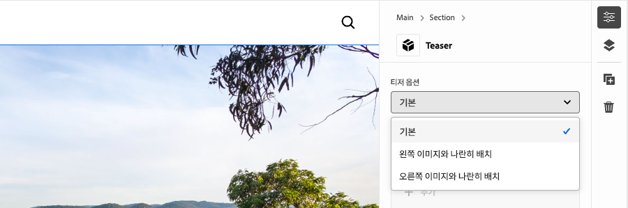
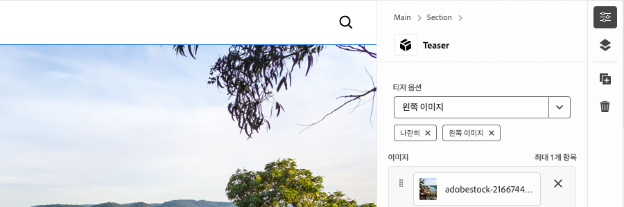
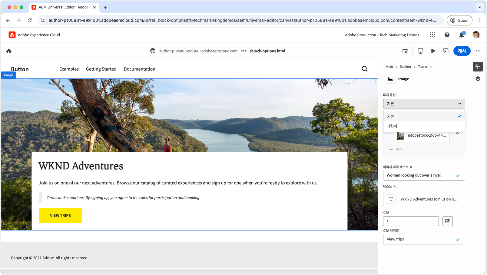
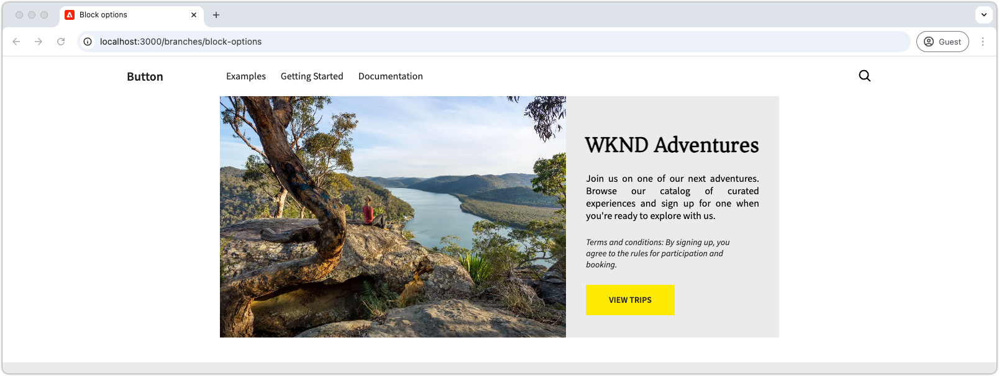

# 옵션이 있는 블록 개발

이 튜토리얼에서는 Edge Delivery Services 및 범용 편집기 튜토리얼을 기반으로 블록에 블록 옵션을 추가하는 과정을 안내합니다. 블록 옵션을 정의하면 블록의 모양과 기능을 사용자 정의하여 다양한 콘텐츠 요구 사항에 맞게 다양한 변형을 적용할 수 있습니다. 이를 통해 사이트 디자인 시스템 내에서 유연성과 재사용성을 높일 수 있습니다.

{align="center"}

이 튜토리얼에서는 티저 블록에 블록 옵션을 추가하여 작성자가 두 가지 표시 옵션인 **기본**&#x200B;과 **병렬** 중에서 선택할 수 있도록 합니다. **기본** 옵션은 이미지를 텍스트 뒤쪽 상단에 표시하고, **병렬** 옵션은 이미지와 텍스트를 나란히 표시합니다.

## 일반적인 사용 사례

**Edge Delivery Services** 및 **범용 편집기** 개발 시 **블록 옵션**&#x200B;을 사용하는 일반적인 사용 사례에는 다음이 포함되지만 이에 국한되지 않습니다.

1. **레이아웃 변형:** 레이아웃을 쉽게 전환할 수 있습니다. 예를 들어 가로에서 세로로, 격자에서 목록으로 전환할 수 있습니다.
2. **스타일 변형:** 테마나 시각적 처리 방식을 쉽게 전환할 수 있습니다. 예를 들어 밝은 모드와 어두운 모드, 큰 텍스트와 작은 텍스트 간 전환이 가능합니다.
3. **콘텐츠 표시 제어:** 요소의 가시성을 전환하거나 콘텐츠 스타일(간결하게 및 자세히)을 전환합니다.

이 옵션들은 동적이고 유연한 블록을 제작하는 데 있어 유연성과 효율성을 제공합니다.

이 튜토리얼에서는 티저 블록을 두 가지 다른 레이아웃(**기본** 및 **병렬**)으로 표시할 수 있는 레이아웃 변형 사용 사례를 보여 줍니다.

## 블록 모델

티저 블록에 블록 옵션을 추가하려면 `/block/teaser/_teaser.json`에서 JSON 조각을 열고 모델 정의에 새 필드를 추가합니다. 이 필드는 `name` 속성을 `classes`로 설정합니다. 이 속성은 AEM에서 블록 옵션을 저장하는 데 사용되는 보호된 필드로, 블록의 Edge Delivery Services HTML에 적용됩니다.

### 필드 구성

아래 탭은 블록 모델에서 블록 옵션을 구성하는 다양한 방법을 보여 줍니다. 여기에는 단일 CSS 클래스를 사용한 단일 선택, 여러 CSS 클래스를 사용한 단일 선택, 여러 CSS 클래스를 사용한 다중 선택이 포함됩니다. 이 튜토리얼에서는 **단일 CSS 클래스로 선택**&#x200B;에서 사용되는 [보다 간단한 접근 방식을 구현](#field-configuration-for-this-tutorial)합니다.

>[!BEGINTABS]

>[!TAB 단일 CSS 클래스로 선택]

이 튜토리얼에서는 `select`(드롭다운) 입력 유형을 사용하는 방법을 보여 줍니다. 이렇게 하면 작성자가 단일 블록 옵션을 선택하여 해당하는 단일 CSS 클래스로 적용할 수 있습니다.

{align="center"}

#### 블록 모델

**기본** 옵션은 빈 문자열(`""`)로 표시되며, **병렬** 옵션은 `"side-by-side"`를 사용합니다. 옵션 **이름**&#x200B;과 **값**&#x200B;이 꼭 같을 필요는 없지만 **값**&#x200B;은 블록의 HTML에 적용되는 CSS 클래스를 결정합니다. 예를 들어 **병렬** 옵션의 값은 `side-by-side`가 아닌 `layout-10`일 수 있습니다. 그러나 옵션 값의 명확성과 일관성을 보장하려면 CSS 클래스에 의미 있는 이름을 사용하는 것이 가장 좋습니다.

[!BADGE /blocks/teaser/_teaser.json]{type=Neutral tooltip="아래 코드 샘플의 파일 이름입니다."}

```json{highlight="4,8,9-18"}
...
"fields": [
    {
        "component": "select",
        "name": "classes",
        "value": "",
        "label": "Teaser options",
        "valueType": "string",
        "options": [
            {
                "name": "Default",
                "value": ""
            },
            {
                "name": "Side-by-side",
                "value": "side-by-side"
            }
        ]
    }
]
...
```

#### 블록 HTML

작성자가 옵션을 선택하면 해당 값이 CSS 클래스로 블록의 HTML에 추가됩니다.

- **기본**&#x200B;을 선택한 경우:

  ```html
  <div class="block teaser">
      <!-- Block content here -->
  </div>
  ```

- **병렬**&#x200B;을 선택한 경우:

  ```html
  <div class="block teaser side-by-side">
      <!-- Block content here -->
  </div>
  ```

이를 통해 선택한 옵션에 따라 다양한 스타일과 조건부 JavaScript를 적용할 수 있습니다.


>[!TAB 여러 CSS 클래스로 선택]

**이 방법은 본 튜토리얼에서는 사용되지 않지만 대안적 방법과 고급 블록 옵션을 보여 줍니다.**

`select` 입력 유형을 통해 작성자는 단일 블록 옵션을 선택할 수 있으며, 이는 선택적으로 여러 CSS 클래스에 매핑할 수 있습니다. 이렇게 하려면 CSS 클래스를 공백으로 구분된 값으로 나열합니다.

{align="center"}

#### 블록 모델

예를 들어 **병렬** 옵션은 이미지가 왼쪽에 표시되는 경우(`side-by-side left`) 또는 오른쪽에 표시되는 경우(`side-by-side right`)와 같은 변형을 지원할 수 있습니다.

[!BADGE /blocks/teaser/_teaser.json]{type=Neutral tooltip="아래 코드 샘플의 파일 이름입니다."}

```json{highlight="4,8,9-21"}
...
"fields": [
    {
        "component": "select",
        "name": "classes",
        "value": "",
        "label": "Teaser options",
        "valueType": "string",
        "options": [
            {
                "name": "Default",
                "value": ""
            },
            {
                "name": "Side-by-side with Image on left",
                "value": "side-by-side left"
            },
            {
                "name": "Side-by-side with Image on right",
                "value": "side-by-side right"
            }
        ]
    }
]
...
```

#### 블록 HTML

작성자가 옵션을 선택하면 해당 값이 블록의 HTML에 공백으로 구분된 CSS 클래스 세트로 적용됩니다.

- **기본**&#x200B;을 선택한 경우:

  ```html
  <div class="block teaser">
      <!-- Block content here -->
  </div>
  ```

- **이미지가 왼쪽에 있는 병렬**&#x200B;을 선택한 경우:

  ```html
  <div class="block teaser side-by-side left">
      <!-- Block content here -->
  </div>
  ```

- **이미지가 오른쪽에 있는 병렬**&#x200B;을 선택한 경우:

  ```html
  <div class="block teaser side-by-side right">
      <!-- Block content here -->
  </div>
  ```

이를 통해 선택한 옵션에 따라 다양한 스타일과 조건부 JavaScript를 적용할 수 있습니다.


>[!TAB 여러 CSS 클래스를 사용한 다중 선택]

**이 방법은 본 튜토리얼에서는 사용되지 않지만 대안적 방법과 고급 블록 옵션을 보여 줍니다.**

`"component": "multiselect"` 입력 유형을 통해 작성자는 여러 옵션을 동시에 선택할 수 있습니다. 이렇게 하면 여러 가지 디자인 선택을 결합하여 블록의 모양을 복잡하게 변형할 수 있습니다.

{align="center"}

### 블록 모델

예를 들어 **병렬**, **이미지를 왼쪽에 배치** 및 **이미지를 오른쪽에 배치** 옵션은 이미지가 왼쪽에 위치하는 경우(`side-by-side left`) 또는 오른쪽에 위치하는 경우(`side-by-side right`)와 같은 변형을 지원할 수 있습니다.

[!BADGE /blocks/teaser/_teaser.json]{type=Neutral tooltip="아래 코드 샘플의 파일 이름입니다."}

```json{highlight="4,6,8,10-21"}
...
"fields": [
    {
        "component": "multiselect",
        "name": "classes",
        "value": [],
        "label": "Teaser options",
        "valueType": "array",
        "options": [
            {
                "name": "Side-by-side",
                "value": "side-by-side"
            },
            {
                "name": "Image on left",
                "value": "left"
            },
            {
                "name": "Image on right",
                "value": "right"
            }
        ]
    }
]
...
```

#### 블록 HTML

작성자가 여러 옵션을 선택하면 해당 값이 블록의 HTML에 공백으로 구분된 CSS 클래스로 적용됩니다.

- **병렬** 및 **이미지를 왼쪽에 배치**&#x200B;을 선택한 경우:

  ```html{highlight="1"}
  <div class="block teaser side-by-side left">
      <!-- Block content here -->
  </div>
  ```

- **병렬** 및 **이미지를 오른쪽에 배치**&#x200B;을 선택한 경우:

  ```html{highlight="1"}
  <div class="block teaser side-by-side right">
      <!-- Block content here -->
  </div>
  ```

다중 선택은 유연성을 제공하지만 디자인 변형을 관리하는 데 복잡성을 증가시킵니다. 제한이 없으면 선택이 충돌하여 끊어진 경험이나 브랜드에 맞지 않는 경험을 초래할 수 있습니다.

예:

- **이미지를 왼쪽에 배치** 또는 **이미지를 오른쪽에 패치**&#x200B;를 **병렬**&#x200B;과 함께 선택하지 않으면 암묵적으로 **기본**&#x200B;이 적용되어 항상 이미지를 배경으로 설정하므로, 좌우 정렬은 중요하지 않습니다.
- **이미지를 왼쪽에 배치**&#x200B;와 **이미지를 오른쪽에 패치**&#x200B;를 모두 선택할 수는 없습니다.
- **이미지를 왼쪽에 배치** 또는 **이미지를 오른쪽에 배치** 없이 **병렬**&#x200B;을 선택하면 이미지의 위치가 지정되지 않아 모호한 것으로 간주될 수 있습니다.

다중 선택을 사용할 때 문제가 발생하고 작성자가 혼란스러워지는 것을 방지하려면 옵션을 잘 계획하고 모든 조합을 충분히 테스트해야 합니다. 다중 선택은 레이아웃이 변경되는 선택보다는 “크게” 또는 “강조 표시”와 같이 간단하고 상충되지 않는 개선 작업에 가장 적합합니다.


>[!TAB 기본 옵션]

**이 방법은 본 튜토리얼에서는 사용되지 않지만 대안적 방법과 고급 블록 옵션을 보여 줍니다.**

범용 편집기에서 페이지에 새로운 블록 인스턴스를 추가할 때 블록 옵션을 기본값으로 설정할 수 있습니다. 이 작업은 [블록 정의](../5-new-block.md#block-definition)에서 `classes` 속성의 기본값을 설정하여 수행됩니다.

#### 블록 정의

아래 예제에서는 `classes` 필드의 `value` 속성을 `side-by-side`로 할당하여 기본 옵션을 **병렬**&#x200B;로 설정합니다. 블록 모델의 해당 블록 옵션 입력은 선택 사항입니다.

동일한 블록에 대해 각각 다른 이름과 클래스를 사용하여 여러 항목을 정의할 수도 있습니다. 이를 통해 범용 편집기는 특정 블록 옵션으로 미리 구성된 고유한 블록 항목을 표시할 수 있습니다. 편집기에서는 이들이 별도의 블록으로 나타나지만 코드베이스에는 선택한 옵션에 따라 동적으로 렌더링되는 단일 블록이 포함됩니다.

[!BADGE /blocks/teaser/_teaser.json]{type=Neutral tooltip="아래 코드 샘플의 파일 이름입니다."}

```json{highlight="12"}
{
    "definitions": [{
      "title": "Teaser",
      "id": "teaser",
      "plugins": {
        "xwalk": {
          "page": {
            "resourceType": "core/franklin/components/block/v1/block",
            "template": {
              "name": "Teaser",
              "model": "teaser",
              "classes": "side-by-side",
              "textContent_text": "<h2>Enter a title</h2><p>...and body text here!</p>",
              "textContent_cta": "/",
              "textContent_ctaText": "Click me!"
            }
          }
        }
      }
    }],
    "models": [... from previous section ...],
    "filters": []
}
```

>[!ENDTABS]


### 이 튜토리얼의 필드 구성


이 튜토리얼에서는 첫 번째 탭에서 설명한 단일 CSS 클래스로 선택하는 방식을 사용하여, 두 가지 블록 옵션인 **기본**&#x200B;과 **병렬**&#x200B;을 사용하겠습니다.

블록의 JSON 조각 내 모델 정의에서 블록 옵션에 대한 단일 선택 필드를 추가합니다. 이 필드에서 작성자는 기본 레이아웃과 병렬 레이아웃 중에서 선택할 수 있습니다.

[!BADGE /blocks/teaser/_teaser.json]{type=Neutral tooltip="아래 코드 샘플의 파일 이름입니다."}

```json{highlight="7-24"}
{
    "definitions": [...],
    "models": [
        {
            "id": "teaser", 
            "fields": [
                {
                    "component": "select",
                    "name": "classes",
                    "value": "",
                    "label": "Teaser options",
                    "description": "",
                    "valueType": "string",
                    "options": [
                        {
                            "name": "Default",
                            "value": ""
                        },
                        {
                            "name": "Side-by-side",
                            "value": "side-by-side"
                        }
                    ]
                },
                {
                    "component": "reference",
                    "valueType": "string",
                    "name": "image",
                    "label": "Image",
                    "multi": false
                },
                {
                    "component": "text",
                    "valueType": "string",
                    "name": "imageAlt",
                    "label": "Image alt text",
                    "required": true
                },
                {
                    "component": "richtext",
                    "name": "textContent_text",
                    "label": "Text",
                    "valueType": "string",
                    "required": true
                },
                {
                    "component": "aem-content",
                    "name": "textContent_cta",
                    "label": "CTA",
                    "valueType": "string"
                },
                {
                    "component": "text",
                    "name": "textContent_ctaText",
                    "label": "CTA label",
                    "valueType": "string"
                }
            ]
        }
    ],
    "filters": []
}
```

## 범용 편집기에서 블록 업데이트

업데이트된 블록 옵션 입력을 범용 편집기에서 사용하려면 JSON 코드 변경 사항을 GitHub에 배포하고, 새 페이지를 만들고, **병렬** 옵션을 사용하여 티저 블록을 추가하고 작성한 다음 페이지를 미리 볼 수 있도록 게시합니다. 게시한 후 로컬 개발 환경에 페이지를 로드하여 코딩합니다.

### GitHub에 변경 사항 푸시

업데이트된 블록 옵션 입력을 범용 편집기에서 사용할 수 있도록 하여 블록 옵션을 설정하고 결과 HTML에 맞춰 개발하려면 프로젝트를 린트하고 변경 사항을 GitHub 분기(이 경우에는 `block-options` 분기)에 푸시해야 합니다.

```bash
# ~/Code/aem-wknd-eds-ue

# Lint the changes to catch any syntax errors
$ npm run lint 

$ git add .
$ git commit -m "Add Teaser block option to JSON file so it is available in Universal Editor"
$ git push origin teaser
```

### 테스트 페이지 만들기

AEM 작성자 서비스에서 개발용 티저 블록을 추가하기 위한 새 페이지를 만듭니다. [Edge Delivery Services 및 범용 편집기 개발자 튜토리얼](../0-overview.md) 내 [블록 작성](../6-author-block.md) 장의 규칙을 따라 `branches` 페이지 아래에 테스트 페이지를 만들고, 작업 중인 Git 분기의 이름을 지정합니다(이 경우에는 `block-options`).

### 블록 작성

범용 편집기에서 새로운 **블록 옵션** 페이지를 편집하고 **티저** 블록을 추가합니다. `block-options` GitHub 분기의 코드를 사용하여 페이지를 로드하려면 URL에 `?ref=block-options` 쿼리 매개변수를 추가해야 합니다.

이제 블록 대화 상자에는 **기본** 및 **병렬** 선택 항목이 있는 **티저 옵션** 드롭다운이 포함되어 있습니다. **병렬**&#x200B;을 선택하고 나머지 콘텐츠 작성을 완료합니다.

{align="center"}

선택적으로, 두 개의 **티저** 블록을 추가할 수 있습니다. 하나는 **기본**&#x200B;으로, 다른 하나는 **병렬**&#x200B;로 설정합니다. 이를 통해 개발 중에 두 옵션을 나란히 미리 볼 수 있으며, **병렬** 구현이 **기본** 옵션에 영향을 미치지 않도록 할 수 있습니다.

### 미리보기에 게시

티저 블록이 페이지에 추가되면 **게시** 버튼을 사용하고 범용 편집기에서 **미리보기**&#x200B;에 게시하도록 선택하여 [페이지를 미리보기에 게시](../6-author-block.md)합니다.

## 블록 HTML

블록 개발을 시작하려면 먼저 Edge Delivery Services 미리보기에서 노출되는 DOM 구조를 검토합니다. DOM은 JavaScript로 강화되고 CSS로 스타일이 지정되어 블록을 빌드하고 사용자 정의하기 위한 기반을 제공합니다.

>[!BEGINTABS]

>[!TAB DOM 장식]

다음은 **병렬** 블록 옵션이 선택된 티저 블록의 DOM입니다. 이 블록은 JavaScript와 CSS를 사용하여 장식됩니다.

```html{highlight="7"}
...
<body>
    <header/>
    <main>
        <div>
            <!-- Start block HTML -->
            <div class="teaser block side-by-side" data-block-name="teaser" data-block-status="loaded">
                <div>
                    <div>
                    <picture>
                        <source type="image/webp" srcset="./media_15ba2b455e29aca38c1ca653d24c40acaec8a008f.jpeg?width=2000&amp;format=webply&amp;optimize=medium" media="(min-width: 600px)">
                        <source type="image/webp" srcset="./media_15ba2b455e29aca38c1ca653d24c40acaec8a008f.jpeg?width=750&amp;format=webply&amp;optimize=medium">
                        <source type="image/jpeg" srcset="./media_15ba2b455e29aca38c1ca653d24c40acaec8a008f.jpeg?width=2000&amp;format=jpeg&amp;optimize=medium" media="(min-width: 600px)">
                        
                    </picture>
                    </div>
                </div>
                <div>
                    <div>
                    <h2 id="wknd-adventures">WKND Adventures</h2>
                    <p>Join us on one of our next adventures. Browse our list of curated experiences and sign up for one when you're ready to explore with us.</p>
                    <p>Terms and conditions: By signing up, you agree to the rules for participation and booking.</p>
                    <p class="button-container"><a href="/" title="View trips" class="button">View trips</a></p>
                    </div>
                </div>
            </div>     
            <!-- End block HTML -->
        </div>
    </main>
    <footer/>
</body>
...
```

>[!TAB DOM을 찾는 방법]

장식할 DOM을 찾으려면 로컬 개발 환경에서 블록이 포함된 페이지를 열고, 웹 브라우저의 개발자 도구를 사용하여 블록을 선택한 다음 DOM을 검사합니다. 이렇게 하면 장식에 적합한 요소를 식별할 수 있습니다.

{align="center"}

>[!ENDTABS]

## 블록 CSS

**병렬** 옵션에 대한 특정 CSS 스타일을 추가하려면 `blocks/teaser/teaser.css`를 편집합니다. 이 파일에는 블록의 기본 CSS가 포함되어 있습니다.

**병렬** 옵션의 스타일을 수정하려면 `side-by-side` 클래스로 구성된 티저 블록을 대상으로 하는 `teaser.css` 파일에 새로운 범위가 지정된 CSS 규칙을 추가합니다.

```css
.block.teaser.side-by-side { ... }
```

또는 더 간결한 버전을 위해 CSS 중첩을 사용할 수도 있습니다.

```css
.block.teaser {
    ... Default teaser block styles ...

    &.side-by-side {
        ... Side-by-side teaser block styles ...
    }
}
```

`&.side-by-side` 규칙 내에서 `side-by-side` 클래스를 적용할 때 블록의 스타일을 지정하기 위해 필요한 CSS 속성을 추가합니다.

일반적인 접근 방식은 공유된 선택기에 `all: initial`을 적용한 다음 `side-by-side` 변형에 필요한 스타일을 추가하는 것입니다. 대부분의 스타일이 여러 옵션에서 공유되는 경우 특정 속성을 재정의하는 것이 더 쉬울 수 있습니다. 하지만 여러 선택기를 변경해야 하는 경우에는 모든 스타일을 재설정하고 필요한 스타일만 다시 적용하면 코드가 더 명확해지고 유지 관리가 더 쉬워질 수 있습니다.
[!BADGE /blocks/teaser/teaser.css]{type=Neutral tooltip="아래 코드 샘플의 파일 이름입니다."}

```css
/* /blocks/teaser/teaser.css */

/* Scope each selector in the block with `.block.teaser` to avoid accidental conflicts outside the block */
.block.teaser {
    animation: teaser-fade-in 1s;
    position: relative;
    width: 1600px;
    max-width: 100vw;
    left: 50%; 
    transform: translateX(-50%);
    height: 500px;
    overflow: hidden; 


    /* The teaser image */
    .image-wrapper {
        position: absolute;
        z-index: -1;
        inset: 0;
        box-sizing: border-box;
        overflow: hidden; 

        .image {
            object-fit: cover;
            object-position: center;
            width: 100%;
            height: 100%;
            transform: scale(1); 
            transition: transform 0.6s ease-in-out;

            .zoom {
                transform: scale(1.1);
            }            
        }
    }

    /* The teaser text content */
    .content {
        position: absolute;
        bottom: 0;
        left: 50%;
        transform: translateX(-50%);
        background: var(--background-color);
        padding: 1.5rem 1.5rem 1rem;
        width: 80vw;
        max-width: 1200px;
  
        .title {
            font-size: var(--heading-font-size-xl);
            margin: 0;
        }

        .title::after {
            border-bottom: 0;
        }

        p {
            font-size: var(--body-font-size-s);
            margin-bottom: 1rem;
            animation: teaser-fade-in .6s;
        }

        p.terms-and-conditions {
            font-size: var(--body-font-size-xs);
            color: var(--secondary-color);
            padding: .5rem 1rem;
            font-style: italic;
            border: solid var(--light-color);
            border-width: 0 0 0 10px;
        }

        /* Add underlines to links in the text */
        a:hover {
            text-decoration: underline;
        }

        /* Add specific spacing to buttons. These button CSS classes are automatically added by Edge Delivery Services. */
        .button-container {
            margin: 0;
            padding: 0;        

            .button {   
                background-color: var(--primary-color);
                border-radius: 0;
                color: var(--dark-color);
                font-size: var(--body-font-size-xs);
                font-weight: bold;
                padding: 1em 2.5em;
                margin: 0;
                text-transform: uppercase;
            }
        }
    }

    /**
    *  Add styling for the side-by-side variant 
    **/

    /* This evaluates to .block.teaser.side-by-side */
    &.side-by-side {    
        /* Since this default teaser option doesn't have a style (such as `.default`), we use `all: initial` to reset styles rather than overriding individual styles. */
        all: initial;
        display: flex;
        margin: auto;
        max-width: 900px;

        .image-wrapper {
            all: initial;
            flex: 2;
            overflow: hidden;                 
            
            * {
                height: 100%;
            }        

            .image {
                object-fit: cover;
                object-position: center;
                width: 100%;
                height: 100%;
                transform: scale(1); 
                transition: transform 0.6s ease-in-out;                

                &.zoom {
                    /* This option has a different zoom level than the default */
                    transform: scale(1.5);
                }
            }
        }

        .content {
            all: initial;
            flex: 1;
            background-color: var(--light-color);
            padding: 3.5em 2em 2em;
            font-size: var(--body-font-size-s);
            font-family: var(--body-font-family);
            text-align: justify;
            text-justify: newspaper;
            hyphens: auto;

            p.terms-and-conditions {
                border: solid var(--text-color);
                border-width: 0;
                padding-left: 0;
                text-align: left;
            }
        }

        /* Media query for mobile devices */
        @media (width <= 900px) {
            flex-direction: column; /* Stack elements vertically on mobile */
        }
    }
}

/** Animations 
    Scope the @keyframes to the block (teaser) to avoid accidental conflicts outside the block

    Global @keyframes can defines in styles/styles.css and used in this file.
**/
@keyframes teaser-fade-in {
    from {
        opacity: 0;
    }

    to {
        opacity: 1;
    }
}
```


## 블록 JavaScript

블록에 적용된 클래스를 확인하면 해당 블록의 활성 옵션을 쉽게 식별할 수 있습니다. 이 예제에서는 활성 옵션에 따라 `.image-wrapper` 스타일이 적용되는 위치를 조정해야 합니다.

`getOptions` 함수는 블록에 적용된 클래스 중 `block` 및 `teaser`를 제외한 나머지를 배열로 반환합니다. 모든 블록에는 `block` 클래스가, 모든 티저 블록에는 `teaser` 클래스가 적용되기 때문입니다. 배열에 남아 있는 클래스는 활성 옵션을 나타냅니다. 배열이 비어 있으면 기본 옵션이 적용됩니다.

```javascript
function getOptions(block) {
  // Get the block's classes, excluding 'block' and 'teaser'; anything remaining is a block option.
  return [...block.classList].filter((c) => !['block', 'teaser'].includes(c));
}
```

이 옵션 목록을 사용하여 블록의 JavaScript에서 사용자 정의 논리를 조건부로 실행할 수 있습니다.

```javascript
if (getOptions(block).includes('side-by-side')) {
  /* For side-by-side teaser, add the image-wrapper to a higher-level div to support CSS */
  block.querySelector(':scope > div:first-child').classList.add('image-wrapper');
} else if (!getOptions(block)) {
  /* For the default option, add the image-wrapper to the picture element to support CSS */
  block.querySelector('picture').classList.add('image-wrapper');
}
```

기본 및 병렬 옵션이 모두 포함된 티저 블록의 전체 업데이트된 JavaScript 파일은 다음과 같습니다.

[!BADGE /blocks/teaser/teaser.js]{type=Neutral tooltip="아래 코드 샘플의 파일 이름입니다."}

```javascript
/* /blocks/teaser/teaser.js */

/**
 * Block options are applied as classes to the block's DOM element
 * alongside the `block` and `<block-name>` classes.
 *
 * @param {HTMLElement} block represents the block's DOM element/tree
 */
function getOptions(block) {
  // Get the block's classes, excluding 'block' and 'teaser'.
  return [...block.classList].filter((c) => !['block', 'teaser'].includes(c));
}

/**
 * Adds a zoom effect to the image using event listeners.
 *
 * When the CTA button is hovered over, the image zooms in.
 *
 * @param {HTMLElement} block represents the block's DOM tree
 */
function addEventListeners(block) {
  block.querySelector('.button').addEventListener('mouseover', () => {
    block.querySelector('.image').classList.add('zoom');
  });

  block.querySelector('.button').addEventListener('mouseout', () => {
    block.querySelector('.image').classList.remove('zoom');
  });
}

/**
 * Entry point to the block's JavaScript.
 * Must be exported as default and accept a block's DOM element.
 * This function is called by the project's style.js, passing the block's element.
 *
 * @param {HTMLElement} block represents the block's DOM element/tree
 */
export default function decorate(block) {
  /* Common treatments for all options */
  block.querySelector(':scope > div:last-child').classList.add('content');
  block.querySelector('h1,h2,h3,h4,h5,h6').classList.add('title');
  block.querySelector('img').classList.add('image');

  // Process each paragraph and mark it as text or terms-and-conditions
  block.querySelectorAll('p').forEach((p) => {
    const innerHTML = p.innerHTML?.trim();
    if (innerHTML?.startsWith('Terms and conditions:')) {
      p.classList.add('terms-and-conditions');
    }
  });

  /* Conditional treatments for specific options */
  if (getOptions(block).includes('side-by-side')) {
    /* For side-by-side teaser, add the image-wrapper to a higher-level div to support CSS */
    block.querySelector(':scope > div:first-child').classList.add('image-wrapper');
  } else if (!getOptions(block)) {
    /* For the default option, add the image-wrapper to the picture element to support CSS */
    block.querySelector('picture').classList.add('image-wrapper');
  }

  addEventListeners(block);
}
```

## 개발 미리보기

CSS와 JavaScript를 추가하면 AEM CLI의 로컬 개발 환경이 변경 사항을 핫 리로드하여 코드가 블록에 미치는 영향을 빠르고 쉽게 시각화할 수 있게 해 줍니다. CTA 위에 마우스를 가져다 대고 티저 이미지가 확대/축소되는지 확인하십시오.



## 코드 린트

코드 변경 사항을 [자주 린트](../3-local-development-environment.md#linting)하여 코드를 깔끔하고 일관되게 유지하십시오. 정기적인 린트는 문제를 일찍 발견하여 전체 개발 시간을 줄이는 데 도움이 됩니다. 모든 린트 문제가 해결되어야 개발 작업을 `main` 분기에 병합할 수 있습니다.

```bash
# ~/Code/aem-wknd-eds-ue

$ npm run lint
```

## 범용 편집기에서 미리 보기

AEM의 범용 편집기에서 변경 사항을 보려면 범용 편집기에서 사용하는 Git 저장소 분기에 변경 사항을 추가하고, 커밋하고, 푸시하십시오. 이렇게 하면 블록 구현이 작성 경험을 방해하지 않도록 할 수 있습니다.

```bash
# ~/Code/aem-wknd-eds-ue

$ git add .
$ git commit -m "CSS and JavaScript implementation for Teaser block option Side-by-side"
# JSON files are compiled automatically and added to the commit via a Husky pre-commit hook
$ git push origin block-options
```

이제 `?ref=block-options` 쿼리 매개변수를 사용하면 범용 편집기에서 변경 사항을 볼 수 있습니다.

{align="center"}


## 축하합니다!

Edge Delivery Services와 범용 편집기의 블록 옵션을 살펴보았으므로, 이제 보다 유연하게 콘텐츠 편집을 맞춤화하고 간소화할 수 있는 도구를 갖추게 되었습니다. 이러한 옵션을 프로젝트에 적용하여 효율성을 높이고 일관성을 유지해 보십시오.

더 많은 모범 사례와 고급 기술을 알아보려면 [범용 편집기 설명서](https://experienceleague.adobe.com/ko/docs/experience-manager-cloud-service/content/edge-delivery/wysiwyg-authoring/create-block#block-options)를 확인하십시오.
