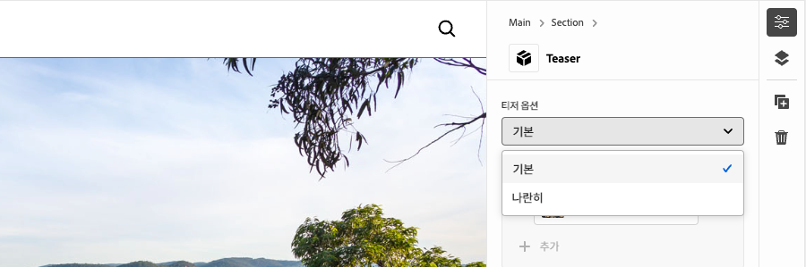

# 옵션을 사용하여 블록 개발

이 자습서는 Edge Delivery Services 및 유니버설 편집기 자습서를 기반으로 하며, 블록에 블록 옵션을 추가하는 프로세스를 안내합니다. 블록 옵션을 정의하여 블록의 모양과 기능을 사용자 정의하여 다양한 콘텐츠 요구 사항에 맞게 다양한 변형을 활성화할 수 있습니다. 이를 통해 사이트의 디자인 시스템 내에서 유연성과 재사용성을 높일 수 있습니다.

{align="center"}

이 자습서에서는 블록 옵션을 티저 블록에 추가하여 작성자가 **기본**&#x200B;과 **나란히** 중 하나를 선택할 수 있습니다. **기본** 옵션은 텍스트 위와 뒤에 이미지를 표시하지만 **나란히** 옵션은 이미지와 텍스트를 나란히 표시합니다.

## 일반적인 사용 사례

**Edge Delivery Services** 및 **유니버설 편집기** 개발에서 **차단 옵션**&#x200B;을 사용하는 일반적인 사용 사례는 다음과 같지만 이에 국한되지 않습니다.

1. **레이아웃 변형:** 레이아웃 간에 쉽게 전환할 수 있습니다. 예를 들어, 가로와 세로 또는 격자와 목록이 있습니다.
2. **스타일 변경:** 테마 또는 시각적 처리 간에 쉽게 전환할 수 있습니다. 예를 들어 밝은 텍스트와 어두운 모드 또는 큰 텍스트와 작은 텍스트가 있습니다.
3. **컨텐츠 표시 컨트롤:** 요소의 가시성을 전환하거나 컨텐츠 스타일 간에 전환합니다(간결한 것과 자세한 것).

이러한 옵션은 동적이고 적응성 있는 블록을 작성하는 데 유연성과 효율성을 제공합니다.

이 튜토리얼에서는 티저 블록을 **기본** 및 **나란히** 두 개의 다른 레이아웃으로 표시할 수 있는 레이아웃 변형 사용 사례를 보여 줍니다.

## 블록 모델

티저 블록에 블록 옵션을 추가하려면 `/block/teaser/_teaser.json`에서 JSON 조각을 열고 모델 정의에 새 필드를 추가하십시오. 이 필드는 해당 `name` 속성을 `classes`(으)로 설정합니다. 이 필드는 블록의 Edge Delivery Services HTML에 적용되는 블록 옵션을 저장하기 위해 AEM에서 사용하는 보호된 필드입니다.

### 필드 구성

아래 탭은 단일 CSS 클래스를 사용하여 단일 선택, 여러 CSS 클래스를 사용하여 단일 선택, 여러 CSS 클래스를 사용하여 다중 선택 등 블록 모델에서 블록 옵션을 구성하는 다양한 방법을 보여 줍니다. 이 튜토리얼 [은(는) **단일 CSS 클래스로 선택**&#x200B;에서 사용되는 간단한 접근 방식](#field-configuration-for-this-tutorial)을 구현합니다.

>[!BEGINTABS]

>[!TAB 단일 CSS 클래스로 선택]

이 튜토리얼에서는 작성자가 `select`(드롭다운) 입력 유형을 사용하여 단일 블록 옵션을 선택한 다음 해당 CSS 클래스 하나로 적용되는 방법을 보여 줍니다.

{align="center"}

#### 블록 모델

**기본** 옵션은 빈 문자열(`""`)로 표시되지만 **나란히** 옵션은 `"side-by-side"`을(를) 사용합니다. 옵션의 **name** 및 **value**&#x200B;이(가) 같을 필요는 없지만 **value**&#x200B;이(가) 블록의 HTML에 적용되는 CSS 클래스를 결정합니다. 예를 들어 **Side-by-Side** 옵션의 값은 `side-by-side` 대신 `layout-10`일 수 있습니다. 그러나 CSS 클래스에는 의미 있는 이름을 사용하는 것이 가장 좋으며, 옵션 값의 명확성과 일관성을 보장합니다.

[!BADGE /blocks/teaser/_teaser.json]{type=Neutral tooltip="아래 코드 샘플의 파일 이름입니다."}

```json{highlight="4,8,9-18"}
...
"fields": [
    {
        "component": "select",
        "name": "classes",
        "value": "",
        "label": "Teaser options",
        "valueType": "string",
        "options": [
            {
                "name": "Default",
                "value": ""
            },
            {
                "name": "Side-by-side",
                "value": "side-by-side"
            }
        ]
    }
]
...
```

#### HTML 차단

작성자가 옵션을 선택하면 해당 값이 블록의 HTML에 CSS 클래스로 추가됩니다.

- **기본**&#x200B;을(를) 선택한 경우:

  ```html
  <div class="block teaser">
      <!-- Block content here -->
  </div>
  ```

- **나란히**&#x200B;을(를) 선택한 경우:

  ```html
  <div class="block teaser side-by-side">
      <!-- Block content here -->
  </div>
  ```

이렇게 하면 선택한 열기에 따라 다른 스타일 및 조건부 JavaScript을 적용할 수 있습니다.


>[!TAB 여러 CSS 클래스로 선택]

**이 방법은 이 자습서에서 사용되지 않지만 대체 방법 및 고급 블록 옵션을 보여 줍니다.**

`select` 입력 형식을 사용하면 작성자가 단일 블록 옵션을 선택하여 여러 CSS 클래스에 선택적으로 매핑할 수 있습니다. 이렇게 하려면 CSS 클래스를 공백으로 구분된 값으로 나열합니다.

{align="center"}

#### 블록 모델

예를 들어 **나란히** 옵션은 왼쪽(`side-by-side left`) 또는 오른쪽(`side-by-side right`)에 이미지가 나타나는 변형을 지원할 수 있습니다.

[!BADGE /blocks/teaser/_teaser.json]{type=Neutral tooltip="아래 코드 샘플의 파일 이름입니다."}

```json{highlight="4,8,9-21"}
...
"fields": [
    {
        "component": "select",
        "name": "classes",
        "value": "",
        "label": "Teaser options",
        "valueType": "string",
        "options": [
            {
                "name": "Default",
                "value": ""
            },
            {
                "name": "Side-by-side with Image on left",
                "value": "side-by-side left"
            },
            {
                "name": "Side-by-side with Image on right",
                "value": "side-by-side right"
            }
        ]
    }
]
...
```

#### HTML 차단

작성자가 옵션을 선택하면 해당 값이 블록의 HTML에 공백으로 구분된 CSS 클래스 세트로 적용됩니다.

- **기본**&#x200B;을(를) 선택한 경우:

  ```html
  <div class="block teaser">
      <!-- Block content here -->
  </div>
  ```

- **왼쪽에 이미지가 있는 나란히**&#x200B;를 선택한 경우:

  ```html
  <div class="block teaser side-by-side left">
      <!-- Block content here -->
  </div>
  ```

- **오른쪽에 있는 이미지 나란히**&#x200B;를 선택한 경우:

  ```html
  <div class="block teaser side-by-side right">
      <!-- Block content here -->
  </div>
  ```

이렇게 하면 선택한 옵션에 따라 다른 스타일 및 조건부 JavaScript을 적용할 수 있습니다.


>[!TAB 여러 CSS 클래스를 사용하여 다중 선택]

**이 방법은 이 자습서에서 사용되지 않지만 대체 방법 및 고급 블록 옵션을 보여 줍니다.**

작성자는 `"component": "multiselect"`의 입력 형식을 사용하여 여러 옵션을 동시에 선택할 수 있습니다. 이렇게 하면 여러 디자인 선택 사항을 결합하여 블록 모양을 복잡한 순열 방식으로 만들 수 있습니다.

{align="center"}

### 블록 모델

예를 들어 **나란히**, **왼쪽에 있는 이미지** 및 **오른쪽에 있는 이미지**&#x200B;는 이미지가 왼쪽(`side-by-side left`) 또는 오른쪽(`side-by-side right`)에 있는 변형을 지원할 수 있습니다.

[!BADGE /blocks/teaser/_teaser.json]{type=Neutral tooltip="아래 코드 샘플의 파일 이름입니다."}

```json{highlight="4,6,8,10-21"}
...
"fields": [
    {
        "component": "multiselect",
        "name": "classes",
        "value": [],
        "label": "Teaser options",
        "valueType": "array",
        "options": [
            {
                "name": "Side-by-side",
                "value": "side-by-side"
            },
            {
                "name": "Image on left",
                "value": "left"
            },
            {
                "name": "Image on right",
                "value": "right"
            }
        ]
    }
]
...
```

#### HTML 차단

작성자가 여러 옵션을 선택하면 해당 값이 블록의 HTML에 공백으로 구분된 CSS 클래스로 적용됩니다.

- **나란히** 및 **왼쪽 이미지**&#x200B;를 선택한 경우:

  ```html{highlight="1"}
  <div class="block teaser side-by-side left">
      <!-- Block content here -->
  </div>
  ```

- **나란히** 및 **오른쪽에 있는 이미지**&#x200B;를 선택한 경우:

  ```html{highlight="1"}
  <div class="block teaser side-by-side right">
      <!-- Block content here -->
  </div>
  ```

다중 선택은 유연성을 제공하지만 디자인 순열을 관리하는 데 있어 복잡성을 초래합니다. 제한 없이, 선택 항목이 충돌하면 연결이 끊기거나 브랜드가 맞지 않는 경험이 발생할 수 있습니다.

예:

- **나란히**&#x200B;을 선택하지 않고 **왼쪽 이미지** 또는 **오른쪽 이미지**&#x200B;을(를) 암시적으로 **기본**&#x200B;에 적용합니다. 기본은(는) 항상 이미지를 배경으로 설정하므로 왼쪽 및 오른쪽 정렬은 관련이 없습니다.
- **왼쪽의 이미지**&#x200B;와 **오른쪽의 이미지**&#x200B;를 모두 선택하는 것은 모순입니다.
- **왼쪽의 이미지** 또는 **오른쪽의 이미지** 없이 **나란히**&#x200B;을(를) 선택하면 이미지의 위치가 지정되지 않아 모호할 수 있습니다.

다중 선택을 사용할 때 문제를 방지하고 혼동을 일으키려면 옵션이 잘 계획되고 모든 순열을 테스트해야 합니다. 다중 선택은 레이아웃 변경 선택 사항보다는 &quot;크게&quot; 또는 &quot;강조 표시&quot;와 같이, 충돌을 일으키지 않는 간단한 개선 사항에 가장 적합합니다.


>[!TAB 기본 옵션]

**이 방법은 이 자습서에서 사용되지 않지만 대체 방법 및 고급 블록 옵션을 보여 줍니다.**

범용 편집기에서 페이지에 새 블록 인스턴스를 추가할 때 블록 옵션을 기본값으로 설정할 수 있습니다. 이 작업은 [블록의 정의](../5-new-block.md#block-definition)에서 `classes` 속성의 기본값을 설정하여 수행됩니다.

#### 블록 정의

아래 예제에서는 `classes` 필드의 `value` 속성을 `side-by-side`에 할당하여 기본 옵션을 **나란히**(으)로 설정합니다. 블록 모델에서 해당 블록 옵션 입력은 선택 사항입니다.

동일한 블록에 대해 각각 다른 이름과 클래스를 가진 여러 항목을 정의할 수도 있습니다. 이렇게 하면 유니버설 편집기에서 각각 특정 블록 옵션으로 사전 구성된 개별 블록 항목을 표시할 수 있습니다. 이러한 블록은 편집기에서 별도의 블록으로 표시되지만 코드베이스에는 선택한 옵션을 기반으로 동적으로 렌더링되는 단일 블록이 포함됩니다.

[!BADGE /blocks/teaser/_teaser.json]{type=Neutral tooltip="아래 코드 샘플의 파일 이름입니다."}

```json{highlight="12"}
{
    "definitions": [{
      "title": "Teaser",
      "id": "teaser",
      "plugins": {
        "xwalk": {
          "page": {
            "resourceType": "core/franklin/components/block/v1/block",
            "template": {
              "name": "Teaser",
              "model": "teaser",
              "classes": "side-by-side",
              "textContent_text": "<h2>Enter a title</h2><p>...and body text here!</p>",
              "textContent_cta": "/",
              "textContent_ctaText": "Click me!"
            }
          }
        }
      }
    }],
    "models": [... from previous section ...],
    "filters": []
}
```

>[!ENDTABS]


### 이 자습서에 대한 필드 구성


이 자습서에서는 두 개의 개별 블록 옵션(**기본** 및 **나란히**)을 허용하는 첫 번째 탭에서 위에서 설명한 단일 CSS 클래스로 선택 접근 방식을 사용합니다.

블록의 JSON 조각 내 모델 정의에서 블록 옵션에 대한 단일 선택 필드를 추가합니다. 이 필드를 사용하면 작성자가 기본 레이아웃과 나란히 레이아웃 중에서 선택할 수 있습니다.

[!BADGE /blocks/teaser/_teaser.json]{type=Neutral tooltip="아래 코드 샘플의 파일 이름입니다."}

```json{highlight="7-24"}
{
    "definitions": [...],
    "models": [
        {
            "id": "teaser", 
            "fields": [
                {
                    "component": "select",
                    "name": "classes",
                    "value": "",
                    "label": "Teaser options",
                    "description": "",
                    "valueType": "string",
                    "options": [
                        {
                            "name": "Default",
                            "value": ""
                        },
                        {
                            "name": "Side-by-side",
                            "value": "side-by-side"
                        }
                    ]
                },
                {
                    "component": "reference",
                    "valueType": "string",
                    "name": "image",
                    "label": "Image",
                    "multi": false
                },
                {
                    "component": "text",
                    "valueType": "string",
                    "name": "imageAlt",
                    "label": "Image alt text",
                    "required": true
                },
                {
                    "component": "richtext",
                    "name": "textContent_text",
                    "label": "Text",
                    "valueType": "string",
                    "required": true
                },
                {
                    "component": "aem-content",
                    "name": "textContent_cta",
                    "label": "CTA",
                    "valueType": "string"
                },
                {
                    "component": "text",
                    "name": "textContent_ctaText",
                    "label": "CTA label",
                    "valueType": "string"
                }
            ]
        }
    ],
    "filters": []
}
```

## 유니버설 편집기에서 블록 업데이트

업데이트된 블록 옵션 입력을 유니버설 편집기에서 사용할 수 있도록 하려면 JSON 코드 변경 사항을 GitHub에 배포하고 새 페이지를 만든 다음 **나란히** 옵션을 사용하여 티저 블록을 추가 및 작성한 다음 페이지를 게시하여 미리 봅니다. 게시되면 코딩을 위해 로컬 개발 환경에서 페이지를 로드합니다.

### GitHub에 변경 사항 푸시

블록 옵션을 설정하고 결과 HTML에 대한 개발을 위해 업데이트된 블록 옵션 입력을 유니버설 편집기에서 사용할 수 있도록 하려면 프로젝트가 링크되고 변경 사항이 GitHub 분기(이 경우 `block-options` 분기)에 푸시되어야 합니다.

```bash
# ~/Code/aem-wknd-eds-ue

# Lint the changes to catch any syntax errors
$ npm run lint 

$ git add .
$ git commit -m "Add Teaser block option to JSON file so it is available in Universal Editor"
$ git push origin teaser
```

### 테스트 페이지 만들기

AEM Author 서비스에서 새 페이지를 만들어 개발용 티저 블록을 추가합니다. [Edge Delivery Services 및 Universal Editor 개발자 자습서](../0-overview.md)의 [블록 작성자](../6-author-block.md) 장에 있는 규칙에 따라 `branches` 페이지 아래에 테스트 페이지를 만들고 작업 중인 Git 분기 뒤에 이름을 지정합니다. 이 경우 `block-options`입니다.

### 블록 작성

유니버설 편집기에서 새 **블록 옵션** 페이지를 편집하고 **티저** 블록을 추가하십시오. `block-options` GitHub 분기의 코드를 사용하여 페이지를 로드하려면 URL에 쿼리 매개 변수 `?ref=block-options`을(를) 추가해야 합니다.

이제 블록 대화 상자에 **기본** 및 **나란히** 선택 항목이 있는 **티저 옵션** 드롭다운이 포함됩니다. **나란히**&#x200B;을(를) 선택하고 나머지 콘텐츠 작성을 완료합니다.

{align="center"}

**티저** 블록을 두 개 추가합니다(선택 사항). 하나는 **기본**&#x200B;으로, 다른 하나는 **나란히**&#x200B;로 설정합니다. 이렇게 하면 개발 중에 두 옵션을 나란히 미리 볼 수 있으며 **나란히** 구현이 **기본** 옵션에 영향을 주지 않습니다.

### 미리보기에 게시

티저 블록이 페이지에 추가되면 **게시** 단추를 사용하여 [미리 보기에 페이지를 게시](../6-author-block.md)하고 유니버설 편집기에서 **미리 보기**&#x200B;에 게시를 선택하십시오.

## HTML 차단

블록 개발을 시작하려면 Edge Delivery Services 미리 보기에 의해 노출된 DOM 구조를 검토하는 것부터 시작하십시오. DOM은 JavaScript으로 향상되고 CSS로 스타일링되므로 블록을 빌드하고 사용자 지정할 수 있는 기반을 제공합니다.

>[!BEGINTABS]

>[!TAB 장식할 DOM]

다음은 JavaScript 및 CSS를 사용하여 장식할 대상인 **나란히** 블록 옵션이 선택된 티저 블록의 DOM입니다.

```html{highlight="7"}
...
<body>
    <header/>
    <main>
        <div>
            <!-- Start block HTML -->
            <div class="teaser block side-by-side" data-block-name="teaser" data-block-status="loaded">
                <div>
                    <div>
                    <picture>
                        <source type="image/webp" srcset="./media_15ba2b455e29aca38c1ca653d24c40acaec8a008f.jpeg?width=2000&amp;format=webply&amp;optimize=medium" media="(min-width: 600px)">
                        <source type="image/webp" srcset="./media_15ba2b455e29aca38c1ca653d24c40acaec8a008f.jpeg?width=750&amp;format=webply&amp;optimize=medium">
                        <source type="image/jpeg" srcset="./media_15ba2b455e29aca38c1ca653d24c40acaec8a008f.jpeg?width=2000&amp;format=jpeg&amp;optimize=medium" media="(min-width: 600px)">
                        
                    </picture>
                    </div>
                </div>
                <div>
                    <div>
                    <h2 id="wknd-adventures">WKND Adventures</h2>
                    <p>Join us on one of our next adventures. Browse our list of curated experiences and sign up for one when you're ready to explore with us.</p>
                    <p>Terms and conditions: By signing up, you agree to the rules for participation and booking.</p>
                    <p class="button-container"><a href="/" title="View trips" class="button">View trips</a></p>
                    </div>
                </div>
            </div>     
            <!-- End block HTML -->
        </div>
    </main>
    <footer/>
</body>
...
```

>[!TAB DOM을 찾는 방법]

장식할 DOM을 찾으려면 로컬 개발 환경에서 블록이 있는 페이지를 열고 웹 브라우저의 개발자 도구를 사용하여 블록을 선택한 다음 DOM을 검사합니다. 이를 통해 장식할 관련 요소를 식별할 수 있습니다.

{align="center"}

>[!ENDTABS]

## CSS 차단

`blocks/teaser/teaser.css`을(를) 편집하여 **Side-by-Side** 옵션의 특정 CSS 스타일을 추가하십시오. 이 파일에는 블록의 기본 CSS가 포함되어 있습니다.

**나란히** 옵션의 스타일을 수정하려면 `side-by-side` 클래스로 구성된 티저 블록을 대상으로 하는 범위가 지정된 새 CSS 규칙을 `teaser.css` 파일에 추가하십시오.

```css
.block.teaser.side-by-side { ... }
```

또는 CSS 중첩을 사용하여 보다 간결한 버전을 만들 수 있습니다.

```css
.block.teaser {
    ... Default teaser block styles ...

    &.side-by-side {
        ... Side-by-side teaser block styles ...
    }
}
```

`side-by-side` 클래스가 적용될 때 필요한 CSS 속성을 `&.side-by-side` 규칙 내에 추가하여 블록의 스타일을 지정하십시오.

일반적인 방법은 공유 선택기에 `all: initial`을(를) 적용한 다음 `side-by-side` 변형에 필요한 스타일을 추가하여 기본 스타일을 재설정하는 것입니다. 대부분의 스타일이 옵션에서 공유되는 경우 특정 속성을 오버라이드하는 것이 더 쉬울 수 있습니다. 그러나 여러 선택기를 변경해야 하는 경우 모든 스타일을 재설정하고 필요한 스타일만 다시 적용하면 코드를 더 명확하고 유지 관리할 수 있습니다.
[!BADGE /blocks/teaser/teaser.css]{type=Neutral tooltip="아래 코드 샘플의 파일 이름입니다."}

```css
/* /blocks/teaser/teaser.css */

/* Scope each selector in the block with `.block.teaser` to avoid accidental conflicts outside the block */
.block.teaser {
    animation: teaser-fade-in 1s;
    position: relative;
    width: 1600px;
    max-width: 100vw;
    left: 50%; 
    transform: translateX(-50%);
    height: 500px;
    overflow: hidden; 


    /* The teaser image */
    .image-wrapper {
        position: absolute;
        z-index: -1;
        inset: 0;
        box-sizing: border-box;
        overflow: hidden; 

        .image {
            object-fit: cover;
            object-position: center;
            width: 100%;
            height: 100%;
            transform: scale(1); 
            transition: transform 0.6s ease-in-out;

            .zoom {
                transform: scale(1.1);
            }            
        }
    }

    /* The teaser text content */
    .content {
        position: absolute;
        bottom: 0;
        left: 50%;
        transform: translateX(-50%);
        background: var(--background-color);
        padding: 1.5rem 1.5rem 1rem;
        width: 80vw;
        max-width: 1200px;
  
        .title {
            font-size: var(--heading-font-size-xl);
            margin: 0;
        }

        .title::after {
            border-bottom: 0;
        }

        p {
            font-size: var(--body-font-size-s);
            margin-bottom: 1rem;
            animation: teaser-fade-in .6s;
        }

        p.terms-and-conditions {
            font-size: var(--body-font-size-xs);
            color: var(--secondary-color);
            padding: .5rem 1rem;
            font-style: italic;
            border: solid var(--light-color);
            border-width: 0 0 0 10px;
        }

        /* Add underlines to links in the text */
        a:hover {
            text-decoration: underline;
        }

        /* Add specific spacing to buttons. These button CSS classes are automatically added by Edge Delivery Services. */
        .button-container {
            margin: 0;
            padding: 0;        

            .button {   
                background-color: var(--primary-color);
                border-radius: 0;
                color: var(--dark-color);
                font-size: var(--body-font-size-xs);
                font-weight: bold;
                padding: 1em 2.5em;
                margin: 0;
                text-transform: uppercase;
            }
        }
    }

    /**
    *  Add styling for the side-by-side variant 
    **/

    /* This evaluates to .block.teaser.side-by-side */
    &.side-by-side {    
        /* Since this default teaser option doesn't have a style (such as `.default`), we use `all: initial` to reset styles rather than overriding individual styles. */
        all: initial;
        display: flex;
        margin: auto;
        max-width: 900px;

        .image-wrapper {
            all: initial;
            flex: 2;
            overflow: hidden;                 
            
            * {
                height: 100%;
            }        

            .image {
                object-fit: cover;
                object-position: center;
                width: 100%;
                height: 100%;
                transform: scale(1); 
                transition: transform 0.6s ease-in-out;                

                &.zoom {
                    /* This option has a different zoom level than the default */
                    transform: scale(1.5);
                }
            }
        }

        .content {
            all: initial;
            flex: 1;
            background-color: var(--light-color);
            padding: 3.5em 2em 2em;
            font-size: var(--body-font-size-s);
            font-family: var(--body-font-family);
            text-align: justify;
            text-justify: newspaper;
            hyphens: auto;

            p.terms-and-conditions {
                border: solid var(--text-color);
                border-width: 0;
                padding-left: 0;
                text-align: left;
            }
        }

        /* Media query for mobile devices */
        @media (width <= 900px) {
            flex-direction: column; /* Stack elements vertically on mobile */
        }
    }
}

/** Animations 
    Scope the @keyframes to the block (teaser) to avoid accidental conflicts outside the block

    Global @keyframes can defines in styles/styles.css and used in this file.
**/
@keyframes teaser-fade-in {
    from {
        opacity: 0;
    }

    to {
        opacity: 1;
    }
}
```


## JavaScript 차단

블록에 대한 활성 옵션을 식별하는 것은 블록 요소에 적용된 클래스를 확인함으로써 간단합니다. 이 예제에서는 활성 옵션에 따라 `.image-wrapper` 스타일을 적용할 위치를 조정해야 합니다.

`getOptions` 함수는 `block` 및 `teaser`을(를) 제외하고 블록에 적용된 클래스 배열을 반환합니다(모든 블록에는 `block` 클래스가 있고 모든 티저 블록에는 `teaser` 클래스가 있으므로). 배열에 남아 있는 모든 클래스는 활성 옵션을 나타냅니다. 배열이 비어 있으면 기본 옵션이 적용됩니다.

```javascript
function getOptions(block) {
  // Get the block's classes, excluding 'block' and 'teaser'; anything remaining is a block option.
  return [...block.classList].filter((c) => !['block', 'teaser'].includes(c));
}
```

이 옵션 목록은 블록의 JavaScript에서 사용자 지정 논리를 조건부로 실행하는 데 사용할 수 있습니다.

```javascript
if (getOptions(block).includes('side-by-side')) {
  /* For side-by-side teaser, add the image-wrapper to a higher-level div to support CSS */
  block.querySelector(':scope > div:first-child').classList.add('image-wrapper');
} else if (!getOptions(block)) {
  /* For the default option, add the image-wrapper to the picture element to support CSS */
  block.querySelector('picture').classList.add('image-wrapper');
}
```

기본값 및 나란히 옵션을 모두 사용하여 티저 블록에 대해 완전히 업데이트된 JavaScript 파일은 다음과 같습니다.

[!BADGE /blocks/teaser/teaser.js]{type=Neutral tooltip="아래 코드 샘플의 파일 이름입니다."}

```javascript
/* /blocks/teaser/teaser.js */

/**
 * Block options are applied as classes to the block's DOM element
 * alongside the `block` and `<block-name>` classes.
 *
 * @param {HTMLElement} block represents the block's DOM element/tree
 */
function getOptions(block) {
  // Get the block's classes, excluding 'block' and 'teaser'.
  return [...block.classList].filter((c) => !['block', 'teaser'].includes(c));
}

/**
 * Adds a zoom effect to the image using event listeners.
 *
 * When the CTA button is hovered over, the image zooms in.
 *
 * @param {HTMLElement} block represents the block's DOM tree
 */
function addEventListeners(block) {
  block.querySelector('.button').addEventListener('mouseover', () => {
    block.querySelector('.image').classList.add('zoom');
  });

  block.querySelector('.button').addEventListener('mouseout', () => {
    block.querySelector('.image').classList.remove('zoom');
  });
}

/**
 * Entry point to the block's JavaScript.
 * Must be exported as default and accept a block's DOM element.
 * This function is called by the project's style.js, passing the block's element.
 *
 * @param {HTMLElement} block represents the block's DOM element/tree
 */
export default function decorate(block) {
  /* Common treatments for all options */
  block.querySelector(':scope > div:last-child').classList.add('content');
  block.querySelector('h1,h2,h3,h4,h5,h6').classList.add('title');
  block.querySelector('img').classList.add('image');

  // Process each paragraph and mark it as text or terms-and-conditions
  block.querySelectorAll('p').forEach((p) => {
    const innerHTML = p.innerHTML?.trim();
    if (innerHTML?.startsWith('Terms and conditions:')) {
      p.classList.add('terms-and-conditions');
    }
  });

  /* Conditional treatments for specific options */
  if (getOptions(block).includes('side-by-side')) {
    /* For side-by-side teaser, add the image-wrapper to a higher-level div to support CSS */
    block.querySelector(':scope > div:first-child').classList.add('image-wrapper');
  } else if (!getOptions(block)) {
    /* For the default option, add the image-wrapper to the picture element to support CSS */
    block.querySelector('picture').classList.add('image-wrapper');
  }

  addEventListeners(block);
}
```

## 개발 미리보기

CSS와 JavaScript이 추가되면 AEM CLI의 로컬 개발 환경은 변경 사항을 핫 로드하여, 코드가 블록에 미치는 영향을 빠르고 쉽게 시각화할 수 있습니다. CTA 위로 마우스를 가져간 후 티저의 이미지가 확대되고 축소되는지 확인합니다.


## 코드 린트

코드 변경 내용을 깔끔하고 일관되게 유지하려면 [자주 lint](../3-local-development-environment.md#linting)해야 합니다. 정기적인 린팅은 문제를 조기에 발견하는 데 도움이 되므로 전반적인 개발 시간이 단축됩니다. 모든 린팅 문제가 해결될 때까지 개발 작업을 `main` 분기에 병합할 수 없습니다.

```bash
# ~/Code/aem-wknd-eds-ue

$ npm run lint
```

## 유니버설 편집기에서 미리 보기

AEM의 유니버설 편집기에서 변경 사항을 보려면 변경 사항을 추가하고, 커밋한 다음 유니버설 편집기에서 사용하는 Git 저장소 분기에 푸시합니다. 이렇게 하면 블록 구현이 작성 경험을 중단하지 않습니다.

```bash
# ~/Code/aem-wknd-eds-ue

$ git add .
$ git commit -m "CSS and JavaScript implementation for Teaser block option Side-by-side"
# JSON files are compiled automatically and added to the commit via a Husky pre-commit hook
$ git push origin block-options
```

이제 `?ref=block-options` 쿼리 매개 변수를 사용할 때 유니버설 편집기에 변경 내용이 표시됩니다.

{align="center"}


## 축하합니다!

이제 Edge Delivery Services 및 유니버설 편집기의 블록 옵션을 살펴보았으므로, 콘텐츠 편집을 보다 유연하게 사용자 정의하고 간소화할 수 있는 도구를 제공합니다. 효율성을 개선하고 일관성을 유지하기 위해 프로젝트에 이러한 옵션을 적용하십시오.

더 많은 모범 사례와 고급 기술을 보려면 [유니버설 편집기 설명서](https://experienceleague.adobe.com/en/docs/experience-manager-cloud-service/content/edge-delivery/wysiwyg-authoring/create-block#block-options)를 확인하십시오.
