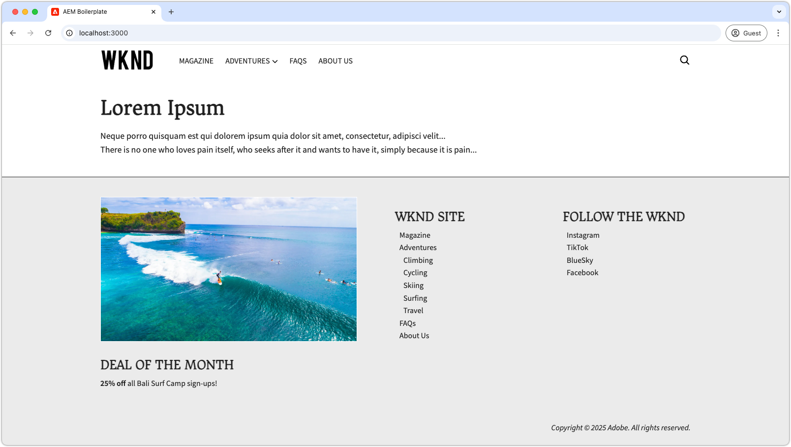

# 머리글 및 바닥글 개발

{align="center"}

머리글 및 바닥글은 Edge Delivery Services(EDS)에서 고유한 역할을 하며, HTML의 `<header>` 및 `<footer>` 요소에 직접 바인딩됩니다. 일반 페이지 콘텐츠와 달리 별도로 관리되며, 전체 페이지 캐시를 삭제할 필요 없이 독립적으로 업데이트할 수 있습니다. 구현은 코드 프로젝트 내의 `blocks/header` 및 `blocks/footer` 경로에 블록으로 존재하지만 작성자는 블록의 모든 조합을 포함할 수 있는 전용 AEM 페이지를 통해 해당 콘텐츠를 편집할 수 있습니다.

## 머리글 블록

{align="center"}

머리글은 Edge Delivery Services HTML `<header>` 요소에 바인딩된 특수 블록입니다.
`<header>` 요소는 비어 있는 상태로 전달되고 XHR(AJAX)을 통해 별도의 AEM 페이지에 채워집니다.
이를 통해 머리글을 페이지 콘텐츠와 별도로 관리할 수 있으며, 모든 페이지의 캐시를 완전히 삭제하지 않고도 업데이트할 수 있습니다.

머리글 블록은 머리글 콘텐츠를 포함하는 AEM 페이지 조각을 요청하고 이를 `<header>` 요소에서 렌더링하는 역할을 합니다.

[!BADGE /blocks/header/header.js]{type=Neutral tooltip="아래 코드 샘플의 파일 이름입니다."}

```javascript
import { getMetadata } from '../../scripts/aem.js';
import { loadFragment } from '../fragment/fragment.js';

...

export default async function decorate(block) {
  // load nav as fragment

  // Get the path to the AEM page fragment that defines the header content from the <meta name="nav"> tag. This is set via the site's Metadata file.
  const navMeta = getMetadata('nav');

  // If the navMeta is not defined, use the default path `/nav`.
  const navPath = navMeta ? new URL(navMeta, window.location).pathname : '/nav';

  // Make an XHR (AJAX) call to request the AEM page fragment and serialize it to a HTML DOM tree.
  const fragment = await loadFragment(navPath);
  
  // Add the content from the fragment HTML to the block and decorate it as needed
  ...
}
```

`loadFragment()` 함수는 `${navPath}.plain.html`에 XHR(AJAX) 요청을 보내며, 이는 해당 AEM 페이지의 `<main>` 태그 내에 존재하는 HTML을 EDS HTML 렌디션으로 반환합니다. 그런 다음 포함된 블록으로 반환된 콘텐츠를 처리하고, 업데이트된 DOM 트리를 반환합니다.

## 머리글 페이지 작성

머리글 블록을 개발하기 전에 먼저 범용 편집기에서 머리글 블록의 내용을 작성하여 개발할 내용을 준비합니다.

머리글 콘텐츠는 `nav`라는 전용 AEM 페이지에 있습니다.

{align="center"}

머리글을 작성하려면 다음 작업을 수행하십시오.

1. 범용 편집기에서 `nav` 페이지 열기
1. 기본 버튼을 WKND 로고가 포함된 **이미지 블록**&#x200B;으로 바꾸기
1. **텍스트 블록**&#x200B;에서 다음 작업을 수행하여 탐색 메뉴 업데이트:
   - 원하는 탐색 링크 추가
   - 필요한 곳에 하위 탐색 항목 만들기
   - 모든 링크를 홈 페이지(`/`)로 설정

{align="center"}

### 미리보기에 게시

머리글 페이지를 업데이트한 후 [해당 페이지를 미리보기에 게시](../6-author-block.md)합니다.

머리글 콘텐츠는 자체 페이지(`nav` 페이지)에 존재하므로, 머리글 변경 사항을 적용하려면 해당 페이지를 별도로 게시해야 합니다. 해당 머리글을 사용하는 다른 페이지를 게시해도 Edge Delivery Services의 머리글 콘텐츠는 업데이트되지 않습니다.

## 블록 HTML

블록 개발을 시작하려면 먼저 Edge Delivery Services 미리보기에서 노출되는 DOM 구조를 검토합니다. DOM은 JavaScript로 강화되고 CSS로 스타일이 지정되어 블록을 빌드하고 사용자 정의하기 위한 기반을 제공합니다.

머리글은 조각으로 로드되기 때문에 `loadFragment()`를 통해 DOM에 주입되고 장식된 후 XHR 요청에서 반환되는 HTML을 검사해야 합니다. 이 작업은 브라우저의 개발자 도구에서 DOM을 검사하여 수행할 수 있습니다.


>[!BEGINTABS]

>[!TAB DOM 장식]

다음은 제공된 `header.js`를 사용하여 머리글 페이지가 로드된 후 DOM에 주입된 HTML입니다.

```html
<header class="header-wrapper">
  <div class="header block" data-block-name="header" data-block-status="loaded">
    <div class="nav-wrapper">
      <nav id="nav" aria-expanded="true">
        <div class="nav-hamburger">
          <button type="button" aria-controls="nav" aria-label="Close navigation">
            <span class="nav-hamburger-icon"></span>
          </button>
        </div>
        <div class="section nav-brand" data-section-status="loaded" style="">
          <div class="default-content-wrapper">
            <p class="">
              <a href="#" title="Button" class="">Button</a>
            </p>
          </div>
        </div>
        <div class="section nav-sections" data-section-status="loaded" style="">
          <div class="default-content-wrapper">
            <ul>
              <li aria-expanded="false">Examples</li>
              <li aria-expanded="false">Getting Started</li>
              <li aria-expanded="false">Documentation</li>
            </ul>
          </div>
        </div>
        <div class="section nav-tools" data-section-status="loaded" style="">
          <div class="default-content-wrapper">
            <p>
              <span class="icon icon-search">
                
              </span>
            </p>
          </div>
        </div>
      </nav>
    </div>
  </div>
</header>
```

>[!TAB DOM을 찾는 방법]

웹 브라우저의 개발자 도구에서 페이지의 `<header>` 요소를 찾아 검사합니다.

{align="center"}

>[!ENDTABS]


## 블록 JavaScript

[AEM 보일러플레이트 XWalk 프로젝트 템플릿](https://github.com/adobe-rnd/aem-boilerplate-xwalk)의 `/blocks/header/header.js` 파일은 드롭다운 메뉴와 반응형 모바일 보기를 포함한 탐색용 JavaScript를 제공합니다.

`header.js` 스크립트는 사이트 디자인에 맞게 많이 맞춤화되는 경우가 많지만 머리글 페이지 조각을 검색하고 처리하는 `decorate()`의 첫 부분 코드는 반드시 유지하는 것이 중요합니다.

[!BADGE /blocks/header/header.js]{type=Neutral tooltip="아래 코드 샘플의 파일 이름입니다."}

```javascript
export default async function decorate(block) {
  // load nav as fragment
  const navMeta = getMetadata('nav');
  const navPath = navMeta ? new URL(navMeta, window.location).pathname : '/nav';
  const fragment = await loadFragment(navPath);
  ...
```

나머지 코드는 프로젝트의 필요에 맞게 수정할 수 있습니다.

머리글 요구 사항에 따라 보일러플레이트 코드를 조정하거나 제거할 수 있습니다. 이 튜토리얼에서는 제공된 코드를 사용하고, 첫 번째로 작성된 이미지 주위에 하이퍼링크를 추가하여 사이트의 홈 페이지로 연결하는 방법을 개선해 보겠습니다.

템플릿의 코드는 머리글 페이지 조각을 처리하며, 조각이 다음 순서로 세 개의 섹션으로 구성되어 있다고 가정합니다.

1. **브랜드 섹션** - 로고를 포함하며, `.nav-brand` 클래스로 스타일이 지정되어 있습니다.
2. **섹션** - 사이트의 기본 메뉴를 정의하며, `.nav-sections`로 스타일이 지정되어 있습니다.
3. **도구 섹션** - 검색, 로그인/로그아웃 및 프로필과 같은 요소를 포함하며, `.nav-tools`로 스타일이 지정되어 있습니다.

로고 이미지를 홈 페이지에 하이퍼링크로 연결하려면 다음과 같이 블록 JavaScript를 업데이트합니다.

>[!BEGINTABS]

>[!TAB 업데이트된 JavaScript]

아래는 로고 이미지를 사이트의 홈 페이지(`/`) 링크로 래핑하도록 업데이트한 코드입니다.

[!BADGE /blocks/header/header.js]{type=Neutral tooltip="아래 코드 샘플의 파일 이름입니다."}

```javascript
export default async function decorate(block) {

  ...
  const navBrand = nav.querySelector('.nav-brand');
  
  // WKND: Turn the picture (image) into a linked site logo
  const logo = navBrand.querySelector('picture');
  
  if (logo) {
    // Replace the first section's contents with the authored image wrapped with a link to '/' 
    navBrand.innerHTML = `<a href="/" aria-label="Home" title="Home" class="home">${logo.outerHTML}</a>`;
    // Make sure the logo is not lazy loaded as it's above the fold and can affect page load speed
    navBrand.querySelector('img').settAttribute('loading', 'eager');
  }

  const navSections = nav.querySelector('.nav-sections');
  if (navSections) {
    // WKND: Remove Edge Delivery Services button containers and buttons from the nav sections links
    navSections.querySelectorAll('.button-container, .button').forEach((button) => {
      button.classList = '';
    });

    ...
  }
  ...
}
```

>[!TAB 원본 JavaScript]

아래는 템플릿에서 생성된 원본 `header.js`입니다.

[!BADGE /blocks/header/header.js]{type=Neutral tooltip="아래 코드 샘플의 파일 이름입니다."}

```javascript
export default async function decorate(block) {
  ...
  const navBrand = nav.querySelector('.nav-brand');
  const brandLink = navBrand.querySelector('.button');
  if (brandLink) {
    brandLink.className = '';
    brandLink.closest('.button-container').className = '';
  }

  const navSections = nav.querySelector('.nav-sections');
  if (navSections) {
    navSections.querySelectorAll(':scope .default-content-wrapper > ul > li').forEach((navSection) => {
      if (navSection.querySelector('ul')) navSection.classList.add('nav-drop');
      navSection.addEventListener('click', () => {
        if (isDesktop.matches) {
          const expanded = navSection.getAttribute('aria-expanded') === 'true';
          toggleAllNavSections(navSections);
          navSection.setAttribute('aria-expanded', expanded ? 'false' : 'true');
        }
      });
    });
  }
  ...
}
```

>[!ENDTABS]


## 블록 CSS

WKND 브랜드에 맞게 `/blocks/header/header.css` 스타일을 업데이트합니다.

튜토리얼에서 변경한 내용을 더 쉽게 확인하고 이해할 수 있도록 사용자 정의 CSS를 `header.css` 맨 아래에 추가하겠습니다. 이러한 스타일을 템플릿의 CSS 규칙에 직접 통합할 수도 있지만 별도로 유지하면 수정된 내용을 보여 주는 데 도움이 됩니다.

새 규칙을 원래 규칙 세트 뒤에 추가하기 때문에 `header .header.block nav` CSS 선택기로 래핑하여 템플릿 규칙보다 우선 적용되도록 하겠습니다.

[!BADGE /blocks/header/header.css]{type=Neutral tooltip="아래 코드 샘플의 파일 이름입니다."}

```css
/* /blocks/header/header.css */

... Existing CSS generated by the template ...

/* Add the following CSS to the end of the header.css */

/** 
* WKND customizations to the header 
* 
* These overrides can be incorporated into the provided CSS,
* however they are included discretely in thus tutorial for clarity and ease of addition.
* 
* Because these are added discretely
* - They are added to the bottom to override previous styles.
* - They are wrapped in a header .header.block nav selector to ensure they have more specificity than the provided CSS.
* 
**/

header .header.block nav {
  /* Set the height of the logo image.
     Chrome natively sets the width based on the images aspect ratio */
  .nav-brand img {
    height: calc(var(--nav-height) * .75);
    width: auto;
    margin-top: 5px;
  }
  
  .nav-sections {
    /* Update menu items display properties */
    a {
      text-transform: uppercase;
      background-color: transparent;
      color: var(--text-color);
      font-weight: 500;
      font-size: var(--body-font-size-s);
    
      &:hover {
        background-color: auto;
      }
    }

    /* Adjust some spacing and positioning of the dropdown nav */
    .nav-drop {
      &::after {
        transform: translateY(-50%) rotate(135deg);
      }
      
      &[aria-expanded='true']::after {
        transform: translateY(50%) rotate(-45deg);
      }

      & > ul {
        top: 2rem;
        left: -1rem;      
       }
    }
  }
```

## 개발 미리보기

CSS와 JavaScript를 개발하면 AEM CLI의 로컬 개발 환경이 변경 사항을 핫 리로드하여 코드가 블록에 미치는 영향을 빠르고 쉽게 시각화할 수 있게 해 줍니다. CTA 위에 마우스를 가져다 대고 티저 이미지가 확대/축소되는지 확인하십시오.

{align="center"}

## 코드 린트

코드 변경 사항을 [자주 린트](../3-local-development-environment.md#linting)하여 코드를 깔끔하고 일관되게 유지하십시오. 정기적인 린트는 문제를 일찍 발견하여 전체 개발 시간을 줄이는 데 도움이 됩니다. 모든 린트 문제가 해결되어야 개발 작업을 `main` 분기에 병합할 수 있습니다.

```bash
# ~/Code/aem-wknd-eds-ue

$ npm run lint
```

## 범용 편집기에서 미리 보기

AEM의 범용 편집기에서 변경 사항을 보려면 범용 편집기에서 사용하는 Git 저장소 분기에 변경 사항을 추가하고, 커밋하고, 푸시하십시오. 이렇게 하면 블록 구현이 작성 경험을 방해하지 않도록 할 수 있습니다.

```bash
# ~/Code/aem-wknd-eds-ue

$ git add .
$ git commit -m "CSS and JavaScript implementation for Header block"
# JSON files are compiled automatically and added to the commit via a Husky pre-commit hook
$ git push origin header-and-footer
```

이제 `?ref=header-and-footer` 쿼리 매개변수를 사용하면 범용 편집기에서 변경 사항을 볼 수 있습니다.

{align="center"}

## 바닥글

머리글과 마찬가지로, 바닥글 콘텐츠도 전용 AEM 페이지(이 경우 바닥글 페이지(`footer`))에서 작성됩니다. 바닥글은 조각으로 로드되고 CSS와 JavaScript로 장식되는 동일한 패턴을 따릅니다.

>[!BEGINTABS]

>[!TAB 바닥글]

바닥글은 다음과 같은 세 개의 열로 구성된 레이아웃으로 구현해야 합니다.

- 왼쪽 열: 프로모션 이미지 및 텍스트 포함
- 가운데 열: 탐색 링크 포함
- 오른쪽 열: 소셜 미디어 링크 포함
- 하단 행: 저작권 정보 포함, 나머지 세 개 열을 가로지름

{align="center"}

>[!TAB 바닥글 콘텐츠]

바닥글 페이지에서 열 블록을 사용하여 세 개의 열 효과를 만듭니다.

| 열 1 | 열 2 | 열 3 |
| ---------|----------------|---------------|
| 이미지 | 제목 3 | 제목 3 |
| 텍스트 | 링크 목록 | 링크 목록 |

{align="center"}

>[!TAB 바닥글 코드]

아래 CSS는 바닥글 블록을 세 개의 열 레이아웃으로 스타일 지정하며, 일정한 간격과 타이포그래피를 적용합니다. 바닥글 구현은 템플릿에서 제공하는 JavaScript만 사용합니다.

[!BADGE /blocks/footer/footer.css]{type=Neutral tooltip="아래 코드 샘플의 파일 이름입니다."}

```css
/* /blocks/footer/footer.css */

footer {
  background-color: var(--light-color);

  .block.footer {
    border-top: solid 1px var(--dark-color);
    font-size: var(--body-font-size-s);

    a { 
      all: unset;
      
      &:hover {
        text-decoration: underline;
        cursor: pointer;
      }
    }

    img {
      width: 100%;
      height: 100%;
      object-fit: cover;
      border: solid 1px white;
    }

    p {
      margin: 0;
    }

    ul {
      list-style: none;
      padding: 0;
      margin: 0;

      li {
        padding-left: .5rem;
      }
    }

    & > div {
      margin: auto;
      max-width: 1200px;
    }

    .columns > div {
      gap: 5rem;
      align-items: flex-start;

      & > div:first-child {
        flex: 2;
      }
    }

    .default-content-wrapper {
      padding-top: 2rem;
      margin-top: 2rem;
      font-style: italic;
      text-align: right;
    }
  }
}

@media (width >= 900px) {
  footer .block.footer > div {
    padding: 40px 32px 24px;
  }
}
```


>[!ENDTABS]

## 축하합니다!

이제 Edge Delivery Services와 범용 편집기에서 머리글과 바닥글이 어떻게 관리되고 개발되는지 살펴보았습니다. 머리글과 바닥글에 대해 학습한 내용은 다음과 같습니다.

- 주요 콘텐츠와 분리된 전용 AEM 페이지에서 작성됨
- 독립적인 업데이트가 가능하도록 조각으로 비동기 로드됨
- JavaScript와 CSS로 장식되어 반응형 탐색 경험을 제공함
- 범용 편집기와 완벽하게 통합되어 손쉬운 콘텐츠 관리가 가능함

이 패턴은 사이트 전체 탐색 구성 요소를 구현하기 위한 유연하고 유지 관리가 용이한 접근 방식을 제공합니다.

더 많은 모범 사례와 고급 기술을 알아보려면 [범용 편집기 설명서](https://experienceleague.adobe.com/ko/docs/experience-manager-cloud-service/content/edge-delivery/wysiwyg-authoring/create-block#block-options)를 확인하십시오.
